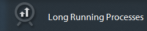
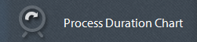
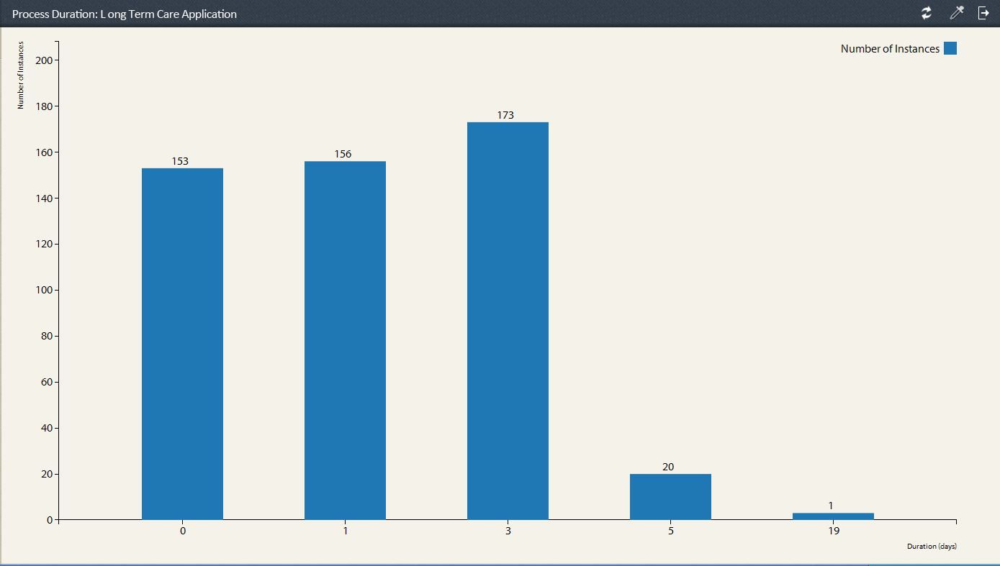

# Vooraf gedefinieerde rapporten in procesrapportage {#pre-defined-reports-in-process-reporting}

## Vooraf gedefinieerde rapporten in procesrapportage {#pre-defined-reports-in-process-reporting-1}

AEM Forms Process Reporting biedt de volgende *out-of-the-box* -rapporten:

* **[Lange processen](#long-running-processes)**: Een rapport van alle processen van Vormen AEM die meer dan een gespecificeerde tijd kostten om te voltooien
* **[Tijdschema](#process-duration-report)**proces: Een rapport van een opgegeven AEM Forms-proces op duur
* **[Volume](#workflow-volume-report)**werkstroom: Een rapport van de lopende en voltooide instanties van gespecificeerd proces door datum

## Lange processen {#long-running-processes}

Het rapport Lange actieve processen geeft de AEM Forms-processen weer die meer dan een opgegeven tijd in beslag hebben genomen.

### Een lang lopend procesrapport uitvoeren {#to-execute-a-long-running-process-report}

1. Als u de lijst met vooraf gedefinieerde rapporten in Process Reporting wilt weergeven, klikt u op het knooppunt **Reports** in de **** boomstructuurweergave Process Reporting.
1. Klik op het rapportknooppunt **Lange actieve processen** .

   

   Wanneer u een rapport selecteert, wordt het deelvenster **Rapportparameters** rechts van de structuurweergave weergegeven.

   

   Parameters:

   * **Duur** (*verplicht*): Geef een duur en tijdseenheid op. Geef alle processen van AEM-formulieren weer die langer dan de opgegeven duur zijn uitgevoerd.
   * **Gestart na** (*optioneel*): Selecteer een datum. Filter het rapport om procesinstanties weer te geven die na de opgegeven datum zijn gestart.
   * **Gestart voor** (*optioneel*): Selecteer een datum. Filter het rapport om procesinstanties weer te geven die vóór de opgegeven datum zijn gestart.

1. Klik op **Ga** om het rapport uit te voeren.

   Het rapport wordt weergegeven in het deelvenster **Rapport** rechts van het venster **Process Reporting** .

   

   Gebruik de opties in de hogere juiste hoek van het paneel van het **Rapport** om de volgende verrichtingen op het rapport uit te voeren.

   * **Vernieuwen**: Verfrist het rapport met de recentste gegevens die in de opslag liggen
   * **De legendarische kleur** wijzigen: De kleur van de legenda van het rapport selecteren en wijzigen
   * **Exporteren naar CSV**: De gegevens van het rapport exporteren en downloaden naar een bestand met komma&#39;s als scheidingsteken

## Rapport Procesduur {#process-duration-report}

In het rapport Procesduur wordt het aantal exemplaren van een Forms-proces weergegeven met het aantal dagen dat elke instantie is uitgevoerd.

### Een rapport over de procesduur uitvoeren {#to-execute-a-process-duration-report}

1. Klik op het knooppunt **Rapporten** om de vooraf gedefinieerde rapporten in Process Reporting (Procesrapportage **) weer te geven in de structuurweergave** Process Reporting (Rapportverwerken).
1. Klik de het rapportknoop van de Duur van **Processen** .

   

   Wanneer u een rapport selecteert, wordt het deelvenster **Rapportparameters** rechts van de structuurweergave weergegeven.

   

   Parameters:

   * **Proces** selecteren (*verplicht*): Selecteer een AEM-formulierproces.

1. Klik op **Ga** om het rapport uit te voeren.

   Het rapport toont in het paneel van het **Rapport** op het recht van het venster van de Rapportering van het Proces.

   

   Gebruik de opties in de hogere juiste hoek van het paneel van het **Rapport** om de volgende verrichtingen op het rapport uit te voeren.

   * **Vernieuwen**: Verfrist het rapport met de recentste gegevens die in de opslag liggen
   * **De legendarische kleur** wijzigen: De kleur van de legenda van het rapport selecteren en wijzigen
   * **Exporteren naar CSV**: De gegevens van het rapport exporteren en downloaden naar een bestand met komma&#39;s als scheidingsteken

## Workflow Volume-rapport {#workflow-volume-report}

Het rapport Workflow Volume geeft het aantal exemplaren van een AEM Forms-proces dat momenteel wordt uitgevoerd en voltooid, per kalenderdag weer.

### Om een rapport van het Volume van het Werkschema uit te voeren {#to-execute-a-workflow-volume-report}

1. Klik op het knooppunt **Rapporten** om de vooraf gedefinieerde rapporten in Process Reporting (Procesrapportage **) weer te geven in de structuurweergave** Process Reporting (Rapportverwerken).
1. Klik op het rapportknooppunt **Workflowvolume** .

   

   Wanneer u een rapport selecteert, wordt het deelvenster **Rapportparameters** rechts van de structuurweergave weergegeven.

   

   Parameters:

   * **Proces** selecteren (*verplicht*): Selecteer een AEM-formulierproces.

   * **Gestart na** (*optioneel*): Selecteer een datum. Filtert het rapport om procesinstanties te tonen die na de gespecificeerde datum begonnen zijn.

   * **Gestart voor** (*optioneel*): Selecteer een datum. Filtert het rapport om procesinstanties te tonen die vóór de gespecificeerde datum begonnen.

1. Klik op **Ga** om het rapport uit te voeren.

   Het rapport wordt weergegeven in het deelvenster **Rapport** rechts van het venster **Process Reporting** .

   

   Gebruik de opties in de hogere juiste hoek van het paneel van het **Rapport** om de volgende verrichtingen op het rapport uit te voeren.

   * **Vernieuwen**: Verfrist het rapport met de recentste gegevens die in de opslag liggen
   * **De legendarische kleur** wijzigen: De kleur van de legenda van het rapport selecteren en wijzigen
   * **Exporteren naar CSV**: De gegevens van het rapport exporteren en downloaden naar een bestand met komma&#39;s als scheidingsteken

[Contact opnemen met ondersteuning](https://www.adobe.com/account/sign-in.supportportal.html)
