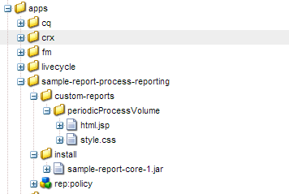
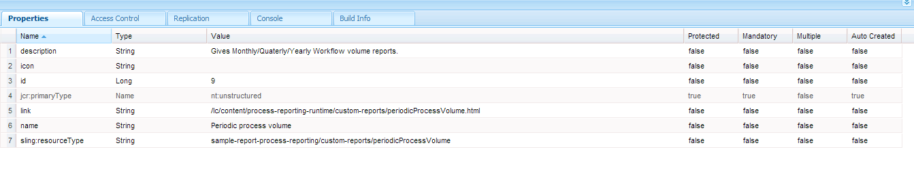

# Aangepaste rapporten in procesrapportage{#custom-reports-in-process-reporting}

U kunt REST interface van QueryBuilder gebruiken of de dienst tot stand brengen OSGi gebruikend QueryBuilder API om een douanerapport tot stand te brengen.

## Algemene stappen om een aangepast rapport te maken {#generic-steps-to-build-a-custom-report}

Alvorens om het even welk douanerapport toe te voegen, voer de volgende malplaatjeprocedure uit:

1. Gegevens die worden gebruikt in aangepaste rapporten, moeten beschikbaar zijn in Process Reporting. Om de beschikbaarheid van gegevens te verzekeren, plant een bouwbaan of gebruik **[Sync](https://helpx.adobe.com/livecycle/help/process-reporting/install-start-process-reporting.html#Process%20Reporting%20Home%20screen)** optie op het Proces Meldend UI.
1. Het URL-verzoek (de gewenste query wordt ingekapseld) moet een geschikt queryresultaatobject retourneren. Om een vraag tot stand te brengen, kunt u REST interface van [QueryBuilder](https://docs.adobe.com/docs/en/cq/current/dam/customizing_and_extendingcq5dam/query_builder.html) gebruiken om de dienst tot stand te brengen OSGi gebruikend QueryBuilder API. U kunt dynamische of statische query&#39;s maken.

1. Maak een aangepaste gebruikersinterface om de resultaten weer te geven. U kunt een stand-alone gebruikersinterface tot stand brengen of resultaat met bestaand Proces opnemen die UI meldt.

## Het gebruiken van de REST interface van QueryBuilder {#using-the-rest-interface-of-the-querybuilder}

CRX QueryBuilder REST-interface stelt de functionaliteit van de Asset Share Query Builder beschikbaar via een Java API en een REST API. Leer hoe te om [CRX REST interface QueryBuilder](https://docs.adobe.com/docs/en/cq/current/dam/customizing_and_extendingcq5dam/query_builder.html) te gebruiken, alvorens de volgende stappen uit te voeren:

1. Bladeren naar de URL `https://'[server]:[port]'/lc/bin/querybuilder.json`
1. Maak een query op basis van de structuur en knoopeigenschappen van het opslagknooppunt Process Reporting.

   U kunt optionele parameters opgeven voor verschuiving, beperking, treffers en eigenschappen. U kunt de argumenten voor statische rapporten hard coderen en de parameters van UI voor dynamische rapporten halen.

   Om alle procesnamen te halen, is de vraag:

   `https://'[server]:[port]'/lc/bin/querybuilder.json?exact=false&p.hits=selective&p.properties=pmProcessTitle&path=%2fcontent%2freporting%2fpm&property=pmNodeType&property.operation=equals&property.value=ProcessType&type=sling%3aFolder`

   >[!NOTE]
   >
   >In elke vraag, richt de wegparameter aan de crx opslagplaats en de karakters zijn ontsnapt volgens de norm URL.

## De service maken met de API van Query Builder  {#creating-a-service-using-query-builder-api-nbsp}

De eerste vereiste voor het maken van een service met de API voor het maken van Query Builder is [het maken en implementeren van CQ OSGI-bundel](https://docs.adobe.com/docs/v5_2/html-resources/cq5_guide_developer/cq5_guide_developer.html) en [met de API](https://docs.adobe.com/docs/en/cq/current/dam/customizing_and_extendingcq5dam/query_builder.html) van Query Builder.

1. Creeer de dienst OSGi met aangewezen aantekeningen. Om tot het gebruik te toegang te hebben QueryBuilder:

   ```java
   @Reference(referenceInterface = QueryBuilder.class)
    private QueryBuilder queryBuilder;
   ```

1. Maak een groep met voorspelling. Code voor het maken van een groep met voorspelling is:

   ```java
   PredicateGroup predicateGroup = new PredicateGroup();
    predicateGroup.setAllRequired(true);
   ```

1. Voeg predikaten aan pas gecreëerde predikateGroup toe. Enkele handige voorspellende constructies zijn [JcrBoolPropertyPredicateEvaluator](https://docs.adobe.com/docs/en/cq/5-3/javadoc/com/day/cq/search/eval/JcrBoolPropertyPredicateEvaluator.html), [JcrPropertyPredicateEvaluator](https://docs.adobe.com/docs/en/cq/5-3/javadoc/com/day/cq/search/eval/JcrPropertyPredicateEvaluator.html), [RangePropertyPredicateEvaluator](https://docs.adobe.com/docs/en/cq/5-3/javadoc/com/day/cq/search/eval/RangePropertyPredicateEvaluator.html), [DateRangePredicateEvaluator](https://docs.adobe.com/docs/en/cq/5-3/javadoc/com/day/cq/search/eval/RelativeDateRangePredicateEvaluator.html) en [TypePredicateEvaluator](https://docs.adobe.com/docs/en/cq/5-3/javadoc/com/day/cq/search/eval/TypePredicateEvaluator.html).

   Voor statische rapporten hardcode de predikaten, terwijl voor dynamische rapporten, de predikaten van het verzoek halen.

   Voorbeeldcode voor alle instanties van een proces is:

   ```java
   Predicate predicate;
   
     //Add the path Constraint
     predicate = new Predicate(PathPredicateEvaluator.PATH);
     predicate.set(PathPredicateEvaluator.PATH, "/content/reporting/pm"); // should point to the crx path being used to store data
     predicate.set(PathPredicateEvaluator.EXACT, "false");
     predicateGroup.add(predicate);
   
     //type nt:unstructured
     predicate = new Predicate(TypePredicateEvaluator.TYPE);
     predicate.set(TypePredicateEvaluator.TYPE, "nt:unstructured");
     predicateGroup.add(predicate);
   
     //NodeType: Process Instance
     predicate = new Predicate(JcrPropertyPredicateEvaluator.PROPERTY);
     predicate.set(JcrPropertyPredicateEvaluator.PROPERTY, "pmNodeType");
     predicate.set(JcrPropertyPredicateEvaluator.OPERATION, JcrPropertyPredicateEvaluator.OP_EQUALS);
     predicate.set(JcrPropertyPredicateEvaluator.VALUE, "ProcessInstance");
     predicateGroup.add(predicate);
   
     //processName
     predicate = new Predicate(JcrPropertyPredicateEvaluator.PROPERTY);
     predicate.set(JcrPropertyPredicateEvaluator.PROPERTY, "pmProcessName");
     predicate.set(JcrPropertyPredicateEvaluator.OPERATION, JcrPropertyPredicateEvaluator.OP_EQUALS);
     predicate.set(JcrPropertyPredicateEvaluator.VALUE, processName); //processName variable stores the name of the process whose instances need to be searched
     predicateGroup.add(predicate);
   ```

1. Definieer de query met behulp van de predicateGroup.

   `Query query = queryBuilder.createQuery(predicateGroup, session);`

1. Haal het resultaat van de query op.

   ```java
   query.setStart(offset); // hardcode or fetch from request
           if(hits == -1)         // hardcode or fetch from request
               hits = 0;
           query.setHitsPerPage(hits);
           SearchResult searchResult = query.getResult();
   ```

1. Herhaal het resultaat en zet de resultaten om in de gewenste indeling. De code voor het verzenden van de resultaten in CSV-indeling is:

   ```java
   Iterator<Node> iter = searchResult.getNodes();
                   while(iter.hasNext()) {
                       Node node = iter.next();
                       row = new StringBuilder();
                       for (String property : includeProperties) { // the properties of the node which needs to be returned, or one can return all the properties too.
                           try {
                               row.append(node.getProperties(property).nextProperty().getString() + COMMA_SEPARATOR);
                           } catch (NoSuchElementException e) {
                               //Adding separator for no value
                               row.append(COMMA_SEPARATOR);
                           } catch (RepositoryException e) {
                               e.printStackTrace();
                           }
                       }
                       row.deleteCharAt(row.lastIndexOf(COMMA_SEPARATOR));
                       row.append(NEW_LINE);
                       out.write(row.toString().getBytes());
   ```

1. Gebruik `org.apache.felix maven-bundle-plugin` om een bundel OSGi voor servlet tot stand te brengen.

1. Implementeer de bundel op de CRX-server.

### Servicevoorbeeld {#service-example}

Het volgende de dienstvoorbeeld telt instanties van een proces dat in **RUNNING** en **COMPLETE** staat aan eind van elke maand, kwartaal, en jaar is.

```java
package custom.reporting.service;

import java.text.DateFormatSymbols;
import java.util.Calendar;
import java.util.HashMap;
import java.util.Iterator;
import java.util.LinkedHashMap;
import java.util.Map;
import java.util.SortedSet;
import java.util.TreeSet;

import javax.jcr.Node;
import javax.jcr.Session;

import org.apache.felix.scr.annotations.Component;
import org.apache.felix.scr.annotations.Reference;
import org.apache.felix.scr.annotations.Service;

import com.day.cq.search.Predicate;
import com.day.cq.search.PredicateGroup;
import com.day.cq.search.Query;
import com.day.cq.search.QueryBuilder;
import com.day.cq.search.eval.JcrPropertyPredicateEvaluator;
import com.day.cq.search.eval.PathPredicateEvaluator;
import com.day.cq.search.eval.TypePredicateEvaluator;
import com.day.cq.search.result.SearchResult;

@Component(metatype = true, immediate = true, label = "PeriodicProcessVolume", description = "Service for supporting cutom reports pluggable to Process Reporting.")
@Service(value = PeriodicProcessVolume.class)
public class PeriodicProcessVolume {

    private static String[] monthNameList = new DateFormatSymbols().getMonths();
    private static String[] quaterNameList = { "I", "II", "III", "IV" };

    private final Map<Integer, Map<Integer, Long[]>> monthly = new HashMap<Integer, Map<Integer, Long[]>>();
    private final Map<Integer, Map<Integer, Long[]>> quaterly = new HashMap<Integer, Map<Integer, Long[]>>();
    private final Map<Integer, Long[]> yearly = new HashMap<Integer, Long[]>();

    @Reference(referenceInterface = QueryBuilder.class)
    private QueryBuilder queryBuilder;

    private void addConstraints(PredicateGroup predicateGroup, String processName) {
        Predicate predicate;

        //Add the path Constraint
        predicate = new Predicate(PathPredicateEvaluator.PATH);
        predicate.set(PathPredicateEvaluator.PATH, "/content/reporting/pm");
        predicate.set(PathPredicateEvaluator.EXACT, "false");
        predicateGroup.add(predicate);

        //type nt:unstructured
        predicate = new Predicate(TypePredicateEvaluator.TYPE);
        predicate.set(TypePredicateEvaluator.TYPE, "nt:unstructured");
        predicateGroup.add(predicate);

        //NodeType: Process Instance
        predicate = new Predicate(JcrPropertyPredicateEvaluator.PROPERTY);
        predicate.set(JcrPropertyPredicateEvaluator.PROPERTY, "pmNodeType");
        predicate.set(JcrPropertyPredicateEvaluator.OPERATION, JcrPropertyPredicateEvaluator.OP_EQUALS);
        predicate.set(JcrPropertyPredicateEvaluator.VALUE, "ProcessInstance");
        predicateGroup.add(predicate);

        //processName
        if (processName != null) {
            predicate = new Predicate(JcrPropertyPredicateEvaluator.PROPERTY);
            predicate.set(JcrPropertyPredicateEvaluator.PROPERTY, "pmProcessName");
            predicate.set(JcrPropertyPredicateEvaluator.OPERATION, JcrPropertyPredicateEvaluator.OP_EQUALS);
            predicate.set(JcrPropertyPredicateEvaluator.VALUE, processName);
            predicateGroup.add(predicate);
        }
    }

    private Long[] setFrequency(Long[] frequency, int index) {
        if (frequency == null) {
            frequency = new Long[2];
            frequency[0] = 0L;
            frequency[1] = 0L;
        }
        frequency[index] = frequency[index] + 1L;
        return frequency;
    }

    public void populateValues(Session session, String processName) {
        PredicateGroup predicateGroup = new PredicateGroup();
        predicateGroup.setAllRequired(true);
        try {
            addConstraints(predicateGroup, processName);

            long batchSize = 10000L;
            long start = 0l;

            while (true) {
                Query query = queryBuilder.createQuery(predicateGroup, session);
                query.setStart(start);
                query.setHitsPerPage(batchSize);
                SearchResult searchResult = query.getResult();
                Iterator<Node> itr = searchResult.getNodes();
                long length = 0;
                while (itr.hasNext()) {
                    length++;
                    Node n = itr.next();
                    Calendar calender = n.getProperty("pmCreateTime").getDate();
                    String status = n.getProperty("pmStatus").getString();
                    int index = 0;
                    if ("COMPLETE".equals(status)) {
                        index = 1;
                    } else if ("RUNNING".equals(status)) {
                        index = 0;
                    } else {
                        continue;
                    }
                    int month = calender.get(Calendar.MONTH);
                    int year = calender.get(Calendar.YEAR);
                    int quater;
                    if (month < 3) {
                        quater = 1;
                    } else if (month < 6) {
                        quater = 2;
                    } else if (month < 9) {
                        quater = 3;
                    } else {
                        quater = 4;
                    }

                    Long frequency[];
                    Map<Integer, Long[]> yearMonthMap = this.monthly.get(year);
                    if (yearMonthMap == null) {
                        yearMonthMap = new HashMap<Integer, Long[]>();
                    }
                    frequency = yearMonthMap.get(month);
                    frequency = setFrequency(frequency, index);
                    yearMonthMap.put(month, frequency);
                    this.monthly.put(year, yearMonthMap);

                    Map<Integer, Long[]> yearQuaterMap = this.quaterly.get(year);
                    if (yearQuaterMap == null) {
                        yearQuaterMap = new HashMap<Integer, Long[]>();
                    }
                    frequency = yearQuaterMap.get(quater);
                    frequency = setFrequency(frequency, index);
                    yearQuaterMap.put(quater, frequency);
                    this.quaterly.put(year, yearQuaterMap);

                    frequency = this.yearly.get(year);
                    frequency = setFrequency(frequency, index);
                    this.yearly.put(year, frequency);
                }

                if (length < batchSize) {
                    break;
                } else {
                    start = start + batchSize;
                }
            }
        } catch (Exception e) {
            e.printStackTrace();
        }

    }

    public Map<String, Long[]> getMonthly() {
        Map<String, Long[]> result = new LinkedHashMap<String, Long[]>();
        SortedSet<Integer> years = new TreeSet<Integer>(monthly.keySet());
        for (Integer year : years) {
            Map<Integer, Long[]> yearMonthMap = monthly.get(year);
            SortedSet<Integer> months = new TreeSet<Integer>(yearMonthMap.keySet());
            for (Integer month : months) {
                String str = monthNameList[month] + " " + year;
                result.put(str, yearMonthMap.get(month));
            }
        }
        return result;
    }

    public Map<String, Long[]> getQuaterly() {
        Map<String, Long[]> result = new LinkedHashMap<String, Long[]>();
        SortedSet<Integer> years = new TreeSet<Integer>(quaterly.keySet());
        for (Integer year : years) {
            Map<Integer, Long[]> quaterMonthMap = quaterly.get(year);
            SortedSet<Integer> quaters = new TreeSet<Integer>(quaterMonthMap.keySet());
            for (Integer quater : quaters) {
                String str = quaterNameList[quater - 1] + " " + year;
                result.put(str, quaterMonthMap.get(quater));
            }
        }
        return result;
    }

    public Map<Integer, Long[]> getYearly() {
        return yearly;
    }

}
```

Het voorbeeld `pom.xml`bestand dat boven de service moet worden gemaakt, is:

```xml
<project xmlns="https://maven.apache.org/POM/4.0.0" xmlns:xsi="https://www.w3.org/2001/XMLSchema-instance" xsi:schemaLocation="https://maven.apache.org/POM/4.0.0 https://maven.apache.org/maven-v4_0_0.xsd">
    <modelVersion>4.0.0</modelVersion>

    <!-- ====================================================================== -->
    <!-- P R O J E C T  D E S C R I P T I O N                                   -->
    <!-- ====================================================================== -->
    <groupId>com.custom</groupId>
    <artifactId>sample-report-core</artifactId>
    <packaging>bundle</packaging>
    <name>PR Sample Report</name>
    <description>Bundle providing support for a custom report pluggable to process reporting.</description>
    <version>1</version>

    <!-- ====================================================================== -->
    <!-- B U I L D   D E F I N I T I O N                                        -->
    <!-- ====================================================================== -->
    <build>
        <plugins>
          <plugin>
              <groupId>org.apache.felix</groupId>
              <artifactId>maven-bundle-plugin</artifactId>
              <version>2.3.7</version>
              <extensions>true</extensions>
              <configuration>
                    <instructions>
                        <Bundle-Category>sample-report</Bundle-Category>
                        <Export-Package>
                            custom.reporting.service.*;
                        </Export-Package>
                     </instructions>
              </configuration>
          </plugin>
          <plugin>
                <groupId>org.apache.felix</groupId>
                <artifactId>maven-scr-plugin</artifactId>
                <version>1.11.0</version>
                <executions>
                    <execution>
                        <id>generate-scr-scrdescriptor</id>
                        <goals>
                            <goal>scr</goal>
                        </goals>
                        <configuration>
                            <!-- Private service properties for all services. -->
                            <properties>
                                <service.vendor>Sample Report</service.vendor>
                            </properties>
                        </configuration>
                    </execution>
                </executions>
            </plugin>
        </plugins>
    </build>

    <!-- ====================================================================== -->
    <!-- D E P E N D E N C I E S                                                -->
    <!-- ====================================================================== -->
    <dependencies>
        <dependency>
          <groupId>com.day.cq</groupId>
          <artifactId>cq-search</artifactId>
          <version>5.6.4</version>
        </dependency>

        <dependency>
          <groupId>javax.jcr</groupId>
          <artifactId>jcr</artifactId>
          <version>2.0</version>
        </dependency>

        <dependency>
          <groupId>org.apache.felix</groupId>
          <artifactId>org.apache.felix.scr.annotations</artifactId>
          <version>1.9.0</version>
        </dependency>
    </dependencies>
</project>
```

## Een aparte UI maken  {#creating-a-separate-ui-nbsp}

De eerste vereisten voor het maken van een aparte UI voor het weergeven van resultaten zijn [Grondbeginselen splitsen](https://docs.adobe.com/docs/en/cq/5-6-1/developing/the_basics.html), [Een CRX-knooppunt maken](https://docs.adobe.com/docs/en/crx/current/developing/development_tools/developing_with_crxde_lite.html#Creating%20a%20Node) en het bieden van de juiste [toegangsrechten](https://docs.adobe.com/docs/en/crx/current/developing/development_tools/developing_with_crxde_lite.html#Access%20Control).

1. Creeer een Knoop CRX bij de `/apps` knoop en verstrek aangewezen toegangstoestemmingen. (PERM_PROCESS_REPORTING_USER)
1. Definieer de renderer bij het knooppunt `/content`.
1. Voeg JSP of HTML- dossiers aan de knoop toe die in Stap 1 wordt gecreeerd. U kunt ook CSS-bestanden toevoegen.

   

   Een voorbeeldknooppunt met JSP- en CSS-bestanden

1. Voeg JavaScript code toe om een vraag Ajax aan querybuilder REST API of aan uw dienst te beginnen. Voeg ook de juiste argumenten toe.

1. Voeg een aangewezen succesmanager aan Ajax vraag toe om het resultaat te ontleden en te tonen. U kunt het resultaat parseren in meerdere indelingen (json/csv/user defined) en het weergeven in een tabel of in andere formulieren.

1. (Optioneel) Voeg een geschikte fouthandler toe aan de Ajax-aanroep.

Een voorbeeld JSP code die zowel OSGi Service als QueryBuilder API gebruikt is:

```html
<%@taglib prefix="sling" uri="https://sling.apache.org/taglibs/sling/1.0"%>
<%request.setAttribute("silentAuthor", new Boolean(true));%>
<%@include file="/libs/foundation/global.jsp"%>
<%@ page import="java.util.Map,
java.util.Set,
com.adobe.idp.dsc.registry.service.ServiceRegistry,
javax.jcr.Session,
org.apache.sling.api.resource.ResourceResolver,
custom.reporting.service.PeriodicProcessVolume"%>
<%
response.setContentType("text/html");
response.setCharacterEncoding("utf-8");
%><!DOCTYPE HTML>
<html>
    <head>
        <meta charset="UTF-8">

        <link rel="stylesheet" href="/lc/apps/sample-report-process-reporting/custom-reports/periodicProcessVolume/style.css">
        <title>REPORT Monthly / Qaterly / Yearly</title>
        <script type="text/javascript">

            <%
                slingResponse.setCharacterEncoding("utf-8");
                ResourceResolver resolver = slingRequest.getResourceResolver();
                String processName = slingRequest.getParameter("processName");
                Session session = resolver.adaptTo(Session.class);
                custom.reporting.service.PeriodicProcessVolume periodicProcessVolume = sling.getService(custom.reporting.service.PeriodicProcessVolume.class);
                periodicProcessVolume.populateValues(session, processName);
                if (processName == null) {
                    processName = "All";
                }
            %>
            var lineSeprator = "<td class='seprator'>----------------</td>";
            var tableEnder = "<tr>" + lineSeprator + lineSeprator + lineSeprator + "</tr>";

            var tableColHeader = "<td class='colHead colNum'>Running</td>";
            tableColHeader += "<td class='colHead  colNum'>Complete</td></tr>";
            tableColHeader += tableEnder;

            var monthly = "<table><tr><td class='colHead colStr'>Month</td>";
            monthly += tableColHeader;

            <%
                Map<String, Long[]> monthlyMap = periodicProcessVolume.getMonthly();
                Set<String> monthKeys = monthlyMap.keySet();
                for (String key: monthKeys) {
                    Long[] frequencies = monthlyMap.get(key);
            %>

            monthly += "<tr><td class='colStr'> <%= key %> </td>";
            monthly += "<td class='colNum'> <%= frequencies[0] %> </td>";
            monthly += "<td class='colNum'> <%= frequencies[1] %> </td></tr>";
            <%
                }
            %>

            monthly += tableEnder;

            var quaterly = "<table><tr><td class='colHead colStr'>Quater</td>";
            quaterly += tableColHeader;

            <%
                Map<String, Long[]> quaterMap = periodicProcessVolume.getQuaterly();
                Set<String> quaterKeys = quaterMap.keySet();
                for (String key: quaterKeys) {
                    Long[] frequencies = quaterMap.get(key);
            %>

            quaterly += "<tr><td class='colStr'> <%= key %> </td>";
            quaterly += "<td class='colNum'> <%= frequencies[0] %> </td>";
            quaterly += "<td class='colNum'> <%= frequencies[1] %> </td></tr>";
            <%
                }
            %>

            quaterly += tableEnder;

            var yearly = "<table><tr><td class='colHead colStr'>Year</td>";
            yearly += tableColHeader;

            <%
                Map<Integer, Long[]> yearMap = periodicProcessVolume.getYearly();
                Set<Integer> yearKeys = yearMap.keySet();
                for (Integer key: yearKeys) {
                    Long[] frequencies = yearMap.get(key);
            %>

            yearly += "<tr><td class='colStr'> <%= key %> </td>";
            yearly += "<td class='colNum'> <%= frequencies[0] %> </td>";
            yearly += "<td class='colNum'> <%= frequencies[1] %> </td></tr>";
            <%
                }
            %>

            yearly += tableEnder;

            function reloadFrame(value) {
                if (value === '-1') {
                    window.location = "/lc/content/process-reporting-runtime/custom-reports/periodicProcessVolume.html";
                } else {
                    window.location = "/lc/content/process-reporting-runtime/custom-reports/periodicProcessVolume.html?processName=" + value;
                }
            }

            function populateTable(selection) {
                if (selection === 0) {
                    document.getElementById('tableHeading').innerHTML = 'Monthly';
                    document.getElementById('volumeTable').innerHTML = monthly;
                } else if (selection === 1) {
                    document.getElementById('tableHeading').innerHTML = 'Quaterly';
                    document.getElementById('volumeTable').innerHTML = quaterly;
                } else {
                    document.getElementById('tableHeading').innerHTML = 'Yearly';
                    document.getElementById('volumeTable').innerHTML = yearly;
                }
            }

            function fetchProcesses() {
                var xmlhttp = new XMLHttpRequest(),
                    request = '';
                xmlhttp.onreadystatechange = function() {
                   if (xmlhttp.readyState === 4 && xmlhttp.status === 200) {
                       var responseText,
                           response,
                           items,
                           hits = [],
                           responseSize = 0,
                           processName,
                           selectedIndex = 0,
                           comboBox;
                       responseText = xmlhttp.responseText;
                       if (responseText !== undefined && responseText !== null) {
                           response = JSON.parse(responseText);
                           responseSize = response.results;
                           hits = response.hits;
                       }

                       items = "<option value='-1'>All</option>";

                       for(var i = 0; i < responseSize; i++) {
                           processName = hits[i].pmProcessTitle;
                           if (processName === '<%= processName %>') {
                               selectedIndex = i + 1;
                           }
                           items += "<option value='" + processName + "'>" + processName + "</option>"
                       }

                       comboBox = document.getElementById('processSelection');
                       comboBox.innerHTML = items;
                       comboBox.selectedIndex = selectedIndex;
                   }
               };
               request = "/lc/bin/querybuilder.json?";
               request += "exact=false&";
               request += "p.hits=selective&";
               request += "p.properties=pmProcessTitle&";
               request += "path=%2fcontent%2freporting%2fpm&";
               request += "property=pmNodeType&";
               request += "property.operation=equals&";
               request += "property.value=ProcessType&";
               request += "type=sling%3aFolder";

               xmlhttp.open("POST", request, true);
               xmlhttp.setRequestHeader("Content-type","application/json");
               xmlhttp.send();
            }

        </script>
    </head>
    <body onLoad="fetchProcesses();populateTable(0);">
        Process:
        <select id="processSelection" onchange="reloadFrame(this.value);"></select>
        &nbsp &nbsp Period Interval:
        <select name="periodSelection" onchange="populateTable(this.selectedIndex);">
            <option value="1">Monthly</option>
            <option value="2">Quaterly</option>
            <option value="3">Yearly</option>
        </select>
        <br> <br> <br> <br>
        <div class="inline"> Process: &nbsp <b><%= processName %></b> &nbsp &nbsp Period: &nbsp </div> <b> <div id="tableHeading" class="inline"> </div> </b>
        <br><br>
        <div id="volumeTable"> </div>

    </body>
</html>
```

## Het integreren rapport UI in bestaand Proces Meldend UI  {#integrating-report-ui-in-existing-process-reporting-ui-nbsp}

De eerste vereisten voor het maken van een aparte UI voor het weergeven van resultaten zijn [Grondbeginselen splitsen](https://wem.help.adobe.com/enterprise/en_US/10-0/wem/developing/the_basics.html), [Een CRX-knooppunt maken](https://docs.adobe.com/docs/en/crx/current/developing/development_tools/developing_with_crxde_lite.html#Creating%20a%20Node) en het bieden van de juiste [toegangsrechten](https://docs.adobe.com/docs/en/crx/current/developing/development_tools/developing_with_crxde_lite.html#Access%20Control).

1. Maak een aparte interface.
1. Creeer een kind `nt:unstructured` knoop bij `/content/process-reporting-runtime/custom-reports` knoop voor elk pluggable rapport.

   * **id** - Geeft een uniek identificatienummer van het rapport op.
   * **name** - Specificeert de naam van het rapport. De naam wordt weergegeven in de gebruikersinterface.
   * **link** - Geeft een relatieve koppeling aan naar de renderer van de afzonderlijke UI. De verbinding wordt gecreeerd Stap 1.
   * **description** - Geeft de beschrijving van één regel op voor het rapport. U kunt het beschrijvingsveld leeg laten.
   * **icon** - Geeft de afbeelding aan die het rapport pictorially moet vertegenwoordigen. U kunt het pictogramveld leeg laten.

   

   Eigenschappen van knooppunt

1. Het rapport UI is geïntegreerd aan het Proces Meldend UI. Nadat u de interface hebt geïntegreerd, ziet de bijgewerkte interface er ongeveer als volgt uit:

   

   Gebruikersinterface van nieuw toegevoegde aangepaste rapporten

   

   Scherm Resultaten van de aangepaste rapporten

## Voorbeeldpakket {#sample-package}

Importeer het `sample-report-pkg-1.zip`-pakket om aangepaste rapporten en UI die in het artikel worden besproken, te integreren in de interface voor procesbeheer.

[Bestand ophalen](assets/sample-report-pkg-1.zip)
