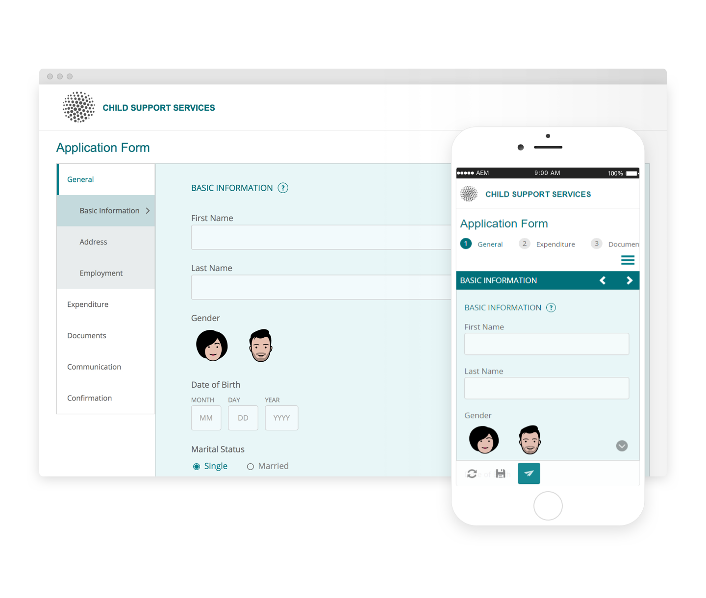

# Referentiethema&#39;s{#reference-themes}

[Met thema](../../forms/using/themes.md) &#39;s kunt u uw formulieren opmaken zonder diepgaande kennis van CSS. Naast het standaardthema, kunt u de volgende thema&#39;s krijgen door het pakket [AEM-FORMS-REFERENCE-THEMES](https://www.adobeaemcloud.com/content/marketplace/marketplaceProxy.html?packagePath=/content/companies/public/adobe/packages/cq630/fd/AEM-FORMS-6.3-REFERENCE-THEMES) te installeren:

* Beryl
* Exec
* Exec-Light
* Vrijheid
* Ultramarijn
* Urbane
* U.S. Web Design Standards
* Tranquil

Elk thema bevat een unieke en elegante stijl waarmee u aanpasbare formulieren voor uw gebruikers kunt maken. Het bevat unieke opmaak voor kiezers, zoals het deelvenster, het tekstvak, het numerieke vak, het keuzerondje, de tabel en de schakelaar. De stijlen in deze thema&#39;s zijn gebaseerd op vereisten. In een bepaald scenario hebt u bijvoorbeeld een minimalistisch thema met schone lettertypen nodig. Met het thema van de vrijheid kun je dat uiterlijk bereiken.

De thema&#39;s in dit pakket reageren snel en de stijl in deze thema&#39;s is gedefinieerd voor mobiele schermen en desktopschermen. De meeste moderne browsers op verschillende apparaten kunnen formulieren die met een van deze thema&#39;s zijn toegepast, zonder problemen weergeven.

Voor meer informatie bij het installeren van het pakket, zie [hoe te met Pakketten](/help/sites-administering/package-manager.md)werken.

## Beryl {#beryl}

Het Berylthema wordt gebruikt door het adaptieve formulier We.Gov en benadrukt het gebruik van achtergrondafbeeldingen, transparantie en grote, platte pictogrammen. In de onderstaande schermafbeelding kunt u zien hoe het Beryl-thema eruitziet en hoe het de opmaak van uw formulier kan verbeteren.

<!--[Click to enlarge

](assets/beryl-1.png)-->

## Exec {#exec}

Met het thema Exec vermijdt u effen achtergrondvullingen om formuliercomponenten te benadrukken. Wanneer u componenten selecteert en klikt, worden de fontkleuren gewijzigd. In vergelijking met het standaardthema Canvas verandert de fontkleur van de tekst op het geselecteerde tabblad in donkerblauw. De navigatie- en verzendknoppen verschillen van het Berylthema.

<!--[Click to enlarge

](assets/exec-1.png)-->

## Exec Light {#exec-light}

Het thema Exec Light gebruikt witruimte voor een naadloze ervaring. Met de knoppen Volgende en Verzenden krijgt u een effen vulling en 3D-schaduw. Met de linkertabbladen krijgt u een pijl in plaats van dubbele markeringen.

<!--[Click to enlarge

](assets/exec-light-1.png)-->

## Vrijheid {#liberty}

Bij het thema van de vrijheid wordt de nadruk gelegd op het belang met een minimalistische benadering. De fontkleur van het bezochte tabblad wordt bijvoorbeeld groen. U kunt alleen de onderomtrek van het tekstvak zien waarin de weergave van een formulier op papier met lijnen wordt geëmuleerd. Het actieve tekstvak heeft een zwarte onderomtrek, terwijl andere een lichtgrijze onderomtrek krijgen.

<!--[Click to enlarge

](assets/liberty-1.png)-->

## Tranquil {#tranquil}

Het thema Tranquil biedt lichte en donkere tinten van het schema Tranquil om verschillende componenten van een formulier te benadrukken. Keuzerondjes, deelvensters en tabs krijgen bijvoorbeeld een andere groene tint.

<!--[Click to enlarge

](assets/tranquil-1.png)-->

## Ultramarijn {#ultramarine}

Het thema Ultramarijn gebruikt diepe blauwe schaduwen om componenten zoals lusjes, panelen, tekstvakjes, en knopen te benadrukken.

<!--[Click to enlarge](assets/ultramarine-1.png)-->

## Urbane {#urbane}

Met het thema Urbane wordt de nadruk gelegd op een minimalistische en functionele vormgeving. Wanneer u het thema Urbane op uw formulier toepast, ziet u dat de componenten plat zijn. De deelvensters krijgen dunne omtrekken om een modern uiterlijk te krijgen.

<!--[Click to enlarge

](assets/urbane-1.png)-->

## U.S. Web Design Standards {#u-s-web-design-standards}

Het thema van de Normen van het Ontwerp van het Web van de V.S., zoals de naam voorstelt, gebruikt lettertypen en stijlen die in de Ontwerp van het Ontwerp van de Verenigde Staten van het Ontwerp van het Ontwerp van het Ontwerp van het Ontwerp van het Ontwerp van het Ontwerp van het Ontwerp van de Ontwerp van het Ontwerp van de Verenigde Staten worden beschreven. De webstandaard wordt door federale organisaties gebruikt om consistente webervaringen te maken op websites van de federale overheid.

<!--[Click to enlarge

](assets/usgov.png)-->
