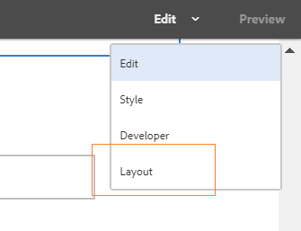

# De wijze van de Lay-out van het gebruik resize componenten{#use-layout-mode-to-resize-components}

De adaptieve vorm en de Interactieve het kanaalauteursinterface van het Communicatie Web laten u toe resize componenten gebruikend de wijze van de Lay-out. De belemmering-en-dalingsblauwe punten binnen kolommen om het begin en het eind te bepalen richt aan positiecomponenten. De blauwe punten tonen na het tikken van de component binnen het ontvankelijke net. Het ontvankelijke net bestaat uit 12 gelijke kolommen. De witte en blauwe kleur die in afwisselende kolommen in de schaduw stellen onderscheidt één kolom van andere.

U kunt de wijze van de Lay-out gebruiken resize componenten voor alle apparatentypes zoals Desktop, tablet, telefoon, en andere kleinere apparaten. De tablet leidt automatisch de lay-outconfiguratie uit de Desktopversie af en de kleinere apparaten leiden lay-outconfiguratie uit telefoon af. Nochtans, kunt u de automatisch afgeleide configuraties met voeten treden om een verschillende configuratie voor elk apparatentype te bepalen.

Als u het kanaal van het Web gebruikend het kanaal van de [Druk als meester](../../forms/using/create-interactive-communication.md) voor een Interactieve Mededeling creeert, omvatten de componenten beschikbaar voor het resizing ook de subvormen en de gebieden die in het kanaal van het Web auto-geproduceerd zijn gebruikend het kanaal van de Druk. Het kanaal van het Web behoudt de lay-out voor de het kanaalelementen van de Druk op de wijze van de Lay-out.

## Access Layout, modus {#access-layout-mode}

Selecteer **Lay-out** van de drop-down lijst die bij de bovenkant van de adaptieve vorm en de Interactieve Communicatie auteursinterface naast de optie van de **Voorproef** verschijnt. De vormvertoningen op de wijze van de Lay-out.

1. Login aan de AEM auteursinstantie en navigeer aan de Manager **van de Ervaring van** Adobe > **Vormen** > **Vormen &amp; Documenten**.
1. [Creeer een nieuwe](../../forms/using/create-interactive-communication.md) of open een bestaande adaptieve vorm of een Interactieve Mededeling.
1. Selecteer **Lay-out** van de drop-down lijst die bij de bovenkant naast de optie van de **Voorproef** verschijnt. De vormvertoningen op de wijze van de Lay-out.

   

## Onderdelen herrangschikken {#resize-components}

1. Op de wijze van de Lay-out, tik de component resize. De blauwe punten tonen aan het begin en het eind van het ontvankelijke net.
1. Sleep de blauwe punten om de positie van de component in het ontvankelijke net te bepalen.

   

   De toolbar die na het aftappen van componenten toont bestaat uit de volgende opties:

   * **Ouder:** Selecteer de ouder van een component.
   * **Vloer aan nieuwe lijn:** Verplaats de component naar de volgende lijn als er veelvoudige componenten binnen de zelfde lijn zijn.
   U kunt alle het resizing veranderingen ongedaan maken en standaardlay-out toepassen op het paneel dat resized componenten bevat gebruikend de optie van de **[!UICONTROL Omkeer breekpuntlay-out]** ( terug). Tik de ouder van de resized component om de optie te bekijken.

   >[!NOTE]
   >
   >U kunt niet resize lijstkolom, toolbar, toolbarknoop, en de componenten van het doelgebied gebruikend de wijze van de Lay-out. De wijze van de Stijl van het gebruik resize deze componenten.

### Voorbeeld {#example}

**Doel:** U wilt een lijstcomponent en een component van het Beeld opnemen en hen plaatsen parallel aan elkaar in een Interactieve Mededeling.

1. Neem de lijst en de beeldcomponenten op gebruikend geef wijze in het Webkanaal uit. De vertoning van de beeldcomponent na de lijstcomponent.
1. De schakelaar aan de wijze van de Lay-out en tikt de component van de Lijst. De blauwe punten resize de componentenvertoning bij kolom 1 en 12.
1. Sleep de blauwe stip in kolom 12 naar kolom 6 van het responsieve raster en laat deze vallen.

   

1. Op dezelfde manier selecteer de component van het Beeld en sleep-en-daling de blauwe punt bij kolom 1 aan kolom 7 van het ontvankelijke net. De lijst en de beeldcomponenten tonen parallel aan elkaar.

   

   U kunt de component van het Beeld selecteren en de **Vloer aan nieuwe lijnoptie** klikken beschikbaar in de toolbar om de component van het Beeld naar de volgende lijn te verplaatsen.

## Deelvensters aanpassen {#resize-panels-layout-mode}

Voer de volgende stappen uit als u het formaat van het volledige paneel in plaats van de afzonderlijke componenten wilt wijzigen:

1. Tik om het even welke componenten in het paneel dat u wilt resize, selecteer , en selecteer de eerste optie in de drop-down lijst, als het paneel de directe ouder van de component is.

   De blauwe punten tonen aan het begin en het eind van het ontvankelijke net.

1. Sleep de blauwe punten om de positie van het deelvenster in het responsieve raster te definiëren.
U kunt stappen 1 en 2 herhalen en  selecteren om het resized paneel naar de volgende lijn te verplaatsen.

## Meerdere kolommen voor een deelvenster definiëren

Voer de volgende stappen uit om het aantal kolommen voor een paneel te bepalen:

1. Op **[!UICONTROL geef]** wijze uit, tik het paneel, uitgezocht , en selecteer **[!UICONTROL Reagerend - alles op de pagina zonder navigatie]** optie.

1. Tik op  om de eigenschappen op te slaan.

1. Op de wijze van de **[!UICONTROL Lay-out]** , tik om het even welke componenten in het paneel dat u wilt resize, selecteren, en de eerste optie in de drop-down lijst selecteren, als het paneel de directe ouder van de component is.

1. Tik op  en selecteer het aantal kolommen in de vervolgkeuzelijst. Het aantal kolommen kan zich van 1 tot 12 uitstrekken. Het paneel wordt verdeeld in een multi-kolomlay-out.

## Laat het nieuwe ontvankelijke net voor oude ontvankelijke lay-outs toe {#enableresponsivegrid}

Laat het nieuwe ontvankelijke net voor vormen toe die u gebruikend Vormen 6.4 van AEM creeert of lagere versie resize componenten.

>[!NOTE]
>
>De omschakeling aan het nieuwe ontvankelijke net verwerpt de lay-outeigenschappen die reeds voor componenten worden bepaald die in de vorm worden gebruikt.

Voer de volgende stappen uit om het nieuwe ontvankelijke net toe te laten:

1. Selecteer **Lay-out** van de drop-down lijst die bij de bovenkant naast de optie van de **Voorproef** verschijnt. Een bevestiging om de de wijzevertoningen van de Lay-out toe te laten.
1. Tik **ja** om de wijze van de **Lay-out** voor de vorm toe te laten.

### Een oud fragment insluiten in een adaptieve vorm met een nieuwe ontvankelijke lay-out {#embed-an-old-fragment-in-an-adaptive-form-with-new-responsive-layout}

De nieuwe ontvankelijke lay-out voor adaptieve vorm staat u toe om een adaptief vormfragment met de oude ontvankelijke lay-out aan de vorm toe te voegen. Nochtans, verwerpt de nieuwe lay-out de lay-outeigenschappen die reeds voor componenten worden bepaald die in het fragment worden gebruikt. U kunt op de wijze van de Lay-out overschakelen om de lay-outeigenschappen voor componenten te bepalen die in het fragment worden gebruikt.

### Inbedden een fragment met nieuwe ontvankelijke lay-out in een oude adaptieve vorm {#embed-a-fragment-with-new-responsive-layout-in-an-old-adaptive-form}

Als u een fragment met de nieuwe ontvankelijke lay-out in een adaptieve vorm met een oude ontvankelijke lay-out inbedt, zet het systeem u ertoe aan om de wijze van de Lay-out voor de vorm toe te laten en het fragment opnieuw in te bedden.

Om de wijze van de Lay-out toe te laten, selecteer **Lay-out** van de drop-down lijst die bij de bovenkant naast de optie van de **Voorproef** verschijnt en tikt **ja** om te bevestigen. Selecteer **uitgeven** wijze om het fragment opnieuw in te bedden.

## Maak de wijze van de Lay-out voor vormen met oude ontvankelijke lay-out onbruikbaar {#disable-layout-mode-for-forms-with-old-responsive-layout}

U kunt de wijze van de Lay-out voor vormen met oude ontvankelijke lay-out onbruikbaar maken door eigenschappen voor het malplaatje uit te geven dat in de vorm wordt gebruikt.

Voer de volgende stappen uit om de wijze van de Lay-out onbruikbaar te maken:

1. Selecteer **[!UICONTROL Hulpmiddelen]** > **[!UICONTROL Algemeen]** > **[!UICONTROL Malplaatjes]** en open het malplaatje in de vorm op **[!UICONTROL Edit]** wijze wordt gebruikt die.
1. Selecteer de container van het Document in de linkerruit en tik **[!UICONTROL Beleid.]**

   

1. Tik op het tabblad **[!UICONTROL Layout-instellingen]** en selecteer **[!UICONTROL Layout-modus]** uitschakelen.
1. Tik op  opslaan om de sjablooneigenschappen op te slaan.

