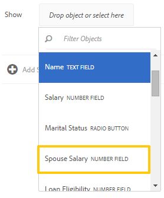

# Regeleditor voor adaptieve formulieren{#adaptive-forms-rule-editor}

<span class="preview"> de Adobe adviseert gebruikend de moderne en verlengbare gegevens vangen [&#x200B; Componenten van de Kern &#x200B;](https://experienceleague.adobe.com/docs/experience-manager-core-components/using/adaptive-forms/introduction.html?lang=nl-NL) voor [&#x200B; het creëren van nieuwe Aangepaste Forms &#x200B;](/help/forms/using/create-an-adaptive-form-core-components.md) of [&#x200B; het toevoegen van Aangepaste Forms aan de pagina&#39;s van AEM Sites &#x200B;](/help/forms/using/create-or-add-an-adaptive-form-to-aem-sites-page.md). Deze componenten betekenen een aanzienlijke vooruitgang in de aanmaak van Adaptive Forms en zorgen voor indrukwekkende gebruikerservaring. In dit artikel wordt een oudere aanpak beschreven voor de auteur Adaptive Forms die gebruikmaakt van stichtingscomponenten. </span>

| Versie | Artikelkoppeling |
| -------- | ---------------------------- |
| AEM as a Cloud Service | [Klik hier](https://experienceleague.adobe.com/docs/experience-manager-cloud-service/content/forms/adaptive-forms-authoring/authoring-adaptive-forms-foundation-components/add-rules-and-use-expressions-in-an-adaptive-form/rule-editor.html?lang=nl-NL) |
| AEM 6,5 | Dit artikel |

## Overzicht {#overview}

Met de functie voor regeleditors in Adobe Experience Manager Forms kunnen zakelijke gebruikers en ontwikkelaars regels schrijven voor adaptieve formulierobjecten. Met deze regels worden acties gedefinieerd die op formulierobjecten worden geactiveerd op basis van vooraf ingestelde voorwaarden, gebruikersinvoer en gebruikersacties op het formulier. Hierdoor wordt de ervaring met het invullen van formulieren verder gestroomlijnd, zodat u nauwkeurige en snelle informatie krijgt.

De regelredacteur verstrekt een intuïtieve en vereenvoudigde gebruikersinterface om regels te schrijven. De redacteur van de regel biedt een visuele redacteur voor alle gebruikers aan. Bovendien verstrekt de regeleditor alleen voor gebruikers van formulierbevoegdheden een code-editor om regels en scripts te schrijven.
<!-- Some of the key actions that you can perform on adaptive form objects using rules are:

* Show or hide an object
* Enable or disable an object
* Set a value for an object
* Validate the value of an object
* Execute functions to compute the value of an object
* Invoke a form data model service and perform an operation
* Set property of an object -->

De Regeleditor vervangt de scriptfuncties in AEM 6.1-formulieren en eerdere versies. Nochtans, worden uw bestaande manuscripten bewaard in de nieuwe regelredacteur. Voor meer informatie over het werken met bestaande manuscripten in de regelredacteur, zie [&#x200B; Gevolgen van regelredacteur op bestaande manuscripten &#x200B;](#impact-of-rule-editor-on-existing-scripts).

Gebruikers die zijn toegevoegd aan de gebruikersgroep voor formulieren, kunnen nieuwe scripts maken en bestaande scripts bewerken. Gebruikers in de groep met gebruikers van formulieren kunnen de scripts gebruiken, maar kunnen geen scripts maken of bewerken.

## Een regel begrijpen {#understanding-a-rule}

Een regel is een combinatie van handelingen en voorwaarden. In de regeleditor omvatten handelingen zoals verbergen, weergeven, inschakelen, uitschakelen of de waarde van een object in een formulier berekenen. Voorwaarden zijn Booleaanse expressies die worden geëvalueerd door controles en bewerkingen uit te voeren op de status, waarde of eigenschap van een formulierobject. Handelingen worden uitgevoerd op basis van de waarde ( `True` of `False` ) die wordt geretourneerd door een voorwaarde te evalueren.

De regelredacteur verstrekt een reeks vooraf bepaalde regeltypes, zoals wanneer, tonen, verbergen, toelaten, onbruikbaar maken, Vastgestelde Waarde van, en Valideren om u te helpen regels schrijven. Elk regeltype laat u voorwaarden en acties in een regel bepalen. Het document verklaart verder elk regeltype in detail.

Een regel volgt doorgaans een van de volgende constructies:

**voorwaarde-actie** In deze constructie, bepaalt een regel eerst een voorwaarde die door een actie wordt gevolgd om teweeg te brengen. De constructie is vergelijkbaar met if-then statement in programmeertalen.

In regelredacteur, **wanneer** regeltype de voorwaarde-actie constructie afdwingt.

**actie-Voorwaarde** in deze constructie, bepaalt een regel eerst een actie om te teweegbrengen die door voorwaarden voor evaluatie wordt gevolgd. Een andere variatie van deze constructie is actie-voorwaarde-afwisselende actie, die ook een afwisselende actie bepaalt om te teweegbrengen als de voorwaarde Vals terugkeert.

Toon, verberg, laat toe, maak onbruikbaar, plaats Waarde van, en bevestig regeltypes in regelredacteur om de actie-voorwaarde regelconstructie af te dwingen. Standaard is de alternatieve actie voor Tonen Verbergen en voor Inschakelen Uitgeschakeld en omgekeerd. U kunt de alternatieve standaardhandeling niet wijzigen.

>[!NOTE]
>
>De beschikbare regeltypen, inclusief de voorwaarden en handelingen die u in de regeleditor definieert, zijn ook afhankelijk van het type formulierobject waarop u een regel maakt. In de regeleditor worden alleen geldige regeltypen en opties weergegeven voor het schrijven van voorwaarde- en handelingsinstructies voor een bepaald type formulierobject. U ziet bijvoorbeeld geen regeltypen Valideren, Waarde instellen van, Inschakelen en Uitschakelen voor een deelvensterobject.

Voor meer informatie over regeltypes beschikbaar in de regelredacteur, zie [&#x200B; Beschikbare regeltypes in regelredacteur &#x200B;](#available-rule-types-in-rule-editor).

### Richtlijnen voor het kiezen van een regelconstructie {#guidelines-for-choosing-a-rule-construct}

Hoewel u de meeste gebruiksgevallen kunt bereiken door om het even welke regelconstructie te gebruiken, zijn hier sommige richtlijnen om één constructie over een andere te kiezen. Voor meer informatie over de beschikbare regels in regelredacteur, zie [&#x200B; Beschikbare regeltypes in regelredacteur &#x200B;](#available-rule-types-in-rule-editor).

* Een typische regel van het duim wanneer het creëren van een regel is het denken over het in de context van het voorwerp waarop u een regel schrijft. Denk eraan dat u veld B wilt verbergen of weergeven op basis van de waarde die een gebruiker in veld A heeft opgegeven. In dit geval evalueert u een voorwaarde in veld A en activeert u een actie in veld B op basis van de waarde die de voorwaarde retourneert.

  Daarom als u een regel op gebied B (het voorwerp schrijft waarop u een voorwaarde) evalueert, gebruik de voorwaarde-actie constructie of het wanneer regeltype. Op dezelfde manier gebruikt u de handeling-voorwaarde constructie of toont of verbergt regeltype op gebied A.

* Soms moet u meerdere handelingen uitvoeren op basis van één voorwaarde. In dergelijke gevallen wordt aangeraden de voorwaarde-actieconstruct te gebruiken. In deze constructie, kunt u een voorwaarde eens evalueren en veelvoudige actieverklaringen specificeren.

  Als u bijvoorbeeld velden B, C en D wilt verbergen op basis van de voorwaarde die controleert of de waarde is opgegeven in veld A, schrijft u één regel met een construct voor voorwaarde-actie of wanneer-regeltype op veld A en geeft u handelingen op om de zichtbaarheid van velden B, C en D te bepalen. Anders hebt u drie aparte regels nodig voor de velden B, C en D, waar elke regel de voorwaarde controleert en het desbetreffende veld weergeeft of verbergt. In dit voorbeeld is het efficiënter om het Wanneer regeltype op één object te schrijven in plaats van Regeltype tonen of verbergen op drie objecten.

* Als u een actie wilt activeren op basis van meerdere voorwaarden, wordt aangeraden een handeling-voorwaardenconstructie te gebruiken. Als u bijvoorbeeld veld A wilt weergeven en verbergen door de voorwaarden in de velden B, C en D te evalueren, gebruikt u Regeltype tonen of verbergen in veld A.
* Gebruik een voorwaarde-handeling of handeling als de regel één handeling voor één voorwaarde bevat.
* Als een regel op een voorwaarde controleert en een actie onmiddellijk bij het verstrekken van een waarde op een gebied of het weggaan van een gebied uitvoert, wordt het geadviseerd om een regel met voorwaarde-actie constructie of het wanneer regeltype op het gebied te schrijven waarop de voorwaarde wordt geëvalueerd.
* De voorwaarde in wanneer regel wordt geëvalueerd wanneer een gebruiker de waarde van het voorwerp verandert waarop wanneer regel wordt toegepast. Als u echter wilt dat de actie wordt geactiveerd wanneer de waarde aan de serverzijde verandert, zoals bij het vooraf invullen van de waarde, wordt u aangeraden een When-regel te schrijven die de actie activeert wanneer het veld wordt geïnitialiseerd.
* Wanneer u regels schrijft voor vervolgkeuzelijsten, keuzerondjes of selectievakjes, worden de opties of waarden van deze formulierobjecten in het formulier vooraf ingevuld in de regeleditor.

## Beschikbare operatortypen en gebeurtenissen in regeleditor {#available-operator-types-and-events-in-rule-editor}

De regeleditor biedt de volgende logische operatoren en gebeurtenissen waarmee u regels kunt maken.

* **is gelijk aan**
* **is niet gelijk aan**
* **begint met**
* **eindigt met**
* **bevat**
* **is Leeg**
* **is niet leeg**
* **heeft Geselecteerd:** keert waar terug wanneer de gebruiker een bepaalde optie voor een checkbox, drop-down, radioknoop selecteert.
* **wordt geïnitialiseerd (gebeurtenis):** keert waar terug wanneer een vormvoorwerp in browser teruggeeft.
* **wordt Gewijzigd (gebeurtenis):** keert waar terug wanneer de gebruiker de ingegane waarde of de geselecteerde optie voor een vormvoorwerp verandert.

## Beschikbare regeltypen in regeleditor {#available-rule-types-in-rule-editor}

De regelredacteur verstrekt een reeks vooraf bepaalde regeltypes die u kunt gebruiken om regels te schrijven. Laten we elk regeltype in detail bekijken. Voor meer informatie over het schrijven van regels in regelredacteur, zie [&#x200B; regels &#x200B;](#write-rules) schrijven.

### Wanneer {#whenruletype}

**wanneer** regeltype volgt de **voorwaarde-actie-afwisselende actie** regelconstructie, of soms, enkel de **voorwaarde-actie** constructie. In dit regeltype geeft u eerst een evaluatievoorwaarde op, gevolgd door een actie die moet worden geactiveerd als aan de voorwaarde wordt voldaan ( `True`). Tijdens het gebruik van het type Wanneer-regel kunt u meerdere OPERATORen en/of operatoren gebruiken om geneste expressies[&#128279;](#nestedexpressions) te maken.

Met het type Wanneer-regel kunt u een voorwaarde voor een formulierobject evalueren en handelingen uitvoeren op een of meer objecten.

In eenvoudige woorden, een typische When-regel is als volgt gestructureerd:

`When on Object A:`

`(Condition 1 AND Condition 2 OR Condition 3) is TRUE;`

`Then, do the following:`

Handeling 2 op object B;
EN
Handeling 3 voor Object C;

_

Wanneer u een component met meerdere waarden hebt, zoals keuzerondjes of lijst, terwijl het creëren van een regel voor die component, worden de opties automatisch teruggewonnen en ter beschikking gesteld van de regelmaker. U hoeft de optiewaarden niet nogmaals te typen.

Een lijst heeft bijvoorbeeld vier opties: Rood, Blauw, Groen en Geel. Tijdens het creëren van de regel, worden de opties (radioknopen) automatisch teruggewonnen en ter beschikking gesteld van de regelschepper als volgt:


Tijdens het schrijven van een When-regel kunt u de Clear Value of action activeren. Waarde wissen van handeling wist de waarde van het opgegeven object. Met de instructie &#39;Wissen&#39; als optie kunt u complexe voorwaarden maken met meerdere velden.


**Verbergen** verbergt het gespecificeerde voorwerp.

**toon** toont het gespecificeerde voorwerp.

**laat** toe laat het gespecificeerde voorwerp toe.

**maak** onbruikbaar maakt het gespecificeerde voorwerp onbruikbaar.

**aanhaalt de dienst** aanhaalt de dienst die in een model van vormgegevens wordt gevormd. Wanneer u de Invoke-service kiest, wordt een veld weergegeven. Als u op het veld tikt, worden alle services weergegeven die zijn geconfigureerd in alle formuliergegevensmodellen op uw AEM. Als u een service voor een formuliergegevensmodel kiest, worden extra velden weergegeven waarin u formulierobjecten kunt toewijzen met invoer- en uitvoerparameters voor de opgegeven service. Zie voorbeeldregel voor het aanroepen van services voor het gegevensmodel van formulieren.

Naast formuliergegevensmodelservice kunt u een directe WSDL-URL opgeven om een webservice aan te roepen. Een service voor een formuliergegevensmodel heeft echter vele voordelen en de aanbevolen aanpak om een service aan te roepen.

Voor meer informatie over het vormen van de diensten in model van vormgegevens, zie [&#x200B; de Integratie van Gegevens van AEM Forms &#x200B;](/help/forms/using/data-integration.md).

**vastgestelde waarde van** berekent en plaatst de waarde van het gespecificeerde voorwerp. U kunt de objectwaarde instellen op een tekenreeks, de waarde van een ander object, de berekende waarde met behulp van de wiskundige expressie of functie, de waarde van een eigenschap van een object of de uitvoerwaarde van een geconfigureerde formuliergegevensmodelservice. Wanneer u de optie Webservice kiest, worden alle services weergegeven die in alle formuliergegevensmodellen op uw AEM zijn geconfigureerd. Als u een service voor een formuliergegevensmodel kiest, worden extra velden weergegeven waarin u formulierobjecten kunt toewijzen met invoer- en uitvoerparameters voor de opgegeven service.

Voor meer informatie over het vormen van de diensten in model van vormgegevens, zie [&#x200B; de Integratie van Gegevens van AEM Forms &#x200B;](/help/forms/using/data-integration.md).

Met het regeltype **[!UICONTROL Set Property]** kunt u de waarde van een eigenschap van het opgegeven object instellen op basis van een voorwaardenactie. U kunt eigenschap instellen op een van de volgende opties:

* visible (Boolean)
* dorExclusion (Boolean)
* chartType (String)
* title (String)
* enabled (Boolean)
* mandatory (Boolean)
* validationsDisabled (Boolean)
* validateExpMessage (String)
* value (Number, String, Date)
* items (lijst)
* valid (Boolean)
* errorMessage (String)

Hiermee kunt u regels definiëren om selectievakjes dynamisch toe te voegen aan het aangepaste formulier. U kunt een regel definiëren met behulp van een aangepaste functie, een formulierobject of een objecteigenschap.


Om een regel te bepalen die op een douanefunctie wordt gebaseerd, selecteer **Uitvoer van de Functie** van de drop-down lijst, en belemmering-en-daling een douanefunctie van de **Functies** tabel. Als aan de voorwaarde wordt voldaan, wordt het aantal selectievakjes dat in de aangepaste functie is gedefinieerd, toegevoegd aan het aangepaste formulier.

Om een regel te bepalen die op een vormvoorwerp wordt gebaseerd, selecteer **Voorwerp van de Vorm** van de drop-down lijst, en belemmering-en-daling een vormvoorwerp van de **Voorwerpen van de Vorm** tabel. Als aan de voorwaarde is voldaan, wordt het aantal selectievakjes dat in het formulierobject is gedefinieerd, toegevoegd aan het aangepaste formulier.

Met de regel Eigenschap instellen op basis van een objecteigenschap kunt u het aantal selectievakjes in een adaptief formulier toevoegen op basis van een andere objecteigenschap die in het adaptieve formulier is opgenomen.

In de volgende afbeelding ziet u een voorbeeld van het dynamisch toevoegen van selectievakjes op basis van het aantal vervolgkeuzelijsten in het adaptieve formulier:


**Duidelijke Waarde van** ontruimt de waarde van het gespecificeerde voorwerp.

**vastgestelde Focus** plaatst nadruk op het gespecificeerde voorwerp.

**sparen Vorm** slaat de vorm op.

**legt Forms** voor legt de vorm voor.

**de Vorm van het Terugstellen** stelt de vorm opnieuw in.

**bevestigt Vorm** de vorm.

**voegt Instantie** toe voegt een geval van het gespecificeerde herhaalbare paneel of de lijstrij toe.

**verwijdert Instantie** verwijdert een geval van het gespecificeerde herhaalbare paneel of de lijstrij.

**navigeer aan** aan andere Interactieve Mededelingen, adaptieve vormen, andere activa zoals beelden of documentfragmenten, of een externe URL. Voor meer informatie, zie [&#x200B; knoop aan de Interactieve Mededeling &#x200B;](../../forms/using/create-interactive-communication.md#addbuttontothewebchannel) toevoegen.

### Waarde instellen van {#set-value-of}

Met het **[!UICONTROL Set Value of]** -regeltype kunt u de waarde van een formulierobject instellen, afhankelijk van het feit of aan de opgegeven voorwaarde wordt voldaan of niet. De waarde kan worden ingesteld op een waarde van een ander object, een letterlijke tekenreeks, een waarde die is afgeleid van een wiskundige expressie of een functie, een waarde van een eigenschap van een ander object of de uitvoer van een formuliergegevensmodelservice. Op dezelfde manier kunt u controleren op een voorwaarde voor een component, een tekenreeks, een eigenschap of waarden die zijn afgeleid van een functie of wiskundige expressie.

De waarde van regeltype instellen is niet beschikbaar voor alle formulierobjecten, zoals deelvensters en werkbalkknoppen. Een standaardwaarde van regel set heeft de volgende structuur:


Waarde van Object A instellen op:

(tekenreeks ABC) OF
(objecteigenschap X van Object C) OF
(waarde van een functie) OF
(waarde van een wiskundige uitdrukking) OF
(uitvoerwaarde van een datamodelservice of webservice);

Wanneer (optioneel):

(Voorwaarde 1 EN Voorwaarde 2 EN Voorwaarde 3) is TRUE;


In het volgende voorbeeld wordt de waarde in `dependentid` het veld als invoer gebruikt en wordt de waarde van het `Relation` veld ingesteld op de uitvoer van het `Relation` argument van de `getDependent` formuliergegevensmodelservice.


Voorbeeld van waardeceregel instellen met de service van het formuliergegevensmodel

>[!NOTE]
>
>Daarnaast kunt u Waarde van regel instellen gebruiken om alle waarden in een vervolgkeuzelijstcomponent te vullen vanaf de uitvoer van een service van een formuliergegevensmodel of een webservice. Zorg er echter voor dat het uitvoerargument dat u kiest van een arraytype is. Alle waarden die in een array worden geretourneerd, worden beschikbaar in de opgegeven vervolgkeuzelijst.

### Tonen {#show}

Gebruikend **toon** regeltype, kunt u een regel schrijven om een vormvoorwerp te tonen of te verbergen dat op wordt gebaseerd of een voorwaarde al dan niet tevreden is. Het regeltype Tonen activeert ook de handeling Verbergen als de voorwaarde niet wordt vervuld of als `False` wordt geretourneerd.

Een typische Show regel is gestructureerd als volgt:


`Show Object A;`

`When:`

`(Condition 1 OR Condition 2 OR Condition 3) is TRUE;`

`Else:`

`Hide Object A;`


### Verbergen {#hide}

Gelijkaardig aan het Show regeltype, kunt u **gebruiken verberg** regeltype om een vormvoorwerp te tonen of te verbergen dat op wordt gebaseerd of een voorwaarde al dan niet tevreden is. Het regeltype Verbergen activeert ook de handeling Tonen voor het geval dat niet aan de voorwaarde wordt voldaan of dat `False` wordt geretourneerd.

Een typische regel van de Huid is gestructureerd als volgt:


`Hide Object A;`

`When:`

`(Condition 1 AND Condition 2 AND Condition 3) is TRUE;`

`Else:`

`Show Object A;`


### Inschakelen {#enable}

**laat** regeltype toe laat u toe of onbruikbaar maakt een vormvoorwerp dat op wordt gebaseerd of een voorwaarde wordt tevredengesteld of niet. Het regeltype Enable activeert ook de handeling Disable voor het geval dat niet aan de voorwaarde wordt voldaan of dat `False` wordt geretourneerd.

Een typisch laat regel toe is gestructureerd als volgt:


`Enable Object A;`

`When:`

`(Condition 1 AND Condition 2 AND Condition 3) is TRUE;`

`Else:`

`Disable Object A;`


### Uitschakelen {#disable}

Gelijkaardig aan Enable regeltype, **maak** regeltype onbruikbaar laat u een vormvoorwerp toelaten of onbruikbaar maken dat op wordt gebaseerd of een voorwaarde al dan niet wordt tevredengesteld. Het regeltype Uitschakelen activeert ook de handeling Inschakelen als de voorwaarde niet wordt vervuld of als `False` wordt geretourneerd.

Een typisch onbruikbaar maken regel is gestructureerd als volgt:


`Disable Object A;`

`When:`

`(Condition 1 OR Condition 2 OR Condition 3) is TRUE;`

`Else:`

`Enable Object A;`

### Valideren {#validate}

Het **bevestigt** regeltype bevestigt de waarde op een gebied gebruikend een uitdrukking. U kunt bijvoorbeeld een expressie schrijven om te controleren of het tekstvak voor het opgeven van de naam geen speciale tekens of getallen bevat.

Een typisch Validate regel is gestructureerd als volgt:

`Validate Object A;`

`Using:`

`(Expression 1 AND Expression 2 AND Expression 3) is TRUE;`

>[!NOTE]
>
>Als de opgegeven waarde niet voldoet aan de regel Valideren, kunt u een validatiebericht voor de gebruiker weergeven. U kunt het bericht in het veld **[!UICONTROL Script validation message]** opgeven in de componenteigenschappen op de zijbalk.


### Opties instellen voor {#setoptionsof}

De **Vastgestelde Opties van** regeltype laat u toe om regels te bepalen om controledozen dynamisch aan de adaptieve vorm toe te voegen. U kunt een formuliergegevensmodel of een aangepaste functie gebruiken om de regel te definiëren.

Om een regel te bepalen die op een douanefunctie wordt gebaseerd, selecteer **Uitvoer van de Functie** van de drop-down lijst, en belemmering-en-daling een douanefunctie van de **Functies** tabel. Het aantal selectievakjes dat is gedefinieerd in de aangepaste functie, wordt toegevoegd aan het adaptieve formulier.


Om een douanefunctie tot stand te brengen, zie [&#x200B; douanefuncties in regelredacteur &#x200B;](#custom-functions).

Een regel definiëren op basis van een formuliergegevensmodel:

1. Selecteer **Uitvoer van de Dienst** van de drop-down lijst.
1. Selecteer het gegevensmodelobject.
1. Selecteer een bezit van het gegevensmodelvoorwerp van de **drop-down lijst van de Waarde van de Vertoning**. Het aantal selectievakjes in het adaptieve formulier wordt afgeleid van het aantal instanties dat voor die eigenschap in de database is gedefinieerd.
1. Selecteer een bezit van het gegevensmodelvoorwerp van **sparen Waarde** drop-down lijst.


## Het begrip van de regel redacteur gebruikersinterface {#understanding-the-rule-editor-user-interface}

De redacteur van de regel verstrekt een uitvoerige maar eenvoudige gebruikersinterface om regels te schrijven en te beheren. U kunt de gebruikersinterface van de regeleditor starten vanuit een adaptief formulier in de ontwerpmodus.

Om het gebruikersinterface van de regelredacteur te lanceren:

1. Open een adaptief formulier in de ontwerpmodus.
1. Selecteer het vormvoorwerp waarvoor u een regel wilt schrijven, en in Toolbar van de Component selecteren  uit. De gebruikersinterface van de regeleditor wordt weergegeven.

   

   Eventuele bestaande regels voor de geselecteerde formulierobjecten worden in deze weergave weergegeven. Voor informatie over het beheren van bestaande regels, zie [&#x200B; regels &#x200B;](#manage-rules) leiden.

1. Selecteer **[!UICONTROL Create]** om een nieuwe regel te schrijven. De visuele redacteur van het gebruikersinterface van de regelredacteur opent door gebrek wanneer u de regelredacteur de eerste keer lanceert.

   

Laten wij elke component van de regelredacteur UI in detail bekijken.

### A. Component-rule display {#a-component-rule-display}

Hiermee geeft u de titel weer van het adaptieve formulierobject waarmee u de regeleditor hebt gestart en het regeltype dat momenteel is geselecteerd. In het bovenstaande voorbeeld wordt de regeleditor gestart van een adaptief formulierobject met de naam Salary en is het geselecteerde regeltype When.

### B. Formulierobjecten en -functies {#b-form-objects-and-functions-br}

Het deelvenster links in de gebruikersinterface van de regeleditor bevat twee tabbladen: **[!UICONTROL Forms Objects]** en **[!UICONTROL Functions]** .

Op het tabblad Formulierobjecten ziet u een hiërarchische weergave van alle objecten in het aangepaste formulier. De titel en het type van de objecten worden weergegeven. Bij het schrijven van een regel kunt u formulierobjecten naar de regeleditor slepen. Tijdens het maken of bewerken van een regel wanneer u een object of functie naar een tijdelijke aanduiding sleept, neemt de plaatsaanduiding automatisch het juiste waardetype aan.

De formulierobjecten waarop een of meer geldige regels zijn toegepast, zijn gemarkeerd met een groene stip. Als een van de regels die op een formulierobject worden toegepast ongeldig is, wordt het formulierobject gemarkeerd met een gele stip.

Het tabblad Functies bevat een set met ingebouwde functies, zoals de Som van, Min of, Max of, Gemiddelde van, Aantal en Formulier valideren. U kunt deze functies gebruiken om waarden in herhaalbare deelvensters en tabelrijen te berekenen en te gebruiken voor actie- en voorwaardeinstructies bij het schrijven van regels. U kunt echter ook aangepaste functies[&#128279;](#custom-functions) maken.


>[!NOTE]
>
>U kunt tekstzoekopdrachten uitvoeren op namen en titels van objecten en functies op de tabbladen Objecten en Functies van Forms.

In de linkerstructuur van de formulierobjecten kunt u de formulierobjecten selecteren om de regels weer te geven die op elk object zijn toegepast. U kunt niet alleen door de regels van de verschillende formulierobjecten navigeren, u kunt ook regels kopiëren en plakken tussen de formulierobjecten. Voor meer informatie, zie [&#x200B; kopiëren-kleeft regels &#x200B;](#copy-paste-rules).

### C. Schakelen tussen formulierobjecten en -functies {#c-form-objects-and-functions-toggle-br}

Met de schakelknop schakelt u, wanneer hierop wordt getikt, de formulierobjecten en het deelvenster met functies in of uit.

### D. Visuele regeleditor {#d-visual-rule-editor}

De visuele regelredacteur is het gebied op de visuele redacteurswijze van het gebruikersinterface van de regelredacteur waar u regels schrijft. Hiermee kunt u een regeltype selecteren en voorwaarden en handelingen definiëren. Wanneer u voorwaarden en handelingen in een regel definieert, kunt u formulierobjecten en -functies slepen en neerzetten vanuit het deelvenster Formulierobjecten en -functies.

Voor meer informatie over het gebruiken van visuele regelredacteur, zie [&#x200B; regels &#x200B;](#write-rules) schrijven.

### E. de redacteurs van Visuele code schakelaar {#e-visual-code-editors-switcher}

Gebruikers in de gebruikersgroep voor formulieren hebben toegang tot de code-editor. Voor andere gebruikers is de code-editor niet beschikbaar. Als u de rechten hebt, kunt u van visuele redacteurswijze op de wijze van de coderedacteur van de regelredacteur schakelen, en omgekeerd, gebruikend de schakelaar recht boven de regelredacteur. Wanneer u regelredacteur de eerste keer lanceert, opent het op de visuele redacteurswijze. U kunt regels op de visuele redacteurswijze schrijven of op de wijze schakelen van de coderedacteur om een regelmanuscript te schrijven. Nochtans, merk op dat als u een regel wijzigt of een regel in coderedacteur schrijft, u niet terug naar de visuele redacteur voor die regel kunt schakelen tenzij u de coderedacteur ontruimt.

AEM Forms volgt de wijze van de regelredacteur u het laatst gebruikte om een regel te schrijven. Wanneer u de regelredacteur de volgende keer lanceert, opent het op die wijze. Nochtans, kunt u een standaardwijze ook vormen om de regelredacteur op de gespecificeerde wijze te openen. Daartoe:

1. Ga naar AEM webconsole op `https://[host]:[port]/system/console/configMgr` .
1. Klik om **[!UICONTROL Adaptive Form and Interactive Communication Web Channel Configuration]** te bewerken.
1. Kies **[!UICONTROL Visual Editor]** of **[!UICONTROL Code Editor]** in de vervolgkeuzelijst **[!UICONTROL Default Mode for Rule Editor]**

1. Klik op **[!UICONTROL Save]**.

### F. Gereed en annuleer knoppen {#f-done-and-cancel-buttons}

Met de knop **[!UICONTROL Done]** kunt u een regel opslaan. U kunt een onvolledige regel opslaan. Onvolledig zijn echter ongeldig en worden niet uitgevoerd. Opgeslagen regels voor een formulierobject worden weergegeven wanneer u de regeleditor de volgende keer start vanuit hetzelfde formulierobject. U kunt bestaande regels in die weergave beheren. Voor meer informatie, zie [&#x200B; regels &#x200B;](#manage-rules) leiden.

Met de knop **[!UICONTROL Cancel]** verwijdert u alle wijzigingen die u in een regel hebt aangebracht en sluit u de regeleditor.

## Schrijfregels {#write-rules}

U kunt regels schrijven gebruikend de visuele regelredacteur of de coderedacteur. Wanneer u de regelredacteur de eerste keer lanceert, opent het op de visuele redacteurswijze. U kunt op de wijze van de coderedacteur schakelen en regels schrijven. Nochtans, merk op dat als u een regel in code redacteur schrijft of wijzigt, u niet aan de visuele redacteur voor die regel kunt schakelen tenzij u de coderedacteur ontruimt. Wanneer u de regelredacteur de volgende keer lanceert, opent het op de wijze die u het laatst gebruikte om regel tot stand te brengen.

Laten we eerst bekijken hoe u regels schrijft met een visuele editor.

### Visuele editor gebruiken {#using-visual-editor}

Laten we begrijpen hoe u een regel maakt in een visuele editor met behulp van het volgende voorbeeldformulier.


In het gedeelte met vereisten voor leningen in het voorbeeldformulier voor het aanvragen van leningen moeten aanvragers hun echtelijke staat, salaris en indien gehuwd, het salaris van hun echtgenoot vermelden. Op basis van de gebruikersinput wordt het bedrag dat voor de lening in aanmerking komt, berekend door de regel en wordt dit weergegeven in het veld Beleenbaarheid van de lening. Pas de volgende regels toe om het scenario uit te voeren:

* Het veld Salaris van de echtgenoot wordt alleen weergegeven wanneer de huwelijksstatus wordt gehuwd.
* De beleenbaarheid van de lening bedraagt 50% van het totale salaris.

Voer de volgende stappen uit om regels te schrijven:

1. Eerst schrijft u de regel om de zichtbaarheid van het veld Sjabloon bij echtgeno(o)t(e) in te stellen op basis van de optie die de gebruiker selecteert voor het keuzerondje Genderstatus.

   Open het aanvraagformulier voor de lening in de ontwerpmodus. Selecteer de **component van de Status van het 1&rbrace; Kernbedrijf** en uitgezocht  uit. Selecteer vervolgens **[!UICONTROL Create]** om de regeleditor te starten.

   

   Wanneer u de regelredacteur lanceert, wanneer de regel door gebrek wordt geselecteerd. Bovendien wordt het formulierobject (in dit geval de huwelijksstatus) waaruit u de regeleditor hebt gestart, opgegeven in de instructie When.

   U kunt het geselecteerde object niet wijzigen of wijzigen, maar u kunt een ander regeltype selecteren met de vervolgkeuzelijst Regel, zoals hieronder wordt weergegeven. Als u een regel voor een ander object wilt maken, selecteert u Annuleren om de regeleditor af te sluiten en opnieuw te starten vanuit het gewenste formulierobject.

1. Selecteer **[!UICONTROL Select State]** vervolgkeuzelijst en selecteer **[!UICONTROL is equal to]** . Het veld **[!UICONTROL Enter a String]** wordt weergegeven.

   

   In het radioknoop van de Digitale Status, **Gehuwd &lbrace;en** Enige **opties worden toegewezen** 0 **en** 1 **waarden, respectievelijk.** U kunt toegewezen waarden verifiëren op het tabblad Titel van het dialoogvenster Keuzerondje bewerken, zoals hieronder wordt weergegeven.

   

1. Op **ga een gebied van het Koord** in de regel in, specificeer **0**.

   

   U hebt de voorwaarde gedefinieerd als `When Marital Status is equal to Married` . Definieer vervolgens de actie die moet worden uitgevoerd als deze voorwaarde Waar is.

1. Selecteer in de instructie Vervolgens **[!UICONTROL Show]** in de vervolgkeuzelijst **[!UICONTROL Select Action]** .

   

1. Sleep-daling het **gebied van de Salaris van de Muis** van het lusje van de Objecten van de Vorm op het **voorwerp van de Daling of selecteer hier** gebied. Alternatief, selecteer het **voorwerp van de Daling of selecteer hier** gebied en selecteer het **3&rbrace; gebied van de Salaris van de Muis van het pop-up menu, dat van alle vormvoorwerpen in de vorm een lijst maakt.**

   

   De regel wordt als volgt weergegeven in de regeleditor.

   

   Selecteer **Gedaan** om de regel te bewaren.

1. Herhaal de stappen 1 tot en met 5 om een andere regel te definiëren waarmee het veld Echtloon wordt verborgen als de staat van het huwelijk een enkele regel is. De regel wordt als volgt weergegeven in de regeleditor.

   

   >[!NOTE]
   >
   >Alternatief, kunt u één Show regel op het gebied van de Salaris van de Echtgenote, in plaats van twee schrijven wanneer de regels op het gebied van de Burgerlijke Status, om het zelfde gedrag uit te voeren.

   

1. Vervolgens schrijft u een regel om het beleenbare bedrag van de lening te berekenen, dat 50% van het totale salaris is, en geeft u dit weer in het veld Beleenbaarheid van de lening. Om dit te bereiken, creeer **Vastgestelde waarde van** regels betreffende het gebied van de Geschiktheid van de Lening.

   Op auteurswijze, selecteer het **[!UICONTROL Loan Eligibility]** gebied en selecteer  uit. Selecteer vervolgens **[!UICONTROL Create]** om de regeleditor te starten.

1. Selecteer **[!UICONTROL Set Value Of]** regel in de vervolgkeuzelijst met regels.

   

1. Selecteer **[!UICONTROL Select Option]** en selecteer **[!UICONTROL Mathematical Expression]** . Er wordt een veld voor het schrijven van wiskundige expressies geopend.

   

1. In het expressieveld:

   * Selecteer of belemmering-daling van het lusje van de Objecten van Forms het **&#x200B;**&#x200B;gebied van de Salaris op het eerste **voorwerp van de Daling of selecteer hier** gebied.

   * Selecteer **plus** van het **Uitgezochte gebied van de Exploitant**.

   * Selecteer of belemmering-daling van het lusje van de Objecten van Forms het **gebied van de Salaris van de Echtgenoot op het andere** voorwerp van de Daling of selecteer hier **gebied.**

   

1. Daarna, selecteer op het benadrukte gebied rond het uitdrukkingsgebied en selecteer **Uitdrukking** uitbreiden.

   

   Op het uitgebreide uitdrukkingsgebied, uitgezochte **die door** van het **Uitgezochte 3&rbrace; gebied van de Exploitant {en** Aantal **van het** Uitgezochte 7} gebied van de Optie &lbrace;wordt verdeeld. **&#x200B;**&#x200B;Dan, specificeer **2** op het aantalgebied.

   

   >[!NOTE]
   >
   >U kunt complexe expressies maken met behulp van componenten, functies, wiskundige expressies en eigenschapwaarden in het veld Optie selecteren.

   Maak vervolgens een voorwaarde die, wanneer True wordt geretourneerd, de expressie uitvoert.

1. Selecteer **Voorwaarde** toevoegen om toe te voegen wanneer verklaring.

   

   In de instructie When:

   * Selecteer of belemmering-daling van het lusje van de Objecten van Forms het **Belangrijkste gebied van de Status** in het eerste **voorwerp van de Daling of selecteer hier** gebied.

   * Selecteer i **is gelijk aan** van het **Uitgezochte gebied van de Exploitant**.

   * Selecteer Koord op het andere **voorwerp van de Daling of selecteer hier** gebied en specificeer **Gehuwd** op **ga een gebied van het Koord** in.

   De regel wordt uiteindelijk als volgt weergegeven in de regeleditor.  

   Selecteer **Gedaan** om de regel te bewaren.

1. Herhaal stap 7 tot en met 12 om een andere regel te definiëren om de beleenbaarheid van de lening te berekenen als de burgerlijke stand eenmalig is. De regel wordt als volgt weergegeven in de regeleditor.

   

>[!NOTE]
>
>U kunt ook de regel Waarde instellen van gebruiken om de beleenbaarheid van leningen te berekenen in de regel When die u hebt gemaakt om het veld Salaris van de echtgenoot weer te geven en te verbergen. De resulterende gecombineerde regel wanneer de Status van het Samenhang Enige is verschijnt als volgt in de regelredacteur.
>
>Op dezelfde manier kunt u een gecombineerde regel schrijven om de zichtbaarheid van het veld Echtgendag te bepalen en de beleenbaarheid van leningen berekenen wanneer de huwelijksstatus wordt gehuwd.


### Code-editor gebruiken {#using-code-editor}

Gebruikers die aan de gebruikers in formulieren worden toegevoegd, kunnen de code-editor gebruiken. De regelbewerker produceert automatisch de code van JavaScript voor om het even welke regel u gebruikend visuele redacteur creeert. U kunt van visuele redacteur aan de coderedacteur schakelen om de geproduceerde code te bekijken. Nochtans, als u de regelcode in de coderedacteur wijzigt, kunt u niet terug naar de visuele redacteur schakelen. Als u liever regels schrijft in code-editor dan in een visuele editor, kunt u regels opnieuw schrijven in de code-editor. Met de schakeloptie voor visuele-codeeditors kunt u schakelen tussen de twee modi.

De code-editor JavaScript is de expressietaal van adaptieve formulieren. Alle expressies zijn geldige JavaScript-expressies en gebruiken API&#39;s van het scriptmodel voor aangepaste formulieren. Deze expressies retourneren waarden van bepaalde typen. Voor de volledige lijst van adaptieve vormklassen, gebeurtenissen, voorwerpen, en openbare APIs, zie [&#x200B; API van de Bibliotheek van JavaScript verwijzing voor adaptieve vormen &#x200B;](https://helpx.adobe.com/nl/experience-manager/6-5/forms/javascript-api/index.html).

Voor meer informatie over richtlijnen om regels in de coderedacteur te schrijven, zie [&#x200B; Aangepaste Uitdrukkingen van de Vorm &#x200B;](/help/forms/using/adaptive-form-expressions.md).

Terwijl het schrijven van de code van JavaScript in de regelredacteur, helpen de volgende visuele aanwijzingen u met de structuur en de syntaxis:

* Syntaxismarkeringen
* Automatische inspringing
* Tips en suggesties voor formulierobjecten, functies en eigenschappen
* Automatisch aanvullen van namen van formuliercomponenten en algemene JavaScript-functies


#### Aangepaste functies in regeleditor {#custom-functions}

Naast uit-van-de-doos functies zoals *Som van* die onder de Output van Functies vermeld zijn, kunt u douanefuncties schrijven die u vaak nodig hebt. Zorg ervoor dat de functie die u schrijft, vergezeld gaat van de `jsdoc` hierboven.

Begeleidend `jsdoc` is vereist:

* Als u aangepaste configuratie en beschrijving wilt.
* Omdat er meerdere manieren zijn om een functie in `JavaScript,` te declareren en opmerkingen u in staat stellen de functies bij te houden.

Voor meer informatie, zie [&#x200B; usejsdoc.org &#x200B;](https://jsdoc.app/).

Ondersteunde `jsdoc` -tags:

* **Privé**
Syntaxis: `@private`
Een functie van het type private is niet opgenomen als een aangepaste functie.

* **Naam**
Syntaxis: `@name funcName <Function Name>`
Alternatief `,` kunt u gebruiken: `@function funcName <Function Name>` **of** `@func` `funcName <Function Name>`.
  `funcName` is de naam van de functie (geen spaties toegestaan).
  `<Function Name>` is de weergavenaam van de functie.

* **Lid**
Syntaxis: `@memberof namespace`
Koppelt een naamruimte aan de functie.

* **Parameter**
Syntaxis: `@param {type} name <Parameter Description>`
U kunt ook het volgende gebruiken: `@argument` `{type} name <Parameter Description>` **of** `@arg` `{type}` `name <Parameter Description>` .
Geeft parameters weer die door de functie worden gebruikt. Een functie kan meerdere parametertags hebben, één tag voor elke parameter in de volgorde waarin deze voorkomt.
  `{type}` staat voor het parametertype. Toegestane parametertypen zijn:

   1. string
   1. getal
   1. boolean
   1. bereik

  Bereik wordt gebruikt voor verwijzingen naar velden van een adaptief formulier. Wanneer een formulier wazig laden gebruikt, kunt u `scope` gebruiken om de bijbehorende velden te openen. U kunt velden openen wanneer de velden worden geladen of als de velden algemeen zijn gemarkeerd.

  Alle andere parametertypen worden in een van de bovenstaande categorieën ingedeeld. Geen wordt niet ondersteund. Selecteer een van de bovenstaande typen. Typen zijn niet hoofdlettergevoelig. Spaties zijn niet toegestaan in de parameter `name` . `<Parameter Descrption>` `<parameter>  can have multiple words. </parameter>`

* **Type van Terugkeer**
Syntaxis: `@return {type}`
U kunt ook `@returns {type}` gebruiken.
Voegt informatie over de functie toe, zoals zijn doel.
{type} staat voor het retourneringstype van de functie. Toegestane retourtypen zijn:

   1. string
   1. getal
   1. boolean

  Alle andere retourneringstypen worden in een van de bovenstaande categorieën ingedeeld. Geen wordt niet ondersteund. Selecteer een van de bovenstaande typen. Retourtypen zijn niet hoofdlettergevoelig.

* **dit**
Syntaxis: `@this currentComponent`

  Gebruik @this om te verwijzen naar de component Adaptief formulier waarop de regel is geschreven.

  Het volgende voorbeeld is gebaseerd op de veldwaarde. In het volgende voorbeeld verbergt de regel een veld in het formulier. Het `this` gedeelte van `this.value` verwijst naar de onderliggende component Adaptief formulier waarop de regel is geschreven.

  ```
     /**
     * @function myTestFunction
     * @this currentComponent
     * @param {scope} scope in which code inside function will be executed.
     */
     myTestFunction = function (scope) {
        if(this.value == "O"){
              scope.age.visible = true;
        } else {
           scope.age.visible = false;
        }
     }
  ```

>[!NOTE]
>
>Opmerkingen vóór aangepaste functie worden gebruikt voor overzicht. Samenvatting kan tot veelvoudige lijnen worden uitgebreid tot een markering wordt ontmoet. Beperk de grootte tot één voor een beknopte beschrijving in de regelbouwer.

<!--
**Adding a custom function**

For example, you want to add a custom function which calculates area of a square. Side length is the user input to the custom function, which is accepted using a numeric box in your form. The calculated output is displayed in another numeric box in your form. To add a custom function, you have to first create a client library, and then add it to the CRX repository.

Perform the following steps to create a client library and add it in the CRX repository.

1. Create a client library. For more information, see [Using Client-Side Libraries](/help/sites-developing/clientlibs.md).
2. In CRXDE, add a property `categories`with string type value as `customfunction` to the `clientlib` folder.

   >[!NOTE]
   >
   >`customfunction`is an example category. You can choose any name for the category you create in the `clientlib`folder.

After you have added your client library in the CRX repository, use it in your adaptive form. It lets you use your custom function as a rule in your form. Perform the following steps to add the client library in your adaptive form.

1. Open your form in edit mode.
   To open a form in edit mode, select a form and select **Open**.
1. In the edit mode, select a component, then select  &gt; **Adaptive Form Container**, and then select .
1. In the sidebar, under Name of Client Library, add your client library. ( `customfunction` in the example.)

   

1. Select the input numeric box, and select  to open the rule editor.
1. Select **Create Rule**. Using options shown below, create a rule to save the squared value of the input in the Output field of your form.
   [ ](assets/add-custom-rule.png)Select **Done**. Your custom function is added.

#### Function declaration supported types {#function-declaration-supported-types}

**Function Statement**

```javascript
function area(len) {
    return len*len;
}
```

This function is included without `jsdoc` comments.

**Function Expression**

```javascript
var area;
//Some codes later
/** */
area = function(len) {
    return len*len;
};
```

**Function Expression and Statement**

```javascript
var b={};
/** */
b.area = function(len) {
    return len*len;
}
```

**Function Declaration as Variable**

```javascript
/** */
var x1,
    area = function(len) {
        return len*len;
    },
    x2 =5, x3 =true;
```

Limitation: custom function picks only the first function declaration from the variable list, if together. You can use function expression for every function declared.

**Function Declaration as Object**

```javascript
var c = {
    b : {
        /** */
        area : function(len) {
            return len*len;
        }
    }
};
```

>[!NOTE]
>
>Ensure that you use `jsdoc` for every custom function. Although `jsdoc`comments are encouraged, include an empty `jsdoc`comment to mark your function as custom function. It enables default handling of your custom function.
-->

U kunt douanefuncties in uw regelredacteur ook gebruiken. Voor instructies bij het creëren van douanefuncties, verwijs naar de artikel [&#x200B; Functies van de Douane in Aanpassings Forms &#x200B;](/help/forms/using/create-and-use-custom-functions.md).

## Regels beheren {#manage-rules}

Om het even welke bestaande regels op een vormvoorwerp zijn vermeld wanneer u het voorwerp selecteert en . U kunt de titel en een voorvertoning van het regeloverzicht weergeven. Voorts laat UI u de volledige regelsamenvatting uitbreiden en bekijken, de orde van regels veranderen, regels uitgeven, en regels schrappen.


U kunt de volgende handelingen op regels uitvoeren:

* **breid/Vouw** samen: De kolom van de Inhoud in de regellijst toont de regelinhoud. Als de volledige regelinhoud niet zichtbaar in de standaardmening is, uitgezocht  om het uit te breiden.

* **opnieuw rangschikt**: Om het even welke nieuwe regel u creeert wordt gestapeld bij de bodem van de regellijst. De regels worden van boven naar beneden uitgevoerd. De regel bij de hoogste looppas eerst gevolgd door andere regels van het zelfde type. Bijvoorbeeld, als u hebt wanneer, tonen, toelaten, en wanneer de regels bij de eerste, tweede, derde, en vierde posities van bovenkant, respectievelijk, wanneer de regel bij de bovenkant eerst wordt uitgevoerd gevolgd door wanneer de regel bij de vierde positie. Vervolgens worden de regels Tonen en Inschakelen uitgevoerd.
U kunt de orde van een regel veranderen door  tegen het te tikken of belemmering-daling het aan de gewenste orde in de lijst.

* **geeft** uit: Om een regel uit te geven, selecteer het controlevakje naast de regeltitel. Er verschijnen extra opties voor het bewerken en verwijderen van de regel. Selecteer **uitgeven** om de geselecteerde regel op de regelredacteur op visuele of code redacteurswijze afhankelijk van de wijze te openen die wordt gebruikt om de regel tot stand te brengen.

* **Schrapping**: Om een regel te schrappen, selecteer de regel en selecteer **Schrapping**.

* **toelaten/onbruikbaar maken**: U kunt gebruik van een regel tijdelijk moeten opschorten. U kunt een of meer regels selecteren en Uitschakelen selecteren op de werkbalk Handelingen om deze uit te schakelen. Als een regel is uitgeschakeld, wordt deze niet uitgevoerd tijdens de runtime. Als u een uitgeschakelde regel wilt inschakelen, selecteert u deze en selecteert u Inschakelen op de werkbalk Handelingen. De statuskolom van de regel geeft aan of de regel is ingeschakeld of uitgeschakeld.


## Regels kopiëren en plakken {#copy-paste-rules}

U kunt een regel kopiëren-kleven van één gebied aan andere gelijkaardige gebieden om tijd te besparen.

Ga als volgt te werk om regels te kopiëren en te plakken:

1. Selecteer het vormvoorwerp waarvan u een regel wilt kopiëren, en in de componententoolbar selecteren . De gebruikersinterface van de regeleditor wordt weergegeven terwijl het formulierobject is geselecteerd en de bestaande regels worden weergegeven.

   

   Voor informatie over het beheren van bestaande regels, zie [&#x200B; regels &#x200B;](#manage-rules) leiden.

1. Schakel het selectievakje naast de regeltitel in. Er verschijnen extra opties voor het beheer van de regel. Selecteer **Exemplaar**.

   

1. Selecteer een ander vormvoorwerp waaraan u de regel wilt kleven en **Deeg** selecteren. Bovendien kunt u de regel bewerken om er wijzigingen in aan te brengen.

   >[!NOTE]
   >
   >U kunt een regel alleen in een ander formulierobject plakken als dat formulierobject de gebeurtenis van de gekopieerde regel ondersteunt. Een knop ondersteunt bijvoorbeeld de gebeurtenis click. U kunt een regel met een klikgebeurtenis aan een knoop maar niet aan een controledoos kleven.

1. Selecteer **Gedaan** om de regel te bewaren.

## Geneste expressies {#nestedexpressions}

De redacteur van de regel laat u veelvoudige EN en OF exploitanten gebruiken om genestelde regels tot stand te brengen. U kunt veelvoudige EN en OF exploitanten in regels mengen.

Hieronder ziet u een voorbeeld van een geneste regel die een bericht weergeeft aan de gebruiker dat hij of zij in aanmerking komt voor de voogdij van een kind als aan de vereiste voorwaarden is voldaan.


U kunt ook voorwaarden slepen en neerzetten in een regel om deze te bewerken. Selecteer en beweegt over het handvat ( ) vóór een voorwaarde. Zodra de aanwijzer verandert in het handsymbool zoals hieronder wordt weergegeven, sleept u de voorwaarde en zet u deze neer op een willekeurige plaats binnen de lijn. De regelstructuur verandert.


## Datumexpressievoorwaarden {#dateexpression}

De redacteur van de regel laat u datumvergelijkingen gebruiken om voorwaarden tot stand te brengen.

Na is een voorbeeldvoorwaarde die een statisch tekstvoorwerp toont als de hypotheek op het huis reeds wordt genomen, dat de gebruiker door het datumgebied te vullen aangeeft.

Wanneer de hypotheekdatum van het onroerend goed, zoals door de gebruiker ingevuld, in het verleden ligt, geeft het adaptieve formulier een toelichting op de berekening van het inkomen. In de volgende regel wordt de datum die door de gebruiker is ingevuld, vergeleken met de huidige datum en als de datum die door de gebruiker is ingevuld eerder is dan de huidige datum, wordt in het formulier het tekstbericht (Income genoemd) weergegeven.


Wanneer de datum waarop deze is ingevuld, eerder is dan de huidige datum, wordt het tekstbericht (Inkomsten) als volgt weergegeven:


## Aantal vergelijkingsvoorwaarden {#number-comparison-conditions}

De redacteur van de regel laat u voorwaarden tot stand brengen die twee aantallen vergelijken.

Na is een voorbeeldvoorwaarde die een statisch tekstvoorwerp toont als het aantal maanden een aanvrager bij zijn huidige adres blijft minder dan 36 is.


Wanneer de gebruiker mededeelt dat hij minder dan 36 maanden op zijn huidige woonplaats heeft gewoond, wordt op het formulier gemeld dat om een aanvullend bewijs van verblijf kan worden verzocht.


## Effect van regeleditor op bestaande scripts {#impact-of-rule-editor-on-existing-scripts}

In AEM Forms-versies vóór AEM 6.1 Forms-functiepak 1 schrijven formulierauteurs en -ontwikkelaars expressies naar het tabblad Scripts van het dialoogvenster Component bewerken om dynamisch gedrag toe te voegen aan adaptieve formulieren. Het tabblad Scripts wordt nu vervangen door de regeleditor.

Alle scripts of expressies die u op het tabblad Scripts moet schrijven, zijn beschikbaar in de regeleditor. Hoewel u ze niet kunt weergeven of bewerken in de visuele editor, kunt u scripts in de code-editor bewerken als u deel uitmaakt van de gebruikersgroep voor formulieren.

## Voorbeelden van regels {#example}

### Formuliergegevensmodelservice aanroepen {#invoke}

Bekijk een webservice `GetInterestRates` die het bedrag van de lening, de looptijd en de creditscore van de aanvrager als input gebruikt en een leningenplan retourneert met daarin het bedrag en de rentevoet van het EMI. U maakt een formuliergegevensmodel met de webservice als gegevensbron. U voegt gegevensmodelobjecten en een `get` -service toe aan het formuliermodel. De service wordt weergegeven op het tabblad Services van het formuliergegevensmodel. Maak vervolgens een adaptief formulier dat velden van gegevensmodelobjecten bevat om gebruikersinvoer voor de hoeveelheid leningen, de looptijd en de creditscore vast te leggen. Voeg een knop toe die de webservice activeert om plandetails op te halen. De uitvoer wordt ingevuld in de desbetreffende velden.

De volgende regel toont hoe u de Invoke de dienstactie zult vormen om het voorbeeldscenario te verwezenlijken.


Service van formuliergegevensmodel aanroepen met adaptieve formulierregel

>[!NOTE]
>
>Als de invoer van een arraytype is, zijn de velden die arrays ondersteunen zichtbaar onder de vervolgkeuzelijst Uitvoer.

### Meerdere handelingen triggeren met de regel Wanneer {#triggering-multiple-actions-using-the-when-rule}

In een aanvraagformulier voor een lening wilt u vastleggen of de aanvrager van de lening een bestaande klant is of niet. Op basis van de informatie die de gebruiker opgeeft, moet het veld met de klant-id worden weergegeven of verborgen. Ook, wilt u nadruk op het gebied van identiteitskaart van de klant plaatsen als de gebruiker een bestaande klant is. Het aanvraagformulier voor de lening bestaat uit de volgende onderdelen:

* Een radioknoop, **bent u een bestaande klant van de Geometrixx?** , dat opties Ja en Nee biedt. De waarde voor ja is **0** en Nr is **1**.

* Een tekstgebied, **Geometrixx klant identiteitskaart**, om klantenidentiteitskaart te specificeren.

Wanneer u wanneer regel op het radioknoop schrijft om dit gedrag uit te voeren, verschijnt de regel als volgt in de visuele regelredacteur.  

Regel in de visuele editor

In de voorbeeldregel, is de verklaring in wanneer sectie de voorwaarde is, die wanneer Waar terugkeert, de acties uitvoert die in de Dan sectie worden gespecificeerd.

De regel wordt als volgt weergegeven in de code-editor.


Regel in de code-editor

### Een functie-uitvoer in een regel gebruiken {#using-a-function-output-in-a-rule}

In een inkooporderformulier hebt u de volgende tabel waarin gebruikers hun bestellingen invullen. In deze tabel:

* De eerste rij is herhaalbaar, zodat kunnen de gebruikers tot veelvoudige producten opdracht geven en verschillende hoeveelheden specificeren. De elementnaam is `Row1` .
* De titel van de cel in de kolom Product Quantity van de herhaalbare rij is Quantity. De elementnaam voor deze cel is `productquantity` .
* De tweede rij in de tabel is niet-herhaalbaar en de titel van de cel in de kolom Hoeveelheid product in deze rij is Totale hoeveelheid.


**A.** Row1 **B.** Hoeveelheid **C.** Totale Hoeveelheid

Nu, wilt u gespecificeerde hoeveelheden in de kolom van de Hoeveelheid van het Product voor alle producten toevoegen en de som in de Totale cel van de Hoeveelheid tonen. U kunt dit bereiken door een Set Value of rule te schrijven voor de cel Totaal aantal, zoals hieronder wordt weergegeven.


Regel in de visuele editor

De regel wordt als volgt weergegeven in de code-editor.


Regel in de code-editor

### Een veldwaarde valideren met expressie {#validating-a-field-value-using-expression}

In het inkooporderformulier dat in het vorige voorbeeld wordt beschreven, wilt u de gebruiker beperken om meer dan één hoeveelheid van een product te bestellen waarvan de prijs hoger is dan 10000. Hiervoor kunt u een validatieregel schrijven, zoals hieronder wordt weergegeven.


Regel in de visuele editor

De regel wordt als volgt weergegeven in de code-editor.


Regel in de code-editor
