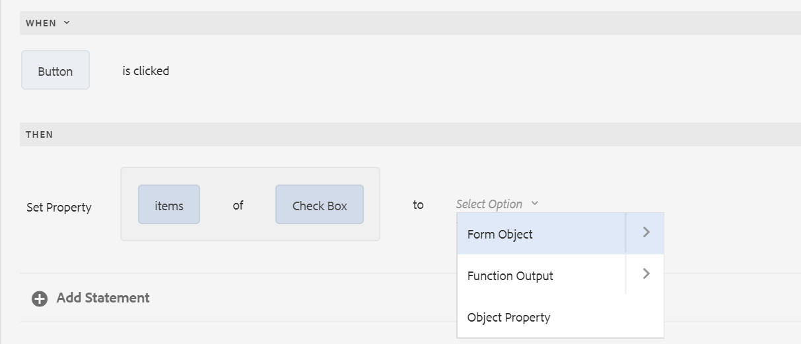
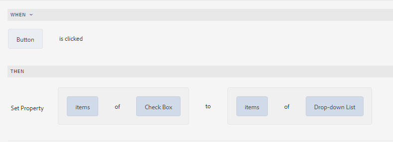
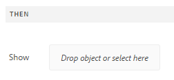

# Regeleditor voor adaptieve formulieren{#adaptive-forms-rule-editor}

## Overzicht {#overview}

Met de functie voor regeleditors in Adobe Experience Manager Forms kunnen zakelijke gebruikers en ontwikkelaars regels schrijven voor adaptieve formulierobjecten. Met deze regels worden acties gedefinieerd die op formulierobjecten worden geactiveerd op basis van vooraf ingestelde voorwaarden, gebruikersinvoer en gebruikersacties op het formulier. Hierdoor wordt de ervaring met het invullen van formulieren verder gestroomlijnd, zodat u nauwkeurige en snelle informatie krijgt.

De regelredacteur verstrekt een intuïtieve en vereenvoudigde gebruikersinterface om regels te schrijven. De redacteur van de regel biedt een visuele redacteur voor alle gebruikers aan. Bovendien slechts voor de gebruikers van de vormenmacht, verstrekt de regelredacteur een coderedacteur om regels en manuscripten te schrijven. Enkele belangrijke handelingen die u op adaptieve formulierobjecten kunt uitvoeren met behulp van regels zijn:

* Een object tonen of verbergen
* Een object in- of uitschakelen
* Een waarde instellen voor een object
* De waarde van een object valideren
* Functies uitvoeren om de waarde van een object te berekenen
* Een service van een formuliergegevensmodel aanroepen en een bewerking uitvoeren
* Eigenschap van een object instellen

De redacteur van de regel vervangt de scriptmogelijkheden in AEM 6.1 Forms en vroegere versies. Nochtans, worden uw bestaande manuscripten bewaard in de nieuwe regelredacteur. Voor meer informatie over het werken met bestaande manuscripten in de regelredacteur, zie [Gevolgen van regelredacteur op bestaande manuscripten](../../forms/using/rule-editor.md#p-impact-of-rule-editor-on-existing-scripts-p).

Gebruikers die zijn toegevoegd aan de gebruikersgroep voor formulieren, kunnen nieuwe scripts maken en bestaande scripts bewerken. Gebruikers in de groep met gebruikers van formulieren kunnen de scripts gebruiken, maar kunnen geen scripts maken of bewerken.

## Een regel {#understanding-a-rule}

Een regel is een combinatie van handelingen en voorwaarden. In de regeleditor omvatten handelingen zoals verbergen, weergeven, inschakelen, uitschakelen of de waarde van een object in een formulier berekenen. Voorwaarden zijn Booleaanse expressies die worden geëvalueerd door controles en bewerkingen uit te voeren op de status, waarde of eigenschap van een formulierobject. Handelingen worden uitgevoerd op basis van de waarde ( `True` of `False`) die wordt geretourneerd door een voorwaarde te evalueren.

De regelredacteur verstrekt een reeks vooraf bepaalde regeltypes, zoals wanneer, tonen, verbergen, toelaten, onbruikbaar maken, Vastgestelde Waarde van, en Valideren om u te helpen regels schrijven. Elk regeltype staat u toe om voorwaarden en acties in een regel te bepalen. Het document verklaart verder elk regeltype in detail.

Een regel volgt doorgaans een van de volgende elementen:

**Condition-** ActionIn deze constructie definieert een regel eerst een voorwaarde gevolgd door een actie die moet worden geactiveerd. De constructie is vergelijkbaar met if-then statement in programmeertalen.

In regelredacteur, dwingt **When** regeltype de voorwaarde-actie constructie af.

**Action-** ConditionIn deze constructie, bepaalt een regel eerst een actie om te teweegbrengen die door voorwaarden voor evaluatie wordt gevolgd. Een andere variatie van deze constructie is actie-voorwaarde-afwisselende actie, die ook een afwisselende actie bepaalt om te teweegbrengen als de voorwaarde Vals terugkeert.

Toon, verberg, laat toe, maak onbruikbaar, plaats Waarde van, en bevestig regeltypes in regelredacteur om de actie-voorwaarde regelconstructie af te dwingen. Standaard is de alternatieve actie voor Tonen Verbergen en voor Inschakelen Uitgeschakeld en andersom. U kunt de alternatieve standaardhandeling niet wijzigen.

>[!NOTE]
>
>De beschikbare regeltypen, inclusief de voorwaarden en handelingen die u in de regeleditor definieert, zijn ook afhankelijk van het type formulierobject waarop u een regel maakt. In de regeleditor worden alleen geldige regeltypen en opties weergegeven voor het schrijven van voorwaarde- en handelingsinstructies voor een bepaald type formulierobject. U ziet bijvoorbeeld geen regeltypen Valideren, Waarde instellen van, Inschakelen en Uitschakelen voor een deelvensterobject.

Voor meer informatie over regeltypes beschikbaar in de regelredacteur, zie [Beschikbare regeltypes in regelredacteur](../../forms/using/rule-editor.md#p-available-rule-types-in-rule-editor-p).

### Richtlijnen voor het kiezen van een regelconstructie {#guidelines-for-choosing-a-rule-construct}

Hoewel u de meeste gebruiksgevallen kunt bereiken door om het even welke regelconstructie te gebruiken, zijn hier sommige richtlijnen om één constructie over een andere te kiezen. Voor meer informatie over de beschikbare regels in regelredacteur, zie [Beschikbare regeltypes in regelredacteur](../../forms/using/rule-editor.md#p-available-rule-types-in-rule-editor-p).

* Een typische regel van het duim wanneer het creëren van een regel is het denken over het in de context van het voorwerp waarop u een regel schrijft. Denk eraan dat u veld B wilt verbergen of weergeven op basis van de waarde die een gebruiker in veld A heeft opgegeven. In dit geval evalueert u een voorwaarde in veld A en activeert u een actie in veld B op basis van de waarde die wordt geretourneerd.

   Daarom als u een regel op gebied B (het voorwerp schrijft waarop u een voorwaarde) evalueert, gebruik de voorwaarde-actie constructie of het wanneer regeltype. Op dezelfde manier gebruikt u de handeling-voorwaarde constructie of toont of verbergt regeltype op gebied A.

* Soms moet u meerdere handelingen uitvoeren op basis van één voorwaarde. In dergelijke gevallen wordt aangeraden de voorwaarde-actieconstruct te gebruiken. In deze constructie, kunt u een voorwaarde eens evalueren en veelvoudige actieverklaringen specificeren.

   Als u bijvoorbeeld velden B, C en D wilt verbergen op basis van de voorwaarde die controleert of de waarde is opgegeven in veld A, schrijft u één regel met een construct voor voorwaarde-actie of wanneer-regeltype op veld A en geeft u handelingen op om de zichtbaarheid van velden B, C en D te bepalen. Anders hebt u drie aparte regels nodig voor de velden B, C en D, waar elke regel de voorwaarde controleert en het desbetreffende veld weergeeft of verbergt. In dit voorbeeld is het efficiënter om het Wanneer regeltype op één object te schrijven in plaats van Regeltype tonen of verbergen op drie objecten.

* Als u een actie wilt activeren op basis van meerdere voorwaarden, wordt aangeraden een handeling-voorwaardenconstructie te gebruiken. Als u bijvoorbeeld veld A wilt weergeven en verbergen door de voorwaarden in de velden B, C en D te evalueren, gebruikt u Regeltype tonen of verbergen in veld A.
* Gebruik een voorwaarde-handeling of handeling als de regel één handeling voor één voorwaarde bevat.
* Als een regel op een voorwaarde controleert en een actie onmiddellijk bij het verstrekken van een waarde op een gebied of het weggaan van een gebied uitvoert, wordt het geadviseerd om een regel met voorwaarde-actie constructie of het wanneer regeltype op het gebied te schrijven waarop de voorwaarde wordt geëvalueerd.
* De voorwaarde in wanneer regel wordt geëvalueerd wanneer een gebruiker de waarde van het voorwerp verandert waarop wanneer regel wordt toegepast. Als u echter wilt dat de actie wordt geactiveerd wanneer de waarde aan de serverzijde verandert, bijvoorbeeld bij het vooraf invullen van de waarde, kunt u het beste een When-regel schrijven die de actie activeert wanneer het veld wordt geïnitialiseerd.
* Wanneer u regels schrijft voor vervolgkeuzelijsten, keuzerondjes of selectievakjes, worden de opties of waarden van deze formulierobjecten in het formulier vooraf ingevuld in de regeleditor.

## Beschikbare operatortypen en gebeurtenissen in regeleditor {#available-operator-types-and-events-in-rule-editor}

De regeleditor biedt de volgende logische operatoren en gebeurtenissen waarmee u regels kunt maken.

* **Is gelijk aan**
* **Is niet gelijk aan**
* **Begint met**
* **Eindigt met**
* **Bevat**
* **Is leeg**
* **Is niet leeg**
* **Heeft geselecteerd:** Retourneert true wanneer de gebruiker een bepaalde optie voor een selectievakje, vervolgkeuzelijst of keuzerondje selecteert.
* **Is geïnitialiseerd (gebeurtenis):** retourneert true wanneer een formulierobject in de browser wordt weergegeven.
* **Is gewijzigd (gebeurtenis):** retourneert true wanneer de gebruiker de ingevoerde waarde of de geselecteerde optie voor een formulierobject wijzigt.

## Beschikbare regeltypen in regeleditor {#available-rule-types-in-rule-editor}

De regelredacteur verstrekt een reeks vooraf bepaalde regeltypes die u kunt gebruiken om regels te schrijven. Laten we elk regeltype in detail bekijken. Voor meer informatie over het schrijven van regels in regelredacteur, zie [Write regels](../../forms/using/rule-editor.md#p-write-rules-p).

### Wanneer {#whenruletype}

Het **When** regeltype volgt de **condition-action-afwisselende actie** regelconstructie, of soms, enkel de **condition-action** constructie. In dit regeltype, specificeert u eerst een voorwaarde voor evaluatie die door een actie wordt gevolgd om teweeg te brengen als de voorwaarde ( `True`) wordt tevredengesteld. Wanneer het gebruiken van het Wanneer regeltype, kunt u veelvoudige EN en OF exploitanten gebruiken om [genestelde uitdrukkingen](#nestedexpressions) tot stand te brengen.

Met het regeltype &#39;Wanneer&#39; kunt u een voorwaarde op een formulierobject evalueren en acties op een of meer objecten uitvoeren.

In duidelijke woorden, typisch wanneer de regel als volgt gestructureerd is:

`When on Object A:`

`(Condition 1 AND Condition 2 OR Condition 3) is TRUE;`

`Then, do the following:`

Actie 2 betreffende object B;
EN
Actie 3 betreffende object C;

_

Wanneer u een component met meerdere waarden hebt, zoals keuzerondjes of lijst, terwijl het creëren van een regel voor die component, worden de opties automatisch teruggewonnen en ter beschikking gesteld van de regelmaker. U hoeft de optiewaarden niet nogmaals te typen.

Een lijst heeft bijvoorbeeld vier opties: Rood, Blauw, Groen en Geel. Tijdens het creëren van de regel, worden de opties (radioknopen) automatisch teruggewonnen en ter beschikking gesteld van de regelschepper als volgt:


Tijdens het schrijven van een When-regel kunt u de Clear Value of action activeren. Met Waarde wissen van handeling wordt de waarde van het opgegeven object gewist. Met de instructie &#39;Wissen&#39; als een optie in de instructie &#39;Wanneer&#39; kunt u complexe voorwaarden maken met meerdere velden.


**Het opgegeven object** verbergenVerbergen.

**Het opgegeven object** tonen.

**** EnableEnables the specified object.

**** DisableDisables the specified object.

**Invoke** serviceInvokes a service die in een model van vormgegevens wordt gevormd. Wanneer u de Invoke-service kiest, wordt een veld weergegeven. Als u op het veld tikt, worden alle services weergegeven die zijn geconfigureerd in alle formuliergegevensmodellen op uw AEM. Als u een service voor een formuliergegevensmodel kiest, worden extra velden weergegeven waarin u formulierobjecten kunt toewijzen met invoer- en uitvoerparameters voor de opgegeven service. Zie voorbeeldregel voor het aanroepen van formuliergegevensmodelservices.

Naast formuliergegevensmodelservice kunt u een directe WSDL-URL opgeven om een webservice aan te roepen. Een service voor een formuliergegevensmodel heeft echter vele voordelen en de aanbevolen aanpak om een service aan te roepen.

Zie [AEM Forms Data Integration](/help/forms/using/data-integration.md) voor meer informatie over het configureren van services in formuliergegevensmodel.

**Stel de waarde** van Computes in en stel de waarde van het opgegeven object in. U kunt de objectwaarde instellen op een tekenreeks, de waarde van een ander object, de berekende waarde met behulp van de wiskundige expressie of functie, de waarde van een eigenschap van een object of de uitvoerwaarde van een geconfigureerde formuliergegevensmodelservice. Wanneer u de optie Webservice kiest, worden alle services weergegeven die in alle formuliergegevensmodellen op uw AEM zijn geconfigureerd. Als u een service voor een formuliergegevensmodel kiest, worden extra velden weergegeven waarin u formulierobjecten kunt toewijzen met invoer- en uitvoerparameters voor de opgegeven service.

Zie [AEM Forms Data Integration](/help/forms/using/data-integration.md) voor meer informatie over het configureren van services in formuliergegevensmodel.

Met het regeltype **Set Property** kunt u de waarde van een eigenschap van het opgegeven object instellen op basis van een voorwaardenactie.

Hiermee kunt u regels definiëren om selectievakjes dynamisch toe te voegen aan het aangepaste formulier. U kunt een regel definiëren met behulp van een aangepaste functie, een formulierobject of een objecteigenschap.



Als u een regel wilt definiëren op basis van een aangepaste functie, selecteert u **Functie-uitvoer** in de vervolgkeuzelijst en sleept u een aangepaste functie en zet deze neer op het tabblad **Functies**. Als aan de voorwaarde wordt voldaan, wordt het aantal selectievakjes dat in de aangepaste functie is gedefinieerd, toegevoegd aan het aangepaste formulier.

Als u een regel wilt definiëren die is gebaseerd op een formulierobject, selecteert u **Formulierobject** in de vervolgkeuzelijst en sleept u een formulierobject uit het tabblad **Formulierobjecten**. Als aan de voorwaarde is voldaan, wordt het aantal selectievakjes dat in het formulierobject is gedefinieerd, toegevoegd aan het aangepaste formulier.

Met de regel Eigenschap instellen op basis van een objecteigenschap kunt u het aantal selectievakjes in een adaptief formulier toevoegen op basis van een andere objecteigenschap die in het adaptieve formulier is opgenomen.

De volgende afbeelding toont een voorbeeld van het dynamisch toevoegen van selectievakjes op basis van het aantal vervolgkeuzelijsten in het adaptieve formulier:



**Waarde** van wissen wist de waarde van het opgegeven object.

**Stel** FocusSets in op het opgegeven object.

**Sla** het formulier op.

**Het formulier wordt verzonden met** FormsSubmit.

**Het formulier opnieuw instellen** met FormResets.

**Valideer** FormValidates het formulier.

**Voeg** InstanceAdds een geval van het gespecificeerde herhaalbare paneel of de lijstrij toe.

**Verwijderen** InstanceVerwijdert een instantie van het opgegeven herhaalbare deelvenster of de opgegeven tabelrij.

**Navigeer** naar andere interactieve communicatie, adaptieve formulieren, andere elementen, zoals afbeeldingen of documentfragmenten, of een externe URL. Voor meer informatie, zie [knoop toevoegen aan Interactieve Communicatie](../../forms/using/create-interactive-communication.md#addbuttontothewebchannel).

### Waarde instellen van {#set-value-of}

Met het regeltype **[!UICONTROL Set Value of]** kunt u de waarde van een formulierobject instellen, afhankelijk van het feit of aan de opgegeven voorwaarde wordt voldaan of niet. De waarde kan worden ingesteld op een waarde van een ander object, een letterlijke tekenreeks, een waarde die is afgeleid van een wiskundige expressie of een functie, een waarde van een eigenschap van een ander object of de uitvoer van een service van een formuliergegevensmodel. Op dezelfde manier kunt u controleren op een voorwaarde voor een component, een tekenreeks, een eigenschap of waarden die zijn afgeleid van een functie of wiskundige expressie.

Merk op dat de Vastgestelde Waarde van regeltype niet beschikbaar voor alle vormvoorwerpen, zoals panelen en toolbarknopen is. Een standaardsetwaarde van regel heeft de volgende structuur:


Stel de waarde van Object A in op:

(tekenreeks ABC) OR
(objecteigenschap X van Object C) OR
(waarde van een functie) OR
(waarde van een wiskundige expressie) OF
(uitvoerwaarde van een gegevensmodeldienst of webdienst);

Indien (optioneel):

(Voorwaarde 1 EN Voorwaarde 2 EN Voorwaarde 3) is WAAR;


In het volgende voorbeeld wordt de waarde in het veld `dependentid` als invoer gebruikt en wordt de waarde van het veld `Relation` ingesteld op de uitvoer van het argument `Relation` van de service van het formuliergegevensmodel `getDependent`.


Voorbeeld van waardeceregel instellen met de service van het formuliergegevensmodel

>[!NOTE]
>
>Daarnaast kunt u Waarde van regel instellen gebruiken om alle waarden in een vervolgkeuzelijstcomponent te vullen vanaf de uitvoer van een service van een formuliergegevensmodel of een webservice. Zorg er echter voor dat het uitvoerargument dat u kiest van een arraytype is. Alle waarden die in een array worden geretourneerd, worden beschikbaar in de opgegeven vervolgkeuzelijst.

### Tonen {#show}

Met het regeltype **Tonen** kunt u een regel schrijven om een formulierobject weer te geven of te verbergen op basis van het feit of aan een voorwaarde is voldaan of niet. Het regeltype Tonen activeert ook de handeling Verbergen voor het geval niet aan de voorwaarde wordt voldaan of `False` wordt geretourneerd.

Een typische Show regel is gestructureerd als volgt:


`Show Object A;`

`When:`

`(Condition 1 OR Condition 2 OR Condition 3) is TRUE;`

`Else:`

`Hide Object A;`


### {#hide} verbergen

Net als bij het regeltype Weergeven kunt u het regeltype **Verbergen** gebruiken om een formulierobject weer te geven of te verbergen op basis van het feit of aan een voorwaarde is voldaan of niet. Het regeltype van de Huid teweegbrengt ook de actie van de Show in werking voor het geval dat de voorwaarde niet wordt voldaan of `False` terugkeert.

Een typische regel van de Huid is gestructureerd als volgt:


`Hide Object A;`

`When:`

`(Condition 1 AND Condition 2 AND Condition 3) is TRUE;`

`Else:`

`Show Object A;`


### {#enable} inschakelen

Met het regeltype **Enable** kunt u een formulierobject in- of uitschakelen op basis van het feit of aan een voorwaarde wordt voldaan of niet. Het Enable regeltype teweegbrengt ook de Disable actie teweeg voor het geval dat de voorwaarde niet wordt voldaan of `False` terugkeert.

Een typisch laat regel toe is gestructureerd als volgt:


`Enable Object A;`

`When:`

`(Condition 1 AND Condition 2 AND Condition 3) is TRUE;`

`Else:`

`Disable Object A;`


### {#disable} uitschakelen

Net als bij het regeltype Enable kunt u met het regeltype **Disable** een formulierobject in- of uitschakelen op basis van het feit of aan een voorwaarde wordt voldaan. Het onbruikbaar maken regeltype teweegbrengt ook de Enable actie in werking voor het geval de voorwaarde niet wordt tevredengesteld of `False` terugkeert.

Een typisch onbruikbaar maken regel is gestructureerd als volgt:


`Disable Object A;`

`When:`

`(Condition 1 OR Condition 2 OR Condition 3) is TRUE;`

`Else:`

`Enable Object A;`

### {#validate} valideren

Het regeltype **Validate** valideert de waarde in een veld met een expressie. U kunt bijvoorbeeld een expressie schrijven om te controleren of het tekstvak voor het opgeven van de naam geen speciale tekens of getallen bevat.

Een typisch Validate regel is gestructureerd als volgt:

`Validate Object A;`

`Using:`

`(Expression 1 AND Expression 2 AND Expression 3) is TRUE;`

>[!NOTE]
>
>Als de opgegeven waarde niet voldoet aan de regel Valideren, kunt u een validatiebericht voor de gebruiker weergeven. U kunt het bericht opgeven in het veld **[!UICONTROL Script validation message]** in de componenteigenschappen op de zijbalk.


### Opties instellen voor {#setoptionsof}

Met het regeltype **Opties instellen van** kunt u regels definiëren om selectievakjes dynamisch toe te voegen aan het aangepaste formulier. U kunt een formuliergegevensmodel of een aangepaste functie gebruiken om de regel te definiëren.

Als u een regel wilt definiëren op basis van een aangepaste functie, selecteert u **Functie-uitvoer** in de vervolgkeuzelijst en sleept u een aangepaste functie en zet deze neer op het tabblad **Functies**. Het aantal selectievakjes dat is gedefinieerd in de aangepaste functie, wordt toegevoegd aan het adaptieve formulier.


Om een douanefunctie tot stand te brengen, zie [douanefuncties in regelredacteur](#custom-functions).

Een regel definiëren op basis van een formuliergegevensmodel:

1. Selecteer **Service Output** in de vervolgkeuzelijst.
1. Selecteer het gegevensmodelobject.
1. Selecteer een eigenschap van een gegevensmodelobject in de vervolgkeuzelijst **Weergavewaarde**. Het aantal selectievakjes in het adaptieve formulier wordt afgeleid van het aantal instanties dat voor die eigenschap in de database is gedefinieerd.
1. Selecteer een eigenschap voor een gegevensmodelobject in de vervolgkeuzelijst **Waarde opslaan**.


## Het begrip van het gebruikersinterface van de regelredacteur {#understanding-the-rule-editor-user-interface}

De redacteur van de regel verstrekt een uitvoerige maar eenvoudige gebruikersinterface om regels te schrijven en te beheren. U kunt de gebruikersinterface van de regeleditor starten vanuit een adaptief formulier in de ontwerpmodus.

Om het gebruikersinterface van de regelredacteur te lanceren:

1. Open een adaptief formulier in de ontwerpmodus.
1. Tik op het formulierobject waarvoor u een regel wilt schrijven en tik op de werkbalk Component . De gebruikersinterface van de regeleditor wordt weergegeven.

   

   Eventuele bestaande regels voor de geselecteerde formulierobjecten worden in deze weergave weergegeven. Voor informatie over het beheren van bestaande regels, zie [Regels beheren](../../forms/using/rule-editor.md#p-manage-rules-p).

1. Tik **[!UICONTROL Create]** om een nieuwe regel te schrijven. De visuele redacteur van het gebruikersinterface van de regelredacteur opent door gebrek wanneer u de regelredacteur de eerste keer lanceert.

   

Laten wij elke component van de regelredacteur UI in detail bekijken.

### A. Component-regelweergave {#a-component-rule-display}

Hiermee geeft u de titel weer van het adaptieve formulierobject waarmee u de regeleditor hebt gestart en het regeltype dat momenteel is geselecteerd. In het bovenstaande voorbeeld wordt de regeleditor gestart van een adaptief formulierobject met de naam Salary en is het geselecteerde regeltype When.

### B. Formulierobjecten en -functies {#b-form-objects-and-functions-br}

De ruit op de linkerzijde in het gebruikersinterface van de regelredacteur omvat twee lusjes - **[!UICONTROL Forms Objects]** en **[!UICONTROL Functions]**.

Op het tabblad Formulierobjecten wordt een hiërarchische weergave weergegeven van alle objecten in het aangepaste formulier. De titel en het type van de objecten worden weergegeven. Bij het schrijven van een regel kunt u formulierobjecten naar de regeleditor slepen. Wanneer u een regel maakt of bewerkt en een object of functie naar een tijdelijke aanduiding sleept, neemt de tijdelijke aanduiding automatisch het juiste waardetype.

De formulierobjecten waarop een of meer geldige regels zijn toegepast, worden gemarkeerd met een groene stip. Als een van de regels die op een formulierobject zijn toegepast ongeldig is, wordt het formulierobject gemarkeerd met een gele stip.

Het tabblad Functies bevat een set ingebouwde functies, zoals som van, min of meer, max van, gemiddelde van, aantal en validerende vorm. U kunt deze functies gebruiken om waarden in herhaalbare deelvensters en tabelrijen te berekenen en deze tijdens het schrijven van regels te gebruiken in instructies voor handelingen en voorwaarden. U kunt echter ook [aangepaste functies](#custom-functions) maken.


>[!NOTE]
>
>U kunt tekstzoekopdrachten uitvoeren op namen en titels van objecten en functies op de tabbladen Objecten en Functies van Forms.

In de linkerstructuur van de formulierobjecten kunt u op de formulierobjecten tikken om de regels weer te geven die op elk object zijn toegepast. U kunt niet alleen door de regels van de verschillende formulierobjecten navigeren, u kunt ook regels kopiëren en plakken tussen de formulierobjecten. Zie [Regels kopiëren/plakken](../../forms/using/rule-editor.md#p-copy-paste-rules-p) voor meer informatie.

### C. Schakelen tussen formulierobjecten en -functies {#c-form-objects-and-functions-toggle-br}

Met de schakelknop schakelt u, wanneer hierop wordt getikt, de formulierobjecten en het deelvenster met functies in of uit.

### D. Visuele regeleditor {#d-visual-rule-editor}

De visuele regelredacteur is het gebied op de visuele redacteurswijze van het gebruikersinterface van de regelredacteur waar u regels schrijft. Hiermee kunt u een regeltype selecteren en voorwaarden en handelingen definiëren. Wanneer u voorwaarden en handelingen in een regel definieert, kunt u formulierobjecten en -functies slepen en neerzetten vanuit het deelvenster Formulierobjecten en -functies.

Voor meer informatie over het gebruiken van visuele regelredacteur, zie [Write regels](../../forms/using/rule-editor.md#p-write-rules-p).

### E. Schakelaar {#e-visual-code-editors-switcher} voor visuele editors

Gebruikers in de gebruikersgroep voor formulieren hebben toegang tot de code-editor. Voor andere gebruikers is de code-editor niet beschikbaar. Als u de rechten hebt, kunt u van visuele redacteurswijze aan de wijze van de coderedacteur van de regel, en vice versa schakelen, gebruikend de schakelaar recht boven de regelredacteur. Wanneer u regelredacteur de eerste keer lanceert, opent het op de visuele redacteurswijze. U kunt regels op de visuele redacteurswijze schrijven of op de wijze schakelen van de coderedacteur om een regelmanuscript te schrijven. Nochtans, merk op dat als u een regel wijzigt of een regel in coderedacteur schrijft, u niet terug naar de visuele redacteur voor die regel kunt schakelen tenzij u de coderedacteur ontruimt.

AEM Forms volgt de wijze van de regelredacteur u het laatst gebruikte om een regel te schrijven. Wanneer u de regelredacteur de volgende keer lanceert, opent het op die wijze. Nochtans, kunt u een standaardwijze ook vormen om de regelredacteur op de gespecificeerde wijze te openen. Daartoe:

1. Ga naar AEM webconsole op `https://[host]:[port]/system/console/configMgr`.
1. Klik om **[!UICONTROL Adaptive Form Configuration Service]** te bewerken.
1. Kies **[!UICONTROL Visual Editor]** of **[!UICONTROL Code Editor]** in de vervolgkeuzelijst **[!UICONTROL Default Mode for Rule Editor]**

1. Klik op **[!UICONTROL Save]**.

### F. Gereed en annuleer knoppen {#f-done-and-cancel-buttons}

De **[!UICONTROL Done]** knoop wordt gebruikt om een regel te bewaren. U kunt een onvolledige regel opslaan. Onvolledig zijn echter ongeldig en worden niet uitgevoerd. Opgeslagen regels voor een formulierobject worden weergegeven wanneer u de regeleditor de volgende keer start vanuit hetzelfde formulierobject. U kunt bestaande regels in die weergave beheren. Zie [Regels beheren](../../forms/using/rule-editor.md#p-manage-rules-p) voor meer informatie.

De **[!UICONTROL Cancel]** knoop verwerpt om het even welke veranderingen u aan een regel aanbracht en sluit de regelredacteur.

## Regels {#write-rules} schrijven

U kunt regels schrijven gebruikend de visuele regelredacteur of de coderedacteur. Wanneer u de regelredacteur de eerste keer lanceert, opent het op de visuele redacteurswijze. U kunt op de wijze van de coderedacteur schakelen en regels schrijven. Nochtans, merk op dat als u een regel in code redacteur schrijft of wijzigt, u niet aan de visuele redacteur voor die regel kunt schakelen tenzij u de coderedacteur ontruimt. Wanneer u de regelredacteur de volgende keer lanceert, opent het op de wijze die u het laatst gebruikte om regel tot stand te brengen.

Laten we eerst bekijken hoe u regels schrijft met een visuele editor.

### Visuele editor {#using-visual-editor} gebruiken

Laten we begrijpen hoe u een regel maakt in een visuele editor met behulp van het volgende voorbeeldformulier.


In het gedeelte met vereisten voor leningen in het voorbeeld van het aanvraagformulier voor leningen moeten aanvragers hun echtelijke status, salaris en indien gehuwd, het salaris van hun echtgenoot vermelden. Op basis van de gebruikersinput wordt het bedrag dat voor de lening in aanmerking komt, berekend door de regel en wordt dit weergegeven in het veld Beleenbaarheid van de lening. Pas de volgende regels toe om het scenario uit te voeren:

* Het veld Salaris van de echtgenoot wordt alleen weergegeven wanneer de huwelijksstatus wordt gehuwd.
* De beleenbaarheid van de lening bedraagt 50% van het totale salaris.

Voer de volgende stappen uit om regels te schrijven:

1. Eerst schrijft u de regel om de zichtbaarheid van het veld Sjabloon bij echtgeno(o)t(e) in te stellen op basis van de optie die de gebruiker selecteert voor het keuzerondje Genderstatus.

   Open het aanvraagformulier voor de lening in de ontwerpmodus. Tik op de **Marital Status**-component en tik . Tik vervolgens op **[!UICONTROL Create]** om de regeleditor te starten.

   

   Wanneer u de regelredacteur lanceert, wanneer de regel door gebrek wordt geselecteerd. Bovendien wordt het formulierobject (in dit geval de huwelijksstatus) waaruit u de regeleditor hebt gestart, opgegeven in de instructie When.

   U kunt het geselecteerde object niet wijzigen of wijzigen, maar u kunt een ander regeltype selecteren met de vervolgkeuzelijst Regel, zoals hieronder wordt weergegeven. Als u een regel voor een ander object wilt maken, tikt u op Annuleren om de regeleditor af te sluiten en start u deze opnieuw vanuit het gewenste formulierobject.

1. Tik **[!UICONTROL Select State]** vervolgkeuzelijst en selecteer **[!UICONTROL is equal to]**. Het veld **[!UICONTROL Enter a String]** wordt weergegeven.

   

   In het keuzerondje huwelijksstatus worden **Getrouwde** en **Enkel** opties respectievelijk **0** en **1** waarden toegewezen. U kunt toegewezen waarden verifiëren op het tabblad Titel van het dialoogvenster Keuzerondje bewerken, zoals hieronder wordt weergegeven.

   

1. In **ga een gebied van het Koord** in de regel in, specificeer **0**.

   

   U hebt de voorwaarde gedefinieerd als `When Marital Status is equal to Married`. Definieer vervolgens de actie die moet worden uitgevoerd als deze voorwaarde Waar is.

1. Selecteer **[!UICONTROL Show]** in de vervolgkeuzelijst **[!UICONTROL Select Action]** in de instructie then.

   

1. Sleep het veld **Echtsalaris** van het tabblad Formulierobjecten op het **Dropobject of selecteer hier** veld. Of tik op het **Drop-object of selecteer hier** veld en selecteer het veld **Spouse Salary** in het pop-upmenu, waarin alle formulierobjecten in het formulier worden vermeld.

   

   De regel wordt als volgt weergegeven in de regeleditor.

   

   Tik **Done** om de regel op te slaan.

1. Herhaal de stappen 1 tot en met 5 om een andere regel te definiëren waarmee het veld Echtloon wordt verborgen als de staat van het huwelijk een enkele regel is. De regel wordt als volgt weergegeven in de regeleditor.

   

   >[!NOTE]
   >
   >Alternatief, kunt u één Show regel op het gebied van de Salaris van de Echtgenote, in plaats van twee schrijven wanneer de regels op het gebied van de Burgerlijke Status, om het zelfde gedrag uit te voeren.

   

1. Vervolgens schrijft u een regel om het beleenbare bedrag van de lening te berekenen, dat 50% van het totale salaris is, en geeft u dit weer in het veld Beleenbaarheid van de lening. Om dit te bereiken, creeer **Vastgestelde waarde van** regels betreffende het gebied van de Geschiktheid van de Lening.

   Tik in de ontwerpmodus op het veld **[!UICONTROL Loan Eligibility]** en tik . Tik vervolgens op **[!UICONTROL Create]** om de regeleditor te starten.

1. Selecteer **[!UICONTROL Set Value Of]** regel van de regeldrop-down.

   

1. Tik **[!UICONTROL Select Option]** en selecteer **[!UICONTROL Mathematical Expression]**. Er wordt een veld voor het schrijven van wiskundige expressies geopend.

   

1. In het veld Expressie:

   * Selecteer of sleep-daling van het lusje van de Objecten van Forms **Salary** gebied in het eerste **voorwerp van de Daling of selecteer hier** gebied.

   * Selecteer **Plus** in het veld **Operator** selecteren.

   * Selecteer of sleep-daling van het lusje van de Objecten van Forms het **Echtsalaris** gebied in het andere **voorwerp van de Daling of selecteer hier** gebied.

   

1. Tik vervolgens in het gemarkeerde gebied rond het expressieveld en tik **Expressie uitbreiden**.

   

   Selecteer in het veld Uitgebreide expressie de optie **gedeeld door** in het veld **Operator selecteren** en **Number** in het veld **Option** selecteren. Geef vervolgens **2** op in het nummerveld.

   

   >[!NOTE]
   >
   >U kunt complexe expressies maken met behulp van componenten, functies, wiskundige expressies en eigenschapwaarden in het veld Optie selecteren.

   Maak vervolgens een voorwaarde die, wanneer True wordt geretourneerd, de expressie uitvoert.

1. Tik **Voorwaarde toevoegen** om een instructie When toe te voegen.

   

   In de instructie When:

   * Selecteer of sleep-daling van het lusje van de Objecten van Forms **Marital Status** gebied in het eerste **voorwerp van de Daling of selecteer hier** gebied.

   * Selecteer i **s gelijk aan** van **Select Operator** gebied.

   * Selecteer Tekenreeks in het andere **Drop-object of selecteer hier**-veld en geef **Gehuwd** op in het veld **Voer een tekenreeks** in.

   De regel wordt uiteindelijk als volgt weergegeven in de regeleditor.  

   Tik **Done** om de regel op te slaan.

1. Herhaal stap 7 tot en met 12 om een andere regel te definiëren om de beleenbaarheid van de lening te berekenen als de burgerlijke stand eenmalig is. De regel wordt als volgt weergegeven in de regeleditor.

   

>[!NOTE]
>
>U kunt ook de regel Waarde instellen van gebruiken om de beleenbaarheid van leningen te berekenen in de regel When die u hebt gemaakt om het veld Salaris van de echtgenoot weer te geven en te verbergen. De resulterende gecombineerde regel wanneer de Status van het Samenhang Enige is verschijnt als volgt in de regelredacteur.
>
>Op dezelfde manier kunt u een gecombineerde regel schrijven om de zichtbaarheid van het veld Echtgendag te bepalen en de beleenbaarheid van leningen berekenen wanneer de huwelijksstatus wordt gehuwd.


### Code-editor {#using-code-editor} gebruiken

Gebruikers die aan de gebruikers in formulieren worden toegevoegd, kunnen de code-editor gebruiken. De regeleditor genereert automatisch de JavaScript-code voor elke regel die u met een visuele editor maakt. U kunt van visuele redacteur aan de coderedacteur schakelen om de geproduceerde code te bekijken. Nochtans, als u de regelcode in de coderedacteur wijzigt, kunt u niet terug naar de visuele redacteur schakelen. Als u liever regels schrijft in code-editor dan in een visuele editor, kunt u regels opnieuw schrijven in de code-editor. Met de schakeloptie voor visuele-codeeditors kunt u schakelen tussen de twee modi.

De code-editor JavaScript is de expressietaal van adaptieve formulieren. Alle expressies zijn geldige JavaScript-expressies en gebruiken API&#39;s van het scriptmodel voor aangepaste formulieren. Deze expressies retourneren waarden van bepaalde typen. Zie [JavaScript Library API reference for adaptive forms](https://helpx.adobe.com/experience-manager/6-5/forms/javascript-api/index.html) voor de volledige lijst met adaptieve formulierklassen, -gebeurtenissen, -objecten en openbare API&#39;s.

Voor meer informatie over richtlijnen om regels in de coderedacteur te schrijven, zie [Aangepaste Uitdrukkingen van de Vorm](/help/forms/using/adaptive-form-expressions.md).

Bij het schrijven van JavaScript-code in de regeleditor zijn de volgende visuele aanwijzingen nuttig voor de structuur en syntaxis:

* Syntaxismarkeringen
* Automatische inspringing
* Tips en suggesties voor formulierobjecten, functies en eigenschappen
* Automatisch aanvullen van namen van formuliercomponenten en algemene JavaScript-functies


#### Aangepaste functies in regeleditor {#custom-functions}

Naast de uit-van-de-doosfuncties zoals *som van* die onder de Output van Functies vermeld zijn, kunt u douanefuncties schrijven die u vaak nodig hebt. Zorg ervoor dat de functie die u schrijft, vergezeld gaat van de `jsdoc` erboven.

Begeleidend `jsdoc` wordt vereist:

* Als u aangepaste configuratie en beschrijving wilt.
* Omdat er meerdere manieren zijn om een functie te declareren in `JavaScript,` en opmerkingen u in staat stellen de functies bij te houden.

Zie [usejsdoc.org](https://usejsdoc.org/) voor meer informatie.

Ondersteunde `jsdoc`-tags:

* ****
PrivateSyntax: Een functie van het type private is niet opgenomen als een aangepaste functie.`@private`
Een functie van het type private is niet opgenomen als een aangepaste functie.

* ****
NameSyntax: U kunt  `@name funcName <Function Name>`
ook  `,` het volgende gebruiken:  `@function funcName <Function Name>` **of** `@func` `funcName <Function Name>`.
   `funcName` is de naam van de functie (geen spaties toegestaan).
   `<Function Name>` is de weergavenaam van de functie.

* **Syntaxis**
lid: Koppelt een naamruimte aan de functie.`@memberof namespace`
Koppelt een naamruimte aan de functie.

* ****
ParameterSyntax: U kunt ook het volgende gebruiken:  `@param {type} name <Parameter Description>`
U kunt ook het volgende gebruiken:  `@argument` `{type} name <Parameter Description>` **of** `@arg` `{type}` `name <Parameter Description>`.
Geeft parameters weer die door de functie worden gebruikt. Een functie kan meerdere parametertags hebben, één tag voor elke parameter in de volgorde waarin deze voorkomt.
   `{type}` vertegenwoordigt parametertype. Toegestane parametertypen zijn:

   1. string
   1. getal
   1. boolean

   Alle andere parametertypen worden in een van de bovenstaande categorieën ingedeeld. Geen wordt niet ondersteund. Selecteer een van de bovenstaande typen. Typen zijn niet hoofdlettergevoelig. Spaties zijn niet toegestaan in de parameter `name`. `<Parameter Descrption>` `<parameter>  can have multiple words. </parameter>`

* **Type**
syntaxis retourneren: U kunt ook  `@return {type}`
Alternatief gebruiken, kunt u gebruiken  `@returns {type}`.
Voegt informatie over de functie toe, zoals zijn doel.
{type} staat voor het retourneringstype van de functie. Toegestane retourtypen zijn:

   1. string
   1. getal
   1. boolean

   Alle andere retourneringstypen worden in een van de bovenstaande categorieën ingedeeld. Geen wordt niet ondersteund. Selecteer een van de bovenstaande typen. Retourtypen zijn niet hoofdlettergevoelig.

>[!NOTE]
>
>Opmerkingen vóór aangepaste functie worden gebruikt voor overzicht. Samenvatting kan tot veelvoudige lijnen worden uitgebreid tot een markering wordt ontmoet. Beperk de grootte tot één voor een beknopte beschrijving in de regelbouwer.

**Een aangepaste functie toevoegen**

U wilt bijvoorbeeld een aangepaste functie toevoegen die het gebied van een vierkant berekent. De zijlengte is de gebruikersinvoer naar de aangepaste functie, die wordt geaccepteerd met een numeriek vak in het formulier. De berekende uitvoer wordt weergegeven in een ander numeriek vak in het formulier. Als u een aangepaste functie wilt toevoegen, moet u eerst een clientbibliotheek maken en deze vervolgens toevoegen aan de CRX-opslagplaats.

Voer de volgende stappen uit om een clientbibliotheek te maken en deze toe te voegen in de CRX-opslagruimte.

1. Maak een clientbibliotheek. Zie [Client-Side Libraries](/help/sites-developing/clientlibs.md) gebruiken voor meer informatie.
1. In CRXDE, voeg een bezit `categories`met koordtypewaarde als `customfunction` aan `clientlib` omslag toe.

   >[!NOTE]
   >
   >`customfunction`is een voorbeeldcategorie. U kunt om het even welke naam voor de categorie kiezen u in `clientlib`omslag creeert.

Nadat u de clientbibliotheek in de CRX-opslagplaats hebt toegevoegd, gebruikt u deze in uw adaptieve formulier. Hiermee kunt u uw aangepaste functie als regel in uw formulier gebruiken. Voer de volgende stappen uit om de clientbibliotheek in het aangepaste formulier toe te voegen.

1. Open het formulier in de bewerkingsmodus.
Als u een formulier wilt openen in de bewerkingsmodus, selecteert u een formulier en tikt u op **Openen**.
1. Selecteer in de bewerkingsmodus een component en tik op  > **Aangepaste formuliercontainer** en tik vervolgens op .
1. Voeg in het zijpaneel, onder Naam van clientbibliotheek, uw clientbibliotheek toe. ( `customfunction` in het voorbeeld.)

   

1. Selecteer het invoernumerieke vak en tik  om de regeleditor te openen.
1. Tik **Regel maken**. Maak met de opties hieronder een regel om de kwadratwaarde van de invoer op te slaan in het veld Uitvoer van het formulier.
   [ ](assets/add-custom-rule.png)ruleTap  **Done** tot stand te brengen. Uw aangepaste functie wordt toegevoegd.

#### Ondersteunde typen voor functiedeclaratie {#function-declaration-supported-types}

**Functie, instructie**

```javascript
function area(len) {
    return len*len;
}
```

Deze functie is inbegrepen zonder `jsdoc` commentaren.

**Functie-expressie**

```javascript
var area;
//Some codes later
/** */
area = function(len) {
    return len*len;
};
```

**Functie-expressie en -instructie**

```javascript
var b={};
/** */
b.area = function(len) {
    return len*len;
}
```

**Functiedeclaratie als variabele**

```javascript
/** */
var x1,
    area = function(len) {
        return len*len;
    },
    x2 =5, x3 =true;
```

Beperking: aangepaste functie kiest alleen de eerste functiedeclaratie uit de lijst met variabelen, als deze samen is. U kunt functie-expressie gebruiken voor elke gedeclareerde functie.

**Functiedeclaratie als object**

```javascript
var c = {
    b : {
        /** */
        area : function(len) {
            return len*len;
        }
    }
};
```

>[!NOTE]
>
>Zorg ervoor dat u `jsdoc` voor elke douanefunctie gebruikt. Hoewel `jsdoc`opmerkingen worden aangeraden, neemt u een lege `jsdoc`opmerking op om uw functie als aangepaste functie te markeren. Het laat standaardbehandeling van uw douanefunctie toe.

## Regels {#manage-rules} beheren

Bestaande regels op een formulierobject worden weergegeven wanneer u op het object tikt en op  tikt. U kunt de titel en een voorvertoning van het regeloverzicht weergeven. Voorts staat UI u toe om de volledige regelsamenvatting uit te breiden en te bekijken, de orde van regels te veranderen, regels uit te geven, en regels te schrappen.


U kunt de volgende handelingen op regels uitvoeren:

* **Uitvouwen/samenvouwen**: In de kolom Inhoud in de lijst met regels wordt de inhoud van de regel weergegeven. Als de volledige regelinhoud niet zichtbaar is in de standaardweergave, tikt u op  om deze uit te vouwen.

* **Opnieuw ordenen**: Nieuwe regels die u maakt, worden onder aan de lijst met regels gestapeld. De regels worden van boven naar beneden uitgevoerd. De regel bij de bovenkant voert eerst gevolgd door andere regels van het zelfde type uit. Bijvoorbeeld, als u hebt wanneer, tonen, toelaten, en wanneer de regels bij eerste, tweede, derde, en vierde posities van bovenkant, respectievelijk, wanneer de regel bij de bovenkant eerst wordt uitgevoerd gevolgd door wanneer de regel bij de vierde positie. Vervolgens worden de regels Tonen en Inschakelen uitgevoerd.
U kunt de orde van een regel veranderen door  tegen het te tikken of sleep-daling het aan de gewenste orde in de lijst.

* **Bewerken**: Als u een regel wilt bewerken, schakelt u het selectievakje naast de titel van de regel in. Er verschijnen extra opties voor het bewerken en verwijderen van de regel. Tik **Bewerk** om de geselecteerde regel in de regeleditor te openen in de modus voor visuele of coderedacteur, afhankelijk van de modus die wordt gebruikt om de regel te maken.

* **Verwijderen**: Als u een regel wilt verwijderen, selecteert u de regel en tikt u op  **Verwijderen**.

* **In-/uitschakelen**: Mogelijk moet u het gebruik van een regel tijdelijk opschorten. U kunt een of meer regels selecteren en op Uitschakelen tikken op de werkbalk Handelingen tikken om deze uit te schakelen. Als een regel is uitgeschakeld, wordt deze niet uitgevoerd tijdens de runtime. Als u een uitgeschakelde regel wilt inschakelen, selecteert u deze en tikt u op Inschakelen op de werkbalk Handelingen. De statuskolom van de regel geeft aan of de regel is ingeschakeld of uitgeschakeld.


## Regels {#copy-paste-rules} kopiëren en plakken

U kunt een regel kopiëren-kleven van één gebied aan andere gelijkaardige gebieden om tijd te besparen.

Ga als volgt te werk om regels te kopiëren en te plakken:

1. Tik op het formulierobject waarvan u een regel wilt kopiëren en tik op de componentwerkbalk op . De gebruikersinterface van de regeleditor wordt weergegeven terwijl het formulierobject is geselecteerd en de bestaande regels worden weergegeven.

   

   Voor informatie over het beheren van bestaande regels, zie [Regels beheren](../../forms/using/rule-editor.md#p-manage-rules-p).

1. Schakel het selectievakje naast de titel van de regel in. Er verschijnen extra opties voor het beheer van de regel. Tik **Kopiëren**.

   

1. Selecteer een ander formulierobject waarop u de regel wilt plakken en tik op **Plakken**. Bovendien kunt u de regel bewerken om er wijzigingen in aan te brengen.

   >[!NOTE]
   >
   >U kunt een regel alleen in een ander formulierobject plakken als dat formulierobject de gebeurtenis van de gekopieerde regel ondersteunt. Een knop ondersteunt bijvoorbeeld de gebeurtenis click. U kunt een regel met een klikgebeurtenis aan een knoop maar niet aan een controledoos kleven.

1. Tik **Done** om de regel op te slaan.

## Geneste expressies {#nestedexpressions}

De redacteur van de regel staat u toe om veelvoudige EN en OF exploitanten te gebruiken om genestelde regels tot stand te brengen. U kunt veelvoudige EN en OF exploitanten in regels mengen.

Hieronder ziet u een voorbeeld van een geneste regel die een bericht weergeeft aan de gebruiker dat hij of zij in aanmerking komt voor de voogdij van een kind als aan de vereiste voorwaarden is voldaan.


U kunt ook voorwaarden slepen en neerzetten in een regel om deze te bewerken. Tik en houd de muisaanwijzer boven de greep ( ) vóór een voorwaarde. Zodra de aanwijzer verandert in het handsymbool zoals hieronder wordt weergegeven, sleept u de voorwaarde en zet u deze neer op een willekeurige plaats binnen de lijn. De regelstructuur verandert.


## Datumexpressievoorwaarden {#dateexpression}

De redacteur van de regel staat u toe om datumvergelijkingen te gebruiken om voorwaarden tot stand te brengen.

Na is een voorbeeldvoorwaarde die een statisch tekstvoorwerp toont als de hypotheek op het huis reeds wordt genomen, dat de gebruiker door het datumgebied te vullen aangeeft.

Wanneer de hypotheekdatum van het onroerend goed, zoals door de gebruiker ingevuld, in het verleden ligt, geeft het adaptieve formulier een toelichting op de berekening van het inkomen. In de volgende regel wordt de datum die door de gebruiker is ingevuld, vergeleken met de huidige datum en als de datum die door de gebruiker is ingevuld eerder is dan de huidige datum, wordt in het formulier het tekstbericht (Income genoemd) weergegeven.


Wanneer de datum waarop deze is ingevuld, eerder is dan de huidige datum, wordt het tekstbericht (Inkomsten) als volgt weergegeven:


## Aantal vergelijkingsvoorwaarden {#number-comparison-conditions}

De redacteur van de regel staat u toe om voorwaarden tot stand te brengen die twee aantallen vergelijken.

Na is een voorbeeldvoorwaarde die een statisch tekstvoorwerp toont als het aantal maanden een aanvrager bij zijn huidige adres blijft minder dan 36 is.


Wanneer de gebruiker mededeelt dat hij minder dan 36 maanden op zijn huidige woonplaats heeft gewoond, wordt op het formulier gemeld dat om een aanvullend bewijs van verblijf kan worden verzocht.


## Effect van regelredacteur op bestaande manuscripten {#impact-of-rule-editor-on-existing-scripts}

In AEM Forms-versies vóór AEM 6.1 Forms-functiepak 1 schrijven formulierauteurs en -ontwikkelaars expressies naar het tabblad Scripts van het dialoogvenster Component bewerken om dynamisch gedrag toe te voegen aan adaptieve formulieren. Het tabblad Scripts wordt nu vervangen door de regeleditor.

Alle scripts of expressies die u op het tabblad Scripts moet schrijven, zijn beschikbaar in de regeleditor. Hoewel u ze niet kunt weergeven of bewerken in de visuele editor, kunt u scripts in de code-editor bewerken als u deel uitmaakt van de gebruikersgroep voor formulieren.

## Voorbeelden van regels {#example}

### Service voor formuliergegevensmodel {#invoke} aanroepen

Neem een webservice `GetInterestRates` die het bedrag van de lening, de looptijd en de kredietscore van de aanvrager als input gebruikt en retourneert een leningenplan met inbegrip van het bedrag en de rentevoet van het EMI. U maakt een formuliergegevensmodel met de webservice als gegevensbron. U voegt gegevensmodelobjecten en een `get`-service toe aan het formuliermodel. De service wordt weergegeven op het tabblad Services van het formuliergegevensmodel. Maak vervolgens een adaptief formulier dat velden van gegevensmodelobjecten bevat om gebruikersinvoer voor de hoeveelheid leningen, de looptijd en de creditscore vast te leggen. Voeg een knop toe die de webservice activeert om plandetails op te halen. De uitvoer wordt ingevuld in de desbetreffende velden.

De volgende regel toont hoe u de Invoke de dienstactie zult vormen om het voorbeeldscenario te verwezenlijken.


Service van formuliergegevensmodel aanroepen met adaptieve formulierregel

### Meerdere handelingen triggeren met de regel Wanneer {#triggering-multiple-actions-using-the-when-rule}

In een aanvraagformulier voor een lening wilt u vastleggen of de aanvrager van de lening een bestaande klant is of niet. Op basis van de informatie die de gebruiker opgeeft, moet het veld met de klant-id worden weergegeven of verborgen. Ook, wilt u nadruk op het gebied van identiteitskaart van de klant plaatsen als de gebruiker een bestaande klant is. Het aanvraagformulier voor de lening bestaat uit de volgende onderdelen:

* Een keuzerondje, **Bent u een bestaande klant van de Geometrixx?**, met de opties Ja en Nee. De waarde voor Ja is **0** en Nee is **1**.

* Een tekstveld, **Geometrixx klant-id**, om de klant-id op te geven.

Wanneer u wanneer regel op het radioknoop schrijft om dit gedrag uit te voeren, verschijnt de regel als volgt in de visuele regelredacteur.  

Regel in de visuele editor

In de voorbeeldregel, is de verklaring in wanneer sectie de voorwaarde is, die wanneer Waar terugkeert, de acties uitvoert die in de Dan sectie worden gespecificeerd.

De regel wordt als volgt weergegeven in de code-editor.


Regel in de code-editor

### Een functie-uitvoer in een regel {#using-a-function-output-in-a-rule} gebruiken

In een inkooporderformulier hebt u de volgende tabel waarin gebruikers hun bestellingen invullen. In deze tabel:

* De eerste rij is herhaalbaar, zodat kunnen de gebruikers tot veelvoudige producten opdracht geven en verschillende hoeveelheden specificeren. De elementnaam is `Row1`.
* De titel van de cel in de kolom Product Quantity van de herhaalbare rij is Quantity. De elementnaam voor deze cel is `productquantity`.
* De tweede rij in de tabel is niet-herhaalbaar en de titel van de cel in de kolom Hoeveelheid product in deze rij is Totale hoeveelheid.


**A.** Rij1  **B.** Hoeveelheid  **C.** Totale hoeveelheid

Nu, wilt u gespecificeerde hoeveelheden in de kolom van de Hoeveelheid van het Product voor alle producten toevoegen en de som in de Totale cel van de Hoeveelheid tonen. U kunt dit bereiken door een Set Value of rule te schrijven voor de cel Totaal aantal, zoals hieronder wordt weergegeven.


Regel in de visuele editor

De regel wordt als volgt weergegeven in de code-editor.


Regel in de code-editor

### Een veldwaarde valideren met expressie {#validating-a-field-value-using-expression}

In het inkooporderformulier dat in het vorige voorbeeld wordt beschreven, wilt u de gebruiker beperken om meer dan één hoeveelheid van een product te bestellen waarvan de prijs hoger is dan 10000. Hiervoor kunt u een validatieregel schrijven, zoals hieronder wordt weergegeven.


Regel in de visuele editor

De regel wordt als volgt weergegeven in de code-editor.


Regel in de code-editor

