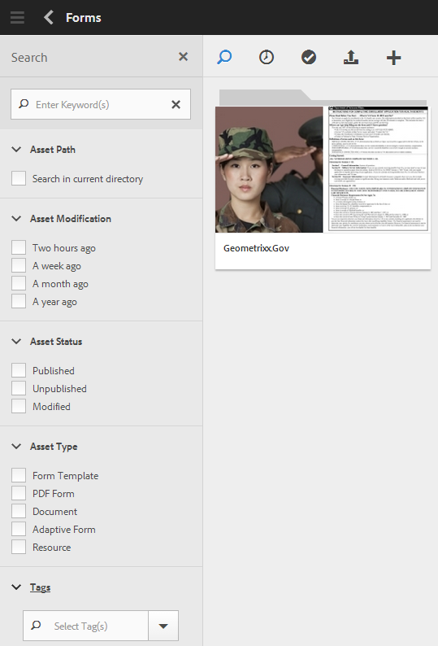

# Zoeken naar formulieren en middelen{#searching-for-forms-and-assets}

U kunt naar uw formulieren of formulierelementen zoeken met behulp van een tekenreeks of tekenreeks, samen met jokertekens. U kunt uw zoekopdracht ook beperken aan de hand van de criteria die beschikbaar zijn in verschillende categorieën in het deelvenster Zoeken.

Wanneer u een of meer criteria selecteert en ook een tekenreeks opgeeft, wordt het snijpunt van de tekst en criteria geretourneerd als zoekresultaten. De zoekresultaten zijn net zo goed als de metagegevens voor formulieren en middelen die worden verstrekt.

Klik , om het onderzoekspaneel te tonen of te verbergen.

## Basiszoekopdracht {#basic-search}

Een basiszoekopdracht is de standaardzoekopdracht, uitgevoerd zonder filters op te geven. AEM Forms voert een volledige tekstzoekopdracht uit naar eigenschappen van metagegevens.

Als u een standaardzoekopdracht wilt uitvoeren, voert u de zoekquery in het tekstveld in en kiest u Enter. U kunt het vervangingskarakter (&#42;) ook ingaan om het even welk aantal karakters aan te passen.

Adobe Experience Manager zoekt naar de ingevoerde tekst in eigenschappen van metagegevens en retourneert de corresponderende resultaten. Als u meer dan één woord typt, komt de zoekbewerking overeen met de volledige zoektekst.

Neem van de volgende punten over het basisonderzoek nota:

* De zoekopdracht wordt uitgevoerd met de eigenschappen van de metagegevens van het formulier en de elementen.
* Als u meer dan één woord typt, komt de zoekbewerking overeen met de volledige zoektekst.
* Zoeken is niet hoofdlettergevoelig. Wanneer u bijvoorbeeld `geometrixx` typt, worden elementen met titels `Geometrixx` , `GEOMETRIXX` en `GeoMetRixx` weergegeven in de zoekresultaten.

* Gedeeltelijke overeenkomsten van een woord worden niet ondersteund. Gebruik jokerteken &#42; als u wilt zoeken met gedeeltelijke tekenreeksen. Als de zoekquery echter overeenkomt met een volledig woord, wordt het bijbehorende formulier of element weergegeven.
* Extra spaties worden gerespecteerd en worden niet bijgesneden tijdens het zoeken. `My form` is bijvoorbeeld niet dezelfde zoekquery als `My form` .

* Als de gegevens en weergavewaarden van de velden in metagegevenseigenschappen verschillend zijn, kunt u geen weergavewaarden gebruiken als zoekparameters. U kunt bijvoorbeeld niet zoeken op basis van een status, zoals Gewijzigd of Gepubliceerd, omdat deze eigenschappen in een andere indeling zijn opgeslagen.

## Geavanceerd zoeken {#advanced-search}

Naast de query kunt u in de zoekcriteria enkele zoekparameters opgeven om de standaardzoekopdracht efficiënter en gerichter te maken.

Zoekveld en parameters of filters voor AEM zoeken in formulieren en middelen

### Middelpad {#asset-path}

Met het filter elementpad kunt u de zoekresultaten beperken tot de huidige map. Als de optie Zoeken in huidige map niet is geselecteerd, bevatten de zoekresultaten elementen uit de basismap. Als de huidige pagina geen map is en de optie &quot;Zoeken in huidige map&quot; is geselecteerd, retourneert de zoekopdracht de elementen in de bovenliggende map.

### Wijziging van element {#asset-modification}

Selecteer een van de volgende opties om te zoeken in alle elementen die binnen een bepaalde tijdsperiode zijn gewijzigd.

| **Optie** | **Beschrijving** |
|---|---|
| Twee uur geleden | Zoeken in alle elementen die in de afgelopen twee uur zijn gewijzigd. |
| Een week geleden | Zoeken in alle elementen die de afgelopen week zijn gewijzigd. |
| Een maand geleden | Zoeken in alle elementen die in de afgelopen maand zijn gewijzigd. |
| Een jaar geleden | Zoeken in alle elementen die in het afgelopen jaar zijn gewijzigd. |

### Status van element {#asset-status}

U kunt naar elementen zoeken met een van de volgende statussen:

* **Gepubliceerd**: Onderzoek alle activa die worden gepubliceerd en niet na het publiceren gewijzigd.

* **Niet gepubliceerd**: Onderzoek alle activa die nooit worden gepubliceerd.

* **Gewijzigd**: Onderzoek alle activa die of unpublished na het publiceren worden gewijzigd.

### Elementtype {#asset-type}

U kunt een willekeurig aantal elementtypen selecteren. De zoekopdracht retourneert de samenvoeging van alle geselecteerde elementtypen.

<table>
 <tbody>
  <tr>
   <th>Optie</th> 
   <th>Beschrijving</th> 
  </tr>
  <tr>
   <td>Formuliersjabloon   </td> 
   <td>Doorzoek alle formuliersjablonen.  </td> 
  </tr>
  <tr>
   <td>PDF-formulier</td> 
   <td>Doorzoek alle PDF-documenten.</td> 
  </tr>
  <tr>
   <td>Document</td> 
   <td>Zoeken in alle documenten.</td> 
  </tr>
  <tr>
   <td>Adaptief formulier   </td> 
   <td>Zoeken in alle adaptieve formulieren.</td> 
  </tr>
  <tr>
   <td>Bron</td> 
   <td>Onderzoek over alle middelen.  </td> 
  </tr>
 </tbody>
</table>

### Tags {#tags}

Tags zijn labels die zijn gekoppeld aan elementen ter identificatie. Selecteer tijdens het zoeken een willekeurig aantal tags in de vervolgkeuzelijst of voeg indien nodig aangepaste tags toe. Een zoekresultaat bevat de doorsnede van de geselecteerde tags.
