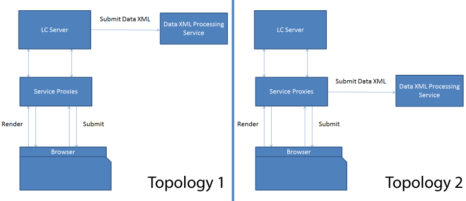

# HTML5-formulierservice-proxy{#html-forms-service-proxy}

De Proxy van de Dienst van HTML5-formulieren is een configuratie om een volmacht voor de voorleggingsdienst te registreren. Om de Volmacht van de Dienst te vormen, specificeer URL van de voorleggingsdienst door verzoekparameter *submissionServiceProxy*.

## Voordelen van serviceproxy {#benefits-of-service-proxy-br}

De serviceproxy verwijdert het volgende:

* Voor de workflow voor HTML5-formulieren moet de verzendservice &quot;/content/xfaforms/submission/default&quot; worden geopend voor gebruikers van HTML5-formulieren. Het stelt AEM servers aan een breder onbedoeld publiek bloot.
* De service-URL is ingesloten in het runtimemodel van het formulier. Het is niet mogelijk om dienstURL weg te veranderen.
* De verzending bestaat uit twee stappen. Voor het verzenden van de formuliergegevens zijn ten minste twee ritten naar de server vereist. Hierdoor wordt de belasting op de server verhoogd.
* In HTML5-formulieren worden gegevens in de aanvraag voor POST verzonden in plaats van in de PDF-aanvraag. Voor werkstromen waarbij zowel PDF- als HTML5-formulieren worden gebruikt, zijn twee verschillende verwerkingsmethoden voor de verzending vereist.

### Topologieën {#topologies-br}

HTML5-formulieren kunnen de volgende topologieën gebruiken om verbinding te maken met de AEM.

* Een topologie waarbij AEM Server- of HTML5-formulieren gegevens via POST naar de server verzenden.
* Een topologie waar de volmachtsserver de gegevens van de POST naar de server verzendt.

HTML5 Forms service proxy topologieën

HTML5-formulieren maken verbinding met de AEM servers om serverscripts, webservices en verzendingen uit te voeren. De XFA-runtime van de HTML5-formulieren gebruikt Ajax-aanroepen naar het eindpunt &quot;/bin/xfaforms/submit&quot; met verschillende parameters om verbinding te maken met de AEM. HTML5-formulieren verbinden AEM servers om de volgende bewerkingen uit te voeren:

#### Voer Server-kant manuscripten en de Diensten van het Web {#execute-server-sided-scripts-and-web-services} uit

De scripts die zijn gemarkeerd om op de server te worden uitgevoerd, worden serverscripts genoemd. De volgende lijst maakt een lijst van alle parameters die in Server-zijde manuscripten en de Diensten van het Web worden gebruikt.

<table>
 <tbody>
  <tr>
   <td>
<strong>Parameter</strong>
 </td>
   <td>
<strong>Beschrijving</strong>
 </td>
  </tr>
  <tr>
   <td>
activity
 </td>
   <td>
De activiteit bevat de gebeurtenissen die het verzoek teweegbrengen. Bijvoorbeeld klikken, afsluiten of wijzigen
 </td>
  </tr>
  <tr>
   <td>
contextSom
 </td>
   <td>
contextSom bevat SOM-expressie van het object waar gebeurtenissen worden uitgevoerd.
 </td>
  </tr>
  <tr>
   <td>
Sjabloonmodel
 </td>
   <td>
De sjabloon bevat de sjabloon die wordt gebruikt om het formulier te genereren.
 </td>
  </tr>
  <tr>
   <td>
contentRoot
 </td>
   <td>
contentRoot bevat de hoofdmap van de sjabloon die wordt gebruikt om het formulier weer te geven.
 </td>
  </tr>
  <tr>
   <td>
Data
 </td>
   <td>
Gegevens bevatten batchbytes die worden gebruikt om het formulier te genereren.
 </td>
  </tr>
  <tr>
   <td>
formDom
 </td>
   <td>
formDom bevat DOM van het HTML5-formulier in JSON-indeling.
 </td>
  </tr>
  <tr>
   <td>
packet
 </td>
   <td>
Het pakket wordt als formulier opgegeven.
 </td>
  </tr>
  <tr>
   <td>
debugDir
 </td>
   <td>
debugDir bevat de map voor foutopsporing die wordt gebruikt om het formulier te genereren.
 </td>
  </tr>
 </tbody>
</table>

#### Gegevens {#submit-data} verzenden

Als u op de knop Verzenden klikt, sturen HTML5-formulieren gegevens naar de server. In de volgende tabel worden alle parameters weergegeven die HTML5-formulieren naar de server verzenden.

<table>
 <tbody>
  <tr>
   <td>
<strong>Parameter</strong>
 </td>
   <td>
<strong>Beschrijving</strong>
 </td>
  </tr>
  <tr>
   <td>
Sjabloonmodel
 </td>
   <td>
Sjabloon waarmee het formulier wordt gegenereerd.
 </td>
  </tr>
  <tr>
   <td>
contentRoot
 </td>
   <td>
de hoofdmap van de sjabloon die wordt gebruikt om het formulier te genereren.
 </td>
  </tr>
  <tr>
   <td>
Gegevens
 </td>
   <td>
batchbytes die worden gebruikt om het formulier weer te geven.
 </td>
  </tr>
  <tr>
   <td>
formDom
 </td>
   <td>
DOM van het HTML5-formulier in JSON-indeling.
 </td>
  </tr>
  <tr>
   <td>
voorlegger
 </td>
   <td>
De URL waar de gegevens-XML wordt gepost.
 </td>
  </tr>
  <tr>
   <td>
debugDir
 </td>
   <td>
De map voor foutopsporing die wordt gebruikt om het formulier te genereren.
 </td>
  </tr>
 </tbody>
</table>

#### Hoe werkt de verzendproxy? {#how-nbsp-the-nbsp-submit-proxy-works}

De verzendserviceproxy fungeert als een pass through als de verzender niet aanwezig is in de parameter request. Het fungeert als een doorbraak. Het verzendt het verzoek naar het /bin/xfaforms/submitAction eindpunt en verzendt de reactie naar runtime XFA.

De voorgelegde de dienstvolmacht selecteert een topologie als voorlegger in de verzoekparameter aanwezig is.

* Als AEM servers de gegevens posten, dienst van de volmacht als ervaart. Het verzendt het verzoek naar het /bin/xfaforms/submitAction eindpunt en verzendt de reactie naar runtime XFA.
* Als de volmacht de gegevens post, gaat de volmachtsdienst alle parameters behalve submitUrl tot */bin/xfaforms/submitAction* eindpunt over en ontvangt xml bytes in reactiestream. Dan, post de volmachtsdienst de gegevens xml bytes aan submitUrl voor verwerking.

* Voordat gegevens (verzoek om POST) naar een server worden verzonden, controleren HTML5-formulieren de connectiviteit en beschikbaarheid van de server. HTML-formulieren verzenden een lege hoofdaanvraag naar de server om de connectiviteit en beschikbaarheid te controleren. Als de server beschikbaar is, verzendt het HTML5-formulier gegevens (verzoek om POST) naar de server. Als de server niet beschikbaar is, wordt een foutbericht *Kan geen verbinding maken met de server,* weergegeven. De detectie vooraf voorkomt dat gebruikers het formulier kunnen bijvullen. De volmachtsservlet behandelt hoofdverzoek en werpen geen uitzondering.
