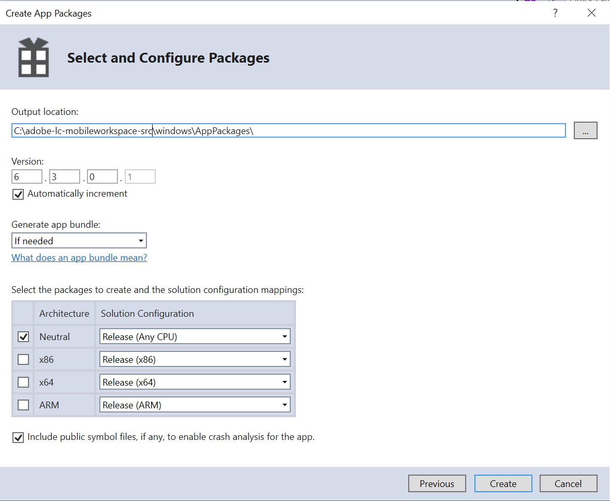

# Opstelling het project van Visual Studio en bouwt Vensters app{#set-up-the-visual-studio-project-and-build-the-windows-app}

AEM Forms biedt de volledige broncode van de AEM Forms-app. De bron bevat alle componenten om een toepassing van de douanewerkruimte te bouwen. Het archief van de broncode, `adobe-lc-mobileworkspace-src-<version>.zip`is een deel van `adobe-aemfd-forms-app-src-pkg-<version>.zip` pakket op de Distributie van de Software.

Voer de volgende stappen uit om de AEM Forms-toepassingsbron op te halen:

1. Open [Softwaredistributie](https://experience.adobe.com/downloads). U hebt een Adobe ID nodig om u aan te melden bij de softwaredistributie.
1. Tik **[!UICONTROL Adobe Experience Manager]** beschikbaar in het koptekstmenu.
1. In de sectie **[!UICONTROL Filters]**:
   1. Selecteer **[!UICONTROL Forms]** in de vervolgkeuzelijst **[!UICONTROL Solution]**.
   2. Selecteer de versie en typ voor het pakket. U kunt de optie **[!UICONTROL Search Downloads]** ook gebruiken om de resultaten te filteren.
1. Tik op de pakketnaam die van toepassing is op het besturingssysteem, selecteer **[!UICONTROL Accept EULA Terms]** en tik **[!UICONTROL Download]**.
1. Open [Pakketbeheer](https://docs.adobe.com/content/help/en/experience-manager-65/administering/contentmanagement/package-manager.html) en klik **[!UICONTROL Upload Package]** om het pakket te uploaden.
1. Selecteer het pakket en klik **[!UICONTROL Install]**.

1. Als u het archief van de broncode wilt downloaden, opent u `https://<server>:<port>/crx/de/content/forms/mobileapps/src/adobe-lc-mobileworkspace-src-<version>.zip` in uw browser.\
   Het bronpakket wordt gedownload op uw apparaat.

In de volgende afbeelding wordt de geëxtraheerde inhoud van de `adobe-lc-mobileworkspace-src-<version>.zip` weergegeven.

In de volgende afbeelding wordt de mapstructuur van de map `windows` in de map `src` weergegeven.

## De omgeving {#setting-up-the-environment} instellen

Voor Windows-apparaten hebt u het volgende nodig:

* Microsoft Windows 8.1 of Windows 10
* Microsoft Visual Studio 2015
* Microsoft Visual Studio Tools for Apache Cordova

## Visual Studio Project instellen voor AEM Forms-app {#setting-up-visual-studio-project-for-aem-forms-app}

Voer de volgende stappen aan opstelling uit AEM Forms app project in Visual Studio.

1. Kopieer het `adobe-lc-mobileworkspace-src-<version>.zip` archief naar `%HOMEPATH%\Projects` omslag in Vensters 8.1 of Windows 10 apparaat met Visual Studio 2015 geïnstalleerd en gevormd.
1. Extraheer het archief in de map `%HOMEPATH%\Projects\MobileWorkspace`.
1. Navigeer naar de map `%HOMEPATH%\Projects\MobileWorkspace\adobe-lc-mobileworkspace-src-[versionsrc]\windows`.
1. Open het `CordovaApp.sln` dossier gebruikend Visual Studio 2015 en ga aan de bouw van AEM Forms app te werk.

## AEM Forms-app {#build-aem-forms-app} maken

Voer de volgende stappen uit om AEM Forms-app te maken en te implementeren.

>[!NOTE]
>
>Gegevens die zijn opgeslagen in het Windows-bestandssysteem voor de AEM Forms-toepassing, worden niet gecodeerd. Men adviseert dat u een derdehulpmiddel zoals de Encryptie van de Aandrijving van Windows BitLocker gebruikt om schijfgegevens te coderen.

1. In de StandaardToolbar van Visual Studio, selecteer **Versie** van drop-down voor bouwstijlwijze.

1. Selecteer Windows-AnyCPU, Windows-x64 of Windows-x86 op basis van uw platform. Windows-AnyCPU wordt aanbevolen.
1. In de Ontdekkingsreiziger van de Oplossing van Visual Studio, klik het project **CordovaApp.Windows** met de rechtermuisknop aan en selecteer **Opslag > Create AppPackages**.

   

   De wizard App Packages maken wordt weergegeven.

   Het installatiebestand van CordovaApp.Windows_3.0.2.0_anycpu.appx wordt gemaakt in de map platforms\windows\AppPackages\CordovaApp.Windows_3.0.2.0_anycpu_Test.

   Als u de fout `Retarget to windows 8.1 required` tegenkomt, klik de fout met de rechtermuisknop aan en in pop-up menu, uitgezocht **Opnieuw richten aan Vensters 8.1**.

   

1. Selecteer bij de wizard App Packages maken de optie weer of niet dat u de app wilt uploaden naar de Windows Store en klik op **Volgende**.

   

1. Breng de gewenste wijzigingen aan in de parameters, zoals de versie en uitvoerlocatie van de build van de app.

   

1. Nadat het project is gemaakt, kunt u de app installeren met:

   * Windows PowerShell
   * Visual Studio

   Voor het `.appx`-pakket zijn de volgende items vereist om te kunnen worden geïnstalleerd:

   1. WinJS-bibliotheek
   1. Zorg ervoor dat het pakket wordt geleverd met een zelfondertekend certificaat of een door een vertrouwde instantie ondertekend openbaar certificaat, zoals VeriSign.
   1. Licentie voor ontwikkelaars

   De map Platforms\windows\AppPackages\CordovaApp.Windows_3.0.2.0_anycpu_Test bevat de vier hoofdcomponenten ervan:

   1. `.appx` file
   1. Certificaat (momenteel is het een zelfondertekend certificaat van Apache Cordova)
   1. Afhankelijkheidsmap
   1. PowerShell-bestand (.ps1-extensie)

## Het opstellen van een toepassing gebruikend Vensters PowerShell {#deploying-an-app-using-windows-powershell}

Er zijn twee manieren om de toepassing op een apparaat van Vensters te installeren.

### Door de ontwikkelaarslicentie {#by-acquiring-the-developer-license} aan te schaffen

1. Klik met de rechtermuisknop op het PowerShell-bestand ( `Add-AppDevPackage.ps1)`) en kies **Uitvoeren met PowerShell**.

1. De opstelling zet u ertoe aan om een ontwikkelaarvergunning te krijgen. Gebruik Microsoft-accountgegevens om een ontwikkelaarslicentie te verkrijgen.\
   Deze licentie is 30 dagen geldig en u kunt deze gratis verlengen.
1. Wanneer u de ontwikkelaarslicentie aanschaft, wordt het zelfondertekende certificaat geïnstalleerd op het systeem en wordt de toepassing correct geïnstalleerd.

### Door apparaten in bedrijfsbezit te gebruiken {#by-using-enterprise-owned-devices}

Voor apparaten die eigendom zijn van een onderneming en die zijn aangesloten bij het domein van de onderneming, is het niet nodig een ontwikkelaarslicentie aan te schaffen.

Apparaten in bedrijfsbezit gebruiken Professional- en Enterprise-versies van Windows.

Microsoft raadt u aan een door een vertrouwde instantie uitgegeven openbaar certificaat, zoals VeriSign, te installeren.

De app implementeren:

* Zorg ervoor dat het apparaat wordt aangesloten bij het domein van de onderneming.
* Groepsbeleid instellen inschakelen.

**Groepsbeleid instellen inschakelen:**

1. Voer `gpedit.msc` uit op uw apparaat.
1. Navigeer naar **Computerconfiguratie > Systeembeheer > Windows-component > Implementatie toepassingspakket**.
1. Klik met de rechtermuisknop op **Alle vertrouwde apps mogen worden geïnstalleerd**.
1. Klik **Bewerken** en selecteer **Ingeschakeld**.

1. Klik **OK**.

Bewerk het Visual Studio-script dat PowerShell heeft gegenereerd om te voorkomen dat het ontwikkelaarslicentie verwerft.

In het manuscript PowerShell, plaats de variabele: `$NeedDeveloperLicense = $false`.

Voor apparaten die geen domeinverbinding hebben, is de sideladende sleutel van de productactivering vereist. U kunt deze aanschaffen bij een Windows-leverancier.

Voor Windows 8.1 Home Edition, is er geen groepsbeleid, wordt de onderneming zijladen niet toegestaan, en u kunt zich niet bij het met het ondernemingsdomein aansluiten. Implementeer de app op een Windows 8.1 Home Edition-apparaat met een ontwikkelaarslicentie.

Klik [hier](https://blogs.msdn.com/b/mvpawardprogram/archive/2014/03/24/side-loading-deployment-of-windows-store-apps-in-enterprises-step-by-step.aspx) voor meer informatie.

## Een toepassing implementeren met Visual Studio {#deploying-an-app-using-visual-studio}

Om app op Vensters te installeren gebruikend Visual Studio:

1. Sluit het apparaat aan met extern foutopsporingsprogramma.\
   Zie [Windows Store-apps uitvoeren op een externe computer](https://docs.microsoft.com/en-us/visualstudio/debugger/run-windows-store-apps-on-a-remote-machine) voor meer informatie.

1. Met uw open app in Visual Studio, kies Vensters-x64, Vensters-x86, of Vensters-AnyCPU van de lijst van de Platforms van de Oplossing, en selecteer **Verre Machine**.
1. Uw app wordt geïmplementeerd op de externe computer.

