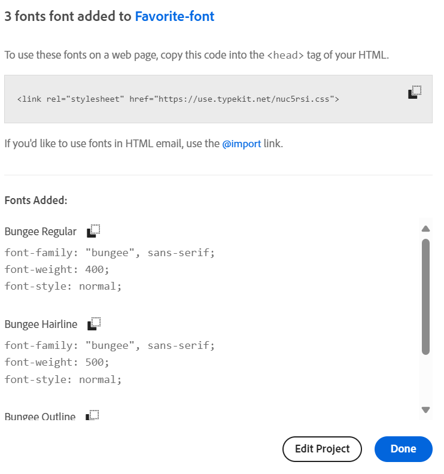

# Stijl uw adaptieve formulier {#do-not-publish-style-your-adaptive-form}

Leer een aangepast thema te maken, afzonderlijke onderdelen op te maken en Webben Fonts in een thema te gebruiken.

Deze zelfstudie is een stap in de [Uw eerste adaptieve formulier maken](https://helpx.adobe.com/experience-manager/6-3/forms/using/create-your-first-adaptive-form.html) reeks. De Adobe raadt u aan de reeks in chronologische volgorde te volgen om de volledige Gebruikszaak van de zelfstudie te begrijpen, uit te voeren en te demonstreren.

## Over de zelfstudie  {#about-the-tutorial}

U kunt thema&#39;s gebruiken om een adaptief formulier een unieke vormgeving en stijl te geven. U kunt kant-en-klare thema&#39;s toepassen die worden geleverd met de adaptieve formuliereditor of zelf aangepaste thema&#39;s maken. AEM [!DNL Forms] een [themaeditor](https://helpx.adobe.com/experience-manager/6-3/forms/using/themes.html) aangepaste thema&#39;s maken. Met één thema kunt u hetzelfde adaptieve formulier weergeven dat u op mobiele apparaten, tablets of desktops hebt geopend. Eerdere kennis van CSS of LESS is niet vereist voor het gebruik van de themaeditor, maar is wel gewenst.

Aan het einde van de zelfstudie moet u het volgende kunnen doen:

* Een thema uit het vak toepassen op een adaptief formulier
* Een thema maken voor een adaptief formulier met de themaeditor
* Afzonderlijke componenten opmaken
* Bonussectie: Webben Fonts gebruiken in een aangepast thema

Het formulier moet er ongeveer als volgt uitzien nadat u de zelfstudie hebt voltooid:

## Voordat u begint {#before-you-start}

Download de koptekst- en logo-afbeeldingen hieronder op uw lokale computer. De koptekst van de `shipping-address-add-update-form` Het adaptieve formulier gebruikt de koptekst- en logo-afbeeldingen. De koptekstafbeelding wordt rechts van de koptekst weergegeven.

[Bestand ophalen](assets/header-style.png)

[Bestand ophalen](assets/logo-1.png)

## Stap 1: Een thema toepassen op het aangepaste formulier {#step-apply-a-theme-to-your-adaptive-form}

De adaptieve vormenredacteur verstrekt veelvoudige uit-van-de-doos thema&#39;s. Als u geen aangepaste stijl wilt gebruiken voor het aangepaste formulier, kunt u ook uw aangepaste formulieren publiceren met een thema dat buiten de verpakking valt. Thema&#39;s zijn onafhankelijk van adaptieve vormen. U kunt hetzelfde thema toepassen op meerdere adaptieve formulieren.

**Een thema toepassen op het aangepaste formulier:**

1. Open het aangepaste formulier voor bewerking.

   [http://localhost:4502/editor.html/content/forms/af/shipping-address-add-update-form.html](http://localhost:4502/editor.html/content/forms/af/shipping-address-add-update-form.html)

1. Open eigenschappen van **[!UICONTROL Adaptive Form container]**. Blader in de eigenschappenbrowser naar **[!UICONTROL Basic]** > **[!UICONTROL Adaptive Form Theme]**. De **[!UICONTROL Adaptive Form Theme]** worden alle kant-en-klare thema&#39;s en aangepaste thema&#39;s weergegeven. Standaard wordt het thema Canvas toegepast.
1. Selecteer een thema in het menu **[!UICONTROL Adaptive Form Theme]** veld. Bijvoorbeeld: **Onderzoeken**. Selecteren  zodat u het geselecteerde thema kunt toepassen.

   

   **Afbeelding:** *Aangepast formulier met het standaardthema*

   

   **Afbeelding:** *Aangepast formulier met het thema Beoordeling*

## Stap 2: Werk het aangepaste formulier bij {#step-update-your-adaptive-form}

Voor het hierboven weergegeven ontwerp zijn wijzigingen vereist in de plaatsaanduidingstekst en het logo van het bestaande adaptieve formulier.

**Het aangepaste formulier bijwerken:**

1. Wijzig het bestaande logo en de tekst van de koptekst. Het logo verwijderen:

   1. Open het formulier in de formuliereditor.

      [http://localhost:4502/editor.html/content/forms/af/shipping-address-add-update-form.html](http://localhost:4502/editor.html/content/forms/af/shipping-address-add-update-form.html)

   1. Logoafbeelding selecteren in het dialoogvenster [!UICONTROL header] en selecteert u  **[!UICONTROL properties]**. In de [!UICONTROL image] selecteert u X om de bestaande logoafbeelding te verwijderen.
   1. Selecteren **[!UICONTROL upload]** selecteert u het bestand logo.png en selecteert u  om de wijzigingen op te slaan De afbeelding is gedownload in het dialoogvenster [Voordat u begint](/help/forms/using/style-your-adaptive-form.md#before-you-start) sectie.
   1. Koptekst selecteren `We.Retail`en selecteert u  **[!UICONTROL edit]**. Koptekst wijzigen in `we retail`. Alleen vette opmaak toepassen op `we`in `we retail`.

      

1. Titel verwijderen en plaatsaanduidingstekst toevoegen:

   1. Selecteer het veld Customer ID en selecteer  eigenschappen.
   1. Kopieer de inhoud van de **[!UICONTROL Title]** aan de **[!UICONTROL Placeholder Text]** veld.
   1. De inhoud van het dialoogvenster **[!UICONTROL Title]** veld en selecteer .
   1. Herhaal de vorige drie stappen voor alle tekstvakken, het numerieke vak en het e-mailveld in het formulier.

      

## Stap 3: Een aangepast thema maken voor het aangepaste formulier {#step-create-a-custom-theme-for-your-adaptive-form}

U kunt de [themaeditor](/help/forms/using/themes.md) aangepaste thema&#39;s maken. De themaredacteur is een almachtige redacteur WYSIWYG. Het is een visuele methode om CSS op diverse componenten van een adaptieve vorm toe te passen. Het biedt fijnere besturingselementen voor stijlcomponenten en deelvensters van een adaptieve vorm.

Een thema is een afzonderlijke entiteit, zoals adaptieve formulieren. Deze bevat stijlen (CSS) voor de componenten en deelvensters van een adaptief formulier. Stijlen omvatten CSS-eigenschappen zoals achtergrondkleuren, statuskleuren, transparantie, uitlijning en grootte. Wanneer u een thema toepast, wordt de opgegeven stijl toegepast op de corresponderende componenten van een adaptief formulier.

In deze zelfstudie maakt u een stijl van de kop- en voettekst, tekst en numerieke componenten, de bijlage en knoppen. Laten we beginnen met het maken van een thema:

### Een thema maken {#create-a-theme}

1. Meld u aan bij de AEM auteur en navigeer naar **[!UICONTROL Adobe Experience Manager]** > **[!UICONTROL Forms]** > **[!UICONTROL Themes]**. De standaard-URL is [http://localhost:4502/aem/forms.html/content/dam/formsanddocuments-themes](http://localhost:4502/aem/forms.html/content/dam/formsanddocuments-themes).
1. Selecteren **[!UICONTROL Create]** en selecteert u **[!UICONTROL Theme]**. De [!UICONTROL Create Theme] Er verschijnt een pagina met de velden die u nodig hebt om een thema te maken. De **[!UICONTROL Title]** en **[!UICONTROL Name]** velden zijn verplicht:

   * **Titel:** Geef een titel van het thema op. Bijvoorbeeld: **Globaal thema.** Met de titel kunt u het thema herkennen aan de lijst met thema&#39;s.
   * **Naam:** Geef de naam van het thema op. Bijvoorbeeld: **Globaal thema.** Er wordt een knooppunt met de opgegeven naam gemaakt in de repository. Wanneer u een titel begint te typen, wordt automatisch de waarde voor het naamveld gegenereerd. U kunt de voorgestelde waarde wijzigen. Het naamveld mag alleen alfanumerieke tekens, afbreekstreepjes en onderstrepingstekens bevatten. Alle ongeldige invoer wordt vervangen door een afbreekstreepje.

1. Selecteer **[!UICONTROL Create]**. Er wordt een thema gemaakt en er verschijnt een dialoogvenster waarin u het formulier kunt openen om het te bewerken. Selecteren **[!UICONTROL Open]** om het nieuwe thema op een nieuw tabblad te openen. Het thema wordt geopend in de themaeditor. Voor het opmaken gebruikt de themaeditor een adaptief formulier dat niet in de doos is meegeleverd en dat wordt geleverd met AEM [!DNL Forms].

   Voor informatie over het gebruiken van de interface van de themaredacteur, zie [Informatie over de themaeditor](/help/forms/using/themes.md#aboutthethemeeditor).

1. Selecteren **[!UICONTROL Theme Options]**  > **[!UICONTROL Configure]**. In de **[!UICONTROL Preview Form]** veld selecteert u de **verzendadres-add-update-form** adaptief formulier, selecteer , selecteert u **[!UICONTROL Save]**. De themaeditor is nu geconfigureerd voor het gebruik van uw eigen adaptieve formulier in plaats van het standaard adaptieve formulier. Selecteren **[!UICONTROL Cancel]** om terug te keren naar de themaeditor.

   

   **Afbeelding:** *Thema-editor met het adaptieve formulier voor het verzendadres-add-update*

   

   **Afbeelding:** *Adaptief formulier met het standaardformulier*

### Stijlkop- en voettekst {#style-header-and-footer}

Koptekst en voettekst geven een consistent en duidelijk beeld van een adaptief formulier. Over het algemeen bevat de koptekst het logo en de naam van de organisatie, bevat de voettekst copyrightinformatie en deze blijven in meerdere vormen van een organisatie identiek. De kop- en voettekst van het adaptieve formulier voor het verzendadres-add-update-formulier opmaken:

1. Navigeren door de **[!UICONTROL Header]** > **[!UICONTROL Text]** in het deelvenster Kiezers. Het deelvenster Kiezers bevindt zich links van de themaeditor. Als het deelvenster niet zichtbaar is, selecteert u  Zijpaneel in-/uitschakelen.

1. Stel de volgende eigenschappen in in de **[!UICONTROL Text]** accordeon en selecteer .

   | Eigenschap | Waarde |
   |---|---|
   | Lettertypefamilie | Arial® |
   | Lettertypekleur | FFFFFF |
   | Tekengrootte | 54 px |

1. Selecteer de [!UICONTROL header] widget en selecteer **[!UICONTROL Header]**. De opties voor het opmaken van de koptekstwidget worden aan de linkerkant weergegeven. Breid uit **[!UICONTROL Dimensions & Position]** accordeon instellen **[!UICONTROL Height]** tot `120px`en selecteert u .
1. Breid uit **[!UICONTROL Background]** stelt de accordeon van de koptekstwidget in **[!UICONTROL Background Color]** tot `F6921E.`

   Overslaan **[!UICONTROL Image & Gradient]** > **[!UICONTROL + Add]**, selecteert u **[!UICONTROL Image]**. Stel de volgende eigenschappen in en selecteer .

   | Eigenschap | Waarde |
   |---|---|
   | image | Upload header-style.png. De afbeelding is gedownload in het dialoogvenster [Voordat u begint](/help/forms/using/style-your-adaptive-form.md#before-you-start) sectie. |
   | Positie | Rechts onder |
   | Naast elkaar | Niet herhalen |

1. Selecteer in de themaeditor het logo in de koptekst en selecteer **[!UICONTROL Header Logo]**. Breid de Dimensionen &amp; de accordeon van de Positie uit, plaats de volgende eigenschappen en selecteer .

   <table> 
    <tbody> 
     <tr> 
      <td><b>Marge</b></td> 
      <td><b>Waarde</b></td> 
     </tr> 
     <tr> 
      <td>Marge</td> 
      <td> 
       <ul> 
        <li>Boven: 1,5 rem</li> 
        <li>Onder: -35 px</li> 
        <li>Links: 1rem<strong>  </strong></li> 
       </ul> 
<strong>Tip:</strong> Selecteer de  koppelingspictogram als u voor elk veld een andere waarde wilt opgeven.  
 </td> 
     </tr> 
     <tr> 
      <td>Hoogte</td> 
      <td>4.75 rem</td> 
     </tr> 
    </tbody> 
   </table>

1. Selecteer de voettekstwidget en selecteer **[!UICONTROL Footer]**. Breid uit **[!UICONTROL Background]** accordeon instellen **[!UICONTROL Background Color]** tot `F6921E`en selecteert u .

### De component voor gegevensvastlegging opmaken en een achtergrond op het adaptieve formulier toepassen {#style-the-data-capture-component-and-apply-a-background-to-the-adaptive-form}

U kunt meerdere componenten in een adaptief formulier gebruiken om gegevens vast te leggen. Bijvoorbeeld tekstvak en numeriek vak. U kunt voor elke component een identieke stijl opgeven voor alle componenten voor het vastleggen van gegevens of een aparte stijl. In deze zelfstudie wordt een identieke stijl toegepast op numerieke vakken (Customer ID, ZIP Code) en tekstvakken (Customer ID, Name, Shipping Address, State, Email). De componenten voor gegevensvastlegging opmaken:

1. Selecteer de **[!UICONTROL Customer ID]** en selecteer de **[!UICONTROL Field Widget]** -optie. Stel de volgende eigenschappen in en selecteer .

   <table> 
    <tbody> 
     <tr> 
      <td><b>Accordeon</b></td> 
      <td><b>Eigenschap</b></td> 
      <td><b>Waarde</b></td> 
     </tr> 
     <tr> 
      <td>Rand</td> 
      <td>Randkleur</td> 
      <td>A7A9AC</td> 
     </tr> 
     <tr> 
      <td>Rand</td> 
      <td>Straal rand </td> 
      <td> 
       <ul> 
        <li>Boven: 7 px  </li> 
        <li>Rechts: 7 px  </li> 
        <li>Onder: 7 px  </li> 
        <li>Links: 7 px  </li> 
       </ul> </td> 
     </tr> 
     <tr> 
      <td>Tekst</td> 
      <td>Lettertypefamilie</td> 
      <td>Arial®</td> 
     </tr> 
     <tr> 
      <td>Tekst</td> 
      <td>Lettertypekleur</td> 
      <td>939598  </td> 
     </tr> 
     <tr> 
      <td>Tekst</td> 
      <td>Tekengrootte</td> 
      <td>18 px</td> 
     </tr> 
     <tr> 
      <td>Dimensionen en positie</td> 
      <td>Breedte</td> 
      <td>60%</td> 
     </tr> 
     <tr> 
      <td>Dimensionen en positie</td> 
      <td>Marge</td> 
      <td> 
       <ul> 
        <li>Links: 10 rem</li> 
       </ul> </td> 
     </tr> 
    </tbody> 
    </table>

1. Selecteer het lege gebied boven de **[!UICONTROL Customer ID]** veld en selecteer **[!UICONTROL Responsive Panel Container]**. Stel de **[!UICONTROL Background]** > **[!UICONTROL Background Color]** tot F1F2F2. Selecteren .

   

### De knoppen opmaken {#style-the-buttons}

U kunt een aangepast thema gebruiken om een identieke stijl toe te passen op alle knoppen van het aangepaste formulier en [inline styling](/help/forms/using/inline-style-adaptive-forms.md) om een stijl op een specifieke knoop toe te passen. U kunt als volgt de knoppen opmaken:

1. Selecteer de **[!UICONTROL Submit]** en selecteert u de **[!UICONTROL Button]** -optie. Stel de volgende eigenschappen in en selecteer .

   <table> 
    <tbody> 
     <tr> 
      <td><b>Accordeon</b></td> 
      <td><b>Eigenschap</b></td> 
      <td><b>Waarde</b></td> 
     </tr> 
     <tr> 
      <td>Achtergrond</td> 
      <td>Achtergrondkleur</td> 
      <td>F6921E</td> 
     </tr> 
     <tr> 
      <td>Rand  </td> 
      <td>Randkleur</td> 
      <td>F6921E</td> 
     </tr> 
     <tr> 
      <td>Rand</td> 
      <td>Straal rand </td> 
      <td> 
       <ul> 
        <li>Boven: 7 px  </li> 
        <li>Rechts: 7 px  </li> 
        <li>Onder: 7 px  </li> 
        <li>Links: 7 px</li> 
       </ul> </td> 
     </tr> 
     <tr> 
      <td>Tekst  </td> 
      <td>Lettertypefamilie</td> 
      <td>Arial®</td> 
     </tr> 
     <tr> 
      <td>Tekst</td> 
      <td>Lettertypekleur</td> 
      <td>FFFFFF</td> 
     </tr> 
     <tr> 
      <td>Tekst</td> 
      <td>Tekengrootte</td> 
      <td>18 px</td> 
     </tr> 
    </tbody> 
   </table>

1. [Het aangepaste thema toepassen](/help/forms/using/style-your-adaptive-form.md#step-apply-a-theme-to-your-adaptive-form), Global Theme, in uw adaptieve vorm. Als de stijl niet op het adaptieve formulier wordt weerspiegeld, maakt u de cache van de browser leeg en probeert u het opnieuw.

   

## Stap 4: afzonderlijke onderdelen opmaken {#step-style-individual-components}

Sommige stijlen zijn alleen van toepassing op een bepaalde component. Dergelijke componenten worden opgemaakt in de editor voor adaptieve formulieren.

1. Open het aangepaste formulier voor bewerking. [http://localhost:4502/editor.html/content/forms/af/shipping-address-add-update-form.html](http://localhost:4502/editor.html/content/forms/af/change-billing-shipping-address.html)
1. Selecteer op de bovenste balk de optie **[!UICONTROL Style]** -optie.

   

1. Selecteer de **[!UICONTROL Attach]** en selecteert u de pictogram. Stel de volgende eigenschappen in in de **[!UICONTROL Dimensions and Position]** accordeon:

   | Eigenschap | Waarde |
   |---|---|
   | Float | Links |
   | Breedte | 10% |

1. Selecteer de **[!UICONTROL Government approved address proof]** en selecteert u de pictogram. Stel de volgende eigenschappen in:

   <table> 
    <tbody> 
     <tr> 
      <td><b>Accordeon</b></td> 
      <td><b>Eigenschap</b></td> 
      <td><b>Waarde</b></td> 
     </tr> 
     <tr> 
      <td>Dimensionen en positie</td> 
      <td>Float</td> 
      <td>Links</td> 
     </tr> 
     <tr> 
      <td>Dimensionen en positie</td> 
      <td>Breedte</td> 
      <td>73%</td> 
     </tr> 
     <tr> 
      <td>Dimensionen en positie</td> 
      <td>Opvulling</td> 
      <td> 
       <ul> 
        <li>Links: 10 px</li> 
       </ul> </td> 
     </tr> 
     <tr> 
      <td>Dimensionen en positie</td> 
      <td>Hoogte</td> 
      <td>40 px</td> 
     </tr> 
     <tr> 
      <td>Dimensionen en positie  </td> 
      <td>Marge</td> 
      <td>  
       <ul> 
        <li>Recht: 2 rem</li> 
        <li>Links: 10 rem </li> 
       </ul> </td> 
     </tr> 
     <tr> 
      <td>Achtergrond</td> 
      <td>Achtergrondkleur</td> 
      <td>FFFFFF</td> 
     </tr> 
     <tr> 
      <td>Rand</td> 
      <td>Randbreedte</td> 
      <td>1 px</td> 
     </tr> 
     <tr> 
      <td>Rand</td> 
      <td>Randstijl</td> 
      <td>Effen</td> 
     </tr> 
     <tr> 
      <td>Rand</td> 
      <td>Randkleur</td> 
      <td>A7A9AC</td> 
     </tr> 
     <tr> 
      <td>Rand</td> 
      <td>Straal rand</td> 
      <td>7 px</td> 
     </tr> 
     <tr> 
      <td>Tekst</td> 
      <td>Lettertypefamilie</td> 
      <td>Arial®</td> 
     </tr> 
     <tr> 
      <td>Tekst</td> 
      <td>Lettertypekleur</td> 
      <td>BCBEC0</td> 
     </tr> 
     <tr> 
      <td>Tekst</td> 
      <td>Tekengrootte</td> 
      <td>18 px</td> 
     </tr> 
     <tr> 
      <td>Tekst</td> 
      <td>Lijnhoogte</td> 
      <td>2</td> 
     </tr> 
     </tr> 
    </tbody> 
   </table>

1. Selecteer de **[!UICONTROL Submit]** en selecteert u de  pictogram. Stel de volgende eigenschappen in:

   <table> 
    <tbody> 
     <tr> 
      <td><b>Accordeon</b></td> 
      <td><b>Eigenschap</b></td> 
      <td><b>Waarde</b></td> 
     </tr> 
     <tr> 
      <td>Dimensionen en positie</td> 
      <td>Float</td> 
      <td>Rechts</td> 
     </tr> 
     <tr> 
      <td>Dimensionen en positie</td> 
      <td>Marge</td> 
      <td> 
       <ul> 
        <li>Boven: 5 rem</li> 
        <li>Rechts: 14 rem</li> 
        <li>Onder: 20 px</li> 
        <li>Links: 20 px  </li> 
       </ul> </td> 
     </tr> 
     <tr> 
      <td>Achtergrond</td> 
      <td>Achtergrondkleur</td> 
      <td>F6921E</td> 
     </tr> 
     <tr> 
      <td>Rand</td> 
      <td>Randkleur</td> 
      <td>F6921E</td> 
     </tr> 
    </tbody> 
   </table>

   

## Stap 5: Sectie van de beurs: Het gebruiken van Webben Fonts in een douanethema {#step-bonus-section-using-web-fonts-in-a-custom-theme}

U kunt verschillende lettertypen gebruiken om een adaptief formulier te ontwerpen. Op alle apparaten waarop het adaptieve formulier wordt weergegeven, worden mogelijk niet de fonts gebruikt om het adaptieve formulier te ontwerpen. U kunt een service voor weblettertypen gebruiken om de vereiste lettertypen aan het doelapparaat te leveren.

[!DNL Adobe Fonts] is een dienst van Webben Fonts. U kunt de service configureren en gebruiken met adaptieve formulieren. Te gebruiken [!DNL Adobe Fonts] in adaptieve vorm:
1. Bladeren in het dialoogvenster [bibliotheek met Adobe lettertypen](https://fonts.adobe.com/) en kies een font om het formulier op te maken.
<!--
>[!NOTE]
>
> [!DNL Typekit] is now called Adobe Fonts and is included with Creative Cloud and other subscriptions. [Learn more](https://fonts.adobe.com/).-->

>[!NOTE]
>
> U kunt labels of filters toevoegen om de lijst met lettertypen te verfijnen.

1. Klik op de knop &lt;/> om de familie aan een webproject toe te voegen, voor het geval u een lettertype vindt dat u bevalt.

   

   Er verschijnt een dialoogvenster Lettertypen toevoegen aan een webproject.

   >[!NOTE]
   >
   > U kunt alleen lettertypen aan uw webproject toevoegen als de knop &lt;/> beschikbaar is.

2. Noem uw Webproject.
3. Schakel de selectievakjes in om de tekendikten en -stijlen te selecteren die u wilt opnemen.

   

4. Selecteren **Klikken** om het project te maken.
5. Kopieer de insluitcode en de URL van het scherm.
   

6. Klikken **Gereed** om het venster van het Webproject te sluiten.
7. Meld u aan bij uw AEM en ga naar de URL `http://server:port/crx/de/index.jsp#`
8. Een mapstructuur maken in bijvoorbeeld CRXDE `/apps/[fontslibrary]/[customlibrary(clientlibrary)]`.
9. Naar het nieuwe ontwerp gaan `clientlibs` en voeg de `allowProxy` en `categories` eigenschappen.
10. Navigeren naar `/apps/[fontslibrary]/[customlibrary(clientlibrary)]` en maak een css-map.
11. Ga naar de gemaakte CSS-map en maak een bestand. Maak bijvoorbeeld een bestand als `fonts.css` en plak de insluitcode samen met de URL.
   
12. Sla de wijzigingen op.

>[!NOTE]
>
> Als u de toegevoegde aangepaste lettertypen in een adaptief formulier wilt gebruiken, moet u ervoor zorgen dat de naam van de clientbibliotheek in het dialoogvenster **[!UICONTROL Client Library Category]** Hiermee wordt uitgelijnd op de naam die is opgegeven in de categorieoptie van de clientlib-map.

De opgenomen lettertypen zijn nu toegankelijk voor het adaptieve formulier via de volgende aangepaste clientbibliotheek voor lettertypen.

<!--
Create Adobe Fonts Configuration

1. To create a API Token, go to **login** > **API Token** > **Make me a new API token**.

   

2. Once, you click **Make me a new API token**, a new token is generated. 
3. Copy the generated token for future use.
4. Now login to your AEM  author instance. On the author instance, go to **[!UICONTROL Tools]**>**[!UICONTROL Cloud Services]**> **[!UICONTROL Adobe Fonts]**.
5. Select the configuration container and click **Create**. **[UICONTROL Create Adobe Fonts Configuration]** screen appears.
    

6. Spceify the name and paste the API token in the **[!UICONTROL Kit ID]** textbox.
7. Click **Create**.

The fonts added to the **[!UICONTROL Adobe Fonts]** are available for selection in the **[!UICONTROL Text]** accordion of all the components.
1. In the theme editor, navigate to **[!UICONTROL Theme Options]**  > **[!UICONTROL Configure]**. 
2. In the **[!UICONTROL Adobe Fonts Configuration]** field, select the kit, and click **[!UICONTROL Save]**.

1. Create an [Adobe Fonts](https://fonts.adobe.com/?ref=tk.com) account, create a kit, add font Myriad Pro to the kit, publish the kit, and obtain the Kit ID. It is required to use [!DNL Adobe Fonts] (Web Fonts) in an adaptive form. 
1. In the AEM [!DNL Forms] Server, navigate to  **[!UICONTROL Adobe Experience Manager]** > **[!UICONTROL Tools]**  > **[!UICONTROL Adobe Fonts]**. Now, open a configuration folder. If a configuration is already available, click the **[!UICONTROL Create]** button to create an instance.

   On the Create Configuration dialog, specify a **Title** for the configuration, and click **[!UICONTROL Create]**. You are redirected to the configuration page. In the [!UICONTROL Edit Component] dialog that appears, provide your **Kit ID** and click **[!UICONTROL OK]**. -->

