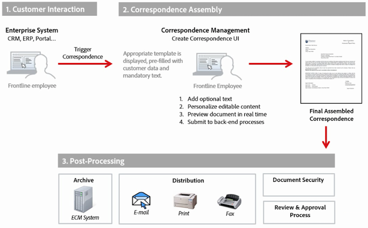

# Nabewerking van brieven en interactieve communicatie{#post-processing-of-letters-and-interactive-communications}

## Nabewerking {#post-processing}

De agenten kunnen postverwerkingswerkschema&#39;s op brieven en interactieve mededelingen associëren en uitvoeren. Nabewerkingsproces dat moet worden uitgevoerd, kan worden geselecteerd in de weergave Eigenschappen van de Letter-sjabloon. U kunt postprocessen instellen voor het e-mailen, afdrukken, faxen of archiveren van uw laatste brieven.

Om postprocessen met brieven of interactieve mededelingen te associëren, moet u eerst opstelling de postprocessen. Er kunnen twee typen workflows worden uitgevoerd op verzonden brieven:

1. **Workflow voor formulieren:** Dit zijn de AEM-formulieren voor JEE-procesbeheerworkflows. Instructies voor het instellen van de [Forms Workflow](#formsworkflow).

1. **AEM-workflow:** AEM-workflows kunnen ook worden gebruikt als postprocessen voor verzonden brieven. Instructies voor het instellen van de [AEM-workflow](../../forms/using/aem-forms-workflow.md).

## Forms Workflow {#formsworkflow}

1. Open in AEM de configuratie van de webconsole van Adobe Experience Manager voor uw server met behulp van de volgende URL: `https://<server>:<port>/<contextpath>/system/console/configMgr`

   

1. Zoek op deze pagina de configuratie van AEM Forms Client SDK en vouw deze uit door erop te klikken.
1. Voer in Server-URL de naam van uw AEM-formulieren in op de JEE-server, aanmeldingsgegevens en klik op **Opslaan**.

   

1. Geef de gebruikersnaam en het wachtwoord op.
1. Zorg ervoor dat sun.util.agenda wordt toegevoegd aan Configuratie van de Firewall Deserialization.

   Ga naar Configuratie van de Firewall Deserialization en onder Witte klassen van pakketprefixen, voeg sun.util.agenda toe.

1. Uw servers zijn nu toegewezen en de postprocessen in AEM Forms on JEE zijn beschikbaar in de AEM-gebruikersinterface tijdens het maken van letters.

   

1. Als u een proces/service wilt verifiëren, kopieert u de naam van een proces en gaat u terug naar de pagina Configuraties van de webconsole van Adobe Experience Manager > Configuratie van AEM Forms Client SDK en voegt u het proces toe als een nieuwe service.

   Als in de vervolgkeuzelijst Eigenschappen op de lettertypepagina bijvoorbeeld de naam van het proces wordt weergegeven als Forms Workflow -> ValidCCPostProcess/SaveXML, voegt u een servicenaam toe als `ValidCCPostProcess/SaveXML`.

1. Als u AEM Forms wilt gebruiken voor JEE-workflows voor naverwerking, stelt u de benodigde parameters en uitvoer in. De standaardwaarden van de parameters worden hieronder vermeld.

   Ga naar de pagina Configuraties van de Webconsole van de Manager van de Ervaring van Adobe > **[!UICONTROL Correspondence Management Configurations]** en opstelling de volgende parameters:

   1. **inPDFDoc (parameter PDF-document):** Een PDF-document als invoer. Deze invoer bevat de gerenderde letter als invoer. De vermelde parameternamen kunnen worden geconfigureerd. Zij kunnen van configuraties van het Beheer van de Correspondentie van configuratie worden gevormd.
   1. **inXMLDoc (parameter XML-gegevens):** Een XML-document als invoer. Deze invoer bevat gegevens die door de gebruiker zijn ingevoerd in de vorm van XML.
   1. **inXDPDoc (XDP-documentparameter):** Een XML-document als invoer. Deze invoer bevat onderliggende layout (XDP).
   1. **inAttachmentDocs (parameter Bijlagedocumenten):** Een parameter voor lijstinvoer. Deze invoer bevat alle bijlagen als invoer.
   1. **redirectURL (Redirect URL Output):** Een uitvoertype dat de URL aangeeft waarnaar moet worden omgeleid.
   Uw formulierwerkstroom moet een PDF-documentparameter of een XML-gegevensparameter hebben als invoer met dezelfde naam als opgegeven in **[!UICONTROL Correspondentiebeheerconfiguraties]**. Dit is vereist om het proces weer te geven in het vervolgkeuzemenu Verwerking.

## Instellingen voor de instantie Publiceren {#settings-on-the-publish-instance}

1. aanmelden bij `https://localhost:publishport/aem/forms`.
1. Navigeer naar **[!UICONTROL Letters]** om de gepubliceerde letter weer te geven die beschikbaar is op de publicatie-instantie.
1. Configureer de AEM DS-instellingen. Zie [AEM DS-instellingen](../../forms/using/configuring-the-processing-server-url-.md)configureren.

>[!NOTE]
>
>Wanneer u Forms of AEM-workflows gebruikt, voordat u een verzending vanaf de publicatieserver maakt, is het nodig de service DS-instellingen te configureren. Anders zal de indiening van het formulier mislukken.

## Letter Instances Retrieval {#letter-instances-retrieval}

Opgeslagen letterinstanties kunnen verder worden gemanipuleerd, zoals het ophalen van letterinstanties en het verwijderen van letterinstanties, met behulp van de volgende API&#39;s die in LetterInstanceService zijn gedefinieerd.

<table>
 <tbody>
  <tr>
   <td><strong>Server-side API</strong></td>
   <td><strong>Handelingsnaam</strong></td>
   <td><strong>Beschrijving</strong></td>
  </tr>
  <tr>
   <td>
Public LetterInstanceVO
 
getLetterInstance(String letterInstanceId)
 
Throws ICCException; 
 </td>
   <td>getLetterInstance</td>
   <td>Ophalen van de opgegeven letter </td>
  </tr>
  <tr>
   <td>Met Public void deleteLetterInstance(String letterInstanceId) wordt ICCException gegenereerd. </td>
   <td>deleteLetterInstance </td>
   <td>De opgegeven letter is verwijderd </td>
  </tr>
  <tr>
   <td>De lijst getAllLetterInstances (Vraag) werpt ICCException; </td>
   <td>getAllLetterInstances </td>
   <td>Deze API haalt brieveninstanties op die op de parameter van de inputvraag worden gebaseerd. Om alle letterinstanties op te halen, kan de vraagparameter als ongeldig worden overgegaan.  </td>
  </tr>
  <tr>
   <td>Public Boolean letterInstanceExists(String letterInstanceName) genereert ICCException; </td>
   <td>letterInstanceExists </td>
   <td>Controleren of een LetterInstance bestaat met de opgegeven naam </td>
  </tr>
 </tbody>
</table>

## Een postproces koppelen aan een brief {#associating-a-post-process-with-a-letter}

Voer in de CCR-gebruikersinterface de volgende stappen uit om een postproces aan een letter te koppelen:

1. Houd de muisaanwijzer boven een letter en tik op **Weergave-eigenschappen**.
1. Selecteer **Bewerken**.
1. Selecteer in de basiseigenschappen met de vervolgkeuzelijst Nabewerking het postproces dat u aan de letter wilt koppelen. In de vervolgkeuzelijst worden zowel de AEM- als de Forms-gerelateerde postprocessen vermeld.
1. Tik op **Opslaan**.
1. Nadat u de letter hebt geconfigureerd met het Post Process, publiceert u de letter en eventueel op de publicatie-instantie en geeft u de verwerkings-URL op in de AEM DS Settings-service. Dit zorgt ervoor dat het postproces op de verwerkingsinstantie in werking wordt gesteld.

## Een ontwerpbrief opnieuw laden {#reloaddraft}

Een instantie van een conceptbrief kan in gebruikersinterface worden opnieuw geladen door volgende url te gebruiken:

`https://<server>:<port>/aem/forms/`

`createcorrespondence.html?/random=$&cmLetterInstanceId=$<LetterInstanceId>`

LetterInstaceID: De unieke id van de verzonden letter.

Zie Concepten [opslaan en briefexemplaren](../../forms/using/create-correspondence.md#savingdrafts)verzenden voor meer informatie over het opslaan van een conceptbrief.
