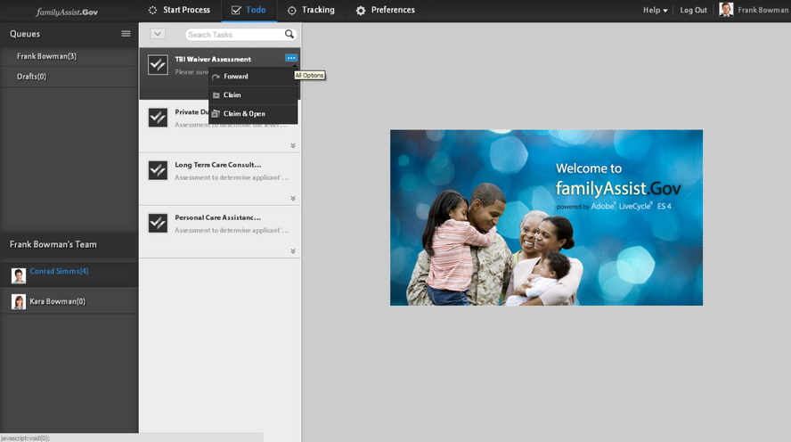

# Taken in een organisatiehiërarchie beheren met de beheerweergave{#managing-tasks-in-an-organizational-hierarchy-using-manager-view}

In de werkruimte van AEM Forms, kunnen de managers tot de taken nu toegang hebben die aan iedereen in hun hiërarchie worden toegewezen - directe of indirecte rapporten - en diverse acties op hen uitvoeren. De taken zijn beschikbaar op het tabblad Te doen in de AEM Forms-werkruimte. De acties die op de taken van directe rapporten worden gesteund zijn:

**Doorsturen** - Een taak doorsturen van direct rapport naar elke gebruiker.

**Claim** - eisen dat een verslag rechtstreeks wordt opgesteld.

**Claim &amp; Openen** - Vordering een taak van een direct rapport en open het automatisch in de te doen lijst van de manager.

**Afwijzen** - Een taak die door een andere gebruiker naar een direct rapport is doorgestuurd, afwijzen. Deze optie is beschikbaar voor de taken die door andere gebruikers aan een direct rapport door:sturen.

AEM Forms beperkt de toegang van gebruikers tot slechts die taken waarvoor de gebruiker toegangsbeheer (ACL) heeft. Een dergelijke controle zorgt ervoor dat een gebruiker alleen de taken kan ophalen waarop de gebruiker toegangsmachtigingen heeft. Met behulp van externe webservices en implementaties om de hiërarchie te definiëren, kan een organisatie de definitie van manager en directe rapporten aanpassen aan hun behoeften.

1. Maak een DSC. Zie het onderwerp &#39;Componenten ontwikkelen voor AEM Forms&#39; in voor meer informatie [Programmeren met AEM Forms](https://www.adobe.com/go/learn_aemforms_programming_63) hulplijn.
1. In DSC, bepaal nieuw SPI voor hiërarchiebeheer om directe rapporten en hiërarchie binnen de gebruikers van AEM Forms te bepalen. Hier volgt een voorbeeld van een Java™-codefragment.

   ```java
   public class MyHierarchyMgmtService
   {
        /*
       Input : Principal Oid for a livecycle user
       Output : Returns true when the user is either the service invoker OR his direct/indirect report.
       */
       boolean isInHierarchy(String principalOid) {
   
       }
   
       /*
       Input : Principal Oid for a livecycle user
       Output : List of principal Oids for direct reports of the livecycle user
       A user may get direct reports only for himself OR his direct/indirect reports.
       So the API is functionally equivalent to -
       isInHierarchy(principalOid) ? <return direct reports> : <return empty list>
       */
       List<String> getDirectReports(String principalOid) {
   
       }
   
       /*
       Returns whether a livecycle user has direct reports or not.
       It is functionally equivalent to -
       getDirectReports(principalOid).size()>0
       */
       boolean isManager(String principalOid) {
   
       }
   }
   ```

1. Maak een bestand component.xml. Zorg ervoor dat de specificatie-id hetzelfde is als in het codefragment hieronder. Hier volgt een voorbeeldcodefragment dat u opnieuw kunt gebruiken.

   ```xml
   <component xmlns="https://adobe.com/idp/dsc/component/document">
       <component-id>com.adobe.sample.SampleDSC</component-id>
       <version>1.1</version>
       <supports-export>false</supports-export>
         <descriptor-class>com.adobe.idp.dsc.component.impl.DefaultPOJODescriptorImpl</descriptor-class>
         <services>
           <service name="MyHierarchyMgmtService" title="My hierarchy management service" orchestrateable="false">
           <auto-deploy service-id="MyHierarchyMgmtService" category-id="Sample DSC" major-version="1" minor-version="0" />
           <description>Service for resolving hierarchy management.</description>
            <specifications>
            <specification spec-id="com.adobe.idp.taskmanager.dsc.enterprise.HierarchyManagementProvider"/>
            </specifications>
           <specification-version>1.0</specification-version>
           <implementation-class>com.adobe.sample.hierarchymanagement.MyHierarchyMgmtService</implementation-class>
           <request-processing-strategy>single_instance</request-processing-strategy>
           <supported-connectors>default</supported-connectors>
           <operation-config>
               <operation-name>*</operation-name>
               <transaction-type>Container</transaction-type>
               <transaction-propagation>supports</transaction-propagation>
               <!--transaction-timeout>3000</transaction-timeout-->
           </operation-config>
           <operations>
               <operation anonymous-access="true" name="isInHierarchy" method="isInHierarchy">
                   <input-parameter name="principalOid" type="java.lang.String" />
                   <output-parameter name="result" type="java.lang.Boolean"/>
               </operation>
               <operation anonymous-access="true" name="getDirectReports" method="getDirectReports">
                   <input-parameter name="principalOid" type="java.lang.String" />
                   <output-parameter name="result" type="java.util.List"/>
               </operation>
               <operation anonymous-access="true" name="isManager" method="isManager">
                   <input-parameter name="principalOid" type="java.lang.String" />
                   <output-parameter name="result" type="java.lang.Boolean"/>
               </operation>
               </operations>
               </service>
         </services>
   </component>
   ```

1. Implementeer DSC via Workbench. Opnieuw starten `ProcessManagementTeamTasksService` service.
1. Mogelijk moet u de browser vernieuwen of u opnieuw afmelden/aanmelden bij de gebruiker.

Het volgende scherm illustreert de toegang tot van de taken van directe rapporten en de beschikbare acties.



De taken van de toegang tot directe rapporten en handelen op de taken
