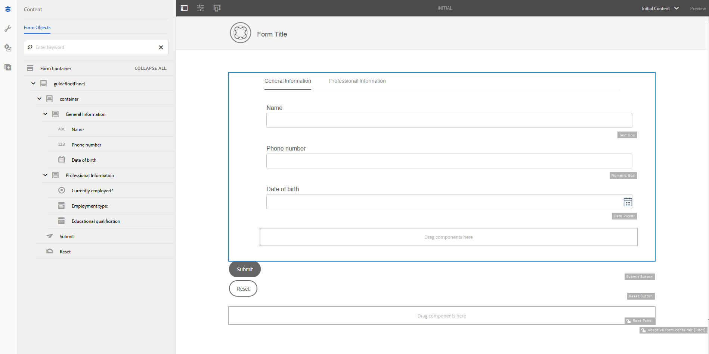

# Aangepaste formuliersjablonen{#adaptive-form-templates}

 de Adobe adviseert gebruikend de moderne en verlengbare gegevens vangen [ Componenten van de Kern ](https://experienceleague.adobe.com/docs/experience-manager-core-components/using/adaptive-forms/introduction.html) voor [ het creëren van nieuwe Aangepaste Forms ](/help/forms/using/create-an-adaptive-form-core-components.md) of [ het toevoegen van Aangepaste Forms aan de pagina&#39;s van AEM Sites ](/help/forms/using/create-or-add-an-adaptive-form-to-aem-sites-page.md). Deze componenten betekenen een aanzienlijke vooruitgang in de aanmaak van Adaptive Forms en zorgen voor indrukwekkende gebruikerservaring. In dit artikel wordt een oudere aanpak beschreven voor de auteur Adaptive Forms die gebruikmaakt van stichtingscomponenten. 

| Versie | Artikelkoppeling |
| -------- | ---------------------------- |
| AEM as a Cloud Service | [ klik hier ](https://experienceleague.adobe.com/docs/experience-manager-cloud-service/content/forms/adaptive-forms-authoring/authoring-adaptive-forms-foundation-components/create-an-adaptive-form-on-forms-cs/template-editor.html) |
| AEM 6,5 | Dit artikel |

Wanneer u een formulier ontwerpt, voegt u velden en componenten toe om de formulierstructuur, inhoud en handelingen in de editor te definiëren. U voegt velden en componenten toe in `guideRootPanel` van de formuliercontainer. Met de Sjablooneditor kunt u een sjabloon maken met een basisstructuur en eerste inhoud die auteurs kunnen gebruiken om formulieren te maken.

U wilt bijvoorbeeld dat alle formulierauteurs bepaalde tekstvakken, navigatieknoppen en een verzendknop in een inschrijvingsformulier hebben. U kunt een sjabloon maken met de componenten die auteurs kunnen gebruiken om een formulier te maken dat consistent is met andere inschrijvingsformulieren. Wanneer auteurs de sjabloon gebruiken om een adaptief formulier te maken, neemt het nieuwe formulier de structuur en componenten over die u in de sjabloon hebt opgegeven. Met de Sjablooneditor kunt u:

* Voeg kop- en voettekstcomponenten van een formulier toe aan de structuurlaag.
* Geef de initiële inhoud voor het formulier op.
* Geef een thema op en verzend acties.

## Werken met sjablonen {#working-with-templates}

U kunt tot malplaatjeredacteur van het menu van Hulpmiddelen toegang hebben door aan **Adobe Experience Manager > Hulpmiddelen > Malplaatjes** te navigeren. Hier worden de sjablonen ingedeeld in mappen die zijn ingeschakeld voor bewerkbare sjablonen. AEM biedt een algemene map voor het organiseren van sjablonen. Deze optie is echter niet standaard ingeschakeld. U kunt de beheerder vragen de algemene map in te schakelen of een map voor sjablonen te maken. Voor meer informatie over hoe te om omslagen tot stand te brengen, zie {de Mappen van het 0} Malplaatje [&#128279;](/help/sites-developing/page-templates-editable.md).

Nadat u hebt opgegeven dat u een map wilt openen, verschijnt er een knop Maken waarmee u een sjabloon voor adaptieve formulieren kunt maken.

### Een sjabloon maken {#create-template}

Nadat u een map hebt gemaakt, opent u de map en voert u de volgende stappen uit om een sjabloon te maken:

1. In de console van het Malplaatje, creeer **&#x200B;**&#x200B;binnen de omslag u hebt gecreeerd.
1. In de Keuze een sectie van het Type van Malplaatje, selecteer **Aangepast Malplaatje van de Vorm** en selecteer **daarna**.

1. In de sectie van de Details van het Malplaatje, verstrek een Titel van het Malplaatje en selecteer **creeer**.
U kunt een beschrijving en miniatuur opgeven die u kunt zien wanneer u de gemaakte sjabloon kunt selecteren tijdens het ontwerpen van het formulier.

1. Selecteer **Gedaan** om aan de console terug te keren, of **Open** te selecteren om het malplaatje in de redacteur te openen.

### UI voor sjablooneditor {#template-editor-ui}

Wanneer u een sjabloon opent voor bewerking, kunt u de volgende AEM Editor-componenten zien:

* **de toolbar van de Pagina**
Bevat de volgende opties:

   * **Knevel zij-Comité**: Laat u sidebar tonen of verbergen.
   * **Informatie van de Pagina**: Laat u informatie zoals publiceren/unpublish tijd, duimnagels, cliënt-zijbibliotheken, paginabeleid, en cliënt-zijbibliotheek van het paginaontwerp specificeren.
   * **Mededinger**: Laat u simuleren en het blik voor verschillende apparaten aanpassen.
   * **selecteur van de Laag:** laat u de laag veranderen.
U kunt **laag van de Structuur 1&rbrace; of** Aanvankelijke Inhoud **kiezen.** Met de structuurlaag kunt u de kop- en voettekst toevoegen en aanpassen. Met de eerste laag Inhoud kunt u de formulierinhoud aanpassen.

   * **Voorproef:** laat u voorproef hoe het malplaatje kijkt wanneer u het publiceert. U kunt Laagkiezer en Voorvertoning gebruiken om de bewerkings- en voorvertoningsmodi in en uit te schakelen.

* **Sidebar:** verstrekt de Inhoud, Eigenschappen, Assets, en de browsers van Componenten.
* **de toolbar van de Component:** wanneer u een component selecteert, ziet u een toolbar die u de component laat aanpassen.
* **Pagina**: Het gebied waar u inhoud toevoegt om het malplaatje tot stand te brengen.

Zie [ Inleiding aan auteursadaptieve vormen ](../../forms/using/introduction-forms-authoring.md) om de redacteur van de Aanraking UI te begrijpen.

### Een sjabloon bewerken {#editing-a-template}

Er wordt een adaptieve formuliersjabloon gemaakt met behulp van twee lagen:

* Structuur
* Oorspronkelijke inhoud

De laagkiezer is beschikbaar naast de optie Voorvertoning in de rechterbovenhoek van het scherm.

### Structuur {#structure}

Wanneer u de structuurlaag selecteert in de Sjablooneditor, ziet u de lay-outcontainers boven en onder de container voor adaptieve formulieren. Auteurs kunnen deze lay-outcontainers voor kopbal en footer gebruiken. U kunt de kop- en voettekst toevoegen, bewerken of aanpassen. Sleep de component Adaptief koptekst van formulier naar de lay-outcontainer boven de container voor adaptieve formulieren om de sjabloonkoptekst aan te passen. Sleep de component Aangepaste formuliervoettekst naar de lay-outcontainer onder de container voor adaptieve formulieren om de sjabloonvoettekst aan te passen.

Lay-outcontainers in de structuurlaag

**A.** container van de Lay-out voor de component van de Kopbal **B.** container van de Lay-out voor de component van de Voettekst

Sleep de component Adaptief koptekst van formulier naar de lay-outcontainer boven de container voor adaptieve formulieren. Nadat u de component hebt toegevoegd, kunt u de eigenschappen ervan opgeven waarmee u een logo kunt toevoegen en de titel kunt opgeven.

Op dezelfde manier kunt u de copyrightinformatie en bedrijfsgegevens opgeven wanneer u de voettekstcomponent in de lay-outcontainer onder de container voor adaptieve formulieren sleept.

Koptekst en voettekst toegevoegd aan de laag Structuur

#### Componenten in de structuurlaag vergrendelen/ontgrendelen {#locking-unlocking-components-in-the-structure-layer}

Wanneer u de sjabloon bewerkt terwijl de structuurlaag is geselecteerd, kunt u de kop- en voettekst van de sjabloon ontgrendelen. Als een component ontgrendeld is in de sjabloon, kunnen formulierauteurs de component bewerken in het adaptieve formulier dat de sjabloon gebruikt. Door een component te vergrendelen voorkomt u dat auteurs van formulieren deze in het aangepaste formulier kunnen bewerken. De optie Vergrendelen is beschikbaar op de werkbalk van de component.

U voegt bijvoorbeeld de koptekstcomponent in de sjabloon toe. Wanneer u de component selecteert, ziet u een vergrendelingsoptie op de werkbalk van de component. Koptekst bevat doorgaans een bedrijfsnaam en een logo en u wilt niet dat auteurs van formulieren het logo en de koptekst in een sjabloon wijzigen. In een adaptief formulier dat is gemaakt met de sjabloon met de koptekstcomponent vergrendeld, kunnen formulierauteurs het logo en de bedrijfsnaam niet wijzigen.

>[!NOTE]
>
>Het wordt niet aanbevolen de afbeelding of het logo in de koptekstcomponent afzonderlijk te vergrendelen of te ontgrendelen. U kunt de koptekstcomponent ontgrendelen.

### Oorspronkelijke inhoud {#initial-content}

Als de optie Begininhoud is geselecteerd, wordt de container van het adaptieve formulier van de sjabloon geopend als een adaptief formulier voor bewerking. Net als bij het ontwerpen van een adaptief formulier kunt u initiële instellingen opgeven, zoals het selecteren van een thema en het verzenden van handelingen.

Formulierauteurs gebruiken het als basis om een formulier te maken. De structuur van de inhoudsstroom wordt opgegeven in de laag Begininhoud van de sjabloon. Om aan het uitgeven van aanvankelijke inhoud van het vormmalplaatje, vóór Voorproef in de paginagoolbar, uitgezochte  **> Aanvankelijke Inhoud** te schakelen.

Oorspronkelijke inhoudslaag in de Sjablooneditor met de adaptieve formuliercontainer geselecteerd voor het opgeven van eigenschappen.

In de laag Begininhoud maakt u de adaptieve formuliersjabloon die uw auteurs als basis gebruiken. Het ontwerpen van een sjabloon lijkt op het ontwerpen van een formulier. U gebruikt de opties in de zijbalk. Sidebar verstrekt inhoud, eigenschappen, activa, en componentenbrowsers.

Zie [ Sidebar ](../../forms/using/introduction-forms-authoring.md#sidebar).

>[!NOTE]
>
>Wanneer u Inhoud opslaan of PDF opslaan selecteert als Verzendhandeling, kunt u het opslagpad opgeven. Als u een pad opgeeft in een sjabloon, hebben alle formulieren die ermee worden gemaakt hetzelfde pad. U kunt het juiste opslagpad opgeven of formulierauteurs de opslaglocatie laten bijwerken om te voorkomen dat gegevens in elk formulier op dezelfde locatie worden opgeslagen.

#### Een adaptieve formuliersjabloon maken met tabs en deelvensters  {#creating-an-adaptive-form-template-with-tabs-and-panels-nbsp}

U wilt bijvoorbeeld een sjabloon maken met de volgende tabbladen:

* Algemene informatie
* Professionele informatie

U hebt een logo toegevoegd, een titel opgegeven en een voettekst toegevoegd aan de structuurlaag. Vergrendel de kop- en voettekst om te voorkomen dat auteurs van formulieren deze bewerken wanneer ze de sjabloon gebruiken om formulieren te maken.

Wijzig de laag van Structuur in Begininhoud en voeg inhoud toe aan het formulier. Als u een structuur met tabbladen wilt maken, voegt u een onderliggend deelvenster toe in het guideRootPanel van de container van het adaptieve formulier. Een deelvenster toevoegen:

* U kunt een paneel toevoegen door **te tikken +** knoop wanneer u de **componenten van de Belemmering hier** optie selecteert.

* U kunt de deelvenstercomponent slepen en neerzetten vanuit de deelvensterbrowser in de zijbalk.
* U kunt onderliggende deelvensters van de `guideRootPanel` toevoegen vanaf de componentwerkbalk.

Als u de tabbladen Algemene informatie en Professionele informatie wilt maken, voegt u twee deelvensters toe in het deelvenster Onderliggend item van het dialoogvenster `guideRootPanel` . Selecteer de panelen en selecteer  om de eigenschappen in sidebar te openen. Wijzig de elementnamen als `general-info` en `professional-info` , en de titels als Algemene informatie en Professionele informatie. Selecteer in het zijpaneel de inhoud die u wilt openen in de inhoudbrowser. Selecteer op het tabblad Formulierobjecten de optie `guideRootPanel` . In de redacteur, wordt guideRootPanel geselecteerd. Selecteer  in de componententoolbar om zijn eigenschappen te openen. Op het gebied van de Lay-out van het Comité, uitgezochte **Lusjes op bovenkant** en selecteer **Gedaan**. De sjabloonstructuur met tabs wordt toegepast.

#### Inhoud toevoegen op tabbladen {#adding-content-in-tabs}

Nadat u deelvensters hebt toegevoegd en deze hebt gestructureerd als tabbladen, kunt u velden toevoegen binnen de tabbladen. Wanneer u een lusje in de redacteur selecteert, kunt u de **componenten van de Belemmering hier** optie zien. U kunt componenten zoals tekstvakken, lijstitems en knoppen slepen en neerzetten. U kunt componenten slepen-dalingscomponenten van componentenbrowser in sidebar.

Elke component bevat eigenschappen die het vastleggen en bewerken van gegevens verbeteren. Bijvoorbeeld, kunt u het **Vereiste gebied** bezit van een component toelaten. Uw auteurs kunnen een bericht specificeren dat uw klanten zien wanneer zij het vullen van een vereist gebied overslaan. Specificeer het bericht in **Vereiste bezit van het Bericht van het Gebied**.

In de voorbeeldsjabloon worden de velden Naam, Telefoonnummer en Geboortedatum toegevoegd op het tabblad Algemene informatie. Op het tabblad Professionele informatie, momenteel gebruikt, worden het werkgelegenheidstype en de kwalificatievelden voor het onderwijs toegevoegd.

Nadat u velden hebt toegevoegd, kunt u knoppen toevoegen, zoals Verzenden en Herstellen.

### De sjabloon inschakelen {#enabling-the-template}

Wanneer u een sjabloon maakt, wordt deze toegevoegd als concept. Schakel de sjabloon in om deze te gebruiken voor het maken van adaptieve formulieren. Een sjabloon inschakelen:

1. Navigeer aan **Adobe Experience Manager > Hulpmiddelen > Malplaatjes**, en open de omslag waarin u het malplaatje hebt gecreeerd.

1. De sjabloon die u hebt gemaakt, is gemarkeerd als Concept.
1. Selecteer het malplaatje en selecteer **toelaten** in de toolbar.
Wanneer u een adaptief formulier maakt, wordt de sjabloon weergegeven wanneer u wordt gevraagd een sjabloon te kiezen.

## Een sjabloon importeren of exporteren {#importing-or-exporting-a-template}

Een formulier werkt met de sjabloon. Wanneer u een adaptief formulier downloadt dat is gemaakt met een aangepaste sjabloon, wordt de sjabloon niet gedownload. Wanneer u het formulier in een ander AEM Forms-exemplaar importeert, wordt het zonder de sjabloon geïmporteerd. Als een formulier wordt geïmporteerd maar de sjabloon ervan niet beschikbaar is, wordt het formulier niet gegenereerd. U kunt de aangepaste sjabloon verpakken vanuit het knooppunt `/conf` in `https://<server>:<port>/crx/packmgr` en deze poort in het AEM Forms-exemplaar plaatsen waar u het formulier wilt uploaden.

## Een adaptief formulier maken met behulp van de sjabloon {#creating-an-adaptive-form-using-the-template}

Nadat u een sjabloon hebt gemaakt en ingeschakeld, is deze beschikbaar in formulierbeheer wanneer u een adaptief formulier maakt. Om een malplaatje te gebruiken en een adaptieve vorm tot stand te brengen, zie [ Creërend een adaptieve vorm ](../../forms/using/creating-adaptive-form.md).

## Weergaveoptie wijzigen van uit de vaksjablonen  {#change-display-option-of-out-of-the-box-templates}

U kunt aangepaste sjablonen maken voor aangepaste formulieren om de basisstructuur en de eerste inhoud te definiëren. AEM Forms biedt ook een set van in de kadersjabloon geplaatste formulieren voor adaptieve formulieren. U kunt de sjablonen weergeven of verbergen.

Voer de volgende stappen uit om sjablonen weer te geven en te verbergen:

1. Login aan de auteursinstantie van AEM Forms en navigeer aan **Hulpmiddelen** > **Verrichtingen** > **Console van het Web**.

   >[!NOTE]
   >
   >URL van AEM Webconsole is https://&#39;[ server ]:[ haven ]&#39;/system/console/configMgr

1. Zoek en open de **montages van de Configuratie 0&rbrace; FormsManager:**

   * Om uit de doos adaptieve vormenmalplaatje te tonen of te verbergen, controleer of uncheck **omvat uit de doos AF en de optie van de Malplaatjes van de ADVERTENTIE**.
   * Om uit de doos adaptieve vormmalplaatjes te tonen of te verbergen die in AEM 6.0 Forms of AEM 6.1 versies van Forms werden toegevoegd maar nu verouderd zijn, controleer of uncheck **omvat AEM 6.0 de Malplaatjes van AF** optie. Als deze optie wordt gecontroleerd, om van kracht te worden, vereist het **omvat uit doos AF en de 1&rbrace; configuratie van de Malplaatjes van de ADVERTENTIE &lbrace;worden toegelaten.**

1. Klik **sparen**. De weergaveopties voor de out van de vaksjablonen worden gewijzigd.

## Recommendations {#recommendations}

* Wanneer u eigenschappen van het formulier in de sjablooneditor wijzigt, gebruikt u de eigenschap BindReference niet.
* Als u een onderbrekingspunt wilt toevoegen, creeer het wanneer u een adaptieve vormmalplaatje ontwerpt.
Voor meer informatie over breekpunten, zie [ Responsieve Lay-out ](/help/sites-authoring/responsive-layout.md).
