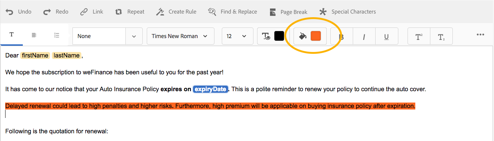

# Teksten in interactieve communicatie{#texts-in-interactive-communications}

## Overzicht {#overview}

Een tekstdocumentfragment bestaat uit een of meer tekstalinea&#39;s. Een alinea kan statisch of dynamisch zijn. Een dynamische alinea kan eigenschappen en variabelen van het formuliergegevensmodel bevatten. U kunt ook regels toepassen en herhalen binnen een tekstdocumentfragment. Bijvoorbeeld, zou de klantennaam in een aanhef een bezit van het Model van de Gegevens van de Vorm (FDM) kunnen zijn met zijn waarde die bij runtime ter beschikking wordt gesteld. Door deze waarden te veranderen, kan de zelfde Interactieve Communicatie worden gebruikt om Interactieve Mededeling voor verschillende klanten voor te bereiden gebruikend de Agent UI.

Het tekstdocumentfragment in Interactive Communication ondersteunt het volgende type dynamische gegevens:

* **Objecten** gegevensmodel: De gegevenseigenschappen gebruiken een achtereind gegevensbron.
* **Op regels gebaseerde inhoud**: Delen van inhoud in een tekst die worden weergegeven of verborgen op basis van een regel. Een regel kan ook worden gebaseerd op eigenschappen en variabelen van het formuliergegevensmodel.
* **Variabelen**: In tekstdocumentfragment zijn variabelen niet gebonden aan een achterwaartse gegevensbron. De agent vult in/selecteert waarden in variabelen of bindt de variabelen aan gegevensbronnen terwijl het voorbereiden van de Interactieve Mededeling voor het voorleggen van het aan een postproces.
* **Herhalen**: U kunt dynamische informatie in uw Interactieve Communicatie, zoals transacties in een creditcardverklaring hebben, waarvan het aantal voorkomen met elke geproduceerde Interactieve Communicatie kan blijven veranderen. Met Herhaling kunt u dergelijke dynamische informatie opmaken en structureren. Zie [Inline voorwaarde en Herhaal](https://helpx.adobe.com/experience-manager/6-3/forms/using/cm-inline-condition.html)voor meer informatie.

## Tekst maken {#createtext}

1. Selecteer **[!UICONTROL Forms]** > **[!UICONTROL Document Fragments]**.
1. Selecteer **[!UICONTROL Create]** > **[!UICONTROL Text]**.
1. Geef de volgende informatie op:

   * **[!UICONTROL Title]**: (Optioneel) Voer de titel in voor het tekstdocumentfragment. Titels hoeven niet uniek te zijn en kunnen speciale tekens en niet-Engelse tekens bevatten. De teksten worden bedoeld door hun titels (indien beschikbaar) zoals in duimnagels en eigenschappen.
   * **[!UICONTROL Name]**: De unieke naam voor de tekst in een map. Geen twee documentfragmenten (tekst, voorwaarde of lijst) in een staat kunnen bestaan met dezelfde naam in een map. In het veld Naam kunt u alleen Engelse tekens, cijfers en afbreekstreepjes invoeren. Het veld Naam wordt automatisch ingevuld op basis van het veld Titel. De speciale tekens, spaties, getallen en niet-Engelse tekens die in het veld Titel zijn ingevoerd, worden vervangen door afbreekstreepjes in het veld Naam. Hoewel de waarde in het veld Titel automatisch naar de naam wordt gekopieerd, kunt u de waarde bewerken.

   * **[!UICONTROL Description]**: Typ een beschrijving van de tekst.
   * **[!UICONTROL Form Data Model]**: Selecteer desgewenst het keuzerondje Formuliergegevensmodel om de tekst te maken op basis van een formuliergegevensmodel. Wanneer u het keuzerondje Formuliergegevensmodel selecteert, wordt het **[!UICONTROL Form Data Model]** veld weergegeven. Blader naar een formuliergegevensmodel en selecteer dit. Zorg er tijdens het maken van tekst en een voorwaarde voor interactieve communicatie voor dat u hetzelfde gegevensmodel gebruikt dat u in de interactieve communicatie wilt gebruiken. Zie [Gegevensintegratie](/help/forms/using/data-integration.md)voor meer informatie over het formuliergegevensmodel.

   * **[!UICONTROL Tags]**: Als u een aangepaste tag wilt maken, typt u een waarde in het tekstveld en drukt u op Enter. Wanneer u deze tekst opslaat, worden de nieuwe tags gemaakt.

1. Tik op **[!UICONTROL Next]**.

   De pagina Tekst maken wordt weergegeven. Als u ervoor hebt gekozen om een op een formuliergegevensmodel gebaseerde tekst te maken, worden de eigenschappen van het formuliergegevensmodel weergegeven in het linkerdeelvenster.

1. Typ de tekst en gebruik de volgende opties voor het opmaken, conditionaliseren en invoegen van eigenschappen en variabelen van het gegevensmodel van het formulier in de tekst:

   * [Formuliergegevensmodel](#formdatamodel)
   * [Variabelen](#variables)
   * [Regeleditor](#rules)
   * [Opmaakopties](#formatting)

      * [Opgemaakte tekst uit andere toepassingen kopiëren](#paste)

      * [Tekstgedeelten markeren](#highlight)
   * [Herhalen](/help/forms/using/cm-inline-condition.md)
   * [Speciale tekens](#special)
   * [Tekst zoeken en vervangen](#searching)
   * [Sneltoetsen](/help/forms/using/keyboard-shortcuts.md)

   >[!NOTE]
   >
   >U kunt formuliergegevensmodelelementen, gegevenswoordenboekelementen en variabelen toevoegen met het @-symbool in de teksteditor. Wanneer u een tekenreeks opgeeft die wordt voorafgegaan door @ in de teksteditor, worden alle elementen van het gegevensmodel, gegevenswoordenboek en variabelen doorzocht en worden elementen of variabelen met de doorzochte tekenreeks weergegeven. U kunt door de onderzoeksresultaten navigeren en een element of een variabele selecteren. Als er geen passend resultaat is, wordt het bericht *Geen overeenkomende resultaten gevonden* weergegeven.

1. Tik op **[!UICONTROL Save]**.

   De tekst wordt gemaakt. Nu kunt u doorgaan met het gebruik van de tekst als een bouwsteen tijdens het maken van een interactieve communicatie.

## Tekst bewerken {#edittext}

U kunt een bestaand tekstdocumentfragment bewerken met de volgende stappen. U kunt ook een tekstdocumentfragment bewerken in een interactieve communicatie-editor.

1. Selecteer **[!UICONTROL Forms]** > **[!UICONTROL Document Fragments]**.
1. Navigeer naar een tekstdocumentfragment en selecteer het.
1. Tik op **[!UICONTROL Edit]**.
1. Breng de gewenste wijzigingen aan. Zie Tekst [maken voor meer informatie over opties in tekst](#createtext).
1. Tik **[!UICONTROL Save]** en tik vervolgens op **[!UICONTROL Close]**.

## Een tekstdocumentfragment aanpassen met eigenschappen van het formuliergegevensmodel {#formdatamodel}

U kunt tekstdocumentfragmenten personaliseren door de eigenschappen van het formuliergegevensmodel in te voegen. Door eigenschappen van het formuliergegevensmodel in tekst in te voegen, kunt u specifieke gegevens voor ontvangers ophalen en vullen vanuit de bijbehorende gegevensbron terwijl u een voorbeeld van een interactieve communicatie bekijkt. Zie [AEM Forms Data Integration](/help/forms/using/data-integration.md)voor meer informatie over het formuliergegevensmodel.

Als u een formuliergegevensmodel hebt opgegeven tijdens het maken van een tekst, worden de eigenschappen in het formuliergegevensmodel weergegeven in het linkerdeelvenster van de teksteditor. Het opgegeven formuliergegevensmodel moet hetzelfde zijn voor het tekstdocumentfragment en de interactieve communicatie waarin het fragment voorkomt.

* Als u een eigenschap van een formuliergegevensmodel in tekst wilt invoegen, plaatst u de cursor op de plaats waar u de eigenschap wilt invoegen en selecteert u de eigenschap **[A]** in het linkerdeelvenster door erop te tikken en tikt u op **[!UICONTROL[B]Add Selected]**. U kunt ook dubbeltikken op de eigenschap om deze in te voegen op de cursorpositie **[C]** . Eigenschappen van het formuliergegevensmodel worden gemarkeerd in een bruine achtergrondkleur.

U kunt ook de eigenschap van het formuliergegevensmodel zoeken en toevoegen met het symbool @ in de teksteditor. Plaats de cursor op de plaats waar u de eigenschap wilt invoegen. Typ @ gevolgd door de zoekreeks. De zoekbewerking wordt uitgevoerd op alle eigenschappen en variabelen van het formuliergegevensmodel die beschikbaar zijn in het documentfragment. De eigenschappen of variabelen die de zoekreeks bevatten, worden opgehaald en weergegeven als een vervolgkeuzelijst. Navigeer door de onderzoeksresultaten en klik het bezit dat u bij de cursorplaats wilt opnemen. Druk op Esc om de zoekresultaten te verbergen.

* Om de agenten toe te staan om de waarde van een modelbezit van vormgegevens in de agent UI uit te geven terwijl het [Voorbereiden en Interactieve Communicatie](/help/forms/using/prepare-send-interactive-communication.md) gebruikend de Agent UI, het **[D]** slotpictogram voor dat bezit te tikken en het te verzekeren in een ontgrendelde staat is. De standaardstaat van het bezit is gesloten en een agent kan niet het bezit in de Agent UI uitgeven.

U kunt ook eigenschappen van het gegevensmodel van het formulier gebruiken om regels samen te stellen voor het weergeven of verbergen van delen van inhoud. Zie [Regels in tekst](#rules)maken voor meer informatie.

## Variabelen in een tekstdocumentfragment maken en gebruiken {#variables}

Variabelen zijn plaatsaanduidingen die tijdens het maken van een interactieve communicatie kunnen worden gebonden. Variabelen kunnen worden gebonden aan een eigenschap van een formuliergegevensmodel of een tekstfragment. De variabelen kunnen ook voor de agent worden verlaten om te vullen.

U kunt variabelen gebruiken in plaats van eigenschappen van het formuliergegevensmodel wanneer:

* Een tekstdocumentfragment moet in veelvoudige Interactieve Mededelingen worden gebruikt waar de band voor verschillende Interactieve Mededelingen verschillend moet zijn.
* Fragment van tekstdocument heeft geen formuliergegevensmodel op het moment dat het wordt gemaakt. U kunt variabelen invoegen en deze later binden aan de eigenschappen van het formuliergegevensmodel op het moment dat de interactieve communicatie wordt gemaakt.
* U moet tekst van een tekstdocumentfragment binden en ophalen. Alleen tekstdocumentfragmenten kunnen worden gebonden aan variabelen die geen variabelen bevatten.

Tijdens het maken of bewerken van een tekstdocumentfragment kunt u variabelen maken en invoegen. De variabelen u creeert verschijnen in het lusje van Gegevens van de Agent UI. De agent specificeert de waarden voor de variabelen terwijl het [Voorbereiden en Interactieve Communicatie gebruikend de Agent UI](/help/forms/using/prepare-send-interactive-communication.md)verzendt.

### Variabelen maken {#createvariables}

1. Tik in het linkervenster op **[!UICONTROL Variables]**.

   Het deelvenster Variabelen wordt weergegeven.

   

1. Tik op **[!UICONTROL Create]**.

   Het deelvenster Variabelen maken wordt weergegeven.

1. Voer de volgende gegevens in en tik op **[!UICONTROL Create]**:

   * **[!UICONTROL Name]** : Naam van de variabele.
   * **[!UICONTROL Description]** : Voer desgewenst een beschrijving van de variabele in.
   * **[!UICONTROL Type]** : Selecteer een type variabele: Tekenreeks, Aantal, Boolean of Datum.
   * **[!UICONTROL Allow Specific Values Only]** : Voor de variabelen van het Koord en van het Aantal, kunt u ervoor zorgen dat de agent van een specifieke reeks waarden voor placeholder in de Agent UI kiest. Als u de reeks waarden wilt opgeven, selecteert u deze optie en geeft u door komma&#39;s gescheiden waarden op die zijn toegestaan in het **[!UICONTROL Values]** veld.

1. Tik op **[!UICONTROL Create]**.

   De variabele wordt gemaakt en vermeld in het deelvenster Variabelen.

1. Als u een variabele in de tekst wilt invoegen, plaatst u de cursor op de juiste plaats, selecteert u de variabele en tikt u op **[!UICONTROL Add Selected]**.

   

   Variabelen worden gemarkeerd in lichtblauwe achtergrondkleur, terwijl eigenschappen van het formuliergegevensmodel worden gemarkeerd in een bruine kleur.

   U kunt ook variabelen zoeken en toevoegen met het @-symbool in de teksteditor. Plaats de cursor op de plaats waar u de variabele wilt invoegen. Typ @ gevolgd door de zoekreeks. De zoekbewerking wordt uitgevoerd op alle eigenschappen en variabelen van het formuliergegevensmodel die beschikbaar zijn in het documentfragment. De eigenschappen en variabelen die de zoekreeks bevatten, worden opgehaald en weergegeven als een vervolgkeuzelijst. Navigeer door de onderzoeksresultaten en klik de variabele die u bij de cursorplaats wilt opnemen. Druk op Esc om de zoekresultaten te verbergen.

1. Tik op **[!UICONTROL Save]**.

## Regels maken in tekst {#rules}

Met de regeleditor in een tekst kunt u regels maken om tekenreeksen tekst of stukken inhoud weer te geven of te verbergen op basis van **vooraf ingestelde voorwaarden**. Deze voorwaarden kunnen worden geconstrueerd op basis van:

* Tekenreeksen
* Getallen
* Wiskundige expressie
* Datums
* Eigenschappen van gekoppeld formuliergegevensmodel
* Alle variabelen die u in de tekst hebt gemaakt

### Regels maken in tekst {#create-rules-in-text}

1. Selecteer tijdens het maken of bewerken van een tekst de tekenreeks, alinea of inhoud die u wilt conditionaliseren met de regel.

   

1. Tik op **[!UICONTROL Create Rule]**.

   Het dialoogvenster Regel maken wordt weergegeven. Naast tekenreeks, nummer, wiskundige expressie en datum zijn in de Regeleditor ook de volgende opties beschikbaar voor het maken van instructies van de regels:

   * Eigenschappen van gekoppeld formuliergegevensmodel
   * Alle variabelen die u hebt gemaakt

   Selecteer de gewenste optie die u wilt evalueren.

    

   >[!NOTE]
   >
   >Verzamelingseigenschap wordt niet ondersteund voor het maken van regels voor het conditionaliseren en weergeven van tekst.

1. Selecteer de juiste operator om de regel te evalueren, zoals Is gelijk aan, Bevat en Begint met.

   

1. Voeg de evaluerende expressie, waarde, eigenschap gegevensmodel of variabele in.

   

   Regel om de geselecteerde tekst te tonen als de plaats van de ontvanger volgens de brongegevens van FDM US is

   * Wanneer u een regel maakt of bewerkt, kunt u ook op  (Resize wijzigen) tikken om het dialoogvenster Regel maken/Regel bewerken uit te vouwen. Met het uitgebreide dialoogvenster van een volledig venster kunt u eigenschappen en variabelen van het formuliergegevensmodel slepen en neerzetten om regels samen te stellen. Tik nogmaals op Grootte wijzigen om terug te gaan naar het dialoogvenster Regel maken.
   * U kunt ook meerdere voorwaarden in een regel maken.
   * U kunt ook overlappende regels maken, waarin een regel wordt toegepast op een deel van een inhoud waarop al een regel is toegepast.

1. Tik op **[!UICONTROL Done]**.

   De regel wordt toegepast. De tekst of inhoud waarop de regel wordt toegepast, wordt groen gemarkeerd. Wanneer u de cursor boven de linkergreep van de markering houdt, wordt de toegepaste regel weergegeven.

   

   Als u op de linkerhandgreep van de toegepaste regel klikt, kunt u de regel bewerken of verwijderen.

## Tekst opmaken {#formatting}

Tijdens het maken of bewerken van tekst verandert de werkbalk afhankelijk van het type bewerkingen dat u wilt uitvoeren: Alinea, Uitlijning of Lijst:

Selecteer een type werkbalk: Alinea, Uitlijning of Lijst

Werkbalk voor bewerken van lettertypen

Uitlijning, werkbalk

Aanbiedingswerkbalk

### Tekstgedeelten markeren/benadrukken {#highlight}

Selecteer de tekst en tik op Markeringskleur om\gedeelten van tekst in een bewerkbaar documentfragment te benadrukken.

U kunt rechtstreeks op een basiskleur in het palet Standaardkleuren tikken of op `**[A]**` Selecteren **tikken nadat u de schuifregelaar hebt gebruikt** `**[B]**` om de juiste kleurtint te kiezen.

Desgewenst kunt u ook naar het tabblad Geavanceerd gaan om de juiste kleurtoon, helderheid en verzadiging te selecteren `**[C]**` en vervolgens op Selecteren tikken `**[D]**` om de tekst te markeren.

### Opgemaakte tekst plakken {#paste}

Als u een of meer tekstalinea&#39;s wilt hergebruiken die in een andere toepassing voorkomen, zoals Microsoft® Word- of HTML-pagina&#39;s, kopieert en plakt u de tekst in de teksteditor. De opmaak van de gekopieerde tekst blijft behouden in de teksteditor.

U kunt een of meer alinea&#39;s tekst in een bewerkbaar tekstdocumentfragment kopiëren en plakken. U hebt bijvoorbeeld een Microsoft® Word-document met een lijst met opsommingstekens van acceptabele verblijfstitels, zoals:

U kunt de tekst rechtstreeks vanuit het Microsoft® Word-document naar een bewerkbaar tekstdocumentfragment kopiëren en plakken. De opmaak, zoals een lijst met opsommingstekens, lettertype en tekstkleur, blijft behouden in het tekstdocumentfragment.

>[!NOTE]
>
>De opmaak van geplakte tekst heeft echter enkele [beperkingen](https://helpx.adobe.com/aem-forms/kb/cm-copy-paste-text-limitations.html).

## Speciale tekens in tekst invoegen {#special}

Voeg zo nodig speciale tekens in het documentfragment in. U kunt bijvoorbeeld het palet Speciale tekens gebruiken om het volgende in te voegen:

* Valutasymbolen zoals €, ¥ en £
* Wiskundige symbolen zoals A, Ö, ∂ en ^
* Interpunctiesymbolen zoals ‟ en&quot;

Teksteditor heeft ingebouwde ondersteuning voor 210 speciale tekens. De beheerder kan ondersteuning voor meer/aangepaste speciale tekens [toevoegen door deze aan te passen](/help/forms/using/custom-special-characters.md).

## Tekst zoeken en vervangen {#searching}

Wanneer u werkt met tekstdocumentfragmenten die een grote hoeveelheid tekst bevatten, moet u zoeken naar een specifieke tekstreeks. U moet mogelijk ook een specifieke tekenreeks vervangen door een alternatieve tekenreeks.

Met de functie Zoeken en vervangen kunt u elke tekenreeks in een tekstdocumentfragment zoeken (en vervangen). De functie bevat ook een krachtige zoekopdracht met een reguliere expressie.

1. Open een tekstdocumentfragment om [te bewerken](#edittext).
1. Tik op **[!UICONTROL Find & Replace]**.

1. Typ de tekst die u wilt doorzoeken in het **[!UICONTROL Find]** tekstvak en de nieuwe tekst (vervangende tekst) in het **[!UICONTROL Replace]** tekstvak en tik op **[!UICONTROL Replace]**.

1. Als de gezochte tekst wordt gevonden, wordt de tekst vervangen door de vervangingstekst.

   * Als er een ander exemplaar van de zoektekst wordt gevonden, wordt dat exemplaar gemarkeerd in het tekstdocumentfragment. Als u **[!UICONTROL Replace]** opnieuw tikt, wordt de gemarkeerde instantie vervangen en gaat de cursor verder als een derde exemplaar wordt gevonden.
   * Als er geen ander exemplaar wordt gevonden, wordt in het dialoogvenster Zoeken en vervangen een bericht weergegeven: Einde van module bereikt.

   U kunt ook op Alles vervangen tikken om alle overeenkomsten in één keer te vervangen.

   Zoeken en vervangen bevat ook een krachtige zoekopdracht voor reguliere expressies. Als u regex wilt gebruiken in de zoekopdracht, selecteert u **[!UICONTROL Reg ex]** en tikt u op **[!UICONTROL Find]** of **[!UICONTROL Replace]**.

