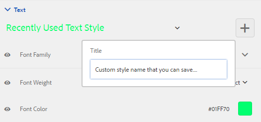
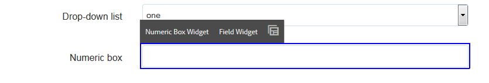

# Thema&#39;s maken en gebruiken {#creating-and-using-themes}

## Inleiding {#introduction}

U kunt thema&#39;s maken en toepassen om een adaptief formulier of interactieve communicatie te stileren. Een thema bevat opmaakgegevens voor de componenten en deelvensters. Stijlen omvatten eigenschappen zoals achtergrondkleuren, statuskleuren, transparantie, uitlijning en grootte. Wanneer u een thema toepast, weerspiegelt de opgegeven stijl de corresponderende componenten. Thema&#39;s worden onafhankelijk beheerd zonder verwijzing naar een adaptieve vorm of interactieve communicatie.

U kunt:

* Een thema maken
* Een bestaand thema bewerken en kopiëren
* Bestaande thema&#39;s downloaden en uploaden naar de AEM Forms-server
* Afhankelijkheden voor een thema beheren

## Een thema maken, downloaden of uploaden {#creating-downloading-or-uploading-a-theme}

Met AEM Forms kunt u thema&#39;s maken, downloaden of uploaden. Net als andere elementen, zoals formulieren, documenten en letters, wordt een thema gemaakt. Het thema wordt opgeslagen als een afzonderlijke entiteit, compleet met meta-eigenschappen zoals formulieren. Thema&#39;s die een afzonderlijke entiteit zijn, maken hergebruik in meerdere adaptieve vormen en interactieve communicatie mogelijk. U kunt een thema ook naar een andere instantie van AEM Forms verplaatsen en opnieuw gebruiken.

### Een thema maken {#creating-a-theme}

Voer de volgende stappen uit om een thema te maken:

1. Klik op **Adobe Experience Manager**, klik op **Formulieren** en klik vervolgens op **Thema&#39;s**.

1. Klik op de pagina Thema&#39;s op **Maken > Thema**.
Er wordt een wizard gestart om een thema te maken.

1. Geef op het tabblad Standaard van de wizard Thema maken de **titel** en de **naam** van het thema op. Dit zijn verplichte velden.

1. Op het tabblad Geavanceerd krijgt u twee velden:

   * **Clientlib-locatie**: Locatie in de opslagplaats waar de clientlibs voor het thema worden opgeslagen.

   * **Clientlib-categorie**: Verstrekt een tekstgebied om cliëntlib categorienaam voor het thema in te gaan.

1. Klik op **Maken** en klik vervolgens op **Bewerken** om het thema te openen in de Thema-editor of klik op **Gereed** om terug te keren naar de themapagina.

### Een thema downloaden {#downloading-a-theme}

U kunt thema&#39;s exporteren als ZIP-bestand en deze gebruiken in andere projecten of AEM-instanties. Een thema downloaden:

1. Klik op **Adobe Experience Manager**, klik op **Formulieren** en klik vervolgens op **Thema&#39;s**.

1. Selecteer **een thema op de pagina Thema&#39;s en klik op** Downloaden ****. Er wordt een dialoogvenster weergegeven met de details van het thema.

1. Klik op **Downloaden**. Het thema wordt gedownload als een ZIP-bestand.

>[!NOTE]
>
>Als u een thema downloadt waaraan een adaptief formulier is gekoppeld en het bijbehorende adaptieve formulier is gebaseerd op een aangepaste sjabloon, downloadt u ook de aangepaste sjabloon. Wanneer u het gedownloade thema en het aangepaste formulier uploadt naar een AEM Forms-server, kunt u ook de gerelateerde aangepaste sjabloon uploaden.

### Een thema uploaden {#uploading-a-theme}

U kunt gemaakte thema&#39;s gebruiken met voorinstellingen voor stijlen voor uw project. U kunt themapakketten die anderen maken, importeren door deze te uploaden naar uw project.

Een thema uploaden:

1. Klik op **Adobe Experience Manager**, klik op **Formulieren** en klik vervolgens op **Thema&#39;s**.

1. Klik op de pagina Thema&#39;s op **Maken > Bestand uploaden**.
1. Blader in de vraag Bestand uploaden naar en selecteer een themapakket op uw computer en klik op **Uploaden**.
Het geüploade thema is beschikbaar op de themapagina.

## Metagegevens van een thema {#metadata-of-a-theme}

Lijst met meta-eigenschappen van een thema (bevindt zich op de pagina met eigenschappen van een thema).

<table>
 <tbody>
  <tr>
   <th>
<strong>ID</strong>
 
 
 </th>
   <th><strong>Naam</strong></th>
   <th><strong>Kan worden bewerkt</strong></th>
   <th><strong>Beschrijving van eigenschap</strong></th>
  </tr>
  <tr>
   <td>1.</td>
   <td>Titel</td>
   <td>Ja</td>
   <td>Naam van thema weergeven.</td>
  </tr>
  <tr>
   <td>2.</td>
   <td>Beschrijving</td>
   <td>Ja</td>
   <td>Beschrijving van het thema.</td>
  </tr>
  <tr>
   <td>3.</td>
   <td>Type</td>
   <td>Nee</td>
   <td>
    <ul>
     <li>Type element.</li>
     <li>Waarde is altijd thema.</li>
    </ul> </td>
  </tr>
  <tr>
   <td>4.</td>
   <td>Gemaakt</td>
   <td>Nee</td>
   <td>Aanmaakdatum van het thema</td>
  </tr>
  <tr>
   <td>5.</td>
   <td>Naam auteur</td>
   <td>Ja</td>
   <td>Auteur van het thema. Berekend op het moment dat het thema werd gemaakt.</td>
  </tr>
  <tr>
   <td>6.</td>
   <td>Laatste wijzigingsdatum</td>
   <td>Nee</td>
   <td>Datum waarop het thema voor het laatst is gewijzigd.</td>
  </tr>
  <tr>
   <td>7.</td>
   <td>Status</td>
   <td>Nee</td>
   <td>Status van het thema (Gewijzigd/Gepubliceerd).</td>
  </tr>
  <tr>
   <td>8.</td>
   <td>Publiceren op tijd</td>
   <td>Ja</td>
   <td>Tijd om het thema automatisch te publiceren.</td>
  </tr>
  <tr>
   <td>9.</td>
   <td>Publiceren buiten tijd</td>
   <td>Ja</td>
   <td>Tijd om de publicatie van het thema automatisch ongedaan te maken.</td>
  </tr>
  <tr>
   <td>10.</td>
   <td>Tags</td>
   <td>Ja</td>
   <td>Een label dat aan het thema is gekoppeld om het zoeken te verbeteren.</td>
  </tr>
  <tr>
   <td>11.</td>
   <td>Verwijzingen</td>
   <td>Koppelingen</td>
   <td>
    <ul>
     <li>Bevat sectie 'Verwezen door'. Hier worden formulieren weergegeven die het thema gebruiken.</li>
     <li>Aangezien het thema niet naar andere elementen verwijst, is er geen sectie 'Verwijzingen'.</li>
    </ul> </td>
  </tr>
  <tr>
   <td>12.</td>
   <td>Clientlib-locatie</td>
   <td>Ja</td>
   <td>
    <ul>
     <li>Het door de gebruiker gedefinieerde opslagpad binnen '/etc' waar de clientlibs die overeenkomen met dit thema, worden opgeslagen.</li>
     <li>Standaardwaarde - '/etc/clientlibs/fd/themes' + relatief pad van themaelement.</li>
     <li>Als de locatie niet bestaat, wordt de maphiërarchie automatisch gegenereerd.</li>
     <li>Wanneer deze waarde wordt gewijzigd, wordt de clientlib-knooppuntstructuur verplaatst naar de nieuwe ingevoerde locatie.  <em><strong>Opmerking:</strong> Als u de standaardclientlib-locatie wijzigt, wijst u in de CRXDE-opslagplaats <code>crx:replicate, rep:write, rep:glob:*, rep:itemNames:: js.txt, jcr:read </code>aan <code>forms-users</code> en <code>crx:replicate</code>aan <code>jcr:read </code><code>fd-service</code> de nieuwe locatie toe. Verbind ook andere ACL door toe te voegen <code>deny jcr:addChildNodes</code> voor <code>forms-user</code></em></li>
    </ul> </td>
  </tr>
  <tr>
   <td>13.</td>
   <td>Naam van categorie Clientlib</td>
   <td>Ja</td>
   <td>
    <ul>
     <li>De door de gebruiker gedefinieerde clientlib-categorienaam voor dit thema.</li>
     <li>Er wordt een fout weergegeven als de naam al wordt gebruikt door een ander bestaand thema.</li>
     <li>Standaardwaarde - berekend op basis van themalocatie.</li>
     <li>Wanneer deze waarde wordt gewijzigd, wordt de categorienaam bijgewerkt op de overeenkomstige cliëntlib knoop. Het bijwerken van de Naam van de Categorie van Clientlib in de Jsp- dossiers wordt niet vereist omdat de naam van de cliëntlib- categorie door verwijzing wordt gebruikt.</li>
    </ul> </td>
  </tr>
 </tbody>
</table>

## Over de Thema-editor {#about-the-theme-editor}

AEM Forms worden geleverd bij de Thema-editor. Het is een handige interface voor zakelijke gebruikers en webontwerpers/ontwikkelaars die functies biedt die vereist zijn om de opmaak van verschillende adaptieve formulieren en interactieve communicatie-elementen eenvoudig op te geven. Wanneer u een thema maakt, wordt het opgeslagen als een afzonderlijke entiteit, zoals formulieren, interactieve communicatie, letters, documentfragmenten en gegevenswoordenboeken.

In de Thema-editor kunt u stijlen van de componenten die in een thema zijn opgemaakt, aanpassen. U kunt de weergave van een formulier of interactieve communicatie op een apparaat aanpassen.

De Thema-editor bestaat uit twee deelvensters:

* **Canvas** - verschijnt aan de rechterkant. Het toont een voorbeeld van een adaptief formulier of interactieve communicatie waarin alle opmaakwijzigingen direct worden weerspiegeld. U kunt ook rechtstreeks objecten op het canvas selecteren om de bijbehorende stijlen op te zoeken en deze stijlen te bewerken. Een liniaal voor apparaatresolutie bovenaan bestuurt het canvas. Als u een onderbrekingspunt voor de resolutie selecteert in de liniaal, wordt een voorbeeld van het voorbeeldformulier of de interactieve communicatie voor de desbetreffende resolutie weergegeven. Canvas wordt [hieronder](../../forms/using/themes.md#using-canvas)uitgebreid besproken.

* **Zijbalk**- Wordt aan de linkerkant weergegeven. Het heeft de volgende punten:

   * **Kiezer:** Hiermee geeft u de component weer die u voor opmaak hebt geselecteerd en de eigenschappen die u kunt opmaken. De kiezer vertegenwoordigt alle componenten van een type. Als u een tekstvakcomponent in een thema voor het stileren selecteert, erven alle tekstvakjes in uw formulier of interactieve mededeling de stijl. Met kiezers kunt u een algemene component of een specifieke component voor opmaak selecteren. Een veldcomponent is bijvoorbeeld een algemeen onderdeel en een tekstvak is een specifiek onderdeel.

      **Algemene stijlcomponent:**
Een veld kan een numeriek veld zijn, zoals leeftijd, of een veld in een tekstvak, zoals een adres.
Wanneer u een veld opmaakt, worden alle velden opgemaakt, zoals pagina, naam en adres.

      **Stijlspecifieke component**:
Een specifieke component is van invloed op objecten van de specifieke categorie. Wanneer u de stijl van de numerieke vakcomponent in het thema toepast, overerft alleen het object van het numerieke vak de stijl.

      Een tekstveld zoals een adres is bijvoorbeeld langer en een numeriek veld van een vak zoals de leeftijd is korter. U kunt een numeriek veld selecteren, de lengte ervan verkleinen en op het formulier toepassen. De breedte van alle velden van numerieke vakken wordt verkleind in het formulier.

      Wanneer u alle veldcomponenten met een specifieke achtergrondkleur aanpast, nemen alle velden, zoals leeftijd, naam en adres, de achtergrondkleur over. Wanneer u een numeriek vak selecteert, zoals de leeftijd, en de breedte en breedte van alle numerieke vakken zoals de leeftijd verkleint, wordt het aantal personen in een familie verminderd. De breedte van tekstvakken wordt niet gewijzigd.

   * **Status:** Hiermee kunt u stijlen van een object in een specifieke status aanpassen. U kunt bijvoorbeeld opgeven hoe een object eruitziet als het zich in de standaardtoestand, de standaardfocus, de uitgeschakelde toestand, de aanwijsstatus of de foutstatus bevindt.
   * **Eigenschapcategorieën:** De stijleigenschappen worden in verschillende categorieën verdeeld. Bijvoorbeeld afmeting en positie, tekst, achtergrond, rand en effecten. Onder elke categorie geeft u opmaakgegevens op. Onder Achtergrond kunt u bijvoorbeeld Achtergrondkleur en Afbeelding en Verloop opgeven.

   * **Geavanceerd:** Hiermee kunt u aangepaste CSS aan een object toevoegen, die de eigenschappen overschrijft die door visuele besturingselementen worden gedefinieerd als er sprake is van overlapping.

   * **CSS** weergeven: Hiermee kunt u CSS van de geselecteerde component weergeven
   In de zijbalk onder in het scherm staat bovendien een pijl. Als u op de pijl klikt, hebt u nog twee opties: **Simuleer Succes** en **Simuleer Fout.** Deze opties worden samen met de hierboven beschreven opties [hieronder](../../forms/using/themes.md#using-rail)uitgebreid besproken.

 **A.** Zijbalk **B.** Canvas

### Stijlcomponenten {#styling-components}

U kunt een thema in veelvoudige adaptieve vormen en interactieve mededelingen gebruiken, die de componentenformattering invoeren die u in het thema hebt gespecificeerd. U kunt diverse componenten opmaken, zoals titels, beschrijving, deelvensters, velden, pictogrammen en tekstvakken. Gebruik widgets om componenteigenschappen in een thema te configureren. Eerdere kennis van CSS of LESS is niet vereist maar gewenst, hoewel u met de sectie CSS-overschrijvingen CSS-code kunt schrijven of aangepaste kiezers kunt opgeven. De sectie CSS overschrijven wordt weergegeven wanneer u een component in de zijbalk selecteert.

Opties in het zijpaneel waarmee u verschillende componenten kunt selecteren en opmaken.

Als u op de knop Bewerken klikt op een component in het zijpaneel, wordt de component in Canvas geselecteerd en kunt u de component opmaken met de opties in het zijpaneel.

Bepaalde componenten, zoals tekstvak, numeriek vak, keuzerondje en selectievakje, zijn gecategoriseerd onder algemene componenten, zoals Veld. U wilt bijvoorbeeld de opmaak van keuzerondjes aanpassen. Selecteer **Veld > Widget > Keuzerondje** om keuzerondjes voor opmaken te selecteren.

Klik op ALLES **in het zijpaneel** UITBREIDEN om de gecategoriseerde componenten die niet van voren zichtbaar zijn, weer te geven, te selecteren en op te maken.

### Lay-outs van het deelvenster Stijlen {#styling-panel-layouts-br}

Thema&#39;s in AEM Forms ondersteunen het opmaken van elementen in de lay-out van deelvensters in uw formulieren en interactieve communicatie. Het opmaken van elementen in lay-outs buiten de box en aangepaste lay-outs wordt ondersteund.

Voorbeelden van deelvensters buiten het vak zijn:

* Tabs links
* Bovenaan tabs
* Accordeon
* Responsief
* Wizard
* Mobiele lay-out

   * Titels van deelvensters in koptekst
   * Zonder deelvenstertitels in koptekst

De kiezers variëren voor elke lay-out.
Aangepaste lay-outs opmaken in de Thema-editor is:

* Componenten definiëren voor een lay-out die kan worden vormgegeven, en CSS-kiezers voor unieke identificatie van deze componenten
* CSS-eigenschappen definiëren die op deze componenten kunnen worden toegepast
* Definieer de opmaak voor deze componenten op interactieve wijze vanuit de gebruikersinterface

### Verschillende stijlen voor verschillende schermgrootten {#different-styles-for-different-screen-sizes-br}

Bureaublad- en mobiele lay-outs kunnen enigszins of geheel verschillende stijlen hebben. Voor mobiele apparaten hebben tablets en telefoons dezelfde lay-outs, behalve voor componentformaten.

Onderbrekingspunten van de Thema-editor gebruiken om alternatieve opmaak voor verschillende schermgrootten te definiëren. U kunt een basisapparaat of een basisresolutie selecteren waarop u het thema begint te maken en de variaties in stijlen voor andere resoluties worden automatisch gegenereerd. U kunt de opmaak van alle resoluties expliciet wijzigen.

>[!NOTE]
>
>Het thema wordt eerst gemaakt met een formulier of interactieve communicatie en wordt vervolgens toegepast op verschillende formulieren of interactieve communicatie. De breekpunten die worden gebruikt bij het maken van thema&#39;s, kunnen afwijken van het formulier of de interactieve communicatie waarop het thema wordt toegepast. De CSS-mediaquery&#39;s zijn gebaseerd op het formulier of de interactieve communicatie die wordt gebruikt bij het maken van thema&#39;s, en niet op het formulier of de interactieve communicatie waarop het thema wordt toegepast.

### Contextwijzigingen in opmaakeigenschappen in zijbalk bij het selecteren van objecten {#styling-properties-context-changes-in-sidebar-on-selecting-objects}

Wanneer u een component op het canvas selecteert, worden de stijleigenschappen van de component weergegeven in het zijpaneel. Selecteer het objecttype en de objectstatus en geef de objectstijl op.

### Onlangs gebruikte stijlen in de Thema-editor {#recently-used-styles-in-theme-editor}

In de themaeditor worden maximaal 10 stijlen opgeslagen die op een component zijn toegepast. U kunt de stijlen in de cache gebruiken met een andere component van een thema. Onlangs gebruikte stijlen zijn als keuzelijst direct onder de geselecteerde component in het zijpaneel beschikbaar. In eerste instantie is de lijst met onlangs gebruikte stijlen leeg.

Terwijl u een component opmaakt, worden de stijlen in de cache opgeslagen en in het lijstvak weergegeven. In dit voorbeeld wordt het label van het tekstvak opgemaakt om de tekengrootte en -kleur te wijzigen. U kunt vergelijkbare stappen volgen voor het kiezen van een afbeelding of het wijzigen van kleuren om een component op te maken. U kunt zien hoe de stijl in de cache wordt geplaatst en in het lijstvak wordt weergegeven wanneer de opmaak van het veldlabel wordt gewijzigd.

In dit voorbeeld wordt de stijl voor het veldlabel gewijzigd. Wanneer de optie Beschrijving van responsief deelvenster is geselecteerd als stijl, wordt een lijstitem toegevoegd aan de elementenbibliotheek. Het item in de elementenbibliotheek kan worden gebruikt om de stijl voor de beschrijving van het deelvenster Responsief te wijzigen.

Wanneer een stijl in de elementenbibliotheek wordt toegevoegd, is deze beschikbaar voor andere thema&#39;s en in de [stijlmodus](../../forms/using/inline-style-adaptive-forms.md) van de interface van de formuliereditor of interactieve communicatie-editor. Als u de stijlmodus van de gebruikersinterface van de formuliereditor of de interactieve communicatie-editor gebruikt om een component op te maken, wordt de stijl in het cachegeheugen opgeslagen en is deze beschikbaar in thema&#39;s.

Met de plusknop in de elementenbibliotheek kunt u de stijl permanent opslaan met een naam die u opgeeft. Met de plusknop slaat u de stijl op, zelfs als u niet op de knop Opslaan in het zijpaneel klikt om de stijl toe te passen op een component. De plus knoop om een stijl voor later gebruik te bewaren is niet beschikbaar op de stijlwijze.

Wanneer u een aangepaste naam voor een stijl opgeeft, is de stijl gekoppeld aan een thema en is deze niet meer beschikbaar voor andere thema&#39;s. Een opgeslagen stijl verwijderen:

1. Klik op de CANVAS-werkbalk op **Themaopties**  > Stijlen **** beheren.
1. Selecteer een opgeslagen stijl in het dialoogvenster Stijlen beheren en klik op **Verwijderen**.

   

### Wijzigingen live voorvertonen, opslaan en negeren {#live-preview-save-and-discard-changes}

Wijzigingen in de opmaak worden direct weerspiegeld in het formulier of de interactieve communicatie die op het canvas is geladen. Met Live voorvertoning kunt u interactief de invloed van de opmaak definiëren en bekijken. Wanneer u de opmaak van een component wijzigt, wordt de knop **Gereed** ingeschakeld in het zijpaneel. Als u de wijzigingen wilt behouden, klikt u op de knop **Gereed** .

>[!NOTE]
>
>Wanneer een ongeldig teken in een veld wordt ingevoerd, verandert de kleur van de veldgrens in rood en wordt een foutbericht weergegeven in de linkerbovenhoek van het scherm. Als u bijvoorbeeld alfabeten invoert in een tekstvak waarin numerieke tekens worden geaccepteerd als invoer, is de kleur van de grens van het invoervak veranderd in rood. U kunt een dergelijk thema niet opslaan zonder de fout op te lossen die bovenaan wordt weergegeven.

### Thema met een ander adaptief formulier of interactieve communicatie {#theme-with-another-adaptive-form-or-interactive-communication}

Wanneer u een thema maakt, wordt dit gemaakt met een formulier dat wordt geleverd bij de Thema-editor. U biedt stijlen voor componenten in dit formulier. In plaats van het formulier dat bij de Thema-editor wordt geleverd, kunt u een formulier of interactieve communicatie van uw keuze selecteren om de opmaak te bepalen en een voorbeeld van de resultaten te bekijken.

Het huidige formulier of de interactieve communicatie in het Thema Editor Canvas vervangen:

1. Klik in het deelvenster THEMA EDITOR op **Thema-opties**  thema&#39;s > **Configureren**.

1. Blader op het tabblad Algemeen door een formulier of interactieve communicatie voor het veld **Adaptief formulier/Document** en selecteer dit.

### Opnieuw/Ongedaan maken {#redo-undo}

U kunt de ongewenste wijzigingen die per ongeluk optreden, ongedaan maken of opnieuw uitvoeren. Gebruik de knoppen Opnieuw uitvoeren/Ongedaan maken op het canvas.

Knoppen Ongedaan maken/Opnieuw uitvoeren in Canvas

De knoppen voor Opnieuw/Ongedaan maken verschijnen wanneer u een component opmaakt in de Thema-editor.

## De Thema-editor gebruiken {#using-the-theme-editor}

Met de Thema-editor kunt u een thema bewerken dat u hebt gemaakt of geüpload. Navigeer naar **Formulieren en documenten > Thema**&#39;s, selecteer een thema en open dit. Het thema wordt geopend in de Thema-editor.

Zoals hierboven is beschreven, heeft de Thema-editor twee deelvensters: Zijbalk en canvas.

De successtatusopmaak van de widgetcomponent Tekstvak aanpassen in de Thema-editor. Component wordt geselecteerd in Canvas, en zijn staat wordt geselecteerd in sidebar. De opmaakopties in de zijbalk worden gebruikt om de vormgeving van een component aan te passen.

### Canvas gebruiken {#using-canvas}

Het thema wordt gemaakt met het formulier dat u wilt uitvouwen of met een formulier of interactieve communicatie van uw keuze. Op het canvas ziet u een voorbeeld van het formulier of de interactieve communicatie die wordt gebruikt voor het maken van het thema met aanpassingen die in het thema zijn opgegeven. De liniaal boven het formulier wordt gebruikt om de indeling te bepalen op basis van de grootte van de weergave van het apparaat.

In de werkbalk Canvas ziet u:

* **Zijpaneel** in-/ : Hiermee kunt u zijbalk tonen of verbergen.
* **Themaopties** : Biedt drie opties

   * Configureren: Hier vindt u opties waarmee u het voorbeeldformulier of de interactieve communicatie, de basisclientlib- en typekit-configuratie kunt selecteren.
   * Thema-CSS weergeven: Hiermee genereert u CSS voor het geselecteerde thema.
   * Stijlen beheren: Biedt opties voor het beheer van tekst- en afbeeldingsstijlen
   * Help: Voert een afbeelding met instructies rondleiding door de Thema-editor uit.

* **Emulatorliniaal**: Emuleert het uiterlijk van uw thema voor verschillende weergavegrootten. Een weergavegrootte wordt beschouwd als een onderbrekingspunt in de emulator. U kunt een onderbrekingspunt selecteren en een stijl voor het specificeren. Desktop en Tablet zijn bijvoorbeeld twee breekpunten. U kunt verschillende stijlen opgeven voor elk onderbrekingspunt.

Wanneer u een component selecteert in het canvas, ziet u de componentwerkbalk er bovenop. Met de componentwerkbalk kunt u componenten selecteren of overschakelen op algemene componenten. U selecteert bijvoorbeeld een numeriek tekstvak in een deelvenster. De werkbalk van de component bevat de volgende opties:

* **Widget** numeriek vak: Hiermee kunt u de component selecteren om het uiterlijk in het zijpaneel aan te passen.
* **Widget** veld: Hiermee kunt u de algemene component voor opmaak selecteren. In dit voorbeeld worden alle tekstinvoercomponenten (tekstvak/numeriek vak/numerieke stepper/datum-invoer) geselecteerd voor opmaak.

* : Hiermee kunt u overschakelen op een algemene component voor opmaken. Als u een numeriek vak selecteert en op dit pictogram tikt, wordt de veldcomponent geselecteerd. Als u een veldcomponent selecteert en op dit pictogram tikt, wordt het deelvenster geselecteerd. Als u op dit pictogram blijft tikken om het te selecteren, selecteert u uiteindelijk de lay-out voor opmaak.

>[!NOTE]
>
>Welke opties beschikbaar zijn op de werkbalk van de component, is afhankelijk van de component die u selecteert.

De werkbalk Component op het numerieke vak in Canvas

### Zijbalk gebruiken {#using-rail}

Het zijpaneel in de themaeditor bevat opties waarmee u stijlen voor componenten in een thema kunt aanpassen en kiezers kunt gebruiken. Met kiezers kunt u een groep componenten of afzonderlijke componenten selecteren en u kunt zoeken naar kiezers in het zijpaneel. U kunt kiezers schrijven voor aangepaste componenten.

Wanneer u een component selecteert op het canvas of op de zijbalk van de kiezer, worden in het zijpaneel alle opties weergegeven waarmee u stijlen kunt aanpassen.
Hieronder ziet u de opties die in het zijpaneel worden weergegeven wanneer u een component selecteert:

* Staat
* Eigenschappenblad
* Fout/succes simuleren

#### Staat {#state}

Een status is een indicator van gebruikersinteractie met een component. Wanneer een gebruiker bijvoorbeeld onjuiste gegevens in een tekstvak invoert, verandert de status van het tekstvak in een foutstatus. Met de Thema-editor kunt u stijlen voor een bepaalde status opgeven.

De opties voor het aanpassen van statusstijlen variëren voor verschillende componenten.

#### Eigenschappenblad {#property-sheet}

<table>
 <tbody>
  <tr>
   <td><strong>Eigenschap</strong></td>
   <td><strong>Gebruiken</strong></td>
  </tr>
  <tr>
   <td>
Afmetingen en positie
 </td>
   <td>
Hiermee kunt u de uitlijning, grootte, positionering en plaatsing van componenten in het thema opmaken. 
 
De opties zijn weergave-instellingen, opvulling, marge, breedte, hoogte en Z-index.
 
U kunt de modus Lay-out ook gebruiken om de breedte van componenten te definiëren met behulp van een eenvoudige interface voor slepen en neerzetten. Zie De modus Lay-out <a href="../../forms/using/resize-using-layout-mode.md">gebruiken om het formaat van componenten</a>te wijzigen voor meer informatie.
 </td>
  </tr>
  <tr>
   <td>
Tekst
 </td>
   <td>
Hiermee kunt u de tekststijlen in de component van het thema aanpassen.
 
U wilt bijvoorbeeld instellen hoe de tekst die u in het tekstvak invoert, eruitziet.
 
U kunt lettertypefamilie, dikte, kleur, grootte, regelhoogte, tekstuitlijning, letterspatiëring, tekstinspringing, onderstrepen, cursief, teksttransformatie, verticaal uitlijnen, basislijn en richting kiezen. 
 </td>
  </tr>
  <tr>
   <td>
Achtergrond 
 </td>
   <td>
Hiermee kunt u de achtergrond van de component vullen met een afbeelding of kleur. 
 </td>
  </tr>
  <tr>
   <td>
Rand
 </td>
   <td>
Hiermee kunt u kiezen hoe de rand van de component eruitziet. U wilt bijvoorbeeld dat het tekstvak een diepe, rode, dikke rand heeft met een stippellijn. 
 
De opties zijn breedte, stijl, straal en kleur van de rand.
 </td>
  </tr>
  <tr>
   <td>
Effecten
 </td>
   <td>
Hiermee kunt u speciale effecten aan de componenten toevoegen, zoals dekking, overvloeimodus en schaduwen. 
 </td>
  </tr>
  <tr>
   <td>
Geavanceerd
 </td>
   <td>
Hiermee kunt u het volgende toevoegen:

    <ul>
     <li>Eigenschappen voor <code>::before</code> - en <code>::after</code> pseudoelementen om inhoud toe te voegen na of vóór de standaardinhoud in de kiezer, en de stijl ervan toe te passen.  Zie <a href="https://www.w3schools.com/css/css_pseudo_elements.asp" target="_blank">CSS-pseudoelementen</a>.</li>
     <li>Aangepaste CSS-code inline naar een component schrijven en aangepaste kiezers schrijven. </li>
    </ul> 
Wanneer u een aangepaste CSS-code toevoegt, wordt hiermee de aanpassing genegeerd die u hebt toegevoegd met de opties in de zijbalk. 
 </td>
  </tr>
 </tbody>
</table>

#### Fout/succes simuleren {#simulate-error-success}

De opties Fout simuleren en Succes zijn beschikbaar onder aan het zijpaneel. U kunt ze zien met een tonen/verbergen-pijl die onder aan het zijpaneel zichtbaar is. Met de Thema-editor kunt u verschillende toestanden van een component opmaken.

U voegt bijvoorbeeld een numeriek veld aan het formulier toe en u geeft de opmaak op in de themaeditor. Wanneer een gebruiker een alfanumerieke waarde in het veld typt, moet u de achtergrondkleur van het tekstvak wijzigen. U selecteert het numerieke veld in het thema en gebruikt de statusoptie in het zijpaneel. U selecteert de staat van de Fout in sidebar, en verander de achtergrondkleur in rood. Als u een voorvertoning van het gedrag wilt weergeven, gebruikt u de optie Fout simuleren die beschikbaar is in het zijpaneel. De opties Simulatiefout en Succes worden hieronder gedetailleerd beschreven:

* **Simuleren voltooid**:
Hiermee kunt u zien hoe een component eruitziet als u de stijl voor de successtatus opgeeft. In een formulier stellen klanten bijvoorbeeld een wachtwoord in. Gebruikers kunnen een wachtwoord instellen op basis van de richtlijnen die u opgeeft. Wanneer een gebruiker een wachtwoord typt dat voldoet aan alle richtlijnen die u opgeeft, wordt het tekstvak groen. Als het tekstvak groen wordt, is de status geslaagd. U kunt stijlen voor een component in successtaat specificeren, en zijn verschijning simuleren gebruikend de Simulate optie van het Succes.

* **Simulatiefout**:
Hiermee kunt u zien hoe een component eruitziet als u de opmaak voor de foutstatus opgeeft. In een formulier stellen klanten bijvoorbeeld een wachtwoord in. Gebruikers kunnen een wachtwoord instellen op basis van de richtlijnen die u opgeeft. Wanneer een gebruiker een wachtwoord typt dat niet aan alle richtlijnen voldoet, wordt het tekstvak rood. Als het tekstvak rood wordt, treedt er een fout op. U kunt stijlen voor een component in foutenstaat specificeren, en zijn verschijning simuleren gebruikend de Simulate optie van de Fout.

### Een component opmaken {#styling-a-component}

In uw formulier hebt u bijvoorbeeld twee typen tekstvakken: een object dat alleen numerieke waarden accepteert, en een ander object dat alfanumerieke waarden accepteert. U kunt de opmaak aanpassen voor het tekstvak waarin alleen numerieke waarden kunnen worden ingevoerd (een numeriek vak).

Voer de volgende stappen uit om de opmaak voor een bepaalde component aan te passen (een numeriek vak in dit voorbeeld):

1. Selecteer in de Thema-editor het numerieke vak op het canvas.
1. Wanneer u het numerieke vak selecteert, ziet u de werkbalk met de componenten met drie opties:

   * **Widget Numeriek vak**
   * **Widget** veld op 

1. Selecteer **Widget** numeriek vak.
1. De titel van het zijpaneel verandert in de widget Numerieke vak en bevat opties waarmee u de vormgeving kunt aanpassen.
Gebruik de optie **Afmeting en positie** in het zijpaneel om de grootte van de component aan te passen. Controleer of de status **Standaard** is.

Selecteer in plaats van de widget **Numerieke vak** te selecteren de optie **Veldwidget** op de werkbalk van de component en voer de bovenstaande stappen uit. Wanneer u afmetingen selecteert voor de optie **Veldwidget** , hebben alle tekstvakken behalve het numerieke vak dezelfde grootte.

### Velden voor een bepaalde status opmaken {#styling-fields-given-state}

Met de componentwerkbalk kunt u ook de opmaak van componenten voor de verschillende werkstaten opgeven. Als een component bijvoorbeeld is uitgeschakeld, is deze uitgeschakeld. Veelgebruikte staten van een component die u in themaredacteur kunt opmaken zijn: Standaard, Focus, Uitgeschakeld, Fout, Succes en Aanwijzen. U kunt een component in het canvas selecteren en de optie Staat in het zijpaneel gebruiken om het uiterlijk aan te passen.

Voer de volgende stappen uit om de opmaak van een component in een specifieke status aan te passen:

1. Selecteer een component in het canvas en selecteer de gewenste optie op de werkbalk van de component.
In de zijbalk ziet u opties waarmee u de opmaak van de component kunt aanpassen.
1. Selecteer een staat in de zijbalk. Bijvoorbeeld de status Fout.
1. Gebruik opties zoals **Rand, Achtergrond** in de zijbalk om het uiterlijk van de component aan te passen.
1. Met de optie Fout **** simuleren onder aan het zijpaneel kunt u zien hoe de opmaak er uitziet tijdens het bewerken.

Wanneer u de opmaak van een component aanpast nadat u de status ervan hebt opgegeven, wordt de aanpassing alleen voor de component weergegeven voor de opgegeven status. Als u bijvoorbeeld de opmaak voor de component aanpast wanneer de aanwijsstatus is geselecteerd. De aanpassing wordt weergegeven voor de component wanneer u de aanwijzer over de component beweegt in het gegenereerde formulier of de interactieve communicatie waarop u het thema toepast.

Gebruik de modus Voorbeeld om gedrag van andere staten dan fout en succes te simuleren. Als u de modus Voorbeeld wilt gebruiken, klikt u op **Voorvertoning** op de paginaboolbalk.

### Lay-outs voor kleinere schermen opmaken {#styling-layouts-for-smaller-displays}

Gebruik de liniaal in Canvas om onderbrekingspunten te selecteren voor apparaten met kleinere beeldschermen. Klik op de emulatorliniaal  op Canvas om de liniaal en onderbrekingspunten weer te geven. Met de onderbrekingspunten kunt u een voorbeeld bekijken van een formulier of interactieve communicatie voor weergavegrootten die betrekking hebben op verschillende apparaten, zoals telefoons en tablets. Meerdere weergavegrootten worden ondersteund in de Thema-editor.

U kunt als volgt componenten voor verschillende onderbrekingspunten opmaken:

1. Selecteer op het canvas een onderbrekingspunt boven de liniaal.
Een onderbrekingspunt vertegenwoordigt een mobiel apparaat en zijn vertoningsgrootte.
1. Met de zijbalk kunt u de opmaak van formulieren of interactieve communicatiecomponenten in het thema voor de geselecteerde weergavegrootte aanpassen.
1. Zorg ervoor dat de aanpassing wordt opgeslagen.

U kunt formulieren of interactieve communicatiecomponenten opmaken voor meerdere apparaten. Formulier- en interactieve communicatiecomponenten voor desktops en mobiele apparaten kunnen geheel verschillende stijlen hebben.

### Weblettertypen in een thema gebruiken {#using-web-fonts-in-a-theme}

U kunt nu lettertypen gebruiken die beschikbaar zijn in een webservice in een adaptief formulier of interactieve communicatie. De [Typekit](https://typekit.com/), de service voor weblettertypen van Adobe, is beschikbaar als een configuratie. Als u Typekit wilt gebruiken, maakt u een kit en lettertypen en haalt u de Kit-id op van de [Typekit-website](https://typekit.com/).

Voer de volgende stappen uit om Typekit in AEM te configureren:

1. Klik in de auteur op adobeexperienceManager Adobe Experience Manager > Tools  > Deployment > Cloud Servicen.
1. Navigeer op de pagina **Cloud Servicen** naar **services** van derden > **Typekit** en klik op Nu **** configureren onder Typekit. Als er al een configuratie beschikbaar is, klikt u op de knop **+** om een nieuwe instantie te maken.
1. Geef in het dialoogvenster Configuratie **** maken een titel op voor de configuratie en klik op **Maken**.

   U wordt opnieuw gericht aan de configuratiepagina.

1. Geef in het dialoogvenster Component bewerken dat wordt weergegeven uw kit-id op en klik op **OK**.

Voer de volgende stappen uit om een thema te vormen om de configuratie te gebruiken TypeKit:

1. Open een thema in de themaeditor voor de auteurinstantie.
1. Navigeer in de themaeditor naar **Themaopties**  > **Configure**.
1. Selecteer een kit in het veld **Typekit-configuratie** en klik op **Opslaan**.

   U ziet nu dat de lettertypen zijn toegevoegd aan de eigenschap font-family van het thema.

### Lettertypen weergeven en selecteren in themaeditor {#listing-and-selecting-fonts-in-theme-editor}

U kunt de dienst van de themaconfiguratie gebruiken om meer doopvonten aan de themaredacteur toe te voegen. Voer de volgende stappen uit om lettertypen toe te voegen:

1. Meld u aan bij de AEM-webconsole met beheerdersrechten. De URL voor de AEM-webconsole is `https://'[server]:[port]'/system/console/configMgr`.
1. Open **Adaptive Form Theme Configuration Service**.

   

1. Klik op +, geef de naam van het lettertype op en klik op **Opslaan**. Het lettertype wordt toegevoegd en is beschikbaar in de themaeditor.

#### Lettertypen selecteren in themaeditor {#selecting-fonts-in-theme-editor}

U kunt de knop + gebruiken om een lettertype toe te voegen. Wanneer u een lettertype toevoegt, wordt dit weergegeven in het zijpaneel.

Naast de optie voor themaconfiguratie kunt u ook uw lettertype uit de themaeditor zelf toevoegen. Typ het lettertype dat u wilt gebruiken in het veld Lettertypefamilie onder het zijpaneel en druk op de toets Enter op het toetsenbord.

Wanneer u een lettertype selecteert, wordt dit toegevoegd onder de lijst van lettertypefamilies. Met de optie Masker in de themaeditor kunt u de weergegeven lettertypen in- of uitschakelen.

U ziet de wijziging in het lettertype van de component.

Het veld Lettertypefamilie ondersteunt meerdere lettertypen. Wanneer u een lettertype typt, zoekt de browser ernaar en past deze toe op de geselecteerde component. Als de browser geen lettertype kan vinden, zoekt het naar een lettertype dat er naast ligt in de familie. U kunt beginnen met het typen van het specifieke lettertype dat u zoekt. Als u niet het lettertype vindt dat u wilt gebruiken, kunt u een algemeen lettertype in de familie typen en dit gebruiken.

#### Maskerstijlen die zijn toegepast in de themaeditor {#mask-styles-applied-in-theme-editor}

U kunt stijlen maskeren die in een thema zijn toegepast. In het zijpaneel van de themaredacteur, kunt u oogpictogram gebruiken om een toegepaste stijl onbruikbaar te maken. Als u bijvoorbeeld de afmetingen van een component in een formulier of interactieve communicatie wijzigt, kunt u de maskerknop links van een eigenschap gebruiken om de component uit te schakelen. Wanneer u een thema opslaat, blijven de geselecteerde maskeringsopties behouden.

In het onderstaande voorbeeld ziet u gemaskeerde en niet-gemaskerde stijlen in een thema.

## Een thema toepassen op een formulier of interactieve communicatie {#applying-a-theme-to-a-form-or-interactive-communication-br}

Een thema toepassen op een adaptief formulier:

1. Open het formulier in de bewerkingsmodus. Als u een formulier wilt openen in de bewerkingsmodus, selecteert u een formulier en klikt u op **Openen**.
1. Selecteer in de bewerkingsmodus een component, klik vervolgens op  > **Aangepaste formuliercontainer** en klik vervolgens op .

   U kunt eigenschappen van het formulier bewerken in de zijbalk.

1. Klik op de zijbalk op **Stijlen**.
1. Selecteer uw thema in de vervolgkeuzelijst **Adaptief formulierthema** en klik op **Gereed** .

Een thema toepassen op een interactieve communicatie:

1. Open de interactieve communicatie in de bewerkingsmodus. Als u een interactieve communicatie wilt openen in de bewerkingsmodus, selecteert u een formulier en klikt u op **Openen**.
1. Selecteer in de bewerkingsmodus een component, klik vervolgens op  >**Documentcontainer** en klik vervolgens op .

   U kunt eigenschappen van het formulier bewerken in de zijbalk.

1. Selecteer in de zijbalk onder **Standaard** uw thema in de vervolgkeuzelijst **Thema** en klik op **Gereed** 

### Het thema van een formulier wijzigen tijdens runtime {#change-theme-of-a-form-at-runtime}

Met een thema kunt u verschillende onderdelen van een formulier opmaken. Met de `themeOverride` eigenschap kunt u het thema van een formulier dynamisch wijzigen. Een typische URL van een formulier is:

`https://<server>:<port>/content/forms/af/test.html`

U kunt de parameter themeOverride gebruiken om een thema op runtime toe te passen.

`https://<server>:<port>/content/forms/af/test.html?themeOverride=/content/dam/formsanddocuments-themes/simpleEnrollmentTheme`

Met de `themeOverride` optie kunt u een pad naar een thema opgeven. Het wijzigt het thema van het formulier en vernieuwt het formulier met bijgewerkte stijlen.

## Specifieke weergave ophalen met thema&#39;s {#specific-af-appearance}

Met AEM Forms, samen met standaard uit-van-de-doos canvasthema, zijn er vele andere thema&#39;s. Als u een formulier of interactieve communicatie met andere thema&#39;s wilt ontwerpen, alsmede aanvullende wijzigingen, kopieert u het thema uit de map Themabibliotheek. Plak de gekopieerde thema&#39;s buiten de map Themabibliotheek en bewerk het gekopieerde thema op basis van de gewenste wijzigingen.

Voer de volgende stappen uit om een thema te kopiëren:

1. Navigeer in de ontwerpversie naar **Adobe Experience Manager > Formulieren > Thema**&#39;s.
1. Open de map Themabibliotheek.
1. Houd de aanwijzer in de map Themabibliotheek boven het corresponderende, uit-de-box thema en tik op **Kopiëren**.
1. Plak het gekopieerde thema buiten de map Themabibliotheek.
1. Pas het gekopieerde thema aan.

Nadat u het thema hebt aangepast, past u het toe op uw formulier of interactieve communicatie.

>[!NOTE]
>
>Wijzig de thema&#39;s die beschikbaar zijn in de map Themabibliotheek niet. Deze map bevat systeemthema&#39;s. Wijzigingen die u in deze thema&#39;s hebt aangebracht, worden overschreven wanneer u een nieuwere versie of hotfix van AEM Forms installeert.

## Gevolgen voor andere adaptieve gevallen van formuliergebruik {#impact-on-other-adaptive-form-use-cases}

* **Een formulier publiceren/publiceren ongedaan maken:** Bij het publiceren van een formulier wordt het thema dat op is toegepast, ook gepubliceerd (als het nog niet is gepubliceerd)
* **Een formulier importeren/exporteren:** Bij het importeren of exporteren van een formulier wordt het bijbehorende thema ook automatisch geïmporteerd of geëxporteerd.
* **Referenties van een formulier:** De sectie Verwijzingen in formulierverwijzingen bevat een extra item voor het thema.
* **Tijdstip van laatste wijziging van een formulier:** Wordt bijgewerkt wanneer het gekoppelde thema wordt gewijzigd.
* **A/B-tests:** U kunt een ander thema toepassen op twee versies van het formulier in A/B-tests. De informatie over de twee thema&#39;s wordt afzonderlijk opgeslagen op de twee hulplijncontainers.

## CSS-generatiereeks {#css-generation-sequence}

Wanneer u weergave-CSS selecteert, verzamelt de Thema-editor alle opmaakgegevens en wordt een CSS gemaakt. Het verzamelt informatie in de volgende orde:

1. Stijl die in de basisclientbibliotheek van het thema wordt gedefinieerd.
1. Door gebruiker gedefinieerde stijl, opgegeven met gebruik van de eigenschappen in de zijbalk.
1. CSS-stijl opgegeven met de optie CSS overschrijven.

De achtergrondkleur van een tekstvak is bijvoorbeeld blauw in de basisclientbibliotheek. U wijzigt de afbeelding in roze met de eigenschappen in de zijbalk. Wanneer u CSS genereert, ziet u de achtergrondkleur van het tekstvak roze. Nadat de achtergrondkleur is gewijzigd met de eigenschappen, gebruikt een andere auteur de CSS-overschrijvingsoptie om het tekstvak voor de achtergrondkleur als wit te wijzigen. Wanneer u CSS genereert, ziet u achtergrondkleur als wit in de gegenereerde CSS.

## Foutopsporingsstijlen {#debugging-styles}

Wanneer u stijlen voor componenten opgeeft in de Thema-editor, wordt een CSS gegenereerd. Wanneer u een generische component opmaakt, worden ook meerdere componenten in de component opgemaakt. Wanneer u bijvoorbeeld een veld opmaakt, worden het tekstvak en het label ook opgemaakt. Wanneer u het tekstvak binnen het veld opmaakt, krijgt het een eigen CSS. Als u fouten wilt opsporen in de CSS die voor het veld en de component is gegenereerd, biedt de Thema-editor opties waarmee u CSS kunt weergeven.

De gegenereerde CSS kunt u met de volgende opties zien:

* **De optie CSS** weergeven in de zijbalk: Wanneer u een component in het thema selecteert, ziet u de optie CSS weergeven in de zijbalk. De gegenereerde CSS wordt weergegeven, inclusief CSS voor `::before` en `::after` pseudo-elementen.
* **De optie Thema-CSS** weergeven op de werkbalk Canvas: Klik op de werkbalk Canvas op  > **Thema-CSS** weergeven. U kunt het volledige thema CSS zien die van de eigenschappen wordt geproduceerd u in de Redacteur van het Thema bepaalt.

## Problemen oplossen, aanbevelingen en aanbevolen procedures {#troubleshooting-recommendations-and-best-practices}

* **Elementen uit een ander thema vermijden**

   Wanneer u een thema bewerkt, kunt u door elementen (zoals afbeeldingen) bladeren en elementen uit andere thema&#39;s toevoegen. U bewerkt bijvoorbeeld de achtergrond van een pagina. Als u bijvoorbeeld **Pagina** > **Achtergrond** > **Toevoegen** > **Afbeelding** selecteert, wordt er een dialoogvenster weergegeven waarin u afbeeldingen in een ander thema kunt zoeken en toevoegen.

* U kunt problemen met uw huidige thema oplossen als een element wordt toegevoegd uit een ander thema en het andere thema wordt verplaatst of verwijderd. U wordt aangeraden te voorkomen dat u bladeren en elementen uit andere thema&#39;s toevoegt.
* **Basisclientlib, themageditor en inline styling gebruiken**

   * **Basis clientlib**:

      De basisclientbibliotheek bevat opmaakgegevens. Stijlinformatie in bibliotheken aan de clientzijde in thema&#39;s gebruiken.

      1. Ga naar **Experience Manager > Formulieren > Thema**&#39;s.
      1. Selecteer een thema op de pagina Thema&#39;s en klik op Eigenschappen **** weergeven.
      1. Klik op **Geavanceerd** op de pagina Eigenschappen die wordt geopend.
      1. Blader op het tabblad Geavanceerd in het veld Clientlib-locatie naar de clientbibliotheek die u wilt gebruiken en selecteer deze.
      1. Click **Save**.

      De stijl die u opgeeft in de clientbibliotheek, wordt geïmporteerd in het thema dat deze stijl gebruikt. U geeft bijvoorbeeld de opmaak op voor tekstvak, numeriek vak en schakel over in de clientbibliotheek. Wanneer u de clientbibliotheek in het thema importeert, wordt de stijl voor het tekstvak, het numerieke vak en de switch geïmporteerd. Vervolgens kunt u andere componenten opmaken met de themaeditor.
U kunt ook een thema maken, er kopieën van maken en vervolgens de opmaak wijzigen die in de gekopieerde thema&#39;s wordt geboden voor vergelijkbare gebruiksdoeleinden.
Zie Specifieke weergave [ophalen met thema&#39;s](#specific-af-appearance)

   * **Thema-editor:**

      Met de Thema-editor kunt u thema&#39;s maken om uw formulier of interactieve communicatie op te maken. U kunt de opmaak van componenten in een thema opgeven, zodat u de weergave in meerdere formulieren of interactieve communicatie die u ontwikkelt consistent kunt houden. Het wordt aanbevolen om opmaakgegevens op te geven in een thema en het thema vervolgens toe te passen op een formulier.

   * **Inline styling:**

      Als u met een formulier werkt, kunt u opmaakcomponenten maken in de modus Stijl in een formulier of in een interactieve multikanaaleditor voor communicatie. Als u de stijl van een formuliercomponent wijzigt, overschrijft u de stijl die in het thema is opgegeven. Zie [Inline styling van componenten](../../forms/using/inline-style-adaptive-forms.md)als u de stijl voor bepaalde componenten van een bepaald formulier wilt wijzigen.

* **Bibliotheken op de client gebruiken**

   Als u cliëntbibliotheken wilt tot stand brengen om het stileren informatie in te voeren, zie het [Gebruiken van de Bibliotheken](/help/sites-developing/clientlibs.md)van de Kant van de Cliënt. Nadat u een clientbibliotheek hebt gemaakt, kunt u deze in uw thema importeren aan de hand van de bovenstaande stappen.

* **De lay-outbreedte van het containervenster wijzigen**

   Het wordt niet aanbevolen de lay-outbreedte van het containervenster te wijzigen. Wanneer u de breedte van een containerdeelvenster opgeeft, wordt het statisch en wordt het niet aangepast aan verschillende weergaven.

* **Wanneer moet u de formuliereditor of themaeditor gebruiken om met kop- en voettekst te werken?**

   Gebruik de themaeditor als u koptekst en voettekst wilt opmaken met opmaakopties zoals letterstijl, achtergrond en transparantie.
Gebruik de opties voor de formuliereditor als u informatie wilt opgeven, zoals een logoafbeelding, een bedrijfsnaam in de koptekst en copyrightinformatie in de voettekst.
