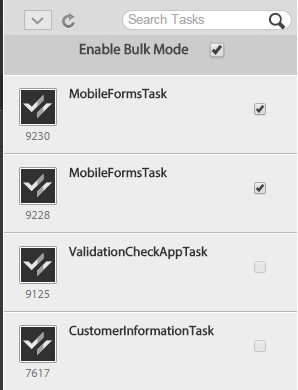

# Werken met to-do-lijsten{#working-with-to-do-lists}

Wanneer u uw lijst te doen bekijkt, kunt u taken van een bedrijfsproces zien die aan u, of aan om het even welke groepen worden toegewezen die u tot behoort, of de gedeelde taken van andere gebruikers zijn. U kunt de vereiste taken openen, bewerken en uitvoeren, zoals een verzoek goedkeuren of afwijzen of meer informatie toevoegen. Nadat u een taak voltooit, wordt het verzonden naar de volgende persoon in het bedrijfsproces,

## Lijsten van taken {#about-todo-lists}

De werkruimte van AEM-formulieren heeft de volgende drie typen van te maken lijsten:

* Individuele lijsten, die taken bevatten die rechtstreeks aan u worden toegewezen.
* De lijsten van de groep, die taken bevatten die aan een groep worden toegewezen. Om het even welk lid van de groep kan de taken openen en voltooien. Om een taak te openen, moet een lid van een groep eerst de taak eisen.
* Gedeelde lijsten, die taken bevatten die aan een gebruiker worden toegewezen die hun lijst van te doen met u en misschien andere gebruikers heeft gedeeld. Alle gebruikers die een lijst delen, kunnen gedeelde taken claimen, openen en voltooien.

U kunt bepaalde handelingen uitvoeren zonder de taak te openen door op de pictogrammen te klikken die worden weergegeven wanneer u de muisaanwijzer op een taak plaatst.

>[!NOTE]
>
>Een uitroepteken geeft aan dat de taak van hoge prioriteit is.

## Typische taken {#typical-tasks}

Wanneer u een taak opent en bewerkt, zijn de gereedschappen die beschikbaar zijn, afhankelijk van de taak. Voor verschillende taken is het nodig verschillende handelingen uit te voeren, zodat bepaalde gereedschappen al dan niet beschikbaar zijn. De typische taken die u kunt ontvangen worden hieronder beschreven.

**Geef informatie**: U ontvangt een taak waarvoor u een formulier moet invullen en verzenden.

**Informatie** bekijken: U ontvangt een taak waarvoor u de gegevens moet controleren en zich op de inhoud moet aanmelden.

**Revisie** voor meerdere gebruikers: U ontvangt een taak op hetzelfde moment dat andere gebruikers de taak ontvangen. U en de andere gebruikers moeten informatie verstrekken of de inhoud, of allebei herzien. Bij dit type taken kunnen de volgende gereedschappen beschikbaar zijn:

* De instructies voor de taak weergeven
* De voltooiingsstatus weergeven van alle gebruikers aan wie de taak is toegewezen
* De opmerkingen weergeven van alle gebruikers aan wie de taak is toegewezen
* Opmerkingen aan de taak zelf toevoegen

De extra hulpmiddelen die met om het even welke bovengenoemde taken beschikbaar kunnen zijn omvatten het volgende:

* Doorsturen
* Delen
* Consult
* Return
* Opmerkingen
* Bijlagen

## Taken openen {#opening-tasks}

U kunt taken openen en vergrendelen vanuit de lijst Aan/Uit en/of claim en taken openen vanuit een groep of gedeelde Aan/Uit-lijst. Wanneer u een taak opent, wordt deze weergegeven in het hoofdvenster. De andere taken worden weergegeven in de takenlijst naast de lijst Aan.

Als er een Taakoverzicht-URL bestaat, wordt de Taakoverzicht standaard geopend in plaats van het formulier dat aan een taak is gekoppeld. Zelfs als een gebruiker de optie &quot;Het formulier openen in de gemaximaliseerde modus&quot; inschakelt in Taak toewijzen, wordt het formulier niet geopend in de gemaximaliseerde modus.

>[!NOTE]
>
>Als u een taak opent, is het mogelijk dat het gekoppelde formulier volledig wordt weergegeven, afhankelijk van de standaardinstellingen van de taak.

### Een taak in uw lijst openen en vergrendelen {#open-and-lock-a-task-from-your-list}

Wanneer u een taak opent vanuit uw lijst Aan-doe, als uw lijst wordt gedeeld, kunt u de taak vergrendelen om te voorkomen dat een andere gebruiker die toegang heeft tot uw lijst, aan de taak werkt.

1. Selecteer op de pagina Aan-bewerking in het linkerdeelvenster de lijst Eén taak. Alle taken worden weergegeven in het middelste venster.

   >[!NOTE]
   >
   >U kunt de taken filteren door het procestype in de lijst Te doen te selecteren. U kunt uw lijst Aan-doe selecteren, om alle taken in opnieuw te bekijken aan-doe lijst.

1. Sluit indien nodig uw taak. Als u een taak wilt vergrendelen, klikt u op het pictogram Alle opties op de taak en selecteert u Vergrendelen. Houd de aanwijzer boven de taak om de optie beschikbaar te maken.

   >[!NOTE]
   >
   >U kunt een taak ook op elk tabblad vergrendelen of ontgrendelen wanneer de taak is geopend.

   

   Het menu Alle opties op een taak

1. Open de taak door erop te klikken.

### Een taak openen en claimen vanuit een gedeelde lijst of een groepslijst {#open-and-claim-a-task-from-a-shared-or-group-list}

Wanneer u een taak opent en claimt vanuit een groep of gedeelde lijst, wordt de taak verplaatst van de groep of de gedeelde lijst naar uw individuele lijst voor taken. Andere gebruikers met toegang tot de lijst kunnen niet aan de taak werken.

1. Selecteer in het linkerdeelvenster op de pagina Aan/Uit een groep of de lijst Gedeelde taak. Alle taken worden weergegeven in het middelste venster.
1. Voer een van de volgende stappen uit:

   * Als u een taak wilt claimen vanuit een groep of gedeelde aan-do-lijst zonder deze te openen, klikt u op **Claim** door de aanwijzer boven de taak te plaatsen. Als de taak is geopend, is de knop Claim beschikbaar in de actiebalk onder het taakvenster. Bij het opeisen, beweegt een taak zich van de groep of gedeelde aan-doe lijst aan uw lijst.
   * Klik op **Claim en open** om een taak uit een groep of gedeelde aan-do-lijst op te eisen en te openen.

## Working with tasks {#working-with-tasks}

Nadat u een taak hebt geopend, zijn de tabbladen die in het hoofdvenster worden weergegeven en de gereedschappen die beschikbaar zijn, afhankelijk van de taak. De tabbladen die u kunt zien, worden hieronder beschreven:

**Taakoverzicht**: Wanneer een taak opent, staat de ruit van het Overzicht van de Taak u toe om informatie over de taak te tonen, als het bestaat, gebruikend een URL die in het proces bij de stap van de Taak van de Toewijzing wordt gespecificeerd. Als u het venster Taakoverzicht gebruikt, kunt u aanvullende en relevante informatie voor een taak weergeven om meer waarde toe te voegen aan de werkruimte van de eindgebruiker van AEM Forms. Dit tabblad is niet beschikbaar als de URL voor het taakoverzicht niet bestaat.

**Details**: Verstrekt wat informatie over de huidige taak en het proces dat het tot behoort.

**Formulier**: Hiermee geeft u het formulier weer dat aan de taak is gekoppeld. Het formulier kan vele bestandstypen bevatten, zoals PDF-, HTML-, Guide- en SWF-bestanden. Het formulier kan er uitzien als een standaardformulier voor afdrukken of voor het web, of kan u door een reeks wizardstijldeelvensters leiden om informatie te verzamelen.

**Historie**: Hier worden de taken weergegeven die deel uitmaken van de procesinstantie en de bijbehorende vorm, taaktoewijzingen en bijlagen voor elke taak.

**Bijlagen**: Toont bestaande gehechtheid die met de taak wordt geassocieerd en voegt gehechtheid, indien nodig toe.

**Opmerkingen**: Toont de bestaande nota&#39;s verbonden aan de taak en voeg nota&#39;s toe, indien nodig.

Wanneer u aan een taak werkt, worden de gereedschappen die u ziet en de handelingen die u kunt uitvoeren hieronder beschreven.

### Een taak doorsturen, delen of raadplegen {#forward-share-or-consult-on-a-task}

U kunt een taak samen met om het even welke nota&#39;s of gehechtheid aan een andere gebruiker door:sturen of de taak delen of de taak met een andere gebruiker raadplegen. Als u de formuliergegevens wijzigt die aan een taak zijn gekoppeld, slaat u het formulier op als een concept voordat u de taak doorstuurt, deelt of raadpleegt u deze. Anders wordt de taak zonder het bijgewerkte formulier verzonden. Nadat u een taak door:sturen en deelt, kan de gebruiker die de taak ontvangt het eisen en voltooien of het aan u terugkeren. Als u een taak raadpleegt, kan de gebruiker de taak alleen aan u terugsturen.

1. Als u een formulier wijzigt dat is gekoppeld aan een taak die u wilt behouden, klikt u op **Opslaan**. De optie Opslaan is beschikbaar in de actiebalk onder aan elk tabblad. Anders wordt de taak zonder het bijgewerkte formulier verzonden.

   >[!NOTE]
   >
   >De knop Opslaan is niet voor alle formulieren beschikbaar, afhankelijk van de taak waaraan u werkt.

1. Klik op een van de volgende knoppen op een willekeurig tabblad:

   * **Doorsturen**
   * **Delen**
   * **Consult**
   >[!NOTE]
   >
   >Afhankelijk van de taak, kunt u deze acties van te doen lijst ook kunnen uitvoeren zonder de taak te openen.

1. Zoek in het pop-upvenster de naam van de gebruiker waarmee u de taak wilt doorsturen, delen of raadplegen.

### Een taak retourneren {#return-a-task}

1. Voor om het even welk lusje, klik **Terugkeer**. De taak is teruggekeerd aan de te doen lijst van de gebruiker die eerder de taak aan u, of deelde of raadpleegde de taak met u door:sturen.

### Een taak offline uitvoeren {#take-a-task-offline}

U mag mogelijk offline aan een taak werken en later het formulier ervan verzenden vanuit Adobe® Reader® of Adobe® Acrobat® Professional of Adobe® Acrobat® Standard. Wanneer het formulier wordt verzonden, wordt de e-mailclient gestart met het juiste e-mailadres van de server. U kunt het ingevulde formulier vervolgens via e-mail naar de server verzenden.

1. Klik op een willekeurig tabblad op **Off line**.
1. Geef een bestandsnaam op waarin u het formulier wilt opslaan en klik op **Opslaan**. Het formulier dat aan de taak is gekoppeld, wordt lokaal opgeslagen en de taak blijft in de lijst Aan/uit totdat het formulier wordt verzonden.

### Werken met bijlagen {#work-with-attachments}

U kunt bijlagen lokaal toevoegen, bijwerken, verwijderen of opslaan.

**Een bijlage toevoegen**

1. Klik op het tabblad **Bijlagen** op **Bladeren** om het bestand te selecteren dat u wilt bijvoegen.
1. Selecteer het **machtigingsniveau** voor de bijlage voor andere gebruikers die deelnemen aan het proces. Als u **Lezen** selecteert, kunnen andere gebruikers het bestand lokaal opslaan. Als u een van de bewerkingsmachtigingen selecteert, kunnen andere gebruikers ook een nieuw bestand uploaden om de bijlage te vervangen.

   >[!NOTE]
   >
   >U kunt ook opmerkingen toevoegen naast de bijlagen.

1. Klik op **Uploaden**. Het bestand wordt aan het formulier gekoppeld.

**Een bijlage weergeven**

1. Klik op het tabblad **Bijlagen** op de bestandsnaam van de bijlage die u wilt weergeven.

**Een bijlage lokaal opslaan**

1. Klik op een bijlage om deze te openen. Sla de geopende bijlage lokaal op.

**Een bijlage bijwerken**

1. Klik op **Bewerken** voor de bijlage. Selecteer het bestand waarmee u de bestaande bijlage wilt vervangen door op **Bladeren** te klikken.

**Een bijlage verwijderen**

1. Klik op **Verwijderen** voor een bijlage.

### Uw werk opslaan zonder de taak te voltooien {#save-your-work-without-completing-the-task}

1. Tik op elk tabblad op **Opslaan**.

   Het dialoogvenster Opslaan als concept wordt geopend. De standaardnaam van het concept is de taaknaam uit de taaksjabloon.

   

   >[!NOTE]
   >
   >U kunt werkruimte zodanig configureren dat de gegevens die een gebruiker heeft ingevoerd periodiek automatisch worden opgeslagen als concept. Als automatisch opslaan is ingeschakeld en een gebruiker aan een concept werkt, wordt het concept periodiek opgeslagen. In het geval van automatisch opslaan wordt de standaardnaam van de taak automatisch gebruikt.
   >
   >
   >Zie Concept periodiek opslaan in Voorkeuren [voor](/help/forms/using/getting-started-livecycle-html-workspace.md)beheer voor meer informatie.

1. Geef in het dialoogvenster Opslaan als concept een unieke naam voor de taak op en tik op **OK**.

   

   Het concept wordt met de opgegeven naam opgeslagen. De taak blijft in de lijst Aan/Uit en alle wijzigingen die u in het formulier hebt aangebracht, worden opgeslagen in de map Concepten. In de lijst Aan kunt u bovendien naar het concept zoeken met de naam van het concept om het werken aan het concept te hervatten.

   

## Taken voltooien {#completing-tasks}

Hoe u een taak voltooit, is afhankelijk van de taak zelf en uw rol in het proces. Mogelijk wordt u gevraagd een verzoek goed te keuren of te weigeren, inhoud op te geven, informatie te controleren en te verifiëren of aan te geven dat u hebt gehandeld.

U kunt een taak op verschillende manieren voltooien:

* De acties gebruiken die beschikbaar zijn op een van de tabbladen
* De acties gebruiken die in het formulier zelf zijn gemaakt
* Van uw lijst Aan, zonder de taak te openen

>[!NOTE]
>
>Deze optie is beschikbaar als `isMustOpenToComplete` veld niet is geselecteerd in de `Assign Task` stap in Workbench tijdens het ontwerpen van een proces.

* Als u e-mailberichten ontvangt

Wanneer u een taak voltooit, afhankelijk van de taak, kan een bevestigingsvenster verschijnen herbevestiging van uw actie. U ziet bijvoorbeeld een dialoogvenster waarin u wordt gevraagd de geldigheid van de gegevens die u hebt opgegeven te bevestigen.

>[!NOTE]
>
>Als u een taak hebt gewijzigd maar deze nog niet hebt voltooid, kunt u uw werk opslaan als concept door op Opslaan te klikken en er later op terug te keren.

### Een taak voltooien {#complete-a-task}

1. Voer een van de volgende stappen uit:

   * Selecteer de taak en klik de aangewezen knoop voor de volgende stap die in het proces bij de bodem van de lijst wordt vereist.
   * Als het formulier geen knoppen heeft en de knop Voltooien in de werkruimte van AEM-formulieren beschikbaar is, klikt u op **Voltooien**.
   * Als het formulier knoppen bevat en de knop Voltooien in de werkruimte van AEM-formulieren niet beschikbaar is, klikt u op de desbetreffende knop in het formulier voor de volgende vereiste stap in het proces.
   Als het formulier geen knoppen heeft en de knop Voltooien in de werkruimte van AEM Forms niet beschikbaar is, wordt een bericht weergegeven dat het formulier niet kan worden verzonden.

1. Voer een van de volgende handelingen uit als er een bevestigingsvenster verschijnt:

   * Klik op **OK** als u de taak hebt voltooid en klaar bent om u ervan af te melden.
   * Klik op **Annuleren** als u wilt terugkeren naar de taak en u niet klaar bent om u ervan af te melden.

>[!NOTE]
>
>U ziet mogelijk een knop Verzenden in HTML-formulieren als de proceseigenschappen in een formulier worden gebruikt. Deze knop is niet zichtbaar wanneer hetzelfde formulier wordt weergegeven als PDF. Als u een taak wilt voltooien, klikt u op de knop Verzenden onder aan de werkruimte van AEM-formulieren, buiten het formulier en niet op de knop Verzenden in het formulier.

### Taken voor bulksgewijs goedkeuren {#bulk-approve-tasks}

U kunt meerdere taken verzenden vanuit de lijst Aan taak. Slechts kunnen de taken van het zelfde proces, met de zelfde taaknamen, en de zelfde routeopties samen worden voorgelegd.

>[!NOTE]
>
>Deze optie is beschikbaar als het veld isMustOpenToComplete niet is geselecteerd in de stap Taak toewijzen in Workbench tijdens het ontwerpen van een proces.

1. Selecteer op de pagina Aan-bewerking in het linkerdeelvenster de lijst Eén taak. Alle taken worden weergegeven in het middelste venster.
1. Selecteer **Bulkmodus** inschakelen. Selectievakjes worden vóór de taken in de lijst weergegeven.

   >[!NOTE]
   >
   >Deze optie is niet beschikbaar voor taken waarvoor het veld isMustOpenToComplete is geselecteerd in de stap Taak toewijzen in Workbench tijdens het ontwerpen van een proces. Selectievakjes van dergelijke taken in de lijst TO-DO blijven altijd uitgeschakeld.

1. Selecteer taken voor bulkgoedkeuring. De veelvoudige taken van het zelfde proces, met de zelfde taaknamen, en de zelfde routeopties kunnen worden geselecteerd. Zodra u één taak voor goedkeuring selecteert, slechts blijven de taken met het zelfde proces, met de zelfde taaknamen, en de zelfde routeopties toegelaten. De rest is uitgeschakeld.

   

1. Klik op de optie Verzenden. De geselecteerde taken worden verzonden.

   

## Deelnemen aan taken via e-mail {#participating-in-tasks-through-email}

U kunt taken via e-mail ontvangen en voltooien. Als u via e-mails aan taken deelneemt, hoeft u uw lijst Aan-taak routinematig te controleren op nieuwe taken of moet u de pagina Volgen controleren op de status van een taak.

Stel eerst de werkruimtevoorkeuren voor AEM-formulieren in voor het ontvangen van e-mailberichten. De werkruimte van AEM-formulieren kan e-mailmeldingen verzenden voor taken in uw lijst Aan-taak of elke lijst met aan-te-doen groepen waartoe u behoort. De beheerder bepaalt wanneer de e-mailberichten worden verzonden en wie hen ontvangt.

De e-mailberichten kunnen een koppeling bevatten waarmee de taak wordt geopend in de werkruimte van AEM Forms, een bijlage van het formulier dat voor de taak wordt gebruikt of acties voor het uitvoeren van de taak via e-mail. Als een formulier in het e-mailbericht is opgenomen, kunt u het formulier openen en de taak voltooien als de knoppen voor het voltooien van de taak in het formulier zijn ingebouwd. Als acties voor het voltooien van de taak in het e-mailbericht zijn opgenomen, kunt u de taak voltooien door op de acties in de e-mail te klikken of door op het e-mailbericht te reageren met de actie die u als eerste regel in de tekst van de e-mail hebt getypt.

>[!NOTE]
>
>Zie de Beheerdershandleiding voor JEE-formulieren voor AEM Forms om de werkruimte zodanig te configureren dat de juiste e-mailsjablonen worden gebruikt.

Wanneer u een taak via e-mail voltooit, wordt de taak verwijderd uit uw lijst Aan-doe in de werkruimte van Vormen AEM.

>[!NOTE]
>
>Als de gebruiker niet is aangemeld in de werkruimte van AEM Forms in de browser en een koppeling naar een taak van Aan doet opent, kan de koppeling Direct To-do niet worden geopend en wordt een uitzondering weergegeven. Meld u aan bij de werkruimte van AEM-formulieren voordat u op koppelingen in de e-mails klikt.

>[!NOTE]
>
>U kunt geen e-mailbericht verzenden om een taak aan iemand anders toe te wijzen. U kunt taken alleen doorsturen naar andere gebruikers vanuit de werkruimte van AEM-formulieren.

### E-mailberichten ontvangen {#receive-email-notification-messages}

1. Klik op **Voorkeuren**.
1. Selecteer **Ja in de lijst Taakgebeurtenissen via e-mail** **melden**.
1. Als u het formulier en de gegevens in het e-mailbericht wilt opnemen, selecteert u **Ja** in de lijst Formulieren **bijvoegen in e-mail**.

## Deelnemen aan taken via mobiele apparaten {#participating-in-tasks-through-mobile-devices}

U kunt de werkruimte-app AEM Forms gebruiken om deel te nemen aan taken vanaf uw mobiele apparaat. Voordat u de toepassing installeert, moet u contact opnemen met de systeembeheerder om te controleren of uw organisatie het gebruik van de AEM Forms-werkruimte-app ondersteunt.

## Informatie over deadlines en herinneringen {#about-deadlines-and-reminders}

Een *deadline* bepaalt de datum en tijd waarop een taak moet zijn voltooid. Wanneer een deadline overgaat, leidt de server de taak naar de volgende stap in het proces (die een lijst kan zijn van een andere gebruiker te doen) en dan verschijnt het tijdspictogram op de taak. Het tijdlijnpictogram wordt weergegeven, ongeacht de regels die aan het proces zijn gekoppeld.

Een *herinnering* brengt u op de hoogte van een taak die uw aandacht vereist. Herinneringen vinden plaats op een vooraf bepaald tijdstip en dan met regelmatige intervallen tot u de bijbehorende taak voltooit. Wanneer u een herinnering ontvangt, verschijnt het herinneringspictogram op de taak.

Het bedrijfsproces bepaalt het gedrag en de timing van termijnen en herinneringen. Niet alle processen hebben deadlines en herinneringen. De beheerder geeft aan of e-mailmeldingen worden verzonden voor deadlines en herinneringen. U kunt uw voorkeuren instellen voor het ontvangen van e-mailberichten.

## Werken met taken uit groep en gedeelde wachtrijen {#working-with-tasks-from-group-and-shared-queues}

Alle taken die aan u worden toegewezen verschijnen in uw lijst van te doen (rij).

Alle groepen en gedeelde to-do-lijsten waartoe u toegang hebt, worden ook weergegeven in het linkerdeelvenster op de pagina Aan-bewerking. U kunt taken van om het even welke lijst uitvoeren die u toegang hebt tot.

Een lijst van te doen groepen kan meer dan één lid hebben. Een beheerder plaatst - groep aan-doet lijsten die op de specifieke vereisten van uw organisatie worden gebaseerd. De groep aan-doet lijsten verstrekken een manier om het werk onder verscheidene mensen te verdelen die gelijkaardige verantwoordelijkheden delen.

Elk lid van uw team verwerkt bijvoorbeeld aanvraagformulieren voor leningen. Al deze taken worden verzonden naar een groep aan-doet lijst dat elk lid van uw groep toegang tot heeft. Elk lid van uw groep heeft toegang tot de taken uit die lijst van te doen.

Een lijst met gedeelde taken wordt weergegeven wanneer een andere gebruiker zijn lijst van taken met u deelt of een taak expliciet met u deelt. Vervolgens kunt u de taken in de lijst Aan/Uit van die gebruiker weergeven en deze namens die gebruiker voltooien. Bijvoorbeeld, als u een vakantie neemt, kunt u verkiezen om uw te doen lijst met een medewerker te delen die uw taken voltooit terwijl u weg bent.

>[!NOTE]
>
>U kunt ook buiten het kantoor instellingen opgeven om taken door te sturen naar andere gebruikers terwijl u weg bent.

Als u aan een taak wilt werken vanuit een groep of gedeelde lijst Aan/uit, claimt u eerst de taak. U wordt dan eigenaar van de taak tot u het voltooit of het aan een andere gebruiker door:sturen.

### Wachtrijen delen {#sharing-queues}

U kunt uw lijst Aan-doe met een andere gebruiker delen, die dan de nieuwe taken in uw te doen lijst kan bekijken en op hen voor u actie ondernemen. Als er taken in de lijst Aan staan voordat u de lijst Aan doet deelt, kan de andere gebruiker deze niet weergeven. De gebruiker kan slechts de taken bekijken en eisen die in uw te doen lijst aankomen nadat u toegang tot uw te doen lijst verleent.

Houd in mening dat voor een gebruiker om een taak in een gedeelde rij te zien, de procesontwerper ACL voor de Gedeelde optie van de Rij op het lusje van de Controle van de Toegang van de Taak van de Dienst van de Gebruiker moet toelaten (ACL).

>[!NOTE]
>
>Als u van plan bent om vanaf het bureau weg te zijn, kunt u uit-van-bureaumontages ook specificeren om taken aan andere gebruikers door:sturen terwijl u weg bent in plaats van het delen van uw volledige te doen lijst.

**Uw wachtrij delen**

1. Klik op het tabblad **Wachtrijen** op het tabblad **Voorkeuren** op het pictogram ‘+’ voor ‘Gebruikers die mijn wachtrij momenteel delen’.
1. Zoek en selecteer de naam van de gebruiker.
1. Klik op de knop **Delen** om de wachtrij te delen met de geselecteerde gebruiker.
1. Selecteer de naam van de gebruiker en klik op **Delen**.

   >[!NOTE]
   >
   >U kunt een gebruiker verwijderen uit het delen van uw lijst Aan-doet door op het pictogram **X** te klikken aan het einde van de rij waarin de gebruiker wordt vermeld.

### Andere wachtrijen openen {#accessing-other-queues}

U kunt toegang tot een lijst van te doen van een andere gebruiker verzoeken om om het even welke nieuwe taken in de te doen lijst van de gebruiker te bekijken en te eisen.

Wanneer u om toegang tot een andere gebruiker te doen lijst verzoekt, ontvangt de gebruiker een taak in hun te doen lijst om of uw verzoek goed te keuren of te ontkennen. Nadat de gebruiker de taak voltooit, ontvangt u een bericht in uw lijst te doen.

Als u toegang krijgt tot de lijst Aan-doe van een andere gebruiker, kunt u geen taken bekijken die in de te doen lijst bestonden van de gebruiker alvorens u toegang werd verleend. U kunt alleen de taken weergeven die in de lijst Aan-taak van de gebruiker aankomen nadat u toegang hebt gekregen tot de lijst Aan-Uit.

**Andere wachtrij openen**

1. Open op het tabblad **Voorkeuren** het tabblad **Wachtrijen** .
1. Klik op &#39;+&#39; voor de gebruikerswachtrijen waartoe ik toegang heb. Zoek de naam van de gebruiker in het pop-updialoogvenster.
1. Selecteer de naam van de gebruiker en klik op **Verzoek**.

   >[!NOTE]
   >
   >U kunt uw toegang tot een andere te doen lijst verwijderen door de gebruikersnaam van de Gebruikerslijsten te selecteren die ik Toegang tot lijst heb en **X** aan het eind van de rij te klikken die de naam van de gebruiker noemt. U kunt uw toegang tot een andere lijst van te doen niet verwijderen wanneer het verzoek om tot de lijst van te doen nog hangend is.

## Voorkeuren instellen voor Buiten het kantoor {#setting-out-of-office-preferences}

Als u van plan bent om uit het bureau te zijn, kunt u specificeren wat aan taken gebeurt die aan u voor die periode worden toegewezen.

U kunt een begindatum en -tijd en een einddatum en -tijd opgeven die van kracht moeten worden als uw instellingen buiten het kantoor zijn. Als u in een verschillende tijdzone van de server wordt gevestigd, is de gebruikte tijdzone die van de server.

U kunt een standaardpersoon instellen waarnaar al uw taken worden verzonden. U kunt ook uitzonderingen voor taken van specifieke processen specificeren die naar een verschillende gebruiker moeten worden verzonden of in uw te doen lijst blijven tot u terugkeert. Als de aangewezen persoon ook uit het bureau is, gaat de taak naar de gebruiker die zij hebben aangewezen. Als de taak niet aan een gebruiker kan worden toegewezen die niet uit het bureau is, blijft de taak in uw te doen lijst.

>[!NOTE]
>
>Wanneer u uit het bureau bent, blijven om het even welke taken die eerder in uw te doen lijst daar waren en niet door:sturen aan andere gebruikers.

### Voorkeuren voor buiten het kantoor instellen {#set-out-of-office-preferences}

1. Klik op **Voorkeuren** en **Buiten-kantoor**.
1. Voer een van de volgende stappen uit om op te geven wanneer u buiten het kantoor bent:

   * Om te specificeren dat u nu uit het bureau voor een onbepaalde tijdspanne bent, in **ik ben momenteel** lijst, uitgezocht **uit het Bureau** maar voeg geen datumwaaier toe.
   * Om een begindatum en een tijd te specificeren dat u uit het bureau bent en &#39;+&#39; voor **uit het Programma** van het Bureau klikt. Gebruik de kalender en de tijdlijst om de begindatum en de tijd te specificeren. Als u geen einddatum en -tijd opgeeft, wordt u geacht eindeloos uit het kantoor te zijn vanaf de begindatum en -tijd totdat u uw voorkeuren wijzigt.

1. Om te specificeren hoe uw taken door gebrek moeten worden behandeld, selecteer één van deze opties van **toen uit het Bureau: Standaardgebruiker voor lijst met taken** buiten het kantoor:

   * Selecteer **Niet toewijzen** om taken in uw lijst van te doen te houden tot u terugkeert.
   * Selecteer Gebruiker **** zoeken om te zoeken naar een gebruiker waaraan uw taken moeten worden toegewezen. Wanneer u een gebruiker selecteert, kunt u hun uit-van-bureauprogramma ook bekijken.

1. Als u uitzonderingen op de standaardwaarde wilt instellen, klikt u op + voor **Procesuitzonderingen**, selecteert u het proces waarvoor u een uitzondering wilt maken en selecteert u een andere gebruiker of kiest u **Niet toewijzen** in de lijst **wordt toegewezen aan** .

   >[!NOTE]
   >
   >De procesontwerper kan specificeren dat de taken van sommige processen altijd privé worden gehouden en niet aan andere gebruikers door:sturen. Deze instelling overschrijft alle instellingen die u maakt.

1. Als u de voorkeuren hebt ingesteld, klikt u op **Opslaan**. Als uw instellingen aangeven dat u momenteel buiten het kantoor bent, worden de wijzigingen onmiddellijk van kracht. Anders worden ze van kracht op de opgegeven begindatum en -tijd. Als u zich aanmeldt terwijl u zich buiten het kantoor bevindt, wordt u pas overwogen op het kantoor wanneer u uw instellingen wijzigt.
