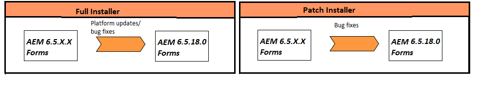

# Upgrade naar AEM 6,5 Forms in JEE {#upgrade-to-aem-forms-jee}

AEM 6.5.18.0 Forms op JEE biedt twee typen installatieprogramma&#39;s: volledig installatieprogramma en Patch-installatieprogramma.

**Volledige installateur**: U kunt [&#x200B; AEM 6.5.18.0 op volledig installatieprogramma JEE &#x200B;](https://experienceleague.adobe.com/docs/experience-manager-release-information/aem-release-updates/forms-updates/aem-forms-releases.html?lang=nl-NL) gebruiken om nieuwe instanties van AEM Forms op te zetten of verbeteringen van AEM 6.5.x.x Forms op JEE aan AEM 6.5.18.0 Forms op JEE uit te voeren.

**installateur van het Patch**: [&#x200B; AEM 6.5.18.0 op JEE flardinstallateur &#x200B;](https://experienceleague.adobe.com/docs/experience-manager-release-information/aem-release-updates/forms-updates/aem-forms-releases.html?lang=nl-NL) is voor klanten die reeds AEM 6.5.x.x versies gebruiken. U kunt het installatieprogramma van de patch gebruiken om een upgrade uit te voeren naar de nieuwste versie van AEM Forms.

In de volgende tabel ziet u de scenario&#39;s voor het gebruik van het installatieprogramma voor volledige patches en patches.

Voer de volgende procedure uit om het volledige installatieprogramma te gebruiken om bestaande AEM Forms 6.5.x.x op JEE aan AEM 6.5.18.0 Forms op JEE te bevorderen:

1. Download AEM 6.5 Forms op de installateur van JEE van de [&#x200B; Distributie van de Software &#x200B;](https://experience.adobe.com/#/downloads/content/software-distribution/en/aem.html). U hebt een geldig onderhouds- en ondersteuningscontract nodig om het installatieprogramma te kunnen gebruiken.
1. Zie [&#x200B; checklist en planning van de Verbetering &#x200B;](https://www.adobe.com/go/learn_aemforms_upgrade_checklist_65) over de controles leren om een succesvolle verbetering te verzekeren.
1. Zie [&#x200B; voorbereidingen treffen om aan AEM Forms &#x200B;](https://www.adobe.com/go/learn_aemforms_prepareupgrade_65) te bevorderen om de taken te leren en uit te voeren die de verbeteringslooppas met minimale serveronderbreking correct verzekeren.
1. Afhankelijk van uw bestaande omgeving en toepassingsserver kiest u een van de volgende documenten en volgt u de instructies.

   * [&#x200B; Verbetering van AEM 6.3 of AEM 6.4 Forms aan AEM 6.5 Forms voor JBoss &#x200B;](https://www.adobe.com/go/learn_aemforms_upgradeJBoss_65)
   * [&#x200B; Verbetering van AEM 6.3 of AEM 6.4 Forms aan AEM 6.5 Forms voor WebSphere &#x200B;](https://www.adobe.com/go/learn_aemforms_upgradeWebSphere_65)
   * [&#x200B; Verbetering van AEM 6.3 of AEM 6.4 Forms aan AEM 6.5 Forms voor JBoss Turnkey &#x200B;](https://www.adobe.com/go/learn_aemforms_upgradeTurnkey_65)

Directe upgrade van LiveCycle ES2, LiveCycle ES3, AEM 6.0 Forms, AEM 6.1 Forms, AEM 6.2 Forms naar AEM 6.5 is niet beschikbaar. U kunt een tussentijdse upgrade uitvoeren naar een of meer versies van LiveCycle of AEM Forms en vervolgens upgraden naar AEM 6.5 Forms. Voor de lijst van middenversies en overeenkomstige verbeteringsinstructies, zie [&#x200B; een verbeteringspad &#x200B;](upgrade.md) kiezen.
