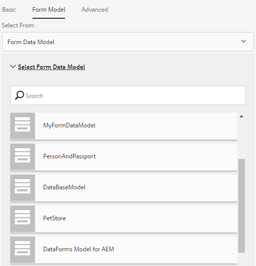

# Formuliergegevensmodel gebruiken{#use-form-data-model}

| Versie | Artikelkoppeling |
| -------- | ---------------------------- |
| AEM as a Cloud Service | [Klik hier](https://experienceleague.adobe.com/docs/experience-manager-cloud-service/content/forms/integrate/use-form-data-model/using-form-data-model.html) |
| AEM 6,5 | Dit artikel |

Met AEM Forms-gegevensintegratie kunt u verschillende backendgegevensbronnen gebruiken om een formuliergegevensmodel te maken dat u als schema kunt gebruiken in verschillende adaptieve formulieren en interactieve communicatieworkflows. Hiervoor moeten gegevensbronnen worden geconfigureerd en een formuliergegevensmodel worden gemaakt op basis van gegevensmodelobjecten en -services die beschikbaar zijn in gegevensbronnen. Raadpleeg de volgende secties voor meer informatie:

* [AEM Forms-gegevensintegratie](../../forms/using/data-integration.md)
* [Gegevensbronnen configureren](../../forms/using/configure-data-sources.md)
* [Formuliergegevensmodel maken](../../forms/using/create-form-data-models.md)
* [Werken met formuliergegevensmodel](../../forms/using/work-with-form-data-model.md)

Een formuliergegevensmodel is een uitbreiding van het JSON-schema waarmee u:

* [Aangepaste formulieren en fragmenten maken](#create-af)
* [Interactieve communicatie en bouwstenen maken, zoals tekst-, lijst- en voorwaardelijke fragmenten](#create-ic)
* [Interactieve communicatie voorvertonen met voorbeeldgegevens](#preview-ic)
* [Aangepaste formulieren en interactieve communicatie vooraf invullen](#prefill)
* [Verzonden adaptieve formuliergegevens terugschrijven naar gegevensbronnen](#write-af)
* [Invoers van services met behulp van adaptieve formulierregels](#invoke-services)

## Aangepaste formulieren en fragmenten maken {#create-af}

U kunt [adaptieve formulieren](../../forms/using/creating-adaptive-form.md) en [adaptieve formulierfragmenten](../../forms/using/adaptive-form-fragments.md) op basis van een formuliergegevensmodel. Ga als volgt te werk om een formuliergegevensmodel te gebruiken bij het maken van een adaptief formulier of adaptief formulierfragment:

1. Selecteer op het tabblad Formuliermodel in het scherm Eigenschappen toevoegen de optie **[!UICONTROL Form Data Model]** in de **[!UICONTROL Select From]** vervolgkeuzelijst.

   

1. Selecteren om uit te breiden **[!UICONTROL Select Form Data Model]**. Alle beschikbare formuliergegevensmodellen worden weergegeven.

   Selecteer een gegevensmodel.

   

1. (**Alleen adaptieve formulierfragmenten**) U kunt een adaptief formulierfragment maken op basis van slechts één gegevensmodelobject in een formuliergegevensmodel. Uitbreiden **[!UICONTROL Form Data Model Definitions]** vervolgkeuzelijst. Hiermee worden alle gegevensmodelobjecten in het opgegeven formuliergegevensmodel weergegeven. Selecteer een gegevensmodelobject in de lijst.

   

Nadat het adaptieve formulier of het adaptieve formulierfragment op basis van een formuliergegevensmodel is gemaakt, worden formuliergegevensmodelobjecten weergegeven in het dialoogvenster **[!UICONTROL Data Model Objects]** tabblad van de inhoudbrowser in de adaptieve formuliereditor.

>[!NOTE]
>
>Voor een adaptief formulierfragment worden alleen het gegevensmodelobject dat is geselecteerd op het moment van ontwerpen en de bijbehorende gegevensmodelobjecten weergegeven op het tabblad Gegevensmodelobjecten.

U kunt gegevensmodelobjecten naar het aangepaste formulier of fragment slepen om formuliervelden toe te voegen. De toegevoegde formuliervelden behouden de eigenschappen van de metagegevens en de binding met de eigenschappen van gegevensmodelobjecten. De binding zorgt ervoor dat de veldwaarden bij het verzenden van het formulier worden bijgewerkt in de bijbehorende gegevensbronnen en dat deze worden voorgevuld wanneer het formulier wordt gegenereerd.

## Interactieve communicatie maken {#create-ic}

U kunt een interactieve communicatie tot stand brengen die op een model van vormgegevens wordt gebaseerd dat u kunt gebruiken om interactieve mededeling met gegevens van gevormde gegevensbronnen vooraf in te vullen. Bovendien kunnen de bouwstenen van een interactieve communicatie, zoals tekst, lijst, en de fragmenten van het voorwaardendocument op een model van vormgegevens worden gebaseerd.

U kunt een formuliergegevensmodel kiezen wanneer u een interactieve communicatie of een documentfragment maakt. In de volgende afbeelding ziet u het tabblad Algemeen van het dialoogvenster Interactieve communicatie maken.

Tabblad Algemeen van dialoogvenster Interactieve communicatie maken

Zie voor meer informatie:

[Een interactieve communicatie maken](../../forms/using/create-interactive-communication.md)

[Tekst in interactieve communicatie](/help/forms/using/texts-interactive-communications.md)

[Voorwaarden voor interactieve communicatie](/help/forms/using/conditions-interactive-communications.md)

[Fragmenten weergeven](/help/forms/using/lists.md)

## Voorvertonen met voorbeeldgegevens {#preview-ic}

Met de formuliergegevensmodeleditor kunt u voorbeeldgegevens voor gegevensmodelobjecten in het formuliergegevensmodel genereren en bewerken. U kunt deze gegevens gebruiken om interactieve communicatie en adaptieve formulieren voor te vertonen en te testen. Voorbeeldgegevens genereren voor voorvertoning zoals beschreven in [Werken met formuliergegevensmodel](../../forms/using/work-with-form-data-model.md#sample).

Een voorvertoning weergeven van een interactieve communicatie met voorbeeldgegevens van het formuliergegevensmodel:

1. Navigeer in AEM auteurinstantie naar **[!UICONTROL Forms > Forms & Documents]**.
1. Selecteer een interactieve communicatie en selecteer **[!UICONTROL Preview]** in de werkbalk om **[!UICONTROL Web Channel]**, **[!UICONTROL Print Channel]**, of **[!UICONTROL Both Channels]** om een voorvertoning van de interactieve communicatie te bekijken.
1. In de voorvertoning [*kanaal*] ervoor te zorgen dat **[!UICONTROL Test Data of Form Data Model]** is geselecteerd en selecteert **[!UICONTROL Preview]**.

De interactieve communicatie wordt geopend met vooraf ingevulde voorbeeldgegevens.

Als u een voorbeeld van een adaptief formulier met voorbeeldgegevens wilt bekijken, opent u het adaptieve adaptieve formulier in de modus Ontwerpen en selecteert u **[!UICONTROL Preview]**.

## Vooraf invullen met service voor formuliergegevensmodellen {#prefill}

AEM Forms biedt een vooraf ingevulde service voor het out-of-the-box formuliergegevensmodel die u kunt inschakelen voor adaptieve formulieren en interactieve communicatie op basis van het formuliergegevensmodel. De Prefill-service zoekt naar gegevensbronnen voor gegevensmodelobjecten in het adaptieve formulier en de interactieve communicatie en vult daarom gegevens aan tijdens het weergeven van het formulier of de communicatie.

Open de eigenschappen van de container van het adaptieve formulier en selecteer **[!UICONTROL Form Data Model Prefill service]** van de **[!UICONTROL Prefill Service]** in de Basis accordeon. Sla vervolgens de eigenschappen op.

Als u de service voor het vooraf invullen van het formuliergegevensmodel wilt configureren in een interactieve communicatie, kunt u de service Vooraf invullen van formuliergegevensmodel selecteren in de vervolgkeuzelijst Prefill Service tijdens het maken of later door de eigenschappen te wijzigen.

Dialoogvenster Eigenschappen bewerken voor interactieve communicatie

## Ingediende adaptieve formuliergegevens naar gegevensbronnen schrijven {#write-af}

Wanneer een gebruiker een formulier verzendt dat is gebaseerd op een formuliergegevensmodel, kunt u het formulier zo configureren dat de verzonden gegevens voor een gegevensmodelobject naar de bijbehorende gegevensbronnen worden geschreven. AEM Forms biedt [Handeling Formuliergegevensmodel verzenden](../../forms/using/configuring-submit-actions.md), alleen beschikbaar buiten de box voor adaptieve formulieren op basis van een formuliergegevensmodel. Het schrijft voorgelegde gegevens voor een voorwerp van het gegevensmodel in zijn gegevensbron.

Als u de verzendactie van het formuliergegevensmodel wilt configureren, opent u de eigenschappen van de container van het adaptieve formulier en selecteert u **[!UICONTROL Submit using Form Data Model]** in de vervolgkeuzelijst Handeling verzenden onder de verzendaccordeon. Blader vervolgens naar een gegevensmodelobject en selecteer dit in het menu **[!UICONTROL Name of the data model object to submit]** vervolgkeuzelijst. Sla de eigenschappen op.

Bij het verzenden van formulieren worden gegevens voor het geconfigureerde gegevensmodelobject naar de desbetreffende gegevensbron geschreven.

U kunt ook formulierbijlagen verzenden naar een gegevensbron met binaire objecteigenschappen van gegevensmodellen. Ga als volgt te werk om bijlagen naar een JDBC-gegevensbron te verzenden:

1. Voeg een gegevensmodelobject dat een binaire eigenschap bevat toe aan het formuliergegevensmodel.
1. Sleep de **[!UICONTROL File Attachment]** van de Componentbrowser naar het adaptieve formulier.
1. Selecteer de toegevoegde component en selecteer  om de browser van Eigenschappen voor de component te openen.
1. Selecteer in het veld Bindverwijzing de optie  en navigeer om de binaire eigenschap te selecteren die u in het formuliergegevensmodel hebt toegevoegd. Configureer desgewenst andere eigenschappen.

   Selecteren  om de eigenschappen op te slaan. Het bijslagveld is nu gebonden aan de binaire eigenschap van het formuliergegevensmodel.

1. Schakel in het gedeelte Verzending van de eigenschappen van de container van adaptieve formulieren de optie **[!UICONTROL Submit Form Attachments]**. De bijlage in het binaire-eigenschapveld wordt naar de gegevensbron verzonden bij het verzenden van het formulier.

## Invoers van diensten in adaptieve formulieren met behulp van regels {#invoke-services}

In een adaptief formulier op basis van een formuliergegevensmodel kunt u [regels maken](../../forms/using/rule-editor.md) om de diensten aan te halen die in het model van vormgegevens worden gevormd. De **[!UICONTROL Invoke Services]** bewerking in een regel bevat een lijst met alle beschikbare services in het formuliergegevensmodel en u kunt invoer- en uitvoervelden voor de service selecteren. U kunt ook de opdracht **Waarde instellen** regeltype om een service van een formuliergegevensmodel aan te roepen en de waarde van een veld in te stellen op de uitvoer die door de service wordt geretourneerd.

Bijvoorbeeld, haalt de volgende regel de dienst aan die Werknemeridentiteitskaart als input neemt en de teruggekeerde waarden in overeenkomstige Afhankelijke identiteitskaart, Familienaam, Voornaam, en Gendergebieden in de vorm worden bevolkt.

Daarnaast kunt u de opdracht `guidelib.dataIntegrationUtils.executeOperation` API om een JavaScript in de coderedacteur voor de regelredacteur te schrijven. Zie voor API-details [API om formuliergegevensmodelservice aan te roepen](/help/forms/using/invoke-form-data-model-services.md).
