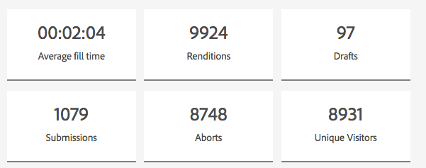
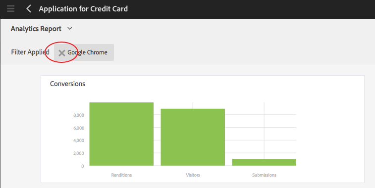

# Analyserapporten van AEM Forms weergeven en begrijpen {#view-and-understand-aem-forms-analytics-reports}

Adobe Experience Manager Forms kan worden geïntegreerd met Adobe Analytics, waarmee u prestatiegegevens voor gepubliceerde formulieren en documenten kunt vastleggen en bijhouden. Het doel van de analyse van deze gegevens is om geïnformeerde beslissingen te nemen op basis van gegevens over de wijzigingen die nodig zijn om formulieren of documenten bruikbaarder te maken.

## Analyses instellen {#setting-up-analytics}

De functie Analytics in AEM Forms is beschikbaar als onderdeel van het invoegpakket voor AEM Forms. Zie AEM-formulieren [installeren en configureren voor informatie over het installeren van het invoegpakket](../../forms/using/installing-configuring-aem-forms-osgi.md).

Naast het invoegpakket hebt u een Adobe Analytics-account nodig. Zie [Adobe Analytics](https://www.adobe.com/solutions/digital-analytics.html)voor meer informatie over de oplossing.

Zodra u het invoegpakket voor AEM Forms en een Adobe Analytics-account hebt, integreert u de Adobe Analytics-account met AEM Forms en schakelt u het bijhouden van formulieren of documenten in zoals wordt beschreven in Analytics en Reports configureren.

### Hoe gebruikersinteractiegegevens worden vastgelegd {#how-user-interaction-information-is-recorded}

Wanneer een gebruiker met het formulier werkt, worden de interacties opgenomen en naar de Analyseserver verzonden. De volgende lijst wijst op servervraag voor diverse gebruikersactiviteiten:

* 2 gesprekken per veld per bezoek
* 1 voor een bezoek aan een panel
* 1 voor opslaan
* 2 voor verzending
* 2 voor opslaan
* 1 voor hulp
* 1 voor elke validatiefout
* 1 voor Formulieruitvoering + 1 voor standaardvenster: ga naar + 1 voor standaard 1e veld.
* 2 voor Formulier verlaten

>[!NOTE]
>
>Deze lijst is niet limitatief.

### Analyserapporten weergeven {#summary-report}

Voer de volgende stappen uit om analyserapporten weer te geven:

1. Meld u aan bij de AEM-portal op `https://[hostname]:'port'`
1. Klik op **Formulieren > Formulieren en documenten**.
1. Selecteer het formulier waarvoor u de analyserapporten wilt weergeven.
1. Selecteer **Meer > Analyserapporten**.

**A.** Analyserapport, opdracht

In AEM Forms worden analyserapporten voor het formulier en voor elk deelvenster in het formulier weergegeven, zoals hieronder wordt weergegeven.

**A.** Conversies **B.** Samenvatting op formulierniveau **C.** Overzicht op paneelniveau **D.** Browsers van bezoekers - filter **E.** Besturingssysteem van bezoekers - filter **F.** Taal van bezoekers - filter

Standaard wordt het analyserapport voor de laatste zeven dagen weergegeven. U kunt rapporten weergeven voor de laatste 15 dagen, de laatste één maand enzovoort, of een datumbereik opgeven.

>[!NOTE]
>
>De opties zoals Laatste 7 dagen en Laatste 15 dagen bevatten geen gegevens voor de dag waarop u het analyserapport genereert. Om de gegevens van de huidige dag te omvatten, moet u de datumwaaier met inbegrip van de huidige dag specificeren en dan het rapport in werking stellen.

### Grafiek voor conversie voor adaptieve formulieren en HTML5-formulieren {#conversions-graph-for-adaptive-and-html-forms}

De omzettingsgrafiek op formulierniveau geeft u inzicht in hoe het formulier de volgende prestatiekernindicatoren (KPI&#39;s) uitvoert:

* **Uitvoeringen**: Het aantal keren dat een formulier wordt geopend
* **Bezoekers**: Het aantal bezoekers van het formulier
* **Indieningen**: Aantal keer dat het formulier wordt ingediend

### Analyserapport voor adaptieve en HTML5-formulieren {#analytics-report-for-adaptive-and-html-forms}

In de overzichtssectie op formulierniveau kunt u zien hoe het formulier de volgende prestatiekernindicatoren (KPI&#39;s) uitvoert:

* **Gemiddelde vultijd**: Gemiddelde tijd die is besteed aan het invullen van het formulier. Wanneer gebruikers tijd aan het formulier besteden maar niet verzenden, wordt die tijd niet in deze berekening opgenomen.
* **Uitvoeringen**: Aantal keer dat het formulier is gegenereerd of geopend
* **Concepten**: Aantal keer dat het formulier is opgeslagen als concept
* **Indieningen**: Aantal keer dat het formulier is ingediend
* **Afbreken**: Aantal keren dat gebruikers het formulier hebben ingevuld en vervolgens het formulier hebben verlaten zonder het formulier in te vullen
* **Unieke bezoekers**: Aantal keren dat het formulier wordt weergegeven door unieke bezoekers. Voor meer informatie over unieke bezoekers, zie [Unieke Bezoekers, Bezoekingen, en klantengedrag](https://helpx.adobe.com/analytics/kb/unique-visitors-visitor-behavior.html).

### Deelvensterrapport {#bottom-summary-report}

De overzichtssectie op paneelniveau bevat de volgende informatie over elk deelvenster in het formulier:

* **Gemiddelde vultijd**: Gemiddelde tijd die het panel heeft doorgebracht, ongeacht of het formulier is ingediend
* **Fouten aangetroffen**: Gemiddeld aantal fouten dat de gebruikers hebben aangetroffen in de velden in een deelvenster. Fouten die worden aangetroffen, worden gevonden door het totale aantal fouten in een veld te delen door het aantal uitvoeringen van het formulier.
* **Help geopend**: Gemiddeld aantal keren dat gebruikers de Help in de context hebben geopend voor de velden in het deelvenster. De hulp Toegelaten wordt bereikt door het totale aantal tijden te delen de Hulp voor een gebied door aantal vertoningen van vorm wordt betreden.

#### Gedetailleerd deelvensterrapport {#detailed-panel-report}

U kunt ook details voor elk deelvenster weergeven door in het deelvensterrapport op de naam van een deelvenster te klikken.

Het gedetailleerde rapport bevat waarden voor alle velden in het deelvenster.

Het paneelrapport heeft drie lusjes:

* **Tijdrapport**(standaard): Geeft de tijd in aantal seconden weer die is besteed aan het invullen van elk veld in het deelvenster
* **Foutrapport**: Hiermee geeft u het aantal fouten weer dat gebruikers hebben aangetroffen bij het invullen van de velden
* **Help-rapport**: Aantal keren dat de Help voor een bepaald veld is geopend

U kunt tussen de deelvensters navigeren als er meerdere deelvensters beschikbaar zijn.

### Filters: Browser, besturingssysteem en taal {#filters-browser-os-and-language}

In de tabellen Browserdistributie, OS Distribution en Taaldistributie worden de uitvoeringen, bezoekers en verzendingen weergegeven volgens browsers, OS en Taal van formuliergebruikers. In deze tabellen worden standaard maximaal vijf items weergegeven. U kunt op Meer tonen klikken om meer items weer te geven en op Minder tonen klikken om terug te keren naar de normale vijf of minder items.

Als u de analysegegevens verder wilt filteren, klikt u op een item in een van de tabellen. Als u bijvoorbeeld op Google Chrome klikt in de tabel Browser Distribution, wordt het rapport opnieuw weergegeven met gegevens die relevant zijn voor de Google Chrome-browser, zoals hieronder:

Als u het paneelrapport na het toepassen van een filter bekijkt, worden de gegevens van het paneelrapport ook getoond volgens de toegepaste filter.

Nadat een filter is toegepast:

* De distributietabellen worden read-only, aangezien slechts één filter tegelijk kan worden toegepast.
* De tabel van het toegepaste filter verdwijnt.
* U kunt op de knop Sluiten (hieronder gemarkeerd) klikken om het toegepaste filter te verwijderen.

### A/B-tests {#a-b-testing}

Als u A/B tests hebt toegelaten en opstelling voor de vorm, heeft de rapportpagina een drop-down u kunt gebruiken om het A/B testende rapport te tonen. In het testrapport A/B worden de prestaties van twee versies van het formulier vergeleken terwijl u het instelt.

Zie [A/B-test voor adaptieve formulieren](../../forms/using/ab-testing-adaptive-forms.md)maken en beheren voor meer informatie over A/B-tests.
