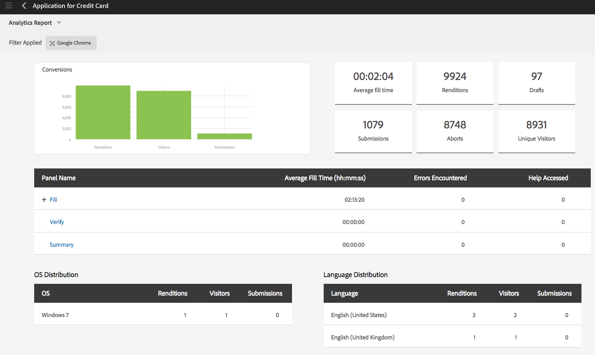

# AEM Forms-analyserapporten weergeven en begrijpen {#view-and-understand-aem-forms-analytics-reports}

Adobe Experience Manager Forms is geïntegreerd met Adobe Analytics waarmee u prestatiegegevens voor gepubliceerde formulieren en documenten kunt vastleggen en bijhouden. Het doel van de analyse van deze gegevens is om geïnformeerde beslissingen te nemen op basis van gegevens over de wijzigingen die nodig zijn om formulieren of documenten bruikbaarder te maken.

## Analyses instellen {#setting-up-analytics}

De functie Analytics in AEM Forms is beschikbaar als onderdeel van het invoegpakket voor AEM Forms. Voor informatie over het installeren van het toe:voegen-op pakket, zie [ Installerend en het vormen AEM Forms ](../../forms/using/installing-configuring-aem-forms-osgi.md).

Naast het invoegpakket hebt u een Adobe Analytics-account nodig. Voor informatie over de oplossing, zie [ Adobe Analytics ](https://www.adobe.com/solutions/digital-analytics.html).

Zodra u het AEM Forms toe:voegen-op pakket en een rekening van Adobe Analytics hebt, integreer de rekening van Adobe Analytics met AEM Forms en laat het volgen op uw vormen of documenten zoals die in [ worden beschreven toe vormen analyses en rapporten ](../../forms/using/configure-analytics-forms-documents.md).

### Hoe gebruikersinteractiegegevens worden vastgelegd {#how-user-interaction-information-is-recorded}

Wanneer een gebruiker met het formulier werkt, worden de interacties opgenomen en naar de Analyseserver verzonden. De volgende lijst wijst op servervraag voor diverse gebruikersactiviteiten:

* 2 gesprekken per veld per bezoek
* 1 voor een bezoek aan een panel
* 1 voor opslaan
* 2 voor verzending
* 2 voor opslaan
* 1 voor hulp
* 1 voor elke validatiefout
* 1 voor Formulieruitvoering + 1 voor standaardvenster: bezoek + 1 voor standaardbezoek aan het eerste veld
* 2 voor Formulier verlaten

>[!NOTE]
>
>Deze lijst is niet limitatief.

### Analyserapporten weergeven {#summary-report}

Voer de volgende stappen uit om analyserapporten weer te geven:

1. Meld u aan bij de portal AEM op `https://[hostname]:'port'`
1. Klik **Forms > Forms &amp; Documenten**.
1. Selecteer het formulier waarvoor u de analyserapporten wilt weergeven.
1. Selecteer **Meer > de Rapporten van de Analyse**.

**A.** het bevel van het Rapport van de Analyse

AEM Forms geeft analyserapporten voor het formulier en voor elk deelvenster in het formulier weer, zoals hieronder wordt weergegeven.

**A.** Conversies **B.** Vorm-vlakke samenvatting **C.** Comité-vlakke samenvatting **D.** Browsers van bezoekers - filter **E.** OS van bezoekers - filter **F.** Taal van bezoekers - filter

Standaard wordt het analyserapport voor de laatste zeven dagen weergegeven. U kunt rapporten weergeven voor de laatste 15 dagen, de laatste één maand enzovoort, of u kunt een datumbereik opgeven.

>[!NOTE]
>
>De opties zoals Laatste 7 dagen en Laatste 15 dagen bevatten geen gegevens voor de dag waarop u het analyserapport genereert. Om de gegevens van de huidige dag te omvatten, moet u de datumwaaier met inbegrip van de huidige dag specificeren en dan het rapport in werking stellen.

### Omzettingen grafiek voor adaptieve en HTML5 vormen {#conversions-graph-for-adaptive-and-html-forms}

De omzettingsgrafiek op formulierniveau geeft u inzicht in hoe het formulier de volgende prestatiekernindicatoren (KPI&#39;s) uitvoert:

* **Vertoningen**: Het aantal tijden een vorm wordt geopend
* **Bezoekers**: Het aantal bezoekers aan de vorm
* **Voorleggen**: Aantal tijden de vorm wordt voorgelegd

### Analyserapport voor adaptieve en HTML5-formulieren {#analytics-report-for-adaptive-and-html-forms}

In de overzichtssectie op formulierniveau kunt u zien hoe het formulier de volgende prestatiekernindicatoren (KPI&#39;s) uitvoert:

* **Gemiddelde vultijd**: Gemiddelde tijd besteed in het vullen van de vorm. Wanneer gebruikers tijd aan het formulier besteden maar niet verzenden, wordt die tijd niet in deze berekening opgenomen.
* **Vertoningen**: Aantal tijden de vorm is teruggegeven of geopend
* **Concepten**: Aantal tijden de vorm is bewaard als ontwerp
* **Voorleggen**: Aantal tijden de vorm is voorgelegd
* **Afbreken**: Aantal tijden begonnen de gebruikers de vorm te vullen en dan verlaten zonder de vorm te voltooien
* **Unieke Bezoekers**: Aantal tijden de vorm wordt &quot;teruggegeven door unieke bezoekers. Voor meer informatie over unieke bezoekers, zie [ Unieke Bezoekers, Bebezoeken, en klantengedrag ](https://helpx.adobe.com/nl/analytics/kb/unique-visitors-visitor-behavior.html).

### Deelvensterrapport {#bottom-summary-report}

In het overzichtsgedeelte op paneelniveau vindt u de volgende informatie over elk deelvenster in het formulier:

* **Gemiddelde Vultijd**: Gemiddelde tijd die aan het paneel wordt doorgebracht, of de vorm al dan niet wordt voorgelegd
* **Ontvangen Fouten**: Gemiddeld aantal fouten die door de gebruikers op de gebieden in een paneel worden ontmoet. Fouten die worden aangetroffen, worden gevonden door het totale aantal fouten in een veld te delen door het aantal uitvoeringen van het formulier.
* **Toegang tot Hulp**: Gemiddeld aantal tijden hebben de gebruikers tot de in-context hulp voor de gebieden in het paneel toegang gehad. De hulp Toegelaten wordt bereikt door het totale aantal tijden te delen de Hulp voor een gebied door aantal vertoningen van vorm wordt betreden.

#### Gedetailleerd deelvensterrapport {#detailed-panel-report}

U kunt ook details voor elk deelvenster weergeven door in het deelvensterrapport op de naam van een deelvenster te klikken.

Het gedetailleerde rapport bevat waarden voor alle velden in het deelvenster.

Het paneelrapport heeft drie lusjes:

* **Rapport van de Tijd** (Gebrek): Toont de tijd, in aantal seconden, besteed aan het vullen van elk van de gebieden in het paneel
* **Rapport van de Fout**: Toont het aantal fouten die door gebruikers worden ontmoet terwijl het vullen van de gebieden
* **Rapport van de Hulp**: Aantal tijden hulp voor een bepaald gebied werd betreden

U kunt tussen de deelvensters navigeren als er meerdere deelvensters beschikbaar zijn.

### Filters: browser, besturingssysteem en taal {#filters-browser-os-and-language}

In de tabellen Browserdistributie, OS Distribution en Taaldistributie worden de uitvoeringen, bezoekers en verzendingen weergegeven volgens browsers, OS en Taal van formuliergebruikers. In deze tabellen worden standaard maximaal vijf items weergegeven. U kunt op Meer tonen klikken om meer items weer te geven en op Minder tonen klikken om terug te keren naar de normale vijf of minder items.

Als u de analysegegevens verder wilt filteren, klikt u op een item in een van de tabellen. Als u bijvoorbeeld op Google Chrome in de tabel Browser Distribution klikt, wordt het rapport opnieuw weergegeven met de volgende gegevens die relevant zijn voor de Google Chrome-browser:

Als u het paneelrapport na het toepassen van een filter bekijkt, worden de gegevens van het paneelrapport ook getoond volgens de toegepaste filter.

Nadat een filter is toegepast:

* De distributietabellen worden read-only, aangezien slechts één filter tegelijk kan worden toegepast.
* De tabel van het toegepaste filter verdwijnt.
* U kunt op de knop Sluiten (hieronder gemarkeerd) klikken om het toegepaste filter te verwijderen.

 te verwijderen

### A/B-tests {#a-b-testing}

Als u A/B tests hebt toegelaten en opstelling voor de vorm, heeft de rapportpagina een drop-down u kunt gebruiken om het A/B testende rapport te tonen. In het testrapport A/B worden de prestaties van twee versies van het formulier vergeleken terwijl u het instelt.

Voor meer informatie over het testen A/B, zie [ A/B test voor adaptieve vormen creëren en leiden ](../../forms/using/ab-testing-adaptive-forms.md).
