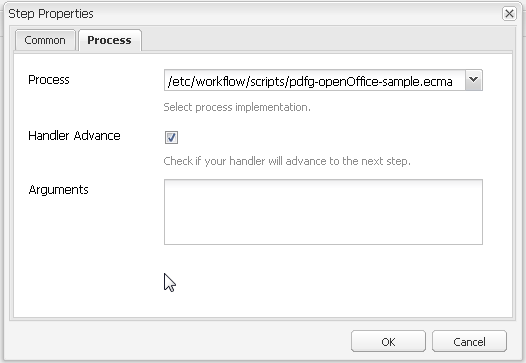
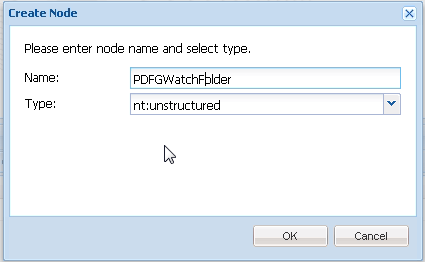

# Gecontroleerde map in AEM-formulieren{#watched-folder-in-aem-forms}

Een beheerder kan een netwerkmap, ook wel een gecontroleerde map genoemd, zo configureren dat wanneer een gebruiker een bestand (zoals een PDF-bestand) in de Gecontroleerde map plaatst, een vooraf geconfigureerde workflow, service of scriptbewerking wordt gestart om het toegevoegde bestand te verwerken. Nadat de service de opgegeven bewerking heeft uitgevoerd, wordt het resulterende bestand opgeslagen in een opgegeven uitvoermap. Zie [Verschillende methoden voor het verwerken van bestanden](../../forms/using/watched-folder-in-aem-forms.md#main-pars-header-4)voor meer informatie over workflow, service en script.

## Een gecontroleerde map maken {#create-a-watched-folder}

U kunt een van de volgende methoden gebruiken om een gecontroleerde map te maken op het bestandssysteem:

* Wanneer het vormen van de eigenschappen van een Gecontroleerde knoop van de Omslagconfiguratie, typ de volledige weg van de ouderfolder in het folderPath bezit en voeg de naam van de Gecontroleerde Te creëren Omslag toe, zoals aangetoond in het volgende voorbeeld: `C:/MyPDFs/MyWatchedFolder`De `MyWatchedFolder`map bestaat niet. AEM Forms probeert de map te maken op het opgegeven pad.

* Creeer een omslag op het dossiersysteem alvorens een Gecontroleerd eindpunt van de Omslag te vormen, en dan de volledige weg in het folderPath bezit te verstrekken. Zie [Gecontroleerde mapeigenschappen](../../forms/using/watched-folder-in-aem-forms.md#main-pars-header-1)voor meer informatie over de eigenschap folderPath.

>[!NOTE]
>
>In een gegroepeerde omgeving moet de map die als gecontroleerde map wordt gebruikt, toegankelijk, beschrijfbaar en gedeeld zijn op het bestandssysteem of het netwerk. Elke instantie van de toepassingsserver van de cluster moet toegang tot dezelfde gedeelde map hebben. In Windows maakt u een toegewezen netwerkstation op alle servers en geeft u het pad van de toegewezen netwerkschijf op in de eigenschap folderPath.

## Configuratieknooppunt voor gecontroleerde map maken {#create-watched-folder-configuration-node}

Om een Gecontroleerde Omslag te vormen, creeer een Gecontroleerde knoop van de Configuratie van de Omslag. Voer de volgende stappen uit om de configuratieknoop tot stand te brengen:

1. Meld u aan bij de CRX-DE-lijst als beheerder en navigeer naar de map /etc/fd/watchfolder/config.

1. Maak een knooppunt van het type `nt:unstructured`. Voorbeeld: watchedfolder

   >[!NOTE]
   >
   >De knooppuntnaam van de gecontroleerde map mag geen spaties en speciale tekens bevatten.

1. Voeg de volgende eigenschappen toe aan het knooppunt:

   * `folderPath`
   * `inputProcessorType`
   * `inputProcessorId`
   * `outputFilePattern`
   Zie [Gecontroleerde mapeigenschappen](../../forms/using/watched-folder-in-aem-forms.md#main-pars-header-1)voor een volledige lijst met ondersteunde eigenschappen.

1. Klik op Alles **opslaan**. Nadat het knooppunt is gemaakt en de eigenschappen zijn opgeslagen. De `input`, `result`, `failure`, `preserve`, en de `stage`omslagen worden gecreeerd bij de weg die in het `folderPath` bezit wordt gespecificeerd.

   De scantaak begint de Gecontroleerde Omslag met een bepaald tijd-interval te scannen.

## Eigenschappen van gecontroleerde mappen {#watchedfolderproperties}

U kunt de volgende eigenschappen configureren voor een gecontroleerde map.

* **folderPath (String)**: Het pad van de map die met een bepaald tijdsinterval moet worden gescand. Voor een gegroepeerde omgeving moet de map zich op een gedeelde locatie bevinden met alle servers die volledige toegang tot de server hebben. Het is een verplicht bezit.
* **inputProcessorType (String)**: Het type proces dat moet worden gestart. U kunt werkschema, manuscript, of de dienst specificeren. Het is een verplicht bezit.
* **inputProcessorId (String)**: Het gedrag van de eigenschap inputProcessorId is gebaseerd op de waarde die is opgegeven voor de eigenschap inputProcessorType. Het is een verplicht bezit. In de volgende lijst worden alle mogelijke waarden van de eigenschap inputProcessorType en de bijbehorende waarden voor de eigenschap inputProcessorType weergegeven:

   * Geef voor workflow het workflowmodel op dat moet worden uitgevoerd. Bijvoorbeeld /etc/workflow/models/&lt;workflow_naam>/jcr:content/model
   * Geef bij script het JCR-pad op van het script dat moet worden uitgevoerd. Bijvoorbeeld /etc/fd/watchfolder/test/testScript.ecma
   * Voor de dienst, specificeer de filter die voor het bepalen van de plaats van de dienst OSGi wordt gebruikt. De service is geregistreerd als een implementatie van com.adobe.aemfd.watchfolder.service.api.ContentProcessor Interface.

* **runModes (String)**: Een door komma&#39;s gescheiden lijst met toegestane uitvoeringsmodi voor de uitvoering van de workflow. Enkele voorbeelden:

   * author

   * publish

   * auteur, publiceren

   * publiceren, auteur

**Opmerking**: *Als de server die als host fungeert voor de gecontroleerde map geen van de opgegeven uitvoeringsmodi heeft, wordt de gecontroleerde map altijd geactiveerd, ongeacht de uitvoeringsmodi op de server.*

* **outputFilePattern (String)**: Patroon van het uitvoerbestand. U kunt een map of bestandspatroon opgeven. Als een mappatroon is opgegeven, hebben de uitvoerbestanden de namen die in de workflows worden beschreven. Als een bestandspatroon is opgegeven, hebben de uitvoerbestanden de namen die in het bestandspatroon worden beschreven. [Met bestands- en mappatroon](../../forms/using/watched-folder-in-aem-forms.md#p-file-and-folder-patterns-p) kunt u ook een mapstructuur voor de uitvoerbestanden opgeven. Het is een verplicht bezit.

* **stageFileExpirationDuration (lang, standaard -1)**: Het aantal seconden dat moet worden gewacht voordat een invoerbestand/map die al voor verwerking is opgepakt, wordt beschouwd als een time-out en gemarkeerd als een fout. Dit verloopmechanisme wordt alleen geactiveerd wanneer de waarde voor deze eigenschap een positief getal is.

   **Opmerking:** *Zelfs wanneer een invoer wordt gemarkeerd als een time-out met behulp van dit mechanisme, kan het nog steeds op de achtergrond verwerken, maar neemt het gewoon meer tijd dan verwacht. Als de invoerinhoud is verbruikt voordat het time-outmechanisme is ingedrukt, kan de verwerking zelfs later worden voltooid en wordt de uitvoer in de resultatenmap gedumpt. Als de inhoud niet vóór de onderbreking werd verbruikt, is het zeer waarschijnlijk dat de verwerking later uit zal fout bij het proberen om de inhoud te verbruiken, en deze fout zal ook in de mislukkingsomslag voor de zelfde input worden geregistreerd. Anderzijds, als de verwerking voor de input nooit geactiveerd wegens een periodiek baan/werkschemamisbrand (dat is het scenario het verloopmechanisme richt om te richten), dan natuurlijk zullen geen van beide situaties voorkomen. Voor alle items in de map met foutmeldingen die zijn gemarkeerd als mislukkingen vanwege een time-out (zoek naar berichten in het formulier &quot;Bestand wordt niet verwerkt na een aanzienlijke hoeveelheid tijd, gemarkeerd als fout!&quot; in het foutenlogboek), is het aan te raden om de resultaatomslag (en ook de mislukkingsomslag zelf voor een andere ingang voor de zelfde input) af te tasten om te controleren of om het even welke eerder beschreven gebeurtenissen daadwerkelijk voorkwamen.*

* 
* **deleteExpiredStageFileOnlyWhenThrottled (Boolean, standaard true):** Hiermee wordt aangegeven of het verloopmechanisme alleen moet worden geactiveerd wanneer de controlemap wordt vertraagd. Het mechanisme is relevanter voor vertraagde controlemappen aangezien een klein aantal dossiers die zich in een onverwerkte staat (wegens intermitterende baan/werkschemafouten) rond blijven de mogelijkheid hebben om verwerking voor de volledige partij te onderdrukken wanneer het vertragen wordt toegelaten. Als deze eigenschap wordt ingesteld op true (de standaardwaarde), wordt het verloopmechanisme niet geactiveerd voor gecontroleerde mappen die niet worden vertraagd. Als de eigenschap false blijft, wordt het mechanisme altijd geactiveerd zolang de eigenschap stageFileExpirationDuration een positief getal is.

* **pollInterval (lang)**: Het interval in seconden voor het scannen van de gecontroleerde map op invoer. Tenzij de Throttle-instelling is ingeschakeld, moet het pollinterval langer zijn dan de tijd die nodig is om een gemiddelde taak te verwerken. anders kan het systeem overbelast raken . De standaardwaarde is 5. Zie de beschrijving bij Batchgrootte voor meer informatie. De waarde van het pollinterval moet groter dan of gelijk aan 1 zijn.
* **excludeFilePattern (String)**: Een door puntkomma&#39;s (;) gescheiden lijst met patronen die door een gecontroleerde map worden gebruikt om te bepalen welke bestanden en mappen moeten worden gescand en opgehaald. Bestanden of mappen met dit patroon worden niet gescand voor verwerking. Deze instelling is handig wanneer de invoer een map met meerdere bestanden is. De inhoud van de map kan worden gekopieerd naar een map met een naam die wordt opgehaald door de gecontroleerde map. Hierdoor wordt voorkomen dat de gecontroleerde map een map opneemt die moet worden verwerkt voordat de map volledig is gekopieerd naar de invoermap. De standaardwaarde is null.
U kunt [bestandspatronen](../../forms/using/watched-folder-in-aem-forms.md#p-file-and-folder-patterns-p) gebruiken om uit te sluiten:

   * Bestanden met specifieke bestandsnaamextensies; bijvoorbeeld *.dat, *.xml, .pdf, *.*
   * Bestanden met specifieke namen; data* sluit bijvoorbeeld bestanden en mappen met de naam data1, data2 enzovoort uit.
   * Bestanden met samengestelde expressies in de naam en de extensie, zoals in de volgende voorbeelden:

      * Gegevens[0-9][0-9][0-9].[dD][aA]&#39;port&#39;
      * *.[dD][Aa]&#39;port&#39;
      * *.[x][MM][Ll]

Zie [Bestandspatronen](../../forms/using/watched-folder-in-aem-forms.md#p-file-and-folder-patterns-p)voor meer informatie over bestandspatronen.

* **includeFilePattern (String)**: Een door puntkomma&#39;s (;) gescheiden lijst met patronen die door de gecontroleerde map worden gebruikt om te bepalen welke mappen en bestanden moeten worden gescand en opgehaald. Als IncludeFilePattern bijvoorbeeld input* is, worden alle bestanden en mappen opgehaald die overeenkomen met input*. Dit omvat bestanden en mappen met de naam input1, input2, enzovoort. De standaardwaarde is * en geeft alle bestanden en mappen aan. U kunt bestandspatronen gebruiken om het volgende op te nemen:

   * Bestanden met specifieke bestandsnaamextensies; bijvoorbeeld *.dat, *.xml, .pdf, *.*
   * Bestanden met specifieke namen; bijvoorbeeld gegevens.* bevat bestanden en mappen met de naam data1, data2 enzovoort.

* Bestanden met samengestelde expressies in de naam en de extensie, zoals in de volgende voorbeelden:

   * Gegevens[0-9][0-9][0-9].[dD][aA]&#39;port&#39;

      * *.[dD][Aa]&#39;port&#39;
      * *.[x][MM][Ll]

Zie [Bestandspatronen voor meer informatie over bestandspatronen](../../forms/using/watched-folder-in-aem-forms.md#p-file-and-folder-patterns-p)

* **waitTime (lang)**: De tijd, in milliseconden, om te wachten alvorens u een omslag of een dossier scant nadat het wordt gecreeerd. Als de wachttijd bijvoorbeeld 3.600.000 milliseconden (een uur) is en het bestand een minuut geleden is gemaakt, wordt dit bestand opgepikt nadat 59 minuten zijn verstreken. De standaardwaarde is 0. Deze instelling is handig om ervoor te zorgen dat een bestand of map volledig naar de invoermap wordt gekopieerd. Als u bijvoorbeeld een groot bestand hebt dat moet worden verwerkt en het downloaden van het bestand duurt tien minuten, stelt u de wachttijd in op 10*60 *1000 milliseconden. Zo voorkomt u dat de gecontroleerde map het bestand scant als het nog geen tien minuten oud is.
* **purgeDuration (Lang)**: Bestanden en mappen in de resultaatmap worden gewist wanneer ze ouder zijn dan deze waarde. Deze waarde wordt gemeten in dagen. Deze instelling is handig om ervoor te zorgen dat de resultaatmap niet vol wordt. De waarde -1 dagen geeft aan dat u de resultatenmap nooit wilt verwijderen. De standaardwaarde is -1.
* **resultFolderName (String)**: De map waarin de opgeslagen resultaten worden opgeslagen. Als de resultaten niet in deze map worden weergegeven, controleert u de map met foutmeldingen. Alleen-lezen bestanden worden niet verwerkt en opgeslagen in de map met foutmeldingen. Deze waarde kan een absoluut of relatief pad zijn met de volgende bestandspatronen:

   * %F = voorvoegsel bestandsnaam
   * %E = bestandsnaamextensie
   * %Y = jaar (volledig)
   * %y = jaar (laatste twee cijfers)
   * %M = maand
   * %D = dag van de maand
   * %d = dag van het jaar
   * %H = uur (24-uurs klok)
   * %h = uur (12-uurs klok)
   * %m = minuut
   * %s = seconde
   * %l = millisecond
   * %R = willekeurig getal (tussen 0 en 9)
   * %P = proces- of taak-id
   Als het op 17 juli 2009 bijvoorbeeld 8 uur &#39;s middags is en u C:/Test/WF0/failure/%Y/%M/%D/%H/ opgeeft, is de resultaatmap C:/Test/WF0/failure/2009/07/17/20

   Als het pad niet absoluut maar relatief is, wordt de map gemaakt in de gecontroleerde map. De standaardwaarde is result/%Y/%M/%D/. Dit is de resultatenmap in de Gecontroleerde map. Zie [Bestandspatronen](../../forms/using/watched-folder-in-aem-forms.md#p-file-and-folder-patterns-p)voor meer informatie over bestandspatronen.

>[!NOTE]
>
>Hoe kleiner de resultaatmappen, hoe beter Gecontroleerde map. Als de geschatte belasting voor de gecontroleerde map bijvoorbeeld 1000 bestanden per uur is, probeert u een patroon als resultaat/%Y%M%D%H, zodat er elk uur een nieuwe submap wordt gemaakt. Als het laden kleiner is (bijvoorbeeld 1000 bestanden per dag), kunt u een patroon gebruiken zoals result/%Y%M%D.

* **failureFolderName (String)**: De map waarin bestanden met fouten worden opgeslagen. Deze locatie is altijd relatief ten opzichte van de gecontroleerde map. U kunt bestandspatronen gebruiken, zoals beschreven in Resultaatmap. Alleen-lezen bestanden worden niet verwerkt en opgeslagen in de map met foutmeldingen. De standaardwaarde is error/%Y/%M/%D/.
* **preserveFolderName (String):** De locatie waar bestanden worden opgeslagen nadat de verwerking is voltooid. Het pad kan een absoluut, relatief of null-mappad zijn. U kunt bestandspatronen gebruiken, zoals beschreven in Resultaatmap. De standaardwaarde is preserve/%Y/%M/%D/.
* **batchSize (lang)**: Het aantal bestanden of mappen dat per scan moet worden opgehaald. gebruiken om overbelasting van het systeem te voorkomen; te veel bestanden tegelijk scannen kan ertoe leiden dat de toepassing vastloopt. De standaardwaarde is 2.

   Met de instellingen voor Opiniepeiling en Batchgrootte bepaalt u hoeveel bestanden gecontroleerde map worden opgehaald in elke scan. De gecontroleerde Omslag gebruikt een de draadpool van het Kwartz om de inputomslag af te tasten. De draadpool wordt gedeeld met andere diensten. Als het scaninterval klein is, scannen de threads de invoermap vaak. Als bestanden vaak in de gecontroleerde map worden neergezet, moet u het scaninterval klein houden. Als de dossiers niet vaak worden gelaten vallen, gebruik een groter aftasteninterval zodat de andere diensten de draden kunnen gebruiken.

   Als er een groot volume bestanden verloren gaat, maakt u de batch groot. Als de service die wordt gestart door het eindpunt van de gecontroleerde map bijvoorbeeld 700 bestanden per minuut kan verwerken en gebruikers bestanden naar dezelfde snelheid in de invoermap kunnen neerzetten, kunt u de waarden voor Batch-grootte instellen op 350 en Opiniepeilinginterval op 30 seconden helpen bij de prestaties van de gecontroleerde map zonder dat de kosten voor het scannen van de gecontroleerde map te vaak worden doorberekend.

   Wanneer bestanden naar de gecontroleerde map worden neergezet, worden de bestanden in de invoer weergegeven. Dit kan de prestaties verminderen wanneer elke seconde wordt gescand. Het verhogen van het aftasteninterval kan prestaties verbeteren. Als het volume van te laten vallen dossiers klein is, pas de Grootte van de Partij en het Interval van de Opiniepeiling dienovereenkomstig aan. Als er bijvoorbeeld elke seconde 10 bestanden worden verwijderd, stelt u het pollinterval in op 1 seconde en de Batchgrootte op 10

* **throttleOn (Boolean)**: Als deze optie is geselecteerd, wordt het aantal taken voor gecontroleerde mappen dat door AEM Forms op een bepaald moment wordt verwerkt, beperkt. Het maximumaantal taken wordt bepaald door de waarde voor Batchgrootte. De standaardwaarde is true. (Zie [Informatie over vertragen](../../forms/using/watched-folder-in-aem-forms.md#p-about-throttling-p).)

* **overwriteDuplicateFilename (Boolean)**: Als u de waarde True instelt, worden de bestanden in de map results en preserve overschreven. Wanneer ingesteld op Onwaar, worden bestanden en mappen met het numerieke indexachtervoegsel gebruikt voor de naam. De standaardwaarde is False.
* **preserveOnFailed (Boolean)**: Invoerbestanden behouden als de bewerking niet op een service wordt uitgevoerd. De standaardwaarde is true.
* **inputFilePattern (String)**: Hiermee geeft u het patroon op van de invoerbestanden voor een gecontroleerde map. Hiermee maakt u een whitelist van de bestanden.
* **asynch (Boolean)**: Identificeert het aanroepingstype als asynchroon of synchroon. De standaardwaarde is true (asynchroon). De dossierverwerking is een middel verbruikende taak, houd de waarde van de asynchrone vlag aan waar om het onderdrukken van de belangrijkste draad van de aftastenbaan te verhinderen. In een gegroepeerd milieu, is het kritiek om de vlag waar te houden om lading-in evenwicht brengend voor de dossiers toe te laten die over de beschikbare servers worden verwerkt. Als de vlag vals is, probeert de aftastenbaan om verwerking voor elk top-level dossier/omslag opeenvolgend binnen zijn eigen draad uit te voeren. Stel de markering niet in op onwaar zonder een specifieke reden, zoals verwerking op basis van een workflow op basis van één server.

>[!NOTE]
>
>De workflows zijn per ontwerp asynchroon. Zelfs als u de waarde op false instelt, worden de workflows gestart in de asynchrone modus.

* **enabled (Boolean)**: Hiermee wordt het scannen naar een gecontroleerde map gedeactiveerd en geactiveerd. Stel deze optie in op true als u de gecontroleerde map wilt scannen. De standaardwaarde is true.
* **payloadMapperFilter:** Wanneer een map is geconfigureerd als controlemap, wordt een mapstructuur gemaakt in de controlemap. De structuur bevat mappen voor het leveren van invoer, het ontvangen van uitvoer (resultaten), het opslaan van gegevens voor fouten, het bewaren van gegevens voor langlevende processen en het opslaan van gegevens voor verschillende stadia. De mapstructuur van een gecontroleerde map kan dienen als een lading Forms-centric workflows. Met een payload-mapper kunt u de structuur definiëren van een lading die een gecontroleerde map gebruikt voor invoer, uitvoer en verwerking. Als u bijvoorbeeld de standaardmapper gebruikt, wordt de inhoud van de gecontroleerde map toegewezen aan de [payload]-\invoer- en [payload]\uitvoermap. Er zijn twee uitvoeringen beschikbaar voor de payload mapper box. Als u geen [aangepaste implementatie](../../forms/using/watched-folder-in-aem-forms.md#creating-a-custom-payload-mapper-filter)hebt, gebruikt u een van de implementaties buiten de box:

   * **Standaardmapper:** Gebruik de standaard payload mapper om de invoer- en uitvoerinhoud van de gecontroleerde mappen in aparte invoer- en uitvoermappen in de payload te houden. Gebruik in het payload-pad van een workflow ook [payload]/input/- en [payload]/output-paden om inhoud op te halen en op te slaan.

   * **Simple File-based payload mapper:** Gebruik de Simple File-based payload mapper om invoer- en uitvoerinhoud rechtstreeks in de payload-map te houden. Er wordt geen extra hiërarchie gemaakt, zoals de standaardmapper.

### Aangepaste configuratieparameters {#custom-configuration-parameters}

Samen met de bovengenoemde Gecontroleerde eigenschappen van de Mapconfiguratie, kunt u de parameters van de douaneconfiguratie ook specificeren. De aangepaste parameters worden doorgegeven aan de bestandsverwerkingscode. Het laat de code toe om zijn gedrag te veranderen die op de waarde van de parameter wordt gebaseerd. Een parameter opgeven:

1. Meld u aan bij CRXDE-Lite en navigeer naar het configuratieknooppunt Gecontroleerde map.
1. Voeg een eigenschapsparam toe.&lt;property_name> aan de Gecontroleerde knoop van de Configuratie van de Omslag. Het type van de eigenschap kan alleen Boolean, Date, Decimaal, Double, Long en String zijn. U kunt eigenschappen voor één waarde en voor meerdere waarden opgeven.

**Opmerking:** Als het gegevenstype van de eigenschap Double is, geeft u een decimaal punt op in de waarde van dergelijke eigenschappen. Voor alle eigenschappen, waarbij het gegevenstype Dubbel is en er geen decimaalteken is opgegeven in de waarde, wordt het type omgezet in Lang.

Deze eigenschappen worden overgegaan als onveranderlijke kaart van het type Map&lt;String, Object> aan de verwerkingscode. De verwerkingscode kan een ECMAScript, Workflow, of de Dienst zijn. De waarden die voor de eigenschappen worden verstrekt zijn beschikbaar als sleutel-waarde paren in de kaart. De sleutel is de naam van de eigenschap en de waarde is de waarde van de eigenschap. Zie de volgende afbeelding voor meer informatie over aangepaste configuratieparameters:


Een voorbeeldconfiguratienode van de controle-omslag met verplichte eigenschappen, een paar facultatieve eigenschappen, een paar configuratieparameters.

#### Variabelen die kunnen worden omgezet in workflows {#mutable-variables-for-workflows}

U kunt veranderbare variabelen voor werkschemagebaseerde dossierverwerkingsmethodes tot stand brengen. Deze variabelen dienen als containers voor de gegevens die tussen de stappen van een werkschema stromen. U kunt als volgt variabelen maken:

1. Meld u aan bij CRXDE-Lite en navigeer naar het configuratieknooppunt Gecontroleerde map.

1. Voeg een eigenschap workflow.var toe.&lt;variable_name> aan de Gecontroleerde knoop van de Omslagconfiguratie.

   Het type van de eigenschap kan alleen Boolean, Date, Decimaal, Double, Long en String zijn. Eigenschappen met meerdere waarden worden ook ondersteund. Voor eigenschappen met meerdere waarden is de waarde die beschikbaar is voor de workflowstap een array van het opgegeven type.

   >[!NOTE]
   >
   >Als het gegevenstype van de eigenschap Double is, geeft u een decimaal punt op in de waarde van dergelijke eigenschappen. Voor alle eigenschappen, waarbij het gegevenstype Dubbel is en er geen decimaalteken is opgegeven in de waarde, wordt het type omgezet in Lang.

>[!NOTE]
>
>De JCR-specificatie geeft een standaardwaarde voor de eigenschappen op. De standaardwaarden zijn beschikbaar voor de stappen van een werkstroom voor verwerking. Geef daarom de juiste standaardwaarden op.


## Verschillende methoden voor het verwerken van bestanden {#variousmethodsforprocessingfiles}

U kunt een workflow, service of script starten om de documenten in een controlemap te verwerken.

### Een service gebruiken om bestanden van een gecontroleerde map te verwerken {#using-a-service-to-process-files-of-a-watched-folder-nbsp}

Een dienst is een douaneimplementatie van de `com.adobe.aemfd.watchfolder.service.api.ContentProcessor` interface. Het wordt geregistreerd met OSGi samen met een paar douaneeigenschappen. De aangepaste eigenschappen van de implementatie maken deze uniek en helpen u bij het identificeren van de implementatie.

#### Aangepaste implementatie van de ContentProcessor-interface {#custom-implementation-of-the-contentprocessor-interface}

De aangepaste implementatie accepteert een verwerkingscontext (een object van het type com.adobe.aemfd.watchfolder.service.api.ProcessorContext), leest invoerdocumenten en configuratieparameters van de context, verwerkt de invoer en voegt de uitvoer terug toe aan de context. De ProcessorContext heeft de volgende API&#39;s:

* **getWatchFolderId**: Retourneert de id van de gecontroleerde map.
* **getInputMap**: Retourneert een kaart van het type Map. De kaarttoetsen zijn de bestandsnaam van het invoerbestand en een documentobject dat de inhoud van het bestand bevat. Gebruik de API getinputMap om de invoerbestanden te lezen.
* **getConfigParameters**: Retourneert een onveranderlijke kaart van het type Map. De kaart bevat de configuratieparameters van een Gecontroleerde Omslag.

* **setResult**: De implementatie van ContentProcessor gebruikt de API om het uitvoerdocument naar de resultaatmap te schrijven. U kunt een naam voor het uitvoerbestand opgeven voor de setResult-API. Afhankelijk van de opgegeven uitvoermap/bestandspatroon kan de API ervoor kiezen het opgegeven bestand te gebruiken of te negeren. Als een mappatroon is opgegeven, hebben de uitvoerbestanden de namen die in de workflows worden beschreven. Als een bestandspatroon is opgegeven, hebben de uitvoerbestanden de namen die in het bestandspatroon worden beschreven.

De volgende code is bijvoorbeeld een aangepaste implementatie van de interface ContentProcessor met een aangepaste eigenschap foo=bar.

```java
@Component(metatype = true, immediate = true, label = "WF Test Service", description = "WF Test Service")
@Service(value = {OutputWriter.class, ContentProcessor.class})
@Property(name = "foo", value = "bar")
public class OutputWriter implements ContentProcessor {
```

Wanneer u een Gecontroleerde Omslag [](../../forms/using/watched-folder-in-aem-forms.md#p-create-watched-folder-configuration-node-p)vormt, als u het bezit inputProcessorId als (foo=bar) en het bezit inputProcessorType als Dienst specificeert, dan wordt de bovengenoemde Dienst (douaneimplementatie) gebruikt om de inputdossiers van de Gecontroleerde Omslag te verwerken.

Het volgende voorbeeld is ook een douaneimplementatie van de interface ContentProcessor. In het voorbeeld accepteert de service invoerbestanden, kopieert de bestanden naar een tijdelijke locatie en retourneert een documentobject met de inhoud van het bestand. De inhoud van het documentobject wordt opgeslagen in de resultatenmap. De fysieke weg van de resultaatomslag wordt gevormd in de [Gecontroleerde knoop](../../forms/using/watched-folder-in-aem-forms.md#p-create-watched-folder-configuration-node-p)van de Configuratie van de Omslag.

```java
@Component(immediate = true)
@Service(value = ContentProcessor.class)
@Property(name = "serviceSelector", value = "testProcessor1")
public class TestContentProcessor1 implements ContentProcessor {
    @Override
    public void processInputs(ProcessorContext context) throws Exception {
        Map.Entry<String, Document> e = context.getInputMap().entrySet().iterator().next();
        File f = new File((String) context.getConfigParameters().get("tempDir"),
                context.getConfigParameters().get("outPrefix") + e.getKey());
        e.getValue().copyToFile(f);
        context.setResult(f.getName(), new Document(f, true));
    }
}
```

### Scripts gebruiken om bestanden van een gecontroleerde map te verwerken {#using-scripts-to-process-files-of-a-watched-folder}

Scripts zijn de aangepaste ECMAScript-klachtencode die wordt geschreven naar procesdocumenten die in de gecontroleerde map zijn geplaatst. Een script wordt vertegenwoordigd als een JCR-knooppunt. Naast de standaard ECMAScript-variabelen (log, sling en meer) heeft het script een variabele processorContext. De variabele is van het type ProcessorContext. De ProcessorContext heeft de volgende API&#39;s:

* **getWatchFolderId**: Retourneert de id van de gecontroleerde map.
* **getInputMap**: Retourneert een kaart van het type Map. De kaarttoetsen zijn de bestandsnaam van het invoerbestand en een documentobject dat de inhoud van het bestand bevat. Gebruik de API getinputMap om de invoerbestanden te lezen.
* **getConfigParameters**: Retourneert een onveranderlijke kaart van het type Map. De kaart bevat de configuratieparameters van een Gecontroleerde Omslag.
* **setResult**: De implementatie van ContentProcessor gebruikt de API om het uitvoerdocument naar de resultaatmap te schrijven. U kunt een naam voor het uitvoerbestand opgeven voor de setResult-API. Afhankelijk van de opgegeven uitvoermap/bestandspatroon kan de API ervoor kiezen het opgegeven bestand te gebruiken of te negeren. Als een mappatroon is opgegeven, hebben de uitvoerbestanden de namen die in de workflows worden beschreven. Als een bestandspatroon is opgegeven, hebben de uitvoerbestanden de namen die in het bestandspatroon worden beschreven.

De volgende code is een voorbeeld van ECMAScript. Hiermee worden invoerbestanden geaccepteerd, worden de bestanden naar een tijdelijke locatie gekopieerd en wordt een documentobject met de inhoud van het bestand geretourneerd. De inhoud van het documentobject wordt opgeslagen in de resultatenmap. De fysieke weg van de resultaatomslag wordt gevormd in de [Gecontroleerde knoop](../../forms/using/watched-folder-in-aem-forms.md#p-create-watched-folder-configuration-node-p)van de Configuratie van de Omslag.

>[!NOTE]
>
>De uitvoermap en het voorvoegsel van de bestandsnaam worden bepaald op basis van de configuratieparameters van de gecontroleerde map.

```java
var inputMap = processorContext.getInputMap();
var params = processorContext.getConfigParameters();
var entry = inputMap.entrySet().iterator().next();
var tempFile = new Packages.java.io.File(params.get("tempDir"), params.get("outPrefix") + entry.getKey());
entry.getValue().copyToFile(tempFile);
processorContext.setResult(tempFile.getName(), new Packages.com.adobe.aemfd.docmanager.Document(tempFile, true));
```

#### Locatie van scripts en beveiligingsoverwegingen {#location-of-scripts-and-security-considerations}

Standaard wordt een containermap (/etc/fd/watchfolder/scripts) weergegeven waarin klanten hun scripts kunnen plaatsen en de standaardservicegebruiker die door het framework van de controlemap wordt gebruikt, beschikt over de benodigde machtigingen voor het lezen van scripts vanaf deze locatie.

Als u van plan bent om uw manuscripten bij een douaneplaats te plaatsen, is het waarschijnlijk dat de standaarddienst-gebruiker geen leestoestemmingen over de douaneplaats zou kunnen hebben. Voer voor een dergelijk scenario de volgende stappen uit om de benodigde machtigingen voor de aangepaste locatie te bieden:

1. Maak een systeemgebruiker via programmacode of via de console https://&#39;[server]:[port]&#39;/crx/explorer. U kunt ook een bestaande systeemgebruiker gebruiken. Het is belangrijk om met systeemgebruikers hier te werken in plaats van normale gebruikers.
1. Geef de nieuwe of bestaande systeemgebruiker leesmachtigingen op de aangepaste locatie waar de scripts zijn opgeslagen. U kunt meerdere aangepaste locaties hebben. Geef minstens leesmachtigingen op voor alle aangepaste locaties.
1. Zoek in de Felix-configuratieconsole (/system/console/configMgr) de servicetoewijzing voor de controlemappen. Deze toewijzing ziet er als volgt uit: adobe-aemds-core-watch-folder=..&#39;.
1. Klik op de koppeling. Voor de vermelding &#39;adobe-aemds-core-watch-folder:scripts=fd-service&#39; wijzigt u de fd-service in de id van de aangepaste systeemgebruiker. Klik op Opslaan.

Nu, kunt u gevormde douaneplaats gebruiken om de manuscripten te bewaren.

### Bestanden van een gecontroleerde map verwerken met behulp van een workflow {#using-a-workflow-to-process-files-of-a-watched-folder}

Met workflows kunt u de activiteiten van Experience Manager automatiseren. Workflows bestaan uit een reeks stappen die in een specifieke volgorde worden uitgevoerd. Elke stap voert een specifieke activiteit uit zoals het activeren van een pagina of het verzenden van een e-mailbericht. Workflows kunnen communiceren met middelen in de opslagplaats, gebruikersaccounts en services van Experience Manager. Daarom kunnen workflows gecompliceerd coördineren.

* Overweeg de volgende punten voordat u een workflow maakt:
* De uitvoer van een stap moet beschikbaar zijn voor alle volgende stappen.
De stappen moeten bestaande output kunnen bijwerken (of zelfs schrappen) die door de vorige stappen wordt geproduceerd.
* De veranderbare variabelen worden gebruikt om de douanedynamische gegevens tussen de stappen te stromen.

Voer de volgende stappen uit om bestanden te verwerken met behulp van workflows:

1. Maak een implementatie van de `com.adobe.aemfd.watchfolder.workflow.api.WorkflowContextProcessor` interface. Het is gelijkaardig aan de implementatie die voor de Dienst wordt gecreeerd.

   >[!NOTE]
   >
   >U kunt de volledige implementatie volledig in ECMAScript tot stand brengen.

1. In een stap van Workflow, bepaal de plaats van de dienst OSGi van type com.adobe.aemfd.watchfolder.workflow.api.WorkflowContextService, en roep de execute() methode van de dienst met de volgende argumenten aan.

   * Uw aangepaste implementatie van de WorkflowContextProcessor-interface
   * workItem
   * workflowSession
   * metadata

Als u de Java-programmeertaal gebruikt om de workflow te implementeren, biedt de AEM-workflowengine waarde voor workItem-, workflowSession- en metagegevensvariabelen. Deze variabelen worden als argumenten doorgegeven aan de methode execute() van uw aangepaste WorkflowProcess-implementatie.

Als u ECMAScript gebruikt om het werkschema uit te voeren, verstrekt de AEM werkschemamotor waarde voor graniteWorkItem, graniteWorkflowSession, en meta-gegevensvariabelen. Deze variabelen worden als argumenten doorgegeven aan de methode WorkflowContextService.execute().

Het argument processWorkflowContext() is een object van het type com.adobe.aemfd.watchfolder.workflow.api.WorkflowContext. De WorkflowContext-interface heeft de volgende API&#39;s om de hierboven vermelde workflowspecifieke overwegingen te vergemakkelijken:

* getWorkItem: Retourneert de waarde van de variabele WorkItem. De variabelen worden doorgegeven aan de WorkflowContextService.execute()-methode.
* getWorkflowSession: Retourneert de waarde van de WorkflowSession-variabele. De variabelen worden doorgegeven aan de WorkflowContextService.execute()-methode.
* getMetadata: Hiermee wordt de waarde van de variabele Metagegevens geretourneerd. De variabelen worden doorgegeven aan de WorkflowContextService.execute()-methode.
* getCommittingVariables: Retourneert een alleen-lezen-objectoverzicht dat variabelen vertegenwoordigt die zijn ingesteld door vorige stappen. Als een variabele niet in een van de vorige stappen wordt gewijzigd, wordt de standaardwaarde die tijdens het configureren van de gecontroleerde map is opgegeven, geretourneerd.
* getCommittingResults: Retourneert een alleen-lezen documentkaart. De kaart vertegenwoordigt de outputdossiers die door de vorige stappen worden geproduceerd.
* setVariable: De WorkflowContextProcessor-implementatie gebruikt de variabele om de variabelen te manipuleren die de aangepaste dynamische gegevens vertegenwoordigen die tussen de stappen stromen. De naam en het type van de variabelen zijn gelijk aan de naam van de variabelen die zijn opgegeven tijdens het [configureren van de gecontroleerde map](../../forms/using/watched-folder-in-aem-forms.md#p-configure-the-watched-folder-p). Als u de waarde van een variabele wilt wijzigen, roept u de setVariable-API aan met een andere waarde dan null. Roep setVariable() met de waarde null aan om een variabele te verwijderen.

De volgende ProcessorContext-API&#39;s zijn ook beschikbaar:

* getWatchFolderId: Retourneert de id van de gecontroleerde map.
* getInputMap: Retourneert een kaart van het type Map&lt;String, Document>. De kaarttoetsen zijn de bestandsnaam van het invoerbestand en een documentobject dat de inhoud van het bestand bevat. Gebruik de API getinputMap om de invoerbestanden te lezen.
* getConfigParameters: Retourneert een onveranderlijke kaart van het type Map&lt;String, Object>. De kaart bevat de configuratieparameters van een Gecontroleerde Omslag.
* setResult: De implementatie ContentProcessor gebruikt de API om het uitvoerdocument naar de resultatenmap te schrijven. U kunt een naam voor het uitvoerbestand opgeven voor de setResult-API. Afhankelijk van de opgegeven uitvoermap/bestandspatroon kan de API ervoor kiezen het opgegeven bestand te gebruiken of te negeren. Als een mappatroon is opgegeven, hebben de uitvoerbestanden de namen die in de workflows worden beschreven. Als een bestandspatroon is opgegeven, hebben de uitvoerbestanden de namen die in het bestandspatroon worden beschreven

Overwegingen bij het gebruik van de setResult-API in workflows:

* Als u een nieuw uitvoerdocument wilt toevoegen dat bijdraagt aan de algemene workflowuitvoer, roept u de setResult-API aan met een bestandsnaam die niet in een vorige stap als de uitvoerbestandsnaam is gebruikt.
* Als u een uitvoer wilt bijwerken die door een vorige stap is gegenereerd, roept u de setResult-API aan met een bestandsnaam die al door een vorige stap is gebruikt.
* Als u een uitvoer wilt verwijderen die door een vorige stap is gegenereerd, roept u setResult aan met een bestandsnaam die al door een vorige stap is gebruikt en null als de inhoud.

>[!NOTE]
>
>Het aanroepen van de setResult-API met null-inhoud in andere scenario&#39;s zou resulteren in een fout.

Het volgende voorbeeld wordt geïmplementeerd als een workflowstap. In het voorbeeld, gebruikt ECMAscript een veranderlijke stepCount om het aantal tijden te volgen een stap in de huidige werkschemainstantie wordt geroepen.
De naam van de uitvoermap is een combinatie van het huidige stapnummer, de oorspronkelijke bestandsnaam en het voorvoegsel dat in de parameter outPrefix is opgegeven.

ECMAScript krijgt een verwijzing van de dienst van de werkschemacontext en leidt tot een implementatie van de interface WorkflowContextProcessor. De WorkflowContextProcessor-implementatie accepteert invoerbestanden, kopieert het bestand naar een tijdelijke locatie en retourneert een document dat het gekopieerde bestand vertegenwoordigt. Gebaseerd op de waarde van de variabele purgePrevious Van Boole, schrapt de huidige stap de output die laatste tijd door de zelfde stap werd geproduceerd toen de stap in de huidige werkschemainstantie werd begonnen. Uiteindelijk wordt de methode wfSvc.execute aangeroepen om de WorkflowContextProcessor-implementatie uit te voeren. De inhoud van het uitvoerdocument wordt opgeslagen naar de resultaatmap op het fysieke pad dat wordt vermeld in het configuratieknooppunt Gecontroleerde map.

```java
log.error("Watch-folder workflow script called for step: " + graniteWorkItem.getNode().getTitle());
var wfSvc = sling.getService(Packages.com.adobe.aemfd.watchfolder.workflow.api.WorkflowContextService);
// Custom WorkflowContextProcessor implementation which defines the processWorkflowContext() method purely in JS
var impl = { processWorkflowContext: function (wfContext) {
    var wfId = wfContext.getWatchFolderId();
    var inputMap = wfContext.getInputMap();
    var paramMap = wfContext.getConfigParameters();
    var preResults = wfContext.getCommittedResults();
    var preVars = wfContext.getCommittedVariables();
    log.info("WF ID: " + wfId); // workflowId of type String
    log.info("Inputs: " + inputMap); // Input map of type Map<String, Document>
    log.info("Params: " + paramMap); // Config params of type Map<String, Object>
    log.info("Old results: " + preResults);
    log.info("Old variables: " + preVars);
    var currStepNumber = new Packages.java.lang.Long(new Packages.java.lang.Long(preVars.get("stepCount")).longValue() + 1);
    log.info("Current step number: " + currStepNumber);
    wfContext.setVariable("stepCount", currStepNumber);
    var entry = inputMap.entrySet().iterator().next();
    var tempFile = new Packages.java.io.File(paramMap.get("tempDir"), paramMap.get("outPrefix") + "STEP-" + currStepNumber + "-" + entry.getKey());
    entry.getValue().copyToFile(tempFile);
    var fName = tempFile.getName();
    var outDoc = new Packages.com.adobe.aemfd.docmanager.Document(tempFile, true);
    wfContext.setResult(tempFile.getName(), outDoc);
    var prevStepOutName = paramMap.get("outPrefix") + "STEP-" + (currStepNumber - 1) + "-" + entry.getKey();
    if (preResults.containsKey(prevStepOutName) && paramMap.get("purgePrevious").booleanValue()) {
        log.info("Purging previous step output " + prevStepOutName);
        wfContext.setResult(prevStepOutName, null);
    }
} }
wfSvc.execute(impl, graniteWorkItem, graniteWorkflowSession, metaData);
log.info("Exiting workflow script!")
```

### Filter Payload Mapper maken om de structuur van een gecontroleerde map toe te wijzen aan de lading van een workflow {#create-payload-mapper-filter-to-map-structure-of-a-watched-folder-to-the-payload-of-a-workflow}

Wanneer u een controlemap maakt, maakt deze een mappenstructuur in de map die wordt gecontroleerd. De mapstructuur heeft mappen voor werkgebied, resultaat, behoud, invoer en mislukking. De mappenstructuur kan dienen als invoerlading aan het werkschema en output van een werkschema goedkeuren. Het kan ook een lijst van mislukkingspunten maken, als om het even welk.

Als de structuur van een payload anders is dan de structuur van de gecontroleerde map, kunt u aangepaste scripts schrijven om de structuur van de gecontroleerde map toe te wijzen aan de payload. Een dergelijk script wordt een payload mapfilter genoemd. AEM Forms beschikt over een payload mapfilter waarmee u de structuur van de gecontroleerde map kunt toewijzen aan een payload.

#### Een aangepast Payload Mapper-filter maken {#creating-a-custom-payload-mapper-filter}

1. Download [de Adobe Client SDK](https://repo.adobe.com/nexus/content/groups/public/com/adobe/aemfd/aemfd-client-sdk/6.3.0/aemfd-client-sdk-6.3.0.jar).
1. Opstelling de cliënt SDK in de bouwstijlweg van het op maven-gebaseerde project. Om aan de slag te gaan, kunt u het volgende op maven gebaseerde project downloaden en openen in IDE van uw keuze.
1. Bewerk de filtercode voor de payload mapper die beschikbaar is in de voorbeeldbundel, naar wens.
1. Gebruik maven om een bundel van de aangepaste Filter van de Toewijzing van de Payload tot stand te brengen.
1. Gebruik [AEM-bundelconsole](https://localhost:4502/system/console/bundles) om de bundel te installeren.

   Aangepast filter Payload Mapper wordt nu weergegeven in de gebruikersinterface van de gecontroleerde map van AEM. U kunt het met uw werkschema gebruiken.

   De volgende voorbeeldcode implementeert een eenvoudige op een bestand gebaseerde mapper voor de bestanden die relatief ten opzichte van een payload zijn opgeslagen. Je kunt het gebruiken om aan de slag te gaan.

   ```java
   package com.adobe.aemfd.watchfolder.workflow;
   import com.adobe.aemfd.docmanager.Document;
   import com.adobe.aemfd.watchfolder.workflow.api.payload.PayloadMapper;
   import com.adobe.aemfd.watchfolder.workflow.api.payload.WorkflowExecutionContext;
   import com.adobe.aemfd.watchfolder.workflow.api.payload.WorkflowInitializationContext;
   import com.adobe.aemfd.watchfolder.workflow.api.payload.WorkflowVariable;
   import com.adobe.granite.workflow.exec.Workflow;
   import org.apache.felix.scr.annotations.Component;
   import org.apache.felix.scr.annotations.Service;
   import org.apache.sling.api.resource.ResourceResolver;
   import javax.jcr.Binary;
   import javax.jcr.Node;
   import java.util.Collection;
   import java.util.HashMap;
   import java.util.Map;
   @Component(immediate = true)
   @Service(value = PayloadMapper.class)
   public class SimpleFileBasedPayloadMapper implements PayloadMapper {
   @Override
   public Node createPayload(WorkflowInitializationContext wfInitCtxt, Node stagingFolder, String uniquePayloadName,
   Map<String, Binary> inputs, Collection<WorkflowVariable> variableDefs) throws Exception {
   Node dirNode = stagingFolder.addNode(uniquePayloadName, "sling:Folder");
   for (Map.Entry<String, Binary> bins: inputs.entrySet()) {
   Node fileNode = dirNode.addNode(bins.getKey(), "nt:file");
   Node resNode = fileNode.addNode ("jcr:content", "nt:resource");
   resNode.setProperty("jcr:data", bins.getValue());
   }
   return dirNode;
   }
   @Override
   public Map<String, Document> getInputs(WorkflowInitializationContext wfInitCtxt, WorkflowExecutionContext wfExecCtxt,
   Node payload, ResourceResolver resourceResolver) throws Exception {
   return null; //To change body of implemented methods use File | Settings | File Templates.
   }
   @Override
   public void setOutput(WorkflowInitializationContext wfInitCtxt, WorkflowExecutionContext wfExecCtxt, Node payload,
   String fileName, Binary contents, int outputMode) throws Exception {
   //To change body of implemented methods use File | Settings | File Templates.
   }
   @Override
   public Map<String, Document> getIntermediateOutputs(WorkflowInitializationContext wfInitCtxt,
   WorkflowExecutionContext wfExecCtxt, Node payload,
   ResourceResolver resourceResolver) throws Exception {
   return null; //To change body of implemented methods use File | Settings | File Templates.
   }
   @Override
   public Map<String, Document> getFinalOutputs(WorkflowInitializationContext wfInitCtxt, Workflow workflow, Node payload,
   ResourceResolver resourceResolver) throws Exception {
   Map<String, Object> params = wfInitCtxt.getConfigParameters();
   Map<String, Document> result = new HashMap<String, Document>();
   for (Map.Entry<String, Object> me: params.entrySet()) {
   String key = me.getKey();
   if (key.startsWith("pm.outfile.")) {
   String fName = (String) me.getValue();
   Document d = new Document(payload.getPath() + "/" + fName, resourceResolver);
   result.put(fName, d);
   }
   }
   return result;
   }
   @Override
   public void setVariable(WorkflowInitializationContext wfInitCtxt, WorkflowExecutionContext wfExecCtxt, Node payload,
   WorkflowVariable variable) throws Exception {
   //To change body of implemented methods use File | Settings | File Templates.
   }
   @Override
   public Map<String, Object> getVariables(WorkflowInitializationContext wfInitCtxt, WorkflowExecutionContext wfExecCtxt,
   Node payload) throws Exception {
   return null; //To change body of implemented methods use File | Settings | File Templates.
   }
   }
   ```

## De manier waarop gebruikers met een gecontroleerde map werken {#how-users-interact-with-a-watched-folder}

Voor het eindpunt van een gecontroleerde map kunnen gebruikers bestandsverwerkingsbewerkingen starten door invoerbestanden of mappen van hun bureaublad naar een gecontroleerde map te kopiëren of te slepen. De bestanden worden verwerkt in de volgorde van aankomst.

Als voor een taak slechts één invoerbestand vereist is voor gecontroleerde mapeindpunten, kan de gebruiker dat bestand naar de hoofdmap van de gecontroleerde map kopiëren.

Als de taak meer dan één invoerbestand bevat, moet de gebruiker een map buiten de hiërarchie Gecontroleerde map maken die alle vereiste bestanden bevat. Deze nieuwe map moet de invoerbestanden bevatten (en desgewenst een DDX-bestand als dit vereist is voor het proces). Nadat de taakmap is samengesteld, kopieert de gebruiker deze naar de invoermap van de gecontroleerde map.

>[!NOTE]
>
>Controleer of de toepassingsserver de toegang tot de bestanden in de gecontroleerde map heeft verwijderd. Als AEM Forms de bestanden na het scannen niet uit de invoermap kan verwijderen, wordt het bijbehorende proces voor onbepaalde tijd gestart.

## Aanvullende informatie over de gecontroleerde mappen {#additional-information-about-the-watched-folders}

### Info {#about-throttling}

Wanneer throttling voor een eindpunt van de controlemap wordt toegelaten, beperkt het het aantal Gecontroleerde banen van de Omslag die op een bepaald ogenblik worden verwerkt. Het maximumaantal banen wordt bepaald door de waarde van de Grootte van de Partij, ook configureerbaar in het Gecontroleerde eindpunt van de Omslag. Wanneer de vertragingslimiet is bereikt, worden binnenkomende documenten in de invoermap van de Gecontroleerde map niet gepolled. Het document blijft ook in de invoermap totdat andere taken voor gecontroleerde mappen zijn voltooid en een andere poging tot opiniepeiling is gedaan. Voor synchrone verwerking, worden alle banen die in één enkele opiniepeiling worden verwerkt geteld in de vertragingsgrens, alhoewel de banen achtereenvolgens in één enkele draad worden verwerkt.

>[!NOTE]
>
>De rotatie wordt niet met een cluster geschaald. Wanneer de throttling wordt toegelaten, zal de cluster als geheel niet meer dan het aantal banen verwerken die in de Grootte van de Partij op een bepaald ogenblik worden gespecificeerd. Deze limiet geldt voor de hele cluster en is niet specifiek voor elk knooppunt in de cluster. Met een Batch-grootte van 2, bijvoorbeeld, kan de vertragingslimiet worden bereikt met één knooppunt dat twee taken verwerkt, en geen enkele andere knooppunten zullen de invoermap opvragen totdat een van de taken is voltooid.

#### Hoe vertragen werkt {#how-throttling-works}

Gecontroleerde map scant de invoermap bij elk pollInterval, haalt het aantal bestanden op dat is opgegeven in Batch Size en roept de doelservice voor elk van deze bestanden aan. Als de Batchgrootte bijvoorbeeld vier is, worden bij elke scan vier bestanden opgehaald met Gecontroleerde map, worden vier aanroepingsverzoeken gemaakt en wordt de doelservice aangeroepen. Voordat deze aanvragen zijn voltooid en de gecontroleerde map wordt aangeroepen, worden opnieuw vier taken gestart, ongeacht of de vorige vier taken zijn voltooid of niet.

Door deze functie voorkomt u dat Gecontroleerde map nieuwe taken aanroept wanneer de vorige taken niet zijn voltooid. Gecontroleerde map detecteert taken in uitvoering en verwerkt nieuwe taken op basis van de batchgrootte min de taken in uitvoering. Als het aantal voltooide taken in de tweede aanroep bijvoorbeeld slechts drie is en er nog één taak actief is, worden er door de gecontroleerde map slechts drie extra taken aangeroepen.

* Controlemap is afhankelijk van het aantal bestanden in de werkgebiedmap om te bepalen hoeveel taken worden uitgevoerd. Als bestanden niet worden verwerkt in de werkgebiedmap, worden er geen taken meer aangeroepen in de gecontroleerde map. Als de batchgrootte bijvoorbeeld vier en drie taken is, wordt in Gecontroleerde map slechts één taak aangeroepen bij volgende aanroepen. Er zijn meerdere scenario&#39;s die ertoe kunnen leiden dat bestanden niet worden verwerkt in de werkgebiedmap. Wanneer taken zijn geïnstalleerd, kan de beheerder het proces op de beheerpagina van Process Management beëindigen, zodat de gecontroleerde map de bestanden uit de werkgebiedmap verplaatst.
* Als de AEM Forms-server uitvalt voordat Gecontroleerde map de taken activeert, kan de beheerder de bestanden uit de werkgebiedmap verplaatsen. Zie [Foutpunten en herstel](../../forms/using/watched-folder-in-aem-forms.md#p-failure-points-and-recoveryfailure-points-and-recovery-p)voor meer informatie.
* Als de AEM Forms-server wordt uitgevoerd maar de gecontroleerde map niet wordt uitgevoerd wanneer de taakbeheerservice weer wordt aangeroepen, wat gebeurt wanneer services niet in de geordende volgorde worden gestart, kan de beheerder de bestanden uit de werkgebiedmap verplaatsen. Zie [Foutpunten en herstel](../../forms/using/watched-folder-in-aem-forms.md#p-failure-points-and-recoveryfailure-points-and-recovery-p)voor meer informatie.

### Foutpunten en herstelFoutpunten en herstel {#failure-points-and-recoveryfailure-points-and-recovery}

Bij elke opiniepeilingsgebeurtenis worden de invoermap vergrendeld door de gecontroleerde map, worden de bestanden die overeenkomen met het include-bestandspatroon verplaatst naar de werkgebiedmap en wordt de invoermap ontgrendeld. Het sluiten is nodig zodat twee draden niet de zelfde reeks dossiers oppakken en hen tweemaal verwerken. De kans dat dit gebeurt neemt toe met een klein pollInterval en een grote batch. Nadat de bestanden naar de werkgebiedmap zijn verplaatst, wordt de invoermap ontgrendeld, zodat andere threads de map kunnen scannen. Deze stap helpt hoge productie te verstrekken omdat andere draden kunnen aftasten terwijl één draad de dossiers verwerkt.

Nadat de bestanden naar de werkgebiedmap zijn verplaatst, worden voor elk bestand aanroepingsverzoeken gemaakt en wordt de doelservice aangeroepen. Er kunnen zich gevallen voordoen waarin de bestanden in de werkgebiedmap niet kunnen worden hersteld met de gecontroleerde map:

* Als de server uitvalt voordat de aanroepingsaanvraag kan worden gemaakt met de gecontroleerde map, blijven de bestanden in de werkgebiedmap in de werkgebiedmap en worden deze niet hersteld.

* Als de Gecontroleerde Omslag met succes de oproepingsverzoek voor elk van de dossiers in de omslag van het Stadium en de serverneerstortingen heeft gecreeerd, zijn er twee gedrag dat op het oproepingstype wordt gebaseerd:

   * **Synchroon**: Als Controlemap is geconfigureerd om de service synchroon aan te roepen, blijven alle bestanden in de werkgebiedmap onverwerkt in de werkgebiedmap.
   * **Asynchroon**: In dit geval is de gecontroleerde map afhankelijk van de service Taakbeheer. Als de service Taakbeheer de gecontroleerde map terugroept, worden de bestanden in de werkgebiedmap verplaatst naar de map preserve of failure op basis van de resultaten van de aanroep. Als de service Taakbeheer de gecontroleerde map niet terugroept, blijven de bestanden onverwerkt in de werkgebiedmap. Deze situatie treedt op wanneer de gecontroleerde map niet wordt uitgevoerd wanneer de taakmanager terugbelt.

#### Niet-verwerkte bronbestanden herstellen in de werkgebiedmap {#recover-unprocessed-source-files-in-the-stage-folder}

Wanneer de bronbestanden in de werkgebiedmap niet kunnen worden verwerkt in de gecontroleerde map, kunt u de onverwerkte bestanden herstellen.

1. Start de toepassingsserver of het knooppunt opnieuw.

1. Gecontroleerde map stoppen met het verwerken van nieuwe invoerbestanden. Als u deze stap overslaat, is het veel moeilijker om te bepalen welke bestanden niet worden verwerkt in de werkgebiedmap. Voer een van de volgende taken uit om te voorkomen dat gecontroleerde mappen nieuwe invoerbestanden verwerken:

   * Wijzig de eigenschap includeFilePattern voor de Gecontroleerde map in iets dat niet overeenkomt met een van de nieuwe invoerbestanden (voer bijvoorbeeld NOMATCH in).
   * Onderbreek het proces dat nieuwe invoerbestanden maakt.
   Wacht tot alle bestanden zijn hersteld en verwerkt in AEM Forms. De meeste bestanden moeten worden hersteld en nieuwe invoerbestanden moeten correct worden verwerkt. De tijdsduur dat u wacht tot de gecontroleerde map de bestanden heeft hersteld en verwerkt, is afhankelijk van de lengte van de bewerking die moet worden aangeroepen en het aantal bestanden dat moet worden hersteld.

1. Bepaal welke bestanden niet kunnen worden verwerkt. Ga naar de volgende stap als u op een geschikte hoeveelheid tijd hebt gewacht en de vorige stap hebt voltooid en er nog steeds onverwerkte bestanden in de map met werkgebieden staan.

   >[!NOTE]
   >
   >U kunt de datum- en tijdstempel van de bestanden in de werkgebiedmap bekijken. Afhankelijk van het aantal bestanden en de normale verwerkingstijd kunt u bepalen welke bestanden oud genoeg zijn om als geplakt te worden beschouwd.

1. Kopieer de onverwerkte bestanden van de werkgebiedmap naar de invoermap.

1. Als u hebt verhinderd dat gecontroleerde map nieuwe invoerbestanden kon verwerken in stap 2, wijzigt u het Include-bestandspatroon in de vorige waarde of schakelt u het proces dat u hebt uitgeschakeld opnieuw in.

### Gecontroleerde mappen samenvoegen {#chain-watched-folders-together}

Gecontroleerde mappen kunnen aan elkaar worden gekoppeld, zodat een resultaatdocument van een Gecontroleerde map het invoerdocument van de volgende Gecontroleerde map is. Elke gecontroleerde map kan een andere service oproepen. Door Gecontroleerde Omslagen op deze manier te vormen, kunnen de veelvoudige diensten worden aangehaald. Eén gecontroleerde map kan bijvoorbeeld PDF-bestanden converteren naar Adobe PostScript® en een tweede gecontroleerde map kan de PostScript-bestanden converteren naar PDF/A-indeling. Om dit te doen, plaats eenvoudig de resultaatomslag van de Gecontroleerde Omslag die door uw eerste eindpunt wordt bepaald aan de inputomslag van de Gecontroleerde Omslag te richten door uw tweede eindpunt wordt bepaald.

De uitvoer van de eerste conversie gaat naar \path\result. De invoer voor de tweede conversie zou \path\result zijn en de uitvoer van de tweede conversie zou naar \path\result\result (of de map die u in het vak Resultaatmap voor de tweede conversie definieert) gaan.

### Bestands- en mappatronen {#file-and-folder-patterns}

Beheerders kunnen het type bestand opgeven dat een service kan aanroepen. Voor elke gecontroleerde map kunnen meerdere bestandspatronen worden ingesteld. Een bestandspatroon kan een van de volgende bestandseigenschappen zijn:

* Bestanden met specifieke bestandsextensies; bijvoorbeeld *.dat, *.xml, .pdf, *.*
* Bestanden met specifieke namen; bijvoorbeeld gegevens.*
* Bestanden met samengestelde expressies in de naam en de extensie, zoals in de volgende voorbeelden:

   * Gegevens[0-9][0-9][0-9].[dD][aA]&#39;port&#39;
   * *.[dD][Aa]&#39;port&#39;
   * *.[x][MM][Ll]

* De beheerder kan het bestandspatroon van de uitvoermap definiëren waarin de resultaten worden opgeslagen. Voor de uitvoermappen (resultaat, behoud en fout) kan de beheerder een van de volgende bestandspatronen opgeven:
* %Y = jaar (volledig)
* %y = jaar (laatste twee cijfers)
* %M = maand,
* %D = dag van de maand,
* %d = dag van het jaar,
* %h = uur,
* %m = minuut,
* %s = seconde,
* %R = willekeurig getal tussen 0 en 9
* %J = Taaknaam

Het pad naar de resultaatmap kan bijvoorbeeld C:\Adobe\Adobe LiveCycle ES4\BarcodedForms\%y\%m\%d zijn.

Toewijzingen voor uitvoerparameters kunnen ook aanvullende patronen opgeven, zoals:

* %F = bronbestandsnaam
* %E = extensie bronbestandsnaam

Als het toewijzingspatroon van de uitvoerparameter eindigt met &quot;File.separator&quot; (dit is het padscheidingsteken), wordt een map gemaakt en wordt de inhoud naar die map gekopieerd. Als het patroon niet eindigt met &quot;File.separator&quot;, wordt de inhoud (resultaatbestand of -map) met die naam gemaakt.

## PDF Generator gebruiken met een gecontroleerde map {#using-pdf-generator-with-a-watched-folder}

U kunt een Gecontroleerde Omslag vormen om een werkschema, de dienst, of een manuscript in werking te stellen om de inputdossiers te verwerken. In de volgende sectie configureren we een gecontroleerde map om een ECMAScript te starten. De ECMAScript gebruikt PDF Generator om Microsoft Word-documenten (.docx) naar PDF-documenten te converteren.

Voer de volgende stappen uit om een Gecontroleerde map te configureren met PDF Generator:

1. [Een ECMAScript maken](../../forms/using/watched-folder-in-aem-forms.md#p-create-an-ecmascript-p)
1. [Een workflow maken](../../forms/using/watched-folder-in-aem-forms.md#p-create-a-workflow-p)
1. [De gecontroleerde map configureren](../../forms/using/watched-folder-in-aem-forms.md#p-configure-the-watched-folder-p)

### Een ECMAScript maken {#create-an-ecmascript}

De ECMAScript zou de createPDF-API van de PDF-Generator gebruiken om Microsoft Word-documenten (.docx) naar PDF-documenten te converteren. Voer de volgende stappen uit om het script te maken:

1. Open CRXDE lijst in een browser venster. De URL is https://&#39;[server]:[port]&#39;/crx/de.

1. Navigeer naar /etc/workflow/scripts en maak een map met de naam PDFG.

1. Maak in de PDFG-map een bestand met de naam pdfg-openOffice-sample.ecma en voeg de volgende code toe aan het bestand:

   ```java
   var wfSvc = sling.getService(Packages.com.adobe.aemfd.watchfolder.workflow.api.WorkflowContextService);
   // Custom ContentProcessor implementation which defines the processInputs() method purely in JS
   var impl = { processWorkflowContext: function (wrkfContext) {
   
     //  var logger = Packages.org.slf4j.LoggerFactory.getLogger("cmb-mergeandprint-sample.ecma");
                   var inputMap=wrkfContext.getInputMap();
   
                   var distiller = sling.getService(com.adobe.pdfg.service.api.DistillerService);
                   var generatePDF = sling.getService(com.adobe.pdfg.service.api.GeneratePDFService);
                   var pdfgConfig = sling.getService(com.adobe.pdfg.service.api.PDFGConfigService);
       var result = new Packages.java.util.HashMap();
       var entry = inputMap.entrySet().iterator().next();
       var pdfgOut = generatePDF.createPDF(entry.getValue(), ".docx", "Standard OpenOffice", "Standard", "No Security", null, null);
                   var convertedDoc = pdfgOut.get("ConvertedDoc");
   //   logger.info("SuccessFully saved the document to Ouput Node");
       wrkfContext.setResult(entry.getKey().substring(0, entry.getKey().lastIndexOf('.'))+".pdf",convertedDoc); // Ownership flag set to true for auto temp-file deletion.
   
   } }
   
   wfSvc.execute(impl, graniteWorkItem, graniteWorkflowSession, metaData);
   ```

1. Sla het bestand op en sluit het.

### Een workflow maken {#create-a-workflow}

1. Open de interface van de AEM-workflow in een browservenster.
https://[servernaam]: &#39;poort&#39;/worklow

1. Klik in de weergave Modellen op **Nieuw**. Geef in het dialoogvenster Nieuwe workflow de **titel** op en klik op **OK**.

   

1. Selecteer de nieuwe workflow en klik op **Bewerken**. De workflow wordt in een nieuw venster geopend.

1. Verwijder de standaardworkflowstap. Sleep de processtap van de Sidetrap naar de workflow en zet deze neer.

   

1. Klik met de rechtermuisknop op de processtap en selecteer **Bewerken**. Het venster Step Properties wordt weergegeven.

1. Selecteer ECMAScript op het tabblad Proces. Bijvoorbeeld, het manuscript pdfg-openOffice-sample.ecma dat in [Create wordt gecreeerd ECMAScript](#p-create-an-ecmascript-p). Schakel de optie **Handler** Geavanceerd in en klik op **OK**.

   

### De gecontroleerde map configureren {#configure-the-watched-folder}

1. Open CRXDE lijst in een browser venster. https://&#39;[server]:[port]&#39;/crx/de/

1. Navigeer naar de map /etc/fd/watchfolder/config/ en maak een knooppunt van het type nt:unStructured.

   

1. Voeg de volgende eigenschappen toe aan het knooppunt:

   * folderPath (String): Het pad van de map die met een bepaald tijdsinterval moet worden gescand. De map moet zich op een gedeelde locatie bevinden en alle servers moeten volledige toegang tot de server hebben.
inputProcessorType (String): Het type proces dat moet worden gestart. Geef in deze zelfstudie een workflow op.

   * inputProcessorId (String): Het gedrag van de eigenschap inputProcessorId is gebaseerd op de waarde die is opgegeven voor de eigenschap inputProcessorType. In dit voorbeeld is de waarde van de eigenschap inputProcessorType workflow. Voor de eigenschap inputProcessorId geeft u dus het volgende pad van de PDFG-workflow op: /etc/workflow/models/pdfg/jcr:content/model

   * outputFilePattern (String): Patroon van het uitvoerbestand. U kunt een map of bestandspatroon opgeven. Als een mappatroon is opgegeven, hebben de uitvoerbestanden de namen die in de workflows worden beschreven. Als een bestandspatroon is opgegeven, hebben de uitvoerbestanden de namen die in het bestandspatroon worden beschreven.
   Naast de hierboven vermelde verplichte eigenschappen, ondersteunen Gecontroleerde mappen ook een aantal optionele eigenschappen. Zie [Gecontroleerde mapeigenschappen](../../forms/using/watched-folder-in-aem-forms.md#main-pars-header-1)voor een volledige lijst en beschrijving van optionele eigenschappen.

