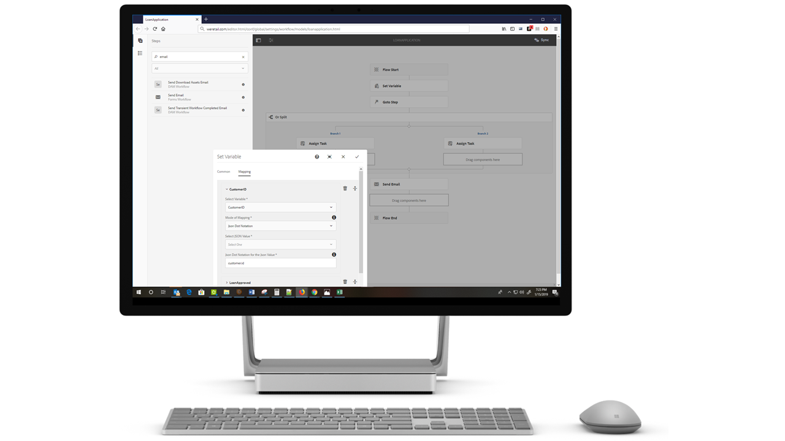

# Overzicht van nieuwe functies | AEM 6.5 Forms{#new-features-summary-aem-forms}

## Transactierapporten {#transaction-reports}

Met transactierapporten kunt u het aantal verzonden formulieren, verwerkte documenten en gerenderde documenten vastleggen en bijhouden. Het doel van het volgen van deze transacties is een geïnformeerde beslissing te nemen over het gebruik van producten en het opnieuw in evenwicht brengen van investeringen in hardware en software. Voorbeelden van transacties zijn:

* Verzending van een adaptief formulier, een HTML5-formulier of een formulierset
* Vertoning van een gedrukte versie of webversie van een interactieve communicatie
* Een document omzetten van de ene bestandsindeling naar de andere

Voor informatie over het vormen van en het gebruiken van transactierapporten, zie [Overzicht van Transactierapporten](../../forms/using/transaction-reports-overview.md).

## Interactieve communicatie {#interactive-communications}

**Patronen voor gegevensweergave definiëren**

Interactieve auteurs van communicatie kunnen nu [gegevenspatronen](create-interactive-communication.md#datadisplaypatterns) definiëren voor velden, variabelen en modelelementen van formuliergegevens. Bijvoorbeeld datum-, valuta- of telefoonnotaties.

**Nieuwe typen grafieken gebruiken**

U kunt [Kwadrant grafieken en grafieken met veelvoudige reeksen](../../forms/using/chart-component-interactive-communications.md) aan Interactieve Mededelingen nu toevoegen.

**Kolommen in een tabel sorteren**

U kunt kolommen van een lijst [sorteren ](../../forms/using/create-interactive-communication.md#sortcolumns) in de Interactieve Mededeling nu. U kunt tabelkolommen binden en sorteren met statische tekst of gegevensmodelobjecten.

**Nieuwe componenten in een webkanaal gebruiken**

U kunt nu knopcomponenten en scheidingscomponenten aan het webkanaal toevoegen. Zie [Knopcomponent toevoegen aan het webkanaal](../../forms/using/create-interactive-communication.md#add-button-component-to-the-web-channel) en [Scheidingscomponent in webkanaal](../../forms/using/create-interactive-communication.md#separatorcomponent) voor meer informatie.

**Lay-outmodus om het formaat van componenten te wijzigen**

U kunt nu op [Lay-outwijze ](../../forms/using/resize-using-layout-mode.md) schakelen resize componenten in het kanaal van het Web gebruikend een interface WYSIWYG.

**Verbeteringen in bruikbaarheid**

De interactieve auteurs van de Communicatie kunnen nu diverse makkelijk te gebruiken verrichtingen gebruiken terwijl het creëren van correspondentie. De lijst van concrete acties omvat:

* [Handelingen voor ongedaan maken uitvoeren in afdruk- en webkanalen](../../forms/using/create-interactive-communication.md#undoredoactions)
* [Variabelen in een documentfragment toevoegen met @-symbool](../../forms/using/texts-interactive-communications.md#searchvariables)
* [Gegevensmodelelementen toevoegen aan een documentfragment met @-symbool](../../forms/using/texts-interactive-communications.md#searchdatamodelproperties)
* [Een webkanaal verwijderen of toevoegen aan een bestaande interactieve communicatie](../../forms/using/create-interactive-communication.md#edit-interactive-communication-properties)
* [Gegevensbronelementen binden met velden en variabelen met behulp van handelingen voor slepen en neerzetten](../../forms/using/create-interactive-communication.md#binddatasourceelements)
* [Niet-gebonden velden en variabelen markeren tijdens het ontwerpen van interactieve communicatie](../../forms/using/create-interactive-communication.md#distinguishunboundfields)
* [Extra handelingen zoals kopiëren, groeperen of meer uitvoeren op overgeërfde componenten in een webkanaal](../../forms/using/create-interactive-communication.md#componenttoolbar)

**Verbeteringen in synchronisatieproces**

De webkanaallay-out die automatisch wordt gegenereerd met het kanaal Afdrukken is op verschillende manieren verbeterd.

## Adaptieve Forms {#adaptive-forms}

### Digitale handtekeningen op basis van Adobe Sign-cloud gebruiken in Adaptive Forms {#use-adobe-sign-s-cloud-based-digital-signatures-in-adaptive-forms}

[Digitale ](https://helpx.adobe.com/sign/kb/digital-certificate-providers.html) handtekeningen die zijn gebaseerd op cloud&#39;s of externe handtekeningen zijn een nieuwe generatie digitale handtekeningen die werken op verschillende computers, mobiele apparaten en het web. Ze voldoen aan de hoogste standaarden voor verificatie van ondertekenaars. U kunt nu [een adaptief formulier](../../forms/using/working-with-adobe-sign.md) ondertekenen met digitale handtekeningen op basis van de cloud.

#### Een adaptief formulier of interactieve communicatie insluiten in AEM Sites-toepassingen voor één pagina {#embed-an-adaptive-form-or-interactive-communcation-in-aem-sites-single-page-applications}

Met AEM Forms kunt u [naadloos een adaptief formulier](../../forms/using/embed-adaptive-form-aem-sites-spa.md) of interactieve communicatie insluiten in een AEM Sites-toepassing van één pagina (SPA). Het ingesloten adaptieve formulier en interactieve communicatie zijn volledig functioneel en gebruikers kunnen het formulier invullen en verzenden zonder de pagina te verlaten. Hiermee kan de gebruiker in de context van andere elementen op de webpagina blijven en tegelijkertijd communiceren met het adaptieve formulier of de interactieve communicatie.

#### Kolommen van Adaptief formulier sorteren {#sort-columns-of-adaptive-form-tables}

U kunt elke kolom van een Adaptieve tabel Formulier [in oplopende of aflopende volgorde sorteren. ](../../forms/using/adaptive-forms-tables.md#sortcolumnstable) U kunt sorteren toepassen op tabelkolommen met statische tekst, eigenschappen van gegevensmodelobjecten of een combinatie van eigenschappen van statische tekst en gegevensmodelobjecten.

#### De beschikbaarheid van adaptieve Forms-sjablonen beperken tot specifieke paden {#restrict-the-availability-of-adaptive-forms-templates-to-specific-paths}

Aangepaste formulieren hebben ondersteuning toegevoegd voor de eigenschap cq:allowedPaths. De eigenschap [beperkt de beschikbaarheid van adaptieve Forms-sjablonen tot specifieke paden](creating-adaptive-form.md#adaptive-form-templates).

#### Dynamisch {#add-check-boxes-to-the-adaptive-form-dynamically} selectievakjes toevoegen aan het adaptieve formulier

U kunt nu regels definiëren om [selectievakjes dynamisch aan het Aangepaste formulier toe te voegen](../../forms/using/rule-editor.md#setpropertyrule) op basis van een aangepaste functie, een formulierobject of een objecteigenschap.

## Workflows AEM {#aem-workflows}

### Variabelen gebruiken in AEM Workflows {#use-variables-in-aem-workflows}

Met variabelen kunnen workflowstappen metagegevens tijdens runtime bevatten en doorgeven. U kunt verschillende typen variabelen maken om verschillende typen gegevens op te slaan. Bijvoorbeeld gehele getallen, tekenreeksen, documenten of exemplaren van het formuliergegevensmodel. Typisch, gebruikt u een variabele of een inzameling van variabelen wanneer u een besluit moet nemen dat op de waarde wordt gebaseerd die het houdt of informatie opslaat die u later in een proces nodig hebt.

Variabelen zijn een uitbreiding van [MetaDataMap](https://helpx.adobe.com/experience-manager/6-5/sites/developing/using/reference-materials/javadoc/com/adobe/granite/workflow/metadata/MetaDataMap.html) interface beschikbaar in de vorige versie. Hiermee kunt u tijd besparen die is besteed aan het ontwikkelen van aangepaste ECMAScript-code die wordt gebruikt om metagegevenswaarden op te halen en bij te werken. U kunt de MetaDataMap-interface en ECMAScript-code blijven gebruiken om metagegevens te bewerken. Het gebruik van variabelen via MetaDataMap en ECMAScript biedt onder andere de volgende voordelen:

* Waarden die zijn opgeslagen in een variabele over de gehele workflow dynamisch opslaan, bijwerken en gebruiken zonder dat aangepaste code nodig is
* Waarden rechtstreeks ophalen en bijwerken naar een formuliergegevensmodel en gegevensbestand (XML/JSON) van een verzonden formulier
* Voltooide documenten in een variabele opslaan om de documentverwerking uit te voeren

De stap Ga naar OF Splitsen en alle AEM Forms-workflowstappen ondersteunen variabelen. Met de MetaDataMap-interface hebt u toegang tot variabelen in workflowstappen die geen native ondersteuning voor variabelen bevatten. Zie [Variabelen in AEM Workflows](../../forms/using/variable-in-aem-workflows.md) voor meer informatie.

#### Een workflow met verschillende Adaptieve Forms {#use-a-workflow-with-different-adaptive-forms} gebruiken

U kunt [een Adaptief formulier opgeven voor de taak ](../../forms/using/aem-forms-workflow-step-reference.md#assign-task-step) toewijzen en een document met de recordstap van formuliergerichte workflows in de runtime. Zo kan een workflow met verschillende Adaptieve Forms werken. U kunt de methode kiezen om een adaptief formulier te selecteren tijdens het ontwerpen van de workflow. Het adaptieve formulier kan zich bevinden op een absoluut pad, worden verzonden als een payload naar de workflow of beschikbaar zijn op een pad dat is berekend met een variabele.

#### Uitgebreide logboekmogelijkheden van formulieren-centric workflowstappen gebruiken {#use-enhanced-logging-capabilities-of-forms-centric-workflow-steps}

Logboekmogelijkheden van op formulieren gerichte workflowstappen zijn gestandaardiseerd. Nu produceren alle werkstroomstappen op basis van formulieren gestandaardiseerde logbestanden. De foutopsporingssnelheid wordt hierdoor verbeterd.

## Gegevensintegratie {#data-integration}

U kunt nu het volgende doen:

* [Valideer invoer ](../../forms/using/work-with-form-data-model.md#automated-validation-of-input-data) die is opgenomen in een lijst met beperkingen. Hiermee zorgt u ervoor dat alleen geldige gegevens naar de gegevensbron worden verzonden.
* [Overschrijf standaard die ](../../forms/using/configure-data-sources.md#configure-soap-web-services) eindpunt in een WSDL (de Taal van de Beschrijving van de Diensten van het Web) wordt bepaald dossier.

* [De ](../../forms/using/configure-data-sources.md#configure-restful-web-services) [standaardregeling, gastheer, en ](../../forms/using/configure-data-sources.md#configure-restful-web-services) basisweg met voeten treden die in het definitiedossier van de Tagger wordt bepaald.

## Platform- en beveiligingsupdates {#platform-and-security-updates}

### Belangrijke platformupdates {#major-platform-updates}

AEM Forms kan worden ingesteld met elke combinatie van ondersteunde besturingssystemen, toepassingsservers, databases, databasestuurprogramma&#39;s, JDK, LDAP-servers en e-mailservers. Hieronder vindt u de belangrijkste wijzigingen in [ondersteunde platforms](../../forms/using/aem-forms-jee-supported-platforms.md):

<table>
 <tbody>
  <tr>
   <td>Component</td>
   <td>Ondersteuning verwijderd</td>
  </tr>
  <tr>
   <td>Besturingssystemen</td>
   <td>
    <ul>
     <li>Microsoft Windows Server 2012 R2</li>
     <li>IBM AIX*</li>
     <li>Sun Solaris*</li>
    </ul> </td>
  </tr>
  <tr>
   <td>Toepassingsservers  </td>
   <td>
    <ul>
    <li>WebSphere Liberty-profiel</li>
    <li>Oracle WebLogic</li>
    </ul> </td>
  </tr>
  <tr>
   <td>Databases</td>
   <td>
    <ul>
     <li>IBM DB2   </li>
     <li>Oracle RAC</li>
    </ul> </td>
  </tr>
  <tr>
   <td>LDAP-servers</td>
   <td>
    <ul>
     <li>Microsoft Active Directory 2012</li>
     <li>Novell eDirectory 8.8.7 </li>
     <li>IBM Lotus Domino 8.5.0 </li>
    </ul> </td>
  </tr>
  <tr>
   <td>E-mailservers</td>
   <td>
    <ul>
     <li>IBM Lotus Domino 8.5.0 </li>
    </ul> </td>
  </tr>
  <tr>
   <td>Connectors</td>
   <td>
    <ul>
     <li>Connector voor Microsoft SharePoint 2013</li>
     <li>Connector voor EMC Documentum 7.0</li>
    </ul> </td>
  </tr>
  <tr>
   <td>AEM Forms-app  </td>
   <td>
    <ul>
     <li>Ondersteuning voor Windows 8.1</li>
    </ul> </td>
  </tr>
  <tr>
   <td>Java </td>
   <td>
    <ul>
     <li>Java 11</li>
    </ul> </td>
  </tr>
 </tbody>
</table>

* Neem contact op met de Adobe-ondersteuning voor informatie over het migreren naar een ander platform

#### Nieuwe op HTML5 gebaseerde UI&#39;s {#new-html-based-uis}

In overeenstemming met de geplande EOL van Adobe Flash Player en de algemene richting van het migreren van op Flash gebaseerde inhoud naar open normen, heeft AEM 6.5 Forms op Flash gebaseerde UI van Health Monitor, Process Management, Reader Extension en Categorie Management UI van AEM Forms op JEE Administration Console vervangen door op HTML5 gebaseerde UI.

#### Beveiligingsverbeteringen {#security-improvements}

* AEM 6.5 De gebruikersinterface van Forms op JEE-beheerconsole is nu gebaseerd op Apache Struts 2.5.
* AEM 6.5 Forms gebruikt nu jQuery naar 3.2.1 en jQuery UI 1.12.1. Zie [upgrade documentation](/help/forms/home.md) voor het effect van de wijziging.

#### Verbeteringen voor toegankelijkheid {#accessibility-improvements}

AEM 6.5 Forms heeft de toegankelijkheid van de AEM Forms Workspace verbeterd.
