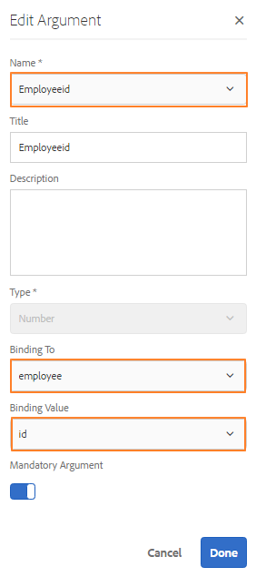

# Werken met formuliergegevensmodel{#work-with-form-data-model}


De formuliergegevensmodeleditor biedt een intuïtieve gebruikersinterface en hulpmiddelen voor het bewerken en configureren van een formuliergegevensmodel. Met behulp van de editor kunt u gegevensmodelobjecten, eigenschappen en services toevoegen en configureren vanuit gekoppelde gegevensbronnen in het formuliergegevensmodel. Daarnaast kunt u gegevensmodelobjecten en -eigenschappen maken zonder gegevensbronnen en deze later binden met de respectievelijke gegevensmodelobjecten en -eigenschappen. U kunt ook voorbeeldgegevens genereren en bewerken voor objecteigenschappen van gegevensmodellen die u kunt gebruiken om aangepaste formulieren en interactieve communicatie vooraf in te vullen tijdens het weergeven van een voorbeeld. U kunt gegevensmodelvoorwerpen en de diensten testen die in een model van vormgegevens worden gevormd om ervoor te zorgen het behoorlijk met gegevensbronnen wordt geïntegreerd.

Zie de volgende onderwerpen als u nog niet bekend bent met de Forms-gegevensintegratie en geen gegevensbron hebt geconfigureerd of een formuliergegevensmodel hebt gemaakt:

* [AEM Forms-gegevensintegratie](/help/forms/using/data-integration.md)
* [Gegevensbronnen configureren](/help/forms/using/configure-data-sources.md)
* [Formuliergegevensmodel maken](/help/forms/using/create-form-data-models.md)

Lees verder voor meer informatie over verschillende taken en configuraties die u kunt uitvoeren met de formuliergegevensmodeleditor.

>[!NOTE]
>
>U moet lid zijn van zowel **fdm-auteur** als **formulieren-gebruiker** groepen om formuliergegevensmodel te kunnen maken en ermee te kunnen werken. Neem contact op met de AEM beheerder om lid te worden van de groepen.

## Objecten en services voor gegevensmodellen toevoegen {#add-data-model-objects-and-services}

Als u een formuliergegevensmodel met gegevensbronnen hebt gemaakt, kunt u de formuliergegevensmodeleditor gebruiken om gegevensmodelobjecten en -services toe te voegen, de eigenschappen ervan te configureren, koppelingen tussen gegevensmodelobjecten te maken en het gegevensmodel en de services van het formulier te testen.

U kunt gegevensmodelvoorwerpen en de diensten van beschikbare gegevensbronnen in het model van vormgegevens toevoegen. Terwijl de toegevoegde voorwerpen van het gegevensmodel op het Modellusje verschijnen, verschijnen de toegevoegde diensten op het lusje van de Diensten.

Objecten en services voor gegevensmodellen toevoegen:

1. Meld u aan bij de AEM auteur, navigeer naar **[!UICONTROL Forms > Data Integrations]** en open het formuliergegevensmodel waarin u gegevensmodelobjecten wilt toevoegen.
1. In de ruit van Gegevensbronnen, breid gegevensbronnen uit om beschikbare voorwerpen en de diensten van het gegevensmodel te bekijken.
1. Selecteer gegevensmodelobjecten en -services die u wilt toevoegen aan het formuliergegevensmodel en tik op **[!UICONTROL Add Selected]**.

   

   Geselecteerde gegevensmodelobjecten en services

   Op het tabblad Model wordt een grafische weergave weergegeven van alle gegevensmodelobjecten en de bijbehorende eigenschappen die aan het formuliergegevensmodel zijn toegevoegd. Elk gegevensmodelobject wordt vertegenwoordigd door een vak in het formuliergegevensmodel.

   

   Tabblad Model geeft toegevoegde gegevensmodelobjecten weer

   >[!NOTE]
   >
   >U kunt gegevensmodelobjectvakken vastzetten en slepen om ze in het inhoudsgebied te ordenen. Alle gegevensmodelobjecten die in het formuliergegevensmodel worden toegevoegd, worden grijs weergegeven in het deelvenster Gegevensbronnen.

   Het tabblad Services bevat toegevoegde services.

   

   Op het tabblad Services worden services voor gegevensmodellen weergegeven

   >[!NOTE]
   >
   >Naast gegevensmodelvoorwerpen en de diensten, omvat het document van de de dienstmeta-gegevens OData navigatie eigenschappen die vereniging tussen twee voorwerpen van het gegevensmodel bepalen. Zie [Werken met navigatie-eigenschappen van OData-services](#navigation-properties-odata)voor meer informatie.

1. Tik **[!UICONTROL Save]** om het formuliermodelobject op te slaan.

   >[!NOTE]
   >
   >U kunt services die u hebt geconfigureerd op het tabblad Services van een formuliergegevensmodel, aanroepen met behulp van de adaptieve formulierregels. De gevormde diensten zijn beschikbaar in de Invoke de dienstenactie van de regelredacteur voor meer informatie over het gebruiken van deze diensten in adaptieve vormregels, zie de Diensten van de Invoke en Reeks Waarde van regels in [regelredacteur](/help/forms/using/rule-editor.md).

## Gegevensmodelobjecten en onderliggende eigenschappen maken {#create-data-model-objects-and-child-properties}

### Gegevensmodelobjecten maken {#create-data-model-objects}

Terwijl u gegevensmodelvoorwerpen van gevormde gegevensbronnen kunt toevoegen, kunt u voorwerpen of entiteiten van het gegevensmodel zonder gegevensbronnen ook tot stand brengen. Dit is vooral handig als u geen gegevensbronnen hebt geconfigureerd in het formuliergegevensmodel.

Een gegevensmodelobject maken zonder gegevensbronnen:

1. Meld u aan bij de AEM auteur, navigeer naar **[!UICONTROL Forms > Data Integrations]** en open het formuliergegevensmodel waarin u een gegevensmodelobject of -entiteit wilt maken.
1. Tik op **[!UICONTROL Create Entity]**.
1. Geef in het dialoogvenster Gegevensmodel maken een naam op voor het gegevensmodelobject en tik op **[!UICONTROL Add]**. Er wordt een gegevensmodelobject toegevoegd aan het formuliergegevensmodel. Het nieuwe gegevensmodelobject is niet gebonden aan een gegevensbron en heeft geen eigenschappen zoals in de volgende afbeelding wordt getoond.

   

Vervolgens kunt u onderliggende eigenschappen toevoegen aan niet-gebonden gegevensmodelobjecten.

### Onderliggende eigenschappen toevoegen {#child-properties}

Met de formuliergegevensmodeleditor kunt u onderliggende eigenschappen in een gegevensmodelobject maken. De eigenschap bij het maken is niet gebonden aan een eigenschap in een gegevensbron. U kunt de eigenschap child later binden met een andere eigenschap in het omvattende gegevensmodelobject.

Een onderliggende eigenschap maken:

1. Selecteer in een formuliergegevensmodel een gegevensmodelobject en tik op **[!UICONTROL Create Child Property]**.
1. Geef in het **[!UICONTROL Create Child Property]** dialoogvenster een naam en gegevenstype op voor de eigenschap in respectievelijk de velden **[!UICONTROL Name]** en **[!UICONTROL Type]** velden. U kunt desgewenst een titel en beschrijving voor de eigenschap opgeven.
1. Schakel Berekend in als de eigenschap een berekende eigenschap is. De waarde van een berekende eigenschap wordt berekend op basis van een regel of expressie. Zie Eigenschappen [](#edit-properties)bewerken voor meer informatie.
1. Als het gegevensmodelobject aan een gegevensbron is gebonden, wordt de toegevoegde onderliggende eigenschap automatisch gebonden aan de eigenschap van het bovenliggende gegevensmodelobject met dezelfde naam en hetzelfde gegevenstype.

   Tik op het bladerpictogram naast het **[!UICONTROL Bind Reference]** veld om een onderliggende eigenschap handmatig te binden met een objecteigenschap van het gegevensmodel. In het **[!UICONTROL Select Object]** dialoogvenster worden alle eigenschappen van het bovenliggende gegevensmodelobject weergegeven. Selecteer een eigenschap die u wilt binden en tik op het verdeelstreeppictogram. Merk op dat u slechts een bezit van het zelfde gegevenstype zoals het kindbezit kunt selecteren.

1. Tik **[!UICONTROL Done]** **[!UICONTROL Save]** om de onderliggende eigenschap op te slaan en tik om het formuliergegevensmodel op te slaan. De eigenschap child wordt nu toegevoegd aan het gegevensmodelobject.

Nadat u gegevensmodelobjecten en -eigenschappen hebt gemaakt, kunt u doorgaan met het maken van adaptieve formulieren en interactieve communicatie op basis van het formuliergegevensmodel. Als u later gegevensbronnen beschikbaar en geconfigureerd hebt, kunt u het gegevensmodel van het formulier binden met gegevensbronnen. De binding wordt automatisch bijgewerkt in de bijbehorende adaptieve formulieren en interactieve communicatie. Zie Formuliergegevensmodel [gebruiken voor meer informatie over het maken van adaptieve formulieren en interactieve communicatie met behulp van het](/help/forms/using/using-form-data-model.md)formuliergegevensmodel.

### Objecten en eigenschappen van gegevensmodellen binden {#bind-data-model-objects-and-properties}

Wanneer de gegevensbronnen die u wilt integreren met het formuliergegevensmodel beschikbaar zijn, kunt u deze toevoegen aan het formuliergegevensmodel zoals beschreven in Gegevensbronnen [](/help/forms/using/create-form-data-models.md#update)bijwerken. Voer vervolgens de volgende handelingen uit om de niet-gebonden gegevensmodelobjecten en -eigenschappen te binden:

1. Selecteer in het formuliergegevensmodel de niet-gebonden gegevensbron die u met een gegevensbron wilt binden.
1. Tik op **[!UICONTROL Edit Properties]**.
1. Tik in het **[!UICONTROL Edit Properties]** deelvenster op het bladerpictogram naast het **[!UICONTROL Binding]** veld. Hiermee wordt het **[!UICONTROL Select Object]** dialoogvenster geopend met gegevensbronnen die in het formuliergegevensmodel zijn toegevoegd.

   

1. Vouw de gegevensbronstructuur uit en selecteer een gegevensmodelobject om mee te binden en tik op het verdeelstreeppictogram.
1. Tik **[!UICONTROL Done]** **[!UICONTROL Save]** om de eigenschappen op te slaan en tik vervolgens om het formuliergegevensmodel op te slaan. Het gegevensmodelobject is nu gebonden aan een gegevensbron. Het gegevensmodelobject is niet meer gemarkeerd als Niet geconsolideerd.

   

## Services configureren {#configure-services}

Om gegevens voor een voorwerp van het gegevensmodel te lezen en te schrijven, doe het volgende om gelezen te vormen en de diensten te schrijven:

1. Schakel het selectievakje boven aan een gegevensmodelobject in om het te selecteren en te tikken **[!UICONTROL Edit Properties]**.

   

   Eigenschappen bewerken om lees- en schrijfservices voor een gegevensmodelobject te configureren

   Het dialoogvenster Eigenschappen bewerken wordt geopend.

   

   Eigenschappen bewerken, dialoogvenster

   >[!NOTE]
   >
   >Naast gegevensmodelvoorwerpen en de diensten, omvat het document van de de dienstmeta-gegevens OData navigatie eigenschappen die vereniging tussen twee voorwerpen van het gegevensmodel bepalen. Wanneer u een de dienstgegevensbron van OData aan een Model van de Gegevens van de Vorm toevoegt, is er de dienst beschikbaar in het Model van de Gegevens van de Vorm voor alle navigatie eigenschappen in een voorwerp van het gegevensmodel. U kunt deze service gebruiken om de navigatie-eigenschappen van het overeenkomende gegevensmodelobject te lezen.
   >
   >
   >Zie [Werken met navigatie-eigenschappen van OData-services](#navigation-properties-odata)voor meer informatie over het gebruik van de service.

1. Schakel deze optie in **[!UICONTROL Top Level Object]** om op te geven of het gegevensmodelobject een modelobject op het hoogste niveau is.

   Gegevensmodelobjecten die zijn geconfigureerd in een formuliergegevensmodel, zijn beschikbaar voor gebruik op het tabblad Gegevensmodelobjecten in de inhoudbrowser van een adaptief formulier op basis van het formuliergegevensmodel. Wanneer u een koppeling toevoegt tussen twee gegevensmodelobjecten, wordt het gegevensmodelobject dat u koppelt, genest onder het gegevensmodelobject dat u koppelt op het tabblad Gegevensmodelobjecten. Als het geneste gegevensmodel een object op hoofdniveau is, wordt het ook afzonderlijk weergegeven op het tabblad Objecten gegevensmodel. Daarom ziet u twee items ervan, een binnen en een buiten de geneste hiërarchie, die verwarring kunnen veroorzaken bij auteurs van formulieren. Als u het gekoppelde gegevensmodelobject alleen in de geneste hiërarchie wilt weergeven, schakelt u de eigenschap Object op hoogste niveau uit.

1. Selecteer de Lezen en schrijven diensten voor de geselecteerde voorwerpen van het gegevensmodel. De argumenten voor de services worden weergegeven.

   

   Lees en schrijf de diensten die voor werknemersgegevensbron worden gevormd

1. Tik  voor het read de dienstargument om het argument aan een Attribuut van het Profiel van de Gebruiker, een Attribuut van het Verzoek, of Letterlijke waarde [te](#bindargument) binden en de bindende waarde te specificeren.
1. Tik **[!UICONTROL Done]** om het argument op te slaan, **[!UICONTROL Done]** de eigenschappen op te slaan en vervolgens het gegevensmodel van het formulier op **[!UICONTROL Save]** te slaan.

### Serviceargumenten voor lezen binden {#bindargument}

Bind Gelezen de dienstargument aan een Attribuut van het Profiel van de Gebruiker, een Attribuut van het Verzoek, of Letterlijke waarde die op een bindende waarde wordt gebaseerd. De waarde wordt overgegaan tot de dienst als argument om details te halen verbonden aan de gespecificeerde waarde uit de gegevensbron.

#### Letterlijke waarde {#literal-value}

Selecteer **[!UICONTROL Literal]** in de **[!UICONTROL Binding To]** vervolgkeuzelijst de optie en voer een waarde in het **[!UICONTROL Binding Value]** veld in. De details die aan de waarde zijn gekoppeld, worden opgehaald uit de gegevensbron. Gebruik deze optie om details terug te winnen verbonden aan een statische waarde.

In dit voorbeeld, worden de details verbonden aan **4367655678**, als waarde voor het `mobilenum` argument, teruggewonnen uit de gegevensbron. De bijbehorende details als u de waarde voor een mobiel aantalargument overgaat kunnen eigenschappen zoals klantennaam, klantenadres, en stad omvatten.


#### Kenmerk gebruikersprofiel {#user-profile-attribute}

Selecteer **[!UICONTROL User Profile Attribute]** in de **[!UICONTROL Binding To]** vervolgkeuzelijst de naam van het kenmerk in het **[!UICONTROL Binding Value]** veld. De details van de gebruiker die aan de AEM instantie het programma wordt geopend worden teruggewonnen uit de gegevensbron die op de attributennaam wordt gebaseerd.

De kenmerknaam die in het **[!UICONTROL Binding Value]** veld wordt opgegeven, moet het volledige bindingspad bevatten tot de kenmerknaam voor de gebruiker. Open de volgende URL om tot de gebruikersdetails op CRXDE toegang te hebben:

`https://[server-name]:[port]/crx/de/index.jsp#/home/users/`


In dit voorbeeld geeft u `profile.empid` de gebruiker op in het **[!UICONTROL Binding Value]** `grios` veld.


Het `id` argument neemt de waarde van de `empid` attributen van het gebruikersprofiel en gaat het als argument tot de Gelezen dienst over. Het leest en keert waarden van bijbehorende eigenschappen van het voorwerp van het werknemersgegevensmodel voor de `empid` verbonden aan de het programma geopende gebruiker terug.

#### Aanvraagkenmerk {#request-attribute}

Gebruik het verzoekattribuut om de bijbehorende eigenschappen van de gegevensbron terug te winnen.

1. Selecteer **[!UICONTROL Request Attribute]** in de **[!UICONTROL Binding To]** vervolgkeuzelijst de naam van het kenmerk in het **[!UICONTROL Binding Value]** veld.

1. Maak een [bedekking](../../../help/sites-developing/overlays.md) voor head.jsp. Als u de bedekking wilt maken, opent u CRX DE en kopieert u het `https://<server-name>:<port number>/crx/de/index.jsp#/libs/fd/af/components/page2/afStaticTemplatePage/head.jsp` bestand naar `https://<server-name>:<port number>/crx/de/index.jsp#/apps/fd/af/components/page2/afStaticTemplatePage/head.jsp`

   >[!NOTE]
   >
   > * Als u een statische sjabloon gebruikt, bedekt u head.jsp bij:
      >   `/libs/fd/af/components/page2/afStaticTemplatePage/head.jsp`
   > * Als u een bewerkbare sjabloon gebruikt, bedekt u de aftemplatedpage.jsp op:
      >   `/libs/fd/af/components/page2/aftemplatedpage/aftemplatedpage.jsp`


1. Set [!DNL paramMap] for the request attribute. Neem bijvoorbeeld de volgende code op in het .jsp-bestand in de map apps:

   ```javascript
   <%Map paraMap = new HashMap();
    paraMap.put("<request_attribute>",request.getParameter("<request_attribute>"));
    request.setAttribute("paramMap",paraMap);
   ```

   Gebruik bijvoorbeeld de onderstaande code om de waarde van petid op te halen uit de gegevensbron:


   ```javascript
   <%Map paraMap = new HashMap();
   paraMap.put("petId",request.getParameter("petId"));
   request.setAttribute("paramMap",paraMap);%>
   ```

De details worden teruggewonnen uit de gegevensbron die op de attributennaam wordt gebaseerd in het verzoek wordt gespecificeerd.

Als u bijvoorbeeld kenmerk opgeeft zoals `petid=100` in de aanvraag, worden eigenschappen die aan de kenmerkwaarde zijn gekoppeld, opgehaald uit de gegevensbron.

## Koppelingen toevoegen {#add-associations}

Er zijn doorgaans koppelingen tussen gegevensmodelobjecten in een gegevensbron. De koppeling kan een-op-een of een-op-een zijn. Bijvoorbeeld, kunnen er veelvoudige gebiedsdelen verbonden aan een werknemer zijn. Het wordt bedoeld als één-aan-vele vereniging en door `1:n` op de lijn getoond verbindend bijbehorende voorwerpen van het gegevensmodel. Nochtans, als een vereniging een unieke werknemersnaam voor een bepaalde werknemersidentiteitskaart terugkeert, wordt het bedoeld als één-op-één vereniging.

Wanneer u gekoppelde gegevensmodelobjecten in een gegevensbron toevoegt aan een formuliergegevensmodel, blijven de koppelingen behouden en worden ze weergegeven als verbonden door pijllijnen. In een formuliergegevensmodel kunt u koppelingen toevoegen tussen gegevensmodelobjecten in verschillende gegevensbronnen.

>[!NOTE]
>
>Vooraf gedefinieerde koppelingen in een JDBC-gegevensbron blijven niet behouden in het formuliergegevensmodel. U moet ze handmatig maken.

Een koppeling toevoegen:

1. Schakel het selectievakje boven aan een gegevensmodelobject in om het te selecteren en te tikken **[!UICONTROL Add Association]**. Het dialoogvenster Koppeling toevoegen wordt geopend.

   

   >[!NOTE]
   >
   >Naast gegevensmodelvoorwerpen en de diensten, omvat het document van de de dienstmeta-gegevens OData navigatie eigenschappen die vereniging tussen twee voorwerpen van het gegevensmodel bepalen. U kunt deze navigatie-eigenschappen gebruiken wanneer u koppelingen toevoegt aan het formuliergegevensmodel. Zie [Werken met navigatie-eigenschappen van OData-services](#navigation-properties-odata)voor meer informatie.

   Het dialoogvenster Koppeling toevoegen wordt geopend.

   

   Dialoogvenster Koppeling toevoegen

1. In de Add ruit van de Vereniging:

   * Geef een titel op voor de koppeling.
   * Selecteer het associatietype — Een-op-een of een-op-een.
   * Selecteer het gegevensmodelobject dat u wilt koppelen.
   * Selecteer de leesservice om gegevens van het geselecteerde modelobject te lezen. Het argument van de leesservice wordt weergegeven. Bewerk het argument om het indien nodig te wijzigen en koppel het aan de eigenschap van het gegevensmodelobject dat u wilt koppelen.

   In het volgende voorbeeld is het standaardargument voor de leesservice van het gegevensmodelobject Afhankelijkheden `dependentid`.

   

   Het standaardargument voor de dienst van het lezen van Afhankelijkheden is afhankelijk

   Het argument moet echter een algemene eigenschap zijn tussen het gekoppelde gegevensmodelobject, wat in dit voorbeeld `Employeeid`is. Daarom moet het `Employeeid` argument aan het `id` bezit van het de gegevensmodelvoorwerp van de Werknemer worden gebonden om de bijbehorende gebiedsdeeldetails van het het gegevensmodelvoorwerp van Afhankelijkheden te halen.

   

   Bijgewerkt argument en binding

   Tik **[!UICONTROL Done]** om het argument op te slaan.

1. Tik **[!UICONTROL Done]** om de koppeling op te slaan en het formuliergegevensmodel op **[!UICONTROL Save]** te slaan.
1. Herhaal de stappen om desgewenst meer koppelingen te maken.

>[!NOTE]
>
>De toegevoegde koppeling wordt in het vak met gegevensmodelobjecten weergegeven met de opgegeven titel en een regel die de bijbehorende gegevensmodelobjecten verbindt.
>
>U kunt een koppeling bewerken door het desbetreffende selectievakje in te schakelen en op de koppeling te tikken **[!UICONTROL Edit Association]**.


## Eigenschappen bewerken {#properties}

U kunt eigenschappen van gegevensmodelobjecten bewerken, de eigenschappen ervan en de services die zijn toegevoegd aan het formuliergegevensmodel.

Eigenschappen bewerken:

1. Schakel het selectievakje in naast een gegevensmodelobject, een eigenschap of een service in het formuliergegevensmodel.
1. Tik op **[!UICONTROL Edit Properties]**. Het **[!UICONTROL Edit Properties]** deelvenster voor het geselecteerde modelobject, de geselecteerde eigenschap of service wordt geopend.

   * **Gegevensmodelobject**: Geef de lees- en schrijfservices op en bewerk argumenten.
   * **Eigenschap**: Geef het type, subtype en de indeling voor de eigenschap op. U kunt ook opgeven of de geselecteerde eigenschap de primaire sleutel voor het gegevensmodelobject is.
   * **Service**: Geef het invoermodelobject, het uitvoertype en de argumenten voor de service op. Voor de Get dienst, kunt u specificeren als het wordt verwacht om een serie terug te keren.

   

   Dialoogvenster Eigenschappen bewerken voor een get-service

1. Tik **[!UICONTROL Done]** om eigenschappen op te slaan en het formuliergegevensmodel op **[!UICONTROL Save]** te slaan.

### Berekende eigenschappen maken {#computed}

Een berekende eigenschap is de eigenschap waarvan de waarde wordt berekend op basis van een regel of expressie. Met behulp van een regel kunt u de waarde van een berekende eigenschap instellen op een letterlijke tekenreeks, een getal, het resultaat van een wiskundige expressie of de waarde van een andere eigenschap in het formuliergegevensmodel.

U kunt bijvoorbeeld een berekende eigenschap **FullName** maken waarvan de waarde het resultaat is van een samenvoeging van de bestaande eigenschappen **FirstName** en **LastName** . Daartoe:

1. Maak een nieuwe eigenschap met de naam `FullName` waarvan het gegevenstype String is.
1. Schakel deze optie in **[!UICONTROL Computed]** en tik **[!UICONTROL Done]** om de eigenschap te maken.

   

   De berekende eigenschap FullName wordt gemaakt. Let op het pictogram naast de eigenschap om een berekende eigenschap weer te geven.

   

1. Selecteer de eigenschap FullName en tik op **[!UICONTROL Edit Rule]**. Er wordt een regeleditorvenster geopend.
1. Tik in het venster van de regeleditor op **[!UICONTROL Create]**. Er wordt een **[!UICONTROL Set Value]** regelvenster geopend.

   Selecteer in de vervolgkeuzelijst Optie selecteren **[!UICONTROL Mathematical Expression]**. Andere beschikbare opties zijn **[!UICONTROL Form Data Model Object]** en **[!UICONTROL String]**.

1. Selecteer in de wiskundige expressie respectievelijk de eerste **[!UICONTROL FirstName]** en **[!UICONTROL LastName]** de tweede objecten. Selecteren **[!UICONTROL plus]** als operator.

   Tik **[!UICONTROL Done]** en tik vervolgens **[!UICONTROL Close]** om het venster van de regeleditor te sluiten. De regel ziet er ongeveer als volgt uit.

   

1. Tik op het formuliergegevensmodel **[!UICONTROL Save]**. Het gegevens verwerkte bezit wordt gevormd.

## Werken met navigatie-eigenschappen van OData-diensten {#work-with-navigation-properties-of-odata-services}

In de diensten van OData, navigatie worden de eigenschappen gebruikt om verenigingen tussen twee voorwerpen van het gegevensmodel te bepalen. Deze eigenschappen worden gedefinieerd op een entiteitstype of een complex type. In het volgende voorbeeld uit het metagegevensbestand van de voorbeeldvoorbeeldservices [TripPin](https://www.odata.org/blog/trippin-new-odata-v4-sample-service/) OData bevat de personenentiteit bijvoorbeeld drie navigatie-eigenschappen: Vrienden, BestFriend en Trips.

Raadpleeg de [OData-documentatie](https://docs.oasis-open.org/odata/odata/v4.0/errata03/os/complete/part3-csdl/odata-v4.0-errata03-os-part3-csdl-complete.html#_Toc453752536)voor meer informatie over navigatie-eigenschappen.

```xml
<edmx:Edmx xmlns:edmx="https://docs.oasis-open.org/odata/ns/edmx" Version="4.0">
<script/>
<edmx:DataServices>
<Schema xmlns="https://docs.oasis-open.org/odata/ns/edm" Namespace="Microsoft.OData.Service.Sample.TrippinInMemory.Models">
<EntityType Name="Person">
<Key>
<PropertyRef Name="UserName"/>
</Key>
<Property Name="UserName" Type="Edm.String" Nullable="false"/>
<Property Name="FirstName" Type="Edm.String" Nullable="false"/>
<Property Name="LastName" Type="Edm.String"/>
<Property Name="MiddleName" Type="Edm.String"/>
<Property Name="Gender" Type="Microsoft.OData.Service.Sample.TrippinInMemory.Models.PersonGender" Nullable="false"/>
<Property Name="Age" Type="Edm.Int64"/>
<Property Name="Emails" Type="Collection(Edm.String)"/>
<Property Name="AddressInfo" Type="Collection(Microsoft.OData.Service.Sample.TrippinInMemory.Models.Location)"/>
<Property Name="HomeAddress" Type="Microsoft.OData.Service.Sample.TrippinInMemory.Models.Location"/>
<Property Name="FavoriteFeature" Type="Microsoft.OData.Service.Sample.TrippinInMemory.Models.Feature" Nullable="false"/>
<Property Name="Features" Type="Collection(Microsoft.OData.Service.Sample.TrippinInMemory.Models.Feature)" Nullable="false"/>
<NavigationProperty Name="Friends" Type="Collection(Microsoft.OData.Service.Sample.TrippinInMemory.Models.Person)"/>
<NavigationProperty Name="BestFriend" Type="Microsoft.OData.Service.Sample.TrippinInMemory.Models.Person"/>
<NavigationProperty Name="Trips" Type="Collection(Microsoft.OData.Service.Sample.TrippinInMemory.Models.Trip)"/>
</EntityType>
```

Wanneer u een OData-service in een formuliergegevensmodel configureert, worden alle navigatie-eigenschappen in een entiteitcontainer beschikbaar gesteld via een service in het formuliergegevensmodel. In dit voorbeeld van de TripPin OData-service kunnen de drie navigatie-eigenschappen in de `Person` entiteitcontainer worden gelezen met behulp van één `GET LINK` service in het formuliergegevensmodel.

Hieronder wordt de `GET LINK of Person /People` service in het formuliergegevensmodel gemarkeerd. Dit is een gecombineerde service voor de drie navigatie-eigenschappen in de `Person` entiteit TripPin OData-service.


Zodra u de `GET LINK` dienst aan het lusje van de Diensten in het Model van de Gegevens van de Vorm toevoegt, kunt u de eigenschappen uitgeven om het voorwerp van het outputmodel en het navigatie bezit te kiezen in de dienst te gebruiken. De volgende `GET LINK of Person /People` service in het volgende voorbeeld gebruikt bijvoorbeeld Trip als het uitvoermodelobject en de navigatie-eigenschap als Trips.


>[!NOTE]
>
>Welke waarden beschikbaar zijn in het veld **Standaardwaarde** van het argument **NavigationPropertyName** is afhankelijk van de status van de array **Return?** schakelknop. Als deze optie is ingeschakeld, worden navigatie-eigenschappen van het type Verzameling weergegeven.

In dit voorbeeld kunt u het uitvoermodelobject ook kiezen als argument voor persoon- en navigatie-eigenschappen als Vrienden of BestFriend (afhankelijk van of de array **Return wordt weergegeven?** is in- of uitgeschakeld).


Op dezelfde manier kunt u een `GET LINK` dienst kiezen en zijn navigatie-eigenschappen vormen wanneer het toevoegen van verenigingen in het Model van de Gegevens van de Vorm. Als u echter een navigatie-eigenschap wilt kunnen selecteren, moet u ervoor zorgen dat de eigenschap **[!UICONTROL Binding To field]** is ingesteld op **Letterlijk**.


## Voorbeeldgegevens genereren en bewerken {#sample}

Met de formuliergegevensmodeleditor kunt u voorbeeldgegevens genereren voor alle eigenschappen van gegevensmodelobjecten, inclusief berekende eigenschappen, in een formuliergegevensmodel. Het is een reeks willekeurige waarden die met het gegevenstype voldoen dat voor elk bezit wordt gevormd. U kunt ook gegevens bewerken en opslaan. Deze blijven behouden, zelfs als u de voorbeeldgegevens opnieuw genereert.

Ga als volgt te werk om voorbeeldgegevens te genereren en te bewerken:

1. Open een formuliergegevensmodel en tik op **[!UICONTROL Edit Sample Data]**. De voorbeeldgegevens worden gegenereerd en weergegeven in het venster Voorbeeldgegevens bewerken.

   

1. Bewerk in **[!UICONTROL Edit Sample Data]** het venster de vereiste gegevens en tik op **[!UICONTROL Save]**.

Vervolgens kunt u de voorbeeldgegevens gebruiken om interactieve communicatie vooraf in te vullen en te testen op basis van het gegevensmodel van het formulier. Zie Formuliergegevensmodel [](/help/forms/using/using-form-data-model.md)gebruiken voor meer informatie.

## Objecten en services van gegevensmodellen testen {#test-data-model-objects-and-services}

Uw formuliergegevensmodel is geconfigureerd, maar voordat u het in gebruik neemt, wilt u wellicht testen of de geconfigureerde gegevensmodelobjecten en -services naar behoren werken. Objecten en services van gegevensmodellen testen:

1. Selecteer een gegevensmodelobject of een service in het formuliergegevensmodel en tik respectievelijk **[!UICONTROL Test Model Object]** of **[!UICONTROL Test Service]**.

   Het venster Formuliergegevensmodel testen wordt geopend.

   

1. Selecteer in het venster Testformuliergegevensmodel het gegevensmodelobject of de gegevensservice die u wilt testen in het deelvenster Invoer.

1. Geef een argumentwaarde op in de testcode en tik op **[!UICONTROL Test]**. Een geslaagde test retourneert de uitvoer in het deelvenster Uitvoer.

   

U kunt ook andere gegevensmodelobjecten en -services testen in het formuliergegevensmodel.

## Geautomatiseerde validatie van invoergegevens {#automated-validation-of-input-data}

Het formuliergegevensmodel valideert de gegevens die zijn ontvangen als invoer terwijl de DermisBridge-API wordt aangeroepen (op basis van validatiecriteria die beschikbaar zijn in het formuliergegevensmodel). De validatie is gebaseerd op de `ValidationOptions` markering die is ingesteld in het queryobject dat wordt gebruikt om de API aan te roepen.

De markering kan op om het even welke volgende waarden worden geplaatst:

* **VOLLEDIG**: FDM voert de validatie uit op basis van alle beperkingen
* **UIT**: Geen validatie
* **BASIS**: FDM voert de validatie uit op basis van de beperkingen &quot;required&quot; en &quot;nullable&quot;

Als geen waarde voor de `ValidationOptions`vlag wordt geplaatst, wordt de **BASISbevestiging** uitgevoerd op de inputgegevens.

Hieronder ziet u een voorbeeld van het instellen van de validatiemarkering op **VOLLEDIG**:

```java
operationOptions.setValidationOptions(ValidationOptions.FULL);
```

>[!NOTE]
>
>De waarde die u opgeeft voor een kenmerk in de invoergegevens, moet overeenkomen met het gegevenstype dat is gedefinieerd voor het kenmerk in het metagegevensdocument.\
>Als de waarde niet overeenkomt met het gegevenstype dat voor het kenmerk is gedefinieerd, wordt een uitzondering weergegeven in de DermisBridge-API, ongeacht de waarde van de `ValidationOptions` markering. Als het logboekniveau aan Debug wordt geplaatst, wordt een fout geregistreerd aan het **error.log** - dossier.

Het formuliergegevensmodel valideert invoergegevens op basis van een lijst met beperkingen voor gegevenstypen. De lijst met beperkingen voor invoergegevens kan variëren op basis van de gegevensbron.

In de volgende tabel worden de beperkingen voor invoergegevens weergegeven die zijn gebaseerd op de gegevensbron:

<table>
 <tbody> 
  <tr> 
   <td>Restricties</td> 
   <td>Beschrijving</td> 
   <td>Invoergegevensbron</td> 
  </tr> 
  <tr> 
   <td>required</td> 
   <td>Indien waar (true), moet de parameter in de invoergegevens worden opgenomen.</td> 
   <td>Swagger, WSDL en database</td> 
  </tr> 
  <tr> 
   <td>nullable</td> 
   <td>Indien true, kan de waarde voor de parameter op Null worden ingesteld in de invoergegevens.</td> 
   <td>WSDL, Odata en database</td> 
  </tr> 
  <tr> 
   <td>maximum</td> 
   <td>Geeft de bovengrens voor numerieke waarden aan. De maximumwaarde die als bovengrens wordt opgegeven, kan ook worden toegewezen aan de parameter in de invoergegevens.</td> 
   <td>WSDL</td> 
  </tr> 
  <tr> 
   <td>minimum</td> 
   <td>Hiermee geeft u de ondergrens voor numerieke waarden op. De minimumwaarde die als ondergrens wordt opgegeven, kan ook worden toegewezen aan de parameter in de invoergegevens.</td> 
   <td>WSDL</td> 
  </tr> 
  <tr> 
   <td>ExclusiveMaximum</td> 
   <td>Geeft de bovengrens voor numerieke waarden aan. De maximumwaarde die als bovengrens wordt opgegeven, mag niet worden toegewezen aan de parameter in de invoergegevens.</td> 
   <td>WSDL</td> 
  </tr> 
  <tr> 
   <td>alleenstaandeMinimum</td> 
   <td>Hiermee geeft u de ondergrens voor numerieke waarden op. De minimumwaarde die als ondergrens wordt opgegeven, mag niet worden toegewezen aan de parameter in de invoergegevens.</td> 
   <td>WSDL</td> 
  </tr> 
  <tr> 
   <td>minLength</td> 
   <td>Geeft de ondergrens op voor het aantal tekens dat in een tekenreeks wordt opgenomen. De minimumwaarde die als ondergrens wordt opgegeven, kan ook worden toegewezen aan de parameter in de invoergegevens.</td> 
   <td>WSDL</td> 
  </tr> 
  <tr> 
   <td>maxLength</td> 
   <td>Geeft de bovengrens op voor het aantal tekens dat in een tekenreeks wordt opgenomen. De maximumwaarde die als bovengrens wordt opgegeven, kan ook worden toegewezen aan de parameter in de invoergegevens.</td> 
   <td>Swagger, WSDL, Odata en database</td> 
  </tr> 
  <tr> 
   <td>pattern</td> 
   <td>Geeft een vaste reeks tekens aan. De invoertekenreeks wordt alleen gevalideerd als de tekens voldoen aan het opgegeven patroon.</td> 
   <td>Swagger</td> 
  </tr> 
  <tr> 
   <td>minItems</td> 
   <td>Geeft het minimale aantal items in een array op. De minimumwaarde die als ondergrens wordt opgegeven, kan ook worden toegewezen aan de parameter in de invoergegevens.</td> 
   <td>WSDL</td> 
  </tr> 
  <tr> 
   <td>maxItems</td> 
   <td>Geeft het maximale aantal items in een array op. De maximumwaarde die als bovengrens wordt opgegeven, kan ook worden toegewezen aan de parameter in de invoergegevens.</td> 
   <td>WSDL</td> 
  </tr> 
  <tr> 
   <td>uniqueItems</td> 
   <td>Indien waar (true), moeten alle elementen van de array uniek zijn in de invoergegevens.</td> 
   <td>Swagger</td> 
  </tr> 
  <tr> 
   <td>enum (tekenreeks)<br /> <br /> </td> 
   <td>Beperkt de waarde van een parameter in de invoergegevens tot een vaste set tekenreekswaarden. Het moet een array zijn met ten minste één element, waarbij elk element uniek is.</td> 
   <td>WSDL en Odata</td> 
  </tr> 
  <tr> 
   <td>enum (getal)<br /> <br /> </td> 
   <td>Hiermee wordt de waarde van een parameter in de invoergegevens beperkt tot een vaste set numerieke waarden. Het moet een array zijn met ten minste één element, waarbij elk element uniek is.</td> 
   <td>WSDL</td> 
  </tr> 
 </tbody> 
</table>

In dit voorbeeld worden de invoergegevens gevalideerd op basis van maximum-, minimum- en vereiste beperkingen die zijn gedefinieerd in het Swagger-bestand. De invoergegevens voldoen alleen aan de validatiecriteria als Order-id aanwezig is en de waarde tussen 1 en 10 ligt.

```json
   parameters: [
   {
   name: "orderId",
   in: "path",
   description: "ID of pet that needs to be fetched",
   required: true,
   type: "integer",
   maximum: 10,
   minimum: 1,
   format: "int64"
   }
   ]
```

Er wordt een uitzondering weergegeven als de invoergegevens niet voldoen aan de validatiecriteria. Als het logboekniveau aan **Debug** wordt geplaatst, wordt een fout geregistreerd aan het **error.log** - dossier. Bijvoorbeeld,

```verilog
21.01.2019 17:26:37.411 *ERROR* com.adobe.aem.dermis.core.validation.JsonSchemaValidator {"errorCode":"AEM-FDM-001-044","errorMessage":"Input validations failed during operation execution.","violations":{"/orderId":["numeric instance is greater than the required maximum (maximum: 10, found: 16)"]}}
```

## Volgende stappen {#next-steps}

U hebt een werkformuliergegevensmodel dat nu klaar is voor gebruik in adaptieve formulieren en interactieve communicatieworkflows. Zie Formuliergegevensmodel [](/help/forms/using/using-form-data-model.md)gebruiken voor meer informatie.
