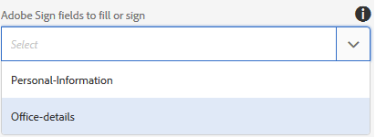

# Adobe Sign in een adaptief formulier gebruiken{#using-adobe-sign-in-an-adaptive-form}

Met Adobe Sign kunnen workflows voor e-handtekeningen worden gebruikt voor adaptieve formulieren. E-handtekeningen verbeteren werkstromen om documenten voor wettig, verkoop, loonlijst, personeelsbeheer, en meer gebieden te verwerken.

In een standaard Adobe-scenario voor ondertekenen en aanpassen van formulieren vult een gebruiker een adaptief formulier in om een aanvraag voor een service in te dienen. Een hypotheek- en creditcardaanvraag vereist bijvoorbeeld wettelijke handtekeningen van alle kredietnemers en medekredietnemers. Als u workflows voor elektronische handtekeningen wilt inschakelen voor vergelijkbare scenario&#39;s, kunt u Adobe Sign with AEM Forms integreren. Een paar voorbeelden hiervan zijn:

* Sluit overeenkomsten van om het even welk apparaat met volledig geautomatiseerde voorstel, citaat, en contractprocessen.
* Voltooi processen voor menselijke hulpbronnen sneller en geef uw werknemers de digitale ervaring.
* Verkort de duur van de contractcyclus en neem sneller aan boord van uw leveranciers.
* Maak digitale workflows waarmee algemene processen worden geautomatiseerd.

De integratie van Adobe Sign met AEM Forms ondersteunt:

* Workflows voor ondertekening van enkelvoudige en meervoudige gebruikers
* Workflows voor opeenvolgende en gelijktijdige ondertekening
* In-form en out-of-form ondertekeningservaringen
* Formulieren ondertekenen als anonieme of aangemelde gebruiker
* Dynamische ondertekeningsprocessen (integratie met AEM Forms-workflow)
* Verificatie via een kennisbasis, telefoon en sociale profielen

## Vereisten {#prerequisites}

Voordat u Adobe Sign in een adaptief formulier gebruikt:

* Zorg ervoor dat de cloudservice AEM Forms is geconfigureerd voor gebruik van Adobe Sign. Zie [Adobe Sign with AEM Forms](../../forms/using/adobe-sign-integration-adaptive-forms.md)integreren voor meer informatie.
* Behoud de lijst met ondertekenaars klaar. U hebt voor elke ondertekenaar ten minste een e-mailadres nodig.

## Adobe-ondertekening voor een adaptief formulier configureren {#configure-adobe-sign-for-an-adaptive-form}

Voer de volgende stappen uit om Adobe Sign for an adaptive form te configureren:

1. [Aangepaste formuliereigenschappen bewerken voor Adobe-ondertekening](../../forms/using/working-with-adobe-sign.md#enableadobesign)
1. [Adobe-handtekeningvelden toevoegen aan een adaptief formulier](../../forms/using/working-with-adobe-sign.md#addadobesignfieldstoanadaptiveform)
1. [Adobe Sign inschakelen voor een adaptief formulier](../../forms/using/working-with-adobe-sign.md#enableadobsignforanadaptiveform)
1. [Selecteer Adobe Sign Cloud Service voor een adaptief formulier](../../forms/using/working-with-adobe-sign.md#selectadobesigncloudserviceforanadaptiveform)

1. [Adobe-ondertekenaars toevoegen aan een adaptief formulier](../../forms/using/working-with-adobe-sign.md#addsignerstoanadaptiveform)
1. [Selecteer Handeling verzenden voor een adaptief formulier](../../forms/using/working-with-adobe-sign.md#selectsubmitactionforanadaptiveform)

### Aangepaste formuliereigenschappen bewerken voor Adobe Sign {#enableadobesign}

Configureer adaptieve formuliereigenschappen voor Adobe Sign voor een bestaand of een nieuw adaptief formulier.

[Maak een adaptief formulier voor Adobe Sign](../../forms/using/working-with-adobe-sign.md#create-an-adaptive-form-for-adobe-sign) en beschrijf de stappen voor het maken van een standaard adaptief formulier. Zie [Een adaptief formulier](../../forms/using/creating-adaptive-form.md) maken voor andere beschikbare opties terwijl u een adaptief formulier maakt.

#### Een adaptief formulier maken voor Adobe Sign {#create-an-adaptive-form-for-adobe-sign}

Voer de volgende stappen uit om een adaptief formulier te maken dat geschikt is voor ondertekenen:

1. Ga naar **[!UICONTROL Adobe Experience Manager]** > **[!UICONTROL Formulieren]** > **[!UICONTROL Formulieren en documenten]**.
1. Tik op **[!UICONTROL Maken]** en selecteer **[!UICONTROL Adaptief formulier]**. Er wordt een lijst met sjablonen weergegeven. Selecteer de sjabloon en tik op **[!UICONTROL Volgende]**.
1. Op het tabblad **[!UICONTROL Standaard]** :

   1. Geef de **naam** en de **titel** op voor het adaptieve formulier.

   1. Selecteer de [configuratiecontainer](../../forms/using/adobe-sign-integration-adaptive-forms.md#configure-adobe-sign-with-aem-forms) die u hebt gemaakt tijdens de configuratie van Adobe Sign with AEM Forms.

1. Selecteer op het tabblad **[!UICONTROL Formuliermodel]** een van de volgende opties:

   * Selecteer de sjabloon Formulier **[!UICONTROL koppelen als de sjabloon]** Document of Record en selecteer een sjabloon Document of Record. Als u een op een formuliersjabloon gebaseerd adaptief formulier gebruikt, worden alleen de velden weergegeven die zijn gebaseerd op de bijbehorende formuliersjabloon. Niet alle velden van het adaptieve formulier worden weergegeven.

   * Selecteer de optie Document van record **** genereren. Als u een adaptief formulier met de optie Document of Record gebruikt, worden in het document dat wordt verzonden voor ondertekening alle velden van het adaptieve formulier weergegeven.

1. Tik op **[!UICONTROL Maken.]** Er wordt een adaptief formulier voor gebarentaal gemaakt, dat kan worden gebruikt om Adobe-handtekeningvelden toe te voegen.

#### Een adaptief formulier bewerken voor Adobe Sign {#editafsign}

Voer de volgende stappen uit om Adobe Sign in een bestaand adaptief formulier te gebruiken:

1. Ga naar **[!UICONTROL Adobe Experience Manager]** > **[!UICONTROL Formulieren]** > **[!UICONTROL Formulieren en documenten]**.
1. Selecteer het aangepaste formulier en tik op **[!UICONTROL Eigenschappen]**.
1. Selecteer op het tabblad **[!UICONTROL Standaard]** de [configuratiecontainer](../../forms/using/adobe-sign-integration-adaptive-forms.md#configure-adobe-sign-with-aem-forms) die u hebt gemaakt tijdens de configuratie van Adobe Sign with AEM Forms.
1. Selecteer op het tabblad **[!UICONTROL Formuliermodus]** een van de volgende opties:

   * Selecteer de sjabloon Formulier **[!UICONTROL koppelen als de sjabloon]** Document of Record en selecteer een sjabloon Document of Record. Als u een op een formuliersjabloon gebaseerd adaptief formulier gebruikt, worden alleen de velden weergegeven die zijn gebaseerd op de bijbehorende formuliersjabloon. Niet alle velden van het adaptieve formulier worden weergegeven.

   * Selecteer de optie Document van record **** genereren. Als u een adaptief formulier met de optie Document of Record gebruikt, worden in het document dat wordt verzonden voor ondertekening alle velden van het adaptieve formulier weergegeven.

1. Tik op **[!UICONTROL Opslaan en sluiten]**. Het adaptieve formulier is ingeschakeld voor Adobe-ondertekening.

### Adobe-handtekeningvelden toevoegen aan een adaptief formulier {#addadobesignfieldstoanadaptiveform}

Adobe Sign heeft verschillende velden die op een adaptief formulier kunnen worden geplaatst. Deze velden accepteren verschillende gegevenstypen, zoals handtekeningen, initialen, bedrijf of titel, en helpen bij het verzamelen van extra informatie tijdens het ondertekenen, samen met de handtekeningen. Met de component Adobe Sign Block kunt u Adobe Sign-velden op verschillende locaties in een adaptief formulier plaatsen.

Voer de volgende stappen uit om velden toe te voegen aan een adaptief formulier en verschillende opties aan te passen met betrekking tot deze velden:

1. Sleep de component **Adobe Sign Block** van de componentbrowser naar het aangepaste formulier. De Adobe-component Blok ondertekenen bevat alle ondersteunde Adobe-handtekeningvelden. Standaard wordt een veld **Handtekening** toegevoegd aan het aangepaste formulier.

   

   Standaard is het Adobe Sign Block niet zichtbaar in het gepubliceerde adaptieve formulier. Deze is alleen zichtbaar in de ondertekenende documenten. U kunt de zichtbaarheid van Adobe Sign Block wijzigen vanuit de eigenschappen van de Adobe Sign Block-component.

   >[!NOTE]
   >
   >    * Het gebruik van het Adobe-handtekeningblok is niet verplicht als u Adobe Sign in een adaptief formulier wilt gebruiken. Als u het blok van het Ondertekenen van Adobe niet gebruikt en gebieden voor de ondertekenaars toevoegt, dan wordt het standaardhandtekeningsgebied getoond bij de bodem van de het ondertekenen documenten.
   >    * Gebruik het Adobe-handtekeningblok alleen voor de aanvullende formulieren die automatisch een Document of Record genereren. Als u een aangepaste XDP gebruikt voor het genereren van een op een formuliersjabloon gebaseerd adaptief formulier voor Document of Record, is een Adobe-handtekeningblok niet vereist.

1. Selecteer de **Adobe-component Blok** ondertekenen en tik op het pictogram **Aem_6_3_edit** _  name. Er worden opties weergegeven voor het toevoegen van velden en het opmaken van de weergave van een veld.

   

   **** A. Selecteer Adobe-handtekeningvelden en voeg deze toe. **** B. Het Adobe-handtekeningblok uitbreiden naar de volledige schermweergave

1. Tik op het pictogram **Adobe Sign Field**  . Er worden opties weergegeven voor het selecteren en toevoegen van Adobe-handtekeningvelden.

   Vouw het vervolgkeuzeveld **Type** uit om een Adobe-ondertekeningsveld te selecteren en tik op het pictogram Done  om het geselecteerde veld toe te voegen aan het Adobe-ondertekeningsblok. Het vervolgkeuzeveld **Type** bevat de typen Handtekening, Ondertekenaarinformatie en Gegevensveld. De integratie van Adobe Sign met de steungebieden van Vormen AEM die in de drop-down doos slechts worden vermeld van het Type. Raadpleeg de documentatie bij [Adobe Sign voor meer informatie over Adobe Sign-velden](https://helpx.adobe.com/sign/help/field-types.html).

   

   U moet een unieke naam opgeven voor een veld. U kunt ook de vereiste optie selecteren om een verplicht veld te markeren. Naast de velden **Naam** en **** Vereiste hebben sommige velden van Adobe Sign meer opties. Bijvoorbeeld masker en meerdere regels. Bovendien geeft u voor elk Adobe-handtekeningveld een unieke naam op, of de velden zich in dezelfde of andere Adobe-ondertekeningsblokken bevinden.

   Als u **Digitale handtekening** selecteert in de vervolgkeuzelijst, kunt u digitale handtekeningen toepassen op het adaptieve formulier:

   * Online met cloudhandtekeningen voor ondertekening met een [digitale id](https://helpx.adobe.com/sign/kb/digital-certificate-providers.html) die wordt gehost door een vertrouwde serviceprovider.
   * Lokaal door het document te downloaden met Adobe Acrobat of Reader met een smartcard, USB-token of een digitale id op basis van een bestand.

### Adobe Sign inschakelen voor een adaptief formulier {#enableadobsignforanadaptiveform}

Adobe Sign is niet beschikbaar voor een adaptief formulier. Voer de volgende stappen uit om het in te schakelen:

1. Tik in de browser Inhoud op **Formuliercontainer** en tik op het pictogram **Configureren**  . De eigenschappenbrowser wordt geopend en de eigenschappen van de container Adaptief formulier worden weergegeven.
1. Vouw in de eigenschappenbrowser de accordeon **Elektronische handtekening** uit en selecteer de optie Adobe-handtekening **** inschakelen. Adobe Sign wordt ingeschakeld voor een adaptief formulier.

### Selecteer Adobe Sign Cloud Service en ondertekeningsvolgorde {#selectadobesigncloudserviceforanadaptiveform}

U kunt meerdere Adobe-ondertekeningsservices configureren voor een exemplaar van AEM Forms. Het is raadzaam voor elke functie een aparte reeks diensten te hebben (Human Resource, Finance, enzovoort). Hierdoor wordt het bijhouden en rapporteren van ondertekende documenten eenvoudiger. Een bank heeft bijvoorbeeld meerdere afdelingen. U kunt een afzonderlijke configuratie voor elke afdeling hebben voor het beter volgen van de documenten.

Een document kan ook meerdere ondertekenaars hebben. Een creditcardtoepassing kan bijvoorbeeld meerdere aanvragers hebben. Een bank vereist handtekeningen van alle aanvragers voordat de aanvraag wordt verwerkt. Voor scenario&#39;s met meerdere ondertekenaars kunt u ervoor kiezen het document in volgorde van opeenvolgende of gelijktijdige ondertekening te ondertekenen.

Voer de volgende stappen uit om een cloudservice en de volgorde van ondertekening te selecteren:

1. Tik in de browser Inhoud op **Formuliercontainer** en tik op het pictogram **Configureren**  . De eigenschappenbrowser wordt geopend en de eigenschappen van de container Adaptief formulier worden weergegeven.
1. Vouw in de eigenschappenbrowser de accordeon **Elektronische handtekening** uit en selecteer de optie Adobe-handtekening **** inschakelen. Adobe Sign wordt ingeschakeld voor een adaptief formulier.
1. Selecteer een cloudservice in de lijst met Adobe Sign Cloud Services die al is geconfigureerd.

   Als de lijst **Adobe Sign Cloud Service** leeg is, volgt u het artikel Adobe Sign with AEM Forms  om de service te configureren.

1. Selecteer de handtekeningvolgorde in het dialoogvenster **Ondertekenaars kunnen ondertekenen** . Ondertekenaars van Adobe kunnen een adaptief formulier **opeenvolgend** ondertekenen - een voor een andere ondertekenaar of **tegelijkertijd** - in willekeurige volgorde.

   Eén ondertekenaar ontvangt het formulier voor ondertekening achtereenvolgens in de volgorde. Nadat een ondertekenaar het ondertekenen van het document heeft voltooid, wordt het formulier verzonden naar de volgende ondertekenaar, enzovoort.

   Meerdere ondertekenaars kunnen tegelijkertijd een formulier ondertekenen.

1. [Voeg ondertekenaars toe aan een adaptief formulier](../../forms/using/working-with-adobe-sign.md#addsignerstoanadaptiveform) en tik op het pictogram Done [aem_6_3_forms_save](assets/aem_6_3_forms_save.png) om de wijzigingen op te slaan.

### Ondertekenaars toevoegen aan een adaptief formulier {#addsignerstoanadaptiveform}

U kunt slechts één ondertekenaar of meerdere ondertekenaars hebben voor een adaptief formulier. Wanneer u een ondertekenaar toevoegt, kunt u ook verificatiedetails voor de ondertekenaar configureren. U kunt ook selecteren of de invuller en zanger van het formulier dezelfde persoon zijn. Voer de volgende stappen uit om diverse details over een ondertekenaar toe te voegen en te verstrekken:

1. Tik in de browser Inhoud op **Formuliercontainer** en tik op het pictogram **Configureren**  . De eigenschappenbrowser wordt geopend met de eigenschappen van de container Adaptief formulier.
1. Vouw in de eigenschappenbrowser de accordeon **Elektronische handtekening** uit en selecteer de optie Adobe-handtekening **** inschakelen. Adobe Sign wordt ingeschakeld voor een adaptief formulier.
1. Tik op Ondertekenaar **** toevoegen onder **Ondertekenaarconfiguratie**. Er wordt een ondertekenaar toegevoegd aan het adaptieve formulier. U kunt meerdere Adobe-ondertekenaars toevoegen aan een adaptief formulier.
1. 

   Klik op het pictogram **Aem_6_3_edit** _  om de volgende informatie over de ondertekenaar op te geven:

   * **** Titel: Geef een titel op om een ondertekenaar op unieke wijze te identificeren.

   * **** Is de ondertekenaar en de persoon die het formulier invult hetzelfde? Selecteer **Ja** als de invuller van het formulier en de eerste ondertekenaar dezelfde persoon zijn. Als de optie is ingesteld op **Nee,** gebruikt u de component voor de handtekeningstap niet in het adaptieve formulier. Als het formulier een component Handtekeningstap bevat, wordt het veld automatisch ingesteld op Ja.

   * **** E-mailadres ondertekenaar: Geef het e-mailadres van de ondertekenaar op. Ondertekenaar ontvangt om ondertekende documenten/formulier te zijn op het opgegeven e-mailadres. U kunt een e-mailadres gebruiken dat wordt opgegeven in een formulierveld, in het AEM-gebruikersprofiel van de aangemelde gebruiker, of handmatig een e-mailadres invoeren. Het is een verplichte stap. Zorg ervoor dat het e-mailadres van de eerste ondertekenaar of de enige ondertekenaar (in het geval van één ondertekenaar) niet hetzelfde is als het Adobe Sign-account dat wordt gebruikt om AEM-cloudservices te configureren.

   * **** Verificatiemethode ondertekenaar: Geef de methode op voor het verifiëren van een gebruiker voordat u een formulier voor ondertekening opent. U kunt tussen telefoon, kennisbasis, en sociale op identiteit-gebaseerde authentificatie kiezen.
   >[!NOTE]
   >
   >    * Standaard biedt verificatie op basis van sociale identiteiten een optie voor verificatie via Facebook, Google en LinkedIn. U kunt contact opnemen met de ondersteuning van Adobe Sign om andere providers van sociale verificatie in te schakelen.

   * **** Adobe-velden ondertekenen om in te vullen of te ondertekenen: Selecteer Adobe-handtekeningvelden voor de ondertekenaar. Een adaptief formulier kan meerdere Adobe-handtekeningvelden hebben. U kunt specifieke velden inschakelen voor een ondertekenaar. In het veld worden alle beschikbare Adobe-ondertekeningsblokken weergegeven. Wanneer u een blok selecteert, worden alle velden van het blok geselecteerd. U kunt het X-pictogram gebruiken om de selectie van een veld op te heffen.
   

   De bovenstaande afbeelding bevat twee voorbeelden van Adobe-blokken voor ondertekening: Persoonlijke gegevens en kantoorgegevens

   Tik op het pictogram Done  . De ondertekenaar wordt toegevoegd en geconfigureerd.

### Selecteer Handeling verzenden voor een adaptief formulier {#selectsubmitactionforanadaptiveform}

Nadat u Adobe Sign-velden hebt toegevoegd aan een adaptief formulier, Adobe Sign vanuit formuliercontainer hebt ingeschakeld, Adobe Sign Cloud Service hebt geselecteerd en Adobe Sign Signers hebt toegevoegd, selecteert u een geschikte verzendactie voor het adaptieve formulier. Zie De handeling Verzenden [configureren voor meer informatie over adaptieve formulieren die handelingen verzenden](../../forms/using/configuring-submit-actions.md).

Bovendien wordt een adaptief formulier dat geschikt is voor Adobe Sign alleen verzonden nadat alle ondertekenaars het formulier hebben ondertekend. Gedeeltelijk ondertekend formulier vindt u in de sectie Ondertekenen in behandeling van de portal Formulieren. Adobe Sign Configuration Service houdt regelmatig  opiniepeilingen over de Adobe Sign-server om de status van handtekeningen te controleren. Als alle ondertekenaars het ondertekenen van het formulier hebben voltooid, wordt de verzendactieservice gestart en wordt het formulier verzonden. Als u een aangepaste verzendactie gebruikt en het formulier Adobe Sign gebruikt, werkt u de aangepaste verzendactie bij om de verzendactieservice te gebruiken.

>[!NOTE]
>
>Gegevens van het adaptieve formulier worden tijdelijk opgeslagen op Forms Portal. U wordt aangeraden [aangepaste opslag te gebruiken voor Forms Portal](/help/forms/using/configuring-draft-submission-storage.md). Hiermee zorgt u ervoor dat de PII-gegevens (persoonlijk identificeerbare gegevens) niet op AEM-servers worden opgeslagen.

Uw ervaring voor het ondertekenen van formulieren is gereed. U kunt een voorbeeld van het formulier bekijken om de ondertekeningservaring te verifiëren. In het gepubliceerde formulier worden de velden voor het blokkeren van Adobe-handtekeningen weergegeven wanneer een ondertekenaar het formulier ontvangt voor ondertekening via een e-mail. Deze ervaring wordt ook wel bekend als een ondertekeningservaring in de vorm van een out-of-form. U kunt ook een ondertekeningservaring in formulieren configureren voor de eerste ondertekenaar. Zie Ondertekening in formulieren [maken voor meer informatie](../../forms/using/working-with-adobe-sign.md#create-in-form-signing-experience).

## Cloud-handtekeningen configureren voor een adaptief formulier {#configure-cloud-signatures-for-an-adaptive-form}

Digitale handtekeningen op basis van cloud of externe handtekeningen zijn een nieuwe generatie digitale handtekeningen die op verschillende computers, mobiele apparaten en het web werken en voldoen aan de hoogste standaarden en waarborgen voor ondertekenaarsverificatie. U kunt een adaptief formulier ondertekenen met digitale handtekeningen op basis van de cloud.

Nadat u de adaptieve formuliereigenschappen voor Adobe-ondertekening [hebt](../../forms/using/working-with-adobe-sign.md#enableadobesign)bewerkt, voert u de volgende stappen uit om het handtekeningveld voor de cloud toe te voegen aan een adaptief formulier:

1. Sleep de component **Adobe Sign Block** van de componentbrowser naar het aangepaste formulier. De Adobe-component Blok ondertekenen bevat alle ondersteunde Adobe-handtekeningvelden. Standaard wordt een veld **Handtekening** toegevoegd aan het aangepaste formulier.

   

1. Selecteer de **Adobe-component Blok** ondertekenen en tik op het pictogram **Aem_6_3_edit** _  name. Er worden opties weergegeven voor het toevoegen van velden en het opmaken van de weergave van een veld.

   

   **** A. Selecteer Adobe-handtekeningvelden en voeg deze toe. **** B. Het Adobe-handtekeningblok uitbreiden naar de volledige schermweergave

1. Tik op het pictogram **Adobe Sign Field**  . Er worden opties weergegeven voor het selecteren en toevoegen van Adobe-handtekeningvelden.

   Vouw het vervolgkeuzeveld **Type** uit om **Digitale handtekening** te selecteren en tik op het pictogram Gereed om het geselecteerde veld toe te voegen aan het Adobe-handtekeningblok.

   

   U moet een unieke naam opgeven voor een veld.

   Digitale handtekeningen toepassen op het adaptieve formulier met:

   * Wolkhandtekeningen: Onderteken met een [digitale id](https://helpx.adobe.com/sign/kb/digital-certificate-providers.html) die wordt gehost door een vertrouwde serviceprovider.
   * Adobe Acrobat of Reader: Download en open het document met Adobe Acrobat of Reader om het te ondertekenen met een smartcard, een USB-token of een digitale id op basis van een bestand.
   Nadat u het handtekeningveld voor de cloud aan het adaptieve formulier hebt toegevoegd, voert u de volgende stappen uit om het configuratieproces te voltooien:

   * [Adobe Sign inschakelen voor een adaptief formulier](../../forms/using/working-with-adobe-sign.md#enableadobsignforanadaptiveform)
   * [Selecteer Adobe Sign Cloud Service voor een adaptief formulier](../../forms/using/working-with-adobe-sign.md#selectadobesigncloudserviceforanadaptiveform)
   * [Adobe-ondertekenaars toevoegen aan een adaptief formulier](../../forms/using/working-with-adobe-sign.md#addsignerstoanadaptiveform)
   * [Selecteer Handeling verzenden voor een adaptief formulier](../../forms/using/working-with-adobe-sign.md#selectsubmitactionforanadaptiveform)

## Ervaring voor ondertekenen in formulieren maken {#create-in-form-signing-experience}

Een gebruiker kan ook een adaptief formulier ondertekenen terwijl het formulier wordt ingevuld. Deze ervaring wordt ook wel &#39;in-form signing experience&#39; genoemd. De ondertekeningservaring in formulieren is alleen beschikbaar voor de eerste ondertekenaar in een omgeving met meerdere ondertekenaars. Voer de volgende stappen uit om een ondertekeningservaring in formulieren te maken voor een adaptief formulier:

1. [Voeg en vorm de component](../../forms/using/working-with-adobe-sign.md#add-and-configure-the-signature-step-component)van de Stap van de Handtekening toe.
1. [Voeg de component](../../forms/using/working-with-adobe-sign.md#configure-the-thank-you-page-or-summary-step-component)Samenvattingsstap toe.

### De component voor de stap Handtekening toevoegen en configureren {#add-and-configure-the-signature-step-component}

Gebruik de component Handtekeningstap om een gebied op te geven voor de elektronische ondertekening van het ingevulde formulier. Wanneer de sectie met de component Signature Step wordt weergegeven, wordt een ondertekenbare PDF-versie van het ingevulde formulier weergegeven. De component voor de stap Handtekening gebruikt de volledige breedte die beschikbaar is voor het formulier. Het wordt aanbevolen geen andere component op te nemen in de sectie die de component voor de stap Handtekening bevat.

Voer de volgende stappen uit om de component van de Stap van de Handtekening te vormen:

1. Sleep de component **Handtekeningstap** van de browser Components naar het formulier.
1. Selecteer de zojuist toegevoegde component van de stap van de Handtekening en tik het **Configure**  pictogram. De eigenschappenbrowser wordt geopend en de eigenschappen voor stap Handtekening worden weergegeven. Configureer de volgende eigenschappen:

   * **Elementnaam**: Geef de naam van de component op.

   * **** Titel: Geef de unieke titel van de component op.
   * **** Sjabloonbericht: Geef het bericht op dat moet worden weergegeven wanneer de PDF van de handtekening wordt geladen. Het duurt enige tijd om PDF-handtekening voor te bereiden en te laden.
   * **** Ondertekeningsservice: Selecteer de optie **Adobe-handtekening** .

   * **Verouderde E-sign component** gebruiken: Als u het respectievelijke adaptieve formulier gebruikt in de [AEM Forms Workspace](../../forms/using/introduction-html-workspace.md), de AEM Forms-app of als het onderliggende adaptieve formulier een verouderde e-sign component heeft, selecteert u de optie **Oude E-sign component** gebruiken.

   * **Configuratie**: Selecteer een configuratie (Adobe Sign Cloud Service). De vervolgkeuzelijst is alleen beschikbaar als de optie **Oude E-sign component** gebruiken is ingeschakeld.
   Tik op het pictogram Done  om de wijzigingen op te slaan.

   

   >[!NOTE]
   >
   >    * Wanneer u de component **[!UICONTROL Handtekeningstap]** naar het formulier sleept, **[!UICONTROL zijn de ondertekenaar en de persoon die het formulier invult hetzelfde.]** wordt automatisch ingesteld op **Ja**. U moet het formulier blijven gebruiken.
      >
      >    
   * Aangepaste formulieren die zijn ingeschakeld voor Adobe Sign, ondersteunen niet het gebruik van de knop Verzenden in de sectie of het deelvenster met de component Stap handtekening. U kunt een summiere stap toevoegen nadat de stap Handtekening voor de handmatige verzending is geactiveerd of nadat de intervalset is geactiveerd met de [Adobe-ondertekeningsconfiguratieservice](../../forms/using/adobe-sign-integration-adaptive-forms.md#configure-adobe-sign-scheduler-to-sync-the-signing-status).

### De component voor de prullenbak of overzichtsstap configureren {#configure-the-thank-you-page-or-summary-step-component}

De component **Samenvattingsstap** verzendt automatisch het formulier, vult de informatie in de aangepaste overzichtspagina in en geeft de samenvatting van het verzonden formulier weer. Het krijgt ook de vereiste informatie in de terugkeerkaart. De component SummaryStep gebruikt de volledige breedte die beschikbaar is voor het formulier. Men adviseert om geen andere component op de sectie te hebben die de Summiere component van de Stap bevat.

De ervaring voor het ondertekenen van formulieren is nu gereed. U kunt een voorbeeld van het formulier bekijken om de ondertekeningservaring te verifiëren.

## Veelgestelde vragen {#frequently-asked-questions}

**** Ans: Nee, AEM Forms biedt geen ondersteuning voor het gebruik van een adaptief formulier waarmee een adaptief formulier voor ondertekening via Adobe Sign wordt ingesloten

**** Ans: Adaptief formulier dat is gemaakt met de geavanceerde sjabloon is geconfigureerd voor gebruik van Adobe Sign. U lost de fout op door een cloudconfiguratie voor Adobe Sign te maken en te selecteren en een Adobe Sign-ondertekenaar voor het aangepaste formulier te configureren.

**** Ans: Ja, u kunt tekstcodes in een tekstcomponent gebruiken om Adobe-handtekeningvelden toe te voegen aan een [Document of Record](../../forms/using/generate-document-of-record-for-non-xfa-based-adaptive-forms.md) (alleen automatisch gegenereerd document met de optie Alleen record) voor een adaptief formulier. Zie [Adobe-documentatie](https://helpx.adobe.com/sign/help/text-tags.html)ondertekenen voor meer informatie over de procedure en regels voor het maken van een tekstcode. Houd er rekening mee dat adaptieve formulieren beperkte ondersteuning bieden voor tekstcodes. Met de tekstcodes kunt u alleen die velden maken die door [Adobe Sign Block](../../forms/using/working-with-adobe-sign.md#configure-cloud-signatures-for-an-adaptive-form) worden ondersteund.

**** Ans: U kunt beide componenten tegelijkertijd in een formulier gebruiken. Hier volgen enkele aanbevelingen voor het gebruik van deze componenten:

**** Adobe-handtekeningblok: Met het Adobe-handtekeningblok kunt u overal in het adaptieve formulier Adobe-handtekeningvelden toevoegen. Het helpt ook om specifieke gebieden aan ondertekenaars toe te wijzen. Wanneer een adaptief formulier wordt voorvertoond of gepubliceerd, is Adobe Sign Block standaard niet zichtbaar. Deze blokken zijn alleen beschikbaar in het ondertekenende document. In het ondertekenende document worden alleen de velden ingeschakeld die zijn toegewezen aan een ondertekenaar. U kunt het Adobe-handtekeningblok gebruiken met de eerste en volgende ondertekenaars.

**** Ondertekeningsstapcomponent: U kunt de component voor het verzenden van handtekeningen gebruiken om in formulieren ondertekenen te maken. Hiermee kan alleen de eerste ondertekenaar ondertekenen terwijl het formulier wordt ingevuld. Wanneer de sectie met de component Signature Step wordt weergegeven, wordt een ondertekenbare PDF-versie van het formulier weergegeven. Het is doorgaans de laatste of voorlaatste sectie, gevolgd door een overzichtscomponent van een formulier.

## Problemen oplossen {#troubleshoot}

### Fouten in de ondertekeningsovereenkomst van Adobe {#adobe-sign-agreement-failures}

**Probleem** Wanneer de Adobe-ondertekeningsservice is geconfigureerd voor een adaptief formulier, kan de service geen Adobe-ondertekeningsovereenkomst maken voor het onderliggende adaptieve formulier.

**Resolutie**

* Controleer de [configuratie van de Adobe Sign-cloudservice](../../forms/using/adobe-sign-integration-adaptive-forms.md) die in het adaptieve formulier wordt gebruikt.
* Controleer of de rechten zijn vereist voor de API-toepassing op de Adobe Sign-server die wordt gebruikt om de Adobe Sign Cloud-service te configureren.
* Als u meerdere Adobe Sign Cloud-services gebruikt, wijst u de **[!UICONTROL Auth URL]** van alle services naar dezelfde **[!UICONTROL Adobe Sign Shard]**.

* Gebruik afzonderlijke e-mailadressen om Adobe Sign account en voor de eerste ondertekenaar en één ondertekenaar te configureren. Het e-mailadres van de eerste ondertekenaar of de enige ondertekenaar (in het geval van de enkele ondertekenaar) mag niet hetzelfde zijn als het Adobe Sign-account dat wordt gebruikt om AEM-cloudservices te configureren.

## Verwante artikelen {#related-articles}

* [Adobe-ondertekening integreren met AEM-formulieren](../../forms/using/adobe-sign-integration-adaptive-forms.md)
* [Adobe Sign in een adaptief formulier gebruiken](../../forms/using/working-with-adobe-sign.md)

* [Adobe-ondertekening gebruiken met AEM-formulieren (video)
   ](https://helpx.adobe.com/experience-manager/kt/forms/using/adobe-sign-integration-feature-video.html)
