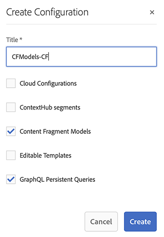

# Uw inhoud modelleren {#model-your-content}

In dit deel van [&#x200B; AEM de Kop-loze Reis van de Ontwikkelaar &#x200B;](overview.md), kunt u leren hoe te om uw inhoudsstructuur te modelleren. Bespreek vervolgens dat de structuur voor Adobe Experience Manager (AEM) bij gebruik van Content Fragments Models en Content Fragments, voor hergebruik over kanalen.

## Het verhaal tot nu toe {#story-so-far}

Aan het begin, [&#x200B; Leer over CMS Headless Ontwikkeling &#x200B;](learn-about.md) behandelde hoofdloze inhoudslevering en waarom het zou moeten worden gebruikt. Dan [&#x200B; Begonnen het worden met AEM Zwaartepunt &#x200B;](getting-started.md) beschreven AEM Zwaartepunt in de context van uw eigen project.

In het vorige document van de AEM hoofdloze reis, [&#x200B; Weg aan Uw Eerste Ervaring Gebruikend AEM Koploze &#x200B;](path-to-first-experience.md), leerde u dan de stappen nodig om uw eerste project uit te voeren. Na het lezen moet u:

* Belangrijke planningsoverwegingen voor het ontwerpen van uw inhoud begrijpen
* Begrijp de stappen om hoofdloos uit te voeren afhankelijk van uw vereisten van het integratieniveau.
* Stel de benodigde gereedschappen en AEM configuraties in.
* Weet de beste praktijken om uw reis zonder kop vlot te maken, efficiënt inhoudsgeneratie te houden, en ervoor te zorgen dat de inhoud snel wordt geleverd.

Dit artikel bouwt op die grondbeginselen voort zodat begrijpt u hoe te om uw eigen AEM hoofdloze project voor te bereiden.

## Doelstelling {#objective}

* **Publiek**: Begin
* **Doelstelling**: Leer hoe te om uw inhoudsstructuur te modelleren, dan realiseer die structuur die AEM Modellen van het Fragment van de Inhoud en de Fragmenten van de Inhoud gebruikt:
   * Introduceer concepten en terminologie met betrekking tot gegevens/inhoud modellering.
   * Ontdek waarom contentmodellering nodig is voor levering van inhoud zonder koptekst.
   * Leer hoe u deze structuur kunt realiseren met AEM Content Fragment Models (en inhoud met Content Fragments schrijven).
   * Leer hoe u uw inhoud modelleert; principes met basisvoorbeelden.

>[!NOTE]
>
>De Modellering van gegevens is een groot gebied, aangezien het wanneer het ontwikkelen van Relationele Gegevensbestanden wordt gebruikt. Er zijn veel boeken en online informatiebronnen beschikbaar.
>
>De aspecten die van belang zijn bij het modelleren van gegevens voor gebruik met AEM Headless worden slechts overwogen.

## Inhoud modelleren {#content-modeling}

*het is een grote, slechte wereld daar*.

Misschien, maar misschien niet. Het is zeker een overweldigende ***gecompliceerde*** wereld daar. Gegevensmodellering wordt gebruikt om een vereenvoudigde representatie van een zeer (zeer) kleine subsectie te bepalen, gebruikend de specifieke informatie die voor een bepaald doel nodig is.

>[!NOTE]
>
>Aangezien AEM met inhoud behandelt, wordt de Modellering van Gegevens bedoeld als Inhoud Modeling.

Bijvoorbeeld:

Er zijn veel scholen, maar ze hebben allemaal verschillende dingen gemeen:

* Een locatie
* Een hoofdleraar
* Veel docenten
* Veel leden van niet-onderwijzend personeel
* Veel leerlingen
* Veel ex-docenten
* Veel ex-leerlingen
* Veel lesruimten
* Veel (veel) boeken
* Veel (veel) apparaten
* Veel activiteiten buiten het studieprogramma
* enzovoort...

Zelfs in zo&#39;n klein voorbeeld kan de lijst eindeloos lijken. Maar als u gewoon wilt dat uw toepassing een eenvoudige taak uitvoert, kunt u de informatie tot de essentie beperken.

Bijvoorbeeld speciale evenementen voor alle scholen in het gebied:

* Schoolnaam
* Locatie onderwijsinstelling
* Hoofddocent
* Type gebeurtenis
* Datum van gebeurtenis
* De leraar die de gebeurtenis organiseert

### Concepten {#concepts}

Wat u wilt beschrijven wordt bedoeld als **Entiteiten** - fundamenteel de &quot;dingen&quot;die u informatie over wilt opslaan.

De informatie die u over hen wilt opslaan is de **Attributen** (eigenschappen), zoals Naam, en Kwalificaties voor de leerkrachten.

Dan zijn er diverse **Verhoudingen** tussen de entiteiten. Een school heeft bijvoorbeeld meestal maar één hoofdleraar en veel leraren (en meestal is de hoofdleraar ook een leraar).

Het proces om deze informatie, samen met het verband tussen hen te analyseren en te bepalen, wordt genoemd **Inhoud Modellerende**.

### Basisbeginselen {#basics}

Vaak, kunt u beginnen door a **Conceptueel Schema** op te stellen dat de entiteiten en hun verhoudingen beschrijft. Meestal is dit op hoog niveau (conceptueel).

Nadat dit stabiel is kunt u de modellen in a **Logisch Schema** vertalen die de entiteiten, samen met de attributen, en de verhoudingen beschrijft. Op dit niveau bekijkt u de definities nauwkeurig om dubbel werk te voorkomen en uw ontwerp te optimaliseren.

>[!NOTE]
>
>Soms worden deze twee stappen samengevoegd, vaak afhankelijk van de complexiteit van uw scenario.

Hebt u bijvoorbeeld aparte entiteiten voor `Head Teacher` en `Teacher` nodig, of gewoon een extra kenmerk voor het `Teacher` -model?

### Gegevensintegriteit waarborgen {#data-integrity}

Gegevensintegriteit is nodig om de nauwkeurigheid en consistentie van uw inhoud gedurende de gehele levenscyclus te garanderen. Dit betekent dat auteurs van inhoud gemakkelijk kunnen begrijpen wat ze moeten opslaan - dus het volgende is van essentieel belang:

* een duidelijke structuur
* een zo beknopt mogelijke structuur (zonder afbreuk te doen aan de nauwkeurigheid)
* validatie van afzonderlijke velden
* indien van toepassing, de inhoud van specifieke velden beperken tot wat zinvol is

### Gegevensredundantie elimineren {#data-redundancy}

Gegevensredundantie treedt op wanneer dezelfde informatie tweemaal wordt opgeslagen binnen de inhoudsstructuur. Dit moet worden vermeden omdat dit tot verwarring kan leiden bij het creëren van de inhoud en tot fouten bij het opvragen, om nog maar te zwijgen van het misbruik van de opslagruimte.

### Optimalisatie en prestaties {#optimization-and-performance}

Door uw structuur te optimaliseren kunt u de prestaties verbeteren, zowel voor het maken van inhoud als voor het opvragen van inhoud.

Alles is een evenwichtsactie, maar het creëren van een structuur die te complex is, of teveel niveaus heeft, kan:

* Verwar dit voor auteurs die de inhoud genereren.

* Het heeft een ernstig effect op de prestaties als de query toegang moet krijgen tot meerdere geneste (waarnaar wordt verwezen) inhoudsfragmenten om de vereiste inhoud op te halen.

## Content Modeling for AEM Headless {#content-modeling-for-aem-headless}

Gegevensmodellering is een reeks gevestigde technieken, die vaak worden gebruikt wanneer ontwikkelde relatiedatabases, zodat wat betekent de Modellering van de Inhoud voor AEM Zwaartepunt?

### Waarom? {#why}

Om ervoor te zorgen dat uw toepassing de vereiste inhoud van AEM consistent en efficiënt kan aanvragen en ontvangen, moet deze inhoud gestructureerd zijn.

Dit betekent dat uw toepassing van tevoren de vorm van de reactie en daarom hoe te om het weet te verwerken. Dit is gemakkelijker dan het ontvangen van vrij-vorminhoud, die moet worden geparseerd om te bepalen wat het bevat en daarom, hoe het kan worden gebruikt.

### Inleiding aan hoe? {#how}

AEM gebruikt Content Fragments om de structuren te bieden die nodig zijn voor de levering van inhoud zonder kop aan uw toepassingen.

De structuur van het inhoudsmodel is:

* door de definitie van het inhoudsfragmentmodel wordt gerealiseerd,
* gebruikt als basis voor de Inhoudsfragmenten die worden gebruikt voor het genereren van inhoud.

>[!NOTE]
>
>De modellen van het Fragment van de Inhoud worden ook gebruikt als basis van de AEM Schema&#39;s van GraphQL, die voor het terugwinnen van uw inhoud - meer over dat in een recentere zitting worden gebruikt.

Verzoeken om uw inhoud worden ingediend met de AEM GraphQL API, een aangepaste implementatie van de standaard GraphQL API. Met de AEM GraphQL API kunt u (complexe) query&#39;s uitvoeren op uw inhoudsfragmenten, waarbij elke query op een specifiek modeltype is gebaseerd.

De geretourneerde inhoud kan vervolgens door uw toepassingen worden gebruikt.

## De structuur maken met modellen van inhoudsfragmenten {#create-structure-content-fragment-models}

Modellen van inhoudsfragmenten bieden verschillende mechanismen waarmee u de structuur van de inhoud kunt definiëren.

Een inhoudsfragmentmodel beschrijft een entiteit.

>[!NOTE]
>Schakel de functionaliteit voor inhoudsfragmenten in de configuratiegrowser in, zodat u modellen kunt maken.

>[!TIP]
>
>Het model moet een naam krijgen, zodat de auteur van de inhoud weet welk model moet worden geselecteerd bij het maken van een inhoudsfragment.

Binnen een model:

1. **de Types van Gegevens** laten u de individuele attributen bepalen.
Bijvoorbeeld, bepaal het gebied wachtend de naam van een leraar als **Tekst** en hun jaren van de dienst als **Aantal**.
1. De gegevenstypes **Verwijzing van de Inhoud** en **Verwijzing van het Fragment** laten u verhoudingen aan andere inhoud binnen AEM tot stand brengen.
1. Het **gegevenstype van de Verwijzing van het Fragment** laat u veelvoudige niveaus van structuur realiseren door uw Fragmenten van de Inhoud (volgens het modeltype) te nesten. Dit is van essentieel belang voor het modelleren van inhoud.

Bijvoorbeeld:

### Gegevenstypen {#data-types}

AEM bevat de volgende gegevenstypen waarmee u uw inhoud kunt modelleren:

* Tekst met één regel
* Tekst met meerdere regels
* Getal
* Boolean
* Datum en tijd
* Opsomming
* Tags
* Content Reference
* Fragmentverwijzing
* JSON-object

### Verwijzingen en geneste inhoud {#references-nested-content}

Twee gegevenstypen bevatten verwijzingen naar inhoud buiten een specifiek fragment:

* **Verwijzing van de Inhoud**
Dit verstrekt een eenvoudige verwijzing naar andere inhoud van om het even welk type.
U kunt bijvoorbeeld naar een afbeelding op een bepaalde locatie verwijzen.

* **Verwijzing van het Fragment**
Hier vindt u verwijzingen naar andere inhoudsfragmenten.
Dit type verwijzing wordt gebruikt om geneste inhoud te creëren, introducerend de verhoudingen nodig om uw inhoud te modelleren.
Het gegevenstype kan worden geconfigureerd om fragmentauteurs toe te staan:
   * Bewerk het fragment waarnaar wordt verwezen rechtstreeks.
   * Maak een inhoudsfragment op basis van het juiste model.

### Modellen voor inhoudsfragmenten maken {#creating-content-fragment-models}

Aan het begin moet u Modellen van inhoudsfragmenten voor uw site inschakelen. Dit wordt gedaan enablement in Browser van de Configuratie; onder Hulpmiddelen > Algemeen > Browser van de Configuratie. U kunt of selecteren om de globale ingang te vormen, of een configuratie creëren. Bijvoorbeeld:

>[!NOTE]
>
>Zie Extra Middelen - de Fragmenten van de Inhoud in Browser van de Configuratie

Vervolgens kunt u de modellen van Content Fragments maken en de structuur definiëren. U doet dit onder Gereedschappen > Assets > Modellen van inhoudsfragmenten. Bijvoorbeeld:

>[!NOTE]
>
>Zie Aanvullende bronnen - Modellen van inhoudsfragmenten.

## Inhoud met inhoudsfragmenten schrijven met het model {#use-content-to-author-content}

Inhoudsfragmenten zijn altijd gebaseerd op een inhoudsfragmentmodel. Het model biedt de structuur, het fragment bevat de inhoud.

### Het juiste model selecteren {#select-model}

De eerste stap voor het maken van uw inhoud is het maken van een inhoudsfragment. Dit doet u door Maken > Inhoudsfragment te kiezen in de gewenste map onder Assets > Bestanden. De wizard begeleidt u door de stappen.

Een inhoudsfragment is gebaseerd op een specifiek inhoudsfragmentmodel dat u selecteert als de eerste stap van het ontwerpproces.

### Gestructureerde inhoud maken en bewerken {#create-edit-structured-content}

Nadat u het fragment hebt gemaakt, kunt u het openen in de Inhoudsfragmenteditor. Hier kunt u het volgende doen:

* Bewerk de inhoud in de modus Normaal of Volledig scherm.
* Maak de inhoud op als Volledige tekst, Onbewerkte tekst of Markeringen.
* Maak en beheer variaties in uw inhoud.
* Inhoud koppelen.
* Bewerk de metagegevens.
* De boomstructuur tonen.
* Geef een voorvertoning van de JSON-representatie weer.

### Inhoudsfragmenten maken {#creating-content-fragments}

Nadat u het juiste model hebt geselecteerd, wordt een inhoudsfragment geopend voor bewerking in de Inhoudsfragmenteditor:

>[!NOTE]
>
>Zie Aanvullende bronnen - Werken met inhoudsfragmenten.

## Aan de slag met enkele voorbeelden {#getting-started-examples}

<!--
tbc...
...and/or see the structures covered for the GraphQL samples...
...will those (ever) be delivered as an official sample package?
-->

Zie De structuur van het voorbeeldinhoudsfragment voor een basisstructuur als voorbeeld.

## Volgende functies {#whats-next}

Nu u hebt geleerd hoe te om uw structuur te modelleren, en inhoud tot stand te brengen afhankelijk van dat, moet de volgende stap [&#x200B; leren hoe te om de vragen van GraphQL te gebruiken om tot uw inhoud van de Fragmenten van de Inhoud toegang te hebben en terug te winnen &#x200B;](access-your-content.md). Dit introduceert en bespreekt GraphQL, dan bekijk sommige steekproefvragen om te zien hoe de dingen in de praktijk werken.

## Aanvullende bronnen {#additional-resources}

* [&#x200B; Werkend met de Fragmenten van de Inhoud &#x200B;](/help/assets/content-fragments/content-fragments.md) - de lood-in pagina voor de Fragmenten van de Inhoud.
   * [&#x200B; de Fragmenten van de Inhoud in Browser van de Configuratie &#x200B;](/help/assets/content-fragments/content-fragments-configuration-browser.md) - laat de functionaliteit van het Fragment van de Inhoud in Browser van de Configuratie toe.
   * [&#x200B; Modellen van het Fragment van de Inhoud &#x200B;](/help/assets/content-fragments/content-fragments-models.md) - Creërend en het uitgeven de Modellen van het Fragment van de Inhoud.
   * [&#x200B; het Leiden de Fragmenten van de Inhoud &#x200B;](/help/assets/content-fragments/content-fragments-managing.md) - Creërend en creërend de Fragmenten van de Inhoud; deze pagina leidt u tot andere gedetailleerde secties.
* [&#x200B; AEM GraphQL Schemas &#x200B;](access-your-content.md) - hoe GraphQL modellen realiseert.
* [De structuur van het voorbeeldinhoudsfragment](/help/sites-developing/headless/graphql-api/content-fragments-graphql-samples.md#content-fragment-structure-graphql)
* [&#x200B; Begonnen het Worden met AEM Zwaartepunt &#x200B;](https://experienceleague.adobe.com/docs/experience-manager-learn/getting-started-with-aem-headless/graphql/overview.html?lang=nl-NL) - een korte videoles die een overzicht geven van het gebruiken van AEM zonder kop eigenschappen, met inbegrip van inhoud modelleren en GraphQL.
   * [&#x200B; Basisprincipes van de Modellering van GraphQL &#x200B;](https://experienceleague.adobe.com/docs/experience-manager-learn/getting-started-with-aem-headless/graphql/video-series/modeling-basics.html?lang=nl-NL) - Leer hoe te om de Fragmenten van de Inhoud in Adobe Experience Manager (AEM) voor gebruik met GraphQL te bepalen en te gebruiken.
