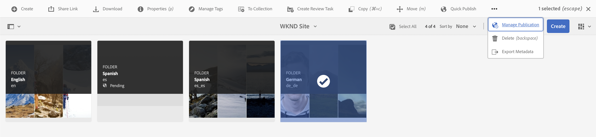
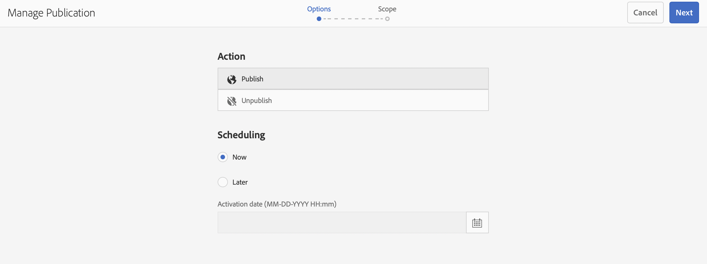
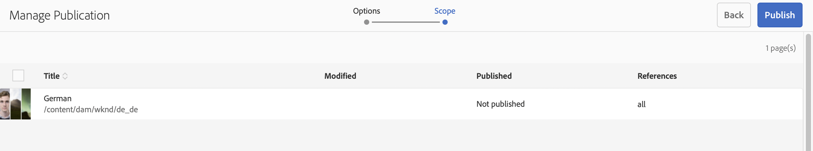
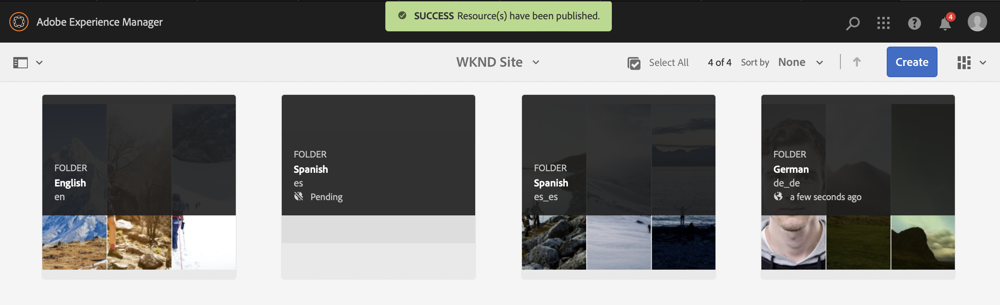
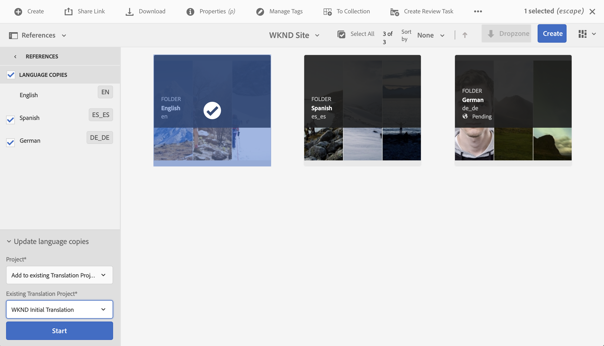
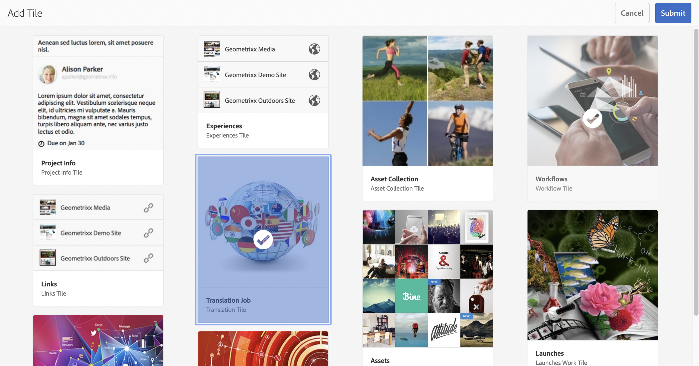
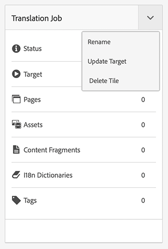
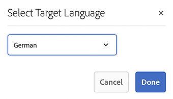

# Vertaalde inhoud publiceren {#publish-content}

Leer hoe u uw vertaalde inhoud publiceert en de vertalingen bijwerkt terwijl de inhoud wordt bijgewerkt.

## Het verhaal tot nu toe {#story-so-far}

In het vorige document van de hoofdloze vertaalreis van AEM, [&#x200B; vertaal Inhoud, &#x200B;](configure-connector.md) u leerde hoe te om de Projecten van de Vertaling van AEM te gebruiken om uw inhoud zonder kop te vertalen. Nu moet u:

* Begrijp wat een vertaalproject is.
* U kunt vertaalprojecten maken.
* Gebruik vertaalprojecten om uw inhoud zonder kop te vertalen.

Nu uw eerste vertaling is voltooid, wordt in dit artikel de volgende stap gezet voor het publiceren van die inhoud en wat u moet doen om uw vertalingen bij te werken wanneer de onderliggende inhoud in de hoofdtaalwijziging verandert.

## Doelstelling {#objective}

Dit document helpt u te begrijpen hoe u inhoud zonder kop in AEM kunt publiceren en hoe u een continue workflow kunt maken om uw vertalingen up-to-date te houden. Nadat u dit document hebt gelezen, moet u:

* Begrijp het auteur-publicatiemodel van AEM.
* Zorg dat u weet hoe u uw vertaalde inhoud publiceert.
* Een voortdurend updatemodel voor uw vertaalde inhoud kunnen implementeren.

## AEM-publicatiemodel voor auteur {#author-publish}

Voordat u de inhoud publiceert, is het raadzaam het publicatiemodel van AEM te begrijpen. In vereenvoudigde termen verdeelt AEM de gebruikers van het systeem in twee groepen.

1. Degenen die de inhoud en het systeem maken en beheren
1. Degenen die de inhoud van het systeem consumeren

AEM wordt daarom fysiek in twee gevallen gescheiden.

1. De **auteur** instantie is het systeem waar de inhoudsauteurs en de beheerders werken om inhoud tot stand te brengen en te beheren.
1. **publiceer** instantie is het systeem dat de inhoud aan de consumenten levert.

Nadat inhoud op de instantie van de auteur is gemaakt, moet deze naar de instantie publish worden overgedragen om de inhoud beschikbaar te maken voor consumptie. Het proces om van auteur over te brengen om te publiceren wordt genoemd **publicatie**.

## Uw vertaalde inhoud publiceren {#publishing}

Zodra u tevreden bent met de staat van uw vertaalde inhoud, moet het worden gepubliceerd zodat de headless diensten het kunnen verbruiken. Deze taak valt niet onder de verantwoordelijkheid van de vertaalspecialist, maar wordt hier beschreven om de volledige workflow te illustreren.

>[!NOTE]
>
>Wanneer de vertaling is voltooid, informeert de vertalingsspecialist de eigenaars van de inhoud over het feit dat de vertalingen klaar zijn voor publicatie. De eigenaars van de inhoud publiceren deze vervolgens.
>
>De volgende stappen worden verstrekt voor volledigheid.

De eenvoudigste manier om de vertalingen te publiceren is aan de omslag van projectactiva te navigeren.

```text
/content/dam/<your-project>/
```

Onder dit pad hebt u submappen voor elke vertaaltaal en kunt u kiezen welke taal u wilt publiceren.

1. Ga naar **Navigatie** > **Assets** > **Dossiers** en open de projectomslag.
1. Hier ziet u de hoofdmap van de taal en alle andere taalmappen. Selecteer de gelokaliseerde taal of talen die u wilt publiceren.
   
1. Klik **leiden Publicatie**.
1. In het **leiden Publicatie** venster, zorg ervoor dat **publiceert** automatisch onder **Actie** wordt geselecteerd en dat **&#x200B;**&#x200B;nu onder **plannend** wordt geselecteerd. Klik op **Next**.
   
1. In het volgende **leidt het venster van de Publicatie**, bevestig dat de juiste weg(en) wordt/worden geselecteerd. Klik **publiceren**.
   
1. AEM bevestigt de publicatieactie met een pop-upbericht boven aan het scherm.
   

Uw vertaalde inhoud zonder kop is nu gepubliceerd! Het kan nu door uw headless diensten worden betreden en worden verbruikt.

>[!TIP]
>
>U kunt meerdere items selecteren (dat wil zeggen meerdere taalmappen) wanneer u publiceert om meerdere vertalingen tegelijk te publiceren.

Er zijn extra opties wanneer het publiceren van uw inhoud, zoals het plannen van een publicatietijd, die buiten het werkingsgebied van deze reis zijn. Zie de [&#x200B; Extra sectie van Middelen &#x200B;](#additional-resources) aan het eind van het document voor meer informatie.

## Uw vertaalde inhoud bijwerken {#updating-translations}

Vertaling is zelden een eenmalige exercitie. Meestal blijven auteurs van inhoud uw inhoud toevoegen aan en wijzigen deze in de hoofdmap van de taal nadat de eerste vertaling is voltooid. Dit betekent dat u ook uw vertaalde inhoud moet bijwerken.

De specifieke projectvereisten bepalen hoe vaak u uw vertalingen moet bijwerken en welk besluitvormingsproces wordt gevolgd alvorens een update uit te voeren. Zodra u hebt besloten uw vertalingen bij te werken, is het proces in AEM eenvoudig. Aangezien de eerste vertaling gebaseerd was op een vertaalproject, zijn ook updates mogelijk.

Het proces verschilt echter enigszins als u ervoor kiest om uw vertaalproject automatisch te maken of uw vertaalproject handmatig te maken.

### Een automatisch gemaakt vertaalproject bijwerken {#updating-automatic-project}

1. Navigeer aan **Navigatie** > **Assets** > **Dossiers**. Houd er rekening mee dat inhoud zonder kop in AEM wordt opgeslagen als elementen die Content Fragments worden genoemd.
1. Selecteer de taalwortel van uw project. In dit geval is `/content/dam/wknd/en` geselecteerd.
1. Klik de spoorselecteur en toon het **paneel van Verwijzingen**.
1. Klik **Exemplaren van de Taal**.
1. Controleer het **checkbox van de Kopieën van de Taal 0&rbrace;.**
1. Breid de sectie **Exemplaren van de Taal van de Update** bij de bodem van het verwijzingenpaneel uit.
1. In **drop-down van het Project**, uitgezocht **voeg aan een bestaand Vertaal Project** toe.
1. In het **Bestaande drop-down Project van de Vertaling**, selecteer het project dat voor de aanvankelijke vertaling wordt gecreeerd.
1. Klik **Begin**.

 toe

De inhoud wordt toegevoegd aan het bestaande vertaalproject. Het vertaalproject weergeven:

1. Navigeer aan **Navigatie** > **Projecten**.
1. Klik op het project dat u zojuist hebt bijgewerkt.
1. Klik op de taal of een van de talen die u hebt bijgewerkt.

U ziet dat er nieuwe taakkaarten aan het project worden toegevoegd, zoals van toepassing is.

<!--
You see that a new job card was added to the project. In this example, another Spanish translation was added.


-->

U kunt zien dat de statistieken op de nieuwe kaart (aantal activa en inhoudsfragmenten) verschillend zijn. AEM herkent namelijk wat er is veranderd sinds de laatste vertaling en bevat alleen de inhoud die moet worden vertaald. Dit omvat het opnieuw vertalen van bijgewerkte inhoud en het voor het eerst vertalen van nieuwe inhoud.

Van dit punt, begint u [&#x200B; en beheert uw vertaalbaan enkel aangezien u origineel deed.](translate-content.md#using-translation-project)

### Een handmatig gemaakt vertaalproject bijwerken {#updating-manual-project}

Als u een vertaling wilt bijwerken, kunt u een nieuwe taak toevoegen aan uw bestaande project die verantwoordelijk is voor het vertalen van de bijgewerkte inhoud.

1. Navigeer aan **Navigatie** > **Projecten**.
1. Klik op het project dat u moet bijwerken.
1. Klik **toevoegen** knoop bij de bovenkant van het venster.
1. In **voeg het venster van de Tegel** toe, klik **VertaalBaan** en dan **voorlegt**.

    toe

1. Op de kaart van de nieuwe vertaalbaan, klik de chevron knoop bij de bovenkant van de kaart, en selecteer **Doel van de Update** om de doeltaal van de nieuwe baan te bepalen.

   

1. In de **Uitgezochte Taal van het Doel** dialoog, gebruik drop-down om de taal te selecteren en **te klikken Gedaan**.

   

1. Als de doeltaal van uw nieuwe vertaaltaak is ingesteld, klikt u op de knop voor de weglatingsteken onder aan de werkkaart om de details van de taak weer te geven.
1. De taak is leeg wanneer deze voor het eerst wordt gemaakt. Voeg inhoud aan de baan toe door te tikken of te klikken **voeg** knoop toe en gebruikend wegbrowser [&#x200B; zoals u voordien toen het creëren van het vertaalproject.](translate-content.md#manually-creating)

>[!TIP]
>
>De krachtige filters van de padbrowser kunnen ook weer nuttig zijn om alleen de inhoud te zoeken die is bijgewerkt.
>
>U kunt meer over wegbrowser in de [&#x200B; extra middelensectie leren.](#additional-resources)

Van dit punt, begint u [&#x200B; en beheert uw vertaalbaan enkel aangezien u origineel deed.](translate-content.md#using-translation-project)

## Einde van de reis? {#end-of-journey}

Gefeliciteerd! U hebt de reis zonder kop voltooid! Nu moet u:

* Heb een overzicht van wat koploze inhoudlevering is.
* U hebt een basiskennis van AEM-functies zonder kop.
* Begrijp de vertaalfuncties van AEM en hoe deze verwant zijn aan inhoud zonder kop.
* De mogelijkheid hebben om uw eigen inhoud zonder kop te vertalen.

U kunt nu uw eigen inhoud zonder kop vertalen in AEM. AEM is echter een krachtig hulpmiddel en er zijn veel aanvullende opties beschikbaar. Controle uit enkele extra middelen beschikbaar in de [&#x200B; Extra sectie van Middelen &#x200B;](#additional-resources) om meer over de eigenschappen te leren u in deze reis zag.

## Aanvullende bronnen {#additional-resources}

* [&#x200B; het Leiden de Projecten van de Vertaling &#x200B;](/help/sites-administering/tc-manage.md) - leer de details van vertaalprojecten en extra eigenschappen zoals menselijke vertaalwerkschema&#39;s en meertalige projecten.
* [&#x200B; Authoring concepten &#x200B;](/help/sites-authoring/author.md) - leer meer over de auteur en publiceer het model van AEM. Dit document is gericht op het schrijven van pagina&#39;s in plaats van op inhoudfragmenten, maar de theorie blijft van toepassing.
* [&#x200B; het Publiceren Pagina&#39;s &#x200B;](/help/sites-authoring/publishing-pages.md) - leer over de extra eigenschappen beschikbaar wanneer het publiceren van inhoud. Dit document is gericht op het schrijven van pagina&#39;s in plaats van op inhoudfragmenten, maar de theorie blijft van toepassing.
* [&#x200B; het Authoring Milieu en Hulpmiddelen &#x200B;](/help/sites-authoring/author-environment-tools.md#path-selection) - AEM verstrekt diverse mechanismen om uw inhoud met inbegrip van robuuste wegbrowser te organiseren en uit te geven.
