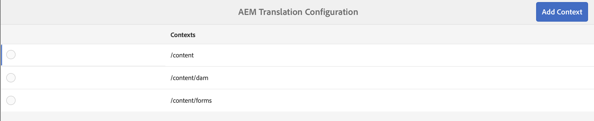
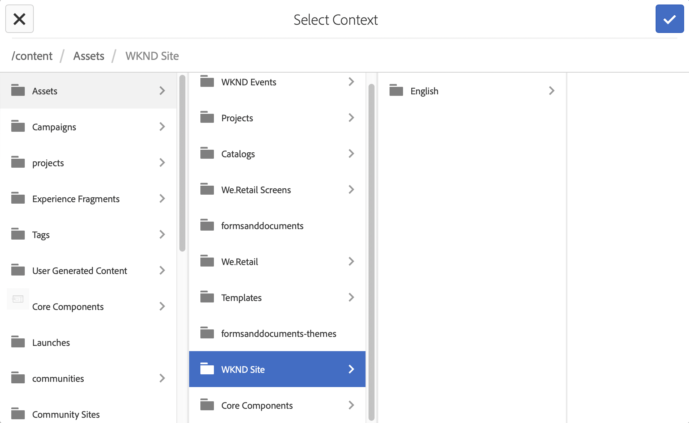
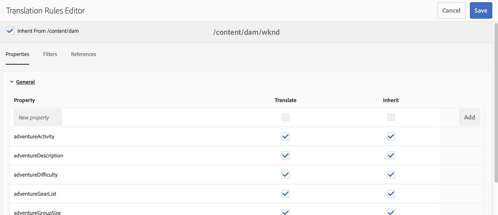
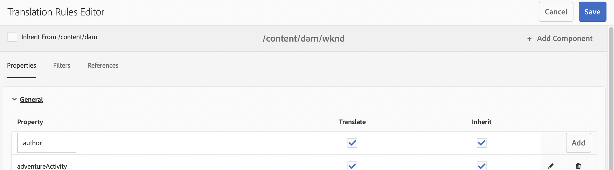

# Vertaalregels configureren {#configure-translation-rules}

Leer hoe u vertaalregels definieert om inhoud voor vertaling te identificeren.

## Het verhaal tot nu toe {#story-so-far}

In het vorige document van de AEM zonder kop [Vertaalintegratie configureren](configure-connector.md) u hebt geleerd hoe u uw vertaalintegratie kunt installeren en configureren en dat u nu moet doen:

* Begrijp de belangrijke parameters van het Kader van de Integratie van de Vertaling in AEM.
* Uw eigen verbinding met uw vertaalservice instellen.

Nu uw integratie is ingesteld, wordt in dit artikel stapsgewijs vastgesteld welke inhoud u moet vertalen.

## Doelstelling {#objective}

Dit document helpt u te begrijpen hoe u AEM vertaalregels kunt gebruiken om uw vertaalinhoud te identificeren. Nadat u dit document hebt gelezen, moet u:

* Begrijp wat de vertaalregels doen.
* U kunt uw eigen vertaalregels definiëren.

## Vertaalregels {#translation-rules}

Inhoudsfragmenten, die uw inhoud zonder kop vertegenwoordigen, kunnen veel informatie bevatten die is ingedeeld in gestructureerde velden. Afhankelijk van uw projectbehoeften is het waarschijnlijk dat niet alle velden in een inhoudsfragment moeten worden vertaald.

In de vertaalregels wordt aangegeven welke inhoud is opgenomen in of uitgesloten van vertaalprojecten. Wanneer de inhoud wordt vertaald, AEM de inhoud uitpakt of oogst die op deze regels wordt gebaseerd. Op die manier wordt alleen inhoud die moet worden vertaald naar de vertaaldienst verzonden.

De vertaalregels bevatten de volgende informatie:

* Het pad van de inhoud waarop de regel van toepassing is
   * De regel is ook van toepassing op de onderliggende elementen van de inhoud
* De namen van de eigenschappen die de te vertalen inhoud bevatten
   * Het bezit kan voor een specifiek middeltype of voor alle middeltypes specifiek zijn

Omdat de Modellen van het Fragment van de Inhoud, die de structuur van uw Inhoudsfragmenten bepalen, aan uw eigen project uniek zijn, is het essentieel aan opstellingsvertaalregels zodat AEM weet welke elementen van uw inhoudsmodellen moeten vertalen.

>[!TIP]
>
>Over het algemeen biedt de architect van de inhoud de vertaler **Eigenschapnaam** s van alle velden die nodig zijn voor vertaling. Deze namen zijn nodig om vertaalregels te configureren. Als vertaler [kan deze vinden **Eigenschapnaam** zoals uzelf](getting-started.md#content-models) zoals eerder beschreven in deze reis.

## Vertaalregels maken {#creating-rules}

Er kunnen meerdere regels worden gemaakt ter ondersteuning van complexe vertaalvereisten. Het ene project waaraan u werkt, vereist bijvoorbeeld dat alle velden van het model worden vertaald, maar dat andere alleen beschrijvingsvelden worden vertaald terwijl titels niet worden vertaald.

De vertaalregels worden ontworpen om dergelijke scenario&#39;s te behandelen. Nochtans in dit voorbeeld illustreren wij hoe te om regels tot stand te brengen door zich op een eenvoudige, enige configuratie te concentreren.

Er is een **Omzetconfiguratie** console beschikbaar voor het vormen van vertaalregels. Toegang tot dit bestand:

1. Navigeren naar **Gereedschappen** > **Algemeen**.
1. Klikken **Omzetconfiguratie**.

In de **Omzetconfiguratie** UI, zijn er verscheidene opties beschikbaar voor uw vertaalregels. Hier benadrukken wij de meest noodzakelijke en typische stappen die voor een basisconfiguratie zonder kop worden vereist.

1. Klikken **Context toevoegen**, waarmee u een pad kunt toevoegen. Dit is het pad van de inhoud waarop de regel van toepassing is.
   
1. Selecteer het gewenste pad in de padbrowser en klik op **Bevestigen** op te slaan. Onthoud dat Content Fragments, die inhoud zonder kop bevatten, zich doorgaans onder `/content/dam/<your-project>`.
   
1. AEM slaat de configuratie op.
1. Selecteer de context die u hebt gemaakt en klik op **Bewerken**. Hierdoor wordt het **Editor voor omzettingsregels** om de eigenschappen te configureren.
   
1. Standaard worden alle configuraties overgenomen van het bovenliggende pad, in dit geval `/content/dam`. Schakel de optie uit **Overnemen van`/content/dam`** om extra gebieden aan de configuratie toe te voegen.
1. Als deze optie is uitgeschakeld, onder de knop **Algemeen** in de lijst, voegt u de eigenschapnamen toe van de inhoudsfragmentmodellen die u gebruikt [eerder geïdentificeerd als velden voor vertaling.](getting-started.md#content-models)
   1. Voer de naam van de eigenschap in het dialoogvenster **Nieuwe eigenschap** veld.
   1. De opties **Vertalen** en **Overnemen** worden automatisch ingeschakeld.
   1. Klikken **Toevoegen**.
   1. Herhaal deze stappen voor alle velden die u moet vertalen.
   1. Klikken **Opslaan**.
      

U hebt nu uw vertaalregels geconfigureerd.

## Geavanceerd gebruik {#advanced-usage}

Er zijn verscheidene extra eigenschappen die als deel van uw vertaalregels kunnen worden gevormd. Bovendien kunt u uw regels handmatig als XML opgeven, waardoor meer specificiteit en flexibiliteit mogelijk zijn.

Dergelijke functies zijn meestal niet nodig om uw inhoud zonder kop te lokaliseren, maar u kunt er meer over lezen in het dialoogvenster [Aanvullende bronnen](#additional-resources) als u geïnteresseerd bent.

## Volgende functies {#what-is-next}

Nu u dit deel van de reis zonder kop hebt voltooid, moet u:

* Begrijp wat de vertaalregels doen.
* U kunt uw eigen vertaalregels definiëren.

Gebaseerd op deze kennis en doorgaan met uw AEM reis zonder hoofd door het document opnieuw te bekijken [Inhoud vertalen](translate-content.md) waar u zult leren hoe uw integratie en regels samenwerken om inhoud zonder kop te vertalen.

## Aanvullende bronnen {#additional-resources}

U kunt het beste naar het volgende gedeelte van de reis zonder kop gaan door het document te bekijken [Inhoud vertalen](translate-content.md)Hieronder volgt een aantal aanvullende, optionele bronnen die een diepgaander inzicht geven in bepaalde concepten die in dit document worden genoemd, maar die niet nodig zijn om verder te gaan op de weg zonder kop.

* [Te vertalen inhoud identificeren](/help/sites-administering/tc-rules.md) - Leer hoe vertaalregels inhoud identificeren die moet worden vertaald.
