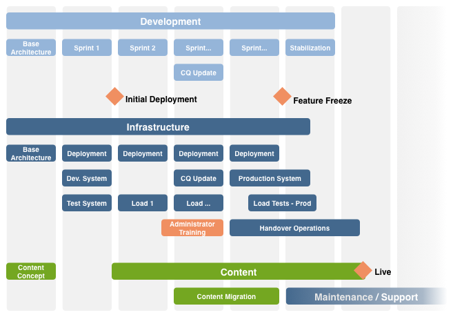

# Checklist - Verdere referentie{#the-checklist-further-reference}

Deze pagina verstrekt verdere details om op de documenten en de principes uit te werken en/of uit te breiden die door [&#x200B; worden behandeld het Leiden Projecten - Checklist van Beste praktijken &#x200B;](/help/managing/best-practices.md).

## AEM - Wat ga je gebruiken? {#aem-what-will-you-be-using}

>[!CAUTION]
>
>De lijsten in deze onderafdeling zijn niet limitatief, maar bedoeld als inleiding.

### Functies in AEM {#features-within-aem}

Wanneer het uitvoeren van AEM (in het bijzonder voor het eerst), herzie de [&#x200B; mogelijkheden en de werkschema&#39;s van AEM &#x200B;](https://business.adobe.com/nl/products/experience-manager/adobe-experience-manager.html) om zeker te zijn van welke gebieden u wilt of nodig hebt.

Houd rekening met de functies van AEM die u gebruikt en de invloed op uw ontwerp, bijvoorbeeld:

* [Commerce](/help/commerce/cif-classic/administering/ecommerce.md)
* [&#x200B; Screens &#x200B;](https://experienceleague.adobe.com/docs/experience-manager-screens/user-guide/aem-screens-introduction.html?lang=nl-NL)
* [Assets](/help/assets/assets.md)
* [Tags](/help/sites-administering/tags.md)
* [Beheer en vertaling van meerdere sites](/help/sites-administering/msm-and-translation.md)
* [Forms](/help/forms/using/introduction-aem-forms.md)
* [Gemeenschappen](/help/communities/deploy-communities.md)

Bovendien controleer de [&#x200B; Nota&#39;s van de Versie &#x200B;](/help/release-notes/release-notes.md), voor de diverse versies van AEM, om te zien wanneer om het even welke nieuwe eigenschappen werden toegevoegd.

### Integrations {#integrations}

AEM kan worden geïntegreerd met andere Adobe-producten of met services van derden, of beide. Deze workflows kunnen de kracht en functionaliteit waarover u beschikt, verhogen.

Zie [&#x200B; Integratie van Oplossingen &#x200B;](/help/sites-administering/integration.md) voor volledige informatie.

## Migreren of upgraden? {#migrate-or-upgrade}

Een belangrijke overweging is of u:

* De bestaande installatie upgraden.
* De inhoud van het huidige systeem migreren naar een nieuwe, nieuwe installatie.

Bij de overgang van een vorige versie naar de huidige versie zijn er twee opties:

* Gebruik de [&#x200B; Manager van het Pakket &#x200B;](/help/sites-administering/package-manager.md) om alle inhoud en toepassingscode van het oude systeem naar nieuwe uit te voeren.
* [&#x200B; Verbetering &#x200B;](/help/sites-deploying/upgrade.md) het oude systeem op zijn plaats. Deze methode is meestal de aanbevolen optie.

## Basisgrondregels {#basic-ground-rules}

Net als bij elk project is het van cruciaal belang dat er zo snel mogelijk grondregels worden opgesteld. Deze regels omvatten:

>[!NOTE]
>
>Deze punten zijn generisch, behandelt de [&#x200B; Checklist van Beste praktijken &#x200B;](/help/managing/best-practices.md) specificiteit met betrekking tot AEM.

* **Rollen**

  De rollen moeten duidelijk worden omschreven en aan alle bij het project betrokken partijen worden meegedeeld. Daarnaast is het raadzaam de aandacht te vestigen op:

   * Beslissingsmakers
   * Contactpunten

* **Verantwoordelijkheden**

   * Voor elke rol, helpt een duidelijke definitie van de verantwoordelijkheden met betrekking tot uw project verwarring te verhinderen.

* **Betrokkenheid**

  Door belanghebbende partijen zo spoedig mogelijk te impliceren, kunt u hen aanmoedigen om *belanghebbenden* in het project te worden. Dat vergroot hun inzet voor het welslagen ervan.

   * Aan de kant van de klant omvat deze rol de auteurs die dagelijks met het systeem werken
   * Binnen uw eigen projectteam omvat deze betrokkenheid ook de mensen die verantwoordelijk zijn voor kwaliteitsborging. Hoe meer zij de vereisten van de klant begrijpen, hoe beter zij de tests kunnen plannen.

* **Wegen van Communicatie**

   * Hoewel de communicatiekanalen niet buitensporig moeten worden geformaliseerd, moeten specifieke definities ervoor zorgen dat de sleutelpersonen altijd op de hoogte worden gebracht en dus worden bijgewerkt. Er moet bijzondere aandacht worden besteed aan de communicatie met externe partijen.

* **Processen**

  De gedefinieerde processen zijn afhankelijk van uw individuele project. Nogmaals, probeer deze processen eenvoudig te houden, met aandacht voor:

   * Het bepalen van processen (en wegen van mededeling) voor interactie met om het even welke derde; bijvoorbeeld, ontwerpers en derdesoftwareleveranciers onder andere.
   * Vaak heeft de klant zijn eigen procedures en hulpmiddelen voor projectbeheer en -rapportage.

* **het Volgen Hulpmiddelen**

  Er zijn vele hulpmiddelen beschikbaar voor het volgen van informatie over insecten, taken, en andere aspecten van uw project - zie [&#x200B; Overzicht van Potentiële Hulpmiddelen &#x200B;](#overview-of-potential-tools) voor meer details.

   * Het belangrijkste punt om hier nota van te nemen is slechts één exemplaar van de informatie te houden en de informatie (en daarom toegang tot het hulpmiddel te delen dat wordt gebruikt) te delen. Deze workflow vereenvoudigt het onderhoud en helpt discrepanties te voorkomen.

* **Reikwijdte**

  Duidelijk bepalen wat op verschillende niveaus onder het project moet vallen:

   * de individuele versies (als een iteratief versieproces wordt gebruikt, en ongeacht of zij aan klanten of uw intern testteam worden geleverd).
   * het AEM-project.
   * het gehele project, met inbegrip van alle software van derden, hun impact op tests, organisatorische problemen en vele andere.
   * Voor bepaalde aspecten, kan het ook nuttig zijn om te verklaren wat *niet* binnen het werkingsgebied van het project is. Dit idee kan helpen verwarring en onjuiste veronderstellingen te voorkomen, maar moet beperkt blijven tot essentiële kwesties.

* **Meldend**

  Duidelijk bepalen welke informatie u wilt melden, in welke vorm, hoe vaak, en aan wie.

* **Terminologie**

   * Bepaal om het even welke te gebruiken afkortingen en/of klant-specifieke terminologie.

* **Veronderstellingen**

   * Bepaal om het even welke veronderstellingen die worden gemaakt.

Deze informatie kan binnen een Handboek van het Project worden bepaald; het gebruik van een Wiki kan ook helpen ervoor zorgen dat de aan de gang zijnde veranderingen efficiënt worden behandeld. Waar deze veronderstellingen worden gedefinieerd, zijn de belangrijkste factoren:

* Informatie wordt gedefinieerd en onderhouden
* De informatie wordt duidelijk aan alle betrokkenen meegedeeld. Hoewel de standaardpraktijk van het Projectbeheer, het niet vaak genoeg kan worden herhaald dat de duidelijke roldefinitie en de goede mededeling een project kunnen maken of breken.
* Er wordt slechts één versie bijgehouden van alle informatie die wordt bijgehouden, zoals het bijhouden van fouten en het bijhouden van problemen.

## Belangrijkste prestatie-indicatoren en streefcijfers {#key-performance-indicators-and-target-metrics}

Organisaties gebruiken de Belangrijkste Indicatoren van Prestaties (KPIs) om hun succes bij het bereiken van doelstellingen te evalueren. Deze indicatoren zijn meetbare waarden die kunnen worden gebruikt om aan te tonen hoe effectief specifieke doelstellingen worden verwezenlijkt.

Deze indicatoren kunnen zijn:

* Zakelijk:

   * Wordt gebruikt om belangrijke bedrijfsdoelstellingen te meten.
   * Het is belangrijk om KPIs te kiezen aangewezen aan uw zaken/scenario met duidelijke definities van wat zij zijn, hoe zij worden gemeten, hoe zij worden gebruikt, en door wie.

* Prestaties:

   * Bepaal hoe u de prestaties van het systeem kunt meten.
   * Voorbeelden zijn laadtijd van pagina&#39;s, responstijd van servers en queryprestaties van databases.

Sommige, maar niet alle, indicatoren kunnen op de doelmetriek worden gebaseerd die u identificeert en bepaalt.

### Doelwaarden {#target-metrics}

Metrisch worden gebruikt om kwantitatieve metingen voor de kwaliteit van uw website te definiëren. Zij zijn fundamenteel een definitie van de prestatiedoelstellingen die u wilt bereiken en kunnen worden gebruikt om uw [&#x200B; KPIs (Zeer belangrijke Indicatoren van Prestaties) te bepalen &#x200B;](#key-performance-indicators-and-target-metrics).

Veel metriek kunnen worden gedefinieerd, maar vaak worden de meeteenheden die u definieert, gebruikt voor uw doelstellingen op het gebied van prestaties en gelijktijdige uitvoering. In het bijzonder, factoren die moeilijk kunnen zijn te kwantificeren, en vaak aan *emotionele* beoordeling worden blootgesteld:

* &quot;is de website *veel te langzaam* vandaag&quot;- wanneer *langzaam* kwalificeert?

* &quot;alles *breidt zich aan een halt* wanneer mijn collega login&quot; - hoeveel gezamenlijke gebruikers de systeemsteun kunnen?
* &quot;wanneer ik onderzoek, breidt het systeem *zich aan een halt* &quot; - welke onderzoeksverzoeken het systeem beïnvloeden?
* &quot;het neemt *Pagina&#39;s* om het dossier&quot;te downloaden - wat aanvaardbare downloadtijden (onder normale netwerkvoorwaarden) zijn?

De Metriek van het doel worden bepaald bij het begin van een project aan:

* Geef de verwachte afmetingen aan van de website die u kunt aanbieden
* geeft de minimale kwaliteit aan die u wilt bereiken
* bepalen hoe deze factoren worden gemeten
* worden gebruikt als basis voor de [&#x200B; Zeer belangrijke Indicatoren van Prestaties &#x200B;](#key-performance-indicators-and-target-metrics)

Zoals altijd zorgvuldig moet worden omgesprongen met de definitie van de doelwaarden:

* als ze te hoog zijn , kunnen ze onbereikbaar zijn
* indien te lage fluctuaties zijn ingesteld, wordt deze mogelijk niet gemarkeerd
* om ervoor te zorgen dat zij herhaaldelijk en consequent kunnen worden gemeten
* om een evenwicht te verschaffen tussen de verschillende factoren die worden gemeten
* bepaalde meetwaarden hebben betrekking op een testomgeving, maar sommige moeten levensechte scenario&#39;s weerspiegelen aangezien zij meetbaar moeten zijn, en reproduceerbaar, op uw productiewebsite
* de metriek prioriteren volgens hun betekenis voor de website
* de metriek beperken tot een reeks die kan worden gecontroleerd

Tijdens de ontwikkeling van het project kunnen ze worden bijgewerkt en aangepast, al naar gelang van het geval. Nadat het project met succes is uitgevoerd, kunnen zij worden gebruikt om u te helpen uw installatie controleren en de vereiste niveaus van de dienst voor aan de gang zijnde verrichting controleren/handhaven.

Wanneer deze gegevens correct worden gebruikt, kunnen ze een nuttig hulpmiddel zijn; wanneer ze onverantwoord worden gebruikt, kunnen ze een tijdverspillende afleiding zijn. Zoals altijd, begrijp wat u meet, hoe u het meet en waarom.

>[!NOTE]
>
>In dit gedeelte worden de basisbeginselen en -kwesties besproken. Elke installatie is anders, dus de werkelijke waarden die moeten worden gemeten, zijn meestal verschillend.

### Alles is afhankelijk van uw projectontwerp {#everything-rests-on-your-project-design}

Alle gemeten metriek worden beïnvloed door het ontwerp van uw project. Omgekeerd kunnen veel problemen het best worden opgelost door ontwerpwijzigingen.

Daarom bepaal uw doelmetriek *alvorens* het beslissen over uw ontwerp. Zo kunt u uw ontwerp optimaliseren op basis van deze factoren. Nadat uw project is ontwikkeld, zijn de basisprincipes van het ontwerp een uitdaging.

Wanneer u de structuur voor de website maakt, volgt u de aanbevolen structuur voor AEM-websites. Zorg ervoor dat u de volgende problemen en/of principes begrijpt:

* Inhoud van websites structureren.
* Hoe sjablonen en componenten werken.
* Hoe werkt caching?
* De effecten van gepersonaliseerde inhoud.
* Hoe de zoekfunctie werkt.
* Hoe u CSS en verwante technologieën kunt gebruiken om compacte, niet overtollige code van HTML tot stand te brengen.

Als u van mening bent dat uw ontwerp de richtlijnen niet volgt, of als u over sommige implicaties onzeker bent, specificeer deze kwesties. Doe dit voordat u de programmeerfase start of de inhoud invult.

### Infrastructuur {#infrastructure}

Om de infrastructuur te bepalen of te beoordelen, helpt het om doelwaarden zoals te bepalen:

* bezoekers/dag; zowel gemiddelde als piekwaarde
* treffers/dag; zowel gemiddelde als piekwaarde
* aantal webpagina&#39;s dat beschikbaar wordt gesteld
* volume van webinhoud

Afhankelijk van uw situatie en de strategische betekenis van de website kunt u door een infrastructuur te definiëren uw infrastructuur beoordelen en kiezen:

* aantal servers
* aantal AEM-instanties (auteur en publicatie)

### Prestaties {#performance}

Er zijn verschillende prestatiefactoren die kunnen worden geëvalueerd:

* responstijden voor afzonderlijke pagina&#39;s, met boekhouding voor:

   * reactietijden voor een auteursomgeving
   * responstijden voor de publicatieomgeving

* antwoordtijden voor zoekverzoeken

Deze sectie kan met [&#x200B; Optimalisering van Prestaties &#x200B;](/help/sites-deploying/configuring-performance.md) worden gelezen die de technische details van eigenlijk het meten van de prestaties uitbreidt.

#### Responstijden voor afzonderlijke pagina&#39;s {#response-times-for-individual-pages}

Een belangrijk probleem is de tijd die uw website nodig heeft om te reageren op bezoekersverzoeken.

Hoewel deze waarde voor elke aanvraag varieert, kan een gemiddelde doelwaarde worden bepaald. Zodra deze waarde zowel haalbaar als houdbaar is, kan deze worden gebruikt om de prestaties van de website te controleren en de ontwikkeling van potentiële problemen aan te geven

Verschillende doelen voor auteur- en publicatieomgevingen

De responstijden die u wilt opgeven, verschillen per auteur- en publicatieomgeving en weerspiegelen het doelpubliek:

* **Milieu van de Auteur**

  Deze omgeving wordt gebruikt door auteurs die inhoud invoeren en bijwerken, zodat deze:

   * Houd rekening met enkele gebruikers die een groot aantal verzoeken genereren bij het bijwerken van inhoudspagina&#39;s en met de afzonderlijke elementen op die pagina&#39;s
   * zo snel mogelijk zijn om hun productiviteit te maximaliseren voor het ophalen van uw inhoud op uw website

* **publiceer Milieu**

  Deze omgeving bevat inhoud die u beschikbaar maakt voor uw gebruikers:

   * snelheid is nog steeds van vitaal belang , maar is vaak trager dan een auteursomgeving
   * er worden vaak aanvullende mechanismen voor prestatieverbetering toegepast :

      * de inhoud is in cache geplaatst
      * taakverdeling wordt toegepast

#### Doelresponstijden instellen {#setting-target-response-times}

Hoe kunt u beslissen over haalbare (gemiddelde) responstijden? De vraag en het antwoord zijn vaak een kwestie van ervaring:

* ervaring op uw website
* ervaring met AEM
* complexe pagina&#39;s herkennen die boven de gemiddelde responstijden liggen (deze pagina&#39;s moeten, indien mogelijk, individueel worden geoptimaliseerd)

Onder gecontroleerde omstandigheden kunnen echter de volgende richtsnoeren worden toegepast:

* 70% van de aanvragen voor pagina&#39;s moet in minder dan 100 ms reageren.
* 25% van de aanvragen voor pagina&#39;s moet in minder dan 100 ms-300 ms reageren.
* 4% van de aanvragen voor pagina&#39;s moet in minder dan 300 ms-500 ms reageren.
* 1% van de aanvragen voor pagina&#39;s moet in minder dan 500 ms-1000 ms reageren.
* Geen pagina&#39;s mogen langzamer reageren dan 1 seconde.

De bovenstaande getallen voldoen aan de volgende voorwaarden:

* gemeten bij publicatie (geen ontwerpomgeving en/of CFC-overhead)
* gemeten op de server (geen netwerkoverhead)
* niet in cache geplaatst (geen AEM-uitvoercache, geen Dispatcher-cache)
* alleen voor complexe items met veel afhankelijkheden (HTML, JS, PDF, ...)
* geen andere belasting op het systeem

U kunt de reactietijden op verschillende manieren controleren:

* **de reactietijden van de Controle met AEM request.log**

  Een goed uitgangspunt voor prestatiesanalyse is het verzoeklogboek. U kunt onder andere de responstijden van afzonderlijke aanvragen zien. Zie [&#x200B; Optimalisering van Prestaties &#x200B;](/help/sites-deploying/configuring-performance.md) voor meer details.

* **de reactietijden van de Controle met de commentaren van HTML**

  HTML-opmerkingen kunnen worden gebruikt om informatie over de reactietijd op te nemen in de bron van elke pagina:

  `</body> </html>v <-- Page took 58 milliseconds to be rendered by the server --> Response times for search requests`

#### Zoekverzoeken {#search-requests}

Zoekverzoeken kunnen een aanzienlijke invloed hebben op uw website, zowel wat betreft:

* Responstijd van de eigenlijke zoekopdracht

   * Een snelle zoekfunctie is een kwaliteitsdoel voor uw website

* Gevolgen voor de algemene prestaties

   * Aangezien een zoekfunctie (potentieel grote) gedeelten van de inhoud moet scannen, of een speciaal uitgenomen index, kan deze mogelijkheid de prestaties van het gehele systeem beïnvloeden, indien niet geoptimaliseerd

Het vaststellen van doelen voor zoekverzoeken is ook hier een kwestie van ervaring, afhankelijk van:

* ervaring met AEM
* een beoordeling van de frequentie waarmee het zoeken wordt gebruikt in vergelijking met andere doelstellingen
* uw persistentiemanager
* uw zoekindex
* de complexiteit van uw zoekfunctie; een standaardzoekfunctie waarmee één zoekterm kan worden ingevoerd, is sneller dan een geavanceerde zoekopdracht waarmee de gebruiker complexe zoekinstructies kan maken met AND/OR/NOT.

Deze zoekverzoeken moeten vanaf het begin van uw project worden gepland en geïntegreerd. De volgende controlemechanismen zijn beschikbaar:

* **de tijden van de onderzoeksreactie van de controle met AEM request.log**

  Opnieuw kan request.log worden gebruikt om de reactietijden voor onderzoeksverzoeken te controleren; zie [&#x200B; Optimalisering van Prestaties &#x200B;](/help/sites-deploying/configuring-performance.md) voor meer details.

* **Geprogrammeerde mechanismen om de tijden van de onderzoeksreactie te meten**

  Om de informatie aan te passen die u over onderzoeksverzoeken, en hun prestaties verzamelt, wordt geadviseerd dat u informatieinzameling in uw projectbroncode omvat; zie [&#x200B; Optimalisering van Prestaties &#x200B;](/help/sites-deploying/configuring-performance.md) voor meer details.

### Gelijkend {#concurrency}

Maak uw website beschikbaar voor sommige gebruikers en bezoekers, zowel in de auteur- als in de publicatieomgeving. De getallen zijn vaak hoger dan bij het testen, maar ook fluctuerend en moeilijk te voorspellen. Ontwerp uw website voor een gemiddeld aantal gelijktijdige gebruikers en bezoekers zonder dat dit negatieve gevolgen heeft voor de prestaties. Gebruik nogmaals `request.log` om de gelijktijdige uitvoering te testen. Zie [&#x200B; Optimalisering van Prestaties &#x200B;](/help/sites-deploying/configuring-performance.md) voor meer details.

Doelen voor het aantal gelijktijdige gebruikers zijn afhankelijk van het omgevingstype:

* **Milieu van de Auteur**

   * Gewoonlijk kan het aantal gelijktijdige gebruikers nauwkeurig worden geschat. U kunt weten hoeveel auteurs u in totaal hebt, hoewel (waarschijnlijk) niet allen tegelijkertijd actief zijn.

* **publiceer Milieu**

   * De publicatieomgeving is moeilijker te voorspellen, zodat u een doelwaarde moet selecteren. Ook hier moet de website gebaseerd zijn op de ervaring van uw huidige website en realistische verwachtingen ten aanzien van uw nieuwe website.
   * Speciale gebeurtenissen (bijvoorbeeld wanneer u nieuwe, populaire inhoud publiceert) kunnen de verwachtingen of zelfs de mogelijkheden overtreffen (zoals soms in de pers wordt gemeld wanneer tickets voor bepaalde gebeurtenissen te koop worden aangeboden).

### Capaciteit en volume {#capacity-and-volume}

Voordat u de gerelateerde metriek gaat bespreken, geeft u een snelle definitie van de termen:

* **Volume**

   * De hoeveelheid output die door het systeem wordt verwerkt en geleverd.

* **Capaciteit**

   * De capaciteit van het systeem om het volume te leveren.
   * Bij elke stap worden de capaciteit en het volume anders gemeten, zoals in de onderstaande tabel wordt aangegeven. Voor de beste prestaties, zorg ervoor dat de capaciteit het volume bij elke stap aanpast, en dat zowel capaciteit als volume over alle stappen worden gedeeld. U kunt bijvoorbeeld de navigatie op de clientcomputer berekenen of in het cachegeheugen plaatsen, in plaats van deze voor elke aanvraag op de server te berekenen.

* **Capaciteit en Volume**

  | Wat/waar | Capaciteit | Volume |
  |---|---|---|
  | Client | Rekeningvermogen van de computer van de gebruiker. | Complexiteit van de pagina-indeling. |
  | Netwerk | Netwerkbandbreedte. | Grootte van de pagina (code, afbeeldingen, enzovoort). |
  | Dispatcher-cache | Servergeheugen van de webserver (hoofdgeheugen en vaste schijf). | Webserver (hoofdgeheugen en vaste schijf). Aantal en formaat van de pagina&#39;s in de cache. |
  | Uitvoercache | Servergeheugen van de AEM-server (hoofdgeheugen en vaste schijf). | Aantal en grootte van de pagina&#39;s in de uitvoercache, het aantal afhankelijkheden per pagina. Dit volume wordt verlaagd door de Dispatcher-cache. |
  | Webserver | De computermacht van de server van het Web. | Aantal aanvragen. Dit volume wordt verlaagd door caching. |
  | Sjabloon | De computermacht van de server van het Web. | Complexiteit van de sjablonen. |
  | Bewaarplaats | Prestaties van de opslagplaats. | Aantal pagina&#39;s dat vanuit de gegevensopslagruimte is geladen. |

### Overige cijfers {#other-metrics}

In de voorgaande secties worden de belangrijkste metriek beschreven die moet worden gedefinieerd.

Afhankelijk van uw specifieke vereisten, zou het voor u nuttig kunnen zijn om extra metriek te bepalen, of in isolatie, of boekhouding voor de bovengenoemde classificaties.

Het is echter aan te raden om een kleine set nauwkeurige, basismeetgegevens te hebben die eenvoudig en betrouwbaar werken, in plaats van te proberen elk aspect van uw website te meten en te definiëren. Door zijn aard, begint uw website te veranderen en zich te ontwikkelen wanneer het aan uw gebruikers wordt overgedragen.

## Beveiliging {#security}

Veiligheid is cruciaal en een steeds groter wordende uitdaging. Het ***moet*** van de vroegste stadia van uw project worden overwogen en worden gepland.

De [&#x200B; Controlelijst van de Veiligheid &#x200B;](/help/sites-administering/security-checklist.md) detailstappen die u zou moeten nemen om ervoor te zorgen dat uw installatie van AEM wanneer opgesteld veilig is. Andere veiligheidsaspecten worden behandeld onder [&#x200B; Veiligheid (wanneer het ontwikkelen) &#x200B;](/help/sites-developing/security.md) en [&#x200B; het Beleid van de Gebruiker en Veiligheid &#x200B;](/help/sites-administering/security.md).

## Parallelle en interactieve taken {#parallel-and-iterative-tasks}

>[!NOTE]
>
>Het volgende:
>
>* Biedt een overzicht met betrekking tot *eerste* implementatie van een project van AEM aan.
>* Is voorgenomen als abstract overzicht; zie [&#x200B; Controlelijst van het Project &#x200B;](/help/managing/best-practices.md) voor specifieke fasen/mijlpalen/taken.
>* Elke tijdschaal is theoretisch.
>

Voor een nieuwe implementatie van een standaard AEM-project kunt u bijvoorbeeld de volgende taken uitvoeren:

* Overhandigen van het verkoopproces.
* Implementatie van de klantentoepassing (**Ontwikkeling**).
* Installatie en configuratie van de infrastructuur (en verwante processen) op klantenplaats (**Infrastructuur**).
* Creatie (of migratie) van de inhoud (**Inhoud**).
* Overhandiger aan verrichtingen (**Onderhoud/Steun**).
* Follow-upreleases.

Voor alle aspecten wordt aanbevolen een iteratieve benadering te gebruiken:

>[!NOTE]
>
>Om voor het stemmen, optimalisering, en gebruikersopleiding onder realistische voorwaarden op het productiemilieu toe te staan, spleef de project-lancering in **Zachte Lancering** (verminderde beschikbaarheid, veelvoudige herhalingen) en **Harde Lancering** (volledige beschikbaarheid - Levend).

>[!NOTE]
>
>Zie [&#x200B; Checklist van het Project &#x200B;](/help/managing/best-practices.md) voor voorbeelden van taken die u (of) tijdens het leven-cyclus van uw project zou moeten uitvoeren.

Voor elke categorie zijn enkele punten die moeten worden vermeld:

* **Ontwikkeling**

   * Definieer eerst de basisarchitectuur.
   * Verschillende herhalingen (sprints) gebruiken voor ontwikkeling:

      * Eerste sprint komt overeen met de eerste volledige ontwikkelingscyclus.
      * De eerste sprint resulteert in de eerste plaatsing aan uw testmilieu.
      * Elke sprint heeft een runable resultaat.
      * Elke sprint krijgt een klantentekens (minimum van gestructureerde test met terugkoppelen).

   * Plan voor de eventualiteit van een update van de beschikbare versie van AEM tijdens het project.
   * Plan voor tests en optimalisatie tijdens sprints.
   * Plan voor stabilisatie- en optimalisatiefasen.
   * Maak een logboek met items die u wilt plannen voor verdere releases.
   * Plan voor partnerbetrokkenheid en overdracht.

* **Infrastructuur**

   * Definieer eerst de basisarchitectuur:

      * Geef prestatievereisten op.
      * Definieer prestatiedoelen (dat wil zeggen, definieer duidelijk verwachtingen).
      * Definieer de hardware- en infrastructuurarchitectuur, inclusief de grootte.
      * Implementatie definiëren.

   * Verschillende herhalingen gebruiken; voor de eerste sprint en de eerste configuratie:

      * Ontwikkelomgeving.
      * Ontwikkelingsproces.
      * Testomgeving.
      * Implementatieproces (inclusief configuratiebeheer).

   * Plan voor verschillende belastingstests.
   * Plan voor tests en optimalisatie tijdens sprints.
   * Plan voor een stabilisatie- en optimalisatiefase.
   * Implementeer zo vroeg mogelijk naar de productieomgeving (laat het bewerkingsteam het systeem instellen om ervaring op te doen).
   * Gebruik benoemde gebruikers en gedefinieerde rollen zo vroeg mogelijk.
   * Plan voor opleiding (bijvoorbeeld, beheerder opleiding).
   * Overdracht naar bewerkingen is gepland.

* **Inhoud**

   * De basisarchitectuur:
      * Hiermee wordt de inhoudshiërarchie geactiveerd.
      * Hiermee kunt u het inhoudsconcept definiëren.
      * Bepaalt het gebruik MSM en lay-out.
      * Bepaalt rollen, groepen, werkschema&#39;s, en toestemmingen.
   * Overweeg of het maken van offlinepagina nuttig is.
   * Plan voor de vroege verwezenlijking van eerste pagina&#39;s en inhoud (voor gebruik in tests en terugkoppelen).
   * Plan voor de migratie van bestaande inhoud.
   * Plan voor &quot;in-sprint-migratie&quot; na refactoring.
   * Plan &#39;content burndown&#39; (sitemap voor go-live content).

## Schatting van tijd en inspanningen {#estimating-time-and-effort}

Afhankelijk van uw resulterende takenlijst, kunt u aanvankelijke ramingen van tijd en inspanning voor (high-level) taakdefinities dan maken. Deze schattingen moeten een indicatie bevatten van wie (klant of partner) wat doet en wanneer.

De volgende lijst bevat standaardbenaderingen en onderlinge relaties van de betrokken inspanningen, en dus kosten:

>[!CAUTION]
>
>Deze cijfers kunnen alleen worden gebruikt voor initiële ramingen. Een ervaren AEM-ontwikkelaar moet de gedetailleerde analyse maken.

| Fase | Inspanningen |
|---|---|
| Ontwikkeling | Een ruwe schatting van 2 - 4 uren voor elke componentknoop die alle ontwikkelingsvereisten behandelt. |
| Testen van ontwikkelaars | 15% van ontwikkeling |
| Follow-up | 10% van ontwikkeling |
| Documentatie | 15% van ontwikkeling |
| JavaDoc-documentatie | 10% van ontwikkeling |
| Bugfixeren | 15% van ontwikkeling |
| Projectbeheer | 20% van de projectkosten voor doorlopend projectbeheer en -bestuur |

De gedetailleerde planning kan dan beschikbare of vereiste middelen met termijnen en kosten in verband brengen.

## Referentiearchitectuur {#reference-architecture}

De verwijzingsarchitectuur wordt gegeven om een malplaatjeoplossing voor de architectuur van AEM te verstrekken. De verwijzingsarchitectuur behandelt problemen die algemeen voor ondernemingssystemen met inbegrip van het schrapen, betrouwbaarheid, en veiligheid worden ontmoet.

De volgende sitemetriek moet worden gedefinieerd:

| Classificatie | Definitie |
|---|---|
| Aantal internetsites |  |
| Aantal intranetsites |  |
| Aantal codebases (bijvoorbeeld, als Internet en Intranet verschillen) |  |
| Aantal afzonderlijke pagina&#39;s |  |
| Aantal bezoeken ter plaatse/dag |  |
| Aantal paginaweergaven / dag |  |
| Volume (in GB) van gegevensoverdracht/dag |  |
| Aantal gelijktijdige gebruikers (gesloten gebruikersgroep) |  |
| Aantal gelijktijdige bezoekers (publiceren) |  |
| Aantal gelijktijdige auteurs |  |
| Aantal geregistreerde auteurs |  |
| Aantal paginaberichten / werkdag |  |
| Aantal paginaberichtingen tijdens implementatie |  |

## Overzicht van mogelijke gereedschappen {#overview-of-potential-tools}

De volgende lijst bevat informatie over de gereedschappen die u kunt gebruiken. Het is bedoeld als inleiding, niet als uitgebreide lijst van aanbevelingen, en zou u niet van het gebruiken van andere hulpmiddelen moeten weerhouden.

<table>
 <tbody>
  <tr>
   <td><strong>Product</strong></td>
   <td><strong>Beschrijving</strong></td>
  </tr>
  <tr>
   <td>AEM</td>
   <td>
AEM zelf biedt een aantal mechanismen waarmee u uw toepassing kunt controleren, testen, onderzoeken en fouten in uw toepassing kunt opsporen. Deze omvatten:

    <ul>
     <li><a href="/help/sites-developing/developer-mode.md">Modus voor ontwikkelaars</a></li>
     <li>De <a href="/help/sites-developing/hobbes.md"> het Testen Console </a></li>
     <li><a href="/help/sites-administering/operations-dashboard.md">Operations-dashboard</a></li>
     <li><a href="/help/sites-authoring/content-insights.md">Content Insight</a></li>
     <li>De <a href="/help/sites-authoring/author-environment-tools.md#content-tree"> Boom van de Inhoud </a></li>
    </ul> </td>
  </tr>
  <tr>
   <td> </td>
   <td> </td>
  </tr>
  <tr>
   <td>Selenium</td>
   <td><a href="https://www.selenium.dev/"> Selenium </a> is een Open testhulpmiddel van Source. De tests worden direct in de browser uitgevoerd - emuleren hoe uw gebruikers werken.</td>
  </tr>
  <tr>
   <td>Microsoft® Project</td>
   <td>Een algemeen gebruikt hulpmiddel van het projectbeheer.</td>
  </tr>
  <tr>
   <td>Jira</td>
   <td><a href="https://www.atlassian.com/software/jira"> Jira </a> is een Open hulpmiddel van Source voor het volgen en het beheren van details van uw softwareinsecten. Workflows kunnen naar wens worden ingesteld op de details van de bug.</td>
  </tr>
  <tr>
   <td>Git</td>
   <td><a href="https://git-scm.com/"> Git </a> is een software van de revisiecontrole.</td>
  </tr>
  <tr>
   <td>Eclipse</td>
   <td>
Eclipse is een Open Source IDE, die uit diverse projecten bestaat. Het is gericht op het bouwen van een open ontwikkelingsplatform dat bestaat uit uitbreidbare raamwerken, gereedschappen en runtimes voor het bouwen, implementeren en beheren van software gedurende de hele levenscyclus.
 
Zie <a href="/help/sites-developing/howto-projects-eclipse.md"> hoe te om de Projecten van AEM te ontwikkelen die Eclipse </a> voor meer informatie gebruiken.
 </td>
  </tr>
  <tr>
   <td>IntelliJ</td>
   <td>
Een professionele IDE (en dus ook aan licentiekosten) die een breed scala aan kenmerken biedt. 
 
Zie <a href="/help/sites-developing/ht-intellij.md"> hoe te om de Projecten van AEM te ontwikkelen gebruikend IntelliJ IDEA </a> voor meer informatie.
 </td>
  </tr>
  <tr>
   <td>Maven</td>
   <td><a href="https://maven.apache.org/"> Gemaakt </a> is een hulpmiddel van het softwareprojectbeheer en van het begrip dat het bouwstijlproces van een project (software en documentatie) kan beheren.</td>
  </tr>
 </tbody>
</table>

## Verdere lezing {#further-reading}

Daarnaast zijn de volgende punten van bijzonder belang:

* [Aan de slag](/help/sites-deploying/deploy.md#getting-started)
* [Technische vereisten](/help/sites-deploying/technical-requirements.md)
* [Uw exemplaar controleren en onderhouden](/help/sites-deploying/monitoring-and-maintaining.md)

### Aanbevolen procedures {#best-practices}

Adobe biedt verdere tips en trucs voor alle fasen en doelgroepen:

* [Implementeren](/help/sites-deploying/best-practices.md)
* [Authoring](/help/sites-authoring/best-practices.md)
* [Beheer](/help/sites-administering/administer-best-practices.md)
* [Ontwikkelen](/help/sites-developing/best-practices.md)
* [Projectbeheer](/help/managing/best-practices.md)
