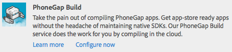

# Mobiele toepassingen maken{#building-mobile-applications}

>[!NOTE]
>
>De Adobe adviseert het gebruiken van de SPARedacteur voor projecten die op kader-gebaseerde cliënt-zijteruggeven van enige paginatoepassing (bijvoorbeeld, Reageren) vereisen. [Meer informatie](/help/sites-developing/spa-overview.md).

Stel uw toepassing samen om deze op een apparaat of simulator te installeren voor testdoeleinden of voor publicatie in de App Store. U kunt toepassingen plaatselijk bouwen gebruikend de Interface van de Lijn van het Bevel PhoneGap, of in de wolk gebruikend PhoneGap Build.

Een volledig geleidelijke artikel op hoe te om een mobiele toepassing te bouwen gebruikend code beschikbaar bij GitHub is beschikbaar [hier](https://helpx.adobe.com/experience-manager/using/aem62_mobile.html).

## De toepassing verplaatsen naar de instantie Publiceren {#moving-the-application-to-the-publish-instance}

Verplaats toepassingsbestanden naar de publicatie-instantie zodat u inhoud-updates kunt opgeven voor de geïnstalleerde exemplaren van de mobiele toepassing en de toepassing kunt bouwen met behulp van de gepubliceerde inhoud. Toepassingen bestaan uit twee knooppuntvertakkingen in de repository:

* `/content/phonegap/apps/<application name>`: De webpagina&#39;s die auteurs maken en activeren.
* `/content/phonegap/content/<application name>`: Toepassingsconfiguratiebestanden en configuraties voor inhoudssynchronisatie.

>[!NOTE]
>
>Als u de toepassingsbestanden niet naar de publicatie-instantie verplaatst, kunnen de makers van inhoud de cache van Content Sync niet bijwerken.

U hoeft de bestanden alleen te verplaatsen in het dialoogvenster `/content/phonegap/content/<application name>` vertakken naar de publicatie-instantie. De bestanden in het dialoogvenster `/content/phonegap/apps/<application name>` vertakking worden verplaatst wanneer de auteur de pagina&#39;s activeert.

AEM biedt twee methoden voor het verplaatsen van bulkinhoud naar de publicatie-instantie:

* [De opdracht Boom activeren gebruiken](/help/sites-authoring/publishing-pages.md) op de replicatieconsole.
* [Een pakket maken](/help/sites-administering/package-manager.md) die de inhoud bevat en het pakket dupliceert.

Er wordt bijvoorbeeld een mobiele toepassing met de naam phonegapapp gemaakt. Het volgende knooppunt moet naar de publicatie-instantie worden verplaatst: /content/phonegap/content/phonegapapp.

**Tip:** Als u een pakket van de auteurinstantie naar de publicatieinstantie wilt verplaatsen, gebruikt u de opdracht Dupliceren in het pakket.


## Samenstellen met de PhoneGap-opdrachtregelinterface {#building-using-the-phonegap-command-line-interface}

Compileer de toepassing PhoneGap op uw computer gebruikend bevel-lijn Interface PhoneGap (CLI). Als u de AEM-inhoud in uw toepassing wilt opnemen, AEM maakt u een ZIP-bestand dat de inhoud van uw mobiele toepassing, configuraties voor inhoudssynchronisatie en andere vereiste elementen bevat. Download het ZIP-bestand en neem het op in uw build.

### Uw ontwikkelomgeving voorbereiden {#preparing-your-build-environment}

Om te bouwen gebruikend CLI PhoneGap, moet u Node.js en het de cliëntnut installeren PhoneGap. U hebt een internetverbinding nodig om de volgende procedure uit te voeren.

1. Downloaden en installeren [Node.js](https://nodejs.org/en).
1. Open een terminal of bevelherinnering en ga het volgende knoopbevel in om het nut te installeren PhoneGap:

   ```shell
   npm install -g phonegap
   ```

   Op een UNIX®- of Linux®-systeem moet u mogelijk een voorvoegsel voor de opdracht toevoegen `sudo`.

   De terminal toont de resultaten van een reeks opdrachten van HTTP-GET. Wanneer de installatie succesvol is, toont de terminal waar de bibliotheken geïnstalleerd gelijkaardig aan het volgende voorbeeld zijn:

   ```xml
   /usr/local/bin/phonegap -> /usr/local/lib/node_modules/phonegap/bin/phonegap.js
   phonegap@3.3.0-0.19.6 /usr/local/lib/node_modules/phonegap
   ├── pluralize@0.0.4
   ├── colors@0.6.0-1
   ├── semver@1.1.0
   ├── qrcode-terminal@0.9.4
   ├── shelljs@0.1.4
   ├── optimist@0.6.0 (...)
   ├── prompt@0.2.11 (...)
   ├── phonegap-build@0.8.4 (...)
   ├── connect-phonegap@0.8.1 (...)
   └── cordova@3.3.0-0.1.1 (...)
   ```

1. (Optioneel) Vraag de SDK aan voor het mobiele platform waarvoor u het doelplatform wilt:

   * Installeer de nieuwste versie van [Xcode](https://developer.apple.com/xcode/).
   * Installeer de [Android™ SDK](https://developer.android.com/).

### Het ZIP-bestand voor inhoud downloaden {#downloading-the-content-zip-file}

Verplaats de inhoud van uw mobiele toepassing naar uw bestandssysteem.

1. Selecteer de toepassing op de pagina Mobiele toepassingen.
1. (Optioneel) Als u de toepassing voor volledige installaties wilt maken, klikt u op de werkbalk op het pictogram Cache wissen.

   

   >[!NOTE]
   >
   >De cache bevat updates van inhoud voor geïnstalleerde toepassingen. Als u de cache wist, worden alle updates in de cache verwijderd.

1. Klik op het pictogram CLI-elementen downloaden op de werkbalk.

   

1. Nadat u het ZIP-bestand hebt opgeslagen, klikt u op Sluiten in het dialoogvenster Succes.
1. Extraheer de inhoud van het ZIP-bestand.

### De CLI van PhoneGap gebruiken om te bouwen {#using-the-phonegap-cli-to-build}

Gebruik de CLI van PhoneGap om de toepassing te compileren en te installeren. Voor informatie over hoe te om CLI te gebruiken PhoneGap, zie de bevel-lijn Interface PhoneGap (`https://docs.phonegap.com/en/3.0.0/guide_cli_index.md.html`).

1. Open een terminal- of opdrachtprompt en wijzig de huidige map in het gedownloade ZIP-bestand van de toepassing. Met de volgende code wordt de map bijvoorbeeld gewijzigd in het bestand ng-app-cli.1392137825303.zip:

   ```shell
   cd ~/Downloads/ng-app-cli.1392137825303
   ```

1. Voer de phonegap-opdracht in voor het platform waarvoor u een doelversie kiest. Met de volgende opdracht wordt bijvoorbeeld de app voor Android™ gemaakt:

   ```shell
   phonegap build android
   ```

## Samenstellen met PhoneGap Build {#building-using-phonegap-build}

Gebruik de PhoneGap-cloudservice om uw app te maken. Om deze procedure uit te voeren, moet u eerst een configuratie van PhoneGap Build tot stand brengen.

### Verbinding maken met PhoneGap Build {#connecting-to-phonegap-build}

Creeer een configuratie van de PhoneGap Build zodat u de diensten van de PhoneGap Build van binnen AEM kunt gebruiken. Geef de gebruikersnaam en het wachtwoord op van de account PhoneGap Build die u wilt gebruiken om uw mobiele toepassingen te maken.

1. Open de pagina Tools. ([http://localhost:4502/tools.html](http://localhost:4502/tools.html)).
1. Klik in het gebied CQ-bewerkingen op Cloud Servicen.
1. Klik op de koppeling Nu configureren voor PhoneGap Build.

   

1. Typ in het dialoogvenster Configuratie maken een waarde voor de eigenschap Titel. Door gebrek, wordt de waarde van het bezit van de Naam afgeleid uit de titel, nochtans kunt u een naam ingaan. Klik op Maken.
1. Typ in het dialoogvenster Configuratie PhoneGap Build uw gebruikersnaam en wachtwoord voor PhoneGap Build en klik op OK.

### PhoneGapen Build gebruiken {#using-phonegap-build}

Verzend uw toepassingsbronnen naar PhoneGap Build voor compilatie voor de verschillende mobiele platforms.

1. Open uw mobiele toepassing op de pagina Mobiele toepassingen. ([http://localhost:4502/mobile.html/content/phonegap](http://localhost:4502/mobile.html/content/phonegap))
1. (Optioneel) Als u de toepassing voor volledige installaties wilt maken, selecteert u de toepassing en klikt u op het pictogram Cache wissen.

   

   >[!NOTE]
   >
   >De cache bevat updates van inhoud voor geïnstalleerde toepassingen. Als u de cache wist, worden alle updates in de cache verwijderd.

1. Selecteer de welkomstpagina en klik op het pictogram Extern maken.

   

   **Opmerking:** De bètaversie van AEM Bèta leidt tot geen Inbox- bericht wanneer de bouwstijl met succes voltooit.

1. Klik in het dialoogvenster Succes op PhoneGap Build om de Adobe PhoneGap Build-pagina te openen op `https://build.phonegap.com/apps`. Als u wacht tot uw app wordt weergegeven, kunt u de status van het PhoneGap Build controleren op `https://status.build.phonegap.com/`.

   Voor informatie over het installeren van de build raadpleegt u de [Documentatie PhoneGap Build](https://github.com/phonegap/phonegap-docs/tree/master/docs/4-phonegap-build).

   >[!NOTE]
   >
   >Gratis PhoneGapen Build accounts zijn toegestaan op één privétoepassing. PhoneGap-builds mislukken als u een extra privétoepassing bouwt.

### De volgende stappen {#the-next-steps}

De volgende stap na het bouwproces leert over de [Structuur van een app](/help/mobile/phonegap-structure-an-app.md).
