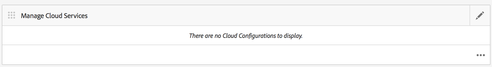
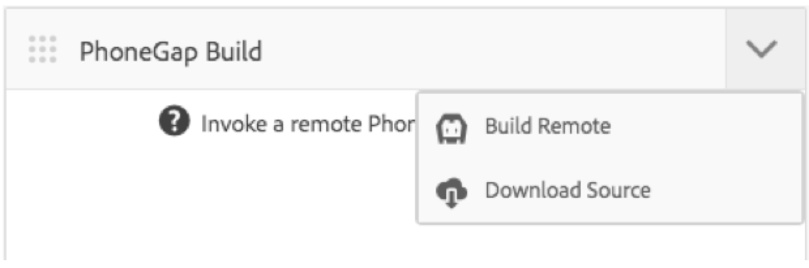

# Adobe PhoneGap Build-Cloud Service configureren {#configure-your-adobe-phonegap-build-cloud-service}

{{ue-over-mobile}}

Het **PhoneGap Build Tile** op het toepassingsdashboard laat u uw mobiele toepassing PhoneGap door de Dienst van Adobe PhoneGap Build bouwen en verdelen.

Alle gesteunde platforms die binnen de **worden bepaald leiden App** tegel worden gebouwd met PhoneGap Build wanneer het duwen van een verre bouwstijl met de **PhoneGap Build** Tegel.

U kunt een externe build naar `https://build.phonegap.com` duwen of de bron downloaden om lokaal te bouwen met PhoneGap CLI op `https://docs.phonegap.com/references/phonegap-cli/` .


## De Cloud Service configureren {#configuring-the-cloud-service}

Om uit PhoneGap Build voordeel te halen, moet u de Cloud Service van AEM PhoneGap Build met uw de rekeningsinformatie van PhoneGapen Build vormen.

Als u momenteel geen account hebt, navigeert u naar `https://build.phonegap.com` en meldt u zich aan! Als u een Adobe Creative Cloud-lidmaatschap hebt, hebt u mogelijk ondersteuning voor maximaal 25 persoonlijke apps (apps zonder open bron).

Zodra u hebt geverifieerd uw rekening van PhoneGap Build actief is, navigeer aan uw Console van het Beheer van de Wolk van de AEM, specifiek de [&#x200B; Cloud Service van PhoneGap Build &#x200B;](http://localhost:4502/etc/cloudservices/phonegap-build.html) (http://localhost:4502/etc/cloudservices/phonegap-build.html).

Gebruik **beheer Cloud Servicen** tegel om een nieuwe configuratie van de wolkendienst te vormen.

### De tegel Cloud Servicen beheren gebruiken {#using-manage-cloud-services-tile}

Alvorens te beginnen uw app te bouwen gebruikend **PhoneGap Build** tegel, moet u uw wolkendiensten vormen, gebruikend **beheren Cloud Servicen** tegel van het dashboard van AEM Mobile.

Volg onderstaande stappen om cloudservices voor uw app te configureren:

1. Klik de hoogste-juiste hoek van **beheren Cloud Servicen** tegel.

   

1. Kies **PhoneGap Build** optie van **toevoegen of het scherm van de Cloud Service** uitgeven.

   Klik op **Next**.

   

1. Voer uw gegevens in zodat u een cloudconfiguratie kunt maken.

   Zodra het wordt geverifieerd, klik **voorleggen**. Deze gevormde wolkenconfiguratie toont nu in **beheert Cloud Servicen** tegel.

   

### Uw toepassing samenstellen met PhoneGap Build {#building-your-application-with-phonegap-build}

Zodra u de wolkendiensten hebt gevormd, kunt u uw toepassing met **PhoneGap Build** tegel bouwen. Klik de top-juiste hoek zodat kunt u van **kiezen bouwt Verre** of **download Source** opties.



Om ver aan te halen bouwt met Adobe PhoneGap Build, klik **Verre Bouwstijl**.

>[!NOTE]
>
>Als de build om welke reden dan ook mislukt (het rode iOS-pictogram geeft hieronder aan dat het platform is mislukt), kunt u de muisaanwijzer boven het pictogram plaatsen om het foutbericht op te halen. U kunt ook op de drievoudige stip &#39;...&#39; onder aan de tegel klikken om rechtstreeks naar `https://build.phonegap.com` te navigeren (u moet verifiëren) en uw build rechtstreeks te bekijken en beheren.

### Uw toepassing samenstellen met PhoneGap CLI {#building-your-application-with-phonegap-cli}

PhoneGap biedt een opdrachtregelinterface om uw toepassing lokaal te maken.

Compileer de toepassing PhoneGap op uw computer gebruikend bevel-Lijn Interface PhoneGap (CLI). Als u de AEM-inhoud in uw toepassing wilt opnemen, AEM maakt u een ZIP-bestand dat de inhoud van uw mobiele toepassing, configuraties voor inhoudssynchronisatie en andere vereiste elementen bevat. Download het ZIP-bestand en neem het op in uw build.

Om uit CLI van PhoneGap voordeel te halen, moet u opstelling uw lokale milieu omvatten:

1. Platform SDK (iOS, Android™, WindowsPhone, ...) en
1. PhoneGap CLI

U kunt hier op `https://docs.phonegap.com/references/phonegap-cli/` meer lezen.

Nadat u de voorwaarden hebt geïnstalleerd, kunt u het beste een eenvoudige test uitvoeren door een eenvoudige app te maken en deze in de simulator of beter nog op het apparaat uit te voeren. U kunt het dan proberen:

```xml
phonegap create myApp
cd myApp
phonegap run ios (or android, ...)
```

>[!NOTE]
>
>Toevoegen — emuleren aan het einde van deze regel als u deze niet wilt uitvoeren op het aangesloten apparaat.

Zodra u hebt geverifieerd dat de bovenstaande werken, gebruik de **Tegel van 0&rbrace; PhoneGapen Build &lbrace;aan** Download Source **.** Sla het bestand op en decomprimeer het naar uw lokale systeem. Zodra dat gebeurt:

* naar dat opgeslagen bestand (map) navigeren
* run &#39;phonegap run ios&#39; (of android, enzovoort)

### Aanvullende bronnen {#additional-resources}

Zie de volgende bronnen voor meer informatie over de rollen en verantwoordelijkheden van auteurs en ontwikkelaars:

* [Ontwikkelen voor Adobe PhoneGap Enterprise met AEM](/help/mobile/developing-in-phonegap.md)
* [Ontwerpen voor Adobe PhoneGap Enterprise in AEM](/help/mobile/phonegap.md)
