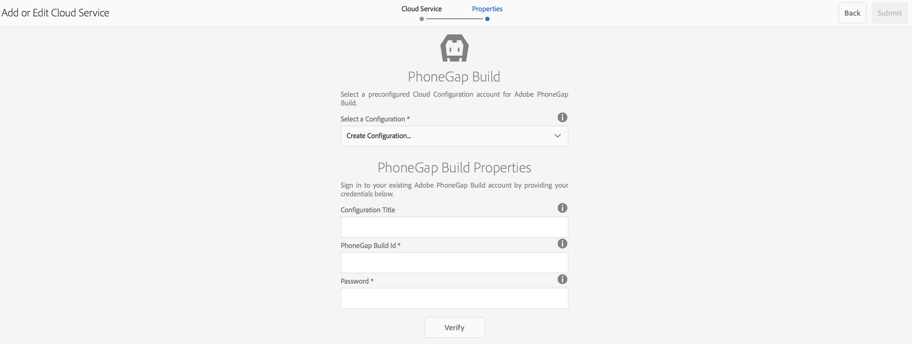

# Adobe PhoneGap Build-Cloud Service configureren {#configure-your-adobe-phonegap-build-cloud-service}

>[!NOTE]
>
>De Adobe adviseert het gebruiken van de SPARedacteur voor projecten die op kader-gebaseerde cliënt-zijteruggeven van enige paginatoepassing (bijvoorbeeld, Reageren) vereisen. [Meer informatie](/help/sites-developing/spa-overview.md).

De **PhoneGap Build tegel** op het toepassingsdashboard kunt u uw mobiele toepassing PhoneGap bouwen en distribueren via de Adobe PhoneGap Build Service.

Alle ondersteunde platforms die zijn gedefinieerd in het dialoogvenster **App beheren** De tegel wordt met PhoneGap Build gebouwd wanneer het duwen van een verre bouwstijl met de **PhoneGap Build** Tegel.

U kunt een externe build naar `https://build.phonegap.com` of download de bron om lokaal samen te stellen met PhoneGap CLI op `https://docs.phonegap.com/references/phonegap-cli/`.


## De Cloud Service configureren {#configuring-the-cloud-service}

Om uit PhoneGap Build voordeel te halen, moet u de Cloud Service van AEM PhoneGap Build met uw de rekeningsinformatie van PhoneGapen Build vormen.

Als u momenteel geen account hebt, navigeert u naar `https://build.phonegap.com` en meld u aan! Als u een Adobe Creative Cloud-lidmaatschap hebt, hebt u mogelijk ondersteuning voor maximaal 25 persoonlijke apps (apps zonder open bron).

Als u hebt gecontroleerd of uw PhoneGap Build-account actief is, navigeert u naar de AEM Cloud Management Console, met name de [PhoneGap Build Cloud Service](http://localhost:4502/etc/cloudservices/phonegap-build.html) (http://localhost:4502/etc/cloudservices/phonegap-build.html)

Gebruik de **Cloud Servicen beheren** tegel om een nieuwe configuratie van de wolkendienst te vormen.

### De tegel Cloud Servicen beheren gebruiken {#using-manage-cloud-services-tile}

Voordat u begint met het maken van uw app met **PhoneGap Build** blok, moet u uw wolkendiensten vormen, gebruikend **Cloud Servicen beheren** tegel van het AEM Mobile-dashboard.

Volg onderstaande stappen om cloudservices voor uw app te configureren:

1. Klik op de rechterbovenhoek van het dialoogvenster **Cloud Servicen beheren** tegel.

   

1. Kies **PhoneGap Build** van de **Cloud Service toevoegen of bewerken** scherm.

   Klik op **Next**.

   

1. Voer uw gegevens in zodat u een cloudconfiguratie kunt maken.

   Klik op **Verzenden**. Deze geconfigureerde cloudconfiguratie wordt nu weergegeven in het dialoogvenster **Cloud Servicen beheren** tegel.

   

### Uw toepassing samenstellen met PhoneGap Build {#building-your-application-with-phonegap-build}

Nadat u de cloudservices hebt geconfigureerd, kunt u uw toepassing samenstellen met **PhoneGap Build** tegel. Klik op de rechterbovenhoek, zodat u een keuze kunt maken in het menu **Extern samenstellen** of **Bron downloaden** opties.


Als u een externe build wilt aanroepen met Adobe PhoneGap Build, klikt u op **Extern samenstellen**.

>[!NOTE]
>
>Als de build om welke reden dan ook mislukt (het rode iOS-pictogram geeft hieronder aan dat het platform is mislukt), kunt u de muisaanwijzer boven het pictogram plaatsen om het foutbericht op te halen. U kunt ook op de drievoudige stip &#39;...&#39; onder aan de tegel klikken om rechtstreeks naar `https://build.phonegap.com` (u moet verifiëren) en bekijk en beheer uw bouwstijl direct.

### Uw toepassing samenstellen met PhoneGap CLI {#building-your-application-with-phonegap-cli}

PhoneGap biedt een opdrachtregelinterface om uw toepassing lokaal te maken.

Compileer de toepassing PhoneGap op uw computer gebruikend bevel-Lijn Interface PhoneGap (CLI). Als u de AEM-inhoud in uw toepassing wilt opnemen, AEM maakt u een ZIP-bestand dat de inhoud van uw mobiele toepassing, configuraties voor inhoudssynchronisatie en andere vereiste elementen bevat. Download het ZIP-bestand en neem het op in uw build.

Om uit CLI van PhoneGap voordeel te halen, moet u opstelling uw lokale milieu omvatten:

1. Platform SDK (iOS, Android™, WindowsPhone, ...) en
1. PhoneGap CLI

Meer informatie hier vindt u op `https://docs.phonegap.com/references/phonegap-cli/`.

Nadat u de voorwaarden hebt geïnstalleerd, kunt u het beste een eenvoudige test uitvoeren door een eenvoudige app te maken en deze in de simulator of beter nog op het apparaat uit te voeren. U kunt het dan proberen:

```xml
phonegap create myApp
cd myApp
phonegap run ios (or android, ...)
```

>[!NOTE]
>
>Toevoegen — emuleren aan het einde van deze regel als u deze niet wilt uitvoeren op het aangesloten apparaat.

Nadat u hebt gecontroleerd of het bovenstaande werkt, kunt u de opdracht **PhoneGap Build** Naast elkaar **Bron downloaden**. Sla het bestand op en decomprimeer het naar uw lokale systeem. Zodra dat gebeurt:

* naar dat opgeslagen bestand (map) navigeren
* run &#39;phonegap run ios&#39; (of android, enzovoort)

### Aanvullende bronnen {#additional-resources}

Zie de volgende bronnen voor meer informatie over de rollen en verantwoordelijkheden van auteurs en ontwikkelaars:

* [Ontwikkelen voor Adobe PhoneGap Enterprise met AEM](/help/mobile/developing-in-phonegap.md)
* [Ontwerpen voor Adobe PhoneGap Enterprise in AEM](/help/mobile/phonegap.md)
