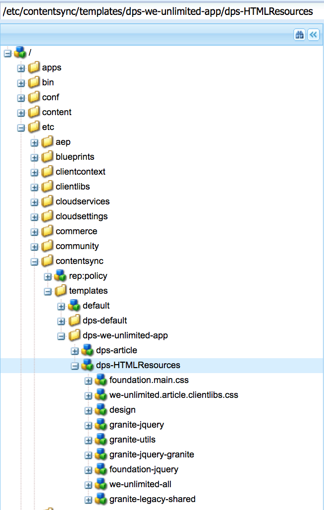

# Het creëren van de Configuratie van de Uitvoer van Gedeelde Middelen{#creating-shared-resources-export-configuration}

>[!NOTE]
>
>Adobe raadt aan de SPA Editor te gebruiken voor projecten die renderen op basis van één pagina voor toepassingsframework op de client-side vereisen (bijvoorbeeld Reageren). [Meer](/help/sites-developing/spa-overview.md) informatie.

>[!CAUTION]
>
>**Vereiste**:
>
>Alvorens over het creëren van en het wijzigen van gedeelde middelen te leren, zie [Content Sync](/help/mobile/mobile-ondemand-contentsync.md) om de basisconcepten te begrijpen.

AEM Mobile-gebruikers gebruiken Content Sync om live-inhoud te exporteren naar statische inhoud voor gebruik in Mobile Apps. Deze export vindt plaats wanneer inhoud vanuit AEM Mobile wordt geüpload naar Mobile On-Demand Services.

De eigenschap ***dps-exportTemplate*** die in de bovenstaande tabel wordt vermeld, definieert het pad naar de exportconfiguraties van de app. Stel deze eigenschap in om gedeelde bronnen te maken en te wijzigen.

In de volgende bronnen wordt beschreven hoe u gedeelde bronnen van Adobe Experience Manager (AEM) exporteert voor uploaden naar AEM Mobile.

Met gedeelde HTML-bronnen kunnen artikelen HTML-bronnen delen die anders voor alle artikelen moeten worden gedupliceerd en kunnen pictogrammen, lettertypen, javascript en css worden opgenomen.

De configuratie van de Synchronisatie van de Inhoud die bij **&lt;dps-exportTemplate>/dps-HTMLResources>** wordt gevonden zou moeten worden gevormd om al inhoud uit te voeren een artikel dat voor bezit statische het teruggeven op apparaat wordt vereist.

>[!CAUTION]
>
>U kunt de onderstaande stappen uitvoeren om voorbeelden van gedeelde bronnen weer te geven, alleen als u beschikt over:
>
>* de voorbeeldinhoud geïnstalleerd
>* uitvoeren, AEM
>* geen gevormde douanecontext of een verschillende haven

>

Zie de onderstaande stappen voor een voorbeeld van een gedeelde bron:

1. Open CRXDE Lite op uw AEM.
1. Blader naar dit pad *[/etc/contentSync/templates/dps-we-oneindig-app/dps-HTMLResources](http://localhost:4502/crx/de/index.jsp#/etc/contentsync/templates/dps-we-unlimited-app/dps-HTMLResources)* om het voorbeeld van gedeelde bronnen weer te geven.

   U kunt alle eigenschappen bekijken die voor het creëren van uw gedeelde middelen zoals aangetoond in het hieronder cijfer worden vereist:

   

>[!NOTE]
>
>De gedeelde middelen zouden moeten worden geupload of worden uitgevoerd naar AEM Mobile On-demand Services wanneer om het even welke gedeelde middelen veranderen.

