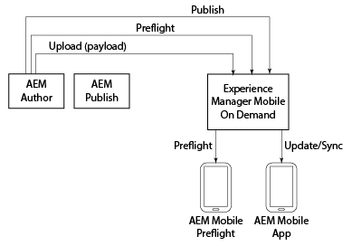

# AEM Mobile On-Demand{#aem-mobile-on-demand}

>[!NOTE]
>
>Adobe raadt aan de SPA Editor te gebruiken voor projecten die renderen op basis van één pagina voor toepassingsframework op de client-side vereisen (bijvoorbeeld Reageren). [Meer](/help/sites-developing/spa-overview.md) informatie.

>[!NOTE]
>
>Zie [AEM Mobile On-demand Services Help](https://helpx.adobe.com/digital-publishing-solution/topics.html) als u AEM niet gebruikt als bron voor inhoudsbeheer.

AEM biedt verschillende gereedschappen waarmee u uw inhoud kunt integreren in mobiele toepassingen.

In het volgende diagram ziet u hoe de verschillende componenten van AEM Mobile en On-Demand Services in elkaar passen om inhoud aan mobiele apps te leveren.

AEM Preflight-toepassing kan worden beschouwd als een testomgeving voor het voorvertonen van de app en inhoud voordat deze wordt gepubliceerd; overwegende dat de AEM Mobile App de uiteindelijke app is die is gemaakt voor distributie.

>[!NOTE]
>
>Zie [De Preflight-app AEM](https://helpx.adobe.com/digital-publishing-solution/help/preflight-app.html) in de Help van AEM Mobile On-demand Services gebruiken voor meer informatie over Preflight.

>[!NOTE]
>
>In het diagram hierboven, wordt AEM publiceren instantie niet vereist voor een typisch plaatsingsscenario aan AEM Mobile On-demand Services.

## Een nieuwe mobiele toepassing starten {#starting-a-new-mobile-app}

AEM Mobile is slechts één pijler die het volledige AEM platform vormt.

Voor het starten van een nieuwe AEM Mobile-app-ervaring is een consistente rolcombinatie vereist voordat deze gereed is voor het bewerken van inhoud. De volgende rollen bieden een beginpunt voor het maken van een nieuwe AEM Mobile-toepassing:

* **Beheerder**
* **Developer**
* **Auteur**

>[!NOTE]
>
>Voordat u met AEM Mobile gaat werken en de stappen in deze gids voor aan de slag uitvoert, moeten gebruikers vertrouwd zijn met AEM. Leer de grondbeginselen van AEM [hier](/help/sites-deploying/deploy.md).

### Het AEM Mobile-toepassingsdashboard {#understanding-the-aem-mobile-application-dashboard}

Voordat de gebruiker de rollen en verantwoordelijkheden begrijpt, moet hij of zij op de hoogte zijn van **AEM Mobile Control Center** of het **Application Dashboard**. Klik [hier](/help/mobile/mobile-apps-ondemand-application-dashboard.md) voor een diepgaand begrip.

### AEM-beheerder {#aem-administrator}

Een ***AEM beheerder*** is verantwoordelijk voor het toevoegen van een nieuwe toepassing aan de catalogus van AEM Mobile, of door een nieuwe toepassing te creëren gebruikend de aanmaaktovenaar, of door een bestaande toepassing te importeren. AEM beheerders die een nieuwe app maken met behulp van de AEM Mobile *ontwerpwizard*, selecteren doorgaans een van de gewenste toepassingssjablonen uit de referentiemonsters die buiten de box vallen of (in de meeste gevallen) een aangepaste toepassingssjabloon die is gemaakt door *AEM ontwikkelaars.*

Een AEM beheerder is verantwoordelijk voor de volgende taken wanneer u een app maakt met AEM Mobile On-demand Services:

* [AEM Mobile instellen](/help/mobile/aem-mobile-setup.md)
* [Uw gebruikers- en gebruikersgroepen configureren](/help/mobile/aem-mobile-configure-users.md)
* [Voorvertonen met Preflight](/help/mobile/aem-mobile-manage-ondemand-services.md)
* [Inhoudsservices beheren](/help/mobile/developing-content-services.md)

Zie [Inhoud beheren voor gebruik van AEM Mobile On-demand Services](/help/mobile/aem-mobile.md) om aan de slag te gaan met de rollen en verantwoordelijkheden van een beheerder.

## AEM Developer {#aem-developer}

Een **AEM ontwikkelaar** breidt en creeert douaneWebmalplaatjes en componenten uit om *AEM Auteur *toe te laten om mooie en boeiende mobiele ervaringen tot stand te brengen. Deze sjablonen en componenten zijn niet alleen geoptimaliseerd voor mobiele apps; maar communiceer zowel aan het apparaat als aan de AEM server (om het even welke verre server) aan de eindpunten van de netwerkdienst. AEM ingebouwde inhoudeditor wordt gebruikt door AEM-auteurs *om rijke en relevante ervaringen in de app te creëren, waaronder integratie met de rest van de Adobe Marketing Cloud.*

Een AEM ontwikkelaar is verantwoordelijk voor de volgende taken bij het maken van een app met AEM Mobile On-demand Services:

* [App-sjablonen en -componenten](/help/mobile/app-templates-and-components1.md)
* [Mobiel met inhoudssynchronisatie](/help/mobile/mobile-ondemand-contentsync.md)
* [Eigenschappen van inhoud en inhoud exporteren](/help/mobile/on-demand-content-properties-exporting.md)
* [AEM Mobile Content Services ontwikkelen](//help/mobile/developing-content-services.md)

Om met de rollen en de verantwoordelijkheden van de Ontwikkelaar te beginnen, zie [Ontwikkelen AEM Inhoud voor AEM Mobile On-demand Services](/help/mobile/aem-mobile-on-demand.md).

>[!NOTE]
>
>De rol *AEM ontwikkelaar* begint en eindigt niet met de ontwikkeling van sjablonen en componenten. Een *AEM ontwikkelaar* kan een volledig nieuwe app creëren eerder dan eenvoudig het uit-van-de-doos steekproef van de verwijzingsimplementatie uit te breiden.

## AEM-auteur {#aem-author}

Een ***AEM-auteur* (of *Marketer*)**gebruikt de aangepaste ontwikkelde of out-of-the-box sjablonen en componenten om pagina&#39;s toe te voegen en te bewerken, componenten te slepen en neer te zetten en media van alle typen van de DAM toe te voegen, inclusief afbeeldingen, video&#39;s en tekstfragmenten (inhoudsfragmenten). AEM ingebouwde inhoudeditor wordt vervolgens gebruikt door *AEM-auteurs* om rijke en relevante ervaringen in de app te creëren, waaronder integratie met de rest van de Adobe Marketing Cloud.

Een AEM auteur moet de volgende onderwerpen begrijpen wanneer hij een app maakt met AEM Mobile On-demand Services:

* [AEM Mobile-toepassingsdashboard](/help/mobile/mobile-apps-ondemand-application-dashboard.md)
* [Handelingen voor het maken en configureren van toepassingen](/help/mobile/mobile-apps-ondemand-application-create-configure-action.md)
* [Cloud Configuration](/help/mobile/mobile-on-demand-associating-an-on-demand-app-to-cloud-configuration.md)
* [Inhoud beheren](/help/mobile/mobile-apps-ondemand-manage-content-ondemand.md)
* [Overzicht van Content Services](/help/mobile/develop-content-as-a-service.md)

Zie [AEM Inhoud ontwerpen voor AEM Mobile On-demand Services App](/help/mobile/mobile-apps-ondemand.md) om aan de slag te gaan met de rollen en verantwoordelijkheden van een auteur.

>[!NOTE]
>
>Een AEM-auteur is ook verantwoordelijk voor het instellen van machtigingen, het maken van kaarten en lay-outs en het verzenden van pushberichten. Voor meer informatie over methoden voor het ontwerpen van inhoud. het beheren van voorwerpen en verzamelingen; het creëren van banners, kaarten, en lay-outs in AEM Mobile, zie [AEM Mobile On-Demand Portal](https://helpx.adobe.com/digital-publishing-solution/topics.html#dynamicpod_reference_2).

