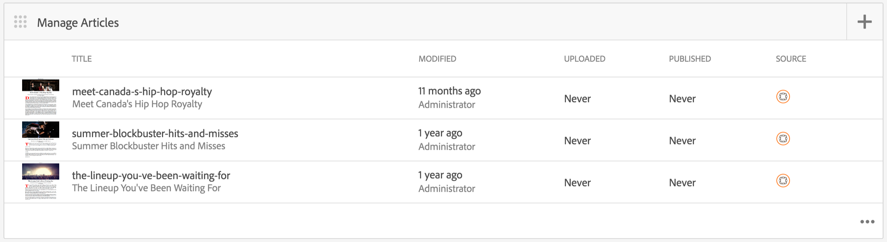

# AEM Mobile-toepassingsdashboard {#aem-mobile-application-dashboard}

>[!NOTE]
>
>De Adobe adviseert het gebruiken van de SPARedacteur voor projecten die op kader-gebaseerde cliënt-zijteruggeven van enige paginatoepassing (bijvoorbeeld, Reageren) vereisen. [ leer meer ](/help/sites-developing/spa-overview.md).

U kunt uw toepassing en inhoud van mobiele apps beheren vanuit het AEM Mobile-toepassingsdashboard of het Control Center.

U kunt in elke tegel in het Centrum van de Controle boren om details te bekijken of uit te geven door &quot;...&quot;in de bodem juiste hoek te klikken.

>[!NOTE]
>
>U kunt de volgorde van de tegels wijzigen door op het grijppictogram van de tegel te klikken (9 punten linksboven). De orderwijziging is gebruikersspecifiek - anders voor individuele gebruikers.

Voor het beheren van app-inhoud is een gezamenlijke inspanning van ontwikkelaars, makers van inhoud en beheerders vereist. Auteurs manipuleren pagina&#39;s, die op hun beurt gebaseerd zijn op sjablonen en componenten die door ontwikkelaars van apps worden gegenereerd.

Tot slot publiceren beheerders strategisch de bijgewerkte app-inhoud.

## De app-tegel beheren {#the-manage-app-tile}

**beheer app** toont beschikbare toepassingsinformatie:

* Titel
* Beschrijving
* Pictogram
* Laatst gewijzigd
* Laatst gewijzigd door

## De verbindingstegel beheren {#the-manage-connection-tile}

Het **beheert de 1} tegels van de Verbinding {toont de de verbindingsinformatie van AEM Mobile On-demand Services:**

* Naam van cloudconfiguratie
* Projectnaam en -id
* Verbindingsstatus

>[!NOTE]
>
>Klik op de versnelling rechtsboven om een mobiele configuratie op aanvraag in te stellen.
>
>Zie [ Vormend Mobiele On-Demand Services ](/help/mobile/mobile-on-demand-associating-an-on-demand-app-to-cloud-configuration.md) voor details.

## Entiteiten beheren {#managing-entities}

Deze drie tegels bieden een overzicht van de status van de inhoud van een app:

* **banners**
* **artikelen**
* **inzamelingen**

Elke tegel kan worden uitgebreid om een gedetailleerdere lijstmening te verstrekken door op de ellips (...) in de bodem juiste hoek te klikken. Deze lijstweergaven bieden een andere manier om toegang te krijgen tot veelgebruikte Mobile On Demand-acties, zoals eigenschappen voor verwijderen, uploaden en bewerken.

### De tegel Banners beheren {#the-manage-banners-tile}

**beheert Banners** tegel laat u de inhoud voor een banner beheren. De volgende informatie wordt weergegeven voor een banner:

* image
* **TITLE**: naam van de banner
* **GEWIJZIGD**: laatst gewijzigd in AEM
* **GEÜPLOADED**: laatst geupload van AEM
* **GEPUBLICEERD**: laatst gepubliceerde verzoekvorm AEM
* **SOURCE**: bron (AEM lokaal of ver van Mobiel op bestelling)

Het volgende beeld toont **beheert Banners** tegel in het dashboard van de Toepassing van AEM Mobile:

>[!NOTE]
>
>Zie **[het Leiden Banners](/help/mobile/mobile-on-demand-managing-banners.md)** voor het creëren van, het schrappen van, of het bijwerken van de banners.

### De tegel Artikelen beheren {#the-manage-articles-tile}

De **beheert Artikelen** tegels laat u de inhoud voor een artikel beheren. De volgende informatie wordt weergegeven voor een artikel:

* image
* **TITLE**: naam van het artikel
* **GEWIJZIGD**: laatst gewijzigd in AEM
* **GEÜPLOADED**: laatst geupload van AEM
* **GEPUBLICEERD**: laatst gepubliceerde verzoekvorm AEM
* **SOURCE**: bron (AEM lokaal of ver van Mobiel op bestelling)

Het volgende beeld toont de **beheert Artikel** tegel in het Dashboard van de Toepassing van AEM Mobile:

>[!NOTE]
>
>Zie [**het Leiden Artikelen**](/help/mobile/mobile-on-demand-managing-articles.md) voor het creëren van, het schrappen van, of het bijwerken van de artikelen.

### De tegel Verzamelingen beheren {#the-manage-collections-tile}

De **beheert inzamelingen** tegel laat u de inhoud voor een inzameling beheren. De volgende informatie wordt getoond voor een inzameling:

* image
* **TITLE**: naam van de inzameling
* **GEWIJZIGD**: laatst gewijzigd in AEM
* **GEÜPLOADED**: laatst geupload van AEM
* **GEPUBLICEERD**: laatst gepubliceerde verzoekvorm AEM
* **SOURCE**: bron (AEM lokaal of ver van Mobiel op bestelling)

Het volgende beeld toont **beheert de tegel van Inzamelingen** in het Dashboard van de Toepassing van AEM Mobile:

>[!NOTE]
>
>Zie **[het Leiden Verzamelingen](/help/mobile/mobile-on-demand-managing-collections.md)** voor het creëren van, het schrappen van, of het bijwerken van de inzamelingen.

### De volgende stappen {#the-next-steps}

Wanneer u bekend bent met het toepassingsdashboard, raadpleegt u de volgende bronnen om een mobiele app te maken:

* [Handelingen voor het maken en configureren van toepassingen](/help/mobile/mobile-apps-ondemand-application-create-configure-action.md)
* [Een On-Demand-app koppelen aan een Cloud Configuration](/help/mobile/mobile-on-demand-associating-an-on-demand-app-to-cloud-configuration.md)
* [Handelingen voor inhoudsbeheer](/help/mobile/mobile-apps-ondemand-manage-content-ondemand.md)

### Aanvullende bronnen {#additional-resources}

Meer informatie over de rollen en verantwoordelijkheden van een Beheerder en Ontwikkelaar vindt u in de volgende bronnen:

* [AEM voor AEM Mobile On-demand Services ontwikkelen](/help/mobile/aem-mobile-on-demand.md)
* [Inhoud beheren voor gebruik van AEM Mobile On-demand Services](/help/mobile/aem-mobile.md)
