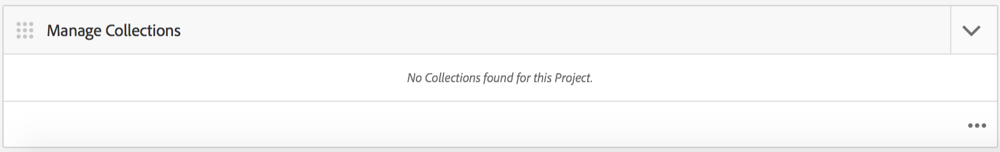

# AEM Mobile-toepassingsdashboard {#aem-mobile-application-dashboard}

>[!NOTE]
>
>De Adobe adviseert het gebruiken van de SPARedacteur voor projecten die op kader-gebaseerde cliënt-zijteruggeven van enige paginatoepassing (bijvoorbeeld, Reageren) vereisen. [Meer informatie](/help/sites-developing/spa-overview.md).

U kunt uw toepassing en inhoud van mobiele apps beheren vanuit het AEM Mobile-toepassingsdashboard of het Control Center.

U kunt in elke tegel in het Centrum van de Controle boren om details te bekijken of uit te geven door &quot;...&quot;in de bodem juiste hoek te klikken.

>[!NOTE]
>
>U kunt de volgorde van de tegels wijzigen door op het grijppictogram van de tegel te klikken (9 punten linksboven). De orderwijziging is gebruikersspecifiek - anders voor individuele gebruikers.

Voor het beheren van app-inhoud is een gezamenlijke inspanning van ontwikkelaars, makers van inhoud en beheerders vereist. Auteurs manipuleren pagina&#39;s, die op hun beurt gebaseerd zijn op sjablonen en componenten die door ontwikkelaars van apps worden gegenereerd.

Tot slot publiceren beheerders strategisch de bijgewerkte app-inhoud.

## De app-tegel beheren {#the-manage-app-tile}

De **App beheren** De tegel geeft beschikbare toepassingsinformatie weer:

* Titel
* Beschrijving
* Pictogram
* Laatst gewijzigd
* Laatst gewijzigd door

## De verbindingstegel beheren {#the-manage-connection-tile}

De **Verbinding beheren** De tegel geeft de AEM Mobile On-demand Services-verbindingsgegevens weer:

* Naam van cloudconfiguratie
* Projectnaam en -id
* Verbindingsstatus

>[!NOTE]
>
>Klik op de versnelling rechtsboven om een mobiele configuratie op aanvraag in te stellen.
>
>Zie [Mobiele services op aanvraag configureren](/help/mobile/mobile-on-demand-associating-an-on-demand-app-to-cloud-configuration.md) voor meer informatie.

## Entiteiten beheren {#managing-entities}

Deze drie tegels bieden een overzicht van de status van de inhoud van een app:

* **banners**
* **artikelen**
* **verzamelingen**

Elke tegel kan worden uitgebreid om een gedetailleerdere lijstmening te verstrekken door op de ellips (...) in de bodem juiste hoek te klikken. Deze lijstweergaven bieden een andere manier om toegang te krijgen tot veelgebruikte Mobile On Demand-acties, zoals eigenschappen voor verwijderen, uploaden en bewerken.

### De tegel Banners beheren {#the-manage-banners-tile}

De **Banners beheren** Met de tegel kunt u de inhoud van een banner beheren. De volgende informatie wordt weergegeven voor een banner:

* image
* **TITEL**: naam van de banner
* **GEWIJZIGD**: laatst gewijzigd in AEM
* **GEÜPLOAD**: laatst geüpload vanaf AEM
* **GEPUBLICEERD**: laatste gepubliceerde aanvraagformulier AEM
* **BRON**: bron (AEM lokaal of extern van Mobile On Demand)

In de volgende afbeelding wordt de **Banners beheren** tegel in AEM Mobile-toepassingsdashboard:

>[!NOTE]
>
>Zie **[Banners beheren](/help/mobile/mobile-on-demand-managing-banners.md)** voor het maken, verwijderen of bijwerken van de banners.

### De tegel Artikelen beheren {#the-manage-articles-tile}

De **Artikelen beheren** Met de tegel kunt u de inhoud van een artikel beheren. De volgende informatie wordt weergegeven voor een artikel:

* image
* **TITEL**: naam van het artikel
* **GEWIJZIGD**: laatst gewijzigd in AEM
* **GEÜPLOAD**: laatst geüpload vanaf AEM
* **GEPUBLICEERD**: laatste gepubliceerde aanvraagformulier AEM
* **BRON**: bron (AEM lokaal of extern van mobiel op aanvraag)

In de volgende afbeelding wordt de **Artikelen beheren** tegel in AEM Mobile-toepassingsdashboard:

>[!NOTE]
>
>Zie [**Artikelen beheren**](/help/mobile/mobile-on-demand-managing-articles.md) voor het maken, verwijderen of bijwerken van de artikelen.

### De tegel Verzamelingen beheren {#the-manage-collections-tile}

De **Verzamelingen beheren** Met de tegel kunt u de inhoud voor een verzameling beheren. De volgende informatie wordt getoond voor een inzameling:

* image
* **TITEL**: naam van de verzameling
* **GEWIJZIGD**: laatst gewijzigd in AEM
* **GEÜPLOAD**: laatst geüpload vanaf AEM
* **GEPUBLICEERD**: laatste gepubliceerde aanvraagformulier AEM
* **BRON**: bron (AEM lokaal of extern van mobiel op aanvraag)

In de volgende afbeelding wordt de **Verzamelingen beheren** tegel in AEM Mobile-toepassingsdashboard:

>[!NOTE]
>
>Zie **[Verzamelingen beheren](/help/mobile/mobile-on-demand-managing-collections.md)** voor het maken, verwijderen of bijwerken van verzamelingen.

### De volgende stappen {#the-next-steps}

Wanneer u bekend bent met het toepassingsdashboard, raadpleegt u de volgende bronnen om een mobiele app te maken:

* [Handelingen voor het maken en configureren van toepassingen](/help/mobile/mobile-apps-ondemand-application-create-configure-action.md)
* [Een On-Demand-app koppelen aan een Cloud Configuration](/help/mobile/mobile-on-demand-associating-an-on-demand-app-to-cloud-configuration.md)
* [Handelingen voor inhoudsbeheer](/help/mobile/mobile-apps-ondemand-manage-content-ondemand.md)

### Aanvullende bronnen {#additional-resources}

Meer informatie over de rollen en verantwoordelijkheden van een Beheerder en Ontwikkelaar vindt u in de volgende bronnen:

* [AEM voor AEM Mobile On-demand Services ontwikkelen](/help/mobile/aem-mobile-on-demand.md)
* [Inhoud beheren voor gebruik van AEM Mobile On-demand Services](/help/mobile/aem-mobile.md)
