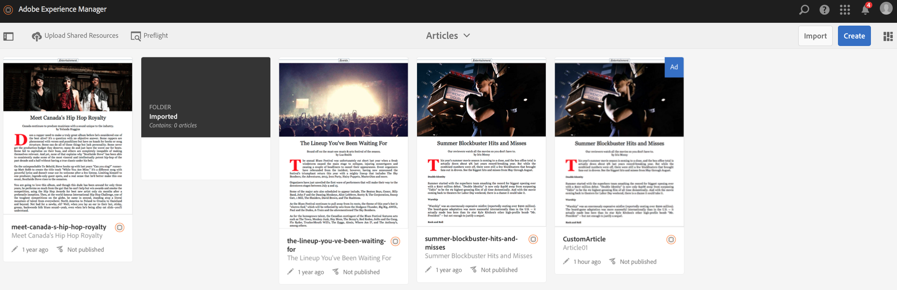

# Gedeelde bronnen uploaden {#uploading-shared-resources}

>[!NOTE]
>
>Adobe adviseert gebruikend de Redacteur van het KUUROORD voor projecten die op kader-gebaseerde cliënt-zijteruggeven van enige paginatoepassing (b.v. Reageren) vereisen. [Meer](/help/sites-developing/spa-overview.md)informatie.

De acties van het Beheer van de inhoud zijn de bouwstenen die helpen om inhoud binnen een toepassing tot stand te brengen en te beheren. De volgende handelingen worden uitgevoerd op inhoud binnen de toepassing.

>[!NOTE]
>
>Zie [Ontwerpoverwegingen voor mobiele AEM-apps](https://helpx.adobe.com/digital-publishing-solution/help/design-app.html) in de online Help voor meer informatie over ontwerpoverwegingen voor mobiele AEM-apps.

>[!CAUTION]
>
>U moet eerst een mobiele On-Demand-verbinding koppelen.

## Gedeelde bronnen uploaden {#uploading-shared-resources-1}

Inhoud zoals artikelen moet in alle auteurs en zelfs apps hetzelfde uiterlijk hebben. Het is daarom van essentieel belang dat scripts, CSS en lettertypen voor iedereen beschikbaar zijn. Deze verrichting verzendt dergelijke gedeelde middelen naar Mobiel On-Demand die dan kan worden verbruikt zoals nodig.

Nadat u de app hebt geconfigureerd en gekoppeld aan een Cloud Configuration, kunt u uw gedeelde bronnen uploaden. Klik [hier](/help/mobile/mobile-apps-ondemand-application-create-configure-action.md)voor gedetailleerde stappen over het koppelen van uw app aan een cloudconfiguratie.

>[!NOTE]
>
>De gedeelde Middelen gebruiken ContentSync om alle verschillende middelen te verzamelen. Zie [Mobiel met ContentSync](/help/mobile/mobile-ondemand-contentsync.md) voor meer informatie.

Voer de volgende stappen uit om uw gedeelde bronnen voor een artikel te uploaden:

1. Selecteer het artikel in de tegel **Artikelen** beheren.
1. Klik op Gedeelde bronnen **uploaden** om uw gedeelde HTML-bronnen te uploaden.

   

### De volgende stap {#the-next-step}

Zie

* [AEM-inhoud ontwikkelen voor AEM Mobile On-Demand Services](/help/mobile/aem-mobile-on-demand.md)
* [Inhoud beheren voor AEM Mobile On-Demand Services](/help/mobile/aem-mobile.md)

Of nog moet over de auteursonderwerpen leren, zie

[AEM-inhoud ontwerpen voor AEM Mobile On-Demand Services-apps](/help/mobile/mobile-apps-ondemand.md)
