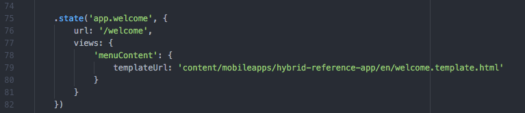

# Is uw hybride app gereed voor Adobe Experience Manager Mobile?{#is-your-hybrid-app-ready-for-aem-mobile}

{{ue-over-mobile}}

Dus u hebt uw Hybride PhoneGap- of Cordova-app geïmporteerd in AEM, wat nu? Waarschijnlijk wilt u authorable inhoud aan uw app toevoegen. Hiervoor hebt u een algemeen inzicht in de structuur van een AEM-app nodig. Een toepassing in AEM bestaat meestal uit twee delen. De &#39;shell&#39; en &#39;content&#39;. Het &#39;shell&#39; bestaat uit de statische delen van uw app, zoals de PhoneGap-configuratiebestanden, het app-framework en de navigatie-elementen. De inhoud van het archief dat u hebt geïmporteerd, wordt opgeslagen als onderdeel van de shell. In de context van dit document is de shell alle niet-AEM authored inhoud van uw Hybride toepassing PhoneGap die door de toepassingsontwikkelaar wordt gebouwd.

De inhoud verwijst naar de componenten, de malplaatjes, en de authored pagina&#39;s die in AEM door de AEM Ontwikkelaar worden ontworpen. Inhoud wordt gecategoriseerd als inhoud voor ontwikkelaars of als geschreven inhoud. Componenten, ontwerpen en paginasjablonen worden beschouwd als ontwikkelinhoud omdat ze zijn gemaakt door een ontwikkelaar. Auteur-inhoud zijn pagina&#39;s die zijn samengesteld met de componenten en de malplaatjes. Deze pagina&#39;s worden meestal gemaakt door een Designer of een Markering.

Voor het toevoegen van geschreven AEM pagina&#39;s aan uw Hybride-app is coördinatie tussen de ontwikkelaar van de app en de AEM-ontwikkelaar vereist. Overal in de app waar u geschreven inhoud wilt toevoegen, moet de ontwikkelaar van de app deze pagina&#39;s ordenen in een structuur die in de Experience Manager kan worden bedekt. De ontwikkelaar van de app moet de ontwikkelaar van de Experience Manager de wegen kunnen voorzien van waar de Experience Manager authored inhoud wordt toegevoegd. Geef vervolgens een tijdelijke aanduiding op in de Hybride app die wordt vervangen nadat de ontwikkelaar van de Experience Manager de pagina-inhoud heeft gemaakt.

Om de verklaring gemakkelijker te kunnen volgen, wordt het AEM Experience Cloud gebruikt: AEM Mobile Hybrid Reference om de concepten uit te leggen. De Hybride Reference-app bestaat uit een welkomstpagina met een zijmenu.

In dit voorbeeld wordt de welkomstpagina van de toepassing gemaakt. Het bekijken van de bron [&#x200B; https://github.com/Adobe-Marketing-Cloud-Apps/aem-mobile-hybrid-reference/blob/master/hybrid-app/www/js/app.js#L75 &#x200B;](https://github.com/Adobe-Marketing-Cloud-Apps/aem-mobile-hybrid-reference/blob/master/hybrid-app/www/js/app.js#L75). De ontwikkelaar van de app heeft een welkomstpagina gedefinieerd en een sjabloon verschaft voor de pagina die door de app wordt weergegeven. Op deze pagina moeten de ontwikkelaar van de app en AEM ontwikkelaar coördineren. Het pad naar de welkomstpaginasjabloon in de Hybride Reference App is gedefinieerd als &#39;&#39;content/mobileapps/hybrid-reference-app/en/welcome.template.html&#39;&#39;. Dit pad is belangrijk, omdat de AEM ontwikkelaar zijn welkomstpagina in de AEM-opslagplaats met hetzelfde pad zal samenstellen.

Het is belangrijk dat de hybride app en de AEM geschreven inhoud hetzelfde pad gebruiken omdat deze afhankelijk zijn van de mogelijkheid om inhoud te bedekken met Content Sync om nieuwe pagina&#39;s toe te voegen aan de Hybride app. Wanneer de hybride app in AEM wordt geïmporteerd als onderdeel van het importproces, worden configuraties voor Content Sync ingesteld.

Wanneer u &#39;Source downloaden&#39; van het dashboard van de app gebruikt, worden deze ContentSync-scripts uitgevoerd om een archief van uw Hybrid App samen te stellen.

ContentSync wordt eerst in &#39;shell&#39; van de app opgehaald, waar alle toepassingen die inhoud van de Hybrid-app hebben ontwikkeld, worden opgeslagen. Vervolgens wordt de inhoud van de app opgehaald. Als er nu pagina&#39;s in de shell zijn die hetzelfde pad hebben als in &#39;content&#39;, worden de pagina&#39;s onder &#39;shell&#39; (vervangen) door de pagina&#39;s onder &#39;content&#39;. Als in het voorbeeld van de Hybride Reference App een pagina wordt gemaakt in AEM die hetzelfde pad heeft als &#39;&#39;content/mobileapps/hybrid-reference-app/en/welcome.template.html&#39;&#39;, bedekt deze pagina de pagina die deel uitmaakte van de Hybride Reference-app. Het bedekt het met wat er op die locatie AEM is. De overlay wordt verzorgd door ContentSync. Voor iemand die de app gebruikt, zien de updates voor de app met AEM geschreven inhoud er dus naadloos uit en hoeven de app niet opnieuw te worden samengesteld. Als u de app uitvoert, wordt de welkomstpagina daarom als volgt weergegeven:

