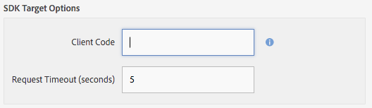

# AEM Mobile content personalization{#aem-mobile-content-personalization}

>[!NOTE]
>
>Adobe raadt aan de SPA Editor te gebruiken voor projecten die renderen op basis van één pagina voor toepassingsframework op de client-side vereisen (bijvoorbeeld Reageren). [Meer](/help/sites-developing/spa-overview.md) informatie.

>[!NOTE]
>
>Dit document maakt deel uit van de [Aan de slag met AEM Mobile](/help/mobile/getting-started-aem-mobile.md) Guide, een aanbevolen startpunt voor AEM Mobile-referentie.

Met de AEM Mobile-functie voor het aanpassen van inhoud kunnen [AEM-auteurs](#author) inhoud van mobiele apps aanpassen door gebruik te maken van [Adobe Target](https://www.adobe.com/ca/marketing-cloud/testing-targeting.html). Hierdoor kunnen gebruikers van mobiele toepassingen gerichte aanbiedingen ontvangen. Adobe Experience Manager Mobile biedt de mogelijkheid om inhoud te maken, als doel in te stellen en te leveren die de gebruiker inhoud biedt die specifiek is voor zijn of haar eigen smaak.

Zoals vaak het geval AEM, moeten beheerders en ontwikkelaars eerst de omgeving voorbereiden voordat auteurs deze inhoud kunnen gaan maken.

[AEM ](#administrator) overheden moeten een verbinding tot stand brengen tussen AEM Mobile en de Adobe Target-Cloud Service.

Ondertussen moeten AEM Mobile [developers](#developer) hun bestaande scripts aanpassen om het maken van doelgerichte inhoud te vergemakkelijken.

## Voor beheerders {#for-administrators}

Er zijn een aantal stappen die moeten worden samengevoegd voordat auteurs van inhoud gerichte inhoud kunnen gaan genereren voor mobiele apps: Er is de juiste set machtigingen voor gebruikers en groepen, het maken van cloudservices, het configureren van de toepassing voor de activiteit en het genereren van de inhoud.

Dit artikel zal u door het proces begeleiden dat wordt gebruikt om [AEM Mobile Hybride Toepassing van de Verwijzing ](https://github.com/Adobe-Marketing-Cloud-Apps/aem-mobile-hybrid-reference) voor het richten te vormen.

De aanname is dat de Hybride Reference Application van AEM Mobile met succes is geïmplementeerd en toegankelijk via het AEM Mobile-dashboard.

Voordat auteurs gerichte inhoud kunnen genereren binnen een toepassing, moet uw AEM instantie [geconfigureerd zijn met de Adobe Target-Cloud Service.](/help/mobile/aem-mobile-configuring-cloud-service.md)

### Machtigingen {#permissions}

Gebruikers die toegang tot de verpersoonlijkingsconsole nodig hebben, moeten deel uitmaken van de `target-activity-authors`-groep.

Voorgesteld wordt dat als onderdeel van de gebruikersinstellingen en groepsinstellingen de doelgroep-activiteit-groep moet worden toegevoegd aan de groep met apps-beheerders. Door de doel-activiteit-auteursgroep toe te voegen zal dit gebruikers capaciteit toestaan om de ingang van het menu van de Navigatie van de Aanpassing te zien.

>[!NOTE]
>
>Het vergeten om de gebruikers of de groepen toe te voegen die u toegang tot de verpersoonlijkings admin console aan de doel-activiteit-auteur groep wilt hebben zal gebruikers verhinderen de verpersoonlijkingsconsole te zien.

### Cloud Services {#cloud-services}

Om gerichte inhoud te krijgen die voor mobiele toepassingen werkt zijn er twee diensten die moeten worden gevormd: De Adobe Target Service en de Adobe Mobile Services-service. De Adobe Target Service biedt de engine voor het verwerken van clientverzoeken en het retourneren van gepersonaliseerde inhoud. De service Adobe Mobile Services biedt de verbinding tussen de Adobe-services en de mobiele toepassing via het bestand ADBMobileConfig.json dat door de AMS Cordova-plug-in wordt gebruikt. Via het AEM Mobile-dashboard kunt u uw toepassing configureren door de twee services toe te voegen.

Zoek op het AEM Mobile-dashboard de Cloud Services Beheren en klik op +.


Selecteer de &quot;Adobe Target&quot;-cloudservicekaart van de wizard Cloud Service toevoegen en klik op Volgende.


Van Uitgezocht een drop-down van de Configuratie kunt u of een nieuwe configuratie tot stand brengen of van bestaande selecteren. Om een nieuwe configuratie tot stand te brengen selecteer &quot;tot Configuratie&quot;van dropdown. Ga een titel voor de configuratie van het Doel in. Voer uw clientcode, e-mail en wachtwoord in die aan uw doelaccount zijn gekoppeld. Als u de waarden voor deze velden niet weet, neemt u contact op met de Adobe Target-ondersteuning. Klik op de knop &quot;Verifiëren&quot; om de referenties te valideren. Zodra geverifieerd, klik de Submit knoop om de wolkendienst tot stand te brengen.

>[!NOTE]
>
>De cloudservice die wordt gemaakt, wordt automatisch gekoppeld aan de mobiele toepassing via de wizard. De eigenschapswaarde cq:cloudserviceconfigs wordt ingesteld op het knooppunt jcr:content van het knooppunt van de groep apps. Voor het hybride app-voorbeeld wordt het ingesteld op /content/mobileapps/hybride-reference-app/jcr:content met de waarde die verwijst naar het automatisch gegenereerde frameworkknooppunt op /etc/cloudservices/testandtarget/adobe-aem-apps/framework. Het knooppunt framework heeft twee eigenschappen die standaard zijn ingesteld: geslacht en leeftijd. Het framework wordt alleen gebruikt door AEM voorvertoning en heeft geen invloed op het apparaat.

Na voltooiing van de tovenaar zal de Manage Cloud Service tegel de de wolkendienst van het Doel bevatten, nochtans bevat het een waarschuwing over een ontbrekende rekening van de Dienst van Adobe Mobile.


### Adobe mobiele services {#adobe-mobile-services}

Het is noodzakelijk om een Adobe Mobile Services (AMS)-account ook aan de toepassing te koppelen, biedt de AMS-service het vereiste ADBMobileConfig.json-bestand dat de informatie over de doelclientcode bevat. Voordat u een koppeling met de AMS-account maakt, moet de AMS-account worden gewijzigd door een gebruiker die machtigingen voor AMS heeft.

### Clientcode {#client-code}

Als u zich wilt aanmelden bij de AMS-services, gaat u naar [https://mobilemarketing.adobe.com](https://mobilemarketing.adobe.com/), selecteert u de mobiele toepassing en klikt u op de instellingen. Zoek het veld SDK-doelopties en plaats de clientcode in het veld en klik op Opslaan.



Nu de clientcode aan de mobiele toepassing is gekoppeld, worden de instellingen voor de service-instellingen via het bestand ADBMobileConfig.json geleverd wanneer de AMS-cloudservice via het dashboard Adobe Mobile is geconfigureerd.

### Adobe Mobile Service Cloud Service {#adobe-mobile-service-cloud-service}

Nu AMS is geconfigureerd, is het tijd om de mobiele toepassing te koppelen aan het dashboard voor mobiele Adobe. Zoek op het AEM Mobile-dashboard de Cloud Services Beheren en klik op +.


Selecteer de Adobe Mobile Services-kaart en klik op Volgende.


Selecteer in de stap Maken of Selecteren van de wizard het vervolgkeuzemenu Mobiele service en selecteer de vermelding Configuratie maken. Geef een titel, bedrijf, gebruikersnaam en wachtwoord op en selecteer het juiste datacenter. Als u deze waarden niet kent, neemt u contact op met de beheerder van de Adobe Mobile-service om deze te verkrijgen. Klik op de knop Verifiëren als alle velden zijn ingevuld. Het verificatieproces gaat naar AMS en verifieert de referenties voor de account. Na een geslaagde validatie wordt een lijst met mobiele toepassingen gevuld. Hierin selecteert u de bijbehorende mobiele toepassing in het vervolgkeuzemenu. Klik op de knop Verzenden om de wizard te voltooien. Het proces kan enige tijd duren om de configuratiegegevens en eventuele bijbehorende analyses voor de toepassing te verkrijgen. Als het proces is voltooid, klikt u op de knop Gereed van het modaal om terug te keren naar het mobiele dashboard van Adobe.

Als u terugkeert naar het mobiele dashboard, bevat de titel Cloud Services beheren de AMS-cloudservice. U zult ook opmerken dat de Analyze de tegel van Metriek met levenscyclusrapporten zal worden bevolkt.


## Voor auteurs {#for-authors}

**Vereiste:** Zoals hierboven vermeld, moeten beheerders de verbinding met de Adobe Target-service configureren voordat auteurs nieuwe, doelinhoud kunnen genereren.

Nadat de beheerder de twee cloudservices heeft geconfigureerd en de ontwikkelaar de handler mobileappoffers heeft geconfigureerd, kunnen auteurs van inhoud nu gerichte ervaringen genereren.

Voor het ontwerpen van doelgerichte inhoud in een AEM Mobile-app wordt een vergelijkbare procedure gevolgd als voor het ontwerpen van AEM Sites:

Zie hier voor een volledig overzicht op [Doelinhoud ontwerpen in AEM](/help/sites-authoring/personalization.md)

## Voor ontwikkelaars {#for-developers}

AEM ontwikkelaars die mobiele toepassingen bouwen zouden de patronen moeten blijven volgen die algemeen tijdens AEM worden gebruikt wanneer het ontwikkelen van componenten. Hier volgen de stappen die nodig zijn om auteurs van inhoud in staat te stellen doelgerichte inhoud te maken:

### Adobe Target ContentSync Handlers {#adobe-target-contentsync-handlers}

Om inhoud aan de het apparateninhoud van de gebruiker te leveren wordt geproduceerd door de aanbiedingen terug te geven die door AEM inhoudsauteurs worden gecreeerd. Voor het afhandelen van de rendering van doelaanbiedingen is er een nieuwe handler voor inhoudssynchronisatie die de aanbiedingen verwerkt. Gebruikend de Hybride Toepassing van de Verwijzing als onze steekproef, bevat het en (Engelse) inhoudspakket ContentSyncConfig met een [mobileappoffers](https://github.com/Adobe-Marketing-Cloud-Apps/aem-mobile-hybrid-reference/blob/master/aem-package/content-author/src/main/content/jcr_root/content/mobileapps/hybrid-reference-app/en/_jcr_content/pge-app/app-config-dev/targetOffers/.content.xml) manager. De volgende stap is van cruciaal belang voor het renderen van aanbiedingen voor het apparaat. De handler mobileappoffers heeft een padeigenschap die het pad naar de personalisatieactiviteit aangeeft die voor de toepassing moet worden gebruikt.

Als er bijvoorbeeld een activiteit is die zich op */content/campagnes/hybridref* bevindt, kopieert u dit pad en plakt u het als de waarde naar de eigenschap *path* van de handler mobileappoffers.

>[!NOTE]
>
>Voor de Hybride Toepassing van de Verwijzing zijn er twee mobileappoffers managers één voor dev en één voor producties.

Zodra de activiteitenweg in het de wegbezit van de mobileappoffers manager is geplaatst sparen de manager. De handler is nu gereed om de renderingaanbiedingen voor onze mobiele apparaten te starten.

### Rendermodus {#render-mode}

De handler mobileappoffers is anders geconfigureerd voor publicatie- en ontwikkelinstellingen. Voor publicatie-instellingen is er een eigenschap met de naam *renderMode*, met de waarde *publish* ingesteld op het knooppunt cq:ContentSyncConfig. De handler mobileappoffers verwijst naar de renderMode en zal, indien ingesteld op publiceren, de id van het mbox wijzigen die wordt gemaakt. Standaard wordt in vakken die AEM maakt, een waarde —auteur toegevoegd aan de id van het mbox. Hieruit blijkt dat de activiteit niet is gepubliceerd en de niet-gepubliceerde campagne voor het indienen van voorstellen moet gebruiken.

Wanneer inhoud wordt gefaseerd via het mobiele dashboard van Adobe, wordt gefaseerde inhoud beschouwd als inhoud die klaar is voor productie en wordt deze weergegeven via de niet-dev Content Sync Config. Als u deze manier weergeeft, wordt de auteur —verwijderd van alle id&#39;s van het selectievakje en wordt verwacht dat een gepubliceerde activiteit beschikbaar is op de doelserver. Controleer voordat u inhoud met werkgebied test of de activiteit is gepubliceerd.

### Ontwikkeling van apps voor personalisatie {#personalization-app-development}

#### Onderdelen {#components}

De basis voor om het even welke inhoud is typisch een paginacomponent die of één van de basis AEM paginacomponenten wcm/stichting/componenten/pagina uitbreidt afhankelijk van als u HTML of JSPs gebruikt. De duur van deze stappen zal zich op het gebruiken van wcm/stichting/componenten/paginacomponent concentreren. De basisstructuur van de paginacomponent wordt onderverdeeld in veelvoudige manuscripten, waarbij elk manuscript het specifieke doel verstrekt om de ontwikkelaar toe te staan om hun code te organiseren en met voeten te treden indien nodig. De twee manuscripten die voor Personalisatie van belang zijn zijn head.html en body.html. Deze twee manuscripten verstrekken een gebied waar de code kan worden ingespoten om de Hub van de Context, Cloud Services, en Mobiele authoring te steunen.

Hier volgt een overzicht van de twee primaire scripts die worden gebruikt om het aanwijzen van inhoud mogelijk te maken.

#### head.html {#head-html}

Om de auteur de capaciteit te verstrekken om hun inhoud te richten moet het doelmenu aan de pagina worden toegevoegd zodat de auteur context van uitgeeft wijze aan het richten wijze kan veranderen. Om deze functie in te schakelen, moet de ontwikkelaar het script head.html zo wijzigen dat het volgende codefragment boven aan head.html of zo dicht mogelijk bij het element &lt;title>&lt;/title> wordt opgenomen.

```xml
<meta data-sly-test="${!wcmmode.disabled}">
    <div data-sly-call="${clientLib.all @ categories='personalization.kernel'}" data-sly-unwrap></div>
    <div data-sly-resource="${'config' @ resourceType='cq/personalization/components/clientcontext_optimized/config'}" data-sly-unwrap></div>
    <div data-sly-resource="${'contexthub' @ resourceType='granite/contexthub/components/contexthub'}" data-sly-unwrap></div>
</meta>
```

>[!NOTE]
>
>Houd er rekening mee dat het script alleen moet worden opgenomen als de WCM-modus niet is uitgeschakeld, zodat het script niet wordt opgenomen in de uiteindelijke toepassingscode wanneer de WCM-modus is uitgeschakeld (zie de sectie van de ContentSync-handler voor meer informatie).

Om auteurs de mogelijkheid te bieden de beoogde inhoud voor te vertonen, moet de editor de configuratie van de Adobe Target-cloudservice kunnen vinden. In het codeblok hieronder worden twee belangrijke scripts toegevoegd. De eerste die de capaciteit voor de pagina toevoegt om van de bijbehorende de wolkendienst van het Doel de plaats te bepalen en de vraag te maken aan Adobe Target. De tweede is de toevoeging van de categorie cq.apps.targeting.

De categorie **cq.apps.targeting** negeert de standaardcomponent cq/personalization/component/target en gebruikt de mobiele apps/componenten/doelcomponent die specifiek voor mobiel toepassingsverbruik worden aangeboden. Meer details van dit zullen in de sectie van de Component van het Doel worden besproken.

De code moet worden toegevoegd in head.html en vlak voor het einde van het &lt;/head>-element worden geplaatst.

```xml
<div data-sly-test="${!wcmmode.disabled}">
    <div data-sly-include="/libs/cq/cloudserviceconfigs/components/servicelibs/servicelibs.jsp" data-sly-unwrap></div>
    <meta data-sly-call="${clientLib.all @ categories='cq.apps.targeting'}" data-sly-unwrap></meta>
</div>
```

>[!NOTE]
>
>Merk op dat het codeblok binnen een Wijze WCM wordt verpakt die niet wordt onbruikbaar gemaakt daarom slechts in spel komen terwijl de tevreden auteur aan het creëren van inhoud werkt. De scripts voor de cloudservice worden niet toegevoegd aan de gegenereerde mobiele runtimecode.

#### body.html {#body-html}

Om de auteur van de inhoud toe te laten de capaciteit om verschillende karakters te testen het body.html manuscript moet het volgende codeblok als eerste kind van het lichaamselement omvatten.

```xml
<div data-sly-test="${!wcmmode.disabled}">
    <div data-sly-resource="${'clientcontext' @ resourceType='cq/personalization/components/clientcontext_optimized'}" data-sly-unwrap></div>
</div>
```

Het laatste vereiste beetje van code is bij de zeer bodem van body.html. Met deze code wordt gezocht naar de bijbehorende cloudservice en wordt de juiste code voor de doelengine geïnjecteerd.

```xml
<div data-sly-test="${!wcmmode.disabled}">
    <div data-sly-resource="${'cloudservices' @ resourceType='cq/cloudserviceconfigs/components/servicecomponents'}" data-sly-unwrap></div>
</div>
```

### Referentie-toepassing {#reference-application}

De voorbeelden van head.html en body.html kunnen in [AEM Mobile Hybride Toepassing van de Verwijzing](https://github.com/Adobe-Marketing-Cloud-Apps/aem-mobile-hybrid-reference) worden gevonden die de ontwikkelaar toont waar te om de manuscriptblokken binnen de twee manuscripten te plaatsen.

### Handlers voor inhoudssynchronisatie {#content-sync-handlers}

Wanneer de auteur van de inhoud klaar is met het maken van inhoud voor de mobiele toepassing, bestaat de volgende stap uit het downloaden van de bron en het bouwen van de toepassing, of het plaatsen van de te publiceren inhoud. Er zijn een aantal stappen waarbij de ontwikkelaar betrokken is om dit te bewerkstelligen. AEM Mobile gebruikt voor het renderen van de inhoud contentsync-handlers om de inhoud te renderen en in te pakken. Er is een nieuwe handler voor inhoudssynchronisatie geïntroduceerd voor het gebruik van Aanpassing voor het renderen van doelinhoud. De handler &#39;mobileappoffers&#39; weet hoe de gekoppelde doelaanbiedingen die door de auteur van de inhoud zijn gemaakt, moeten worden weergegeven. De handler mobileappoffers breidt de abstracte update-handler voor pagina&#39;s daarom uit. Veel eigenschappen zijn vergelijkbaar. De details van de handler mobileappoffers hebben de volgende eigenschappen.

<table>
 <tbody>
  <tr>
   <td><strong>Eigenschap</strong></td>
   <td><strong>Waarde</strong></td>
   <td><strong>Beschrijving</strong></td>
  </tr>
  <tr>
   <td>herschrijven</td>
   <td>+ relativeParentPath<p> - "/"</p> </td>
   <td>De eigenschap rewrite geeft aan hoe paden binnen de inhoud moeten worden herschreven.</td>
  </tr>
  <tr>
   <td>includedPageTypes</td>
   <td><p>"cq/personalization/components/teaserpage",</p> <p>"cq/personalization/components/offerproxy"</p> </td>
   <td>De eigenschap includePageTypes is optioneel. Pagina's met brontypen cq/personalization/components/teaserpage en cq/personalization/components/offerproxy worden standaard geactiveerd. Deze twee middeltypes zijn de standaardmiddeltypes die worden gebruikt wanneer de inhoud wordt gericht. Als extra middeltypes moeten worden gesteund zouden zij aan de lijst van includePageTypes moeten worden toegevoegd.</td>
  </tr>
  <tr>
   <td>locationRoot</td>
   <td>/content/mobileapps/&lt;app&gt;</td>
   <td>De locatie van de app.</td>
  </tr>
  <tr>
   <td>type</td>
   <td>mobileappoffers</td>
   <td>De naam van de handler die mobileappoffers is.</td>
  </tr>
  <tr>
   <td>kiezer</td>
   <td>tandt</td>
   <td>De standaardkiezer wordt gebruikt om de doelinhoud te renderen. </td>
  </tr>
  <tr>
   <td>targetRootDirectory</td>
   <td>www</td>
   <td>De hoofdmap waar de gerenderde inhoud moet worden voortgezet.</td>
  </tr>
  <tr>
   <td>includeImages</td>
   <td>true | Onwaar</td>
   <td>Indien waar (true), worden alle afbeeldingen die in de aanbieding zijn opgenomen, weergegeven. Als er valse afbeeldingen worden overgeslagen.</td>
  </tr>
  <tr>
   <td>includeVideos</td>
   <td>true | Onwaar</td>
   <td>Indien waar (true), worden alle video's die in de aanbieding zijn opgenomen, weergegeven. Als er onjuiste video's worden overgeslagen.</td>
  </tr>
  <tr>
   <td>path</td>
   <td>/content/campagnes/&lt;brand&gt;</td>
   <td>wijst op het merk van de campagne waaraan de aanbiedingen deelnemen. Momenteel moeten alle aanbiedingen van dezelfde campagne afkomstig zijn.</td>
  </tr>
  <tr>
   <td>diep</td>
   <td>true | Onwaar</td>
   <td>Als true recursief alle onderliggende pagina's rendert, als false niet recursief. </td>
  </tr>
  <tr>
   <td>extension</td>
   <td>html</td>
   <td>Stelt de extensie in voor de resource die wordt gerenderd. Stel de pagina's zo in dat deze de extensie .html hebben.</td>
  </tr>
 </tbody>
</table>

>[!NOTE]
>
>[AEM Mobile Hybride Referentie App](https://github.com/Adobe-Marketing-Cloud-Apps/aem-mobile-hybrid-reference) heeft de standaardconfiguratie van de Mobileappoffer-handler. De eigenschap path in het voorbeeld is leeg omdat deze afhankelijk is van de locatie van de campagne. Nadat een campagneauteur een Campagne heeft gecreeerd, zou de apps beheerder de Campagne met de manager moeten associëren door het wegbezit te specificeren om aan de Campagne te richten.

### Doelcomponent {#target-component}

AEM Mobile gebruikt de mobiele apps/componenten/doelcomponent om inhoud specifiek voor mobiele toepassingen te renderen. De mobiele doelcomponent breidt de cq/personalization/components/target component uit en overschrijft het script engine_tnt.jsp. Door de engine_tnt.jsp te overschrijven, kan AEM Mobile de gegenereerde HTML voor het gebruik van mobiele apps beheren. Voor elke component die door een inhoudauteur wordt gericht, wordt een bijbehorende mbox gecreeerd door engine_tnt.jsp.

Voor elke mbox wordt een attribuut van **cq-gericht** toegevoegd toelatend toepassingsontwikkelaars om douanecode te schrijven om te verbruiken en te gebruiken nochtans zij gelieve. De [AEM Mobile Hybride Referentie App](https://github.com/Adobe-Marketing-Cloud-Apps/aem-mobile-hybrid-reference) heeft een voorbeeld van een Hoekrichtlijn die het cq-richtende attribuut gebruikt. Het concept van contentvervanging wanneer en hoe dit gebeurt, is in hoge mate aan de ontwikkelaar van de mobiele toepassing. Er is een Mobile SDK die via AEM /etc/clientlibs/mobileapps/js/mobileapps.js wordt geleverd die API verstrekt om de Adobe het richten dienst te roepen. Het is aan de toepassingsontwikkelaar om te specificeren wanneer die vraag volgens het ontwerp van hun toepassing zou moeten worden gemaakt.

## Wat nu? {#what-s-next}

1. [Mijn AEM Mobile-app starten](/help/mobile/starting-aem-phonegap-app.md)
1. [De inhoud van mijn app beheren](/help/mobile/phonegap-manage-app-content.md)
1. [Mijn toepassing samenstellen](/help/mobile/building-app-mobile-phonegap.md)
1. [De prestaties van mijn app bijhouden met Adobe Mobile Analytics](/help/mobile/phonegap-intro-to-app-analytics.md)
1. [Een persoonlijke app-ervaring bieden met Adobe Target](/help/mobile/phonegap-aem-mobile-content-personalization.md)
1. [Belangrijke berichten naar mijn gebruikers sturen](/help/mobile/phonegap-push-notifications.md)
