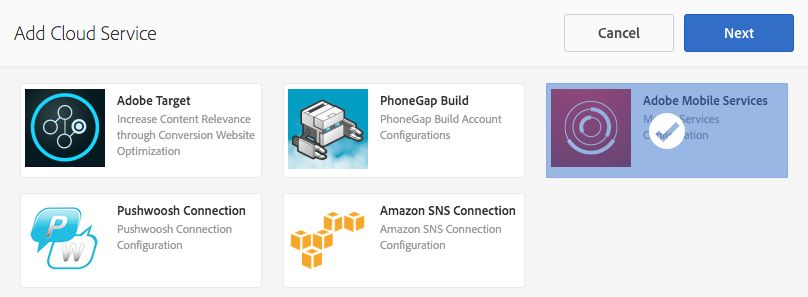

# Aanpassing van AEM Mobile-content{#aem-mobile-content-personalization}

>[!NOTE]
>
>De Adobe adviseert het gebruiken van de SPARedacteur voor projecten die op kader-gebaseerde cliënt-zijteruggeven van enige paginatoepassing (bijvoorbeeld, Reageren) vereisen. [ leer meer ](/help/sites-developing/spa-overview.md).

>[!NOTE]
>
>Dit document maakt deel uit van [ Begonnen het worden met de Gids van AEM Mobile ](/help/mobile/getting-started-aem-mobile.md), een geadviseerd uitgangspunt voor de verwijzing van AEM Mobile.

De de inhoudsverpersoonlijkingseigenschap van AEM Mobile staat [ toe AEM Auteurs ](#author) om mobiele app inhoud te personaliseren door [ Adobe Target ](https://business.adobe.com/products/target/adobe-target.html) te gebruiken. Hierdoor kunnen gebruikers van mobiele toepassingen gerichte aanbiedingen ontvangen. Adobe Experience Manager Mobile biedt de mogelijkheid om inhoud te maken, als doel in te stellen en te leveren die de gebruiker inhoud biedt die specifiek is voor zijn of haar eigen smaak.

In AEM moeten beheerders en ontwikkelaars eerst de omgeving voorbereiden, zodat auteurs deze inhoud kunnen gaan maken.

[ AEM beheerders ](#administrator) worden vereist om een verbinding tussen AEM Mobile en de Cloud Service van Adobe Target te vestigen.

Ondertussen, moeten de ontwikkelaars van AEM Mobile ](#developer) hun bestaande manuscripten uitgeven om gerichte inhoud het schrijven te vergemakkelijken.[

## Voor beheerders {#for-administrators}

Er zijn verschillende stappen die moeten worden samengevoegd voordat inhoudsauteurs gerichte inhoud kunnen gaan genereren voor mobiele apps: gebruikers en groepen krijgen de juiste machtigingen, maken cloudservices, configureren de toepassing voor de activiteit en genereren ten slotte de inhoud.

Dit artikel leidt u door het proces dat wordt gebruikt om de [ Hybride Toepassing van de Verwijzing van AEM Mobile te vormen ](https://github.com/Adobe-Marketing-Cloud-Apps/aem-mobile-hybrid-reference) voor het richten.

De aanname is dat de Hybride Reference Application van AEM Mobile met succes is geïmplementeerd en toegankelijk via het AEM Mobile-dashboard.

Alvorens de auteurs gerichte inhoud binnen een toepassing kunnen produceren, moet uw AEM instantie [ worden gevormd met de Cloud Service van Adobe Target.](/help/mobile/aem-mobile-configuring-cloud-service.md)

### Machtigingen {#permissions}

Gebruikers die toegang tot de aanpassingsconsole nodig hebben, moeten deel uitmaken van de `target-activity-authors` -groep.

Voorgesteld wordt dat als onderdeel van de gebruikersinstellingen en groepsinstellingen de doelgroep-activiteit-groep moet worden toegevoegd aan de groep met apps-beheerders. Door de doelgroep-activiteit-auteurs toe te voegen, staat dit gebruikers de capaciteit toe om de ingang van het de navigatiemenu van Personalization te zien.

>[!NOTE]
>
>Het vergeten om de gebruikers of de groepen toe te voegen die u toegang tot de verpersoonlijking Admin Console aan de doel-activiteit-auteursgroep wilt hebben verhindert gebruikers de verpersoonlijkingsconsole te zien.

### Cloud Servicen {#cloud-services}

Om gerichte inhoud te krijgen die voor mobiele toepassingen werkt, zijn er twee diensten die moeten worden gevormd: de Dienst van Adobe Target en de dienst van de Diensten van de Adobe Mobiele. De Adobe Target Service biedt de engine voor het verwerken van clientverzoeken en het retourneren van gepersonaliseerde inhoud. De service Adobe Mobile Services biedt de verbinding tussen de Adobe-services en de mobiele toepassing via het bestand ADBMobileConfig.json dat wordt gebruikt door de insteekmodule AMS Cordova. Vanuit het AEM Mobile-dashboard kunt u de toepassing configureren door de twee services toe te voegen.

Zoek in het AEM Mobile-dashboard de Cloud Servicen voor beheren op en klik op +.


Selecteer de &quot;Adobe Target&quot;-cloudservicekaart van de wizard Cloud Service toevoegen en klik op Volgende.


Van Uitgezocht een drop-down Configuratie, kunt u of een configuratie tot stand brengen of van bestaande selecteren. Als u een configuratie wilt maken, selecteert u &quot;Configuratie maken&quot; in het vervolgkeuzemenu. Voer een titel in voor de doelconfiguratie. Voer uw clientcode, e-mail en wachtwoord in die aan uw Target-account zijn gekoppeld. Als u de waarden voor deze velden niet kent, neemt u contact op met de ondersteuning van Adobe Target. Klik op de knop &quot;Verifiëren&quot; om de referenties te valideren. Zodra geverifieerd, klik de Submit knoop om de wolkendienst tot stand te brengen.

>[!NOTE]
>
>De cloudservice die wordt gemaakt, wordt automatisch gekoppeld aan de mobiele toepassing via de wizard. De eigenschapswaarde cq:cloudserviceconfigs wordt ingesteld op het knooppunt jcr:content van het knooppunt van de groep apps. Voor het hybride toepassingsvoorbeeld wordt het ingesteld op /content/mobileapps/hybride-reference-app/jcr:content met de waarde die verwijst naar het automatisch gegenereerde frameworkknooppunt op /etc/cloudservices/testandtarget/adobe-aem-apps/framework. Het knooppunt framework heeft twee eigenschappen die standaard zijn ingesteld: geslacht en leeftijd. Het framework wordt alleen gebruikt door AEM voorvertoning en heeft geen invloed op het apparaat.

Nadat de wizard is voltooid, bevat de tegel Cloud Service beheren de doelcloudservice. Nochtans, bevat het een waarschuwing over een ontbrekende rekening van de Mobiele Dienst van de Adobe.


### Adobe mobiele services {#adobe-mobile-services}

Het is noodzakelijk om een rekening van de Diensten van de Adobe Mobiele (AMS) aan de toepassing ook te verbinden, verstrekt de dienst AMS het vereiste dossier ADBMobileConfig.json dat de informatie van de de cliëntcode van het Doel bevat. Voordat u een koppeling met de AMS-account maakt, moet de AMS-account worden gewijzigd door een gebruiker die machtigingen voor AMS heeft.

### Clientcode {#client-code}

Om aan login aan de diensten van AMS bezoek [ https://mobilemarketing.adobe.com ](https://mobilemarketing.adobe.com/), selecteer de mobiele toepassing en klik de montages. Zoek het veld SDK-doelopties en plaats de clientcode in het veld en klik op Opslaan.


Nu de clientcode aan de mobiele toepassing is gekoppeld, worden de instellingen voor de service-instellingen via het bestand ADBMobileConfig.json geleverd wanneer de AMS-cloudservice via het mobiele dashboard van de Adobe wordt geconfigureerd.

### Adobe Mobile Service Cloud Service {#adobe-mobile-service-cloud-service}

Nu AMS is geconfigureerd, is het tijd om de mobiele toepassing te koppelen in het mobiele dashboard van de Adobe. Zoek in het AEM Mobile-dashboard de Cloud Servicen voor beheren op en klik op +.


Selecteer de Adobe Mobile Services-kaart en klik op Volgende.



Van de Create of Uitgezochte tovenaar stap, selecteer de Mobiele drop-down Dienst, en selecteer de Create ingang van de Configuratie. Geef een titel, bedrijf, gebruikersnaam en wachtwoord op en selecteer het juiste datacenter. Als u deze waarden niet kent, contacteer uw beheerder van de Dienst van de Adobe Mobiele om hen te verkrijgen. Nadat alle gebieden worden gevuld, klik **verifieer**. Het verificatieproces gaat naar AMS en verifieert de referenties voor de account. Bij een geslaagde validatie wordt een lijst met mobiele toepassingen gevuld. Hierin selecteert u de bijbehorende mobiele toepassing in het vervolgkeuzemenu. Klik **voorleggen** om de tovenaar te voltooien. Het proces kan enige tijd duren om de configuratiegegevens en eventuele bijbehorende analyses voor de toepassing te verkrijgen. Nadat het proces volledig is, klik **Gedaan** om terug naar het Mobiele Dashboard van de Adobe terug te keren.

Als u terugkeert naar het mobiele dashboard, bevat de titel Cloud Servicen beheren de AMS-cloudservice. Bovendien wordt de tegel Metriek analyseren gevuld met levenscyclusrapporten.


## Voor auteurs {#for-authors}

**Vereiste:** Zoals hierboven vermeld, moeten de beheerders de verbinding aan de Dienst van Adobe Target vormen alvorens de auteurs nieuwe gerichte inhoud kunnen produceren.

Nadat de beheerder de twee cloudservices heeft geconfigureerd en de ontwikkelaar de handler mobileappoffers heeft geconfigureerd, kunnen auteurs van inhoud nu gerichte ervaringen genereren.

Voor het ontwerpen van doelgerichte inhoud in een AEM Mobile-app wordt een vergelijkbare procedure gevolgd als voor het ontwerpen van AEM Sites:

Zie hier voor een volledig overzicht op [ Authoring gerichte inhoud in AEM ](/help/sites-authoring/personalization.md)

## Voor ontwikkelaars {#for-developers}

AEM ontwikkelaars die mobiele toepassingen bouwen zouden de patronen moeten blijven volgen die algemeen tijdens AEM worden gebruikt wanneer het ontwikkelen van componenten. Hier, doorloopt de Adobe u de noodzakelijke stappen om inhoudsauteurs toe te laten om gerichte inhoud tot stand te brengen:

### Adobe Target ContentSync Handlers {#adobe-target-contentsync-handlers}

Om inhoud aan het apparaat van de gebruiker te leveren, wordt de inhoud geproduceerd door de aanbiedingen terug te geven die door AEM inhoudsauteurs worden gecreeerd. Voor het afhandelen van de rendering van doelaanbiedingen is er een nieuwe handler voor inhoudssynchronisatie die de aanbiedingen verwerkt. Gebruikend de Hybride Toepassing van de Verwijzing als steekproef, bevat het en (Engelse) inhoudspakket ContentSyncConfig met a [ mobileappoffers ](https://github.com/Adobe-Marketing-Cloud-Apps/aem-mobile-hybrid-reference/blob/master/aem-package/content-author/src/main/content/jcr_root/content/mobileapps/hybrid-reference-app/en/_jcr_content/pge-app/app-config-dev/targetOffers/.content.xml) manager. De volgende stap is van cruciaal belang voor het renderen van aanbiedingen voor het apparaat. De handler mobileappoffers heeft een padeigenschap die het pad naar de personalisatieactiviteit identificeert die voor de toepassing moet worden gebruikt.

Bijvoorbeeld, als er een activiteit bij *is/content/campagnes/hybridref*, kopieer deze weg en kleef het als waarde aan het *weg* bezit van de mobileappoffers manager.

>[!NOTE]
>
>Voor de Hybride Toepassing van de Verwijzing, zijn er twee mobileappoffers managers één voor dev en één voor producties.

Nadat het activiteitenpad is ingesteld in de padeigenschap van de handler mobileappoffers, slaat u de handler op. De handler is nu gereed om de renderingaanbiedingen voor mobiele apparaten te starten.

### Rendermodus {#render-mode}

De handler mobileappoffers is anders geconfigureerd voor publicatie- en ontwikkelinstellingen. Voor publiceer montages is er een bezit genoemd *renderMode* met een waarde van *publiceert* geplaatst op cq:ContentSyncConfig knoop. De handler mobileappoffers verwijst naar de renderMode en bewerkt de mbox-id die wordt gemaakt, als deze is ingesteld op publiceren. Standaard wordt in vakken die AEM maakt, een waarde —auteur toegevoegd aan de id van het mbox. Hieruit blijkt dat de activiteit niet is gepubliceerd en de niet-gepubliceerde campagne voor het indienen van voorstellen moet gebruiken.

Wanneer inhoud wordt gefaseerd via het mobiele dashboard van de Adobe, wordt gefaseerde inhoud beschouwd als inhoud die klaar is voor productie en wordt deze weergegeven via de niet-dev Content Sync Config. Als u deze manier weergeeft, wordt de auteur —verwijderd van alle id&#39;s van het selectievakje en wordt verwacht dat een gepubliceerde activiteit beschikbaar is op de doelserver. Controleer voordat u gefaseerde inhoud test of de activiteit al is gepubliceerd.

### Personalization App Development {#personalization-app-development}

#### Onderdelen {#components}

De basis voor om het even welke inhoud is typisch een paginacomponent die of één van de basis AEM paginacomponenten wcm/stichting/componenten/pagina uitbreidt afhankelijk van als u HTML of JSPs gebruikt. De duur van deze stappen is vooral gericht op het gebruik van de component wcm/foundation/components/page. De basisstructuur van de paginacomponent wordt onderverdeeld in veelvoudige manuscripten, waarbij elk manuscript het specifieke doel verstrekt om de ontwikkelaar toe te staan om hun code te organiseren en met voeten te treden indien nodig. De twee scripts die van belang zijn voor Personalization zijn head.html en body.html. Deze twee manuscripten verstrekken een gebied waar de code kan worden ingespoten om de Hub van de Context, Cloud Servicen, en Mobiele authoring te steunen.

Hier volgt een overzicht van de twee primaire scripts die worden gebruikt om het aanwijzen van inhoud mogelijk te maken.

#### head.html {#head-html}

Als u de auteur de mogelijkheid wilt bieden om zijn of haar inhoud als doel in te stellen, moet het doelmenu aan de pagina worden toegevoegd, zodat de auteur de context kan wijzigen van de bewerkingsmodus in de doelmodus. Om deze functie in te schakelen, moet de ontwikkelaar het script head.html zo wijzigen dat het volgende codefragment boven aan head.html of zo dicht mogelijk bij het element &lt;title>&lt;/title> wordt opgenomen.

```xml
<meta data-sly-test="${!wcmmode.disabled}">
    <div data-sly-call="${clientLib.all @ categories='personalization.kernel'}" data-sly-unwrap></div>
    <div data-sly-resource="${'config' @ resourceType='cq/personalization/components/clientcontext_optimized/config'}" data-sly-unwrap></div>
    <div data-sly-resource="${'contexthub' @ resourceType='granite/contexthub/components/contexthub'}" data-sly-unwrap></div>
</meta>
```

>[!NOTE]
>
>Neem het script alleen op wanneer de WCM-modus is uitgeschakeld, zodat het script niet is opgenomen in de uiteindelijke toepassingscode wanneer de WCM-modus is uitgeschakeld (zie de sectie van de ContentSync-handler voor meer informatie).

Om auteurs de mogelijkheid te bieden de beoogde inhoud voor te vertonen, moet de editor de configuratie van de Adobe Target-cloudservice kunnen vinden. In het codeblok hieronder worden twee belangrijke scripts toegevoegd. De eerste die de capaciteit voor de pagina toevoegt om van de bijbehorende de wolkendienst van het Doel de plaats te bepalen en de vraag te maken aan Adobe Target. De tweede is de toevoeging van de categorie cq.apps.targeting.

De {**categorie 0} cq.apps.targeting treedt standaard cq/personalization/component/target met voeten en gebruikt de mobiele apps/componenten/doelcomponent die aanbiedingen specifiek voor mobiel toepassingsverbruik teruggeeft.** Meer details van dit zullen in de sectie van de Component van het Doel worden besproken.

De code moet worden toegevoegd in head.html en vlak voor het einde van het &lt;/head>-element worden geplaatst.

```xml
<div data-sly-test="${!wcmmode.disabled}">
    <div data-sly-include="/libs/cq/cloudserviceconfigs/components/servicelibs/servicelibs.jsp" data-sly-unwrap></div>
    <meta data-sly-call="${clientLib.all @ categories='cq.apps.targeting'}" data-sly-unwrap></meta>
</div>
```

>[!NOTE]
>
>Het codeblok wordt omsloten in een WCM-modus die niet is uitgeschakeld. Daarom wordt het codeblok alleen afgespeeld terwijl de auteur van de inhoud aan het maken van inhoud werkt. De scripts van de cloudservice worden niet toegevoegd aan de gegenereerde mobiele runtimecode.

#### body.html {#body-html}

Om de auteur van de inhoud de capaciteit te geven om verschillende karakters te testen, moet het manuscript body.html het volgende codeblok als eerste kind van het lichaamselement omvatten.

```xml
<div data-sly-test="${!wcmmode.disabled}">
    <div data-sly-resource="${'clientcontext' @ resourceType='cq/personalization/components/clientcontext_optimized'}" data-sly-unwrap></div>
</div>
```

Het laatste vereiste beetje van code is bij de bodem van body.html. Met deze code wordt gezocht naar de bijbehorende cloudservice en wordt de juiste code voor de doelengine geïnjecteerd.

```xml
<div data-sly-test="${!wcmmode.disabled}">
    <div data-sly-resource="${'cloudservices' @ resourceType='cq/cloudserviceconfigs/components/servicecomponents'}" data-sly-unwrap></div>
</div>
```

### Referentietoepassing {#reference-application}

De voorbeelden van head.html en body.html kunnen in de [ Hybride Toepassing van de Verwijzing van AEM Mobile ](https://github.com/Adobe-Marketing-Cloud-Apps/aem-mobile-hybrid-reference) worden gevonden die de ontwikkelaar toont waar te om de manuscriptblokken binnen de twee manuscripten te plaatsen.

### Handlers voor inhoudssynchronisatie {#content-sync-handlers}

Wanneer de auteur van de inhoud klaar is met het maken van inhoud voor de mobiele toepassing, bestaat de volgende stap uit het downloaden van de bron en het bouwen van de toepassing, of het plaatsen van de te publiceren inhoud. De ontwikkelaar is betrokken bij verschillende stappen om dit te bewerkstelligen. AEM Mobile gebruikt voor het renderen van de inhoud contentsynchronisatiehandlers om de inhoud te renderen en te verpakken. Er is een nieuwe handler voor inhoudssynchronisatie geïntroduceerd waarmee de Personalization-toepassing doelinhoud kan renderen. De handler &#39;mobileappoffers&#39; weet hoe de gekoppelde doelaanbiedingen die door de auteur van de inhoud zijn gemaakt, moeten worden weergegeven. De handler mobileappoffers breidt de abstracte update-handler voor pagina&#39;s daarom uit. Veel eigenschappen zijn vergelijkbaar. De details van de handler mobileappoffers hebben de volgende eigenschappen.

<table>
 <tbody>
  <tr>
   <td><strong>Eigenschap</strong></td>
   <td><strong>Waarde</strong></td>
   <td><strong>Beschrijving</strong></td>
  </tr>
  <tr>
   <td>herschrijven</td>
   <td>+ relativeParentPath<p> - "/"</p> </td>
   <td>De eigenschap rewrite geeft aan hoe paden binnen de inhoud moeten worden herschreven.</td>
  </tr>
  <tr>
   <td>includedPageTypes</td>
   <td><p>"cq/personalization/components/teaserpage",</p> <p>"cq/personalization/components/offerproxy"</p> </td>
   <td>De eigenschap includePageTypes is optioneel. Pagina's met brontypen cq/personalization/components/teaserpage en cq/personalization/components/offerproxy worden standaard geactiveerd. Deze twee middeltypes zijn de standaardmiddeltypes die worden gebruikt wanneer de inhoud wordt gericht. Als extra middeltypes moeten worden gesteund, voeg hen aan de lijst van includePageTypes toe.</td>
  </tr>
  <tr>
   <td>locationRoot</td>
   <td>/content/mobileapps/&lt;app&gt;</td>
   <td>De locatie van de app.</td>
  </tr>
  <tr>
   <td>type</td>
   <td>mobileappoffers</td>
   <td>De naam van de handler die mobileappoffers is.</td>
  </tr>
  <tr>
   <td>kiezer</td>
   <td>tandt</td>
   <td>De standaardkiezer wordt gebruikt om de doelinhoud te renderen. </td>
  </tr>
  <tr>
   <td>targetRootDirectory</td>
   <td>www</td>
   <td>De hoofdmap waar de gerenderde inhoud moet worden voortgezet.</td>
  </tr>
  <tr>
   <td>includeImages</td>
   <td>true | false</td>
   <td>Indien waar (true), worden alle afbeeldingen die in de aanbieding zijn opgenomen, weergegeven. Als de waarde false is, worden afbeeldingen overgeslagen.</td>
  </tr>
  <tr>
   <td>includeVideos</td>
   <td>true | false</td>
   <td>Indien waar (true), worden alle video's die in de aanbieding zijn opgenomen, weergegeven. Indien onwaar, worden video's overgeslagen.</td>
  </tr>
  <tr>
   <td>pad</td>
   <td>/content/campagnes/&lt;brand&gt;</td>
   <td>wijst op het merk van de campagne waaraan de aanbiedingen deelnemen. Momenteel moeten alle aanbiedingen van dezelfde campagne afkomstig zijn.</td>
  </tr>
  <tr>
   <td>diep</td>
   <td>true | false</td>
   <td>Als true recursief alle onderliggende pagina's rendert, als false niet recursief. </td>
  </tr>
  <tr>
   <td>extension</td>
   <td>html</td>
   <td>Stelt de extensie in voor de resource die wordt gerenderd. Stel de pagina's zo in dat deze de extensie .html hebben.</td>
  </tr>
 </tbody>
</table>

>[!NOTE]
>
>De [ Hybride Server van de Verwijzing van AEM Mobile App ](https://github.com/Adobe-Marketing-Cloud-Apps/aem-mobile-hybrid-reference) heeft de configuratie van standaard mobileappoffer manager. De eigenschap path in het voorbeeld is leeg omdat deze afhankelijk is van de locatie van de campagne. Nadat een campagneauteur een Campagne heeft gecreeerd, zou de apps beheerder de Campagne met de manager moeten associëren door het wegbezit te specificeren om aan de Campagne te richten.

### Doelcomponent {#target-component}

AEM Mobile gebruikt de mobiele apps/componenten/doelcomponent om inhoud specifiek voor mobiele toepassingen te renderen. De mobiele doelcomponent breidt de cq/personalization/components/target component uit en overschrijft het script engine_tnt.jsp. Door engine_tnt.jsp met voeten te treden, staat dit AEM Mobile toe om de geproduceerde HTML voor de mobiele apps te controleren gebruiksgeval. Voor elke component die door een inhoudauteur wordt gericht, wordt een bijbehorende mbox gecreeerd door engine_tnt.jsp.

Voor elke mbox, wordt een attribuut van **cq-gericht** toegevoegd toestaand toepassingsontwikkelaars om douanecode te schrijven om te verbruiken en te gebruiken nochtans zij willen. De [ Hybride van de Verwijzing van AEM Mobile App ](https://github.com/Adobe-Marketing-Cloud-Apps/aem-mobile-hybrid-reference) heeft een voorbeeld van een richtlijn van de Angular die het cq-richtende attribuut gebruikt. Het concept van contentvervanging is aan de ontwikkelaar van de mobiele toepassing, wanneer en hoe deze wordt uitgevoerd. Er is een Mobile SDK die via AEM /etc/clientlibs/mobileapps/js/mobileapps.js wordt geleverd die API verstrekt om de Adobe het richten dienst te roepen. Het is aan de toepassingsontwikkelaar om te specificeren wanneer die vraag volgens het ontwerp van hun toepassing zou moeten worden gemaakt.

## Wat is de volgende? {#what-s-next}

1. [Mijn AEM Mobile-app-ervaring starten](/help/mobile/starting-aem-phonegap-app.md)
1. [De inhoud van mijn app beheren](/help/mobile/phonegap-manage-app-content.md)
1. [Mijn toepassing samenstellen](/help/mobile/building-app-mobile-phonegap.md)
1. [De prestaties van mijn app bijhouden met Adobe Mobile Analytics](/help/mobile/phonegap-intro-to-app-analytics.md)
1. [Een persoonlijke app-ervaring bieden met Adobe Target](/help/mobile/phonegap-aem-mobile-content-personalization.md)
1. [Belangrijke berichten naar mijn gebruikers sturen](/help/mobile/phonegap-push-notifications.md)
