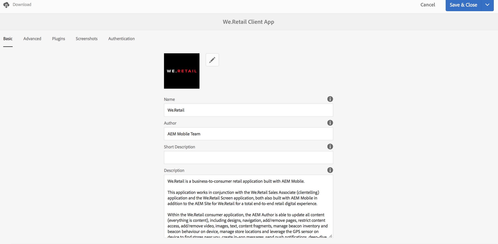

# App-tegel beheren{#manage-app-tile}

>[!NOTE]
>
>De Adobe adviseert het gebruiken van de SPARedacteur voor projecten die op kader-gebaseerde cliënt-zijteruggeven van enige paginatoepassing (bijvoorbeeld, Reageren) vereisen. [Meer informatie](/help/sites-developing/spa-overview.md).

De **App beheren** De tegel op het dashboard van de App verstrekt de capaciteit om details over de Toepassing te wijzigen. Als u de pagina Details wilt openen, klikt u op de detailkoppeling van de app beheren. Vanuit de beheerpagina kunt u de configuratie-instellingen (config.xml) van de PhoneGap-toepassing bewerken en uw toepassing voorbereiden voor verzending naar de verschillende opslagruimten van toepassingen.


## De toepassingstegel beheren {#understanding-the-manage-app-tile}

U kunt in elke tegel in de **App beheren** U kunt een tegel toevoegen om details weer te geven of te bewerken door te klikken op &#39;...&#39; in de rechterbenedenhoek.

### Het tabblad Standaard {#the-basic-tab}

U kunt de **Naam**, **Auteur**, **Korte beschrijving** en de **Beschrijving** voor uw app op dit tabblad.



### Het tabblad Geavanceerd {#the-advanced-tab}

Elk mobiel toepassingsplatform beschrijft welke gegevens worden verzameld, specifiek gericht op elke toepassingsopslag.

De getoonde platforms worden gedreven door de inhoud PhoneGap config.xml:

```xml
<widget>
<gap:platform name="ios"/>
<gap:platform name="android"/>
</widget>
```

Elke winkel van leverancierstoepassingen, bijvoorbeeld Apple App Store of Google Play Store, vereist een of meer schermafbeeldingen van uw mobiele toepassing om uw toepassingsdetails aan klanten te tonen. Deze schermafbeeldingen kunnen strikte vereisten hebben rond afmetingen en inhoud (in feite moeten ze de toepassing echt vertegenwoordigen). AEM toepassingen ondersteunen het selecteren en beheren van deze schermafbeeldingen voor de ondersteunde platforms en het bekijken van de poortafmetingen die vereist zijn voor de toepassingsopslag van elke leverancier.

>[!NOTE]
>
>De app AEM verifiëren biedt de mogelijkheid om schermafbeeldingen rechtstreeks naar uw toepassingsgegevens in AEM te verzenden.
>
>Zie [Mobile QuickStart voor AEM verifiëren](/help/mobile/phonegap-mobile-quickstart.md) voor meer informatie .


### Metagegevens {#metadata}

>[!NOTE]
>
>Als u eenmaal vertrouwd bent met de **App beheren** tegel, zie [App-metagegevens bewerken](/help/mobile/phonegap-editmetadata.md) om de metagegevens weer te geven en te bewerken.

#### Algemene metagegevens {#common-metadata}

Elke toepassing zou bijbehorende meta-gegevens moeten hebben die in het vormen van verschillende aspecten van de toepassing helpen. De pagina App beheren wordt gescheiden in twee verschillende gebieden die betrekking hebben op de verzameling van metagegevens. Platformspecifieke metagegevens en algemene metagegevens.

Er zijn algemene configuratie en metagegevens voor alle platforms.

In deze sectie definieert u de URL van de Content Update Server, de openingspagina voor uw mobiele toepassing, de PhoneGap-versie voor compilatie, uw toepassingsversie, naam, beschrijving en meer.

**App-versie** is de werkende versie van uw toepassing. De gebruikelijke werkwijze is om een notatie met drie decimalen te gebruiken en lager dan 1,0,0 te beginnen vóór de eerste release.

**PhoneGap-versie** Dit is de versie waarin u uw toepassing wilt compileren met PhoneGap. De beste manier is om de huidige versie bij te houden zodat u de nieuwste en beste functies en oplossingen voor problemen krijgt.

**URL van server voor bijwerken van inhoud** Dit is de URL die uw toepassing gebruikt om te bellen naar ContentSync-updates. Deze moet worden ingesteld op de URL van uw verzender of, als u geen Dispatcher gebruikt, op een van uw publicatie-instanties die wordt gebruikt om ContentSync-updates aan uw toepassing te leveren.


>[!NOTE]
>
>Deze sectie kan leeg lijken tenzij er gegevens zijn die de gebieden vullen.
>
>Bovenaan in de weergave Details ziet u de toepassingsversie, PhoneGap-versie en URL bijwerken. Elk van deze waarden kan worden ingesteld in de sectie Algemene metagegevens. De toepassings-id kan echter niet worden bewerkt.

#### Metagegevens platform {#platform-metadata}

Elk platform dat in PhoneGap config.xml wordt bepaald kan de eigenschappen van het douaneplatform bevatten. Een AEM ontwikkelaar moet de inhoudsstructuur bijdragen om deze eigenschappen vast te leggen. Een voorbeeld van platformspecifieke eigenschappen vindt u in iOS.

Metagegevens voor alle geconfigureerde platforms worden nu tegelijkertijd weergegeven op het tabblad Geavanceerd van de tegel App beheren.

>[!NOTE]
>
>De gedeelten met platformmetagegevens worden niet gebruikt door PhoneGap tijdens een CLI- of Remote PhoneGap-build, maar AEM pogingen om metagegevens voor platforms vast te leggen, zodat deze later kunnen worden gebruikt wanneer ze worden verzonden naar de toepassingsopslag van de beoogde leverancier.

Voor platforms die niet door AEM worden begrepen, is het nog mogelijk voor een AEM ontwikkelaar om UI uit te breiden om deze meta-gegevens te vangen die later kunnen worden uitgevoerd en tijdens het proces van de toepassingsvoorlegging worden gebruikt.

#### iOS-metagegevens {#ios-metadata}

De Apple AppStore vereist extra meta-gegevens om uw toepassing voor distributie voor te leggen. In de sectie met iOS-metagegevens wordt geprobeerd de vereiste informatie te verzamelen die door het iTMSTransporter-hulpprogramma van Apple kan worden gebruikt om de metagegevens te publiceren naar de bijbehorende Apple-ontwikkelaarsaccount.

Als u de specifieke metagegevens voor Apple wilt verkrijgen, moet u eerst de toepassing maken op [https://itunesconnect.apple.com](https://itunesconnect.apple.com/). Bij het maken van uw toepassing genereert Apple metagegevens die vereist zijn in de sectie met iOS-metagegevens als u de Apple iTMSTransporter-tool wilt gebruiken om de metagegevens te valideren en te uploaden naar itunesconnect.apple.com. Als u alleen de metagegevens wilt verzamelen, hoeft u niet noodzakelijkerwijs de iOS-specifieke metagegevens in te vullen. U kunt nog steeds de metagegevens exporteren die de iOS en de algemene metagegevens samenvoegen en alle schermafbeeldingen verzamelen in een ZIP-bestand dat op elk gewenst moment kan worden gedownload.

Het gedownloade zip-bestand bevat een gps-bestand dat kan worden geïnspecteerd op metadata.xml. Het itmsp-bestand bevat de geëxporteerde metagegevens (in het bestand metadata.xml) en alle bijbehorende schermafbeeldingen.

De exportfunctionaliteit wordt gebruikt om een handige manier te bieden om de schermafbeeldingen en metagegevens te verzamelen die kunnen worden doorgegeven aan de uitgever van de toepassing voor invoer in de specifieke toepassingsopslag van de leverancier.


#### Metagegevens Android™ {#android-metadata}

Wanneer u het Android™-platform selecteert, zijn er op dit punt geen aangepaste metagegevens die kunnen worden ingesteld. Wanneer u op de knop Downloaden klikt, wordt een ZIP-bestand gegenereerd met een eigenschappenbestand dat alle metagegevens en de bijbehorende schermafbeeldingen bevat.

De exportfunctionaliteit wordt gebruikt om een handige manier te bieden om de schermafbeeldingen en metagegevens te verzamelen die kunnen worden doorgegeven aan de uitgever van de toepassing voor invoer in de specifieke toepassingsopslag van de leverancier.


### URL van server voor bijwerken van inhoud {#content-update-server-url}

Een van de belangrijkste functies van AEM Apps is de mogelijkheid om een mobiele toepassing nieuwe inhoud te laten aanvragen via ContentSync, waar inhoud kan bestaan uit HTML-bronnen, pagina&#39;s, video, afbeeldingen, tekst en meer. Nadat de inhoud door de auteur is bijgewerkt en vervolgens is gepubliceerd, stelt de server de update van de inhoud beschikbaar zodat de mobiele toepassing deze kan downloaden.

Het bezit van de Server URL van de Update van de Inhoud is URL die aan een te publiceren instantie moet richten; of direct of door de Verzender of CDN. De indeling van de URL is eenvoudig:

`https://[hostname]:[port]`

>[!NOTE]
>
>Als de instantie van de auteurserver aan veelvoudige publicatie serverinstanties (gemeenschappelijke architectuur voor AEM) dupliceert, zal elke publicatieserver de zelfde updateinhoud hebben omdat de update op de auteur wordt voortgebouwd en aan alle publicatieinstanties wordt herhaald. In principe worden taakverdeling en failover volledig ondersteund.

### Het tabblad Plug-ins {#the-plugins-tab}

De **Plug-ins** bevat een beschrijving van de plug-ins die aan uw app zijn gekoppeld. Deze informatie wordt gebruikt om de aangewezen stop in tijdens een bouwstijl terug te winnen.


### Het tabblad Schermopnamen {#the-screenshots-tab}

De **Screenshots** worden de ondersteunde schermresoluties op verschillende platforms weergegeven.


>[!NOTE]
>
>Als u schermafbeeldingen wilt toevoegen en verwijderen, raadpleegt u [App-metagegevens bewerken](/help/mobile/phonegap-editmetadata.md).

### Het tabblad Verificatie {#the-authentication-tab}

De **Verificatie** kunt u een OAuth-client selecteren die u aan uw toepassing wilt koppelen en een ontwikkelaar in staat stellen Adobe Experience Manager OAuth-verificatie te gebruiken.


### De volgende stappen {#the-next-steps}

Zodra u over het Leiden van de Toepassing in het toepassingsdashboard hebt geleerd, zie de volgende middelen voor andere auteursrollen:

* [App-metagegevens bewerken](/help/mobile/phonegap-editmetadata.md)
* [Toepassingsdefinities](/help/mobile/phonegap-app-definitions.md)
* [Een nieuwe app maken met de wizard App maken](/help/mobile/phonegap-create-new-app.md)
* [Een bestaande hybride app importeren](/help/mobile/phonegap-adding-content-to-imported-app.md)
* [Inhoudsservices](/help/mobile/develop-content-as-a-service.md)

### Aanvullende bronnen {#additional-resources}

Meer informatie over de rollen en verantwoordelijkheden van een Beheerder en Ontwikkelaar vindt u in de volgende bronnen:

* [Ontwikkelen voor Adobe PhoneGap Enterprise met AEM](/help/mobile/developing-in-phonegap.md)
* [Inhoud voor Adobe PhoneGap Enterprise beheren met AEM](/help/mobile/administer-phonegap.md)
