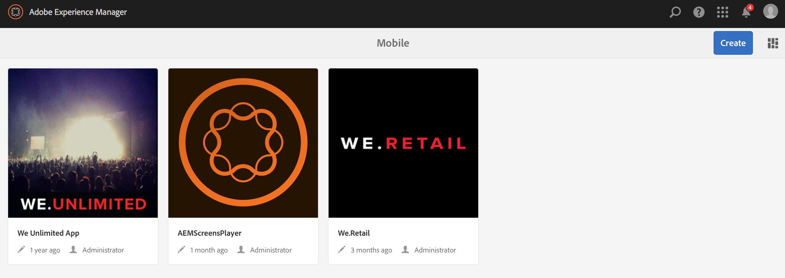
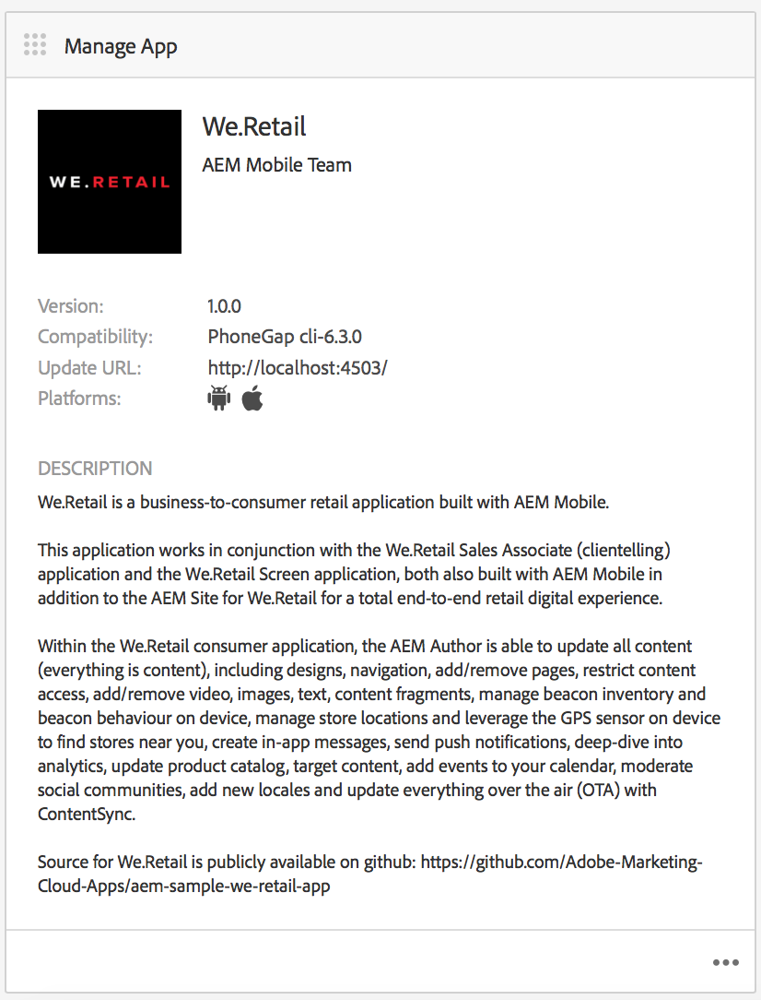
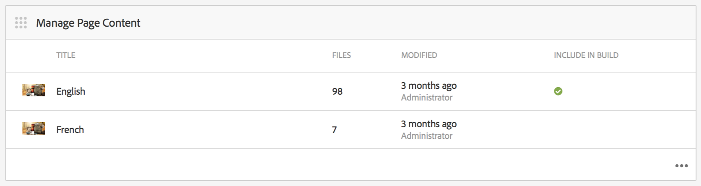
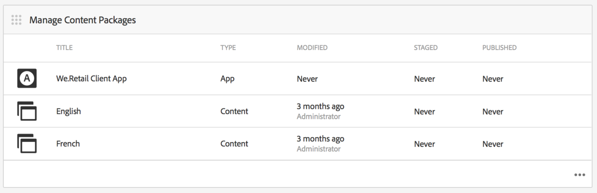
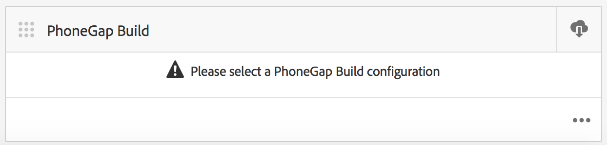

# Mobiele toepassingen ontwerpen{#authoring-mobile-applications}

>[!NOTE]
>
>Adobe raadt aan de SPA Editor te gebruiken voor projecten die renderen op basis van één pagina voor toepassingsframework op de client-side vereisen (bijvoorbeeld Reageren). [Meer](/help/sites-developing/spa-overview.md) informatie.

Met het AEM Mobile-dashboard kunt u uw mobiele toepassing maken, bouwen en implementeren, toepassingsmetagegevens maken, verwijderen en bewerken. Zodra uw toepassing live is, kunt u toepassingsanalyses analyseren, waaronder levenscyclus en gebruiksmetriek om klantconversie en merkloyaliteit te verbeteren.

Als u uw AEM Mobile-toepassing wilt maken, raadpleegt u de pagina [Mobiele toepassingen maken](/help/mobile/building-app-mobile-phonegap.md).

Zie [AEM beheren voor gebruik AEM PhoneGap Enterprise](/help/mobile/administer-phonegap.md) om uw omgeving in te stellen en aan de slag te gaan.

## De AEM Mobile-appencatalogus {#the-aem-mobile-apps-catalog}

In de [AEM Mobile Apps Catalog](http://localhost:4502/aem/apps.html/content/phonegap) wordt al uw mobiele app weergegeven die in AEM wordt beheerd.

U kunt deze catalogus beschouwen als de &quot;bestemmingspagina&quot; voor AEM Mobile, waar beheerders een nieuwe AEM Mobile-toepassing kunnen starten door een nieuwe-toepassing te maken op basis van een sjabloon of door een bestaande toepassing te uploaden die al door een mobiele ontwikkelaar is gestart.

Ga als volgt te werk om naar de bestemmingspagina van de catalogus apps te gaan:

1. Blader naar **Navigatie** en kies **Mobiel**.

1. Kies **Apps** om de catalogus met apps te openen.

## Het AEM Mobile App-dashboard {#the-aem-mobile-app-dashboard}

Als u een AEM Mobile-toepassing in de catalogus selecteert, wordt het dashboard weergegeven. Hier kunt u uw toepassing beheren, statistieken bekijken, uw inhoud voor mobiele apps maken, implementeren en beheren.

U kunt elke tegel in het AEM Mobile-dashboard uitvouwen om details weer te geven of te bewerken door op de knop &#39;..&#39; te klikken. in de rechterbenedenhoek.

### De toepassingstegel beheren {#the-manage-app-tile}

De Manage App Tegel toont uw toepassingspictogram, naam, beschrijving, gesteunde platforms, vraaghuis voor updates URL en versieinformatie. U kunt in deze tegel boren om de Configuratie van de Toepassing PhoneGap (config.xml) uit te geven en te handhaven en, uw toepassing voor voorlegging aan de diverse toepassingsopslag voor distributie voor te bereiden.

Klik [hier](/help/mobile/phonegap-app-details-tile.md) voor meer informatie.

### De pagina-inhoudtegel beheren {#the-manage-page-content-tile}

Inhoud kan in AEM Mobile op dezelfde manier worden gemaakt, bijgewerkt en verwijderd als in AEM Sites. In **De pagina-inhoudtegel beheren** wordt het aantal pagina&#39;s met beheerde inhoud en de laatst gewijzigde inhoud weergegeven. U kunt inhoud inchecken om pagina&#39;s te maken, kopiëren, verplaatsen, verwijderen en bijwerken door op elke record in de tegel te klikken. Als de inhoud eenmaal is bijgewerkt, kunt u een update van de inhoud naar uw klanten uitvoeren via de **Content Packages Tile beheren.**

### De Content Packages-tegel beheren {#the-manage-content-packages-tile}

Nadat u de inhoud hebt toegevoegd of gewijzigd via de Content Tile van de Pagina beheren, kunt u deze wijzigingen doorsturen naar uw klanten met een update voor de inhoudsversie.

Met Inhoudspakket kan de AEM App Author pagina-inhoud beheren in AEM en kan uw ontwikkelingsteam wijzigingen aanbrengen in uw PhoneGap Shell-toepassing (d.w.z. toepassingsframework of infrastructuur) en deze wijzigingen vervolgens snel en zonder dat een ontwikkelaar zich hoeft aan te melden bij de verschillende winkels voor distributie.

Met Inhoudspakket wordt voor elke update een ZIP-bestand gemaakt, dat wordt beschouwd als een pakket met de inhoudsversie. Deze pakketten bevatten HTML-bronnen en HTML-pagina&#39;s die tijdens het renderen van de app worden gegenereerd en zijn intelligent genoeg om alleen die bestanden te verpakken die sinds de laatste update zijn gewijzigd.

In de kolom **Type** van het blok Content Package beheren wordt ofwel &#39;App&#39; weergegeven om de inhoud van Shell van de toepassing aan te duiden, bijvoorbeeld het framework of de infrastructuur van de toepassing die door een ontwikkelaar wordt beheerd, of &#39;Content&#39; dat pagina-inhoud vertegenwoordigt die door de auteur van de inhoud wordt beheerd.

Inhoud kan worden weergegeven als een taal of als een bepaald deel van de app waarin meerdere pakketten voor inhoudsrelease worden gebruikt door de app. De keuze van de manier waarop u uw inhoud bundelt, is ontworpen om flexibel te zijn en volledig te beantwoorden aan de manier waarop u inhoud voor uw toepassing wilt beheren.

De kolom **Gewijzigd** geeft aan wanneer de pagina&#39;s het laatst zijn gewijzigd.

De **Staged** kolom toont toen de laatste inhoudsupdate werd gecreeerd. Als u een nieuwe inhoudsupdate wilt maken en uw wijzigingen wilt uitvoeren, opent u alle records in de tegel en maakt u een nieuwe update.

De kolom **Gepubliceerd** geeft aan wanneer de laatste inhoudsupdate is gepubliceerd en beschikbaar is gemaakt voor gebruik door uw klanten. Als u inhoud wilt publiceren, moet u eerst die inhoud in het werkgebied plaatsen en de update vervolgens publiceren door naar deze tegel te boren en deze te publiceren via de detailconsole van de inhoudsrelease.

 

Dit pictogram vertegenwoordigt een pakket met de inhoudsversie voor de app-shell

Deze pictogrammen vertegenwoordigen een pakket Inhoud vrijgeven voor app-inhoud

### De PhoneGap Build-tegel {#the-phonegap-build-tile}

De **PhoneGap Build-tegel** maakt verbinding met [https://build.phonegap.com](https://build.phonegap.com) om externe buids te bouwen en te hosten. Nadat de build is gemaakt, wordt de build beschikbaar gesteld als een download of rechtstreeks aan uw apparaat via een QR-code.

U kunt ook de apparaatbron downloaden om lokaal te bouwen via de [PhoneGap CLI](https://docs.phonegap.com/en/3.5.0/guide_cli_index.md.html).

### De metrische tegel {#the-metrics-tile}

>[!CAUTION]
>
>De tegel Metrics wordt alleen weergegeven nadat u de cloudservice hebt geconfigureerd.
>
>Zie [Configureer uw Adobe Mobile Services-Cloud Service](/help/mobile/configure-adobe-mobile-cloud-service.md) voor meer informatie.

AEM Mobile integreert met Adobe Analytics via [Adobe Mobile Services SDK](https://www.adobe.com/ca/solutions/digital-marketing/mobile-services/app-sdk.html) (AMS).

In het Control Center **Metrics Tile** worden samenvattingsanalyses weergegeven die vanuit AMS voor uw toepassing zijn opgehaald. U kunt naar het dashboard Analytics gaan door op &#39;...&#39; te klikken. rechtsonder.

### De Content-tegel Entiteit beheren {#the-manage-entity-content-tile}

Met de Content Tile van Entiteit beheren kunt u toepassingsdefinities toevoegen en beheren. Toepassingsdefinities zijn een manier om te bepalen welke spaties (en andere configuraties) geschikt zijn voor de app. Op deze manier kunt u een nieuwe spatie toevoegen zonder dat u de app opnieuw hoeft te compileren. De toepassingsdefinitie wordt bijgewerkt en bevat de informatie voor nieuwe spaties.

Klik [hier](/help/mobile/phonegap-app-definitions.md) om uw toepassingsdefinities te maken en te beheren.

U kunt naar het beheerdersinhouddashboard gaan door op &#39;..&#39; te klikken. rechtsonder.

#### Aanvullende bronnen {#additional-resources}

Meer informatie over de rollen en verantwoordelijkheden van een Beheerder en Ontwikkelaar vindt u in de volgende bronnen:

* [Ontwikkelen voor Adobe PhoneGap Enterprise met AEM](/help/mobile/developing-in-phonegap.md)
* [Inhoud voor Adobe PhoneGap Enterprise beheren met AEM](/help/mobile/administer-phonegap.md)

