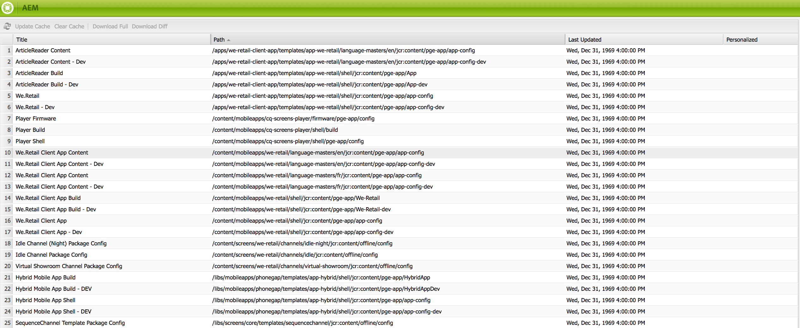

# Mobiel met inhoudssynchronisatie{#mobile-with-content-sync}

{{ue-over-mobile}}

>[!NOTE]
>
>Dit document maakt deel uit van [ Begonnen het Worden met Mobiele (AEM) Gids van Adobe Experience Manager ](/help/mobile/getting-started-aem-mobile.md), een geadviseerd uitgangspunt voor de verwijzing van AEM Mobile.

Gebruik Content Sync om inhoud te verpakken zodat deze kan worden gebruikt in systeemeigen mobiele toepassingen. Pagina&#39;s die in AEM zijn gemaakt, kunnen als toepassingsinhoud worden gebruikt, zelfs als het apparaat offline is. Omdat AEM pagina&#39;s zijn gebaseerd op webstandaarden, werken ze bovendien op verschillende platforms, zodat u ze in elke native wrapper kunt insluiten. Deze strategie beperkt de ontwikkelingsinspanningen en stelt u in staat om toepassingsinhoud eenvoudig bij te werken.

>[!NOTE]
>
>PhoneGap-toepassingen die u maakt met AEM Tools zijn al geconfigureerd om AEM pagina&#39;s als inhoud te gebruiken via Content Sync.

Met het raamwerk van Content Sync wordt een archiefbestand gemaakt dat de webinhoud bevat. De inhoud kan om het even wat van eenvoudige pagina&#39;s, beelden, en de dossiers van PDF, of volledige toepassingen van het Web zijn. De API voor het synchroniseren van inhoud biedt toegang tot het archiefbestand via mobiele apps of om processen te maken zodat de inhoud kan worden opgehaald en opgenomen in de app.

De volgende reeks stappen illustreert een typisch geval van gebruik voor de Synchronisatie van de Inhoud:

1. De AEM ontwikkelaar maakt een configuratie voor inhoudssynchronisatie waarmee de inhoud wordt opgegeven die moet worden opgenomen.
1. Met het raamwerk voor inhoudssynchronisatie wordt de inhoud verzameld en in cache opgeslagen.
1. Op een mobiel apparaat wordt de mobiele toepassing gestart en wordt inhoud van de server opgevraagd. Deze inhoud wordt in een ZIP-bestand geleverd.
1. De client pakt de ZIP-inhoud uit in het lokale bestandssysteem. De mapstructuur in het ZIP-bestand simuleert de paden die een client (bijvoorbeeld een browser) normaal gesproken van de server zou aanvragen.
1. De client opent de inhoud in een ingesloten browser of gebruikt deze op een andere manier.
1. Later vraagt de client bijgewerkte inhoud op de server aan. Het Content Sync-framework biedt incrementele updates om de downloadgrootte en -tijd te beperken. Dit kan belangrijk zijn voor mobiele apparaten vanwege beperkte bandbreedte of gegevensvolumes.

>[!NOTE]
>
>Om meer informatie over richtlijnen te krijgen voor het ontwikkelen van de handlers van de Synchronisatie van de Inhoud uit de doos app handlers zien, zie [ het Ontwikkelen van de Handlers van de Synchronisatie van de Inhoud ](/help/mobile/contentsync-app-handlers.md).

## Inhoud voor inhoudssynchronisatie configureren {#configuring-the-content-sync-content}

Maak een configuratie voor Content Sync om de inhoud op te geven van het ZIP-bestand dat aan de client wordt geleverd. U kunt een willekeurig aantal configuraties voor Content Sync maken. Elke configuratie heeft een naam voor identificatiedoeleinden.

Als u een Content Sync-configuratie wilt maken, voegt u een `cq:ContentSyncConfig` -knooppunt toe aan de repository, met de `sling:resourceType` -eigenschap ingesteld op `contentsync/config` . Het knooppunt `cq:ContentSyncConfig` kan zich overal in de opslagplaats bevinden, maar het knooppunt moet toegankelijk zijn voor gebruikers in de AEM-publicatie-instantie. Daarom moet u het knooppunt onder `/content` toevoegen.

Voeg onderliggende knooppunten toe aan het knooppunt cq:ContentSyncConfig om de inhoud van het ZIP-bestand voor het synchroniseren van inhoud op te geven. De volgende eigenschappen van elk onderliggend knooppunt identificeren een inhoudsitem dat moet worden opgenomen en hoe dit wordt verwerkt wanneer het wordt toegevoegd:

* `path`: De locatie van de inhoud.
* `type`: De naam van het configuratietype dat moet worden gebruikt voor het verwerken van de inhoud. Verschillende typen zijn beschikbaar en worden beschreven in Configuratietypen.

Zie Voorbeeld van configuratie van inhoudssynchronisatie.

Nadat u de configuratie voor inhoudssynchronisatie hebt gemaakt, wordt deze weergegeven in de inhoudssynchronisatieconsole.

>[!NOTE]
>
>Het raamwerk van Content Sync controleert niet of afhankelijkheden van elementen en ontwerpgerelateerde bestanden zijn opgenomen in pakketten voor inhoudssynchronisatie. Zorg ervoor dat u alle vereiste bestanden opneemt in het ZIP-bestand.

### Toegang tot downloads voor inhoudssynchronisatie configureren {#configuring-access-to-content-sync-downloads}

Geef een gebruiker of groep op die kan worden gedownload van Content Sync. U kunt de standaardgebruiker of de groep vormen die van alle geheime voorgeheugens van de Synchronisatie van de Inhoud kan downloaden, en u kunt het gebrek met voeten treden en toegang voor een specifieke configuratie van de Synchronisatie van de Inhoud vormen.

Wanneer AEM is geïnstalleerd, kunnen leden van de beheerdersgroep standaard downloaden van Content Sync.

### Standaardtoegang voor downloaden van inhoudssynchronisatie instellen {#setting-the-default-access-for-content-sync-downloads}

De dienst van de Manager van de Synchronisatie van de Inhoud van de Dag CQ bepaalt toegang tot de Synchronisatie van de Inhoud. Configureer deze service om de gebruiker of groep op te geven die standaard kan downloaden van Content Sync.

Als u [ de dienst vormt gebruikend de Console van het Web ](/help/sites-deploying/configuring-osgi.md#osgi-configuration-with-the-web-console), typ de naam van de gebruiker of de groep als waarde van het Toegelaten bezit van het Geheime voorgeheugen van de Terugval.

Als u [ vormt in de bewaarplaats ](/help/sites-deploying/configuring-osgi.md#osgi-configuration-in-the-repository), gebruik de volgende informatie over de dienst:

* PID: com.day.cq.contentsync.impl.ContentSyncManagerImpl
* Eigenschapnaam: contentsync.fallback.authorizable

#### Download Access negeren voor cache van inhoudssynchronisatie {#overriding-download-access-for-a-content-sync-cache}

Als u downloadtoegang wilt configureren voor een specifieke configuratie voor inhoudssynchronisatie, voegt u de volgende eigenschap toe aan het knooppunt `cq:ContentSyncConfig` :

* Naam: geautoriseerd
* Type: String
* Waarde: de naam van de gebruiker of groep die kan worden gedownload.

Met uw app kunnen gebruikers bijvoorbeeld updates rechtstreeks installeren via Content Sync. Als u wilt dat alle gebruikers de update kunnen downloaden, stelt u de waarde van de eigenschap Authorizable in op `everyone` .

Als het knooppunt `cq:ContentSyncConfig` geen toegestane eigenschap heeft, bepaalt de standaardgebruiker of -groep die is geconfigureerd voor de eigenschap Fallback Cache Authorizable van de Day CQ Content Sync Manager-service wie kan downloaden.

### De gebruiker configureren voor het bijwerken van een cache voor inhoudssynchronisatie {#configuring-the-user-for-updating-a-content-sync-cache}

Wanneer een gebruiker een update uitvoert naar de cache van Content Sync, voert een specifieke gebruikersaccount de actie uit namens de gebruiker. De anonieme gebruiker werkt standaard alle cache voor Content Sync bij.

U kunt de standaardgebruiker overschrijven en een gebruiker of groep opgeven die een specifieke cache voor het synchroniseren van inhoud bijwerkt.

Als u de standaardgebruiker wilt overschrijven, geeft u een gebruiker of groep op die updates uitvoert voor een specifieke configuratie van Content Sync door de volgende eigenschap toe te voegen aan de node cq:ContentSyncConfig:

* Naam: updategebruiker
* Type: String
* Waarde: de naam van de gebruiker of groep die de updates kan uitvoeren.

Als het knooppunt cq:ContentSyncConfig geen eigenschap `updateuser` heeft, werkt de standaardanonieme gebruiker de cache bij.

### Configuratietypen {#configuration-types}

Verwerking kan variëren van het renderen van eenvoudige JSON tot volledige rendering van pagina&#39;s, inclusief de elementen waarnaar wordt verwezen. Deze sectie maakt een lijst van de beschikbare configuratietypen en hun specifieke parameters:

**exemplaar** kopieert eenvoudig dossiers en omslagen.

* **weg** - als de weg aan één enkel dossier richt, slechts wordt het dossier gekopieerd. Als de map naar een map verwijst (inclusief paginaknooppunten), worden alle onderstaande bestanden en mappen gekopieerd.

**inhoud** - geef inhoud terug gebruikend standaard het Verschuiven verzoekverwerking.

* **weg** - Weg aan middel dat output zou moeten zijn.
* **uitbreiding** - Uitbreiding die in het verzoek zou moeten worden gebruikt. De gemeenschappelijke voorbeelden zijn *html* en *json*, maar een andere uitbreiding is mogelijk.

* **selecteur** - Facultatieve selecteurs die door punt worden gescheiden. De gemeenschappelijke voorbeelden zijn *aanraking* voor het teruggeven van mobiele versies van een pagina of *oneindigheid* voor output JSON.

**clientlib** - verpak een JavaScript of CSS cliëntbibliotheek.

* **weg** - Weg aan de wortel van de cliëntbibliotheek.
* **uitbreiding** - Type van cliëntbibliotheek. Dit zou aan of *js* of *css* op het ogenblik moeten worden geplaatst.

* **includeFolders** - het Type is een serie van koorden, en het laat de gebruiker extra omslagen aan aftasten in de cliëntbibliotheek om dossiers (zoals douanedoopvonten) te halen.

**activa** - verzamel originele vertoningen van activa.

* **weg** - Weg aan een activaomslag onder /content/dam.
* **vertoningen** - het Type is een serie van koorden die de gebruiker laat specificeren welke vertoningen in plaats van het standaardbeeld te gebruiken. De volgende lijst geeft een overzicht van enkele uitvoeringen buiten de box, maar u kunt ook elke uitvoering gebruiken die door de workflow wordt gemaakt:

   * *origineel*
   * *cq5dam.thumbnail.48.48.png*
   * *cq5dam.thumbnail.319.319.png*
   * *cq5dam.thumbnail.140.100.png*
   * *cq5dam.web.1280.1280.png*

**beeld** - verzamel een beeld.

* **weg** - Weg aan een beeldmiddel.

Het afbeeldingstype wordt gebruikt om het logo We.Retail in het ZIP-bestand op te nemen.

**pagina&#39;s** - geef AEM pagina&#39;s terug en verzamel referenced activa.

* **weg** - Weg aan een pagina.
* **uitbreiding** - Uitbreiding die in het verzoek zou moeten worden gebruikt. Voor pagina&#39;s is dit bijna altijd *html*, maar anderen zijn nog mogelijk.

* **selecteur** - Facultatieve selecteurs die door punt worden gescheiden. De gemeenschappelijke voorbeelden zijn *aanraking* voor het teruggeven van mobiele versies van een pagina.

* **diep** - Facultatief booleaans bezit dat bepaalt als de kindpagina&#39;s, eveneens zouden moeten worden omvat. De standaardwaarde is waar *.*

* **includeImages** - Facultatief booleaans bezit dat bepaalt als de beelden zouden moeten worden omvat. De standaardwaarde is waar **.
Standaard worden alleen afbeeldingscomponenten met een type basis/componenten/afbeelding als opname beschouwd. U kunt meer middeltypes toevoegen door de **Handler van de Update van de Pagina&#39;s van CQ WCM van de Dag** in de console van het Web te vormen.

**herschrijft** - de herschrijf knoop bepaalt hoe de verbindingen in de uitgevoerde pagina worden herschreven. De herschreven koppelingen kunnen verwijzen naar de bestanden in het ZIP-bestand of naar de bronnen op de server.

Het knooppunt `rewrite` moet zich onder het knooppunt `page` bevinden.

Het knooppunt `rewrite` kan een of meer van de volgende eigenschappen hebben:

* `clientlibs`: herschrijft clientlibs-paden.

* `images` : herschrijft afbeeldingspaden.
* `links` : herschrijft koppelingen naar paden.

Elke eigenschap kan een van de volgende waarden hebben:

* `REWRITE_RELATIVE` : herschrijft het pad met een relatieve positie ten opzichte van het bestand page.html op het bestandssysteem.

* `REWRITE_EXTERNAL`: herschrijft de weg door aan het middel op de server te richten, gebruikend de AEM [ dienst ExternalAlizer ](/help/sites-developing/externalizer.md).

De AEM dienst riep **PathRewriterTransformerFactory** laat u de specifieke html attributen vormen die zullen worden herschreven. De service kan worden geconfigureerd in de webconsole en heeft een configuratie voor elke eigenschap van de node `rewrite` : `clientlibs` , `images` en `links` .

Deze functie is toegevoegd in AEM 5.5.

### Configuratie voorbeeldinhoud synchroniseren {#example-content-sync-configuration}

Hieronder ziet u een voorbeeldconfiguratie voor Content Sync.

```java
+ weretail_go [cq:ContentSyncConfig]
  - sling:resourceType = "contentsync/config"

  + etc.designs.default [nt:unstructured]
    - path = "/etc/designs/default"
    - type = "copy"

  + etc.designs.mobile [nt:unstructured]
    - path = "/etc/designs/mobile"
    - type = "copy"

  + events.plist [nt:unstructured]
    - path = "/content/weretail_mobile/en/events/jcr:content/par/events"
    - type = "content"
    - extension = "plist"

  + events.touch.html [nt:unstructured]
    - path = "/content/weretail_mobile/en/events"
    - type = "pages"
    - extension = "html"
    - selector = "touch"

  + logo [nt:unstructured]
    - path = "/etc/designs/mobile/jcr:content/mobilecontentpage/logo"
    - type = "logo"

  + manifest [nt:unstructured]
    - indexPage = "/content/weretail_mobile/en/events.touch.html"
    - metadataPlist = "/content/weretail_mobile/en/events/_jcr_content/par/events.plist"

  + ...
```

**etc.designs.default en etc.designs.mobile** - De eerste twee ingangen van de configuratie zijn duidelijk. Omdat we verschillende mobiele pagina&#39;s gaan opnemen, hebben we de bijbehorende ontwerpbestanden nodig onder /etc/designs. En omdat er geen extra verwerkingstijd nodig is, volstaat een kopie.

**events.plist** - Deze ingang is een beetje speciaal. Zoals vermeld in de inleiding, zou de toepassing een kaartweergave van tellers van de plaatsen van de gebeurtenissen moeten verstrekken. De benodigde locatie-informatie wordt als een afzonderlijk bestand in PLIST-indeling verstrekt. Dit werkt alleen wanneer de component met de gebeurtenislijst die op de indexpagina wordt gebruikt, een script heeft met de naam plist.jsp. Dit script wordt uitgevoerd wanneer de bron van de component wordt aangevraagd met de `.plist` -extensie. Zoals gebruikelijk, wordt de componentenweg gegeven in het wegbezit en het type wordt geplaatst aan inhoud, omdat wij het Verwerking van het Verschuivingsverzoek willen gebruiken.

**events.touch.html** - komt dan de daadwerkelijke pagina&#39;s die in app worden getoond. De eigenschap path wordt ingesteld op de hoofdpagina van de gebeurtenis. Alle gebeurtenispagina&#39;s onder die pagina worden ook opgenomen, omdat de eigenschap deep standaard op true wordt ingesteld. Pagina&#39;s worden gebruikt als configuratietype, zodat alle afbeeldingen of andere bestanden waarnaar kan worden verwezen vanuit een afbeelding of downloadcomponent op een pagina, worden opgenomen. Bovendien geeft het instellen van de aanraakkiezer ons een mobiele versie van de pagina&#39;s. De configuratie in het eigenschappak bevat meer ingangen van dit type, maar zij worden verlaten hier voor eenvoud.

**embleem** - het type van logoconfiguratie is niet vermeld tot dusver en het is geen van de bouwstijltypes. Het raamwerk voor het synchroniseren van inhoud kan echter tot op zekere hoogte worden uitgebreid. Dit is een voorbeeld hiervan, dat in de volgende sectie zal worden behandeld.

**manifest** - het is vaak wenselijk om één of ander soort meta-gegevens te hebben inbegrepen in het ZIP dossier, zoals de beginpagina van uw inhoud bijvoorbeeld. Door dergelijke gegevens te coderen voorkomt u echter dat u deze later gemakkelijk kunt wijzigen. Het kader van de Synchronisatie van de Inhoud steunt dit gebruiksgeval door een duidelijke knoop in de configuratie te zoeken, die door naam wordt geïdentificeerd en geen configuratietype vereist. Elke eigenschap die op dat knooppunt is gedefinieerd, wordt toegevoegd aan een bestand dat ook wel manifest wordt genoemd en dat zich in de hoofdmap van het ZIP-bestand bevindt.

In het voorbeeld moet de pagina met gebeurtenislijsten de eerste pagina zijn. Deze informatie wordt verstrekt in het **indexPage** bezit en kan zo gemakkelijk op elk ogenblik worden veranderd. Een tweede bezit bepaalt de weg van het {*dossier 0} events.plist.* Zoals wij later zien, kan de cliënttoepassing manifest nu lezen en handelen volgens het.

Wanneer de configuratie is ingesteld, kan de inhoud worden gedownload met een browser of een andere HTTP-client, of als u zich ontwikkelt voor iOS, kunt u de toegewezen WAppKitSync-clientbibliotheek gebruiken. De downloadplaats wordt samengesteld uit de weg van de configuratie en de {*uitbreiding 0}.zip, bijvoorbeeld, wanneer het werken met een lokale AEM instantie:* https://localhost:4502/content/weretail_go.zip **

### De console voor het synchroniseren van inhoud {#the-content-sync-console}

De console van de Synchronisatie van de Inhoud maakt een lijst van alle configuraties van de Synchronisatie van de Inhoud in de bewaarplaats (alle knopen van type `cq:ContentSyncConfig`) en voor elke configuratie laat u het volgende doen:

* De cache bijwerken.
* Wis de cache.
* Download een volledig postvak.
* Download een diff zip tussen nu en een specifieke datum en tijd.

Het kan nuttig voor ontwikkeling en het oplossen van problemen zijn.

De console is toegankelijk op:

`https://localhost:4502/libs/cq/contentsync/content/console.html`

Het ziet er als volgt uit:



### Uitbreiding van het raamwerk voor contentsynchronisatie {#extending-the-content-sync-framework}

Hoewel het aantal configuratieopties reeds uitgebreid is, kan het niet alle vereisten van uw specifiek gebruiksgeval behandelen. In deze sectie worden de extensiepunten van het Content Sync-framework beschreven en hoe u aangepaste configuratietypen kunt maken.

Voor elk configuratietype, is er de Handler van de Update van de a *Inhoud*, die een OSGi componentenfabriek is die voor dat specifieke type wordt geregistreerd. Deze handlers verzamelen inhoud, verwerken deze en voegen deze toe aan een cache die door het Content Sync-framework wordt onderhouden. Implementeer de volgende interface of abstracte basisklasse:

* `com.day.cq.contentsync.handler.ContentUpdateHandler` - Interface die alle updatehandlers moeten implementeren
* `com.day.cq.contentsync.handler.AbstractSlingResourceUpdateHandler` - Een abstracte klasse die het teruggeven van middelen gebruikend het Verkopen vereenvoudigt

Registreer uw klasse als OSGi componentenfabriek en stel het in de container OSGi in een bundel op. Dit kan worden gedaan gebruikend de [ Gemaakt SCR gestopt insteekmodule ](https://felix.apache.org/documentation/subprojects/apache-felix-maven-scr-plugin/apache-felix-maven-scr-plugin-use.html) of gebruikend markeringen JavaDoc of annotaties. In het volgende voorbeeld wordt de JavaDoc-versie getoond:

```java
/*
 * @scr.component metatype="no"
 * factory="com.day.cq.contentsync.handler.ContentUpdateHandler/customtype"
 */
public class CustomTypeUpdateHandler implements ContentUpdateHandler {
    // add your code here
}

/*
 * @scr.component metatype="no" inherit="true"
 * factory="com.day.cq.contentsync.handler.ContentUpdateHandler/othertype"
 */
public class OtherTypeUpdateHandler extends AbstractSlingResourceUpdateHandler {
    // add your code here
}
```

Bericht dat de *factory* definitie de gemeenschappelijke interface en het douanetype bevat dat door schuine streep wordt gescheiden. Deze strategie laat het kader van de Synchronisatie van de Inhoud toe om een geval van uw douaneklasse te vinden en tot stand te brengen aangezien het het douanetype in een configuratieingang erkent. In de volgende sectie ziet u een concreet voorbeeld van een aangepaste update-handler.

>[!CAUTION]
>
>Wanneer het bouwen op de AbstractSlingResourceUpdateHandler basisklasse, moet u de *erven* definitie toevoegen. Anders zal de container OSGi niet de vereiste verwijzingen plaatsen die in de basisklasse worden verklaard.

### Een aangepaste updatehandler implementeren {#implementing-a-custom-update-handler}

Elke pagina Web.Retail Mobile bevat een logo in de linkerbovenhoek dat we in het ZIP-bestand willen opnemen. Nochtans, voor geheim voorgeheugenoptimalisering, verwijst AEM niet naar de echte plaats van het beelddossier in de bewaarplaats, die ons verhindert eenvoudig het **exemplaar** configuratietype te gebruiken. Wat wij in plaats daarvan moeten doen is ons eigen **logo** configuratietype te verstrekken dat het beeld bij de plaats beschikbaar maakt die door AEM wordt gevraagd. In het volgende codevoorbeeld wordt de volledige implementatie van de logo-updatehandler getoond:

#### LogoUpdateHandler.java {#logoupdatehandler-java}

```java
package com.day.cq.wcm.apps.weretail.impl;

import javax.jcr.Node;
import javax.jcr.RepositoryException;
import javax.jcr.Session;

import org.apache.sling.api.resource.Resource;
import org.apache.sling.api.resource.ResourceResolver;
import org.apache.sling.jcr.resource.JcrResourceResolverFactory;

import com.day.cq.commons.jcr.JcrUtil;
import com.day.cq.contentsync.config.ConfigEntry;
import com.day.cq.contentsync.handler.ContentUpdateHandler;
import com.day.cq.wcm.foundation.Image;
import com.day.text.Text;

/**
 * The <code>LogoUpdateHandler</code> is used to update the content sync cache
 * with a page logo added using a logo component.
 *
 * @scr.component metatype="no"
 * factory="com.day.cq.contentsync.handler.ContentUpdateHandler/logo"
 */
public class LogoUpdateHandler implements ContentUpdateHandler {

    private static final Logger log = LoggerFactory.getLogger(LogoUpdateHandler.class);

    /** @scr.reference policy="static" */
    protected JcrResourceResolverFactory resolverFactory;

    public boolean updateCacheEntry(ConfigEntry configEntry, Long lastUpdated, String configCacheRoot, Session admin, Session session) {
        ResourceResolver resolver = resolverFactory.getResourceResolver(admin);
        Resource resource = resolver.getResource(configEntry.getContentPath());

        Image img = new Image(resource);
        img.setItemName(Image.NN_FILE, "image");
        img.setItemName(Image.PN_REFERENCE, "imageReference");
        img.setSelector("img");

        try {
            if(img.getLastModified() == null || lastUpdated < img.getLastModified().getTime().getTime()) {
                String src = img.getSrc();
                String parentPath = configCacheRoot + Text.getRelativeParent(src, 1);

                Node parent = JcrUtil.createPath(parentPath, "sling:Folder", admin);
                Node image = resolver.getResource(resource.getPath() + "/image").adaptTo(Node.class);
                JcrUtil.copy(image, parent, Text.getName(src));

                admin.save();

                return true;
            }
        } catch (RepositoryException e) {
            log.error("Unexpected error while updating logo: ", e);
        }

        return false;
    }
}
```

De klasse `LogoUpdateHandler` implementeert de methode `ContentUpdateHandler` interface `updateCacheEntry(ConfigEntry, Long, String, Session, Session)` , die verschillende argumenten gebruikt:

* Een `ConfigEntry` -instantie die toegang biedt tot de configuratie-ingang, waarvoor deze handler wordt aangeroepen, en de eigenschappen ervan.
* Een `lastUpdated` -tijdstempel die aangeeft wanneer de Content Sync voor het laatst de cache heeft bijgewerkt. Inhoud die na die tijdstempel niet is gewijzigd, moet niet door de handler worden bijgewerkt.
* Een `configCacheRoot` -argument dat het hoofdpad van de cache opgeeft. Alle bijgewerkte bestanden moeten onder dit pad worden opgeslagen om aan het ZIP-bestand te worden toegevoegd.
* Een beheersessie die moet worden gebruikt voor alle bewerkingen in de opslagplaats die betrekking hebben op cache.
* Een gebruikerssessie die kan worden gebruikt om inhoud bij te werken in de context van een bepaalde gebruiker en zo een soort gepersonaliseerde inhoud te verstrekken.

Om de douanemanager uit te voeren, creeer eerst een geval van de klasse van het Beeld die op het middel wordt gebaseerd dat in de configuratieingang wordt gegeven. Dit is eigenlijk dezelfde procedure als de eigenlijke logocomponent op onze pagina&#39;s. Het zorgt ervoor dat het doelpad van de afbeelding hetzelfde is als het pad waarnaar op een pagina wordt verwezen.

Controleer vervolgens of de bron is gewijzigd sinds de laatste update. De implementaties van de douane zouden onnodige updates van het geheime voorgeheugen moeten vermijden en zouden vals terugkeren als niets verandert. Als de bron is gewijzigd, kopieert u de afbeelding naar de verwachte doellocatie ten opzichte van de cachroot. Tot slot wordt `true` geretourneerd om aan het framework aan te geven dat de cache is bijgewerkt.

## De inhoud op de client gebruiken {#using-the-content-on-the-client}

Als u inhoud wilt gebruiken in een mobiele toepassing die wordt geleverd door Content Sync, moet u inhoud aanvragen via een HTTP- of HTTPS-verbinding. Hierdoor kan opgehaalde inhoud (verpakt in een ZIP-bestand) lokaal worden uitgepakt en opgeslagen op het mobiele apparaat. Inhoud heeft niet alleen betrekking op gegevens, maar ook op logica, dat wil zeggen volledige webtoepassingen. Hierdoor kan de mobiele gebruiker opgehaalde webtoepassingen en bijbehorende gegevens uitvoeren, zelfs zonder netwerkconnectiviteit.

Content Sync levert inhoud op intelligente wijze: Alleen gegevenswijzigingen sinds de laatste succesvolle gegevenssynchronisatie worden geleverd, waardoor de tijd die nodig is voor gegevensoverdracht wordt verkort. Bij de eerste uitvoering van een toepassingsgegevens worden wijzigingen aangevraagd sinds 1 januari 1970, en vervolgens worden alleen gegevens gevraagd die zijn gewijzigd sinds de laatste geslaagde synchronisatie. AEM gebruikt een communicatieframework voor iOS om de gegevenscommunicatie en -overdracht te vereenvoudigen, zodat er een minimale hoeveelheid native code vereist is om een iOS-webtoepassing in te schakelen.

Alle overgedragen gegevens kunnen naar dezelfde mapstructuur worden geëxtraheerd. Er zijn geen extra stappen (bijvoorbeeld afhankelijkheidscontroles) vereist voor het extraheren van gegevens. Als er iOS is, worden alle gegevens opgeslagen in een submap in de map Documents van de iOS App.

Typisch uitvoeringspad van een op iOS gebaseerde AEM Mobile-app:

* De gebruiker start de toepassing op een iOS-apparaat.
* App probeert verbinding te maken met AEM back-end en vraagt om gegevenswijzigingen sinds de laatste uitvoering.
* De server haalt de gegevens in kwestie op en zet ze in een bestand neer.
* De gegevens worden geretourneerd naar het clientapparaat waar ze worden uitgepakt in de documentenmap.
* De component UIWebView start/vernieuwt.

Als er geen verbinding kan worden gemaakt, worden eerder gedownloade gegevens weergegeven.

### Aan de slag {#getting-ahead}

Meer informatie over de rollen en verantwoordelijkheden van een Beheerder en Ontwikkelaar vindt u in de volgende bronnen:

* [Ontwerpen voor Adobe PhoneGap Enterprise met AEM](/help/mobile/phonegap.md)
* [Inhoud voor Adobe PhoneGap Enterprise beheren met AEM](/help/mobile/administer-phonegap.md)
