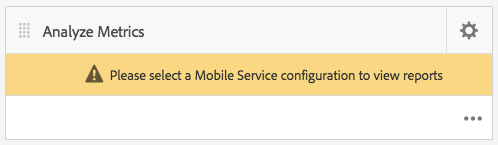

# App-prestaties bijhouden met Adobe Mobile Analytics{#track-app-performance-with-adobe-mobile-analytics}

>[!NOTE]
>
>Adobe raadt aan de SPA Editor te gebruiken voor projecten die renderen op basis van één pagina voor toepassingsframework op de client-side vereisen (bijvoorbeeld Reageren). [Meer informatie](/help/sites-developing/spa-overview.md).

U wilt hogere klantenomzettingen en loyaliteit drijven.

U wilt relevante en boeiende ervaringen aan uw klanten leveren.

Wat doet uw AEM Mobile-app voor uw marketingcampagnes?

Hoe kunt u uw mobiele toepassingen afstemmen om de beste ervaring voor uw gebruikers te bieden?

Met Adobe Mobile Services kunt u meer inzicht krijgen in hoe uw gebruikers uw mobiele apps gebruiken door het gebruik, de vastgelopen apps, de details van apparaten en zoveel andere belangrijke meetgegevens voor uw mobiele apps te volgen.

Adobe Experience Manager Mobile geeft rechtstreeks vanaf het AEM Mobile Application Dashboard een glimp van de details van uw mobiele analysemogelijkheden. De **Mobiele metrische tegel** in het dashboard biedt realtime analyses voor uw mobiele toepassing, zodat ontwikkelaars, auteurs en beheerders snel een voorvertoning van de status van uw mobiele app kunnen bekijken. Onder de deksels die de analysator aandrijven, is de [Adobe Mobile Analytics](https://www.adobe.com/ca/solutions/digital-analytics/mobile-web-apps-analytics.html) SDK. De SDK van Adobe Mobile Analytics kan in uw toepassingen worden aangesloten of via een PhoneGap bridge-insteekmodule voor webweergaven. Metrische gegevens worden verzameld en in cache geplaatst op het apparaat totdat het apparaat is aangesloten. Bij deze gegevens wordt de Adobe Mobile Services Cloud aangedrukt voor rapportage en analyse.

Adobe Mobile Analytics SDK biedt het volgende:

1. **Gegevensverzameling voor mobiele kanalen** - Verzamel uitgebreide gegevens voor uw mobiele websites en toepassingen op alle grote besturingssystemen.
1. **Analyse van mobiele betrokkenheid** - Begrijp de betrokkenheid van gebruikers binnen uw mobiele app, website of video, inclusief hoe vaak consumenten het kanaal starten, of ze er aankopen van maken en meer.
1. **Mobiele toepassingsdashboards en -rapporten** - Gebruik gebruiksrapporten die levenscyclusmetriek voor uw apps en de gegevens van de App store bevatten — zie trends voor gebruikers, lanceringen, gemiddelde zittingslengte, retentielengte, en neerstortingen.
1. **Mobiele campagneanalyse** - De doeltreffendheid van specifieke campagnes voor mobiele apparaten, zoals SMS, mobiele zoekadvertenties, advertenties voor mobiele schermen en QR-codes, kwantificeren.
1. **Geolocatieanalyse** - Zoek waar uw gebruikers van de app uw mobiele beleving kunnen starten en interactief kunnen gebruiken op basis van de GPS-locatie of -punten.
1. **Padeanalyse** - Bekijk hoe gebruikers door uw app navigeren om te bepalen welke schermen en UI-elementen gebruikers aantrekken en welke ertoe leiden dat gebruikers wegvallen.

In deze sectie wordt beschreven hoe [AEM ontwikkelaars](#developers) kunt u vervolgens leren hoe u AEM Mobile-toepassingen kunt optimaliseren met het bijhouden van analyses.

Tot slot: [AEM](#administrators) leren:

* een cloudservice voor Adobe Mobile Services maken
* creeer een mobiele dienst config en associeer een rapportreeks
* associeer de mobiele dienst config aan een mobiele app
* metriek weergeven via het AEM Apps Command Center
* De configuratie van de AMS SDK toewijzen aan uw mobiele app

## Voor ontwikkelaars - Integreer Analytics in uw app {#for-developers-integrate-analytics-into-your-app}

**Vereiste:** AEM beheerders moeten de de wolkenconfiguratie van de Mobiele Diensten van de Adobe vormen, [zoals hieronder besproken](#amscloudserviceconfig).

Ontwikkelaars zijn verantwoordelijk voor [analyses toevoegen aan een AEM Mobile-app](/help/mobile/phonegap-add-analytics-to-apps.md) waar nodig om te volgen, te rapporteren en te begrijpen hoe u gebruikers omgaan met uw inhoud van uw mobiele app en om belangrijke levenscyclusmetriek zoals lanceringen, tijd in app, en botsingssnelheid te meten.

## Voor Beheerders - vorm de Cloud Service van de Diensten van Adobe Mobile {#for-administrators-configure-the-adobe-mobile-services-cloud-service}

Als u gebruik wilt maken van Adobe Mobile Services, moet u de Cloud Service AEM Adobe Mobile Services configureren met uw Adobe Analytics-accountgegevens. Het Opdrachtcentrum voor toepassingen biedt een **Metrische gegevens analyseren** tegel waarin u de cloudservice kunt maken en koppelen aan uw mobiele app.

Configureer de cloudservice voor uw mobiele app door te klikken op het tandwielpictogram op de tegel Metrische gegevens analyseren.

Klik op het tandwielpictogram in de tegel Metrische gegevens analyseren om het modale dialoogvenster Analyse van mobiele services configureren te openen. Selecteer uw configuratie van &quot;Selecteer een Mobiele Configuratie van de Dienst&quot;drop-down. Als u een nieuwe configuratie moet creëren, klik de moersleutelknoop.

Voor het maken van een Adobe Mobile Service-cloudservice zijn er twee stappen nodig: de verbinding met de service en het selecteren van de rapportsuite die u aan de configuratie wilt toewijzen.

Klik om te beginnen op de knop &#39;+&#39; in het element Cloud Services beheren in het dashboard.

Klik op de knop &#39;**+**&#39;, de **Cloud Service toevoegen** wordt weergegeven.

Selecteer of maak een nieuwe configuratie voor mobiele services door de vereiste velden in te vullen, zoals hieronder wordt weergegeven. Uw AEM beheerder zal deze informatie vereisen om de verbinding met de Mobiele Diensten van Adobe tot stand te brengen.

Nadat u de accountinstellingen voor mobiele services hebt voltooid, wordt u gevraagd een app te selecteren. Als u dit doet, wordt de Adobe Mobile Service-analyse die wordt gerapporteerd, aan die toepassing gekoppeld.

Selecteer de gewenste mobiele service en klik op Bijwerken om de configuratie van de mobiele service toe te wijzen en het dialoogvenster te sluiten.

Nu u de configuratie van de mobiele service aan de AEM Mobile-app hebt gekoppeld, wordt de tegel opgehaald en wordt de rapportage gestart.

### Adobe Mobile Services SDK Config-bestand {#adobe-mobile-services-sdk-config-file}

Op dit moment is uw mobiele toepassing gekoppeld aan een cloudservice, maar de mobiele toepassing weet nog niet hoe de verzamelde mobiele meetgegevens naar Adobe Analytics moeten worden overgebracht. Als u de mobiele app wilt overbrengen naar Adobe Analytics, moet het configuratiebestand van de Adobe Mobile Services SDK worden toegevoegd aan Adobe Experience Manager.

Klik in de tegel Metrische gegevens analyseren op het pijlpictogram om de menu-items van AMS SDK Config downloaden/uploaden weer te geven.

De eerste stap bestaat uit het verkrijgen van de SDK-configuratie van Adobe Mobile Services. Als u op de configuratie van &#39;AMS SDK downloaden&#39; klikt, wordt u omgeleid naar de website van Adobe Mobile Services waar u het configuratiebestand kunt downloaden. Nadat u het bestand ADBMobileConfig.json hebt opgehaald, klikt u op de Configuratie van AMS SDK uploaden om het configuratiebestand in AEM te uploaden.

Klik op de knop &#39;Adobe Mobile Services Application Config&#39; uploaden en blader naar het bestand ADBMobileConfig.json en klik op &#39;Uploaden&#39;.

Nu de mobiele app toegang heeft tot het bestand ADBMobileConfig.json, beschikt deze over de kennis van de manier waarop u weer met Adobe Analytics kunt communiceren en kunt beginnen met het rapporteren van die belangrijke metrische waarde die uw apps tot een succes zal maken.

## Wat nu? {#what-s-next}

1. [Mijn AEM Mobile-app starten](/help/mobile/starting-aem-phonegap-app.md)
1. [De inhoud van mijn app beheren](/help/mobile/phonegap-manage-app-content.md)
1. [Mijn toepassing samenstellen](/help/mobile/building-app-mobile-phonegap.md)
1. [De prestaties van mijn app bijhouden met Adobe Mobile Analytics](/help/mobile/phonegap-intro-to-app-analytics.md)
1. [Een persoonlijke app-ervaring bieden met Adobe Target](/help/mobile/phonegap-aem-mobile-content-personalization.md)
1. [Belangrijke berichten naar mijn gebruikers sturen](/help/mobile/phonegap-push-notifications.md)
