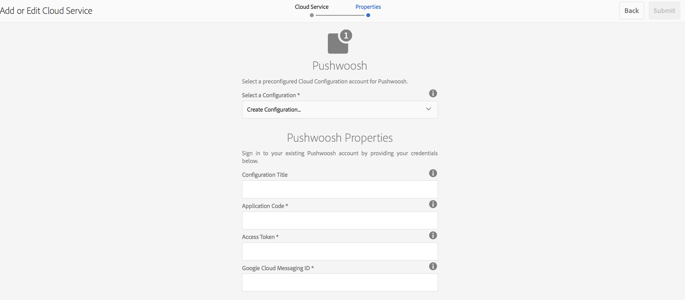

# Pushmeldingen{#push-notifications}

{{ue-over-mobile}}

Het is van cruciaal belang dat gebruikers van mobiele apps van Adobe Experience Manager (AEM) onmiddellijk op de hoogte kunnen worden gesteld van belangrijke meldingen voor de waarde van een mobiele app en de marketingcampagnes. Hier worden de stappen beschreven die moeten worden uitgevoerd om uw app pushmeldingen te laten ontvangen. U leert ook hoe u pushes van AEM Mobile kunt configureren en verzenden naar de toepassing die op de telefoon is geïnstalleerd. Ook, beschrijft deze sectie hoe te om [ Deep het Verbinden ](#deeplinking) eigenschap aan uw duimberichten te vormen.

>[!NOTE]
>
>*de pushberichten zijn niet verzekerde levering; zij zijn meer als aankondigingen. Er wordt alles aan gedaan om ervoor te zorgen dat iedereen ze ontvangt, maar dat het geen gegarandeerd leveringsmechanisme is. Ook, kan de tijd om een duw te leveren variëren van minder dan een seconde tot maximaal een half uur.*

Het gebruik van pushberichten met AEM vereist een aantal verschillende technologieën. Ten eerste moet een serviceprovider voor pushmeldingen worden gebruikt voor het beheren van thenotifications en apparaten (AEM doet dit nog niet). Twee leveranciers worden gevormd uit-van-de-doos met AEM: [ de Eenvoudige Dienst van het Bericht van Amazon ](https://aws.amazon.com/sns/) (of SNS), en [ Pushwoosh ](https://www.pushwoosh.com/). Ten tweede moet de pushtechnologie voor het desbetreffende mobiele besturingssysteem de juiste service doorlopen — Apple Push Notification Service (APNS) voor iOS-apparaten en Google Cloud Messaging (of GCM) voor Android™-apparaten. Hoewel AEM niet direct met deze platform-specifieke diensten communiceert, moet sommige verwante configuratieinformatie door AEM samen met de berichten voor deze diensten worden verstrekt om de duw uit te voeren.

Na installatie en configuratie (zoals hieronder uitgelegd) werkt het als volgt:

1. Er wordt een pushmelding gemaakt in AEM en verzonden naar de serviceprovider (Amazon SNS of Pushwoosh).
1. De dienstverlener ontvangt het en verzendt het naar de kernleverancier (APNS of GCM).
1. De kernleverancier duwt het bericht aan alle apparaten die voor die duw worden geregistreerd. Voor elk apparaat wordt het mobiele-gegevensnetwerk of WiFi gebruikt, afhankelijk van wat op het apparaat beschikbaar is.
1. De melding wordt op het apparaat weergegeven als de app waarvoor de melding is geregistreerd, niet wordt uitgevoerd. Een gebruiker die op de melding tikt, start de app en geeft de melding weer in de app. Als de toepassing al wordt uitgevoerd, wordt alleen de melding in de app weergegeven.

Deze release van AEM biedt ondersteuning voor mobiele iOS- en Android™-apparaten.

## Overzicht en procedure {#overview-and-procedure}

Als u pushberichten wilt gebruiken in een AEM Mobile-app, moet u de volgende stappen op hoog niveau uitvoeren.

Een Experience Manager Developer doet doorgaans het volgende:

1. Registreren bij Apple en Google Messaging Services
1. Registreer met de dienst van het duw overseinen en vorm het
1. Pushondersteuning toevoegen aan de app
1. Een telefoon voorbereiden voor testen

Terwijl een beheerder van de Experience Manager het volgende doet:

1. Push-on voor AEM toepassingen configureren
1. De app ontwikkelen en implementeren
1. Een pushmelding verzenden
1. deep linking configureren *(optioneel)*

### Stap 1: Registreren bij Apple en Google Messaging Services {#step-register-with-apple-and-google-messaging-services}

#### De Apple Push Notification Service (APNS) gebruiken {#using-the-apple-push-notification-service-apns}

Ga naar de pagina van Apple [ hier ](https://developer.apple.com/documentation/usernotifications#//apple_ref/doc/uid/TP40008194-CH8-SW1) vertrouwd te worden met de Dienst van het Bericht van de Duw van Apple.

Om APNs te gebruiken, hebt u het dossier van het a **Certificaat** (a.cer dossier), een duw **Persoonlijke Sleutel** (a.p12 dossier), en het Wachtwoord van de Persoonlijke Sleutel van a **** van Apple nodig. Instructies op hoe te om dat te doen kunnen worden gevonden [ hier ](https://developer.apple.com/library/archive/documentation/NetworkingInternet/Conceptual/RemoteNotificationsPG/).

#### De Google Cloud Messaging (GCM)-service gebruiken {#using-the-google-cloud-messaging-gcm-service}

>[!NOTE]
>
>Google vervangt GCM door een vergelijkbare service, Firebase Cloud Messaging (FCM) genaamd. Voor meer informatie over FCM, klik [ hier ](https://firebase.google.com/docs/cloud-messaging/).

Ga naar de pagina van Google [ hier ](https://developer.android.com/google/gcm/index.html) vertrouwd met het Overseinen van de Wolk van Google voor Android™ worden.

[ volg deze stappen ](https://developer.android.com/google/gcm/gs.html) aan **creeer een Google API project**, **laat de Dienst GCM** toe, en **verkrijgt een API Sleutel**. U hebt de **Sleutel van API** nodig om pushberichten naar Android™ apparaten te verzenden. Ook, registreer uw **Aantal van het Project**, dat soms ook a **identiteitskaart van de Afzender van GCM** wordt genoemd.

In de volgende stappen wordt een andere methode getoond voor het maken van GCM API-sleutels:

1. Logboek in google en gaat naar de [ pagina van de Ontwikkelaar van Google ](https://developers.google.com/mobile/add?platform=android&amp;cntapi=gcm).
1. Kies uw app in de lijst (of maak er een).
1. Voer onder Android™-pakketnaam uw toepassings-id in, dat wil zeggen `com.adobe.cq.mobile.weretail.outdoorsapp` . (Als dat niet werkt, probeert u het opnieuw met &quot;test.test&quot;.)
1. Klik **blijven de diensten kiezen en vormen**
1. Selecteer het Overseinen van de Wolk, en klik dan **laat het Overseinen van de Wolk van Google** toe.
1. De nieuwe Server API Sleutel en (nieuwe of bestaande) identiteitskaart van de Afzender zullen dan worden getoond.

>[!NOTE]
>
>Registreer de server-API-sleutel. Deze waarde wordt ingevoerd op de site van uw pushprovider.

### Stap 2: Registreer en vorm de Dienst van het Overseinen van de Duw {#step-register-and-configure-a-push-messaging-service}

AEM is geconfigureerd om een van de drie services te gebruiken voor pushberichten:

* AMAZON SNS
* Pushwoosh
* Adobe mobiele services

*SNS van Amazon* en *Pushwoosh* configuraties laten u geduwd van binnen AEM schermen verzenden.

*de configuratie van de Diensten van de Adobe Mobiele* laat u vormen en pushberichten van binnen de Mobiele Diensten van de Adobe verzenden gebruikend een rekening van Adobe Analytics (maar app moet met deze config worden gebouwd reeks om de pushberichten van AMS toe te laten).

#### Het gebruiken van de het overseinendienst van Amazon SNS {#using-the-amazon-sns-messaging-service}

>[!NOTE]
>
>*Informatie over SNS van Amazon, en een verbinding om een rekening van AWS tot stand te brengen, kan [ hier ](https://aws.amazon.com/sns/) worden gevonden. U kunt een jaar een gratis rekening krijgen.*

Als u geen SNS van Amazon wilt gebruiken, kunt u deze stappen overslaan.

Ga als volgt te werk om Amazon SNS in te stellen voor pushberichten:

1. **Register met SNS van Amazon**

   1. Registreer uw account-id. De opmaak moet 12 cijfers zonder spaties of streepjes zijn, dat wil zeggen &quot;123456789012&quot;.
   1. Zorg ervoor dat u zich in de regio &#39;us-East&#39; of &#39;eu&#39; bevindt, aangezien een van deze stappen later vereist is (Identity Pool Creation).
   1. Na het registreren, login aan de beheersconsole en selecteer [ SNS ](https://console.aws.amazon.com/sns/) (de Dienst van het Bericht van de Duw). Klik op Aan de slag als dit wordt weergegeven.

1. **creeer de Sleutel en identiteitskaart van de Toegang**

   1. Klik op de aanmeldnaam rechtsboven in het scherm en kies Beveiligingsreferenties in het menu.
   1. Klik Toegang Sleutels, en in de ruimte hieronder, klik **creëren Nieuwe Sleutel van de Toegang**.
   1. Klik **tonen Sleutel van de Toegang**, en exemplaar en sparen Sleutel identiteitskaart van de Toegang en Geheime getoonde Sleutel van de Toegang. Als u de optie kiest om de toetsen te downloaden, krijgt u een CSV-bestand dat dezelfde waarden bevat.
   1. Andere aan beveiliging gerelateerde certificaten en andere kunnen op deze pagina worden beheerd.

   >[!NOTE]
   >
   >Een toegangstoets kan voor meerdere apps worden gebruikt.

   Voor organisaties die een &quot;AWS Sandbox&quot;rekening gebruiken, zijn de stappen gelijkaardig, en hier geschetst:

   1. Klik op de aanmeldnaam rechtsboven in het scherm en kies Mijn beveiligingsreferenties in het menu.
   1. Klik op Gebruikers in de linkerlijst met handelingen en kies uw gebruikersnaam.
   1. Klik op het tabblad Beveiligingsreferenties.
   1. Vanaf hier ziet u de toetsen en maakt u nieuwe toetsen. Sla de toetsen op voor later gebruik.

1. **creeer een Onderwerp**

   1. Klik **creëren Onderwerp** en kies een onderwerpnaam. Registreer alle velden, zoals Onderwerpnaam, Onderwerpeigenaar, Gebied en Weergavenaam.
   1. Klik **Andere Acties van het Onderwerp** > **geef het Beleid van het Onderwerp** uit. Onder **sta deze gebruikers toe om aan dit onderwerp** in te tekenen, selecteer **iedereen.**
   1. Klik **Beleid van de Update**.

   >[!NOTE]
   >
   >U kunt veelvoudige onderwerpen voor verschillende scenario&#39;s zoals dev, test, en demo tot stand brengen. De rest van de configuratie van SNS kan het zelfde blijven. Maak de app met het andere onderwerp; pushmeldingen die naar dat onderwerp worden verzonden, worden alleen ontvangen door de toepassing die met dat onderwerp is gemaakt.

1. **creeer de Toepassingen van het Platform**

   1. Klik op Toepassingen en vervolgens op Platformtoepassing maken. Kies een naam en selecteer een platform (APNS voor iOS, GCM voor Android™). Afhankelijk van het platform. andere velden moeten worden ingevuld in:

      1. Voor APNS, moeten een P12- dossier, een Wachtwoord, een Certificaat, en een Privé Sleutel allen zijn ingegaan. Deze zouden in de stap *moeten worden verkregen Gebruikend de Dienst van het Bericht van de Duw van Apple (APNS)* hierboven.
      1. Voor GCM moet een API-sleutel worden ingevoerd. Dit zou in de stap *moeten worden verkregen Gebruikend de dienst van het Overseinen van de Wolk van Google (GCM)* hierboven.

   1. Herhaal de bovenstaande stap eenmaal voor elk platform dat u ondersteunt. Om zowel naar iOS als naar Android™ te kunnen duwen, moeten er twee platformtoepassingen worden gemaakt.

1. **creeer een Pool van de Identiteit**

   1. Het gebruik [ Cognito ](https://console.aws.amazon.com/cognito) om een Pool van de Identiteit tot stand te brengen, die basisgegevens van niet voor authentiek verklaarde gebruikers zal opslaan. Opmerking: Amazon Cognito biedt momenteel alleen ondersteuning voor regio&#39;s in het &#39;us-oosten&#39; en &#39;eu&#39;.
   1. Geef deze een naam en schakel het selectievakje &#39;Toegang tot niet-geverifieerde identiteiten inschakelen&#39; in.
   1. Op de volgende pagina (&quot;*Uw identiteiten van de Rekening vereisen toegang tot uw middelen* &quot;) klik toestaat.
   1. Op het hogere recht van de pagina, klik de verbinding &quot;*uitgeeft identiteitspool&quot;*. De id van de identiteitspool wordt weergegeven. Sla deze tekst op voor later.
   1. Op dezelfde pagina kiest u de vervolgkeuzelijst naast &quot;Niet-geverifieerde rol&quot; en controleert u of deze de rol Cognito_&lt;poolnaam>UnauthRole heeft geselecteerd. Sla uw wijzigingen op.

1. **vorm Toegang**

   1. Login aan [ Identiteit en Toegangsbeheer ](https://console.aws.amazon.com/iam/home) (IAM).
   1. Selecteer Rollen.
   1. Klik op de rol die in de vorige stap is gemaakt, met de naam Cognito_&lt;yourIdentityPoolName>Unauth_Role. Neem de weergegeven &quot;Rol ARN&quot; op.
   1. Open Inline-beleid als dit nog niet geopend is. Hier moet een beleid worden weergegeven met een naam zoals oneClick_Cognito_&lt;yourIdentityPoolName>Unauth_Role_1234567890123.
   1. Klik op &quot;Beleid bewerken&quot;. Vervang de inhoud van het Beleidsdocument door dit fragment van JSON:

   <table>
    <tbody>
     <tr>
     <td>
 
 
{
 
 "Versie": "2012-10-17",
 
 "Statement": [
 
 {
 
 "Actie": [
 
 "mobileanalytics:PutEvents",
 
 "cognito-sync:*",
 
 "SNS:CreatePlatformEndpoint",
 
 "SNS:Subscribe"
 
 ],
 
 "Effect": "Allow",
 
 "Bron": [
 
 "*"
 
 ]
 
 }
 
 ]
 
}
 
 
 </td>
     </tr>
    </tbody>
    </table>

   1. Klik **toepassen Beleid**.

#### De Pushwoosh-berichtenservice gebruiken {#using-the-pushwoosh-messaging-service}

Als u Pushwoosh niet wilt gebruiken, kunt u deze stap overslaan.

Pushwoosh gebruiken:

1. **Register met Pushwoosh**

   1. Ga naar pushwoosh.com en maak een account.

1. **creeer een Token van de Toegang API**

   1. Ga op de Pushwoosh-site naar het menu-item API Access om een API Access Token te genereren. Registreer deze token veilig.

1. **creeer app**

   1. Voor Android™-ondersteuning moet u de GCM API-sleutel opgeven.
   1. Kies Cordova als framework wanneer u de app configureert.
   1. Voor iOS-ondersteuning moet u het certificaatbestand (.cer), het pushcertificaat (.p12) en het wachtwoord voor de persoonlijke sleutel opgeven. Deze zijn vereist voor de Apple APNS-site. Kies Cordova voor Framework.
   1. Pushwoosh genereert een toepassings-id voor die app in de notatie &quot;XXXXX-XXXXX&quot;, waarbij elke X een hexadecimale waarde (0 tot en met F) is.

>[!NOTE]
>
>*als een tweede app in AEM met zelfde app Identiteitskaart (en andere verwante waarden wordt gevormd: Het Token van de Toegang van API, en identiteitskaart van GCM), zullen om het even welke dupberichten die via tweede app op AEM worden verzonden naar een andere app met die Identiteitskaart gaan.*

### Stap 3: Voeg pushondersteuning toe aan de app {#step-add-push-support-to-the-app}

#### ContentSync-configuratie toevoegen {#add-contentsync-configuration}

Maak twee inhoudsknooppunten (één in app-config en één in app-config-dev) met de naam notificationsConfig:

* /content/`<your app>` /shell/jcr:content/page-app/app-config-dev/notificationsConfig
* /content/`<your app>`/shell/jcr:content/page-app/app-config/notificationsConfig

Met deze eigenschappen (.content.xml-bestanden):
&lt;jcr:wortel xmlns:jcr=&quot; [ https://developer.adobe.com/experience-manager/reference-materials/spec/jcr/1.0/index.html](https://developer.adobe.com/experience-manager/reference-materials/spec/jcr/1.0/index.html) &quot; xmlns:nt=&quot; [ https://developer.adobe.com/experience-manager/reference-materials/spec/jcr/1.0/index.html ](https://developer.adobe.com/experience-manager/reference-materials/spec/jcr/1.0/index.html)&quot;
jcr:primaryType=&quot;nt:ungestructureerde&quot;
excludeProperties=&quot;[ appAPIAaccessToken ]&quot;
path=&quot;../../../...&quot;
targetRootDirectory=&quot;www&quot;
type=&quot;notificationSconfig&quot;/>

>[!NOTE]
>
>De handler voor inhoudssynchronisatie zoekt naar die knooppunten en als deze niet aanwezig zijn, wordt het bestand pge-notifications-config.json niet weggeschreven.

#### Client-bibliotheken toevoegen {#add-client-libraries}

De clientbibliotheken voor pushmeldingen moeten als volgt aan de app worden toegevoegd:

In CRXDE Lite:

1. Navigeer naar */etc/designs/phonegap/&lt;app name>/clientlibsall.*
1. Dubbelklik op de sectie Insluiten in het deelvenster Eigenschappen.
1. Voeg in het dialoogvenster dat wordt weergegeven een clientbibliotheek toe door op de knop + te klikken.
1. Voeg in het nieuwe tekstveld &quot;cq.mobile.push&quot; toe en klik op OK.
1. Voeg nog een cq.mobile.push.amazon toe en klik op OK.
1. Sla de wijzigingen op.

>[!NOTE]
>
>Als pushberichten worden verwijderd of niet worden gebruikt voor ruimteoverwegingen in de app en om foutberichten voor de console te voorkomen, verwijdert u deze clientlibs uit de app.

### Stap 4: Een telefoon voorbereiden voor testen {#step-prepare-a-phone-for-testing}

>[!NOTE]
>
>*voor dupberichten, moet u op een werkelijk apparaat testen, aangezien de mededingers geen dupberichten kunnen ontvangen.*

#### IOS {#ios}

Voor iOS, gebruik een computer van macOS en sluit zich aan bij het [ Programma van de Ontwikkelaar van iOS ](https://developer.apple.com/programs/ios/). Sommige bedrijven hebben bedrijfslicenties die voor alle ontwikkelaars beschikbaar kunnen zijn.

Met XCode 8.1, alvorens de Berichten van de Duw te gebruiken moet u naar het lusje van Mogelijkheden in uw project gaan, en knevel de knevel van de Berichten van de Duw.

#### Android™ {#android}

Om app op een telefoon te installeren Android™ gebruikend CLI (zie hieronder: **Stap 6 - bouw en stel app** op), moet u eerst de telefoon op &quot;ontwikkelaarwijze&quot;zetten. Zie [ toelatend Opties van de Ontwikkelaar van het apparaat ](https://developer.android.com/tools/device.html#developer-device-options) voor details bij het doen van dit.

### Stap 5: Push on AEM apps configureren {#step-configure-push-on-aem-apps}

Alvorens te bouwen en aan uw gevormde mobiele apparaat op te stellen, moet u de berichtmontages voor de overseinendienst vormen u besloot te gebruiken.

1. Maak de juiste machtigingsgroepen voor pushberichten.
1. Meld u aan bij AEM als de juiste gebruiker en klik op het tabblad Apps.
1. Klik op de app.
1. Zoek het element Cloud Servicen beheren en klik op het potlood om de wolkenconfiguratie te wijzigen.
1. Selecteer als berichtconfiguratie Amazon SNS Connection, Pushwoosh Connection of Adobe Mobile Services.
1. Voer de providereigenschappen in en klik op Verzenden om deze op te slaan, en op Gereed. Ze worden in dit stadium niet op afstand geverifieerd, behalve als er AMS is.
1. U zou nu moeten zien config u enkel op de Manage Cloud Servicen tegel inging.

### Stap 6: De app ontwikkelen en implementeren {#step-build-and-deploy-the-app}

**Nota:** zie de instructies [ hier ](/help/mobile/building-app-mobile-phonegap.md) op de bouw van toepassingen PhoneGap.

U kunt uw app op twee manieren maken en implementeren met PhoneGap.

**Nota:** voor het testen van het dupbericht, zullen de mededingers niet voldoende zijn omdat de dupberichten een verschillend protocol tussen de dupleverancier (Apple of Google) en het apparaat gebruiken. De huidige Mac/PC-hardware en -emulators ondersteunen dit niet.

1. *PhoneGap Build* is de dienst die door PhoneGap wordt aangeboden die uw app voor u op hun servers zal bouwen, en u het aan uw apparaat direct laat downloaden. Raadpleeg de documentatie bij PhoneGapen Build in `https://build.phonegap.com/` voor meer informatie over het instellen en gebruiken van PhoneGapen Build.

1. *Interface van de Lijn van het Bevel PhoneGap* (CLI) laat u een rijke reeks bevelen PhoneGap op uw bevellijn gebruiken om te bouwen, te zuiveren, en uw app op te stellen. Verwijs naar de de ontwikkelaardocumentatie van PhoneGap (`https://docs.phonegap.com/en/edge/guide_cli_index.md.html#The%20Command-Line%20Interface`) om te leren hoe te opstelling en CLI te gebruiken PhoneGap.

### Stap 7: Een pushmelding verzenden {#step-send-a-push-notification}

Voer de volgende stappen uit om een melding te maken en te verzenden.

1. Een melding maken

   * Zoek in het dashboard van uw AEM Mobile-app de tegel Push Notifications.
   * Kies &quot;Maken&quot; in het menu rechtsboven. Deze knoop is niet beschikbaar tot de wolkenconfiguratie eerst wordt geplaatst.
   * Voer in de wizard Melding maken een titel en een bericht in en klik vervolgens op de knop &quot;Maken&quot;. Uw melding is nu klaar om direct of later te worden verzonden. Deze kan worden bewerkt en het bericht en/of de titel kan worden gewijzigd en opgeslagen.

1. Melding verzenden

   * Zoek in het dashboard Apps naar de tegel Push Notifications.
   * Selecteer de melding of klik op de knop Details rechtsonder (. . .), om de lijst met meldingen weer te geven. Deze lijst geeft ook aan of een melding klaar is om te worden verzonden, al is verzonden of dat er een fout is opgetreden tijdens het verzenden.
   * Schakel het selectievakje voor één melding in (alleen) en klik op de knop Melding verzenden boven de lijst. U hebt één kans om het bericht te &quot;annuleren&quot; of &quot;verzenden&quot; in het dialoogvenster dat verschijnt.

1. De resultaten verwerken

   * Als de pushmeldingenservice (Amazon SNS of Pushwoosh) het verzendverzoek ontvangt, deze als geldig bevestigt en het naar de native providers (APNS en GCM) verzendt, wordt het dialoogvenster Verzenden gesloten zonder bericht. In de meldingslijst wordt de status van die melding weergegeven als Verzonden.
   * Als het verzenden van de pushmelding mislukt, wordt in het dialoogvenster een bericht weergegeven dat het probleem aangeeft. In de meldingslijst wordt de status van die melding weergegeven als Fout, maar als het probleem is verholpen, kan de melding opnieuw worden verzonden. Als er een fout is, zou de extra fouteninformatie in het logboek van de serverfout moeten verschijnen.
   * Er zijn enkele platformverschillen tussen iOS- en Android™-pushberichten. Onder hen:

      * De toepassing wordt gestart wanneer deze wordt geïmplementeerd op Android™ en wordt gemaakt met CLI. In iOS moet u de toepassing handmatig starten. Omdat de stap voor pushregistratie plaatsvindt bij het opstarten, kunnen Android™-apps direct pushmeldingen ontvangen (omdat deze al zijn gestart en geregistreerd), terwijl iOS-apps dat niet kunnen.
      * Op Android™ staat de tekst van de knop OK in alle hoofdletters (en in alle andere knoppen die worden toegevoegd aan de meldingen in de app), terwijl dit in iOS niet het geval is.

Voor AMS-pushmeldingen moeten meldingen worden samengesteld en verzonden vanaf de AMS-server. AMS biedt extra mogelijkheden voor pushmeldingen naast die welke worden geboden door meldingen met AWS en Pushwoosh te AEM.

>[!NOTE]
>
>*de pushberichten zijn niet verzekerde levering; zij zijn meer als aankondigingen. Er wordt alles aan gedaan om ervoor te zorgen dat iedereen het hoort, maar het is geen gegarandeerd leveringsmechanisme. Ook, kan de tijd om een duw te leveren variëren van minder dan een seconde tot maximaal een half uur.*

### Diep koppelen met pushmeldingen configureren {#configuring-deep-linking-with-push-notifications}

Wat is diep met elkaar verbonden? In de context van een pushmelding is het een manier om een app te openen of (indien geopend) naar een opgegeven locatie in de app te leiden.

Hoe werkt het? De auteur van een pushmelding voegt desgewenst een knoplabel toe (met andere woorden: &quot;Weergeven!&quot;) naar de melding en kiest u de pagina die zij in de melding willen koppelen via een visuele padbrowser. Wanneer de drukknop wordt verzonden, gebeurt deze als normaal, behalve dat in het bericht in de app de knop OK wordt vervangen door de knop &quot;Afwijzen&quot; en de nieuwe knop wordt opgegeven (&quot;Weergeven!&quot;) wordt ook weergegeven. Wanneer u op de nieuwe knop klikt, gaat de app naar de opgegeven pagina in de app. Als u op Afwijzen klikt, wordt het bericht weergegeven.

Als de app niet is geopend, wordt de schaduw normaal weergegeven. Als u actie onderneemt op het bericht in de schaduw, wordt de app geopend en wordt de gebruiker de diepe koppelingsknoppen weergegeven op basis van wat is geconfigureerd in het pushbericht.

Maak het bericht, voeg een knoptekst en koppelingspad toe voor de optionele koppeling deep:

>[!CAUTION]
>
>Voer de onderstaande stappen uit om toegang te krijgen tot de tegel Push Notification in het dashboard.

1. Klik uitgeven op de hoogste juiste hoek van **Cloud Servicen** tegel beheren.

   

1. Selecteer de **Verbinding van Pushwoosh**. Klik op **Next**.

   

1. Ga de details van de eigenschappen in en klik **voorleggen**.

   

   Één u uw configuratie voorlegt, de **tegelvertoningen van de Berichten van de Duw** {in het dashboard.

   

### Wizard Melding maken {#create-notification-wizard}

Zodra de **de tegelvertoningen van Berichten van de Duw** in uw dashboard, gebruiken creeer berichttovenaar om de inhoud toe te voegen:

1. Klik toevoegen symbool op de hoger-juiste hoek van de **Push Notifications** tegel om **te openen creeer de Tovenaar van het Bericht**.

   

1. Wanneer u op het bladerpictogram in het koppelingspad klikt, krijgt de gebruiker de inhoudstructuur van de app te zien.

   Als u het pad hebt geselecteerd, klikt u op het vinkje.

   

   >[!NOTE]
   >
   >De tekst van de Knoop van de Verbinding is beperkt tot 20 karakters.
   >
   >Als de eindgebruiker niet over de nieuwste versie van de toepassing beschikt en het gekoppelde pad niet beschikbaar is, leidt het bevestigen van de actie van de diepe koppeling de gebruiker naar de hoofdpagina van de app.

1. Ga de **Details van de Tekst** in **creeer de Tovenaar van het Bericht** en klik **creeer**.

   

   Open de details door het duw bericht te klikken dat u van de **Push Berichten** tegel creeerde.

   U kunt eigenschappen bewerken, meldingen verzenden of de melding verwijderen.

   

>[!NOTE]
>
>**Extra Informatie**:
>
>Pushwoosh and Amazon SNS will not be supported after 6.4 Release and will be available as an add-on from the Package Share.

### De volgende stappen {#the-next-steps}

Zodra u de details op dupberichten voor uw app begrijpt, zie [ de Inhoud Personalization van AEM Mobile ](/help/mobile/phonegap-aem-mobile-content-personalization.md).
