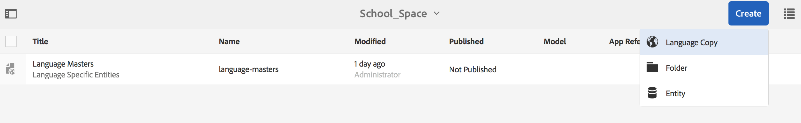

# Spaties en entiteiten{#spaces-and-entities}

{{ue-over-mobile}}

Een spatie is een handige locatie voor het opslaan van entiteiten die via de REST-API van Content Services worden weergegeven. Dit is vooral handig omdat een app (of elk kanaal) aan veel entiteiten kan worden gekoppeld. Als u entiteiten dwingt zich in een ruimte te bevinden, kunt u de best practices voor het groeperen van de vereisten van een app bundelen. U kunt desgewenst een toepassing in AEM koppelen aan een klein aantal spaties.

>[!NOTE]
>
>Om iets van de Diensten van de Inhoud ter beschikking te stellen aan om het even welk kanaal, moet het onder een ruimte zijn.

## Een spatie maken {#creating-a-space}

Als de gebruiker een aantal inhoud en elementen toegankelijk wil maken voor een mobiele app, maakt de gebruiker de ruimte met behulp van het AEM Mobile-dashboard.

Voor de eerste gebruiker, die geen inhoudsdiensten om met ruimten heeft gevormd te werken, toont het dashboard van AEM Mobile slechts Apps na het selecteren van **de Diensten van de Inhoud**.

>[!CAUTION]
>
>**Vereisten om een ruimte** toe te voegen
>
>Controleer **toelaten AEM de Diensten van de Inhoud** om met Plaatsen te werken en het in uw de toepassingsdashboard van AEM Mobile toe te laten.
>
>Zie [ het Beheer de Diensten van de Inhoud ](/help/mobile/developing-content-services.md) voor meer details.

Nadat u de spaties in het dashboard hebt geconfigureerd, voert u de volgende stappen uit om spaties te maken:

1. Kies **Spaties** van de Diensten van de Inhoud.

   

1. Kies **creeer** om een ruimte tot stand te brengen. Ga **Titel 0},** Naam **, en** Beschrijving **voor de ruimte in.**

   Klik **creëren**.

   

## Een spatie beheren {#managing-a-space}

Nadat u een spatie hebt gemaakt, klikt u links om de ruimte in de lijst te beheren.

U kunt de eigenschappen van de ruimte weergeven, de ruimte verwijderen of de ruimte en de inhoud ervan publiceren naar een AEM-publicatie-instantie.

**het Bekijken en het Uitgeven Eigenschappen van een Ruimte**

1. De ruimte in de lijst selecteren
1. Kies **Eigenschappen** van de toolbar
1. Klik **Sluiten** wanneer gedaan

**het Publiceren van een Ruimte** wanneer een ruimte wordt gepubliceerd, worden alle omslagen en entiteiten in die ruimte ook gepubliceerd.

1. Selecteer de ruimte door op het bijbehorende pictogram in de lijst voor de ruimteconsole te klikken
1. Kies **de Boom van Publish**

>[!NOTE]
>
>U kunt **unpublish** een Ruimte, die de ruimte uit publiceert instantie verwijdert.
>
>De volgende afbeelding illustreert de acties die kunnen worden uitgevoerd nadat u de ruimte hebt gepubliceerd.

## Werken met mappen in een spatie {#working-with-folders-in-a-space}

De ruimten kunnen omslagen omvatten om ruimteinhoud en activa verder te organiseren. Gebruikers kunnen hun eigen hiërarchie onder een spatie maken.

### Een map maken {#creating-a-folder}

1. Klik op de ruimte in de lijst in de ruimteconsole en klik **creeer Omslag**

   

1. Ga de **Titel**, **Naam in,** en **Beschrijving** voor de omslag

   

1. Klik **creëren** om de omslag in een ruimte tot stand te brengen

## Taalkopie {#language-copy}

>[!CAUTION]
>
>Taalkopie is niet volledig functioneel voor deze release. De structuur wordt alleen ingesteld.

Het **bezit van het Exemplaar van de Taal 0} {staat auteurs toe om hun hoofdExemplaar van de Taal te kopiëren en dan een Project en een Werkschema tot stand te brengen om de inhoud automatisch te vertalen.** Met Taalkopie maakt u de juiste structuur. Nadat u een map in een ruimte hebt toegevoegd, kunt u het taalexemplaar aan de ruimte toevoegen.

>[!NOTE]
>
>Het wordt aanbevolen om inhoud die vertaald kan worden onder het knooppunt Taalkopie te plaatsen.

### Taalkopie toevoegen {#adding-language-copy}

1. Nadat u ruimte hebt gemaakt, klikt u op die ruimte om een taalkopie te maken.

   Klik **creëren** en kies **Exemplaar van de Taal**.

   

   >[!NOTE]
   >
   >De knopen van het Exemplaar van de Taal kunnen slechts als direct kind van de Ruimte bestaan.

1. Kies **Taal&amp;amp van het Pakket van de Inhoud;ast;** en ga **Titel&amp;amp in;ast;** in **creeer de dialoog van het Exemplaar van de Taal**.

   Klik **creëren**.

   

1. Zodra u een Exemplaar van de Taal creeert, verschijnt het in uw ruimte in **Stramienen van de Taal**.

   

   >[!NOTE]
   >
   >Selecteer **Stramienen van de Taal** om de omslagen van het taalexemplaar te bekijken.

### Een map uit de ruimte verwijderen {#removing-a-folder-from-the-space}

1. Selecteer de map in de lijst met ruimte-inhoud
1. Klik **Schrapping** van de toolbar

   >[!NOTE]
   >
   >Als u in een map wilt navigeren en de inhoud ervan wilt bekijken of een submap of entiteit wilt toevoegen, klikt u op de titel van de map in de inhoudslijst van de ruimte.

## Werken met entiteiten in een spatie {#working-with-entities-in-a-space}

De entiteiten vertegenwoordigen inhoud die door het eindpunt van de Webdienst wordt blootgesteld. Entiteiten worden opgeslagen in spaties, zodat ze gemakkelijk kunnen worden gevonden en onafhankelijk blijven van de AEM opslagplaats die de bijbehorende inhoud bevat.

U kunt entiteiten in één of andere logische inzameling willen groeperen. Hiertoe kunt u een willekeurig aantal mappen maken.

Als de entiteitkinderen, die andere entiteiten zijn, voor gegevensmodellering worden verzameld, kan de ontwikkelaarsgebruiker specifieke &quot;Modellen van de Groep&quot;van het modeltype van de &quot;Groep van de Entiteit&quot;tot stand brengen, verstrekt uit-van-de-doos.

>[!NOTE]
>
>Entiteiten worden altijd gekoppeld aan een spatie, zodat het grootste deel van de gebruikersinterface van de entiteit wordt benaderd via de spatieconsole.

### Entiteiten maken {#creating-an-entity}

1. Open de Ruimteconsole en klik de titel van de ruimte.

   U kunt desgewenst naar de map navigeren door op de titel van de map in de lijst te klikken.

   

1. Kies het model voor de entiteit. Dit is het type entiteit dat u wilt maken. Klik op Volgende.

   

   >[!NOTE]
   >
   >U hebt de optie om het **Model van Assets**, **Model van Pagina&#39;s**, of een model van entiteitstype te kiezen u vóór creeerde.
   >
   >Zie [ Creërend een Model ](/help/mobile/administer-mobile-apps.md), om uw douaneentiteit tot stand te brengen.

1. Ga a **Titel**, **Naam**, **Beschrijving**, en **Markeringen** voor de entiteit in. Klik **creëren**.

   

   Zodra u wordt gedaan, verschijnt de entiteit in de nakomelingen van uw ruimte.

### Entiteiten bewerken {#editing-an-entity}

1. Nadat u een entiteit hebt gemaakt, gaat u naar de map of ruimte en kiest u uw entiteit in de ruimteconsole die u wilt bewerken.

   

1. Selecteer een entiteit voor het uitgeven en klik **uitgeven**.

   

   >[!CAUTION]
   >
   >Afhankelijk van de sjabloon die u kiest om uw entiteit te maken, zal de interface voor beide variëren, voor het bewerken en weergeven van eigenschappen van uw entiteit. Zie de onderstaande stappen voor meer informatie.

   ***als u het malplaatje voor het creëren van de entiteit als Modellen van Assets*** kiest, die op **klikken geeft** uit laat u activa zoals aangetoond in het hieronder cijfer toevoegen:

   

   Alternatief, kunt u **Voorproef** klikken om de verbindingsverbinding te bekijken.

   

   ***als u het malplaatje voor het creëren van de entiteit als Modellen van Pagina&#39;s*** kiest, die op **klikken geeft** uit laat u activa zoals aangetoond in het hieronder cijfer toevoegen:

   

   Klik op het pictogram in de **Weg** om activa toe te voegen

   

   >[!NOTE]
   >
   >Als u een entiteit hebt toegevoegd, moet deze worden opgeslagen om de koppeling Voorvertoning te kunnen gebruiken. Om de voorproef te bekijken, klik **sparen**. Het klikken op de **Voorproef** toont de json van de toegevoegde activa, zoals aangetoond in het hieronder cijfer:

   

   >[!NOTE]
   >
   >Wanneer u klaar bent toevoegend activa aan uw entiteit, kunt u of **kiezen sparen** om de veranderingen te bewaren of **sparen &amp; sluit** te kiezen om aan de Spatieconsolelijst te bewaren en opnieuw te richten waar de entiteiten worden bepaald.

   Bovendien, selecteer een entiteit van de lijst van de ruimteconsole en klik **Eigenschappen** om de eigenschappen voor een bepaalde entiteit te bekijken en uit te geven.

   

   U kunt de titel, beschrijving, tags bewerken en de elementen aan de entiteit toevoegen.

   

### Entiteiten verwijderen {#removing-an-entity}

1. Entiteiten in de lijst met ruimte-inhoud selecteren

   

1. Klik **Schrapping** van de toolbar om de specifieke entiteit uit de ruimte te verwijderen

### Entiteiten publiceren {#publishing-an-entity}

U hebt de optie om **de Boom van Publish** of **Snelle Publish** te kiezen om uw entiteit te publiceren.

1. Selecteer een entiteit in de lijst met ruimteconsole en klik op **Publish Tree **om die entiteit en de onderliggende items te publiceren.

   

   **of**,

   Klik **Snelle Publish** om die specifieke entiteit te publiceren.
