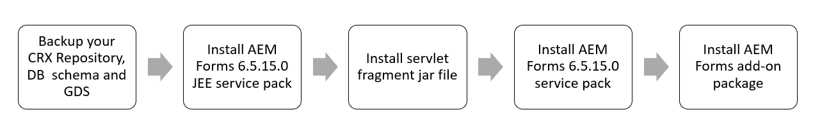

# AEM 6.5 installatie-instructies voor Forms Service Pack {#aem-form-patch-installation-instructions}

## Gegevens vrijgeven

| Product | Adobe Experience Manager 6.5 Forms |
|---|---|
| Versie | 6.5.15.0 |
| Type | Service Pack-release |
| Date | 1 december 2022 |

## Wat is inbegrepen in Experience Manager Forms 6.5.15.0

Adobe Experience Manager (AEM) Forms Service Pack bevat nieuwe en verbeterde functies, zoals belangrijke verbeteringen op verzoek van de klant, prestaties, stabiliteit en verbeteringen op het gebied van beveiliging. AEM Forms geeft regelmatig servicepacks uit om de nieuwste functies en verbeteringen te bieden. Afhankelijk van uw stapel, kies één van de volgende wegen om de dienstpak op uw milieu te downloaden en te installeren:

* [Service Pack downloaden en installeren op een AEM Forms in JEE-omgeving](#download-and-install-for-jee-service-pack)
* [Download en installeer Service Pack op een AEM Forms in OSGi-omgeving](#download-and-install-for-osgi-service-pack)

>[!NOTE]
>
> Adobe geeft na elk 6e servicepakket een volledig installatieprogramma uit. AEM 6.5 Forms Service Pack 12 (6.5.12.0) op JEE is het laatste volledige installatieprogramma. Het volledige installatieprogramma biedt ondersteuning voor nieuwe platforms, terwijl het installatieprogramma voor het gewone servicepakket alleen foutoplossingen en algemene verbeteringen bevat. Als u een nieuwe installatie uitvoert of de nieuwste software voor uw AEM 6.5 Forms op JEE-omgeving wilt gebruiken, raadt Adobe aan AEM 6.5.12.0 Forms op JEEfull installer te gebruiken die op 3 maart 2022 wordt uitgebracht in plaats van AEM 6.5 Forms-installatieprogramma dat op 8 april 2019 wordt uitgebracht. Installeer na gebruik van het volledige installatieprogramma het nieuwste servicepakket.

## Service Pack downloaden en installeren op een AEM Forms in JEE-omgeving {#download-and-install-for-jee-service-pack}

+++1. Maak een back-up van uw bestaande omgeving:

1. Back-up maken van uw [CRX Repository, Databaseschema en GDS (Global Document Storage)](https://experienceleague.adobe.com/docs/experience-manager-65/forms/administrator-help/aem-forms-backup-recovery/backing-aem-forms-data.html).
1. Back-up maken van de &lt;*AEM_forms_root*>/implementatiemap. Dit is vereist als u besluit het servicepack te verwijderen.

+++

+++2.Download de vereiste software:

* AEM Forms op 6.5.15.0 Service Pack in JEE
* AEM 6.5.15.0 Service Pack
* Forms-invoegtoepassing
* Bundel
* Fragmenten

+++

+++3. Installeer AEM Forms op JEE service pack:

1. Stop uw toepassingsserver.
1. Het gereedschap Extraheren **AEM Forms op JEE 6.5.15.0 Service Pack installer-archief** op uw vaste schijf:

   * **Windows**
Navigeer naar de juiste directory op de installatiemedia of de installatiemap op de vaste schijf waarnaar u het installatieprogramma hebt gekopieerd en dubbelklik op de knop 
`aemforms65_cfp_install.exe` bestand.

      * (Windows 32-bits) `Windows\Disk1\InstData\VM`
      * (Windows 64-bits) `Windows_64Bit`\ `Disk1\InstData\VM`
   * **Linux**
Navigeer naar de juiste map en van een shell en type 
`./aem65_cfp_install.bin`.

      * (Linux) `Linux/Disk1/InstData/NoVM`

   Hiermee wordt een installatiewizard gestart die u door de installatie begeleidt.

1. Klik in het deelvenster Inleiding op **[!UICONTROL Next]**.
1. Op de **Installatiemap kiezen** , controleert u of de weergegeven standaardlocatie correct is voor uw bestaande installatie of klikt u op **[!UICONTROL Browse]** om de alternatieve map te selecteren waarin AEM formulieren zijn geïnstalleerd en klik op **[!UICONTROL Next]**.
1. Lees de overzichtsinformatie van het Pak van de Dienst en klik **[!UICONTROL Next]**.
1. Lees de informatie van het Pre-installatieoverzicht en klik **[!UICONTROL Install]**.
1. Wanneer de installatie is voltooid, klikt u op **[!UICONTROL Next]** om de snelle reparatie updates op uw geïnstalleerde dossiers toe te passen.
1. **[Alleen voor Windows]:** Voer een van de volgende stappen uit:

   * Schakel de optie **Configuratiebeheer starten** voordat u klikt op **[!UICONTROL Done]**. Uitvoeren **Configuratiebeheer** door **ConfigurationManager.bat** bestand in `[aem-forms root]\configurationManager\bin`.

   * U kunt de selectie van de **Configuratiebeheer starten** voordat u klikt op **[!UICONTROL Done]**. Voor uitvoering **Configuratiebeheer** gebruiken **ConfigurationManager.exe** of **ConfigurationManager_IPv6.exe**, navigeer naar *`<AEMForms_Install_Dir>\configurationManager\bin`* directory en replace [ConfigurationManager.lax](/help/assets/ConfigurationManager.lax) en [ConfigurationManager_IPV6.lax](/help/assets/ConfigurationManager_IPv6.lax) bestanden.

      >[!NOTE]
      >
      > Met de **ConfigurationManager.bat** kunt u voorkomen dat de naam van de .lax-bestanden handmatig wordt bijgewerkt.

1. **[Alleen voor Unix]:** De **Configuratiebeheer starten** selectievakje is standaard ingeschakeld. Klikken **[!UICONTROL Done]** om de Manager van de Configuratie onmiddellijk in werking te stellen of in werking te stellen **Configuratiebeheer** later, schrap **Configuratiebeheer starten** voordat u klikt op **[!UICONTROL Done]**. U kunt beginnen **Configuratiebeheer** later het gebruiken van het aangewezen manuscript in `[AEM_forms_root]/configurationManager/bin` directory.

1. Afhankelijk van uw toepassingsserver kiest u een van de volgende documenten en volgt u de instructies in het dialoogvenster *Formulieren configureren en implementeren AEM* sectie.

   * [AEM voor JBoss installeren en implementeren](https://www.adobe.com/go/learn_aemforms_installJBoss_65)
   * [AEM voor WebSphere installeren en implementeren](https://www.adobe.com/go/learn_aemforms_installWebSphere_65)
   * [AEM Forms for WebLogic installeren en implementeren](https://www.adobe.com/go/learn_aemforms_installWebLogic_65)

+++

+++4. Het serverfragment installeren

De installatie is verplicht **servlet-fragment** voor alle toepassingsservers, behalve voor servers die op JBoss EAP 7.4.0 worden uitgevoerd. U kunt als volgt het serverfragment downloaden en installeren:

1. Als u het fragment niet hebt gedownload, downloadt u het van [Softwaredistributie](https://experience.adobe.com/#/downloads/content/software-distribution/en/aem.html?package=/content/software-distribution/en/details.html/content/dam/aem/public/adobe/packages/cq650/featurepack/org.apache.felix.http.servlet-api-1.2.0_fragment_full.jar)

1. Start de toepassingsserver, wacht tot de logbestanden zijn gestabiliseerd en controleer de toestand van de bundel.

1. Open Web Console-bundels. De standaard-URL is `http://[Server]:[Port]/system/console/bundles`.

1. Klik op Installeren/Bijwerken. Kies het gedownloade fragment, org.apache.felix.http.servlet-api-1.2.0_fragment_full.jar. Klik op Installeren of Bijwerken. Wacht tot de toepassingsserver is gestabiliseerd

1. Stop de toepassingsserver.

+++

+++5. AEM Service Pack installeren

1. Start de instantie opnieuw vóór de installatie als de updatemodus voor de instantie is geactiveerd (wanneer de instantie is bijgewerkt vanaf een eerdere versie). Adobe raadt aan de toepassing opnieuw te starten als de huidige uptime voor een instantie hoog is.
1. Maak voordat u gaat installeren een momentopname of een nieuwe back-up van uw [!DNL Experience Manager] -instantie.
1. Download het servicepack van [Softwaredistributie](https://experience.adobe.com/#/downloads/content/software-distribution/en/aem.html?package=/content/software-distribution/en/details.html/content/dam/aem/public/adobe/packages/cq650/servicepack/aem-service-pkg-6.5.15.0.zip). <!-- UPDATE FOR EACH NEW RELEASE -->
1. Pakketbeheer openen en vervolgens selecteren **[!UICONTROL Upload Package]** om het pakket te uploaden. Zie voor meer informatie [Pakketbeheer](/help/sites-administering/package-manager.md).
1. Selecteer het pakket en selecteer vervolgens **[!UICONTROL Install]**.
1. Om de S3 schakelaar bij te werken, stop de instantie na installatie van het Service Pack, vervang de bestaande schakelaar met een nieuw binair dossier dat in de installatiemap wordt verstrekt, en begin de instantie opnieuw. Zie [Amazon S3 Data Store](/help/sites-deploying/data-store-config.md#upgrading-to-a-new-version-of-the-s-connector).

**Automatische installatie**

Er zijn twee verschillende methoden die u automatisch kunt installeren [!DNL ExperienceManager] 6.5.15.0.<!--       UPDATE FOR EACH NEW RELEASE -->

* Plaats het pakket in `../crx-quickstart/install` als de server online beschikbaar is.
Het pakket wordt automatisch geïnstalleerd.

* Gebruik de [HTTP-API van Package Manager](/help/sites-administering/package-managermd#package-share). Gebruiken     `cmd=install&recursive=true` zodat de geneste pakketten worden geïnstalleerd.

   >[!NOTE]
   >
   >Experience Manager 6.5.15.0 ondersteunt geen Bootstrap-installatie. <!-- UPDATE FOR EACHNEW RELEASE -->

**De installatie valideren**

Als u wilt weten welke platformen gecertificeerd zijn voor deze release, raadpleegt u de [technische vereisten](/help/ sites-deploying/technical-requirements.md).

1. De pagina met productinformatie (`/system/console/productinfo`) geeft de bijgewerkte versietekenreeks weer `Adobe Experience      Manager (6.5.15.0)` krachtens [!UICONTROL Installed Products].<!-- UPDATE FOR EACH NEW RELEASE -->
1. Alle OSGi-bundels zijn **[!UICONTROL ACTIVE]** of **[!UICONTROL FRAGMENT]** in OSGi Console (de Console van het Gebruik: `/system/console/bundles`).
1. De OSGi-bundel `org.apache.jackrabbit.oak-core` is versie 1.22.13 of hoger (WebConsole gebruiken: `/system/console/     bundles`).

+++

+++6. Experience Manager Forms-invoegtoepassing installeren AEM

1. Controleer of u de [!DNL Experience Manager] service pack.
1. Download het overeenkomstige Forms-add-on-pakket dat is vermeld op [AEM Forms-releases](https:/experienceleague.adobe.com/ docs/experience-manager-release-informationaem-release-updates/forms-updates/aem-forms-releases.html#forms-updates) voor uw besturingssysteem.
1. Het Forms-invoegtoepassingspakket installeren zoals beschreven in [AEM Forms-add-onpakketten installeren](help/forms/using/installing-aem-forms-osgimd#install-aem-forms-add-on-package).
1. Als u letters gebruikt in Experience Manager 6.5 Forms, installeert u de [nieuwste AEMFDCompatibility package](https:// experienceleague.adobe.com/docsexperience-manager-release-information/aem-release-updates/forms-updates/).

+++

<!-- 1. (JBoss only) After installing the patch and configuring the server, delete  tmp  and work directories of JBoss application server.

>[!IMPORTANT]
>
>Before installing [AEM 6.5.15.0 service pack](#install-the-aem-service-pack-install-aem-service-pack), for all the AEM Forms on JEE environments using any application servers other than JBoss EAP 7.4.0: 
> * Install  the [org.apache.felix.http.servlet-api-1.2.0_fragment-full.jar](https://experience.adobe.com/#/downloads/content/software-distribution/en/aem.html?package=/content/software-distribution/en/details.html/content/dam/aem/public/adobe/packages/cq650/featurepack/org.apache.felix.http.servlet-api-1.2.0_fragment_full.jar) servlet fragment and wait for the application server to stabilize.
>* If you install the latest [AEM service pack (6.5.15.0)](#install-the-aem-service-pack-install-aem-service-pack), prior to the fragment servlet `org.apache.felix.http.servlet-api-1.2.0_fragment-full.jar` on JEE environment, the CRX/bundle and the start page show service unavailable errors, [click here](/help/forms/using/aem-service-pack-installation-solution.md) to know the troubleshooting steps. 

### !-->

## Download en installeer Service Pack op een AEM Forms in OSGi-omgeving {#download-and-install-for-osgi-service-pack}

+++1. Maak back-up van uw bestaande omgeving:

1. Back-up maken van uw [CRX Repository en Databaseschema](https://experienceleague.adobe.com/docs/experience-manager-65/forms/administrator-help/aem-forms-backup-recovery/backing-aem-forms-data.html).

>[!NOTE]
>
> Als u het de dienstpak van AEM Forms voor relationele gegevensbestand installeert, is het verplicht om steun van DB_schema te nemen.

+++

+++2.Download de vereiste software:

* [AEM 6.5.15.0 Service Pack](https://experience.adobe.com/#/downloads/content/software-distribution/en/aem.html?package=/content/software-distribution/en/details.html/content/dam/aem/public/adobe/packages/cq650/servicepack/aem-service-pkg-6.5.15.0.zip)
* [Forms-invoegtoepassing](/help/forms/using/installing-configuring-aem-forms-osgi.md#install-aem-forms-add-on-package)

+++

+++3. AEM Service Pack installeren

1. Start de instantie opnieuw vóór de installatie als de updatemodus voor de instantie is geactiveerd (wanneer de instantie is bijgewerkt vanaf een eerdere versie). Adobe raadt aan de toepassing opnieuw te starten als de huidige uptime voor een instantie hoog is.
1. Maak voordat u gaat installeren een momentopname of een nieuwe back-up van uw [!DNL Experience Manager] -instantie.
1. Download het servicepack van [Softwaredistributie](https://experience.adobe.com/#/downloads/content/software-distribution/en/aem.html?package=/content/software-distribution/en/details.html/content/dam/aem/public/adobe/packages/cq650/servicepack/aem-service-pkg-6.5.15.0.zip). <!-- UPDATE FOR EACH NEW RELEASE -->
1. Pakketbeheer openen en vervolgens selecteren **[!UICONTROL Upload Package]** om het pakket te uploaden. Zie voor meer informatie [Pakketbeheer](/help/sites-administering/package-manager.md).
1. Selecteer het pakket en selecteer vervolgens **[!UICONTROL Install]**.
1. Om de S3 schakelaar bij te werken, stop de instantie na installatie van het Service Pack, vervang de bestaande schakelaar met een nieuw binair dossier dat in de installatiemap wordt verstrekt, en begin de instantie opnieuw. Zie [Amazon S3 Data Store](/help/sites-deploying/data-store-config.md#upgrading-to-a-new-version-of-the-s-connector).

**Automatische installatie**

Er zijn twee verschillende methoden die u automatisch kunt installeren [!DNL Experience Manager] 6.5.15.0.<!--       UPDATE FOR EACH NEW RELEASE -->

* Plaats het pakket in `../crx-quickstart/install` als de server online beschikbaar is. Het pakket wordt automatisch geïnstalleerd.
* Gebruik de [HTTP-API van Package Manager](/help/sites-administering/package-manager.md#package-share). Gebruiken     `cmd=install&recursive=true` zodat de geneste pakketten worden geïnstalleerd.

   >[!NOTE]
   >
   >Experience Manager 6.5.15.0 ondersteunt geen Bootstrap-installatie. <!-- UPDATE FOR EACH NEW RELEASE -->

**De installatie valideren**

Als u wilt weten welke platformen gecertificeerd zijn voor deze release, raadpleegt u de [technische voorschriften](/help/ sites-deploying/technical-requirements.md).

1. De pagina met productinformatie (`/system/console/productinfo`) geeft de bijgewerkte versietekenreeks weer `Adobe Experience      Manager (6.5.15.0)` krachtens [!UICONTROL Installed Products]. <!-- UPDATE FOR EACH NEW RELEASE -->

1. Alle OSGi-bundels zijn **[!UICONTROL ACTIVE]** of **[!UICONTROL FRAGMENT]** in de Console OSGi (de Console van het Gebruik: `/system/console/bundles`).

   1. De OSGi-bundel `org.apache.jackrabbit.oak-core` is versie 1.22.13 of hoger (webconsole gebruiken: `/system/console/bundles`).

+++

+++4. Experience Manager Forms-invoegtoepassing installeren AEM

1. Controleer of u de [!DNL Experience Manager] service pack.
1. Download het overeenkomstige Forms-add-on-pakket dat is vermeld op [AEM Forms-releases](https://experienceleague.adobe.com/docs/experience-manager-release-information/aem-release-updates/forms-updates/aem-forms-releases.html#forms-updates) voor uw besturingssysteem.
1. Het Forms-invoegtoepassingspakket installeren zoals beschreven in [AEM Forms-add-onpakketten installeren](/help/forms/using/installing-configuring-aem-forms-osgi.md#install-aem-forms-add-on-package-install-aem-forms-add-on-package).
1. Als u letters gebruikt in Experience Manager 6.5 Forms, installeert u de [nieuwste AEMFD-compatibiliteitspakket](https://experienceleague.adobe.com/docs/experience-manager-release-information/aem-release-updates/forms-updates/aem-forms-releases.html#forms-updates).

+++

## Problemen oplossen

* Indien **Dialoogvenster over interface van pakketbeheer** Sluit tijdens de installatie van het de dienstpak af, wacht op foutenlogboeken om zich te stabiliseren alvorens tot de plaatsing toegang te hebben. Wacht op de specifieke logboeken met betrekking tot het verwijderen van de updaterbundel alvorens wordt verzekerd dat de installaties succesvol zijn. Dit probleem doet zich doorgaans voor in de Safari-browser, maar kan soms ook in elke browser optreden.

* Controleer de monitorlogboeken (error.log) zodra de installatie voor om het even welke activiteit volledig is. Wacht een paar minuten totdat er geen activiteit in de logboeken voorkomt. Start de AEM opnieuw.

* Als u **service niet-beschikbare fout** na installatie van het nieuwste AEM Forms 6.5.15.0-servicepakket, [klik hier](/help/forms/using/aem-service-pack-installation-solution.md) om de het oplossen van problemenstappen te zien.
