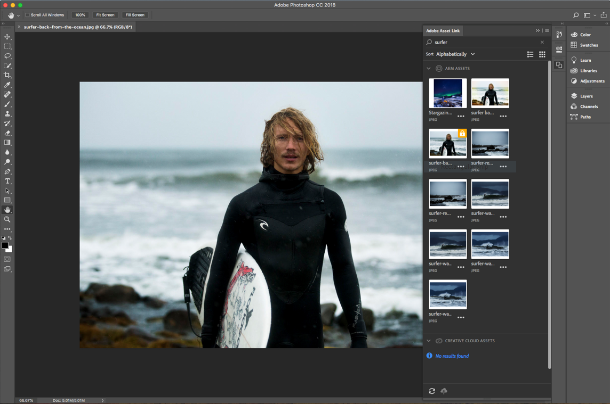

# [!DNL Adobe Experience Manager Assets] releaseopmerkingen {#aem-assets-release-notes}

Hier volgen de belangrijkste kenmerken en hooglichten van de [!DNL Adobe Experience Manager] 6.5- [!DNL Assets] release.

## Integratie met [!DNL Adobe Creative Cloud] en creatieve workflows {#integration-with-adobe-creative-cloud-and-creative-workflows}

[!DNL Adobe Experience Manager] biedt verschillende manieren om te integreren met [!DNL Adobe Creative Cloud] en middelen te delen voor gebruik in workflows waarbij de creatieve en marketingteams of de zakelijke teams nauw samenwerken. [!DNL Experience Manager] 6.5 De integratie blijft verbeteren en wordt verder gestroomlijnd om meer kansen te creëren en de bestaande methoden te stroomlijnen.

Lees verder om de specifieke mogelijkheden en integratie van [!DNL Experience Manager] 6.5 te kennen die u kunt gebruiken om uw gebruiksscenario&#39;s voor snelheid van inhoud optimaal te ondersteunen.

### Adobe-itemkoppeling {#aal}

[!DNL Adobe Asset Link] versterkt de samenwerking tussen creatieve en marketingmedewerkers bij het maken van inhoud. Creatieven hebben toegang tot inhoud die is opgeslagen in [!DNL Experience Manager Assets], zonder de apps te verlaten waarmee ze het meest vertrouwd zijn. Creatieven kunnen naadloos door middelen bladeren, zoeken, uitchecken en inchecken met het deelvenster in de app in [!DNL Adobe Photoshop], [!DNL Adobe Illustrator]en in [!DNL Adobe InDesign] apps.

[!DNL Adobe Asset Link] maakt deel uit van [Creative Cloud voor zakelijke](https://www.adobe.com/creativecloud/business/enterprise.html) aanbiedingen. Voor meer informatie over het, met inbegrip van noodzakelijke configuratie van uw [!DNL Experience Manager] plaatsing, zie de Verbinding [van Activa van](https://helpx.adobe.com/enterprise/using/adobe-asset-link.html)Adobe.

### [!DNL Adobe Stock] integratie {#stock}

Uw organisatie kan haar [!DNL Adobe Stock] ondernemingsplan binnen gebruiken [!DNL Experience Manager Assets] om ervoor te zorgen dat de vergunning gegeven activa algemeen beschikbaar voor uw creatieve en marketing projecten zijn. U kunt snel [!DNL Adobe Stock] middelen vinden, voorproef, en vergunning geven die in Experience Manager worden bewaard, gebruikend de krachtige mogelijkheden DAM van [!DNL Experience Manager].

[!DNL Adobe Stock] biedt ontwerpers en bedrijven toegang tot miljoenen kwalitatief hoogstaande, gekrulde, royaltyvrije foto&#39;s, vectoren, illustraties, video&#39;s, sjablonen en 3D-middelen voor al hun creatieve projecten.

Zie Adobe Stock-elementen [gebruiken in Experience Manager Assets](/help/assets/aem-assets-adobe-stock.md)voor meer informatie.

*Afbeelding: Geef een voorvertoning weer van de afbeelding en de licentie[!DNL Adobe Stock]vanuit[!DNL Experience Manager Assets].*

*Afbeelding: Zoek en filter de gelicentieerde[!DNL Adobe Stock]afbeeldingen in[!DNL Experience Manager].*

### Dynamische verwijzingen in [!DNL Adobe InDesign] {#dynamic-references-in-indesign}

[!DNL Experience Manager Assets] gebruikt in [!DNL Adobe InDesign] bestanden zijn dynamisch. De verwijzingen worden automatisch bijgewerkt als de middelen waarnaar wordt verwezen in de bewaarplaats worden verplaatst. Zie [hoe u samengestelde elementen](/help/assets/managing-linked-subassets.md)kunt beheren voor meer informatie.

## Merk Portal-mogelijkheden {#brand-portal-capabilities}

[!DNL Experience Manager Assets Brand Portal] helpt u de goedgekeurde middelen eenvoudig te verwerven, effectief te controleren en veilig te distribueren aan externe leveranciers/agentschappen en interne zakelijke gebruikers over verschillende apparaten. Het helpt de efficiëntie van het delen van bedrijfsmiddelen te verbeteren, versnelt de tijd tot aan de markt voor bedrijfsmiddelen en voorkomt het risico van niet-conform gebruik en ongeoorloofde toegang.

Zie [Nieuwe functies in Brand Portal](https://helpx.adobe.com/experience-manager/brand-portal/using/whats-new.html)voor meer informatie.

## Gekoppelde assets {#connectedassets}

In grote ondernemingen kan de infrastructuur die nodig is om websites te maken, worden gedistribueerd. De mogelijkheden voor het maken van websites en de vereiste digitale middelen bevinden zich soms in verschillende silo&#39;s.

[!DNL Experience Manager Sites] biedt functies voor het maken van webpagina&#39;s en is het DAM-systeem (Digital Asset Management) dat de vereiste assets voor websites levert. [!DNL Experience Manager Assets] [!DNL Experience Manager] ondersteunt nu het bovenstaande gebruiksgeval door integratie [!DNL Sites] en [!DNL Assets]. Zie [hoe u de functie](/help/assets/use-assets-across-connected-assets-instances.md)Verbonden elementen configureert en gebruikt.

![Sleep een middel van een [!DNL Experience Manager] plaatsing op een [!DNL Sites] pagina van een verschillende [!DNL Experience Manager] plaatsing](assets/connected-assets-drag-and-drop-only.gif)

*Afbeelding: Sleep een middel van een[!DNL Experience Manager]plaatsing op een[!DNL Sites]pagina op een verschillende[!DNL Experience Manager]plaatsing.*

##  Dynamic Media {#dynamic-media}

[!DNL Dynamic Media] biedt verbeterde creatie en levering van geavanceerde media in [!DNL Experience Manager Assets] de aanjager van geavanceerde ervaringen die overweldigend en gepersonaliseerd zijn. Door één master middel van hoge kwaliteit te uploaden en onze geavanceerde cloudrendering en viewers te gebruiken, kunt u elke combinatie van uitvoeringen ter plekke aanbieden ter ondersteuning van de mediabeleid van uw organisatie.

Zie Opmerkingen bij de release [!DNL Dynamic Media] Dynamische media voor meer informatie over nieuwe [functies](https://docs.adobe.com/content/help/en/dynamic-media-developer-resources/release-notes/s7rn2017.html).

### 360 video-ondersteuning {#video-support}

Beheer uw 360-videobestanden rechtstreeks met behulp van de meest geavanceerde viewers voor VR-ervaringen op desktops, mobiele apparaten en VR-headsets. [!DNL Experience Manager] Zie [360-video](/help/assets/360-video.md)gebruiken voor meer informatie.

### Aangepaste videominiaturen {#custom-video-thumbnails}

U kunt de miniaturen voor uw video-elementen nu aanpassen met frames uit de video zelf of andere inhoud die is opgeslagen in de DAM. Zie [Informatie over videominiaturen](/help/assets/video.md#about-video-thumbnails-in-dynamic-media-scene-mode)voor aanvullende instructies.

### Verbeteringen voor toegankelijkheid {#accessibility-enhancements}

[!DNL Dynamic Media] viewers bieden nu ondersteuning voor verbeterde toegankelijkheidsfuncties, zoals apparaatondersteuning, schermlezers en Alt-tekst. Zie Opmerkingen bij de release van [Dynamic Media-viewers voor meer informatie](https://docs.adobe.com/content/help/en/dynamic-media-developer-resources/library/home.html).

## Verbeterde zoekervaring {#experience-enhancement-for-searching}

[!DNL Experience Manager] Vanaf 6.5 kunnen marketers de gewenste middelen sneller vinden op de pagina met zoekresultaten. De zoekfacetten worden met het aantal elementen bijgewerkt, zelfs voordat het zoekfilter wordt toegepast. Door het verwachte aantal op het filter te zien, kunnen gebruikers efficiënt door de zoekresultaten navigeren. Zie Elementen [zoeken in Experience Manager](../assets/search-assets.md)voor meer informatie.

*Afbeelding: Zie het aantal elementen zonder zoekresultaten te filteren in zoekfacetten.*

## Verbetering van bruikbaarheid {#usability-enhancement}

U kunt nu alle geladen elementen in een map selecteren of vanuit een zoekresultaat in één keer. Hiermee kunt u meerdere elementen snel beheren. Het controlevakje selecteert alle activa die het scenario, bijvoorbeeld een onderzoeksresultaat en niet alleen de activa passen die in de [!DNL Experience Manager] interface zichtbaar zijn.

*Afbeelding: Gebruik de optie Alles selecteren om alle geladen elementen met één klik te selecteren.*

## Verbeteringen in metagegevens {#metadata-enhancements}

[!DNL Assets] Hiermee kunt u metagegevensschema&#39;s maken voor middelenmappen, waarmee de lay-out en de metagegevens worden gedefinieerd die op pagina&#39;s met mapeigenschappen worden weergegeven. U kunt nu een schema voor mapmetagegevens toewijzen aan een bestaande map of bij het maken van een nieuwe map. Zie [Metagegevensschema](/help/assets/metadata-config.md#folder-metadata-schema)van map voor meer informatie.

Als u trapsgewijze metagegevens opgeeft, kunnen de opties tijdens de runtime uit een JSON-bestand worden geladen, bijvoorbeeld in plaats van handmatig in het formulier te typen. Zie [trapsgewijze metagegevens](/help/assets/metadata-schemas.md#cascading-metadata)voor meer informatie.

## Verbeteringen rapporteren {#reporting-enhancements}

De Inhoudsfragmenten en de aandelen van de verbinding zijn nu inbegrepen in het gedownloade rapport. Zie [Elementenrapporten](/help/assets/asset-reports.md)voor meer informatie.
