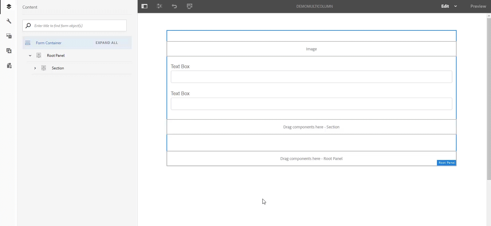

# Nieuw in Adobe Experience Manager 6.5 Service Pack 4 {#aem-whats-new-service-pack-4}

In 2020 biedt Adobe Experience Manager (AEM) 6.5 functies en voortdurende verbeteringen in driemaandelijkse servicepacks. De klanten profiteren van deze nieuwe aanpak, aangezien zij de innovaties sneller kunnen toepassen.

Het nieuwste AEM Service Pack 4 (6.5.4.0) wordt uitgebracht op 5 **maart 2020**. In dit artikel worden de functies gemarkeerd die het nieuwste Service Pack biedt om uw AEM-reis verrijkend te maken.

## AEM Sites {#aem-sites}

### Prestatieverbeteringen op verschillende gebieden {#performance-improvements}

* Minder tijd voor het laden en initialiseren van ContextHub binnen een plaats (contexthub.kernel.js). Hierdoor wordt een pagina tijdens een bezoek aan de site sneller geladen.

* Verlaagde tijd om een pagina te vernieuwen nadat u ervaringsfragmenten hebt gesleept en neergezet in het canvas van een pagina-editor.

* In Live Copy-overzicht verkort u de tijd die nodig is om items te laden wanneer een site meer dan 200 live kopieën bevat.

* In de Redacteur van het Malplaatje, verbeterde de behandeling van onvolledige of ongeldige URLs die de Redacteur van het Malplaatje kan teweegbrengen om te vertragen.

Bovendien bevat AEM 6.5 SP4 de verbeteringen van het Stijlsysteem. U kunt nu ook stijlen selecteren in een deeldialoogvenster.

## AEM Assets {#aem-assets}

### Integratie met Brand Portal via Adobe I/O-console {#assets-integration-bp}

AEM Assets wordt nu geconfigureerd met Brand Portal via Adobe I/O, dat een IMS token aanschaft voor goedkeuring van de Pantaarn van het Brand Portal. Eerder, werd het gevormd in Klassieke UI via Verouderde Gateway OAuth.

Nieuwe integratie met de oude OAuth wordt niet ondersteund na 6 april 2020 en wordt overgeplaatst naar de Adobe I/O-console. Als u de integratie niet wijzigt, blijven de bestaande configuraties werken.

U kunt een nieuwe integratie maken of uw integratie-instellingen upgraden naar Adobe I/O-console.

### Verbeteringen voor toegankelijkheid {#accessibility-enhancements}

* Selectievakjes met gemengde status hebben nu een kenmerk met aria-controle en een waarde &quot;gemengd&quot;, zodat de gemengde status van deze selectievakjes voor schermlezers beschikbaar is.

* Besturingselementen op basis van toetsenborden worden nu ondersteund, met uitzondering van bewegingen op basis van paden, om te navigeren rond ingezoomde afbeeldingen.

* Datumnotatiebeperkingen zijn opgegeven in veldlabels voor gebruikers met alleen het toetsenbord om handmatig datum in te voeren.

* Het kenmerk Alt is toegevoegd aan decoratieve pictogrammen en het kenmerk role=img is verwijderd, zodat dergelijke pictogrammen en afbeeldingen niet beschikbaar worden gemaakt voor schermlezers.

* Het Alt-kenmerk is toegevoegd aan sluitpictogrammen om aan te geven dat de gebruiker van een schermlezer met de Tab-toets omgaat.

## AEM Forms {#aem-forms}

### Afdrukbare uitvoer genereren in AEM Forms-workflows {#generate-printable-output}

Als u een oplossing wilt om veelvoudige exemplaren van een bronmalplaatjedossier te drukken en het met een gegevensdossier met talrijke verslagen te integreren, is een nieuwe Generate Afdrukbare de werkschemastap van de Output beschikbaar in Vormen AEM. Als u bijvoorbeeld een bronformulier met een andere naam wilt afdrukken telkens wanneer het wordt afgedrukt, kunt u deze namen in het gegevensbestand opnemen en het formulier integreren met een standaardsjabloonbestand.

Profiteer van deze functie met **Gereedschappen** > **[!UICONTROL Workflow]** > **[!UICONTROL Modellen]** > **[!UICONTROL Maken]** en zoek vervolgens naar de stap Afdrukbare uitvoer **** genereren.

Voor meer informatie over deze eigenschap, zie [Forms-centric werkschema op OSGi - de Verwijzing](../forms/using/aem-forms-workflow-step-reference.md)van de Stap.

### Ondersteuning voor meerdere kolommen voor adaptieve formulieren en interactieve communicatie in de modus Lay-out {#multi-column-adaptive-forms}

U kunt nu het aantal kolommen voor een deelvenster definiëren in adaptieve formulieren en interactieve communicatie.

U vindt de nieuwe optie door over te schakelen op de modus Lay-out, op het deelvenster te tikken dat u wilt omzetten in een indeling met meerdere kolommen, het bovenliggende venster te selecteren en op het pictogram met meerdere kolommen te tikken, zoals in de volgende afbeelding wordt weergegeven, om het aantal kolommen voor het deelvenster te definiëren.

Zie De modus Lay-out [gebruiken om het formaat van componenten](../forms/using/resize-using-layout-mode.md)te wijzigen voor meer informatie.

### AEM Inbox-aanpassingen {#aem-inbox}

Voelt u ooit de behoefte om opties aan te passen beschikbaar in kopbal AEM? Het is nu mogelijk met onze nieuwe versie van Service Pack met de introductie van een optie van de Controle **** Admin.

**Koptekst aanpassen**

Gebruikers die behoren tot de groep **workflowbeheerders** kunnen nu de koptekst die boven aan het scherm beschikbaar is, aanpassen met tekst van uw eigen keuze om de bestaande tekst in **[!UICONTROL Adobe Experience Manager]** te vervangen.

U vindt de nieuwe optie Koptekst **[!UICONTROL aanpassen in koptekst]** onder Weergaveselectie (beschikbaar in de rechterbovenhoek van de werkbalk) > **[!UICONTROL Beheer]**.

**Logo aanpassen**

Net als bij het aanpassen van koptekst kunnen gebruikers die tot een groep **workflowbeheerders** behoren, het logo dat bovenaan beschikbaar is, nu aanpassen met het logo van uw eigen keuze.

U vindt de nieuwe optie Logo **** aanpassen onder Weergaveselectie > **[!UICONTROL Beheer]**.

Zie [Uw Postvak IN](../sites-authoring/inbox.md)voor meer informatie over deze functie.

### Gebruikersnavigatiecontrole {#user-navigation-control}

De gebruikers die tot **werkschema-beheerders** groep behoren hebben de optie om de gebruikers te maken werken aan AEM op een beperkte wijze die op hun rol wordt gebaseerd. De beheerders kunnen de weergave van navigatieopties in de koptekst bepalen en de gebruikers beperken tot de modus voor het schrijven van workflows of naar Help- of andere koppelingen naar oplossingen navigeren.

Bekijk de nieuwe navigatieopties **** Verbergen onder Weergaveselector > **[!UICONTROL Beheer]**.

Zie [Uw Postvak IN](../sites-authoring/inbox.md)voor meer informatie over deze functie.

### RTF-ondersteuning in HTML5-formulieren {#rich-text-support}

In het tekstveld kan nu een lijst met opmaakopties worden weergegeven in het weergegeven HTML5-formulier. U moet een veldindeling voor het tekstveld definiëren in Forms Designer om de juiste instellingen op het veld toe te passen.

Tik op het tekstveld in de **[!UICONTROL ontwerpweergave]** in Forms Designer om deze functie te gebruiken. Selecteer op het tabblad **[!UICONTROL Veld]** de optie **[!UICONTROL RTF]** in de vervolgkeuzelijst **[!UICONTROL Veldindeling]** om de instellingen toe te passen. In het tekstveld worden nu opmaakopties weergegeven wanneer het wordt weergegeven in een HTML5-formulier.

Zie Formuliersjablonen [ontwerpen voor HTML5-formulieren](../forms/using/designing-form-template.md)voor meer informatie.

## Belangrijke markeringen

Naast de nieuwe functies bevat AEM 6.5 Service Pack 4 de volgende belangrijke kenmerken:

* Alleen substructuren met selectieve inhoud kunnen nu worden gesynchroniseerd met de modus *Dynamische media - Scene7 in plaats van met alle substructuren* `content/dam`.

* Integratie van formuliergegevensmodellen met SOAP-webservice ondersteunt nu keuzegroepen of kenmerken voor elementen.

* De invoer of de output van de ZEEP en complexe gegevensstructuren steunen nu Dynamische Vervanging van de Groep.

## Belangrijkste functies in vorige AEM 6.5-servicepacks

### Smart Imaging voor dynamische media {#smart-imaging}

Slimme beeldverwerking maakt gebruik van de unieke weergavekenmerken van elke gebruiker, zodat deze automatisch de juiste afbeeldingen levert die zijn geoptimaliseerd voor zijn of haar ervaring, wat resulteert in betere prestaties en betrokkenheid. Slimme beeldverwerking werkt met bestaande voorinstellingen voor afbeeldingen en maakt gebruik van intelligentie tijdens de laatste milliseconde van levering om de bestandsgrootte van de afbeelding verder te beperken op basis van de snelheid van de browser of netwerkverbinding. Zie [Slimme afbeeldingen](../assets/imaging-faq.md).

### Visuele zoekopdracht naar AEM-elementen {#visual-search}

Met middelen kunnen gebruikers visueel vergelijkbare afbeeldingen zoeken. AEM geeft de slimme getagde afbeeldingen uit de DAM-opslagplaats weer die lijken op een door de gebruiker geselecteerde afbeelding. Zie [Visueel onderzoek](../assets/search-assets.md).

### Deel en verzoek toegang tot Inbox punten van een gebruiker {#share-request-access}

U kunt uw Inbox punten met een andere gebruiker delen. Zodra een andere gebruiker toegang heeft tot uw Inbox-items, kan de gebruiker een claim indienen en de juiste actie ondernemen voor gedeelde items. Op dezelfde manier kunt u andere gebruikers om toegang tot Inbox-items verzoeken. Zie [Delen en verzoek om toegang tot Inbox-items van een gebruiker](../forms/using/configure-shared-queues-osgi.md).

### Vorm uit bureau het plaatsen voor uw Inbox punten {#configure-out-of-office}

Als u van plan bent om uit het bureau te zijn, kunt u specificeren wat aan punten gebeurt die aan u voor die periode worden toegewezen.
U kunt een begindatum en -tijd en een einddatum en -tijd opgeven die van kracht moeten worden als uw instellingen buiten het kantoor zijn. U kunt een standaardpersoon instellen waarnaar al uw items worden verzonden. Zie [Vorm uit de montages](../forms/using/configure-out-of-office-settings.md)van het Bureau.

### Meerdere interactieve communicatie genereren met de Batch-API {#generate-multiple-ic}

U kunt de batch-API gebruiken om meerdere interactieve communicatie van een sjabloon te maken. De sjabloon is een interactieve communicatie zonder gegevens. De batch-API combineert gegevens met een sjabloon voor interactieve communicatie. De API is nuttig bij de massaproductie van interactieve communicatie. Bijvoorbeeld telefoonrekeningen, creditcardoverzichten voor meerdere klanten. Zie Meerdere interactieve communicatie [genereren met de Batch-API](../forms/using/generate-multiple-interactive-communication-using-batch-api.md).

### Standaardvalidatiefoutenberichten voor adaptieve formulieren {#standard-validation}

Aangepaste formulieren kunnen nu worden geïntegreerd met aangepaste services om gegevensvalidaties uit te voeren. Als de invoerwaarden niet voldoen aan de validatiecriteria en het foutbericht dat de server retourneert, de standaardberichtindeling heeft, worden de foutberichten in het formulier op veldniveau weergegeven. Als de invoerwaarden niet voldoen aan de validatiecriteria en het foutbericht voor servervalidatie niet in de standaardberichtindeling is, bieden de adaptieve formulieren een mechanisme om de foutberichten voor validatie om te zetten in een standaardnotatie, zodat ze op veldniveau in het formulier worden weergegeven. Zie [Standaardfoutberichten voor validatie voor adaptieve formulieren](../forms/using/standard-validation-error-messages-adaptive-forms.md).

## Belangrijke releases sinds AEM 6.5 SP3

Tussen 12 december 2019 en 5 maart 2020 heeft Adobe de volgende functies uitgebracht die buiten de kernlevering van AEM vallen:

* AEM Cloud Manager 2020.1.0 en 2020.2.0Maandelijkse verbeteringen in Cloud Manager, de laatste twee versies waren gericht op het verbeteren van de pijpleidingsstatus en de capaciteit om logboeken voor de diverse stappen te downloaden. Lees hier de volledige opmerkingen over de release:
   * [Cloud Manager 2020.1.0](https://docs.adobe.com/content/help/en/experience-manager-cloud-manager/using/release-notes/release-notes-2020-1-0.html)

   * [Cloud Manager 2020.2.0](https://docs.adobe.com/content/help/en/experience-manager-cloud-manager/using/release-notes/release-notes-current.html)

* Updates van AEM Cloud Manager CLIAutomate Cloud Manager-taken met behulp van het opdrachtregelprogramma. Wij breiden voortdurend CLI uit - sluit zich aan bij op [GitHub](https://github.com/adobe/aio-cli-plugin-cloudmanager/releases).

* AEM-sites: Projectarchetype 23The best way to start a new AEM project. Met Archetype 23 [verenigen wij het Archetype van het Project voor SPA en regelmatige plaatsen in één](https://github.com/adobe/aem-project-archetype/releases/tag/aem-project-archetype-23), verder verstrekkend een standaardthema om uw front-end ontwikkeling te starten.

* AEM-sites: WKND Reference SiteAll [nieuw referentieproject](https://www.wknd.site/) verpakt met beste praktijken op hoe te om plaatsen met AEM te bouwen. Leer meer het lezen van het volledig bijgewerkte [WKND leerprogramma](https://helpx.adobe.com/experience-manager/kt/sites/using/getting-started-wknd-tutorial-develop.html) en greep de code van [GitHub](https://github.com/adobe/aem-guides-wknd/releases).

* AEM-sites: Commerce CIF Core Components 0.7.0 en 0.9.0Integrating AEM Sites and Magento Commerce. We [breiden voortdurend speciale kerncomponenten uit en een projectarchetype dat zich richt op handel](https://github.com/adobe/aem-core-cif-components/releases).

* AEM-elementen: Desktop App 2.0.1.1
   [Desktoptoegang tot de middelen](https://docs.adobe.com/content/help/en/experience-manager-desktop-app/using/release-notes.html)

* AEM-schermen: Feature Pack 202001Digital Signage rechtstreeks vanuit AEM. Bekijk de nieuwste verbeteringen met het nieuwste Feature Pack. Dit keer [maken we het synchroon afspelen op meerdere mediaspelers](https://docs.adobe.com/content/help/en/experience-manager-screens/user-guide/release-notes/release-notes-fp-202001.html)mogelijk.

## Nuttige bronnen

* [Handleidingen voor AEM 6.5-gebruikers](../user-guide/capabilities.md)

* [Algemene opmerkingen bij de release van Adobe Experience Manager 6.5](release-notes.md)

* [Opmerkingen bij de release van Service Pack voor Adobe Experience Manager 6.5](sp-release-notes.md)
