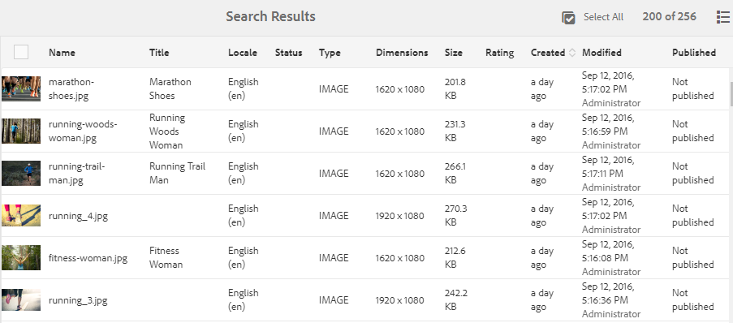

# Nieuw in Adobe Experience Manager 6.5 Service Pack 6 {#aem-whats-new-service-pack-6}

Adobe Experience Manager 6.5 de dienstpakken verstrekken nieuwe eigenschappen, klant-gevraagde verhogingen, en prestaties, stabiliteit, en veiligheidsverbeteringen op kwartaalintervallen. De beschikbaarheid op kwartaalbasis maakt het gemakkelijk om tot nieuwe eigenschappen en innovaties toegang te hebben en te nemen.

Dit artikel benadrukt de eigenschappen inbegrepen in recentste 6.5 Service Pack, [belangrijkste eigenschappen inbegrepen in de vorige 6.5 Pakken](#key-features-previous-service-packs)van de Dienst, en sommige van de [belangrijkste versies sinds Experience Manager 6.5.5.0](#key-releases-since-last-sp) .

## Adobe- [!DNL Experience Manager] sites {#aem-sites}

### Beschikbaarheid van de bewerking Pagina verplaatsen in de asynchrone modus {#page-move-asynchronous}

De bewerking Pagina verplaatsen is nu beschikbaar in de asynchrone modus. U kunt de bewerking Pagina verplaatsen niet alleen direct uitvoeren, maar ook later plannen.

## [!DNL Dynamic Media] {#dynamic-media}

### CDN-inhoud in cache ongeldig maken {#invalidate-cdn-cached-content}

U kunt nu de [!DNL Dynamic Media] gebruikersinterface gebruiken om inhoud die in de cache is opgeslagen, ongeldig te maken. Hierdoor zijn de bijgewerkte elementen direct beschikbaar in plaats van te wachten tot de cache verloopt. U kunt CDN ongeldig maken door:

* Een CDN-validatiesjabloon maken: Elementen en aan een sjabloon gekoppelde URL&#39;s selecteren

* Elementen en bijbehorende voorinstellingen selecteren via de elementkiezer

* URL&#39;s van volledige middelen toevoegen

### Selectieve publicatie van activa aan [!DNL Experience Manager] en [!DNL Dynamic Media] {#selective-publishing}

U kunt er nu voor kiezen om elementen selectief te publiceren of de publicatie ervan ongedaan te maken [!DNL Experience Manager] of [!DNL Dynamic Media] met [!UICONTROL Quick Publish] de wizard of de [!UICONTROL Manage Publication] wizard. U kunt de `Publish` of de `Unpublish` modus ook instellen op mapniveau.

## [!DNL Adobe Experience Manager Assets] {#aem-assets}

### Verbeteringen voor toegankelijkheid {#accessibility-assets-6560}

* **Verbeterde focus van de gebruikersinterface tijdens toetsenbordnavigatie**, bijvoorbeeld focus op:

   * `x` in het [!UICONTROL Version Preview] dialoogvenster van een element in [!UICONTROL Timeline].

   * Opties voor een uitvoerbare gebruikersinterface.

   * Veld e-mailen in het [!UICONTROL Share Link] dialoogvenster en veld om een gesloten gebruikersgroep toe te voegen op het [!UICONTROL Permission] tabblad Map [!UICONTROL Properties].

* **Verbeterde functionaliteit met toetsenbordtoetsen**

   Gebruikers kunnen toetsenbordtoetsen gebruiken om besturingselementen in de formuliereditor voor metagegevensschema te slepen in de bladermodus van schermlezers.

* **Verbeterde bruikbaarheid voor schermlezers**, als gevolg van het volgende:

   * Schermlezers geven het doel van video- en audiospelers aan.

   * Schermlezers geven aan wat het doel is van de gebruikersinterfaceopties om de geselecteerde tags te verwijderen met behulp van [!UICONTROL Tags selection dialog] de elementen [!UICONTROL Properties].

   * Schermlezers kondigen de rijkoppen en rij-items van tabellen aan, zodat gebruikers weten welke items tot dezelfde rij behoren.

   * Beschrijvende en betekenisvolle paginatitel van zoekpagina.

   * Schermlezers geven de opties in het deelvenster met zoekfilters aan als uitbreidbare accordeons.

### Andere verbeteringen in elementen {#other-enhancements-assets-6560}

* Gebruikersgroepen die zijn gekoppeld aan mappen (privégroepen en niet-privégroepen) worden nu verwijderd uit de opslagplaats wanneer deze mappen worden [verwijderd](/help/assets/private-folder.md#delete-private-folder). Bestaande redundante, zwevende, ongebruikte en automatisch gegenereerde gebruikersgroepen kunnen echter met JMX uit de opslagplaats worden opgeschoond.

## [!DNL Adobe Experience Manager Forms] {#aem-forms}

### Een adaptief formulier vooraf invullen op de client {#prefill-merge-data-at-client}

Wanneer u een adaptief formulier vooraf instelt, voegt de [!DNL Experience Manager Forms] server gegevens samen met een adaptief formulier en levert het ingevulde formulier aan u. De handeling voor het samenvoegen van gegevens vindt standaard plaats op de server.
U kunt de [!DNL Experience Manager Forms] server nu zodanig configureren dat de handeling voor het samenvoegen van gegevens wordt [uitgevoerd op de client](../../help/forms/using/prepopulate-adaptive-form-fields.md) in plaats van op de server. Hierdoor wordt de tijd die nodig is om adaptieve formulieren vooraf in te vullen en weer te geven, aanzienlijk verkort.

### Integratie van formuliergegevensmodellen met RESTful-API&#39;s op een server met 2-wegs SSL-implementatie {#fdm-integration-rest-apis-two-way-ssl}

[!DNL Experience Manager Forms] Het formuliergegevensmodel kan nu worden [geïntegreerd met RESTful-API&#39;s op een server waarop een 2-wegs-SSL is geïmplementeerd](../../help/forms/using/configure-data-sources.md).

### Toegevoegde ondersteuning voor [!DNL Adobe Sign] tekstcodes in Automated Forms Conversion Service {#sign-integration-acroform-afcs}

Als een AcroForm-formulier [!DNL Adobe Sign] tekstcodes bevat, worden deze velden nu herkend en weergegeven als [!DNL Adobe Sign] velden in het adaptieve formulier dat is geconverteerd met [!DNL Automated Forms Conversion service]. Een ondertekenaar kan dergelijke velden invullen terwijl hij het adaptieve formulier ondertekent.

### Support to convert colored PDF forms to adaptive forms {#colored-PDF-forms}

U kunt gekleurde PDF forms omzetten [!DNL Automated Forms Conversion service] in adaptieve formulieren.

### Steun voor SMB 2 en SMB 3 protocollen {#smb-support}

[!DNL Experience Manager Forms] steunt nu SMB 2 en SMB 3 protocollen.

### Verbeterd in cache plaatsen voor vertaalde adaptieve formulierpagina&#39;s {#enhanced-caching-translated-adaptive-forms}

U kunt nu de [landinstelling als een kiezer opgeven in het aangepaste formulier-URL in plaats van een argument in de aangepaste vorm-URL](../../help/forms/using/supporting-new-language-localization.md). Hiermee kunt u vertaalde adaptieve formulieren in de cache plaatsen [!DNL Experience Manager Dispatcher]. Het in cache plaatsen van vertaald adaptief formulier was niet mogelijk in eerdere versies. Zie Aangepaste formuliercache [configureren in verzender](../../help/forms/using/configure-adaptive-forms-cache.md)voor gedetailleerde informatie over het configureren van caching voor het gebruik van locale als kiezer in de aangepaste formulier-URL.

### Uitvoer van formuliergegevensmodelservice opslaan naar een variabele {#save-fdm-service-to-variable}

Met het formuliergegevensmodel kunt u de uitvoer van een service van een formuliergegevensmodel opslaan in een variabele. [!DNL Experience Manager Forms] Hiermee wordt nu automatisch het type van de service van het formuliergegevensmodel toegewezen aan het type variabele.

### Meerdere bestanden bijvoegen voor de component Bestandsbijlage {#attach-multiple-files}

U kunt nu meerdere bestanden  koppelen aan de [!UICONTROL File Attachment] component van adaptieve formulieren.

## Belangrijkste eigenschappen in vorige Experience Manager 6.5 de Pakken van de Dienst {#key-features-previous-service-packs}

### Sites Experience Managers {#aem-sites-previous-service-packs}

#### Verbeteringen van de toegankelijkheid (6.5.5.0) {#accessibility-sites}

* Verbeterde foutrapportage door tekstgegevens toe te voegen.

* Verbeterde focus van de gebruikersinterface tijdens toetsenbordnavigatie.

* Verbeterde contrastverhouding voor verschillende gebruikersinterface-elementen.

* Verbeterde consistentie van alt-kenmerken voor paginaafbeeldingen.

* Verbeterde consistentie van Toegankelijke Rich Internet Applications (ARIA) etiketten.

* Verbeterde NVDA-mogelijkheden (Non-Visual Desktop Access).

* Verbeterde ondersteuning voor schermlezers.

#### Andere belangrijke verbeteringen (6.5.5.0) {#other-enhancements-sites}

* Anonieme toegang tot CRXDE Lite is niet toegestaan om de beveiliging te verbeteren. In plaats daarvan worden de gebruikers naar het aanmeldingsscherm geleid. Zie [Ontwikkelen met CRXDE Lite](/help/sites-developing/developing-with-crxde-lite.md).

* Wanneer u een paginastructuur kopieert of plakt, kunt u nu de basispagina plakken of de basispagina plakken met de subpagina&#39;s van de structuur.

* [!DNL Adobe Experience Manager Experience Fragments] geëxporteerd naar [!DNL Adobe Target] werkruimten worden nu weergegeven als unieke aanbiedingstypen en bieden bronnen aan in [!DNL Target].

* Beheer van meerdere sites - De trigger Publiceren verwijdert nu een component van de gepubliceerde pagina als een component van de bronpagina wordt verwijderd.

* Beheer van meerdere sites - Wanneer de naam van een lokale component in een afbeelding identiek [!UICONTROL Live Copy] is aan de naam van een component in de blauwdruk en de component uit de blauwdruk wordt opgerold, `_msm_moved` wordt de term nu toegevoegd aan de naam van de lokale component.

#### Stijlsysteemverbeteringen (6.5.4.0) {#style-system-enhancements}

U kunt nu stijlen selecteren in het dialoogvenster met het verbeterde stijlsysteem.

#### Prestatieverbeteringen op verschillende gebieden (6.5.4.0) {#performance-improvements}

* Verminderde tijd om ContextHub binnen een plaats (`contexthub.kernel.js`) te laden en te initialiseren. Hierdoor worden pagina&#39;s tijdens een bezoek aan de site sneller geladen.

* Verlaagde tijd om een pagina te vernieuwen nadat u deze naar de [!DNL Experience Fragments] [!DNL Sites] Pagina-editor hebt gesleept.

* De laadtijd voor vermeldingen op een [!DNL Sites] pagina met meer dan 200 actieve kopieën is verkort **[!UICONTROL Live Copy Overview]**.

* Verbeterde verwerking van onvolledige of ongeldige URL&#39;s. Dergelijke URL&#39;s kunnen de Sjablooneditor vertragen.

### [!DNL Adobe Experience Manager Assets] {#aem-assets-previous-service-packs}

#### Toegankelijkheidsverbeteringen in [!DNL Assets] (6.5.5.0) {#assets-accessibility}

[!DNL Experience Manager Assets] is nu toegankelijker in overeenstemming met de Web Content Accessibility Guidelines (WCAG). De toegankelijkheid is verbeterd dankzij de volgende verbeteringen:

* Veel gebruikersinterface-elementen, besturingselementen, pagina&#39;s en dialoogvensters zijn schermlezervriendelijk.

* Veel elementen, besturingselementen en invoerformuliervelden van de gebruikersinterface zijn toegankelijk via het toetsenbord.

* De kleur en het contrast van bepaalde elementen van de gebruikersinterface worden bijgewerkt, zodat gebruikers met een beperkt gezichtsvermogen of gebruikers zonder kleurperceptie deze elementen van de gebruikersinterface kunnen onderscheiden. De kleur van sterrenbeoordelingspictogrammen (zoals in de [!UICONTROL Rating] sectie van het [!UICONTROL Advanced] tabblad in het element [!UICONTROL Properties] of in de kaartweergave) wordt bijvoorbeeld gewijzigd voor het juiste contrast.

   

#### Uitgebreide afhandeling van uitzonderingen (6.5.5.0) {#exception-handling}

[!DNL Assets] de stroom van de gebruikersinterface heeft betere uitzonderingsbehandeling. Als een element geen type heeft voor de dimensie, wordt de waargenomen uitzondering opgenomen in de logbestanden.

#### Ondersteuning voor 3D-elementen in [!DNL Dynamic Media] (6.5.5.0) {#support-for-3d}

Met ondersteuning voor 3D-afbeeldingen in [!DNL Dynamic Media] kunnen klanten 3D-inhoud publiceren en toevoegen aan webpagina&#39;s en toepassingen. De steun omvat:

* Publiceer algemene indelingen voor 3D-elementen en genereren een middel-URL die kan worden gebruikt in webpagina&#39;s en andere toepassingen.

* Een 3D-webviewer, ingeschakeld door [!DNL Adobe Dimension], om de gepubliceerde 3D-elementen interactief weer te geven.

* Publiceer en bekijk gemeenschappelijke 3D activa op [!DNL Experience Manager Sites] pagina&#39;s gebruikend de component [!DNL Sites] WCM.

#### Configureren [!DNL Experience Manager Assets] met [!DNL Brand Portal] (6.5.4.0) {#configure-assets-bp}

Het machtigingskanaal tussen [!DNL Experience Manager Assets] en [!DNL Brand Portal] is gewijzigd. Eerder, [!DNL Brand Portal] werd gevormd in Klassieke UI via Verouderde Gateway OAuth, die de het symbolenuitwisseling van JWT gebruikt om een token van de Toegang te verkrijgen IMS voor vergunning. [!DNL Experience Manager Assets] wordt nu gevormd met [!DNL Brand Portal] door Adobe I/O, die een teken IMS voor toestemming van uw [!DNL Brand Portal] huurder verwerft.

De stappen om [!DNL Experience Manager Assets] met [!DNL Brand Portal] te vormen zijn verschillend afhankelijk van uw [!DNL Experience Manager] versie, en of u voor het eerst vormt, of de bestaande configuraties bevordert. Zie Experience Manager Assets [configureren met Brand Portal](https://docs.adobe.com/content/help/en/experience-manager-brand-portal/using/publish/configure-aem-assets-with-brand-portal.html) voor meer informatie.

#### Toegankelijkheidsverbeteringen (6.5.4.0) {#accessibility-enhancements}

[!DNL Experience Manager Assets] bevat de volgende toegankelijkheidsverbeteringen:

* Met de pijltoetsen op het toetsenbord kunt u gebieden binnen ingezoomde afbeeldingen verplaatsen en pannen. Zie alleen [voor](../assets/managing-assets-touch-ui.md#previewing-assets)voorvertoningen van toetsenbordtoetsen voor meer informatie.

* De selectievakjes voor gemengde status (waarin de selectievakjes voor het eerste niveau niet zijn geselecteerd en zijn doorgehaald) in het deelvenster Filters zijn leesbaar voor schermlezers, tenzij u alle geneste selectievakjes selecteert.

* Er zijn beperkingen in de datum- en tijdnotatie opgenomen in veldlabels van datumvelden, zodat gebruikers de datum in de juiste notatie kunnen invoeren met het toetsenbord.
Bijvoorbeeld, `On Time (MM-DD-YYYY HH:mm)`. Hier is MM maand in het formaat van twee cijfers, YYYY is jaar, DD is dag in het formaat van twee cijfers, HH is uur in 24-uurs militair formaat, en mm is minuut.

* Schermlezers kondigen nu het `X` symbool aan om de geselecteerde tags samen met het aantal geselecteerde tags te verwijderen.

#### Kolom Sorteerbaar voor aanmaakdatum van elementen in lijstweergave (6.5.3.0) {#sortable-date-created-column}

Een nieuwe sorteerbare kolom voor de aanmaakdatum van elementen wordt toegevoegd in de DAM-lijstweergave en in de resultaten van zoekopdrachten naar elementen in de lijstweergave.

#### Visueel zoeken naar [!DNL Adobe Experience Manager Assets] (6.5.2.0) {#visual-search}

[!DNL Assets] gebruikers kunnen visueel vergelijkbare afbeeldingen zoeken. Experience Manager geeft de slimme getagde afbeeldingen uit de DAM-opslagplaats weer die lijken op een door de gebruiker geselecteerde afbeelding. Zie [Visueel onderzoek](../assets/search-assets.md).

###  Dynamic Media {#dynamic-media-previous-service-packs}

#### Smart Imaging voor dynamische media {#smart-imaging}

Slimme beeldverwerking gebruikt de unieke weergavekenmerken van elke gebruiker om automatisch de juiste afbeeldingen te leveren die zijn geoptimaliseerd voor zijn of haar ervaring, wat resulteert in betere prestaties en betrokkenheid. Slimme beeldverwerking werkt met bestaande voorinstellingen voor afbeeldingen en maakt gebruik van intelligentie tijdens de laatste milliseconde van levering om de bestandsgrootte van de afbeelding verder te beperken op basis van de snelheid van de browser of netwerkverbinding. Zie [Slimme afbeeldingen](../assets/imaging-faq.md).

#### Slim uitsnijden in videoprofielen voor dynamische media (6.5.3.0) {#smart-crop-video}

Slim uitsnijden voor video-een optionele functie die beschikbaar is in videoprofielen - is een gereedschap dat de kracht van kunstmatige intelligentie in Adobe Sensei gebruikt om het brandpunt automatisch te detecteren en uit te snijden in adaptieve video of progressieve video die u hebt geüpload, ongeacht de grootte. Zie [Informatie over slim uitsnijden in videoprofielen](../assets/video-profiles.md).

### Experience Manager Forms {#aem-forms-previous-service-packs}

#### De Adobe Experience Manager Inbox-kolommen aanpassen (6.5.5.0){#customize-aem-inbox-columns}

U kunt een [!DNL Experience Manager] Postvak IN aanpassen om de standaardtitel van een kolom te wijzigen, de positie van een kolom opnieuw te ordenen en extra kolommen weer te geven op basis van de gegevens van een werkstroom. Leden van `administrators` of `workflow-administrators` groep kunnen de kolommen aanpassen. Zie [Beheer](../sites-authoring/inbox.md#inbox-admin-control)voor meer informatie.

#### Interactieve communicatie opslaan als concept (6.5.5.0) {#save-as-draft}

U kunt de Agent UI gebruiken om één of meerdere concepten voor elke Interactieve Mededeling te bewaren en het ontwerp later terug te winnen om aan het verder te werken. U kunt voor elk concept een andere naam opgeven om het te identificeren. Voor meer informatie, zie [sparen Interactieve Mededelingen als ontwerp](../forms/using/prepare-send-interactive-communication.md#save-as-draft).

#### [!DNL Oracle WebLogic] ondersteuning toepassingsserver (6.5.5.0) {#weblogic-support}

Adobe Experience Manager Forms heeft ondersteuning toegevoegd voor [!DNL Oracle WebLogic 12] Adobe Experience Manager Forms op JEE. U kunt een upgrade uitvoeren van een vorige versie of een nieuwe Experience Manager 6.5 Forms instellen op de JEE-server op [!DNL Oracle WebLogic] 12.2.1.4 en hoger. Later komt dit overeen met de kleine versiewijzigingen, waarbij x in 12.2.1.x wordt vervangen door een versienummer.

#### Verbeteringen van de toegankelijkheid (6.5.5.0) {#accessibility-improvements}

Adobe Experience Manager Forms bevat de volgende toegankelijkheidsverbeteringen:

* Wanneer een gebruiker een adaptief formulier voorvertoont als HTML-formulier, behoudt het [!UICONTROL Scribble Signature] veld de tabfocus.

* De foutberichten die worden weergegeven bij het verzenden van een adaptief formulier, bevatten nu het `aria-describedBy` kenmerk. Het kenmerk is gekoppeld aan de velden waarnaar in het foutbericht wordt verwezen. Het `aria-describedby` kenmerk geeft id&#39;s aan van de elementen die het object beschrijven. Het helpt een relatie tot stand te brengen tussen widgets of groepen en tekst die hen beschrijft.

* Als een adaptief formulier een aantal verplichte velden heeft, wordt het verplichte kenmerk voor dergelijke velden in het ARIA-toegankelijkheidsschema ingesteld op `True` dat.

#### X-509 op certificaten gebaseerde verificatie voor SOAP-webservices in formuliergegevensmodel (6.5.5.0) {#x509-based-authentication-soap}

Het formuliergegevensmodel ondersteunt nu X-509 op certificaten gebaseerde verificatie terwijl SOAP-webservices als gegevensbron worden gebruikt. Voor meer informatie, zie de Webdiensten [van de ZEEP](../forms/using/configure-data-sources.md#configure-soap-web-services)vormen.

#### Andere belangrijke verbeteringen (6.5.5.0) {#other-improvements}

* Experience Manager 6.5 Forms on JEE Document Security is nu gebaseerd op [!DNL Apache Struts 2].

* Extra ondersteuning voor [!DNL Oracle Real Applications Cluster (RAC) 19c].

#### Afdrukbare uitvoer genereren in Experience Manager Forms-workflows (6.5.4.0) {#generate-printable-output}

Met de workflowstap Afdrukbare uitvoer genereren kunt u een bronsjabloonbestand integreren met een gegevensbestand. Dankzij deze integratie kunt u verschillende exemplaren van het sjabloonbestand afdrukken of opslaan. De stap genereert een PCL-, PostScript-, ZPL-, IPL-, TPCL- of DPL-uitvoer. Voor meer informatie over deze eigenschap, zie [Forms-centric werkschema op OSGi - de Verwijzing](../forms/using/aem-forms-workflow-step-reference.md)van de Stap.

#### Ondersteuning voor meerdere kolommen voor adaptieve formulieren en interactieve communicatie in de modus Lay-out (6.5.4.0) {#multi-column-adaptive-forms}

U kunt nu het aantal kolommen voor een deelvenster definiëren in adaptieve formulieren en interactieve communicatie. Schakel over naar de lay-outmodus om de nieuwe optie voor meerdere kolommen te gebruiken. Zie De modus Lay-out [gebruiken om het formaat van componenten](../forms/using/resize-using-layout-mode.md)te wijzigen voor meer informatie.

#### Aanpassingen in Experience Manager-inbox (6.5.4.0) {#aem-inbox}

Met de nieuwe optie Beheer beheren kunnen beheerders:

* De koptekst en het logo aanpassen.

* Hiermee bepaalt u de weergave van navigatiekoppelingen die beschikbaar zijn in de koptekst.

De optie Beheer is alleen zichtbaar voor de leden van de groep `administrators` `workflow-administrators` of groep. Zie [Uw Postvak IN](../sites-authoring/inbox.md)voor meer informatie over deze functie.

#### RTF-ondersteuning in HTML5-formulieren (6.5.4.0) {#rich-text-support}

Zet een tekstveld in een XFA-formulier om in een RTF-formulier. Zie Formuliersjablonen [ontwerpen voor HTML5-formulieren](../forms/using/designing-form-template.md)voor meer informatie.

#### Toegankelijkheidsverbeteringen (6.5.4.0) {#forms-accessibility-enhancements-6540}

Experience Manager Forms bevat de volgende toegankelijkheidsverbeteringen:

* Schermlezers kondigen selectievakjes, koppelingen, Datumkiezer en Datuminvoer correct aan in een adaptief formulier.

* Elke pagina van een adaptief formulier bevat nu één titel en één hoofdlabel met een liggend streepje.

#### Deel en verzoek om toegang tot Inbox-items van een Experience Manager Forms-gebruiker (6.5.3.0) {#share-request-access}

U kunt uw Inbox punten met een andere gebruiker delen. Zodra een andere gebruiker toegang krijgt tot uw Inbox-items, kan de gebruiker een claim indienen en de juiste actie ondernemen voor gedeelde items. Op dezelfde manier kunt u andere gebruikers om toegang tot Inbox-items verzoeken. Zie [Delen en verzoek om toegang tot Inbox-items van een gebruiker](../forms/using/configure-shared-queues-osgi.md).

#### Vorm de montages buiten-van-bureau voor Inbox punten van een gebruiker van Forms van de Experience Manager (6.5.3.0) {#configure-out-of-office}

Als u van plan bent om uit het bureau te zijn, kunt u specificeren wat aan punten gebeurt die aan u voor die periode worden toegewezen.
U kunt een begindatum en -tijd en een einddatum en -tijd opgeven die van kracht moeten worden als uw instellingen buiten het kantoor zijn. U kunt een standaardpersoon instellen waarnaar al uw items worden verzonden. Zie [Vorm uit de montages](../forms/using/configure-out-of-office-settings.md)van het Bureau.

#### Meerdere interactieve communicatie genereren met de Batch-API voor Experience Manager Forms (6.5.3.0) {#generate-multiple-ic}

U kunt de batch-API gebruiken om meerdere interactieve communicatie van een sjabloon te maken. De sjabloon is een interactieve communicatie zonder gegevens. De batch-API combineert gegevens met een sjabloon voor interactieve communicatie. De API is nuttig bij de massaproductie van interactieve communicatie. Bijvoorbeeld telefoonrekeningen, creditcardoverzichten voor meerdere klanten. Zie Meerdere interactieve communicatie [genereren met de Batch-API](../forms/using/generate-multiple-interactive-communication-using-batch-api.md).

## Toetsreleases sinds Adobe Experience Manager 6.5 SP5 {#key-releases-since-last-sp}

Tussen 04 juni 2020 en 3 september 2020 heeft Adobe het volgende uitgebracht, in aanvulling op de servicepacks en cumulatieve fixeerpakketten:

* [Het portaal](https://experience.adobe.com/#/downloads/content/software-distribution/en/aem.html) van de Distributie van de software is beschikbaar om de dienstpakken van de Experience Manager, cumulatieve fixepakketten, hete moeilijke situaties, en eigenschapspakken te downloaden.

* [!DNL Adobe Experience Manager as a cloud service] [2020.7.0](https://docs.adobe.com/content/help/en/experience-manager-cloud-service/release-notes/release-notes/release-notes-2020-7-0.html) en [2020.8.0](https://docs.adobe.com/content/help/en/experience-manager-cloud-service/release-notes/release-notes/release-notes-current.html).

* [Experience Manager desktop app 2.0 (2.0.3.2)](https://docs.adobe.com/content/help/en/experience-manager-desktop-app/using/release-notes.html).

* [Experience Managers Screens: Feature Pack 202008](https://docs.adobe.com/content/help/en/experience-manager-screens/user-guide/release-notes/release-notes-fp-202008.html)

>[!MORELIKETHIS]
>
>* [Adobe Experience Manager 6.5-documentatie](../user-guide/home.md)
>* [Algemene opmerkingen bij de release voor Adobe Experience Manager 6.5](release-notes.md)
>* [Opmerkingen bij de release van Service Pack voor Adobe Experience Manager 6.5](sp-release-notes.md)

