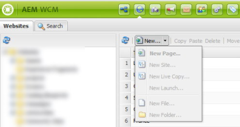
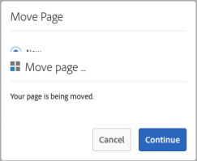

# [!DNL Adobe Experience Manager] 6.5 Opmerkingen bij de release Service Pack {#aem-service-pack-release-notes}

## Gegevens vrijgeven {#release-information}

| Producten | Adobe Experience Manager 6.5 |
| -------- | ---------------------------- |
| Versie | 6.5.6.0 |
| Type | Service Pack-release |
| Date | 3 september 2020 |
| URL downloaden | [Softwaredistributie](https://experience.adobe.com/#/downloads/content/software-distribution/en/aem.html?package=/content/software-distribution/en/details.html/content/dam/aem/public/adobe/packages/cq650/servicepack/aem-service-pkg-6.5.6-1.0.zip) |

## Wat is inbegrepen in Adobe Experience Manager 6.5.6.0 {#what-s-included-in-aem}

Adobe Experience Manager 6.5.6.0 is een belangrijke update die nieuwe eigenschappen, zeer belangrijke klant gevraagde verhogingen, en prestaties, stabiliteit, en veiligheidsverbeteringen omvat, die sinds de algemene beschikbaarheid van 6.5 versie in **april 2019** worden vrijgegeven. Deze kan boven op Adobe Experience Manager 6.5 worden geïnstalleerd.

De belangrijkste functies en verbeteringen die in Adobe Experience Manager 6.5.6.0 zijn geïntroduceerd, zijn:

* Het publiceren van de mappen voor middelenbijdragen van Brand Portal naar Experience Manager Assets wordt nu ook ondersteund via proxyserver.

* De automatisch gegenereerde groepen privémappen worden nu opgeschoond wanneer de persoonlijke map in wordt verwijderd [!DNL Experience Manager Assets].

* De beschrijvingen van modifiers in de video vooraf ingestelde redacteur zijn bijgewerkt in [!UICONTROL Viewer] [!DNL Dynamic Media].

* Een nieuw bedrijf wordt het plaatsen verstrekt om op de status van [!DNL Dynamic Media] schakelaar te wijzen.

* De standaardopties voor `test` en `aiprocess` worden bijgewerkt naar `Thumbnail`, van `Rasterize` voorheen in Dynamic Media, om ervoor te zorgen dat gebruikers alleen miniaturen hoeven te maken en de extractie van pagina&#39;s en trefwoorden moeten overslaan.

* Een adaptief formulier vooraf invullen op de client.

* Integratie van formuliergegevensmodellen met RESTful-API&#39;s op een server met 2-wegs SSL-implementatie.

* Verbeterd in cache plaatsen voor vertaalde adaptieve formulierpagina&#39;s.

* Ondersteuning voor Adobe Sign Text Tags in Automated Forms Conversion Service.

* Ondersteuning voor het converteren van gekleurde formulieren naar adaptieve formulieren [!DNL Automated Forms Conversion service].

* Steun voor SMB 2 en SMB 3 protocollen.

* De ingebouwde opslagplaats (Apache Jackrabbit Oak) wordt bijgewerkt naar versie 1.2.2.4.

Voor een volledige lijst van eigenschappen en verhogingen die in Experience Manager 6.5.6.0 worden geïntroduceerd, zie [Nieuw in Adobe Experience Manager 6.5 Service Pack 6](new-features-latest-service-pack.md).

Hier volgt een lijst met oplossingen uit de release van [!DNL Experience Manager] 6.5.6.0.

### [!DNL Sites] {#sites-6560}

* Selecteer een project in [!DNL Sites] of [!DNL Screens]en klik op [!UICONTROL Management Publications]. Gebruikers kunnen vanwege gebruikersinterfacefouten niet verdergaan in de [!UICONTROL Manage Publication] wizard. De [!UICONTROL Publish] optie werkt met name niet (NPR-34099).
* De positie van iParsys (Overerfd Systeem van de Paragraaf) wordt niet teruggekeerd aan zijn originele standaardpositie na het schrappen van [!UICONTROL Cancel Inheritance] of [!UICONTROL Disable Inheritance] opties (NPR-34097).
* Als het `RolloutConfigManagerFactoryImpl` niet een rollout config kan laden, probeert het niet om de ontbrekende vormen te laden. Het keert de caching configuraties (NPR-34092) terug.
* In de kerncomponent Text wordt na het gebruik van de HTML-bronbewerkingsoptie de klasse uit `em` tag verwijderd (NPR-34081).
* Na het upgraden van Experience Manager 6.3.3 naar Experience Manager 6.5.3 duurt het uitrolproces veel langer en mislukt de uitrol met een time-outfout (NPR-34049).
* De `htmlwriter` eigenschap codeert de kenmerkwaarden niet. De opmaak die aanwezig is in de XF-opmaak wordt geëxporteerd met gedecodeerde kenmerkwaarden (namelijk `"` in plaats van `&#34`). Het veroorzaakt kwesties op de kant van het Doel met Visuele Composer van de Ervaring die uitgevoerde XF (NPR-34048) gebruikt.
* Wanneer het bewegen van pagina&#39;s binnen [!DNL Experience Manager Sites], verbeter het registreren om de fout van de versieverwezenlijking met reden (NPR-34014) te vangen.
* Als [!DNL Rich Text Editor] alle tekst wordt verwijderd, wordt het alinealabel ook verwijderd (NPR-33976).
* Wanneer de `siteadmin` pagina (in de klassieke gebruikersinterface) wordt geopend of vernieuwd, zijn de opties in het `New` menu uitgeschakeld (NPR-33949).

   

* A [!DNL Content Fragment] kan niet worden gebruikt als een bestand `TemplatedResource` omdat het faalt in `ContentFragmentUsePojo` (NPR-33911).
* Synchrone en asynchrone verplaatsingsbewerkingen kunnen leiden tot fouten als gevolg van gelijktijdige overdrachten. Verplaatsen van pagina&#39;s is beperkt tot alleen synchroon verplaatsen. Hiermee wordt gelijktijdige verplaatsing van pagina&#39;s voorkomen (NPR-33875).
* [!UICONTROL Manage Publication] bewerking voor het repliceren van inhoud van de instantie Auteur naar instantie Publiceren mislukt en genereert een JavaScript-fout (NPR-33872).
* Wanneer u meerdere pagina&#39;s of middelen hebt geselecteerd om versies te maken, wordt de nieuwe versie alleen gemaakt voor de laatst geselecteerde pagina of het laatst geselecteerde element (NPR-33866).
* Verplaats een pagina met een blauwdruk met live kopieën naar een andere map. Wanneer u de afbeelding naar de oorspronkelijke map verplaatst, mislukt de verplaatsing zonder fout (NPR-33864).
* Wanneer de beweging actie wordt gebruikt om een Web-pagina in de [!DNL Sites] Console anders te noemen, toont het twee overlappende dialogen bij de laatste stap van de tovenaar (NPR-33831).

   

* De `cq:acLinks` eigenschappen en `cq:acUUID` eigenschappen voor [!DNL Adobe Campaign] de kopie worden tijdens kopiëren en plakken verwijderd (NPR-33794).
* Wanneer het proberen van een rollout op een kindpagina van een losgemaakte levende ouder exemplaar, [!DNL Experience Manager] produceert een ongeldige wijzeruitzondering (NPR-33676).
* De [!DNL RTE] componenten in een lay-outcontainer zijn niet zichtbaar wanneer de lay-outcontainer wordt gekopieerd en opnieuw op de pagina geplakt. De [!DNL RTE] componenten kunnen niet worden bewerkt, maar worden wel weergegeven wanneer de pagina wordt vernieuwd (NPR-33662).
* Wanneer u de grootte van een lay-outcomponent wijzigt voor verschillende (middelgrote en grote) onderbrekingspunten, gedraagt de lay-out zich niet zoals verwacht (NPR-33608).
* In de inline bewerkingsmodus in [!DNL RTE]werkt het slepen van een afbeelding niet voor de tekstcomponent (NPR-33602).
* Het is mogelijk om een component op een blauwdrukpagina met dezelfde naam als de paginanaam te maken. Tijdens rollout `_msm_moved` is achtervoegd om de naam van de component te wijzigen. De component wordt verplaatst naar het einde van de [!UICONTROL Paragraph System] (NPR-33535).
* Wanneer offTime of onTime op vele pagina&#39;s of activa wordt geplaatst, is het middel-intensief en vertraagt het systeem tijdens opstarten en sluiting (NPR-33482).
* Een gebruiker met CRUD-machtigingen op `/content/experience-fragment` kan een map niet verwijderen (NPR-33436).
* U kunt selecteren [!UICONTROL HTML & JSON] als optie voor [!UICONTROL Adobe Target export format] een bovenliggende map in de [!DNL Experience Fragments] sectie. Dezelfde eigenschappen worden weergegeven in een interface met aanraakfuncties voor de submappen van deze bovenliggende map. In CRXDE wordt echter alleen HTML weergegeven in plaats van `cq:adobeTargetExportFormat`weer te geven `html,json` (NPR-33423).
* Publiceren of Publiceren ongedaan maken van een pagina-alias wordt niet ondersteund. Verwijder de optie die anders lijkt te zijn (NPR-33415).
* Een specifieke tag kan van de ene locatie naar de andere worden verplaatst in [!DNL Experience Manager]. Deze kan ook op verschillende pagina&#39;s worden toegepast vóór en na het verplaatsen. Wanneer u de eigenschappen van de pagina&#39;s bewerkt, wordt de tag niet weergegeven voor bewerking, ook al is de tag gelijk (NPR-33353).
* Een paginasjabloon wordt niet correct weergegeven wanneer een lay-outcontainer wordt verwijderd uit een sjabloon die meerdere lay-outcontainers bevat (NPR-33347).
* Probeer in de sjablooneditor een sjabloon te verwijderen die door meer dan 100000 pagina&#39;s onder wordt gebruikt `/content/`. Er wordt een fout weergegeven zonder foutbericht (NPR-33312).
* Omleiden naar [!DNL Experience Manager] pagina met anker werkt niet op instantie Auteur omdat een queryreeks wordt `PageRedirectServlets` geplaatst na een URL-fragment of een anker (NPR-34288).
* Als u een merk onder `/content/campaign` de maat maakt, ontstaat een structuur die het niet mogelijk maakt campagnes te maken. [!UICONTROL Create Brand] Het nieuwe merk kan niet worden gemaakt [!UICONTROL Offers and Activities] omdat er geen [!UICONTROL Create] optie is (NPR-34113).
* U kunt de weergave [!DNL Live Copy] van een pagina opschorten en de overerving wordt verbroken in de modus Editor. In de pagina-eigenschappen geeft het pictogram dat overerving vertegenwoordigt onjuist aan dat de overerving bestaat en niet wordt verbroken (NPR-34017).
* Pagina&#39;s met veel verwijzingen kunnen niet asynchroon worden verplaatst en soms mislukt de verplaatsingsbewerking (CQ-4297969).
* Een webpagina met `/` teken in de URL reageert niet tijdens het ontwerpen. Wanneer een component tijdens het ontwerpen wordt toegevoegd, neemt het CPU-gebruik toe en reageert de browser niet meer (CQ-4295749).
* In de modus Bladeren wordt een waarde die u in het menu Type/Grootte hebt geselecteerd, niet door NVDA van commentaar voorzien. De visuele focus is niet op het geselecteerde element. Gebruikers die op een schermlezer vertrouwen, kunnen de modus Bladeren niet gebruiken (CQ-4294993).
* Gebruikers kunnen een [!UICONTROL Content Page] sjabloon selecteren wanneer ze een webpagina maken. Op het [!UICONTROL Social Media] tabblad selecteren gebruikers een [!UICONTROL Preferred XF variation]. Gebruikers kunnen geen toetsenbordtoetsen gebruiken om een Experience Fragment in de NVDA-bladermodus te selecteren (CQ-4292669).
* De handbalkbibliotheek is bijgewerkt naar versie 4.7.3 (NPR-34484) met meer beveiliging.

### [!DNL Assets] {#assets-6560}

**Toegankelijkheidsverbeteringen in Experience Manager-elementen**

* Met de toetsenbordtoetsen kunnen gebruikers nu toegang krijgen tot de interactieve gebruikersinterfaceopties in de [!UICONTROL References] lijst met middelen (NPR-34115).

* De schermlezer kondigt nu de bedoelde actie aan van de voorspelling op de zoekpagina (NPR-34104).

* De pagina met zoekresultaten en de pagina met zoekresultaten hebben nu meer informatieve titels voor een beter begrip van schermlezers (NPR-34093).

* Schermlezers kondigen nu de opties aan om de geselecteerde labels op het [!UICONTROL Basic] [!UICONTROL Properties] tabblad van de elementpagina te verwijderen (NPR-33972).

* De elementen in elke rij in de lijstweergave worden nu door schermlezers aangekondigd als de elementen van dezelfde rij (NPR-33932).

* Wanneer de gebruiker met `Tab` Key navigeert, wordt nu de optie Sluiten in de voorvertoning van de versie gebruikt (NPR-33863).

* De focus van de gebruiker wordt nu naar het zoekpictogram verplaatst nadat het onderzoek is gesloten (NPR-33705).

* De opties voor de gebruikersinterface die u kunt activeren, hebben nu een prominentere visuele focus met verbeterd contrast wanneer u navigeert met behulp van toetsenbordtoetsen. De gebruikers van het toetsenbord kunnen de gebieden met focus identificeren (NPR-33542).

* De sleepfunctionaliteit met het toetsenbord werkt nu in [!UICONTROL Metadata Schema Editor] de bladermodus van schermlezers (CQ-4296326).

* In het dialoogvenster voor het delen van koppelingen navigeert u in de bladermodus door een schermlezer.

   * De tabelinformatie wordt niet van commentaar voorzien zodra het dialoogvenster is geladen.

   * Kan naar alle vermelde automatische suggesties navigeren.

   * Hiermee worden de weergegeven automatische suggesties voor de [!UICONTROL Add Email Address/Search] (CQ-4294232) weergegeven.

* Als u de `Esc` toets gebruikt om de snelactiepictogrammen uit de kaartweergave te verwijderen, wordt de toetsenbordfocus niet langer van het laatste item met focus verwijderd (CQ-4293554).

* Voor interactieve opties in de gebruikersinterface worden nu het doel van de pictogrammen door de schermlezer aangegeven in plaats van de letterlijke namen (CQ-4272943).

* De toetsenbordfocus wordt nu met succes verplaatst naar [!UICONTROL Flyout], [!UICONTROL InlineZoom], [!UICONTROL Shoppable_Banner], [!UICONTROL Zoom_dark], [!UICONTROL Zoom_light], [!UICONTROL ZoomVertical_dark], en [!UICONTROL ZoomVertical_light] opties wanneer u navigeert met de Tab-toets op het toetsenbord in de elementdetails [!UICONTROL Viewers] in [!DNL Dynamic Media] (CQ-4290605).

* [!UICONTROL Save & Close] op de elementpagina kan nu worden geopend met [!UICONTROL Properties] toetsenbordtoetsen (NPR-34107).

* Foutberichten als gevolg van onjuiste combinaties van gebruikersnaam en wachtwoord op de aanmeldingspagina worden nu door schermlezers gemeld wanneer de fout optreedt (NPR-33722).

* In [!DNL Experience Manager] koptekstsectie kondigt de schermlezer nu in de modus Bladeren aan dat:

   * Suggesties die automatisch worden bewerkt in [!UICONTROL Type to search] Omnsearch.

   * De toestand zoals deze is uitgevouwen of samengevouwen voor opties [!UICONTROL Solutions], [!UICONTROL Help], [!UICONTROL Inbox]en [!UICONTROL User] .

   * Het [!UICONTROL Searching Help] statusbericht dat wordt weergegeven wanneer de gebruiker een zoektekenreeks in het [!UICONTROL Search for Help] veld onder [!UICONTROL Help] optie invoert.

   

   *Afbeelding:[!UICONTROL Search for Help]in[!UICONTROL Help].*

   * Het foutbericht als een onjuiste waarde wordt ingevoerd in het [!UICONTROL Impersonate as] veld onder [!UICONTROL User] optie en de focus correct wordt verplaatst naar het tekstveld (NPR-33804).

   

   *Afbeelding:[!UICONTROL Impersonate as]veld in[!UICONTROL User]menu in koptekst.*

* De gebruiker kan nu de focus wijzigen met het toetsenbord binnen:

   * [!UICONTROL Search/Add Email Address] in het [!UICONTROL Link Sharing] dialoogvenster.

   * [!UICONTROL Add User or Group] veld onder [!UICONTROL Closed User Group] op het [!UICONTROL Permissions] tabblad Map [!UICONTROL Properties] (NPR-34452).

**In Experience Manager Assets opgeloste emissies**

[!DNL Adobe Experience Manager] 6.5.6.0 [!DNL Assets] biedt oplossingen voor de volgende problemen:

* Annotaties worden niet gemarkeerd wanneer deze worden geselecteerd in de tijdlijn van het element (CQ-4302422).

* Voorvertoning van marketingonderpandselementen (zoals brochure, Flyer en Business card) die met [!DNL Adobe InDesign] template zijn gemaakt, geeft geen regeleinden en alinea-einden weer (NPR-34268).

* Het uitnemen van tekst en dus het zoeken naar de geüploade PDF-bestanden in volledige tekst werkt niet (NPR-34164). Start de [!DNL sAdobe Experience Manager] implementatie opnieuw nadat u Service Pack 6 hebt geïnstalleerd om dit probleem te verhelpen.

* In de tijdlijn van elementen die uit meerdere pagina&#39;s bestaan, worden annotaties weergegeven die op alle subelementen zijn toegepast wanneer u in het element bladert in de tijdlijnweergave, in plaats van de annotaties weer te geven die specifiek zijn voor de specifieke subelementen (NPR-34100).

* De omslagen van activa worden niet gepubliceerd gebruikend [!UICONTROL Manage Publication] optie als de omslagen middelen in JavaScript, CSS, of JSON dossierformaten (NPR-34090) bevatten.

* Wanneer u de selectie of het verwijderen van de toegepaste tags of filters in Omnsearch opheft, wordt de zoekquery meerdere keren uitgevoerd. Dit leidt tot een langere zoektijd (NPR-34078).

* In de kaartweergave wanneer een workflow (op een middel in een map) wordt uitgevoerd of in behandeling is, wordt de pagina opnieuw geladen totdat de workflow is voltooid of beëindigd. Auteurs kunnen dan ook niet werken met die middelen in de map waarvoor ze moeten schuiven (NPR-33986).

* Als de gebruiker een gepubliceerd element naar een nieuwe locatie verplaatst, wordt het element opnieuw gepubliceerd, zelfs als de [!UICONTROL Republish] optie is uitgeschakeld. Dit leidt tot vele zwevende elementen die op de publicatie-instantie liggen. Het standaardgedrag is echter dat de publicatie van een gepubliceerd element automatisch wordt ongedaan gemaakt door de verplaatsingsbewerking. dit element wordt opnieuw gepubliceerd als de auteur de [!UICONTROL Republish] optie selecteert wanneer het middel wordt verplaatst (NPR-33934).

* De [!UICONTROL Move Assets] pagina voor elementen in verzamelingen laadt niet alle HTML-inhoud, zoals [!UICONTROL Adjust/ Republish] option. Daarom kunnen gebruikers de verplaatsingsbewerking niet voltooien (NPR-33860).

* Als u een element verplaatst en speciale tekens toevoegt in de naam en de titel van de verplaatste elementen, wordt een extra map (met dezelfde naam) gemaakt op de nieuwe locatie van het element (NPR-33826).

* [!UICONTROL Download] wordt uitgeschakeld wanneer de [!UICONTROL Email] optie is geselecteerd in het [!UICONTROL Download] dialoogvenster (NPR-33730).

* De fout &quot;Request-URI too long&quot; wordt waargenomen bij het uitvoeren van bulkbewerkingen op elementen, zoals het bewerken van bulkmetagegevens (NPR-33723).

* Er is een JavaScript-fout opgetreden en gebruikers kunnen de keuzes die in het [!UICONTROL Dropdown] veld worden gegenereerd door [!UICONTROL Add through JSON path] [!UICONTROL Folder Metadata Schema Form Editor]functionaliteit in het bestand, niet selecteren of verwijderen als het geüploade JSON-bestand ruimte of speciale tekens bevat (NPR-33712).

* De statische rendities van elementen worden niet bijgewerkt wanneer element wordt bijgewerkt met behulp van [!UICONTROL Open] optie in [!DNL desktop app] of [!DNL Adobe Asset Link] en worden gesynchroniseerd met [!DNL Adobe Experience Manager] (CQ-4296279).

* In de kolomweergave worden met de verplaatsingsbewerking voor een set elementen ook de elementen verplaatst die zijn geselecteerd voordat de [!UICONTROL Filter] optie voor deze elementen wordt gebruikt. Houd er rekening mee dat bij gebruik van [!UICONTROL Filter] deze optie de selectie van de vorige selectie wordt opgeheven (NPR-34018).

* Backslashes worden toegevoegd vóór speciale tekens in zoeksuggesties voor elementen, die speciale tekens in hun naam hebben (NPR-33834).

* Bij het maken van regels voor vervolgkeuzelijsten in [!UICONTROL Folder Metadata Schema Form]kan de gebruiker geen waarden in [!UICONTROL Field Choices] kolom selecteren (CQ-4297530).

* De runtime kopie van het aangepaste workflowmodel voor middelen (gemaakt in `/var/workflow/models/dam`) wordt verwijderd wanneer u [!DNL Experience Manager] 6.5 Service Pack 5 of een vorige versie installeert op [!DNL Experience Manager] 6.5 (NPR-34532). Als u de runtimekopie wilt ophalen, synchroniseert u de ontwerptijdkopie van het workflowmodel met de runtimekopie met de HTTP-API:
   `<designModelPath>/jcr:content.generate.json`.

**In dynamische media opgeloste problemen**

* Als de gebruiker de coderingsinstellingen definieert in bewerkingen nadat het videoprofiel is gemaakt, worden de instellingen voor slimme uitsnijdingen verwijderd uit videoprofielen (CQ-4299177).

* Elementen flikkeren bij het laden van de pagina wanneer de gebruiker schakelt tussen opties aan de zijkant (bijvoorbeeld, [!UICONTROL Overview], [!UICONTROL Timeline], [!UICONTROL Viewers]) op de pagina met informatie over elementen (NPR-34235).

* De volgende problemen worden waargenomen bij het opnieuw verwerken van de taak:

   * Taak-id ontbreekt in taakgreep die wordt geretourneerd door herverwerkingstaak.

   * Alleen bestandsnaam en niet volledig pad worden opnieuw verwerkt in taak voor videologboeken.

   * Herverwerkingstaak heeft geen optie om het elementtype als statisch in te stellen.

   * `ExcludeFromAVS` geen optie is opgegeven (CQ-4298401).

* De functie Slim uitsnijden mislukt met een fout wanneer een afbeeldingsprofiel wordt toegevoegd aan een map met meerdere (bijvoorbeeld 11) hoogte-breedteverhoudingen (NPR-34082).

* De workflow met DAM-updatebestanden wordt geactiveerd wanneer de gebruiker op het [!UICONTROL Workflow Archive] tabblad op de pagina omlaag schuift in [!UICONTROL Workflow] de configuratie [!UICONTROL Tools] [!DNL Adobe Experience Manager] met Dynamic Media Scene7 (CQ-4299727).

* Symbolen op het [!UICONTROL Behavior] tabblad [!UICONTROL Viewer Preset Editor] zijn niet gelokaliseerd (CQ-4299026).

* In de hoofdweergave wordt de afbeelding in een onjuiste lay-out weergegeven die niet in de viewer past, als de viewer in de responsieve modus staat (CQ-4298293).

* Wijzigingen in voorinstellingen voor afbeeldingen worden [!UICONTROL Adobe Experience Manager] niet gesynchroniseerd met Scene7 Publishing System (CQ-4299713).

### [!DNL Commerce] {#commerce-6560}

* Koppelingen naar activa van producten worden niet geheroriënteerd wanneer activa worden verplaatst (NPR-34098).

### Platform {#platform-6560}

* Kan logboeken niet downloaden met het hulpprogramma Diagnosis op een geüpgrade Experience Manager-instantie (NPR-34336).
* De upgrade mislukt vanwege een fout vanwege afhankelijkheden van een specifieke versie van het `cq-wcm-api` basispakket (CQ-4300520).
* De standaardwaarden voor de **[!UICONTROL Connect Timeout]** **[!UICONTROL Socket Timeout]** en de montages voor de StandaardConfiguratie van de Agent (publiceren) worden niet gespecificeerd (NPR-33707).
* Updates van de toewijzingsconfiguratie onder `/etc/map.publish` zijn niet beschikbaar op de sitepagina&#39;s (NPR-34015).
* [De API-referentiedocumentatie](https://helpx.adobe.com/experience-manager/6-5/sites/developing/using/reference-materials/javadoc/com/day/cq/tagging/package-summary.html) bevat niet de documentatie voor het `com.day.cq.tagging` pakket (CQ-4295864).

### User Interface {#ui-6560}

* In de interface van de browser Offloading worden niet alle taakonderwerpen weergegeven (NPR-34308).
* De Browser van de Configuratie interface toont niet alle configuraties (NPR-33644).
* Wanneer u op de `Esc` toets drukt terwijl u naar gebruikers zoekt om zich te laten nadoen, wordt het **[!UICONTROL User]** dialoogvenster gesloten in plaats van de gebruikerslijst (NPR-34084).

### Integrations {#integrations-6560}

* Activiteiten met lange namen worden niet gesynchroniseerd met [!DNL Adobe Target] (NPR-34254).

### Omzettingsprojecten {#translation-6560}

* Er wordt geen vertaalproject gemaakt als de gebruiker speciale tekens `authorizableID` bevat (NPR-33828).

### Sling {#sling-6560}

* Health Check en Pattern Detector hebben overlappende functionaliteit. Hierdoor wordt de gezondheidscontrole uit het product verwijderd (NPR-33928).

### WCM {#wcm-6560}

* Elementaire componenten - Wanneer u een component met een basisafbeelding aan een pagina toevoegt en naar een afbeelding verwijst, werkt de `Undo` bewerking niet (NPR-34516).

* Kan de bewerking Pagina verplaatsen niet gebruiken (CQ-4303028).

### [!DNL Communities] {#communities-6560}

* Bij het delen van een artikel op sociale media is de optie Google+ verouderd (NPR-33877).

* Lid van de Gemeenschap kan groepsmalplaatje of andere montages van de Functie van de Groep niet wijzigen (NPR-33530).

* Hyperlink-tags op afbeeldingen worden niet correct gegenereerd in een forumbericht (NPR-33464).

* Toegankelijkheidsproblemen worden geïdentificeerd in de communautaire toewijzingsfunctie (NPR-33442).

* De bestaande gebruikers van een communautaire groep die via admin console wordt toegevoegd worden verwijderd uit de gebruikerslijst op om het even welke wijziging in de communautaire groepsconsole (NPR-34315).

<!--
* Tag filters are vulnerable to sensitive information disclosure (NPR-33868).
-->

### [!DNL Forms] {#forms-6560}

>[!NOTE]
>
>[!DNL Experience Manager] Service Pack bevat geen oplossingen voor [!DNL Forms]. Ze worden geleverd met een apart [!DNL Forms] invoegpakket. Daarnaast wordt een cumulatief installatieprogramma uitgebracht dat oplossingen voor [!DNL Experience Manager Forms] JEE bevat. Zie de invoegtoepassing [AEM Forms](#install-aem-forms-add-on-package) installeren en AEM Forms in JEE [installeren voor meer informatie](#install-aem-forms-jee-installer).

Na installatie van het [!DNL Experience Manager Forms] 6.5.6.0-invoegpakket:

* Stop de [!DNL Experience Manager Forms] instantie.

* Verwijder `bcpkix-1.51`-, `bcmail-1.51`- en `bcprov-1.51` JAR-bestanden uit de `crx-repository\launchpad\ext` map.

* Eigenschap verwijderen` sling.bootdelegation.class.org.bouncycastle.jce.provider.BouncyCastleProvider` uit het `sling.properties` bestand.

* Start de [!DNL Experience Manager Forms] instantie opnieuw.

**Adaptieve Forms**

* Als er een ontbrekend adaptief formulierfragment is, kan het adaptieve formulier niet worden weergegeven (NPR-34302).

* In de beschrijving van Help-inhoud voor adaptieve formuliervelden wordt een alinea-HTML-tag weergegeven (NPR-34116).

* Wanneer u de **[!UICONTROL Revalidate on Server]** eigenschap selecteert, wordt het adaptieve formulier niet verzonden (NPR-33876).

* De handeling **[!UICONTROL Submit to REST endpoint]** submit werkt niet voor een adaptief formulier (CQ-4299044).

* Toegankelijkheid: Wanneer u een adaptief formulier probeert te verzenden zonder een bijlage voor een verplicht veld te uploaden, wordt de focus niet automatisch naar het bijlageveld (CQ-4298065).

* Wanneer u rijen toevoegt aan een tabel van een adaptief formulier, geven de opties **[!UICONTROL Add to top]** **[!UICONTROL Add to bottom]** en opties niet de juiste resultaten weer (CQ-4297511).

* Het [!UICONTROL Value Commit] script wordt onjuist geactiveerd, wat resulteert in gegevensverlies in een adaptieve vorm (CQ-4296874).

* De Datumkiezer werkt niet correct voor gelokaliseerde adaptieve formulieren (NPR-34333).

* Als de bestandsnaam een onderstrepingsteken of een spatie bevat, kunt u het bestand niet aan een adaptief formulier koppelen (CQ-4301001).

* Wanneer een genest herhaalbaar deelvenster meer voorvallen heeft dan het bovenliggende deelvenster, wordt het geneste herhaalbare deelvenster niet voorafgegaan (NPR-33666).

* Aangepaste formulieren hebben enkele open resourceoplossers. Deze leiden tot mislukte indiening. Het probleem doet zich af en toe voor (CQ-4299407).

* Wanneer u de veldconfiguratie voor het eerst opent, wordt het eigenschappenpictogram niet weergegeven (CQ-4296284).

**Workflow**

* Wanneer een werkstroomfiatteur een bijlage uploadt, wordt de naam van de bijlage gewijzigd in `undefined` (NPR-33699).

* [!DNL Experience Manager] De werkstroom leegmaken mislukt en geeft het volgende foutbericht weer (NPR-33575):

   `java.lang.UnsupportedOperationException: The query read more than 500000 nodes in memory`

* [!DNL Experience Manager Forms] app voor het [!DNL Windows] stoppen met reageren nadat een formulier is verzonden (NPR-34409).

* Wanneer u AEM Service Pack installeert, wordt de lijst **Te doen** van punten niet getoond als verbindingen. De tekst voor de items **Aan taak** bevat HTML-tags (NPR-34317).

**Interactieve communicatie**

* Wanneer u een tekstdocumentfragment met geneste herhaalbare componenten opneemt, kan de interactieve communicatie niet worden opgeslagen (NPR-34095).

**Correspondentenbeheer**

* Wanneer u een fragment van het tekstdocument wijzigt dat de waarden van het gegevenswoordenboek omvat, houdt UI van de Agent op antwoordend (NPR-33930).

* Inhoud kopiëren en plakken van een [!DNL Microsoft Word] document naar een tekstdocumentfragment in een letter resulteert in opmaakproblemen (NPR-33536).

**Document Services**

* Wanneer u een PDF-bestand genereert op basis van een XDP-bestand met Output- en Forms-services, resulteert dit in ontbrekende en overlappende tekst (NPR-34237, CQ-4299331).

* Wanneer u een HTML-bestand converteert naar PDF, kan het `MaxReuseCount` kenmerk niet worden geconfigureerd (NPR-33470).

* Wanneer u een PDF-bestand downloadt dat interactieve functies voor extensies voor Readers bevat, kunt u geen bijlage aan het PDF-bestand toevoegen met [!DNL Adobe Reader] (NPR-33729).

**Documentbeveiliging**

* Kan de ondertekeningsbewerking met op HSM gebaseerde certificaten niet uitvoeren in een PDF-bestand nadat [!DNL Experience Manager] Service Pack (NPR-34310) is geïnstalleerd.

**Designer**

* Kan XForms niet openen in Designer versie 6.5.x (CQ-4295322).

* Wanneer u Designer opent, wordt in het welkomstscherm een onjuist jaar weergegeven (CQ-4295289).

* Wanneer u [!DNL Acrobat DC] op de server installeert, is de **[!UICONTROL Distribute Form]** optie inactief (CQ-4296304).

Voor informatie over veiligheidsupdates, zie de pagina [van bulletins van de](https://helpx.adobe.com/security/products/experience-manager.html)Experience Manager veiligheid.

## 6.5.6.0 installeren {#install}

**Installatievereisten**

* AEM 6.5.6.0 vereist AEM 6.5. Zie [upgradedocumentatie](/help/sites-deploying/upgrade.md) voor gedetailleerde instructies.
* De download van het de dienstpak is beschikbaar op de Distributie [van de](https://experience.adobe.com/#/downloads/content/software-distribution/en/aem.html)Software van Adobe.
* Voor een plaatsing met MongoDB en veelvoudige instanties, installeer AEM 6.5.6.0 op één van de instanties van de Auteur gebruikend de Manager van het Pakket.
* Maak voordat u gaat installeren een momentopname of een nieuwe back-up van de AEM.
* Start de instantie opnieuw voor de installatie. Hoewel dat alleen nodig is wanneer de instantie zich nog in de updatemodus bevindt (en dit is het geval wanneer de instantie uit een eerdere versie is bijgewerkt), wordt aangeraden of de instantie langer actief was.

>[!NOTE]
>
>Adobe raadt u niet aan het Adobe Experience Manager 6.5.6.0-pakket te verwijderen of te verwijderen.

### Het Service Pack installeren {#install-service-pack}

Voer de volgende stappen uit om het Service Pack op een bestaande Adobe Experience Manager 6.5-instantie te installeren:

1. Download het de dienstpak van de Distributie van de [Software](https://experience.adobe.com/#/downloads/content/software-distribution/en/aem.html?package=/content/software-distribution/en/details.html/content/dam/aem/public/adobe/packages/cq650/servicepack/aem-service-pkg-6.5.6-1.0.zip).

1. Open Package Manager en klik **[!UICONTROL Upload Package]** om het pakket te uploaden. Zie [Package Manager](https://docs.adobe.com/content/help/en/experience-manager-65/administering/contentmanagement/package-manager.html)voor informatie over het gebruik ervan.

1. Selecteer het pakket en klik **[!UICONTROL Install]**.

>[!NOTE]
>
>Vanwege een bekende uitgave is een bijgewerkt Service Pack-pakket beschikbaar. U wordt aangeraden het pakket te installeren.

>[!NOTE]
>
>De dialoog over de Manager UI van het Pakket bestaat soms tijdens de installatie van het de dienstpak. Adobe raadt aan dat u op foutenlogboeken wacht om zich te stabiliseren alvorens tot de plaatsing toegang te hebben. Wacht op de specifieke logboeken met betrekking tot het verwijderen van de updaterbundel alvorens wordt verzekerd dat de installaties succesvol zijn. Dit gebeurt meestal op, [!DNL Safari] maar kan soms gebeuren in elke browser.

**Automatische installatie**

Er zijn twee manieren om Adobe Experience Manager 6.5.6.0 automatisch op een werkexemplaar te installeren:

A. Plaats het pakket in de `../crx-quickstart/install` map wanneer de server online beschikbaar is. Het pakket wordt automatisch geïnstalleerd.

B. Gebruik de [HTTP-API van Package Manager](https://docs.adobe.com/content/docs/en/crx/2-3/how_to/package_manager.html). Gebruik deze optie `cmd=install&recursive=true` om de geneste pakketten te installeren.

>[!NOTE]
>
>Adobe Experience Manager 6.5.6.0 biedt geen ondersteuning voor Bootstrap-installatie.

**Installatie valideren**

1. Op de pagina met productinformatie (`/system/console/productinfo`) wordt de bijgewerkte versietekenreeks `Adobe Experience Manager (6.5.6.0)` onder weergegeven [!UICONTROL Installed Products].

1. Alle bundels OSGi zijn of **[!UICONTROL ACTIVE]** of **[!UICONTROL FRAGMENT]** in de Console OSGi (de Console van het Web van het Gebruik: `/system/console/bundles`).

1. De bundel OSGi `org.apache.jackrabbit.oak-core` is versie 1.22.3 of later (de Console van het Web van het Gebruik: `/system/console/bundles`).

Zie de [technische vereisten](/help/sites-deploying/technical-requirements.md)voor informatie over de platforms die zijn gecertificeerd voor deze release.

### Adobe Experience Manager Forms-invoegtoepassing installeren {#install-aem-forms-add-on-package}

>[!NOTE]
>
>Sla dit over als u AEM Forms niet gebruikt. Correcties in Adobe Experience Manager Forms worden geleverd via een afzonderlijk invoegpakket.

1. Controleer of u het Adobe Experience Manager Service Pack hebt geïnstalleerd.
1. Download het overeenkomstige Forms add-on pakket dat in [AEM Forms-releases](https://helpx.adobe.com/aem-forms/kb/aem-forms-releases.html) voor uw besturingssysteem wordt vermeld.
1. Installeer het invoegpakket voor Forms zoals beschreven in de [invoegtoepassing](../forms/using/installing-configuring-aem-forms-osgi.md#install-aem-forms-add-on-package)voor AEM Forms installeren.

### Adobe Experience Manager Forms installeren op JEE {#install-aem-forms-jee-installer}

>[!NOTE]
>
>Sla dit over als u AEM Forms niet gebruikt op JEE. Correcties in Adobe Experience Manager Forms op JEE worden via een afzonderlijk installatieprogramma geleverd.

Voor informatie over het installeren van het cumulatieve installatieprogramma voor Experience Manager Forms op JEE en configuratie na de implementatie, zie de [versienota&#39;s voor flard 0018](jee-patch-installer-65.md).

### UberJar {#uber-jar}

UberJar voor Experience Manager 6.5.6.0 is beschikbaar in de [Centrale bewaarplaats](https://repo.maven.apache.org/maven2/com/adobe/aem/uber-jar/6.5.6-1.0/)van Maven.

Om UberJar in een Geweven project te gebruiken, zie [hoe te UberJar](/help/sites-developing/ht-projects-maven.md) gebruiken en omvat het volgende gebiedsdeel in uw projectPOM:

```shell
<dependency>
      <groupId>com.adobe.aem</groupId>
      <artifactId>uber-jar</artifactId>
      <version>6.5.6-1.0</version>  
      <scope>provided</scope>
</dependency>
```

>[!NOTE]
>
>Vanaf deze release zijn UberJar en andere verwante artefacten beschikbaar in Maven Central Repository in plaats van in Adobe Public Maven repository (repo.adobe.com). De naam van het hoofdbestand van UberJar wordt gewijzigd in `uber-jar-<version>.jar`. Als gevolg hiervan is er geen `classifier`waarde, met `apis` als waarde, voor de `dependency` tag.

## Deprecated features {#removed-deprecated-features}

Deze sectie maakt een lijst van eigenschappen en mogelijkheden die als verouderd met Experience Manager 6.5.6.0 zijn gemerkt. Functies die volgens plan in een toekomstige versie zullen worden verwijderd, worden eerst op afgekeurd ingesteld, met een andere optie die moet worden gebruikt.

Klanten wordt aangeraden na te gaan of zij in hun huidige implementatie gebruik maken van de functie of het vermogen en plannen maken om hun implementatie te wijzigen en de alternatieve optie te gebruiken.

| Gebied | Functie | Vervanging |
|---|---|---|
| Integrations | Het **[!UICONTROL AEM Cloud Services Opt-In]** scherm is afgekeurd. Met de integratie van de AEM en van het Doel in AEM 6.5 wordt bijgewerkt om de Standaard API van het Doel te steunen, die authentificatie via Adobe IMS en I/O gebruikt, en de groeiende rol van de Lancering van de Adobe voor het van instrumenten voorzien van AEM pagina&#39;s voor analyse en verpersoonlijking, is de Opt-In tovenaar functioneel irrelevant geworden. | Configureer systeemverbindingen, Adobe IMS-verificatie en Adobe I/O-integratie via de respectievelijke AEM-cloudservices. |
| Connectors | De Adobe JCR-connector voor Microsoft SharePoint 2010 en Microsoft SharePoint 2013 is vervangen door AEM 6.5. | N.v.t. |

## Known issues {#known-issues}

* Als de beveiligingscontrole niet werkt en het systeem het volgende foutbericht weergeeft:
   `message: Could not verify users and could not test system account logins.`
Voer de volgende stappen uit om het probleem op te lossen:
   1. Ga naar https://&lt;*hostname*>:&lt;*port*>/system/console/configMgr.

   1. Search for `hc.impl`.

   1. Klik [!UICONTROL Service Mappings]en geef op `+` `com.adobe.granite.repository.hc.impl=[user-reader-service]`.

   1. Klik [!UICONTROL Save] om de configuratie op te slaan.

* Als u [!DNL Experience Manager] 6.5 Service Pack 5 of een vorig de dienstpak op [!DNL Experience Manager] 6.5 installeert, wordt het runtime exemplaar van uw activa aangepaste werkschemamodel (gecreeerd in `/var/workflow/models/dam`) geschrapt.
Om uw runtime exemplaar terug te winnen, stelt Adobe voor om het exemplaar van de ontwerptijd van het model van het douanewerkschema met zijn runtime exemplaar te synchroniseren gebruikend HTTP API:
   `<designModelPath>/jcr:content.generate.json`.

* Neem contact op met de Adobe-ondersteuning als er problemen optreden tijdens het bewerken en maken van trapsgewijze regels in [!UICONTROL Folder Metadata Schema Forms Editor] en [!UICONTROL Metadata Schema Forms Editor] via het [!UICONTROL Define Rule] dialoogvenster. De regels die al zijn gemaakt en opgeslagen, werken zoals u had verwacht.

* Als de naam van een map in de hiërarchie wordt gewijzigd [!DNL Experience Manager Assets] en de geneste map met een element wordt gepubliceerd naar [!DNL Brand Portal], wordt de titel van de map pas bijgewerkt [!DNL Brand Portal] als de hoofdmap opnieuw wordt gepubliceerd.

* Wanneer een gebruiker een veld voor het eerst in een adaptief formulier configureert, wordt de optie voor het opslaan van een configuratie niet weergegeven in de eigenschappenbrowser. Als u een ander veld van het adaptieve formulier in dezelfde editor selecteert, wordt het probleem opgelost.

* Als de [!UICONTROL Connected assets configuration] tovenaar een 404 foutenmelding na installatie terugkeert, installeer manueel de `cq-remotedam-client-ui-content` en de `cq-remotedam-client-ui-components` pakketten opnieuw gebruikend de Manager van het Pakket.

* De volgende fouten en waarschuwingsberichten kunnen tijdens de installatie van AEM 6.5.x.x worden weergegeven:
   * &quot;Wanneer de integratie van het Doel in AEM gebruikend StandaardAPI van het Doel (authentificatie IMS) wordt gevormd, dan leidt het uitvoeren van de Fragmenten van de Ervaring naar Doel in verkeerde aanbiedingstypes die worden gecreeerd. In plaats van het type &quot;Experience Fragment&quot;/bron &quot;Adobe Experience Manager&quot; maakt Target verschillende aanbiedingen met het type &quot;HTML&quot;/source &quot;Adobe Target Classic&quot;.
   * `com.adobe.granite.maintenance.impl.TaskScheduler`: Geen onderhoudsvensters gevonden bij graniet/bediening/onderhoud.
   * De adaptieve servervalidatie van het formulier mislukt wanneer statistische functies zoals SUM, MAX en MIN worden gebruikt. CQ-4274424
   * `com.adobe.granite.maintenance.impl.TaskScheduler` - Geen onderhoudsvensters gevonden bij graniet/bediening/onderhoud.
   * Hotspot in een interactieve afbeelding voor dynamische media is niet zichtbaar wanneer u een voorvertoning van het element weergeeft via de Shopable Banner-viewer.

## OSGi-bundels en inhoudspakketten inbegrepen {#osgi-bundles-and-content-packages-included}

De volgende tekstdocumenten maken een lijst van de bundels OSGi en de Pakketten van de Inhoud inbegrepen in AEM 6.5.6.0:

* [Lijst van OSGi-bundels opgenomen in AEM 6.5.6.0](assets/6560_bundles.txt)

* [Lijst van inhoudspakketten opgenomen in AEM 6.5.6.0](assets/6560_packages.txt)

## Beperkte locaties {#restricted-sites}

Deze sites zijn alleen beschikbaar voor klanten. Als u een klant bent en toegang nodig hebt, neemt u contact op met uw Adobe-accountmanager.

* [Productdownload op licensing.adobe.com](https://licensing.adobe.com/)
* [Neem contact op met de klantenondersteuning](https://docs.adobe.com/content/help/en/customer-one/using/home.html)Voor meer informatie over de toegang tot het ondersteuningsportaal raadpleegt u [Toegang tot het ondersteuningsportal](https://helpx.adobe.com/experience-manager/kb/accessing-aem-support-portal.html).

>[!MORELIKETHIS]
>
>* [Opmerkingen bij de release AEM 6.5](/help/release-notes/release-notes.md)
>* [AEM productpagina](https://www.adobe.com/marketing/experience-manager.html)
>* [AEM 6.5-documentatie](https://helpx.adobe.com/nl/support/experience-manager/6-5.html)
>* Abonneren op [Adobe-productupdates met prioriteit](https://www.adobe.com/subscription/priority-product-update.html)

